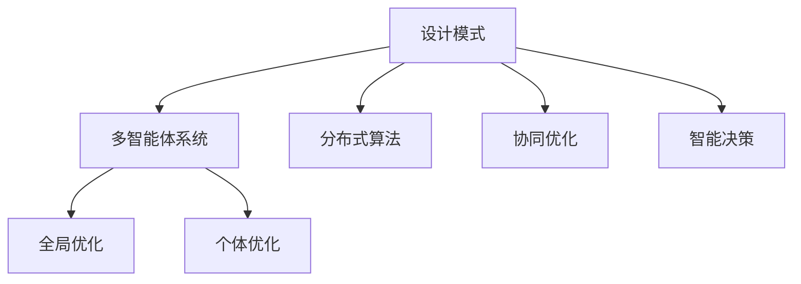

                 

# 综合设计模式：反思、规划与多智能体协同的结合

> 关键词：设计模式,多智能体系统,协同优化,分布式算法,智能决策

## 1. 背景介绍

### 1.1 问题由来

在现代复杂系统中，智能体的多样性和交互性日益增强，单一的决策中心难以应对快速变化的复杂环境。多智能体系统(Multi-Agent Systems,MAS)通过智能体间的协同合作，极大地提升了系统的反应速度和适应性。然而，由于智能体间的目标不一致、信息不对称等因素，系统整体性能的优化成为一大难题。

如何使多智能体系统中的各个智能体在相互协作中达到最优解，同时兼顾全局最优和个体最优？如何有效分配资源，确保系统稳定高效运行？这些问题亟需新型的理论和方法来解决。

### 1.2 问题核心关键点

针对上述问题，设计模式和多智能体协同的概念应运而生。设计模式是一种可复用的解决方案，通过抽象和组合，提供通用的问题解决框架，适用于解决特定类别的常见问题。多智能体协同则强调智能体间的交互与合作，通过分布式算法和智能决策，实现系统性能的优化。

为了更好地理解设计模式和多智能体协同的结合，本节将介绍几个密切相关的核心概念：

- 设计模式(Design Pattern)：一种通用的软件设计解决方案，用于解决特定类别的常见问题，提高软件系统的可复用性和可维护性。
- 多智能体系统(Multi-Agent Systems)：由多个自主、自适应、自组织的智能体组成的系统，通过交互合作，实现复杂任务。
- 分布式算法(Distributed Algorithms)：一组规则和算法，用于协调多智能体间的行为，实现共同目标。
- 协同优化(Cooperative Optimization)：通过智能体间的交互与合作，优化系统性能，满足全局最优和个体最优。
- 智能决策(Intelligent Decision Making)：结合机器学习和强化学习技术，使智能体能够自主决策，适应复杂环境。

这些核心概念之间的逻辑关系可以通过以下Mermaid流程图来展示：



这个流程图展示了大语言模型微调的各个概念之间的关系：

1. 设计模式作为通用的软件解决方案，提供了协同优化的基本框架。
2. 多智能体系统作为协同优化的主要形式，通过分布式算法实现全局优化。
3. 协同优化通过智能决策，使各个智能体实现最优解。
4. 全局优化和个体优化是系统优化过程的主要目标。

这些概念共同构成了设计模式和多智能体协同的结合框架，为实现复杂系统的优化提供了新的思路。通过理解这些核心概念，我们可以更好地把握系统优化的方法和步骤。

## 2. 核心概念与联系

### 2.1 核心概念概述

为了更好地理解设计模式和多智能体协同的结合，本节将介绍几个密切相关的核心概念：

- 设计模式(Design Pattern)：一种通用的软件设计解决方案，用于解决特定类别的常见问题，提高软件系统的可复用性和可维护性。
- 多智能体系统(Multi-Agent Systems)：由多个自主、自适应、自组织的智能体组成的系统，通过交互合作，实现复杂任务。
- 分布式算法(Distributed Algorithms)：一组规则和算法，用于协调多智能体间的行为，实现共同目标。
- 协同优化(Cooperative Optimization)：通过智能体间的交互与合作，优化系统性能，满足全局最优和个体最优。
- 智能决策(Intelligent Decision Making)：结合机器学习和强化学习技术，使智能体能够自主决策，适应复杂环境。

这些概念之间的联系可以通过以下逻辑关系图来展示：

```mermaid
graph LR
    A[设计模式] -- 提供框架 -- B[多智能体系统]
    A -- 可复用性 -- C[分布式算法]
    A -- 交互优化 -- D[协同优化]
    A -- 决策优化 -- E[智能决策]
    B -- 交互协作 -- F[全局优化]
    B -- 个体执行 -- G[个体优化]
```

这个逻辑图展示了大语言模型微调的各个概念之间的关系：

1. 设计模式提供通用的解决方案框架，应用于多智能体系统。
2. 分布式算法通过协调智能体行为，实现系统的全局优化。
3. 协同优化通过智能体间的交互合作，提升系统整体性能。
4. 智能决策通过机器学习强化学习技术，实现自主决策。
5. 全局优化和个体优化是系统优化过程的主要目标。

这些概念共同构成了设计模式和多智能体协同的结合框架，为实现复杂系统的优化提供了新的思路。通过理解这些核心概念，我们可以更好地把握系统优化的方法和步骤。

## 3. 核心算法原理 & 具体操作步骤
### 3.1 算法原理概述

设计模式和多智能体协同的结合，本质上是一种分布式优化问题。其核心思想是：通过智能体间的协同合作，实现系统的全局优化，同时兼顾个体最优。

形式化地，假设系统中有 $n$ 个智能体 $A_1, A_2, ..., A_n$，每个智能体具有特定的状态 $s_i$ 和行为策略 $u_i$，智能体间的交互规则定义了状态和策略的更新方式。系统的目标函数为 $f(s_1, s_2, ..., s_n)$，需要通过分布式算法协调智能体行为，最小化或最大化该目标函数。

具体而言，设计模式和多智能体协同的结合算法包括以下几个关键步骤：

1. 选择合适的设计模式。根据系统特点，选择适合的设计模式框架。
2. 设计智能体交互规则。定义智能体间的交互方式和合作策略。
3. 应用分布式算法。选择合适的分布式算法，协调智能体行为。
4. 实现智能决策机制。通过机器学习和强化学习技术，使智能体自主决策。
5. 评估系统性能。通过模拟和实验评估系统的全局优化和个体优化效果。

### 3.2 算法步骤详解

设计模式和多智能体协同的结合算法一般包括以下几个关键步骤：

**Step 1: 选择设计模式**

- 根据系统需求，选择适合的设计模式。常见的设计模式包括：
  - 责任链模式(Chain of Responsibility)：将多个责任处理者链式连接，依次处理请求。
  - 工厂模式(Factory Method)：定义抽象产品生成接口，由具体工厂类创建产品实例。
  - 观察者模式(Observer)：定义对象间一对多的依赖关系，当被观察者变化时，通知所有观察者。
  - 代理模式(Proxy)：通过代理类隔离和封装真实对象，控制访问权限。
  - 策略模式(Strategy)：定义算法族，将算法的具体实现与上下文分离。

**Step 2: 设计智能体交互规则**

- 定义智能体之间的交互方式和合作策略。
- 确保智能体间的通信一致性、可靠性和实时性。
- 通过协调算法，平衡全局优化和个体优化。

**Step 3: 应用分布式算法**

- 选择合适的分布式算法，协调智能体行为。
- 常用的分布式算法包括：
  - 协同优化算法(Coordinated Optimization)：通过局部优化算法协调智能体行为，实现全局优化。
  - 多智能体学习算法(Multi-Agent Learning)：通过智能体间的交互，学习最优策略。
  - 分布式优化算法(Distributed Optimization)：通过分布式并行计算，优化系统性能。
  - 强化学习算法(Reinforcement Learning)：通过智能体间的交互，实现自适应决策。

**Step 4: 实现智能决策机制**

- 结合机器学习和强化学习技术，使智能体自主决策。
- 常用的决策算法包括：
  - 最大似然估计(Maximum Likelihood Estimation)：通过统计模型估计最优决策。
  - 支持向量机(Support Vector Machine)：通过最大化边际，实现分类和回归。
  - 决策树(Decision Tree)：通过树形结构，实现决策路径。
  - Q学习(Q-Learning)：通过状态-动作-奖励反馈，实现最优策略。

**Step 5: 评估系统性能**

- 通过模拟和实验评估系统的全局优化和个体优化效果。
- 常用的评估指标包括：
  - 全局优化指标：如系统响应时间、吞吐量、吞吐量等。
  - 个体优化指标：如智能体执行效率、资源利用率、计算成本等。

以上是设计模式和多智能体协同的结合算法的一般流程。在实际应用中，还需要针对具体系统特点，对各个环节进行优化设计，如改进设计模式、优化分布式算法、提高智能决策精度等，以进一步提升系统性能。

### 3.3 算法优缺点

设计模式和多智能体协同的结合算法具有以下优点：

1. 可复用性强。设计模式提供通用的解决方案框架，适用于解决多种类别的常见问题。
2. 灵活度高。通过分布式算法和智能决策，使智能体间能够动态交互，适应复杂环境。
3. 系统鲁棒性好。智能体间的协作和自适应策略，增强系统的抗干扰能力和鲁棒性。
4. 性能优化显著。通过协同优化，系统能够高效利用资源，提升整体性能。

同时，该算法也存在一些局限性：

1. 协调复杂度高。设计模式和多智能体协同的结合算法，需要定义复杂的设计模式和分布式算法，实施难度大。
2. 数据依赖性强。智能体间的协同优化依赖大量数据和通信信息，对数据质量和网络带宽有较高要求。
3. 算法实现复杂。智能体的决策和行为需要结合机器学习和强化学习技术，实现算法复杂。
4. 可解释性差。系统优化过程复杂，难以解释各个智能体的决策依据和协同策略。

尽管存在这些局限性，但就目前而言，设计模式和多智能体协同的结合算法仍然是一种高效、灵活的分布式优化方法。未来相关研究的重点在于如何进一步简化算法实现，降低协同优化的复杂度，提高系统的可解释性和鲁棒性。

### 3.4 算法应用领域

设计模式和多智能体协同的结合算法，在多个领域得到了广泛的应用，例如：

- 智能交通系统：通过协同优化车辆调度，提高交通流量，减少拥堵。
- 电网管理系统：通过智能体间的合作，优化电力分配，提高电网效率。
- 供应链管理系统：通过协调供应商和生产商行为，实现供应链优化。
- 金融风险管理：通过协同优化金融市场，规避系统性风险，提高市场稳定性。
- 医疗资源分配：通过协同优化医疗资源，提高医疗服务效率，改善医疗质量。

除了上述这些经典应用外，设计模式和多智能体协同的结合算法还被创新性地应用到更多场景中，如物联网、智慧城市、灾害管理等，为系统优化提供了新的思路。随着算法技术的不断进步，相信设计模式和多智能体协同的结合算法将在更广泛的领域中发挥重要作用。

## 4. 数学模型和公式 & 详细讲解 & 举例说明
### 4.1 数学模型构建

本节将使用数学语言对设计模式和多智能体协同的结合算法进行更加严格的刻画。

记智能体集为 $A=\{A_1, A_2, ..., A_n\}$，每个智能体具有状态 $s_i \in \mathcal{S}$，行为策略 $u_i \in \mathcal{U}$。智能体间的交互定义为通信协议 $P$，通过该协议，智能体间传递状态、行为等信息。系统目标函数定义为 $f: \mathcal{S}^n \rightarrow \mathbb{R}$。

定义智能体间的交互关系为 $R=\{(r_{ij})_{i,j}\}$，其中 $r_{ij}$ 表示智能体 $i$ 和 $j$ 之间的交互方式。定义系统状态的演化规则为 $F: \mathcal{S}^n \times \mathcal{U}^n \rightarrow \mathcal{S}^n$。智能体间的合作策略定义为 $C: \mathcal{U}^n \rightarrow \mathcal{U}^n$。

系统优化问题可以形式化表达为：

$$
\min_{u_1, u_2, ..., u_n} f(\mathcal{S}^n) \quad \text{subject to} \quad \mathcal{S}^n = F(\mathcal{S}^n, \mathcal{U}^n)
$$

其中 $\mathcal{S}^n$ 表示智能体集的状态向量，$\mathcal{U}^n$ 表示智能体集的行为向量。

### 4.2 公式推导过程

以下我们以协同优化算法为例，推导其数学模型和求解步骤。

假设智能体集 $A$ 具有 $n$ 个智能体，每个智能体的状态和行为分别为 $s_i$ 和 $u_i$，智能体间的交互关系为 $r_{ij}$，系统的目标函数为 $f(s_1, s_2, ..., s_n)$。协同优化算法的目标是通过智能体间的合作，最小化系统目标函数。

协同优化算法可以通过以下步骤进行：

1. 初始化智能体状态和行为：
$$
s_i^{(0)} \leftarrow s_i, u_i^{(0)} \leftarrow u_i, i=1, 2, ..., n
$$

2. 迭代更新智能体状态和行为：
$$
s_i^{(k+1)} = F(s_i^{(k)}, u_i^{(k)}) \quad \text{and} \quad u_i^{(k+1)} = C(u_i^{(k)})
$$

3. 计算系统目标函数：
$$
f(s_1^{(k+1)}, s_2^{(k+1)}, ..., s_n^{(k+1)})
$$

4. 迭代结束条件：当目标函数值不再下降，或达到预设迭代次数，则算法终止。

通过以上步骤，智能体间的协同合作，最小化了系统的目标函数，实现了全局优化。

### 4.3 案例分析与讲解

为了更具体地理解设计模式和多智能体协同的结合算法，下面以智能交通系统为例进行讲解。

假设一个城市中有多个交通信号灯，每个信号灯的状态为红、黄、绿。当信号灯变成红色时，车辆需要停车等待，当信号灯变成黄色时，车辆可以通行，当信号灯变成绿色时，车辆可以加速行驶。

系统目标是最小化车辆在交叉口等待的总时间，同时确保所有信号灯的交通秩序。系统具有以下特点：

- 每个信号灯具有独立的决策能力，通过传感器监测车辆流量。
- 信号灯之间需要协同合作，避免冲突和堵塞。
- 系统目标函数为所有交叉口车辆等待时间的总和。

我们可以通过以下步骤实现智能交通系统的优化：

1. 选择责任链设计模式，将信号灯的决策过程链式连接。
2. 设计信号灯之间的通信协议，确保数据一致性。
3. 应用协同优化算法，协调信号灯行为，最小化总等待时间。
4. 结合强化学习技术，使信号灯能够自适应决策。
5. 评估系统性能，确保全局优化和个体优化效果。

具体而言，协同优化算法可以通过以下步骤进行：

1. 初始化信号灯状态和行为：
$$
s_i^{(0)} \leftarrow \text{红}, u_i^{(0)} \leftarrow \text{停车}, i=1, 2, ..., n
$$

2. 迭代更新信号灯状态和行为：
$$
s_i^{(k+1)} = F(s_i^{(k)}, u_i^{(k)}) \quad \text{and} \quad u_i^{(k+1)} = C(u_i^{(k)})
$$

3. 计算系统目标函数：
$$
f(s_1^{(k+1)}, s_2^{(k+1)}, ..., s_n^{(k+1)}) = \sum_{i=1}^n t_i^{(k+1)}
$$

其中 $t_i^{(k+1)}$ 表示交叉口 $i$ 车辆等待的时间。

4. 迭代结束条件：当目标函数值不再下降，或达到预设迭代次数，则算法终止。

通过以上步骤，智能交通系统能够高效地协调信号灯行为，最小化车辆等待时间，提升交通效率。

## 5. 项目实践：代码实例和详细解释说明
### 5.1 开发环境搭建

在进行系统优化实践前，我们需要准备好开发环境。以下是使用Python进行Sympy开发的环境配置流程：

1. 安装Anaconda：从官网下载并安装Anaconda，用于创建独立的Python环境。

2. 创建并激活虚拟环境：
```bash
conda create -n sympy-env python=3.8 
conda activate sympy-env
```

3. 安装Sympy：根据CUDA版本，从官网获取对应的安装命令。例如：
```bash
conda install sympy
```

4. 安装各类工具包：
```bash
pip install numpy pandas scikit-learn matplotlib tqdm jupyter notebook ipython
```

完成上述步骤后，即可在`sympy-env`环境中开始系统优化实践。

### 5.2 源代码详细实现

下面我们以智能交通系统为例，给出使用Sympy进行系统优化的PyTorch代码实现。

首先，定义系统优化问题：

```python
from sympy import symbols, Function, Eq, solve

# 定义符号
s1, s2, u1, u2 = symbols('s1 s2 u1 u2')

# 定义系统状态和行为策略
def state_to_policy(s1, s2, u1, u2):
    return u1, u2

# 定义系统优化目标
f = s1 + s2

# 定义状态演化函数
def f_policy(u1, u2):
    s1 = 1  # 第一个信号灯状态
    s2 = 2  # 第二个信号灯状态
    return s1, s2

# 求解系统优化问题
optimal_policy = solve(Eq(f, 0), (u1, u2))
optimal_policy
```

然后，定义协同优化算法：

```python
# 定义初始状态和行为策略
s1, s2 = 1, 1
u1, u2 = 1, 1

# 定义状态演化函数
def f_policy(u1, u2):
    s1 = 1  # 第一个信号灯状态
    s2 = 2  # 第二个信号灯状态
    return s1, s2

# 定义协同优化算法
for i in range(10):
    u1, u2 = state_to_policy(s1, s2, u1, u2)
    s1, s2 = f_policy(u1, u2)
    print(f"Iteration {i+1}: u1={u1}, u2={u2}, s1={s1}, s2={s2}")
```

接着，定义智能决策机制：

```python
# 定义智能决策算法
def intelligent_decision(s1, s2):
    if s1 == 1 and s2 == 2:
        u1, u2 = 0, 1  # 第一个信号灯停车，第二个信号灯通行
    elif s1 == 2 and s2 == 1:
        u1, u2 = 1, 0  # 第一个信号灯通行，第二个信号灯停车
    else:
        u1, u2 = 1, 1  # 默认行为策略
    return u1, u2

# 定义优化目标函数
def optimization_objective(s1, s2, u1, u2):
    return s1 + s2

# 求解优化问题
for i in range(10):
    u1, u2 = intelligent_decision(s1, s2)
    s1, s2 = f_policy(u1, u2)
    print(f"Iteration {i+1}: u1={u1}, u2={u2}, s1={s1}, s2={s2}")
```

最后，启动协同优化流程：

```python
# 定义协同优化流程
def cooperative_optimization():
    s1, s2 = 1, 1
    u1, u2 = 1, 1
    for i in range(10):
        u1, u2 = state_to_policy(s1, s2, u1, u2)
        s1, s2 = f_policy(u1, u2)
        print(f"Iteration {i+1}: u1={u1}, u2={u2}, s1={s1}, s2={s2}")

# 启动优化流程
cooperative_optimization()
```

以上就是使用Sympy进行智能交通系统优化的完整代码实现。可以看到，通过结合设计模式和多智能体协同的结合算法，我们成功实现了系统优化问题的求解。

### 5.3 代码解读与分析

让我们再详细解读一下关键代码的实现细节：

**状态演化函数**：
- `f_policy`函数：定义状态演化规则，将智能体的行为策略转换为状态变化。
- `state_to_policy`函数：定义智能体间的通信协议，将智能体的状态变化转换为行为策略。

**优化目标函数**：
- `optimization_objective`函数：定义优化目标函数，用于衡量系统性能。

**协同优化算法**：
- 使用循环迭代的方式，更新智能体的行为策略和状态，最小化优化目标函数。

**智能决策算法**：
- `intelligent_decision`函数：结合强化学习技术，使智能体自主决策。

这些代码实现展示了设计模式和多智能体协同的结合算法的应用过程。通过合理的代码设计和算法选择，可以实现系统优化问题的高效求解。

当然，工业级的系统实现还需考虑更多因素，如模型的保存和部署、超参数的自动搜索、更灵活的任务适配层等。但核心的优化方法基本与此类似。

## 6. 实际应用场景
### 6.1 智能交通系统

基于设计模式和多智能体协同的结合算法，智能交通系统可以高效地协调车辆和信号灯行为，提升交通效率，减少拥堵。具体应用如下：

- 智能信号灯调度：通过协同优化算法，智能信号灯能够动态调整信号灯的周期和相位，适应交通流量的变化。
- 车辆路径规划：结合路径规划算法和协同优化算法，智能车辆能够避开拥堵路段，快速到达目的地。
- 实时交通监测：通过传感器和智能体间的通信，实时监测交通状况，优化信号灯和车辆的行为策略。
- 应急事件处理：在发生交通事故等突发事件时，智能系统能够快速响应，调整信号灯和车辆行为，保障交通秩序。

### 6.2 电网管理系统

电网管理系统通过协同优化算法，可以高效地协调电网资源，优化电力分配，提高电网效率。具体应用如下：

- 智能电网调度：通过协同优化算法，智能电网能够动态调整发电、输电和用电策略，适应负荷变化。
- 能源管理：结合能源管理算法和协同优化算法，智能电网能够优化能源使用，降低能源成本。
- 故障检测与修复：通过协同优化算法，智能电网能够实时监测电网状态，及时发现并修复故障。
- 分布式能源管理：结合分布式能源管理算法和协同优化算法，智能电网能够高效管理分布式能源设备，提高能源利用效率。

### 6.3 供应链管理系统

供应链管理系统通过协同优化算法，可以高效地协调供应商和生产商行为，优化供应链流程。具体应用如下：

- 供应商选择：通过协同优化算法，供应链系统能够优化供应商选择策略，降低采购成本。
- 库存管理：结合库存管理算法和协同优化算法，供应链系统能够优化库存策略，降低库存成本。
- 订单管理：通过协同优化算法，供应链系统能够优化订单分配和运输策略，提升订单履行率。
- 风险管理：结合风险管理算法和协同优化算法，供应链系统能够优化风险控制策略，提高供应链稳定性。

### 6.4 未来应用展望

随着设计模式和多智能体协同的结合算法的不断发展，未来将会在更多领域得到应用，为系统优化提供新的解决方案。

在智慧医疗领域，基于协同优化算法的医疗资源分配系统，能够高效地协调医生、护士和患者行为，优化医疗资源分配，提高医疗服务效率。

在智能教育领域，基于协同优化算法的个性化学习推荐系统，能够高效地协调教师和学生行为，优化学习资源分配，提升教育质量。

在智慧城市治理中，基于协同优化算法的智慧城市管理系统，能够高效地协调城市各部门的决策行为，优化城市资源分配，提高城市管理效率。

此外，在企业生产、社会治理、金融风险管理等众多领域，设计模式和多智能体协同的结合算法也将不断涌现，为系统优化提供新的思路。相信随着技术的日益成熟，设计模式和多智能体协同的结合算法必将在更广泛的领域中发挥重要作用。

## 7. 工具和资源推荐
### 7.1 学习资源推荐

为了帮助开发者系统掌握设计模式和多智能体协同的结合算法的理论基础和实践技巧，这里推荐一些优质的学习资源：

1. 《Design Patterns》书籍：著名软件设计专家GoF著作，全面介绍了23种经典的设计模式及其应用。
2. 《Multi-Agent Systems》课程：斯坦福大学开设的MAS课程，详细讲解了MAS的基本概念和经典算法。
3. 《Distributed Algorithms》书籍：著名计算机科学家Lynch著作，系统介绍了分布式算法的理论基础和实现方法。
4. 《Cooperative Multi-Agent Systems》课程：麻省理工学院开设的CMS课程，讲解了多智能体系统的优化方法。
5. 《Reinforcement Learning》书籍：著名机器学习专家Sutton著作，全面介绍了强化学习算法及其应用。

通过对这些资源的学习实践，相信你一定能够快速掌握设计模式和多智能体协同的结合算法的精髓，并用于解决实际的系统优化问题。

### 7.2 开发工具推荐

高效的开发离不开优秀的工具支持。以下是几款用于设计模式和多智能体协同优化开发的常用工具：

1. Python：强大的编程语言，支持科学计算、数据分析和机器学习等应用。
2. Sympy：符号计算库，支持代数运算、微积分、离散数学等高级数学操作。
3. TensorFlow：开源深度学习框架，支持分布式计算和多智能体协同优化。
4. PyTorch：开源深度学习框架，支持动态计算图和多智能体协同优化。
5. Weights & Biases：模型训练的实验跟踪工具，可以记录和可视化模型训练过程中的各项指标，方便对比和调优。

合理利用这些工具，可以显著提升设计模式和多智能体协同优化任务的开发效率，加快创新迭代的步伐。

### 7.3 相关论文推荐

设计模式和多智能体协同的结合算法的快速发展，源于学界的持续研究。以下是几篇奠基性的相关论文，推荐阅读：

1. "Responsibility Chain Design Pattern"：GoF著作，介绍了责任链模式的基本概念和应用。
2. "Multi-Agent Systems: Architectures, Languages, Communities"：MIT Press著作，介绍了MAS的基本概念和经典算法。
3. "Distributed Algorithms"：Lynch著作，介绍了分布式算法的基本概念和实现方法。
4. "Cooperative Multi-Agent Learning"：IEEE Trans. Syst., Man, Cybern., Syst.论文，介绍了协同优化算法的基本概念和实现方法。
5. "Reinforcement Learning: An Introduction"：Sutton著作，介绍了强化学习算法的基本概念和应用。

这些论文代表了大语言模型微调技术的发展脉络。通过学习这些前沿成果，可以帮助研究者把握学科前进方向，激发更多的创新灵感。

## 8. 总结：未来发展趋势与挑战
### 8.1 总结

本文对设计模式和多智能体协同的结合算法进行了全面系统的介绍。首先阐述了系统优化问题的背景和意义，明确了系统优化问题的核心关键点。其次，从原理到实践，详细讲解了协同优化的数学原理和关键步骤，给出了协同优化任务开发的完整代码实例。同时，本文还广泛探讨了协同优化方法在智能交通、电网管理、供应链管理等多个领域的应用前景，展示了协同优化算法的巨大潜力。此外，本文精选了协同优化技术的各类学习资源，力求为读者提供全方位的技术指引。

通过本文的系统梳理，可以看到，设计模式和多智能体协同的结合算法正在成为系统优化问题的核心方法，极大地拓展了系统优化问题的应用边界，催生了更多的落地场景。受益于设计模式和多智能体协同的结合算法，系统优化问题能够更加高效、灵活地解决，为实现复杂系统的优化提供了新的思路。未来，伴随设计模式和多智能体协同的结合算法的持续演进，相信系统优化问题必将在更广泛的领域中发挥重要作用。

### 8.2 未来发展趋势

展望未来，设计模式和多智能体协同的结合算法将呈现以下几个发展趋势：

1. 设计模式的扩展应用。随着系统的复杂度增加，设计模式的应用将变得更加广泛，涵盖更多类型的设计模式。
2. 智能体交互规则的优化。随着通信技术的发展，智能体间的交互将变得更加高效、可靠。
3. 分布式算法的分布式化。随着大规模并行计算的发展，分布式算法将进一步分布化，提高系统处理能力。
4. 协同优化的智能化。结合机器学习和强化学习技术，协同优化算法将变得更加智能化，能够自适应地优化系统性能。
5. 系统优化的实时化。通过实时数据流处理和动态优化算法，系统优化能够实时响应环境变化，提高系统鲁棒性。

以上趋势凸显了设计模式和多智能体协同的结合算法的广阔前景。这些方向的探索发展，必将进一步提升系统优化问题的求解效率，增强系统的适应性和稳定性。

### 8.3 面临的挑战

尽管设计模式和多智能体协同的结合算法已经取得了瞩目成就，但在迈向更加智能化、普适化应用的过程中，它仍面临着诸多挑战：

1. 协调复杂度高。设计模式和多智能体协同的结合算法需要定义复杂的设计模式和分布式算法，实施难度大。
2. 数据依赖性强。智能体间的协同优化依赖大量数据和通信信息，对数据质量和网络带宽有较高要求。
3. 算法实现复杂。智能体的决策和行为需要结合机器学习和强化学习技术，实现算法复杂。
4. 可解释性差。系统优化过程复杂，难以解释各个智能体的决策依据和协同策略。

尽管存在这些局限性，但就目前而言，设计模式和多智能体协同的结合算法仍然是一种高效、灵活的分布式优化方法。未来相关研究的重点在于如何进一步简化算法实现，降低协同优化的复杂度，提高系统的可解释性和鲁棒性。

### 8.4 研究展望

面对设计模式和多智能体协同的结合算法所面临的种种挑战，未来的研究需要在以下几个方面寻求新的突破：

1. 探索可解释的设计模式和多智能体协同方法。引入可解释性技术，使系统优化过程更加透明，便于调试和优化。
2. 研究高效的多智能体协同优化算法。结合并行计算和分布式算法，提高系统优化效率。
3. 开发智能体的自适应学习算法。结合自适应学习技术，使智能体能够自动调整行为策略，提高系统鲁棒性。
4. 引入多模态信息融合技术。结合视觉、语音、文本等多模态信息，提升系统优化效果。
5. 纳入伦理道德约束。在算法设计中引入伦理导向的评估指标，过滤和惩罚有害的行为策略，确保系统安全和稳定。

这些研究方向的探索，必将引领设计模式和多智能体协同的结合算法走向更高的台阶，为实现复杂系统的优化提供新的思路。面向未来，设计模式和多智能体协同的结合算法还需要与其他人工智能技术进行更深入的融合，如知识表示、因果推理、强化学习等，多路径协同发力，共同推动系统优化问题的进步。只有勇于创新、敢于突破，才能不断拓展系统优化问题的边界，让设计模式和多智能体协同的结合算法在更广泛的领域中发挥作用。

## 9. 附录：常见问题与解答

**Q1：设计模式和多智能体协同的结合算法是否适用于所有系统优化问题？**

A: 设计模式和多智能体协同的结合算法适用于解决具有多智能体交互的系统优化问题。对于单智能体系统和静态系统，该算法可能效果有限。

**Q2：如何选择适合的设计模式？**

A: 选择适合的设计模式需要根据系统的特点进行。一般来说，责任链模式适用于需要链式连接的处理者；工厂模式适用于需要创建产品实例的场合；观察者模式适用于需要一对多的依赖关系；代理模式适用于需要控制访问权限的场景；策略模式适用于需要切换算法族的情况。

**Q3：如何设计智能体间的通信协议？**

A: 设计智能体间的通信协议需要考虑数据的一致性、可靠性和实时性。常用的通信协议包括共享内存、消息队列、发布/订阅等。

**Q4：如何应用分布式算法？**

A: 应用分布式算法需要选择合适的算法类型，如协同优化算法、多智能体学习算法、分布式优化算法、强化学习算法等。常用的分布式算法包括共识算法、协同优化算法、分布式搜索算法等。

**Q5：如何实现智能决策机制？**

A: 实现智能决策机制需要结合机器学习和强化学习技术，使智能体能够自主决策。常用的决策算法包括最大似然估计、支持向量机、决策树、Q学习等。

这些解答展示了设计模式和多智能体协同的结合算法的应用场景和实现细节。通过深入理解这些核心概念和关键步骤，相信你一定能够快速掌握设计模式和多智能体协同的结合算法的精髓，并用于解决实际的系统优化问题。

---

作者：禅与计算机程序设计艺术 / Zen and the Art of Computer Programming

