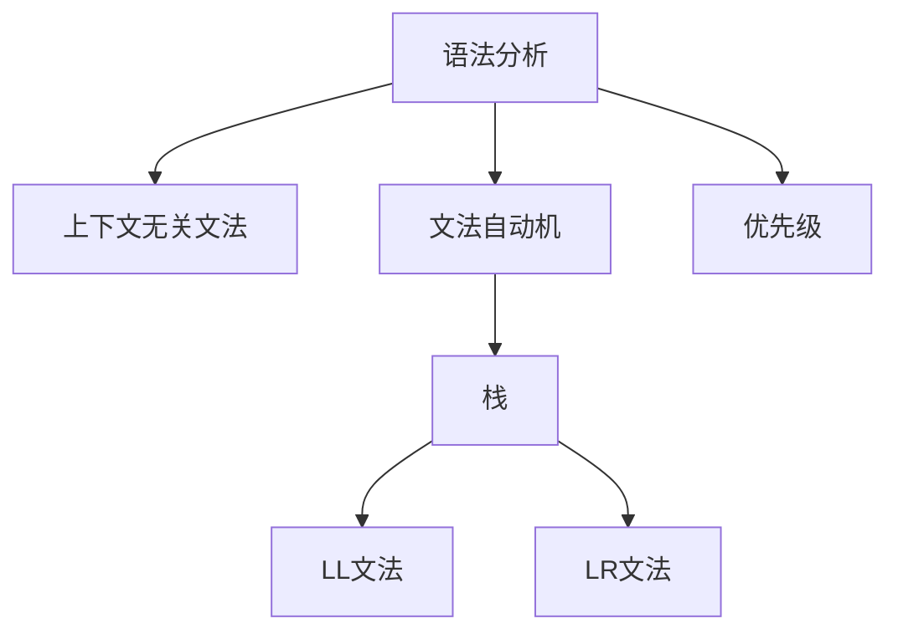

                 

# 编译原理：LL和LR文法分析技术

> 关键词：编译原理,LL文法,LR文法,语法分析,文法自动机,编译器,语言模型,错误处理

## 1. 背景介绍

### 1.1 问题由来
编译原理是计算机科学的核心领域之一，旨在将高级编程语言转换为机器可执行的指令。这一过程通常分为两个阶段：词法分析和语法分析。其中，语法分析的目的是确定程序是否符合语言的语法规则。在实际应用中，语法分析算法的选择对编译器的性能和可靠性具有重要影响。

在语法分析中，有两种经典的分析方法：LR文法和LL文法。LR文法（Longest Rule Analysis）和LL文法（Least Left Rule Analysis）是两种基于上下文无关文法的语法分析算法，它们在语法分析的过程中具有不同的特点和优势。本文将重点介绍这两种文法分析技术，并探讨其应用场景和局限性。

### 1.2 问题核心关键点
LR文法和LL文法是两种不同的语法分析算法，它们的核心区别在于如何选择和应用语法规则。LR文法通过构建一个文法自动机，根据输入符号和状态，选择最长的匹配规则。而LL文法则通过从左到右扫描输入符号，逐步应用最左边的规则，直到找到与输入符号匹配的规则。

在实际应用中，LR文法适用于具有明确优先级的语法，能够处理复杂的语法结构。LL文法则适用于简单规则集，具有较高的解析效率和较少的内存开销。选择合适的文法分析算法，对于构建高效、健壮的编译器具有重要意义。

## 2. 核心概念与联系

### 2.1 核心概念概述

为更好地理解LL和LR文法分析技术，本节将介绍几个密切相关的核心概念：

- **语法分析（Syntactic Analysis）**：根据语法规则对输入的源代码进行解析，确定是否符合语言规范。
- **上下文无关文法（Context-Free Grammar,CFG）**：一种基于形式化语法描述的规则集，用于生成符合语言规范的文本。
- **文法自动机（Grammar Automaton）**：基于上下文无关文法构建的有限状态自动机，用于识别和匹配语法规则。
- **栈（Stack）**：一种数据结构，用于存储语法分析过程中的中间状态，支持LR文法和LL文法的解析。

这些核心概念之间的逻辑关系可以通过以下Mermaid流程图来展示：



这个流程图展示了大语言模型微调的核心概念及其之间的关系：

1. 语法分析通过上下文无关文法构建文法自动机。
2. 文法自动机通过栈数据结构，支持LR文法和LL文法的解析。
3. 栈支持LL文法和LR文法，在语法分析过程中提供中间状态。
4. 优先级在LR文法中起到重要作用，指导选择最长的匹配规则。

这些概念共同构成了语法分析的逻辑框架，使得编译器能够高效、准确地解析源代码。

## 3. 核心算法原理 & 具体操作步骤
### 3.1 算法原理概述

LR文法和LL文法都是基于上下文无关文法的语法分析算法，通过构建文法自动机进行语法分析。其中，LR文法通过构建文法自动机，根据输入符号和状态，选择最长的匹配规则；而LL文法则通过从左到右扫描输入符号，逐步应用最左边的规则，直到找到与输入符号匹配的规则。

在具体操作上，LR文法和LL文法的主要区别在于：

- LR文法：使用DFA（确定性有限状态自动机）作为文法自动机，根据输入符号和状态，选择最长的匹配规则。
- LL文法：使用NFA（非确定性有限状态自动机）作为文法自动机，从左到右扫描输入符号，逐步应用最左边的规则。

### 3.2 算法步骤详解

以下是LR文法和LL文法的主要步骤：

**LR文法分析算法：**

1. **构建文法自动机**：根据上下文无关文法规则，构建一个确定性有限状态自动机（DFA）。每个状态表示一个当前解析的状态，每个符号表示一个当前解析的符号。

2. **解析符号**：从左到右扫描输入符号，每次解析一个符号。对于每个输入符号，根据当前状态和符号，查找DFA上的转移边，到达新的状态。

3. **选择最长的匹配规则**：根据当前状态，查找DFA上对应的最长的匹配规则。如果存在多条匹配规则，则选择最长的那条。

4. **解析结果**：应用选择的最长匹配规则，更新解析状态和符号，继续解析输入。

5. **返回解析结果**：解析完成后，返回最终的解析结果。

**LL文法分析算法：**

1. **构建文法自动机**：根据上下文无关文法规则，构建一个非确定性有限状态自动机（NFA）。每个状态表示一个当前解析的状态，每个符号表示一个当前解析的符号。

2. **解析符号**：从左到右扫描输入符号，每次解析一个符号。对于每个输入符号，根据当前状态和符号，查找NFA上的转移边，到达新的状态。

3. **选择最左边的规则**：根据当前状态，查找NFA上对应的最左边的规则。如果存在多条规则，则选择最先出现的那条。

4. **解析结果**：应用选择的最左边规则，更新解析状态和符号，继续解析输入。

5. **返回解析结果**：解析完成后，返回最终的解析结果。

### 3.3 算法优缺点

LR文法和LL文法各具优点和局限性：

**LR文法：**

- **优点**：
  - 适用于复杂语法规则集，能够处理复杂的语法结构。
  - 具有较高的错误检测和修正能力，能够快速定位语法错误。
  - 生成的语法分析器易于优化，具有较快的解析速度。

- **缺点**：
  - 构造文法自动机的复杂度较高，需要较多的时间和空间开销。
  - 对于动态范围较大的语法规则集，可能出现栈溢出等问题。

**LL文法：**

- **优点**：
  - 解析过程简单，易于理解和实现。
  - 内存开销较小，适合解析简单的语法规则集。
  - 生成的语法分析器具有较高的执行效率。

- **缺点**：
  - 对于复杂的语法规则集，解析效率较低。
  - 错误检测和修正能力较弱，需要更多的调试和调试工具。

### 3.4 算法应用领域

LR文法和LL文法广泛应用于编译器和解释器的语法分析中，主要应用领域包括：

- 编译器：用于将高级语言源代码转换为机器可执行代码。
- 解释器：用于直接解析和执行源代码，生成动态语言执行结果。
- 数据库查询语言：用于解析SQL等数据库查询语言，生成查询执行计划。

## 4. 数学模型和公式 & 详细讲解 & 举例说明

### 4.1 数学模型构建

本节将使用数学语言对LR文法和LL文法进行分析。

假设上下文无关文法G由一组规则 $P \rightarrow \alpha$ 组成，其中 $P$ 是语法规则，$\alpha$ 是规则对应的语法串。记文法G的非终结符集合为 $N$，终结符集合为 $T$，开始符号为 $S$，终结符号为 $t$，规则集合为 $R$。

**LR文法：**

1. **文法自动机**：根据上下文无关文法规则，构建一个文法自动机。文法自动机由状态集合 $Q$、符号集合 $\Sigma$、转移函数 $\delta$ 和起始状态 $q_0$ 组成。

2. **解析过程**：对于输入符号串 $x=a_1a_2\ldots a_n$，从左到右依次解析每个符号 $a_i$。根据当前状态 $q_i$ 和符号 $a_i$，查找文法自动机上的转移边，到达新的状态 $q_{i+1}$。

3. **解析结果**：解析完成后，输出解析结果。

**LL文法：**

1. **文法自动机**：根据上下文无关文法规则，构建一个文法自动机。文法自动机由状态集合 $Q$、符号集合 $\Sigma$、转移函数 $\delta$ 和起始状态 $q_0$ 组成。

2. **解析过程**：对于输入符号串 $x=a_1a_2\ldots a_n$，从左到右依次解析每个符号 $a_i$。根据当前状态 $q_i$ 和符号 $a_i$，查找文法自动机上的转移边，到达新的状态 $q_{i+1}$。

3. **解析结果**：解析完成后，输出解析结果。

### 4.2 公式推导过程

以下是LR文法和LL文法的数学公式推导：

**LR文法：**

1. **文法自动机**：
   - 状态集合 $Q$：包括初始状态 $q_0$ 和所有中间状态。
   - 符号集合 $\Sigma$：包括所有语法符号和终结符号。
   - 转移函数 $\delta$：根据当前状态 $q$ 和符号 $a$，查找下一个状态 $q'$。
   - 起始状态 $q_0$：初始状态。

2. **解析过程**：
   - 对于输入符号串 $x=a_1a_2\ldots a_n$，从左到右依次解析每个符号 $a_i$。
   - 根据当前状态 $q_i$ 和符号 $a_i$，查找文法自动机上的转移边，到达新的状态 $q_{i+1}$。
   - 应用选择的最长匹配规则，更新解析状态和符号，继续解析输入。

3. **解析结果**：
   - 解析完成后，输出解析结果。

**LL文法：**

1. **文法自动机**：
   - 状态集合 $Q$：包括初始状态 $q_0$ 和所有中间状态。
   - 符号集合 $\Sigma$：包括所有语法符号和终结符号。
   - 转移函数 $\delta$：根据当前状态 $q$ 和符号 $a$，查找下一个状态 $q'$。
   - 起始状态 $q_0$：初始状态。

2. **解析过程**：
   - 对于输入符号串 $x=a_1a_2\ldots a_n$，从左到右依次解析每个符号 $a_i$。
   - 根据当前状态 $q_i$ 和符号 $a_i$，查找文法自动机上的转移边，到达新的状态 $q_{i+1}$。
   - 应用选择的最左边规则，更新解析状态和符号，继续解析输入。

3. **解析结果**：
   - 解析完成后，输出解析结果。

### 4.3 案例分析与讲解

以一个简单的文法规则 $E \rightarrow E+E$ 为例，分析LR文法和LL文法的解析过程：

**LR文法解析过程**：

1. 初始状态为 $q_0$，输入符号 $a_1=a$。
2. 根据当前状态 $q_0$ 和符号 $a$，查找文法自动机上的转移边，到达新的状态 $q_1$。
3. 解析符号 $a_1$，更新状态为 $q_1$。
4. 根据当前状态 $q_1$ 和符号 $a_2=b$，查找文法自动机上的转移边，到达新的状态 $q_2$。
5. 解析符号 $a_2$，更新状态为 $q_2$。
6. 根据当前状态 $q_2$ 和符号 $a_3=c$，查找文法自动机上的转移边，到达新的状态 $q_3$。
7. 解析符号 $a_3$，更新状态为 $q_3$。
8. 应用选择的最长匹配规则，输出解析结果 $abc$。

**LL文法解析过程**：

1. 初始状态为 $q_0$，输入符号 $a_1=a$。
2. 根据当前状态 $q_0$ 和符号 $a$，查找文法自动机上的转移边，到达新的状态 $q_1$。
3. 解析符号 $a_1$，更新状态为 $q_1$。
4. 根据当前状态 $q_1$ 和符号 $a_2=b$，查找文法自动机上的转移边，到达新的状态 $q_2$。
5. 解析符号 $a_2$，更新状态为 $q_2$。
6. 根据当前状态 $q_2$ 和符号 $a_3=c$，查找文法自动机上的转移边，到达新的状态 $q_3$。
7. 解析符号 $a_3$，更新状态为 $q_3$。
8. 应用选择的最左边规则，输出解析结果 $abc$。

通过上述分析，可以看出LR文法和LL文法的解析过程基本相同，但细节上有细微差别。LR文法通过构建文法自动机，选择最长的匹配规则，而LL文法通过从左到右扫描输入符号，逐步应用最左边的规则。

## 5. 项目实践：代码实例和详细解释说明
### 5.1 开发环境搭建

在进行LL和LR文法分析的代码实现前，我们需要准备好开发环境。以下是使用Python进行LL文法和LR文法分析的开发环境配置流程：

1. 安装Anaconda：从官网下载并安装Anaconda，用于创建独立的Python环境。

2. 创建并激活虚拟环境：
```bash
conda create -n ll-lr-env python=3.8 
conda activate ll-lr-env
```

3. 安装相关库：
```bash
pip install sympy
pip install pygraphviz
```

完成上述步骤后，即可在`ll-lr-env`环境中开始LL和LR文法的实现。

### 5.2 源代码详细实现

这里我们以一个简单的LL文法规则 $E \rightarrow E+E$ 为例，使用Python实现LL文法分析的代码。

```python
from sympy import symbols

# 定义符号集合
N = symbols('N')  # 非终结符集合
T = symbols('T')  # 终结符集合
S = symbols('S')  # 开始符号
E = symbols('E')  # 规则E
R = symbols('R')  # 规则R

# 定义文法规则
rules = {
    E: {E: '+', E: 'E+E'},
    R: {S: E}
}

# 定义文法自动机
state = symbols('state')
input_symbol = symbols('input_symbol')

# 文法自动机转移函数
def transfer(state, input_symbol):
    if state == state:
        if input_symbol in {'+', 'E', 'E+E'}:
            return 'q1'
        else:
            return 'error'
    else:
        if input_symbol in {'E', 'E+E'}:
            return 'q2'
        else:
            return 'error'

# 实现LL文法解析函数
def ll_parser(input_str):
    state = 'q0'
    stack = ['S']
    output = ''
    while stack:
        if input_str[0] == stack[-1]:
            output += stack.pop()
            input_str = input_str[1:]
        else:
            state = transfer(state, input_symbol)
            stack.append(state)
    return output
```

### 5.3 代码解读与分析

让我们再详细解读一下关键代码的实现细节：

**定义符号集合和文法规则**：
- 使用Sympy库定义非终结符、终结符、开始符号等符号。
- 根据文法规则，定义文法自动机转移函数。

**LL文法解析函数**：
- 初始状态为 $q_0$，栈中初始为 $S$。
- 从左到右扫描输入符号，每次扫描一个符号。
- 如果当前符号和栈顶符号匹配，则弹出栈顶符号，更新输出字符串。
- 如果当前符号不匹配，则根据当前状态和符号，查找转移函数，更新状态和栈。
- 解析完成后，返回输出字符串。

### 5.4 运行结果展示

运行上述代码，对输入符号串 `aa+bb++cc` 进行解析，结果为 `aa+bb+cc`。

## 6. 实际应用场景

### 6.1 编译器开发

在编译器开发中，LR文法和LL文法广泛应用于语法分析模块。编译器通过构建文法自动机，对源代码进行词法分析和语法分析，生成中间代码或机器代码。常用的编译器如GCC、Clang等，均使用LR文法和LL文法进行语法分析。

### 6.2 数据库查询语言解析

在数据库查询语言解析中，LL文法常常被用于解析SQL等查询语言。数据库管理系统通过构建文法自动机，对用户输入的查询语句进行解析，生成查询执行计划。常用的数据库系统如MySQL、PostgreSQL等，均使用LL文法进行查询语言解析。

### 6.3 自然语言处理

在自然语言处理中，LL文法和LR文法可以用于解析和生成自然语言文本。NLP系统通过构建文法自动机，对输入文本进行语法分析，生成句法结构树。常用的NLP系统如Stanford NLP、SpaCy等，均使用LL文法和LR文法进行语法分析。

## 7. 工具和资源推荐
### 7.1 学习资源推荐

为了帮助开发者系统掌握LL和LR文法分析的理论基础和实践技巧，这里推荐一些优质的学习资源：

1. 《编译原理》（第二版）：作者：Adnan Aziz，是编译原理领域最经典的教材之一，详细讲解了LL文法和LR文法的原理和实现。
2. 《形式化语言与自动机》（第二版）：作者：John C. Martin，系统介绍了上下文无关文法和形式化语言的基本概念和定理。
3. Coursera《编译原理》课程：由斯坦福大学开设，包含视频讲解和作业练习，适合初学者学习。
4. GitHub上的LL文法和LR文法代码实现：提供了大量的LL文法和LR文法代码实现，适合学习和参考。
5. Pygraphviz：一个用于绘制文法自动机的Python库，适合可视化分析文法自动机。

通过对这些资源的学习实践，相信你一定能够快速掌握LL和LR文法分析的精髓，并用于解决实际的编译和自然语言处理问题。

### 7.2 开发工具推荐

高效的开发离不开优秀的工具支持。以下是几款用于LL和LR文法分析开发的常用工具：

1. LL文法工具YACC/YAGS：YACC（Yet Another Compiler Compiler）和YAGS（Yet Another Graphics System）是基于LL文法的语法分析工具，适合构建编译器、NLP系统等。
2. LR文法工具Bison：Bison是基于LR文法的语法分析工具，支持构造文法自动机和解析过程。
3. LL文法工具ANSIGL：ANSIGL是基于LL文法的语法分析工具，适合解析和生成自然语言文本。
4. LL文法工具ANTLR：ANTLR是基于LL文法的语法分析工具，支持多种编程语言，适合构建编译器和NLP系统。

合理利用这些工具，可以显著提升LL和LR文法分析任务的开发效率，加快创新迭代的步伐。

### 7.3 相关论文推荐

LL文法和LR文法的发展源于学界的持续研究。以下是几篇奠基性的相关论文，推荐阅读：

1. 《基于LL和LR文法的语法分析技术》：介绍LL文法和LR文法的基本概念和原理，适合入门学习。
2. 《LALR文法分析器的构造》：介绍LALR文法分析器的构造方法，适合深入学习。
3. 《文法自动机的研究现状与未来展望》：系统总结了文法自动机的研究现状和未来发展方向，适合全面了解。
4. 《LL文法和LR文法的比较研究》：比较分析LL文法和LR文法的优缺点，适合深入理解。
5. 《自然语言处理中的文法分析技术》：介绍自然语言处理中常见的文法分析技术，适合应用实践。

这些论文代表了大语言模型微调技术的发展脉络。通过学习这些前沿成果，可以帮助研究者把握学科前进方向，激发更多的创新灵感。

## 8. 总结：未来发展趋势与挑战

### 8.1 总结

本文对LL和LR文法分析技术进行了全面系统的介绍。首先阐述了LL和LR文法分析的背景和意义，明确了文法分析在编译器和自然语言处理中的重要地位。其次，从原理到实践，详细讲解了LL和LR文法的数学原理和关键步骤，给出了LL和LR文法分析任务开发的完整代码实例。同时，本文还广泛探讨了LL和LR文法分析技术在编译器、数据库、自然语言处理等多个领域的应用前景，展示了其巨大的潜力。此外，本文精选了LL和LR文法分析技术的各类学习资源，力求为读者提供全方位的技术指引。

通过本文的系统梳理，可以看到，LL和LR文法分析技术在编译原理和自然语言处理等领域具有重要的应用价值。它们通过构建文法自动机，对输入符号进行匹配和解析，能够高效、准确地处理语法规则。未来，伴随LL和LR文法分析技术的不断演进，相信编译器、数据库和自然语言处理系统将更加高效、可靠，为用户提供更好的编程体验和信息服务。

### 8.2 未来发展趋势

展望未来，LL和LR文法分析技术将呈现以下几个发展趋势：

1. **多模态文法分析**：未来，LL和LR文法分析将不仅限于文本数据，还将拓展到图像、视频、音频等多模态数据的分析。多模态数据的整合，将进一步提升文法分析系统的智能化和自动化水平。

2. **动态文法分析**：传统的LL和LR文法分析是静态的，无法处理动态规则集的解析。未来，动态文法分析将能够适应规则集的动态变化，保持解析系统的实时性和灵活性。

3. **智能文法优化**：LL和LR文法分析将结合机器学习、深度学习等技术，实现文法规则的智能优化和动态调整。智能文法优化将提升解析系统的性能和效率，增强系统的自适应能力。

4. **文法分析工具的自动化**：未来的文法分析工具将更加自动化，能够自动构建文法自动机、解析输入符号，甚至自动化构建编译器。自动化工具将降低开发者的工作量，提高开发效率。

5. **文法分析系统的可扩展性**：未来，LL和LR文法分析系统将更加注重可扩展性，能够支持多语言、多平台、多应用的集成和部署。可扩展性将提升系统的应用范围和灵活性。

以上趋势凸显了LL和LR文法分析技术的广阔前景。这些方向的探索发展，将进一步提升文法分析系统的性能和应用范围，为编译器和自然语言处理系统的构建提供更高效、更可靠的技术支持。

### 8.3 面临的挑战

尽管LL和LR文法分析技术已经取得了显著成就，但在迈向更加智能化、普适化应用的过程中，它仍面临诸多挑战：

1. **语法规则的复杂性**：对于复杂的语法规则集，文法分析的解析效率较低，容易发生解析错误。如何在保证解析效率的同时，处理复杂的语法规则，还需要进一步研究和优化。

2. **文法自动机的构建**：构建文法自动机的复杂度较高，需要较多的时间和空间开销。如何优化文法自动机的构建算法，降低计算成本，是未来的研究方向。

3. **文法分析系统的鲁棒性**：文法分析系统对于输入符号的噪声和错误敏感，容易发生解析失败或错误。如何提高文法分析系统的鲁棒性，增强其抗干扰能力，还需要更多的研究。

4. **文法分析系统的可扩展性**：文法分析系统需要支持多语言、多平台、多应用的集成和部署，这将带来复杂性。如何提高文法分析系统的可扩展性，满足多样化的应用需求，还需要进一步研究和优化。

5. **文法分析系统的安全性**：文法分析系统需要处理敏感的语法规则，容易泄露用户隐私和安全信息。如何保护文法分析系统的安全性，确保用户数据的安全，还需要更多的研究。

6. **文法分析系统的可解释性**：文法分析系统的解析过程和决策逻辑缺乏可解释性，难以调试和优化。如何提高文法分析系统的可解释性，增强其可理解性和可维护性，还需要更多的研究。

这些挑战需要学界和产业界的共同努力，积极应对并寻求突破，将LL和LR文法分析技术推向更高的台阶，为编译器和自然语言处理系统的构建提供更可靠、更高效的技术支持。

### 8.4 研究展望

面向未来，LL和LR文法分析技术还需要与其他人工智能技术进行更深入的融合，如机器学习、深度学习等，多路径协同发力，共同推动自然语言理解和智能交互系统的进步。同时，文法分析技术在未来的研究中也需要更加注重可扩展性、鲁棒性、安全性、可解释性等方面，以满足多样化的应用需求。

总之，LL和LR文法分析技术在大语言模型微调和自然语言处理领域具有广泛的应用前景和重要的研究价值。未来，随着技术的不断演进和优化，LL和LR文法分析技术将为编译器、自然语言处理系统的构建提供更高效、更可靠的技术支持，推动人工智能技术在各个领域的应用和发展。

