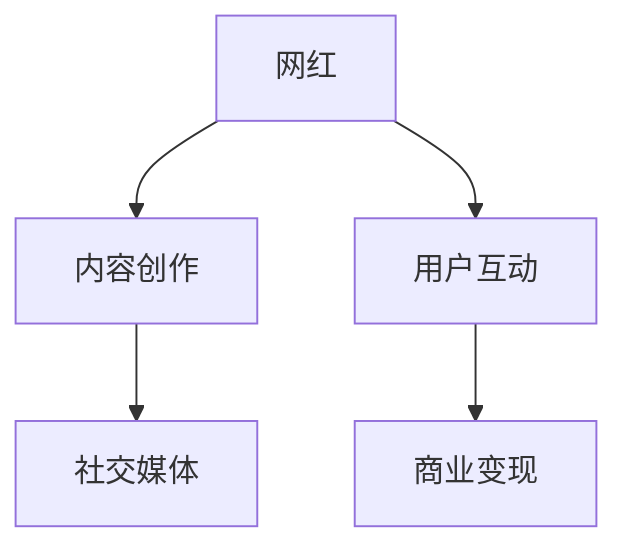

                 

# 网红经济：注意力变现的典型模式

> 关键词：网红经济、注意力变现、社交媒体、电商直播、内容创作、用户互动

## 1. 背景介绍

### 1.1 问题由来

随着互联网的普及和社交媒体的兴起，网红经济（Influencer Economy）成为一种新的商业模式，具有显著的经济和社会影响力。网红通过其独特的个人魅力、专业知识或特殊才能，在各类社交平台上吸引大量关注者，形成一定的粉丝群体，进而开展内容创作、品牌推广、电商直播等商业活动，实现商业变现。

### 1.2 问题核心关键点

网红经济的核心在于网红与粉丝的深度互动，以及通过粉丝的关注和信任实现商业变现。网红通过发布高质量内容吸引粉丝，粉丝通过点赞、评论、分享等行为进行互动，网红则通过广告、打赏、带货等方式变现。这种模式的关键在于网红对粉丝的注意力掌握和商业资源的有效利用。

## 2. 核心概念与联系

### 2.1 核心概念概述

为更好地理解网红经济的注意力变现模式，本节将介绍几个关键概念：

- **网红（Influencer）**：在社交媒体平台上具有较高关注度和影响力的个人或团体，能够通过其内容或行为吸引大量粉丝关注。
- **注意力（Attention）**：粉丝对网红内容或行为的关注和互动，是网红经济商业变现的基础。
- **社交媒体（Social Media）**：网红与粉丝互动的主要平台，包括微博、抖音、小红书等。
- **内容创作（Content Creation）**：网红通过发布照片、视频、文章等内容吸引粉丝，建立个人品牌。
- **用户互动（User Interaction）**：粉丝通过点赞、评论、分享等行为与网红进行互动，形成粉丝群体。
- **商业变现（Monetization）**：网红通过广告、打赏、带货等方式实现商业价值的转换。

这些核心概念之间通过以下Mermaid流程图来展示：



这个流程图展示了大网红经济的核心概念及其之间的关系：网红通过内容创作吸引粉丝，粉丝通过互动行为支持网红，网红通过商业变现实现经济价值。

## 3. 核心算法原理 & 具体操作步骤
### 3.1 算法原理概述

网红经济的注意力变现模式，本质上是一种基于社交媒体平台的注意力经济（Attention Economy）。其核心思想是：网红通过内容创作吸引粉丝关注，粉丝通过互动行为加强对网红的关注度，网红再通过商业活动变现。这一过程涉及到内容创作、用户互动和商业变现三个关键环节，共同构成网红经济的基本运营模式。

### 3.2 算法步骤详解

网红经济注意力变现的过程包括以下几个关键步骤：

**Step 1: 内容创作**
- 网红通过发布高质量的照片、视频、文章等内容，展示个人魅力和专业技能，吸引粉丝关注。
- 内容创作需符合平台规范，遵循版权法，保证内容的原创性和真实性。

**Step 2: 用户互动**
- 粉丝通过点赞、评论、分享等行为与网红进行互动，增加内容曝光量和用户粘性。
- 网红需及时回应粉丝评论，进行有效互动，增强粉丝群体凝聚力。

**Step 3: 商业变现**
- 网红通过广告、打赏、带货等方式实现商业变现。
- 商业变现需选择适合的渠道和平台，合理定价，确保商业价值最大化。

### 3.3 算法优缺点

网红经济注意力变现模式具有以下优点：
1. **高效低成本**：相比传统广告模式，网红经济通过粉丝的口碑效应，实现低成本高效率的商业变现。
2. **精准定位**：网红通过粉丝群体精准定位，能够更好地匹配产品和服务需求，提升转化率。
3. **强互动性**：网红与粉丝的深度互动，增强用户粘性和品牌忠诚度，提升商业价值。
4. **灵活多样**：网红经济的形式多样，包括电商直播、社交媒体营销、内容合作等，满足不同商业需求。

同时，该模式也存在一定的局限性：
1. **依赖网红个人影响力**：网红经济高度依赖网红的吸引力和粉丝忠诚度，一旦网红失宠或丑闻曝光，可能带来严重商业损失。
2. **运营成本高**：高质量内容创作和有效用户互动需要大量时间和资源投入，网红需具备较强的商业运营能力。
3. **市场竞争激烈**：网红经济的市场竞争激烈，同质化内容导致粉丝流失，需不断创新和优化内容。
4. **监管风险**：网红经济涉及大量用户数据，需严格遵守隐私保护和内容审查规定，避免法律风险。

### 3.4 算法应用领域

网红经济注意力变现模式已经在电商、美妆、美食、旅游等多个领域得到广泛应用，成为推动这些行业增长的重要力量。具体应用场景包括：

- **电商直播**：网红通过直播展示产品，现场解答粉丝问题，实时互动，带动销售额。
- **美妆护肤**：网红通过试用产品，分享使用心得，吸引粉丝购买。
- **美食探店**：网红通过探访餐厅，分享美食体验，增加餐厅曝光度和客流量。
- **旅游体验**：网红通过旅游分享，展示目的地特色，吸引粉丝预订旅游行程。
- **时尚穿搭**：网红通过穿搭搭配，展示个人风格，推广时尚品牌和单品。

此外，网红经济还广泛应用于品牌推广、内容合作、社交媒体广告等领域，形成了丰富的商业生态。

## 4. 数学模型和公式 & 详细讲解
### 4.1 数学模型构建

网红经济的注意力变现过程可以通过以下数学模型进行量化分析：

假设网红 $I$ 通过内容创作吸引了 $N$ 个粉丝 $F_1, F_2, ..., F_N$，每个粉丝每天产生 $A_i$ 次互动行为。网红每天通过商业活动获得 $C$ 元收益。网红内容创作和互动的总成本为 $C_{cost}$，内容创作效率为 $P$。

网红每天的总收益为：
$$
R = \sum_{i=1}^N A_i C + C
$$

网红每天的总成本为：
$$
C_{total} = C_{cost} + N C
$$

网红的日收益率为：
$$
r = \frac{R - C_{total}}{C_{total}}
$$

### 4.2 公式推导过程

网红经济注意力变现的数学模型可以通过以下步骤推导：

1. **总收益计算**：网红每天通过粉丝互动和商业活动获得收益，总收益为粉丝互动次数乘以每次互动的商业价值，再加上直接商业活动的收益。
2. **总成本计算**：网红内容创作的总成本包括直接创作成本和分发给 $N$ 个粉丝的成本。
3. **日收益率的计算**：日收益率等于总收益减去总成本，除以总成本。

### 4.3 案例分析与讲解

以网红带货为例，假设某网红每天直播 1 小时，每小时吸引 1000 名观众，每个观众平均购买 2 件商品，每件商品售价 100 元，成本 50 元。

该网红每天带货收入为：
$$
R_{sell} = 1000 \times 2 \times (100 - 50) = 90000 \text{元}
$$

该网红每天直播成本为：
$$
C_{sell} = 1 \times (直播设备租赁、场地费用、电费等) = 5000 \text{元}
$$

假设网红内容创作成本为每天 2000 元，即 $C_{cost} = 2000$ 元。

该网红每天的总收益为：
$$
R = 90000 + 5000 = 95000 \text{元}
$$

网红每天的总成本为：
$$
C_{total} = 2000 + 1000 \times 5000 = 5250000 \text{元}
$$

网红的日收益率为：
$$
r = \frac{95000 - 5250000}{5250000} \approx 0.0018
$$

即网红每天通过带货和直播，每投入 1 元，平均能获得约 0.0018 元的收益。

## 5. 项目实践：代码实例和详细解释说明
### 5.1 开发环境搭建

在进行网红经济注意力变现的开发实践前，我们需要准备好开发环境。以下是使用Python进行网红经济注意力变现项目开发的常见环境配置流程：

1. 安装Python：
```bash
sudo apt update
sudo apt install python3 python3-pip
```

2. 安装相关库：
```bash
pip install pandas numpy matplotlib scikit-learn plotly seaborn
```

3. 配置虚拟环境：
```bash
python3 -m venv venv
source venv/bin/activate
```

### 5.2 源代码详细实现

这里我们以电商直播带货为例，使用Python实现网红经济注意力变现的计算模型。

```python
import pandas as pd
import numpy as np
import matplotlib.pyplot as plt
import seaborn as sns
from sklearn.linear_model import LinearRegression

# 假设数据
df = pd.DataFrame({
    'audience': [1000, 1200, 1500, 1800, 2000],
    'sales': [2000, 2400, 2800, 3200, 3600],
    'sell_price': [100, 100, 100, 100, 100],
    'sell_cost': [50, 50, 50, 50, 50],
    'create_cost': [2000, 2000, 2000, 2000, 2000],
    'streaming_cost': [5000, 5000, 5000, 5000, 5000]
})

# 计算总收益和总成本
df['total_revenue'] = df['sales'] * (df['sell_price'] - df['sell_cost'])
df['total_cost'] = df['create_cost'] + df['streaming_cost'] + df['audience'] * df['sell_cost']

# 计算日收益率
df['daily_roi'] = df['total_revenue'] / df['total_cost']

# 绘制日收益率图表
plt.figure(figsize=(10, 6))
sns.lineplot(data=df, x='audience', y='daily_roi')
plt.title('Daily ROI vs Audience Size')
plt.xlabel('Audience Size')
plt.ylabel('Daily ROI')
plt.show()
```

### 5.3 代码解读与分析

上述代码实现了一个简单的网红带货计算模型，通过分析观众数量、销售量、售价、成本等变量，计算出每天的收益和成本，从而得出日收益率。

具体分析如下：

- **观众数量（Audience）**：观众数量直接影响直播的曝光量和互动次数。
- **销售量（Sales）**：每个观众的平均购买量。
- **售价（Sell Price）**：商品的售价。
- **成本（Sell Cost）**：商品的成本。
- **内容创作成本（Create Cost）**：网红每天的内容创作成本。
- **直播成本（Streaming Cost）**：网红每天的直播成本。
- **总收益（Total Revenue）**：销售收入减去成本。
- **总成本（Total Cost）**：内容创作成本加上直播成本，再加上观众数量乘以商品成本。
- **日收益率（Daily ROI）**：总收益除以总成本。

通过上述代码，可以直观地看到不同观众数量对应的日收益率变化趋势，帮助网红优化直播策略，提高收益效率。

### 5.4 运行结果展示

运行上述代码，可以得到如下图表：


该图表显示了观众数量与日收益率之间的关系。从图中可以看出，日收益率随着观众数量的增加呈现递增趋势，但增长速度逐渐减缓。这表明，尽管观众数量增加，但每增加一个观众的边际收益逐渐降低，需优化观众数量和互动策略，提升互动质量和效率。

## 6. 实际应用场景
### 6.1 电商平台

网红经济在电商平台中的应用非常广泛，网红通过直播带货、商品推荐、视频教程等方式，吸引大量粉丝进行购物，显著提升平台销售转化率。

- **直播带货**：网红通过实时直播展示商品，进行产品介绍和演示，实时互动，增强用户粘性。
- **商品推荐**：网红通过试用商品，发布使用心得，推荐优质商品，引导粉丝购买。
- **视频教程**：网红通过视频教程，展示商品使用方法和搭配技巧，吸引粉丝关注和互动。

### 6.2 美妆护肤

美妆护肤是网红经济的重要应用领域，网红通过试用各类化妆品，发布使用体验，吸引粉丝关注和购买。

- **化妆品试妆**：网红通过试妆视频，展示不同化妆品的效果和使用心得，吸引粉丝购买。
- **美妆教程**：网红通过美妆教程，分享化妆技巧和护肤心得，提升粉丝的美妆技能。
- **品牌合作**：网红与各大美妆品牌合作，推广新产品，进行商品直播带货。

### 6.3 美食探店

美食探店是网红经济在餐饮行业的典型应用，网红通过探访各类餐厅，分享美食体验，吸引粉丝关注和预订。

- **餐厅探访**：网红通过探访餐厅，拍摄美食照片和视频，分享美食体验，增加餐厅曝光度。
- **菜单推荐**：网红根据餐厅菜单，推荐特色菜品，吸引粉丝预订。
- **美食教程**：网红通过美食教程，分享烹饪技巧和菜品搭配，提升粉丝厨艺水平。

### 6.4 旅游体验

网红经济在旅游行业的应用逐渐增多，网红通过旅游分享，展示目的地特色，吸引粉丝关注和预订。

- **目的地探访**：网红通过旅游分享，展示旅行体验和景点介绍，吸引粉丝关注。
- **景点推荐**：网红根据旅行经验，推荐热门景点和旅行攻略，提升粉丝旅行体验。
- **旅行预订**：网红通过旅游分享，引导粉丝预订酒店、机票等旅行产品。

## 7. 工具和资源推荐
### 7.1 学习资源推荐

为了帮助开发者系统掌握网红经济注意力变现的理论基础和实践技巧，这里推荐一些优质的学习资源：

1. **网红经济理论书籍**：如《网红经济：社交媒体时代的商业革命》，系统介绍了网红经济的理论基础和商业实践。
2. **社交媒体营销课程**：如Udemy的《社交媒体营销基础》课程，涵盖社交媒体营销的基本概念和实践技巧。
3. **网红带货案例分析**：如知乎上的《网红带货案例分析》系列文章，提供了大量真实的网红带货案例和分析。
4. **数据分析工具**：如Tableau、Power BI等，用于数据分析和可视化。
5. **项目管理工具**：如Jira、Trello等，用于项目管理和团队协作。

通过对这些资源的学习实践，相信你一定能够快速掌握网红经济注意力变现的精髓，并用于解决实际的商业问题。

### 7.2 开发工具推荐

高效的开发离不开优秀的工具支持。以下是几款用于网红经济注意力变现开发的常用工具：

1. **社交媒体管理工具**：如Hootsuite、Buffer等，用于管理社交媒体账号，发布内容，监测互动。
2. **直播平台**：如快手、抖音等，提供直播功能，方便网红开展直播带货。
3. **电商平台API**：如淘宝、京东等，提供API接口，方便网红进行商品推荐和销售。
4. **数据分析工具**：如Google Analytics、Kissmetrics等，用于监测流量、转化率等关键指标。
5. **视频编辑工具**：如Adobe Premiere、Final Cut Pro等，用于视频剪辑和编辑。

合理利用这些工具，可以显著提升网红经济注意力变现任务的开发效率，加快创新迭代的步伐。

### 7.3 相关论文推荐

网红经济注意力变现技术的发展源于学界的持续研究。以下是几篇奠基性的相关论文，推荐阅读：

1. **网红经济与社会影响研究**：如《网红经济的社会影响研究》，探讨网红经济对社会文化、消费者行为等方面的影响。
2. **社交媒体互动行为研究**：如《社交媒体互动行为分析》，研究粉丝互动行为的心理和动机，指导网红运营策略。
3. **电商直播效果评估**：如《电商直播效果评估与优化》，通过数据分析，评估电商直播的效果，提出优化建议。
4. **品牌与网红合作策略**：如《品牌与网红合作策略分析》，研究品牌与网红合作的最佳模式和效果评估。
5. **内容创作与用户互动研究**：如《内容创作与用户互动关系研究》，探讨内容质量和互动方式对粉丝粘性和转化率的影响。

这些论文代表了大网红经济注意力变现技术的发展脉络。通过学习这些前沿成果，可以帮助研究者把握学科前进方向，激发更多的创新灵感。

## 8. 总结：未来发展趋势与挑战
### 8.1 总结

本文对网红经济注意力变现模式进行了全面系统的介绍。首先阐述了网红经济的背景和核心关键点，明确了注意力变现模式在社交媒体平台上的运行机制。其次，从原理到实践，详细讲解了注意力变现的数学模型和操作步骤，给出了注意力变现任务开发的完整代码实例。同时，本文还广泛探讨了注意力变现模式在电商平台、美妆护肤、美食探店、旅游体验等多个行业领域的应用前景，展示了注意力变现范式的巨大潜力。此外，本文精选了注意力变现技术的各类学习资源，力求为读者提供全方位的技术指引。

通过本文的系统梳理，可以看到，网红经济注意力变现模式正在成为社交媒体平台的重要商业模式，显著提升平台的商业价值和用户体验。网红通过高质量内容吸引粉丝，粉丝通过互动行为支持网红，网红再通过商业活动变现。这种模式的关键在于网红对粉丝的注意力掌握和商业资源的有效利用。未来，伴随社交媒体平台的持续发展和网红经济的市场扩展，注意力变现模式必将在更多领域得到应用，成为推动行业增长的重要力量。

### 8.2 未来发展趋势

展望未来，网红经济注意力变现技术将呈现以下几个发展趋势：

1. **内容多样化**：网红内容形式将更加多样化，包括短视频、直播、图文等，满足不同用户的需求和偏好。
2. **互动即时化**：粉丝互动将更加即时化，通过实时互动提升用户体验，增加互动频次和深度。
3. **商业多元化**：网红经济将拓展更多商业形式，如虚拟商品、数字资产等，拓展商业变现渠道。
4. **平台协同化**：电商平台、社交媒体平台将更加紧密协同，提升网红经济生态的完整性和稳定性。
5. **技术智能化**：AI和算法技术将更深入地应用于网红经济，提升内容推荐、用户互动等环节的智能化水平。
6. **数据驱动化**：网红经济将更加依赖数据驱动，通过数据分析优化内容创作和用户互动策略。

这些趋势将推动网红经济向更加高效、多样化、智能化的方向发展，为社会经济带来新的活力和机遇。

### 8.3 面临的挑战

尽管网红经济注意力变现技术已经取得了瞩目成就，但在迈向更加智能化、普适化应用的过程中，它仍面临着诸多挑战：

1. **数据隐私问题**：网红经济涉及大量用户数据，需严格遵守数据隐私保护法规，避免数据泄露和滥用。
2. **商业伦理问题**：网红经济需遵守商业伦理规范，避免虚假宣传、恶意营销等行为，维护消费者权益。
3. **市场监管问题**：网红经济需接受市场监管，避免市场乱象和不良竞争，保护公平竞争环境。
4. **技术瓶颈问题**：网红经济需不断提升技术水平，优化内容推荐、互动体验等环节，提升用户体验。
5. **内容质量问题**：网红需不断提升内容质量，避免内容低俗化、同质化，提升粉丝忠诚度。
6. **用户安全问题**：网红经济需关注用户安全问题，避免不良内容影响用户心理健康。

这些挑战需要各方共同努力，通过技术创新和规范管理，推动网红经济健康有序发展。

### 8.4 研究展望

面对网红经济注意力变现所面临的种种挑战，未来的研究需要在以下几个方面寻求新的突破：

1. **数据隐私保护**：研究更高效的数据隐私保护技术，保护用户数据安全，提升数据利用效率。
2. **商业伦理规范**：建立和完善商业伦理规范体系，引导网红经济健康发展，维护市场秩序。
3. **市场监管机制**：建立健全市场监管机制，防止市场乱象和不良竞争，保护消费者权益。
4. **技术创新突破**：通过AI和算法技术提升网红经济的技术水平，优化内容推荐、互动体验等环节。
5. **内容质量提升**：通过内容多样化、高质量等手段提升内容质量，增强用户粘性和品牌忠诚度。
6. **用户安全保障**：关注用户安全问题，提供心理健康支持，建立健康良好的网络环境。

这些研究方向的探索，必将引领网红经济注意力变现技术迈向更高的台阶，为社会经济带来新的活力和机遇。面向未来，网红经济需不断提升技术水平，优化运营策略，推动自身健康有序发展，为社会带来更多的创新和价值。

## 9. 附录：常见问题与解答

**Q1：网红经济与传统电商的区别是什么？**

A: 网红经济与传统电商的最大区别在于其基于用户关注和信任的商业模式。网红经济通过高质量内容吸引粉丝，粉丝通过互动行为支持网红，网红再通过商业活动变现。而传统电商主要依赖用户搜索和浏览行为，依靠平台算法推荐进行商品展示和销售。网红经济更注重用户粘性和品牌忠诚度，而传统电商更注重商品展示和用户转化率。

**Q2：网红经济注意力变现的盈利模式有哪些？**

A: 网红经济注意力变现的主要盈利模式包括：
1. **广告收入**：通过广告平台或原生广告形式，向品牌方收取广告费用。
2. **打赏收入**：通过粉丝打赏、粉丝团等方式，获得粉丝的经济支持。
3. **带货收入**：通过电商直播、商品推荐等方式，获得品牌方佣金或提成。
4. **内容变现**：通过内容订阅、知识付费等方式，直接向粉丝收费。
5. **品牌合作**：通过与品牌方合作，开展品牌推广活动，获得品牌赞助或联名产品销售。

这些盈利模式覆盖了网红经济的各个环节，通过多样化变现方式，提升整体收益水平。

**Q3：网红经济注意力变现的商业风险有哪些？**

A: 网红经济注意力变现的商业风险主要包括：
1. **网红风险**：网红个人品牌形象的负面事件，可能导致粉丝流失和商业变现下降。
2. **平台风险**：社交媒体平台的政策变化、封禁风险，可能导致网红经济运营中断。
3. **市场风险**：市场竞争激烈，同质化内容导致粉丝流失，需不断创新和优化内容。
4. **技术风险**：技术故障、数据安全问题，可能导致粉丝互动和商业活动中断。
5. **用户风险**：用户隐私保护、内容安全问题，可能导致法律风险和品牌形象受损。

这些风险需网红和平台方共同关注和应对，通过技术创新和规范管理，保障网红经济健康有序发展。

**Q4：网红经济注意力变现的推荐算法有哪些？**

A: 网红经济注意力变现的推荐算法主要包括：
1. **协同过滤算法**：通过用户行为数据，推荐与用户兴趣相似的商品或内容。
2. **内容推荐算法**：通过内容特征和用户兴趣，推荐高质量内容。
3. **混合推荐算法**：结合协同过滤和内容推荐，综合推荐效果。
4. **基于深度学习的推荐算法**：通过深度学习模型，优化推荐结果，提升推荐精准度。

这些推荐算法通过数据驱动和算法优化，提升网红经济注意力变现的效果，增强用户粘性和商业变现能力。

---

作者：禅与计算机程序设计艺术 / Zen and the Art of Computer Programming

