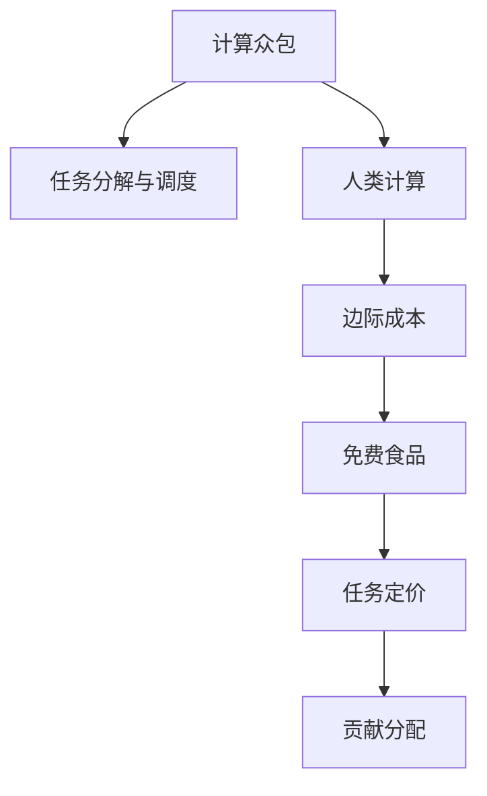

                 

# 群体智慧：人类计算的无限潜力

> 关键词：群体智慧, 众包, 人类计算, 分布式协作, 计算众包, 用户贡献, 智能平台, 计算经济学, 边际成本, 免费食品, 动态定价, 集体智慧

## 1. 背景介绍

### 1.1 问题由来

群体智慧（Crowdsourcing）是指通过大规模的、分散的群体参与，从个体贡献汇聚成集体的智能。这种智慧的产生，通常基于互联网平台和社交网络，使分散的个体在互联网上聚集，通过共同协作完成任务。从电商平台的商品评价，到众包平台的图像标注，再到科学研究的众包任务，群体智慧已深入我们的生活各个领域。

然而，这种分散式计算的优势还远未被充分利用。平台上的许多任务，如简单的数据标注、商品描述写作等，仍需大量人力和时间来完成。如何充分利用群体的智慧，提升任务完成效率，同时避免重复劳动和质量问题，是我们需要深入探索的问题。

### 1.2 问题核心关键点

群体智慧的利用，关键在于如何高效地组织和协调群体贡献，以及如何对个体的贡献进行合理评估和奖励。核心点包括以下几个方面：

1. **任务分解与调度**：将复杂任务分解为小任务，并自动分配给合适的群体成员。
2. **贡献评估与激励**：对群体成员的贡献进行量化，并据此提供激励。
3. **智能平台设计与优化**：构建一个有效的智能平台，使其能够高效地协调和管理群体任务。
4. **计算经济学**：研究群体智慧的经济学原理，探索任务定价和贡献分配的合理性。

本节将围绕上述核心点，详细探讨群体智慧的实现原理和应用策略。

## 2. 核心概念与联系

### 2.1 核心概念概述

为了更好地理解群体智慧的实现机制，本节将介绍几个密切相关的核心概念：

- **计算众包**：通过平台将计算任务（如数据标注、图片分类等）分配给个体，个体根据平台规则完成任务并获得相应报酬。
- **人类计算**：利用个体计算能力，将一些复杂计算任务分解成简单子任务，由多个个体并行处理，以提高计算效率。
- **边际成本**：随着额外生产要素的增加，边际成本是指每增加一单位产量所增加的成本。在计算经济学中，这一概念被用于研究计算任务的定价和分配。
- **免费食品（Freerice）**：一种利用计算任务进行食物捐赠的网站，用户通过完成简单的数学计算任务，可以获得一定数量的免费食物。

这些概念之间的逻辑关系可以通过以下Mermaid流程图来展示：



这个流程图展示了一些关键概念之间的关系：

1. 计算众包和人类计算都依赖于任务的分解与调度。
2. 边际成本和免费食品是计算经济学中计算任务定价和贡献分配的基础。
3. 任务定价和贡献分配是计算众包和人类计算的核心问题。

这些概念共同构成了群体智慧的计算基础，使分散的个体能够高效协同，共同完成复杂的计算任务。

## 3. 核心算法原理 & 具体操作步骤
### 3.1 算法原理概述

群体智慧的核心在于利用大规模分散的个体，通过协调与管理，高效完成任务。其核心算法原理主要包括以下几个方面：

1. **任务分解**：将复杂任务分解为简单子任务，并自动分配给合适的个体。
2. **任务调度**：动态调整任务的分配和调度策略，最大化任务完成效率。
3. **贡献评估**：对个体贡献进行量化，并根据贡献大小进行评估和激励。
4. **动态定价**：根据任务难度和个体能力动态调整任务定价，保证任务完成质量和效率。

### 3.2 算法步骤详解

基于群体智慧的计算众包平台，通常包括以下几个关键步骤：

**Step 1: 准备任务与平台**

- 确定需要完成的具体任务，并定义好任务规则和计算模型。
- 开发和部署计算众包平台，包括任务管理、用户管理、贡献评估和激励等模块。

**Step 2: 任务分解与调度**

- 将复杂任务分解为小任务，并根据个体的能力分配任务。
- 实时监控任务完成情况，动态调整任务分配策略，保证任务高效完成。

**Step 3: 贡献评估与激励**

- 对个体贡献进行量化，如准确率、完成时间等指标。
- 根据贡献大小，提供相应的激励，如现金、积分、奖励等。

**Step 4: 动态定价**

- 根据任务难度和个体能力动态调整任务定价，以保证任务质量和效率。
- 采用边际成本模型，合理设置任务定价，避免过高或过低的定价带来的负面影响。

**Step 5: 结果汇总与反馈**

- 对所有个体贡献进行汇总，形成最终结果。
- 对任务完成情况进行反馈，优化平台算法和调度策略，提升任务完成效率。

### 3.3 算法优缺点

群体智慧的计算众包平台具有以下优点：

1. **高效协同**：通过任务分解和动态调度，使分散的个体能够高效协同，共同完成复杂计算任务。
2. **灵活性高**：可以灵活应对不同类型的计算任务，适应各种应用场景。
3. **成本低**：利用个体计算能力，降低了大规模计算的硬件成本。

同时，该方法也存在一些局限性：

1. **质量控制困难**：由于任务分配和个体能力难以精确评估，可能出现低质量或重复任务。
2. **个体激励不足**：缺乏有效激励机制，可能导致个体贡献意愿低下。
3. **平台运营复杂**：需要实时监控和管理大量个体任务，平台运营复杂。
4. **隐私和安全问题**：个体贡献可能涉及个人隐私，存在安全风险。

尽管存在这些局限性，但群体智慧的计算众包平台仍是大规模计算任务的重要手段。未来相关研究的重点在于如何进一步优化任务分解和调度算法，提高个体贡献的量化评估和激励机制，同时兼顾平台的安全性和隐私保护。

### 3.4 算法应用领域

群体智慧的计算众包平台，已经在多个领域得到了应用，如：

- **电商平台**：商品评价、分类标注、客服服务等。
- **科学研究**：数据标注、图像分类、实验设计等。
- **媒体内容**：文字转录、图片标注、视频描述等。
- **公益项目**：数据收集、环保监测、健康普查等。

除了上述这些经典应用外，群体智慧还创新性地应用于更多场景中，如基于计算众包的健康预警、基于众包的数据科学竞赛、基于众包的旅游规划等，为大规模计算任务的完成提供了新的思路。

## 4. 数学模型和公式 & 详细讲解  
### 4.1 数学模型构建

本节将使用数学语言对群体智慧的计算众包平台进行更加严格的刻画。

记计算众包任务为 $T$，个体贡献为 $C_i$，任务完成时间为 $t_i$，个体能力为 $c_i$。假设平台的任务分配策略为 $S$，贡献评估策略为 $E$。平台的目标是最小化任务完成时间和个体成本，即：

$$
\min_{S,E} \sum_{i=1}^n (t_i + c_i) \text{subject to } t_i = E(c_i, S)
$$

其中 $n$ 为个体数量。

### 4.2 公式推导过程

在实践中，我们可以采用任务分解与调度算法，来最大化任务完成效率。假设任务 $T$ 可以分解为 $m$ 个简单子任务，每个子任务 $T_j$ 所需时间为 $t_j$，个体能力为 $c_j$。任务分配策略 $S$ 可以表示为：

$$
S = \{ (j,k) | c_j \leq c_k \}
$$

其中 $(j,k)$ 表示子任务 $T_j$ 分配给个体 $k$。

贡献评估策略 $E$ 可以表示为：

$$
E(c_i, S) = \sum_{(j,k)\in S} w_j \frac{t_j}{c_k}
$$

其中 $w_j$ 为子任务 $T_j$ 的权重，$\frac{t_j}{c_k}$ 表示个体 $k$ 完成子任务 $T_j$ 所需时间。

将上述表达式代入总体目标函数，得：

$$
\min_{S,E} \sum_{i=1}^n (t_i + c_i) = \min_{S,E} \sum_{i=1}^n \left( \sum_{(j,k)\in S} w_j \frac{t_j}{c_k} + c_i \right)
$$

这是一个典型的优化问题，可以通过动态规划或启发式算法进行求解。

### 4.3 案例分析与讲解

以Amazon Mechanical Turk（MTurk）平台为例，进行详细分析：

**案例背景**：MTurk 是一个基于众包的计算平台，用户可以通过完成简单任务（如数据标注、文字录入等）获取报酬。MTurk 的任务分配策略包括：自动分配、人工审核、重复任务排除等。

**任务分解**：MTurk 将复杂任务分解为小任务，每个任务通常只需要几分钟时间完成。任务分配策略会根据用户历史表现和任务难度进行动态调整。

**任务调度**：MTurk 使用动态调度算法，实时监控任务完成情况，自动调整任务分配策略，确保任务高效完成。

**贡献评估**：MTurk 对用户贡献进行量化评估，如准确率、完成时间等指标。根据贡献大小，提供相应的激励，如现金、积分、奖励等。

**动态定价**：MTurk 会根据任务难度和用户能力动态调整任务定价，以保证任务质量和效率。采用边际成本模型，合理设置任务定价。

通过这些策略，MTurk 平台能够高效协同大规模分散的个体，完成各种复杂的计算任务。

## 5. 项目实践：代码实例和详细解释说明
### 5.1 开发环境搭建

在进行计算众包平台开发前，我们需要准备好开发环境。以下是使用Python进行Flask开发的环境配置流程：

1. 安装Anaconda：从官网下载并安装Anaconda，用于创建独立的Python环境。

2. 创建并激活虚拟环境：
```bash
conda create -n crowdsourcing-env python=3.8 
conda activate crowdsourcing-env
```

3. 安装Flask：
```bash
pip install flask
```

4. 安装其他工具包：
```bash
pip install numpy pandas scikit-learn requests jsonify
```

完成上述步骤后，即可在`crowdsourcing-env`环境中开始开发实践。

### 5.2 源代码详细实现

下面我们以简单的数据标注任务为例，给出使用Flask进行计算众包平台开发的PyTorch代码实现。

首先，定义任务和贡献的类：

```python
from flask import Flask, request, jsonify

app = Flask(__name__)

class Task:
    def __init__(self, id, name, description):
        self.id = id
        self.name = name
        self.description = description
        self.status = 'Pending'

    def is_completed(self):
        return self.status == 'Completed'

class Contribution:
    def __init__(self, task_id, user_id, result):
        self.task_id = task_id
        self.user_id = user_id
        self.result = result
        self.quality = 0.0

    def update_quality(self, quality):
        self.quality = quality
```

然后，定义路由和任务处理方法：

```python
@app.route('/tasks', methods=['GET'])
def get_tasks():
    tasks = []
    # 从数据库中获取任务列表
    # ...
    return jsonify(tasks)

@app.route('/tasks/<int:id>', methods=['GET'])
def get_task(id):
    task = Task.get_task(id)
    if not task:
        return jsonify({'error': 'Task not found'})
    return jsonify(task.to_dict())

@app.route('/tasks/<int:id>', methods=['POST'])
def submit_result(id):
    task = Task.get_task(id)
    if not task:
        return jsonify({'error': 'Task not found'})
    user_id = request.json['user_id']
    result = request.json['result']
    contribution = Contribution(id, user_id, result)
    task.add_contribution(contribution)
    task.update_status()
    return jsonify({'success': True})

@app.route('/tasks/<int:id>', methods=['POST'])
def evaluate_contribution(id):
    task = Task.get_task(id)
    if not task:
        return jsonify({'error': 'Task not found'})
    contribution = Contribution.get_contribution(id, request.json['user_id'])
    if not contribution:
        return jsonify({'error': 'Contribution not found'})
    quality = calculate_quality(contribution)
    contribution.update_quality(quality)
    task.update_quality()
    return jsonify({'success': True, 'quality': quality})
```

最后，启动Flask应用：

```python
if __name__ == '__main__':
    app.run(debug=True)
```

以上就是使用Flask进行计算众包平台开发的完整代码实现。可以看到，利用Flask可以方便地实现任务管理、贡献提交和贡献评估等功能，满足计算众包的基本需求。

### 5.3 代码解读与分析

让我们再详细解读一下关键代码的实现细节：

**Task类**：
- `__init__`方法：初始化任务的基本信息，如ID、名称、描述等。
- `is_completed`方法：判断任务是否已完成。

**Contribution类**：
- `__init__`方法：初始化贡献的基本信息，如任务ID、用户ID、结果等。
- `update_quality`方法：更新贡献的质量评分。

**路由处理**：
- `/get_tasks`方法：获取所有任务列表。
- `/get_task`方法：获取指定ID的任务详情。
- `/submit_result`方法：提交任务结果。
- `/evaluate_contribution`方法：评估贡献质量。

通过这些代码，可以构建一个简单的计算众包平台，实现任务分配、贡献提交、贡献评估等功能。在实际开发中，还需要进一步优化任务调度、定价策略、贡献激励等模块，才能构建一个功能完善、易用的计算众包平台。

## 6. 实际应用场景
### 6.1 智能制造

计算众包平台可以广泛应用于智能制造领域，提高生产效率，降低生产成本。传统制造企业需要耗费大量人力进行设备维护、生产线优化等工作，效率低下。通过计算众包平台，可以将这些任务分解为小任务，分配给分散的个体进行协同完成。

在技术实现上，可以开发智能制造平台，将设备维护任务、生产线优化任务等分解为小任务，如设备巡检、参数调整等。将任务分配给具备相关技能的个体，通过贡献评估和激励机制，确保任务高质量完成。如此构建的智能制造平台，可以大幅提升生产效率，降低生产成本，推动制造业的数字化转型升级。

### 6.2 科学研究

计算众包平台在科学研究中也有广泛应用，帮助科研机构加速研究成果的产生。传统科研机构往往需要大量人力进行数据标注、图像处理、文献检索等工作，效率低下。通过计算众包平台，可以将这些任务分解为小任务，分配给分散的个体进行协同完成。

在技术实现上，可以开发科学研究平台，将数据标注、图像分类、文献检索等任务分解为小任务，如标注数据集、分类图片、提取文献摘要等。将任务分配给具备相关能力的个体，通过贡献评估和激励机制，确保任务高质量完成。如此构建的科学研究平台，可以大幅提升科研效率，加速科研成果的产出，推动科学研究的数字化进程。

### 6.3 公共服务

计算众包平台可以应用于公共服务领域，提升公共服务水平，增强公共服务透明度。传统公共服务往往需要大量人力进行数据收集、信息处理等工作，效率低下。通过计算众包平台，可以将这些任务分解为小任务，分配给分散的个体进行协同完成。

在技术实现上，可以开发公共服务平台，将数据收集、信息处理等任务分解为小任务，如社区巡逻、垃圾分类、环保监测等。将任务分配给具备相关能力的个体，通过贡献评估和激励机制，确保任务高质量完成。如此构建的公共服务平台，可以大幅提升公共服务水平，增强公共服务透明度，推动社会治理的智能化和数字化。

### 6.4 未来应用展望

随着计算众包技术的不断成熟，基于计算众包的解决方案将在更多领域得到应用，为各行各业带来变革性影响。

在智慧城市治理中，计算众包平台可以应用于城市事件监测、舆情分析、应急指挥等环节，提高城市管理的自动化和智能化水平，构建更安全、高效的未来城市。

在智慧农业领域，计算众包平台可以应用于农田监测、病虫害预测、气象预警等任务，提升农业生产的智能化水平，推动农业现代化的进程。

在医疗健康领域，计算众包平台可以应用于医学图像标注、基因数据分析、患者健康管理等任务，提升医疗服务的智能化水平，推动医疗行业的数字化转型。

总之，基于计算众包的技术，可以在各个领域高效协同大规模分散的个体，共同完成复杂的计算任务，为各行各业带来更高效、更智能的解决方案。

## 7. 工具和资源推荐
### 7.1 学习资源推荐

为了帮助开发者系统掌握计算众包的理论基础和实践技巧，这里推荐一些优质的学习资源：

1. 《分布式计算系统》系列博文：由计算机科学专家撰写，深入浅出地介绍了分布式计算系统和计算众包的实现原理和实践经验。

2. 《群体智慧：一种分布式协同计算方法》课程：斯坦福大学开设的分布式计算课程，介绍了群体智慧的实现原理和案例分析，适合初学者入门。

3. 《计算经济学》书籍：由经济学家所著，全面介绍了计算经济学原理，适合对经济学感兴趣的开发者阅读。

4. 《人类计算》书籍：由计算众包平台创始人撰写，详细介绍了计算众包平台的实现方法和案例分析，适合开发者参考。

5. 《Freerice》网站：由免费食品网站开发团队撰写，详细介绍了计算众包的实现原理和用户体验，适合开发者学习。

通过对这些资源的学习实践，相信你一定能够快速掌握计算众包的精髓，并用于解决实际的计算任务。

### 7.2 开发工具推荐

高效的开发离不开优秀的工具支持。以下是几款用于计算众包开发的常用工具：

1. Flask：基于Python的开源Web框架，简单易用，适合快速迭代开发。
2. Django：基于Python的开源Web框架，功能丰富，适合大型应用开发。
3. Redis：基于内存的分布式数据结构存储系统，适用于计算众包平台的实时数据存储。
4. Celery：基于Python的分布式任务调度框架，适用于计算众包平台的异步任务处理。
5. Gunicorn：基于Python的Web服务器，适用于计算众包平台的负载均衡和扩展。

合理利用这些工具，可以显著提升计算众包平台的开发效率，加快创新迭代的步伐。

### 7.3 相关论文推荐

计算众包技术的发展源于学界的持续研究。以下是几篇奠基性的相关论文，推荐阅读：

1. "A Framework for Distributed Computing"：提出了分布式计算的基本框架，奠定了计算众包的理论基础。
2. "Computational Crowdsourcing"：介绍了计算众包的基本原理和实现方法，是计算众包领域的重要里程碑。
3. "Online Labor Markets and Human Computation"：探讨了计算众包平台的经济原理和市场设计，是计算经济学领域的重要成果。
4. "Human Computing"：介绍了人类计算的基本原理和应用场景，是计算众包领域的重要研究。
5. "Crowdsourcing Computing"：介绍了计算众包平台的设计原则和实现方法，是计算众包领域的重要案例分析。

这些论文代表了大规模计算任务的计算众包技术的发展脉络。通过学习这些前沿成果，可以帮助研究者把握学科前进方向，激发更多的创新灵感。

## 8. 总结：未来发展趋势与挑战
### 8.1 总结

本文对计算众包的实现原理和应用策略进行了全面系统的介绍。首先阐述了计算众包的基本概念和实现机制，明确了计算众包在提高任务完成效率、降低任务成本等方面的优势。其次，从原理到实践，详细讲解了计算众包的数学模型和关键步骤，给出了计算众包任务开发的完整代码实例。同时，本文还广泛探讨了计算众包在智能制造、科学研究、公共服务等多个领域的应用前景，展示了计算众包的巨大潜力。此外，本文精选了计算众包技术的各类学习资源，力求为读者提供全方位的技术指引。

通过本文的系统梳理，可以看到，计算众包技术正在成为大规模计算任务的重要手段，极大地拓展了任务完成的边界，催生了更多的落地场景。受益于计算众包技术的不断发展，未来在各领域高效协同大规模分散的个体，共同完成复杂的计算任务，将迎来新的突破。

### 8.2 未来发展趋势

展望未来，计算众包技术将呈现以下几个发展趋势：

1. **任务自动分解**：自动化分解复杂任务为简单子任务，降低人工干预，提高任务分配效率。
2. **任务智能调度**：采用智能算法进行任务调度，实时优化任务分配策略，提升任务完成效率。
3. **贡献评估与激励**：引入更多量化指标，提升个体贡献的评估准确性，提供更公平的激励机制。
4. **动态定价与边际成本**：根据任务难度和个体能力动态调整任务定价，优化任务完成质量和效率。
5. **安全与隐私保护**：加强数据和平台的安全保护，确保个体贡献和平台运营的安全性。

以上趋势凸显了计算众包技术的广阔前景。这些方向的探索发展，必将进一步提升计算众包平台的性能和应用范围，为各行各业带来更高效、更智能的解决方案。

### 8.3 面临的挑战

尽管计算众包技术已经取得了瞩目成就，但在迈向更加智能化、普适化应用的过程中，它仍面临着诸多挑战：

1. **任务质量控制**：由于任务分配和个体能力难以精确评估，可能出现低质量或重复任务。
2. **个体激励不足**：缺乏有效激励机制，可能导致个体贡献意愿低下。
3. **平台运营复杂**：需要实时监控和管理大量个体任务，平台运营复杂。
4. **数据安全和隐私问题**：个体贡献可能涉及个人隐私，存在安全风险。

尽管存在这些局限性，但计算众包技术仍是大规模计算任务的重要手段。未来相关研究的重点在于如何进一步优化任务分解和调度算法，提高个体贡献的量化评估和激励机制，同时兼顾平台的安全性和隐私保护。

### 8.4 研究展望

面对计算众包技术所面临的种种挑战，未来的研究需要在以下几个方面寻求新的突破：

1. **任务分解算法优化**：探索更高效的任务分解算法，减少人工干预，提高任务分配效率。
2. **智能调度算法研究**：开发更智能的任务调度算法，实时优化任务分配策略，提升任务完成效率。
3. **贡献评估与激励机制**：引入更多量化指标，提升个体贡献的评估准确性，提供更公平的激励机制。
4. **动态定价模型优化**：优化任务定价模型，根据任务难度和个体能力动态调整任务定价，优化任务完成质量和效率。
5. **安全与隐私保护研究**：加强数据和平台的安全保护，确保个体贡献和平台运营的安全性。

这些研究方向的探索，必将引领计算众包技术迈向更高的台阶，为构建安全、可靠、可解释、可控的智能系统铺平道路。面向未来，计算众包技术还需要与其他人工智能技术进行更深入的融合，如知识表示、因果推理、强化学习等，多路径协同发力，共同推动自然语言理解和智能交互系统的进步。只有勇于创新、敢于突破，才能不断拓展计算众包的边界，让智能技术更好地造福人类社会。

## 9. 附录：常见问题与解答

**Q1：计算众包平台如何应对大量任务和个体？**

A: 计算众包平台通过任务分解和动态调度，可以高效协同大规模分散的个体，共同完成复杂计算任务。平台可以动态调整任务分配策略，保证任务高效完成。同时，平台还可以通过边际成本模型，合理设置任务定价，避免过高或过低的定价带来的负面影响。

**Q2：计算众包平台如何确保任务质量？**

A: 计算众包平台通过贡献评估和激励机制，确保个体贡献质量。平台可以对个体贡献进行量化评估，如准确率、完成时间等指标。根据贡献大小，提供相应的激励，如现金、积分、奖励等。同时，平台还可以通过任务审核机制，对贡献进行质量检查，确保任务高质量完成。

**Q3：计算众包平台如何应对个体激励不足的问题？**

A: 计算众包平台通过多种激励方式，提升个体贡献意愿。平台可以提供现金、积分、奖励等多种激励方式，确保个体贡献积极性。同时，平台还可以通过任务分配算法，确保个体能够高效完成任务，提升个体贡献意愿。

**Q4：计算众包平台如何应对数据安全和隐私问题？**

A: 计算众包平台通过多种措施，确保数据安全和隐私保护。平台可以对个体贡献进行匿名化处理，确保个体隐私安全。同时，平台还可以通过访问控制和权限管理，确保数据访问安全性。平台还可以引入区块链等技术，确保数据存储和传输的安全性。

通过本文的系统梳理，可以看到，计算众包技术正在成为大规模计算任务的重要手段，极大地拓展了任务完成的边界，催生了更多的落地场景。受益于计算众包技术的不断发展，未来在各领域高效协同大规模分散的个体，共同完成复杂的计算任务，将迎来新的突破。

---

作者：禅与计算机程序设计艺术 / Zen and the Art of Computer Programming

