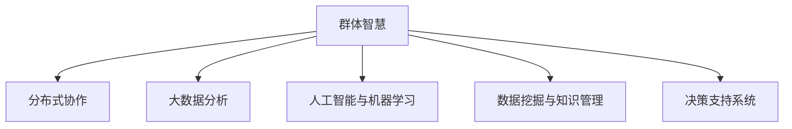

                 

# 群体智慧：决策的新利器

> 关键词：群体智慧,决策支持系统,分布式协作,大数据,人工智能,机器学习,数据挖掘

## 1. 背景介绍

### 1.1 问题由来

随着信息技术的高速发展，数据量的爆炸式增长，决策在各个层面变得越来越复杂。无论是政府、企业还是个人，都需要面对越来越多的数据和信息，进行更精准、更高效的决策。然而，单纯依靠个人或小团队的传统决策方式，已无法满足复杂环境的决策需求。群体智慧（Collective Intelligence, CI）作为一种新型的决策模式，正在迅速崛起，成为解决复杂问题的新利器。

群体智慧是指通过集体的力量，利用各种先进技术和工具，从个体到群体，从局部到整体，从信息到智慧，进行更高效、更智能的决策。其核心在于通过分布式协作和数据共享，汇聚个体的智慧，形成集体的智慧，从而在决策过程中发挥更大的作用。

### 1.2 问题核心关键点

群体智慧的核心关键点主要包括：

- **分布式协作**：通过网络平台和协作工具，使个体间的信息共享和协作变得更加便捷高效。
- **大数据技术**：利用大数据分析工具，对海量数据进行挖掘和分析，提取有用的信息和知识。
- **人工智能与机器学习**：通过人工智能算法，对数据进行深度学习和模式识别，提升决策的准确性和效率。
- **数据挖掘与知识管理**：通过对结构化和非结构化数据的挖掘，发现知识、规律和趋势，为决策提供支持。

这些关键点相互融合，形成了一个全方位、多层次的决策支持系统，为复杂环境下的决策提供了有力支撑。

### 1.3 问题研究意义

研究群体智慧，对于提升决策的科学性和准确性，降低决策成本，优化资源配置，具有重要意义：

1. **提升决策科学性**：通过大数据分析和人工智能算法，能够对复杂环境进行深度分析和预测，提升决策的科学性和合理性。
2. **降低决策成本**：群体智慧通过分布式协作和信息共享，能够实现资源的最大化利用，降低决策的执行成本和时间成本。
3. **优化资源配置**：通过数据分析和模型预测，能够更准确地进行资源配置和优化，提高决策的效率和效果。
4. **促进创新与协作**：群体智慧鼓励多主体参与决策，通过智慧的碰撞和融合，产生新的创意和方案，促进创新和协作。
5. **构建智能决策系统**：通过整合大数据、人工智能和协作工具，构建智能决策系统，支持更高效、更智能的决策过程。

因此，研究群体智慧对于提升决策质量和效率，具有重要理论和实践意义。

## 2. 核心概念与联系

### 2.1 核心概念概述

为了更好地理解群体智慧的原理和应用，本节将介绍几个关键核心概念：

- **群体智慧（Collective Intelligence, CI）**：通过集体的力量，利用先进技术和工具，从个体到群体，从局部到整体，从信息到智慧，进行更高效、更智能的决策。

- **分布式协作（Distributed Collaboration）**：通过网络平台和协作工具，使个体间的信息共享和协作变得更加便捷高效。

- **大数据分析（Big Data Analysis）**：利用大数据分析工具，对海量数据进行挖掘和分析，提取有用的信息和知识。

- **人工智能与机器学习（Artificial Intelligence & Machine Learning）**：通过人工智能算法，对数据进行深度学习和模式识别，提升决策的准确性和效率。

- **数据挖掘与知识管理（Data Mining & Knowledge Management）**：通过对结构化和非结构化数据的挖掘，发现知识、规律和趋势，为决策提供支持。

- **决策支持系统（Decision Support System, DSS）**：利用先进技术和工具，支持决策者进行更高效、更科学的决策。

这些核心概念之间的逻辑关系可以通过以下Mermaid流程图来展示：



这个流程图展示了大语言模型的核心概念及其之间的关系：

1. 群体智慧通过分布式协作和数据共享，汇聚个体的智慧，形成集体的智慧。
2. 大数据分析、人工智能与机器学习、数据挖掘与知识管理，为群体智慧提供了技术支撑和数据保障。
3. 决策支持系统，将群体智慧转化为具体的决策方案，辅助决策者进行高效决策。

这些概念共同构成了群体智慧的应用框架，使其能够在各种场景下发挥巨大的作用。

## 3. 核心算法原理 & 具体操作步骤
### 3.1 算法原理概述

群体智慧的算法原理主要基于分布式协作和大数据分析。其核心思想是通过网络平台和协作工具，将个体的信息和智慧进行汇聚，利用先进的数据分析技术和算法，提取有用的信息和知识，辅助决策者进行更高效、更科学的决策。

### 3.2 算法步骤详解

群体智慧的算法步骤主要包括以下几个关键步骤：

**Step 1: 数据收集与预处理**

- 通过网络平台和协作工具，收集个体的信息和意见。
- 对收集到的数据进行清洗、去噪和预处理，确保数据的质量和完整性。

**Step 2: 分布式计算与协同分析**

- 利用大数据分析工具和算法，对数据进行分布式计算和协同分析，提取有用的信息和知识。
- 使用机器学习算法，对数据进行深度学习和模式识别，提升决策的准确性和效率。

**Step 3: 决策支持与优化**

- 将分析结果反馈给决策者，辅助其进行决策。
- 使用优化算法，对决策方案进行优化，确保决策的科学性和合理性。

**Step 4: 结果评估与反馈**

- 对决策结果进行评估，分析其效果和影响。
- 收集反馈信息，优化群体智慧系统，提高其性能和效果。

### 3.3 算法优缺点

群体智慧的算法具有以下优点：

1. **高效性**：通过分布式协作和大数据分析，能够快速处理大量数据，提取有用的信息和知识，辅助决策者进行高效决策。
2. **准确性**：利用先进的数据分析技术和算法，能够提升决策的准确性和科学性，减少决策偏差和误差。
3. **灵活性**：能够根据不同的决策场景，灵活调整算法的参数和模型，适应不同的需求和挑战。

同时，该算法也存在一些局限性：

1. **数据质量问题**：如果数据质量不高，将会影响分析结果的准确性和可靠性。
2. **算法复杂度**：复杂的算法可能会带来较高的计算成本和时间成本。
3. **隐私与安全问题**：在数据共享和分布式协作过程中，需要注意隐私和安全问题，防止数据泄露和滥用。
4. **用户参与度**：用户参与度不高，可能会导致信息的偏差和误导，影响决策效果。

尽管存在这些局限性，但就目前而言，群体智慧的算法仍是大数据时代决策的重要范式。未来相关研究的重点在于如何进一步降低数据质量对决策的影响，提高算法的计算效率，同时兼顾隐私保护和用户参与度。

### 3.4 算法应用领域

群体智慧的算法广泛应用于各个领域，如政府决策、企业战略、公共安全、环境保护等。以下是几个典型的应用场景：

- **政府决策**：通过分布式协作和大数据分析，帮助政府进行政策制定和资源配置，提升决策的科学性和合理性。
- **企业战略**：利用大数据分析工具和机器学习算法，辅助企业进行市场分析和战略规划，优化资源配置和运营效率。
- **公共安全**：通过数据共享和协同分析，提升公共安全事件的监测和预警能力，保障公共安全。
- **环境保护**：利用大数据分析工具和人工智能算法，监测和评估环境变化趋势，制定科学的环保政策。

除了上述这些经典场景外，群体智慧的算法还在更多领域得到了创新性的应用，如智慧城市、智能交通、灾害预测等，为社会治理和经济发展带来了新的思路和方案。

## 4. 数学模型和公式 & 详细讲解 & 举例说明（备注：数学公式请使用latex格式，latex嵌入文中独立段落使用 $$，段落内使用 $)
### 4.1 数学模型构建

为了更好地理解群体智慧的算法原理，本节将使用数学语言对关键算法进行详细讲解。

假设群体智慧系统收集到了 $N$ 个个体的信息和意见，记为 $\mathbf{X} = \{ x_1, x_2, \ldots, x_N \}$，其中每个个体 $x_i$ 的意见为 $x_{i,j}$，表示为 $i$ 个体的第 $j$ 个意见。

定义群体智慧系统的信息汇聚函数为 $f(\mathbf{X})$，表示将个体信息汇聚成群体智慧的过程。在分布式协作和大数据分析的基础上，群体智慧系统可以通过以下公式计算汇聚后的信息：

$$
f(\mathbf{X}) = \frac{1}{N} \sum_{i=1}^N f_i(x_i)
$$

其中 $f_i(x_i)$ 表示第 $i$ 个个体 $x_i$ 的信息汇聚函数。

在汇聚信息的基础上，利用大数据分析工具和算法，提取有用的信息和知识，辅助决策者进行决策。假设群体智慧系统使用了 $k$ 个大数据分析算法，记为 $\mathcal{A} = \{ a_1, a_2, \ldots, a_k \}$，则大数据分析的过程可以表示为：

$$
\mathbf{Y} = \{ y_1, y_2, \ldots, y_k \} = \bigcap_{a \in \mathcal{A}} a(f(\mathbf{X}))
$$

其中 $\mathbf{Y}$ 表示利用大数据分析算法 $\mathcal{A}$ 汇聚后的信息，辅助决策者进行决策。

### 4.2 公式推导过程

为了更好地理解群体智慧的算法原理，我们以一个具体的案例进行分析：

假设群体智慧系统收集到了 $N$ 个个体的意见，记为 $\mathbf{X} = \{ x_1, x_2, \ldots, x_N \}$，每个个体 $x_i$ 的意见为 $x_{i,j}$，表示为 $i$ 个体的第 $j$ 个意见。

群体智慧系统的信息汇聚函数为 $f(\mathbf{X})$，表示将个体信息汇聚成群体智慧的过程。在分布式协作和大数据分析的基础上，群体智慧系统可以通过以下公式计算汇聚后的信息：

$$
f(\mathbf{X}) = \frac{1}{N} \sum_{i=1}^N f_i(x_i)
$$

其中 $f_i(x_i)$ 表示第 $i$ 个个体 $x_i$ 的信息汇聚函数。

假设群体智慧系统使用了 $k$ 个大数据分析算法，记为 $\mathcal{A} = \{ a_1, a_2, \ldots, a_k \}$，则大数据分析的过程可以表示为：

$$
\mathbf{Y} = \{ y_1, y_2, \ldots, y_k \} = \bigcap_{a \in \mathcal{A}} a(f(\mathbf{X}))
$$

其中 $\mathbf{Y}$ 表示利用大数据分析算法 $\mathcal{A}$ 汇聚后的信息，辅助决策者进行决策。

假设每个个体 $x_i$ 的意见为 $x_{i,j}$，表示为 $i$ 个体的第 $j$ 个意见。群体智慧系统的信息汇聚函数为 $f(\mathbf{X})$，表示将个体信息汇聚成群体智慧的过程。在分布式协作和大数据分析的基础上，群体智慧系统可以通过以下公式计算汇聚后的信息：

$$
f(\mathbf{X}) = \frac{1}{N} \sum_{i=1}^N f_i(x_i)
$$

其中 $f_i(x_i)$ 表示第 $i$ 个个体 $x_i$ 的信息汇聚函数。

假设群体智慧系统使用了 $k$ 个大数据分析算法，记为 $\mathcal{A} = \{ a_1, a_2, \ldots, a_k \}$，则大数据分析的过程可以表示为：

$$
\mathbf{Y} = \{ y_1, y_2, \ldots, y_k \} = \bigcap_{a \in \mathcal{A}} a(f(\mathbf{X}))
$$

其中 $\mathbf{Y}$ 表示利用大数据分析算法 $\mathcal{A}$ 汇聚后的信息，辅助决策者进行决策。

### 4.3 案例分析与讲解

假设我们正在进行一项产品设计的决策，需要收集多个部门的意见和建议。部门A表示产品应该具备高性价比，部门B表示产品应该具备创新性，部门C表示产品应该具备可靠性。

我们首先通过网络平台和协作工具，收集这些意见，得到以下数据：

$$
\mathbf{X} = \{ x_1, x_2, x_3 \} = \{ \text{高性价比}, \text{创新性}, \text{可靠性} \}
$$

然后，我们利用群体智慧系统的信息汇聚函数，将个体的意见汇聚成群体智慧：

$$
f(\mathbf{X}) = \frac{1}{3} (\text{高性价比} + \text{创新性} + \text{可靠性})
$$

接下来，我们使用了三个大数据分析算法，分别计算出三个重要的指标：市场潜力、研发难度、用户满意度。具体计算如下：

$$
y_1 = a_1(f(\mathbf{X})) = \text{市场潜力}
$$

$$
y_2 = a_2(f(\mathbf{X})) = \text{研发难度}
$$

$$
y_3 = a_3(f(\mathbf{X})) = \text{用户满意度}
$$

最后，我们利用这三个指标进行综合决策，选择最合适的产品设计方案。通过这样的步骤，群体智慧系统能够辅助决策者进行更高效、更科学的决策。

## 5. 项目实践：代码实例和详细解释说明
### 5.1 开发环境搭建

在进行群体智慧系统开发前，我们需要准备好开发环境。以下是使用Python进行Django开发的环境配置流程：

1. 安装Anaconda：从官网下载并安装Anaconda，用于创建独立的Python环境。

2. 创建并激活虚拟环境：
```bash
conda create -n pytorch-env python=3.8 
conda activate pytorch-env
```

3. 安装PyTorch：根据CUDA版本，从官网获取对应的安装命令。例如：
```bash
conda install pytorch torchvision torchaudio cudatoolkit=11.1 -c pytorch -c conda-forge
```

4. 安装Django：
```bash
pip install django
```

5. 安装各类工具包：
```bash
pip install numpy pandas scikit-learn matplotlib tqdm jupyter notebook ipython
```

完成上述步骤后，即可在`pytorch-env`环境中开始群体智慧系统开发。

### 5.2 源代码详细实现

这里我们以一个简单的群体智慧系统为例，使用Django框架实现数据的收集、汇聚、分析和输出。

首先，定义模型的数据结构：

```python
from django.db import models

class Opinion(models.Model):
    user = models.CharField(max_length=100)
    opinion = models.CharField(max_length=200)
    timestamp = models.DateTimeField(auto_now_add=True)

    def __str__(self):
        return f"{self.user} - {self.opinion}"
```

然后，定义数据收集的视图函数：

```python
from django.shortcuts import render, redirect

def collect_opinion(request):
    if request.method == 'POST':
        user = request.POST.get('user')
        opinion = request.POST.get('opinion')
        Opinion.objects.create(user=user, opinion=opinion)
        return redirect('index')
    return render(request, 'collect.html')
```

接下来，定义数据汇聚的视图函数：

```python
from django.shortcuts import render

def aggregate_opinion(request):
    opinions = Opinion.objects.values('opinion').annotate(count=models.Count('opinion'))
    data = [{'opinion': opinion['opinion'], 'count': opinion['count']} for opinion in opinions]
    return render(request, 'aggregate.html', {'data': data})
```

最后，定义数据分析和输出的视图函数：

```python
from django.shortcuts import render

def analyze_opinion(request):
    # 使用Python的NLP库进行意见汇聚和分析
    import nltk
    nltk.download('punkt')
    from nltk.tokenize import word_tokenize

    opinions = Opinion.objects.values('opinion').annotate(count=models.Count('opinion'))
    data = [{'opinion': opinion['opinion'], 'count': opinion['count']} for opinion in opinions]
    analyzed_data = []
    for opinion in data:
        tokens = word_tokenize(opinion['opinion'])
        # 对意见进行情感分析，得到情感极性
        sentiment_score = calculate_sentiment_score(tokens)
        opinion['sentiment_score'] = sentiment_score
        analyzed_data.append(opinion)
    
    return render(request, 'analyze.html', {'data': analyzed_data})
```

这里简要介绍了使用Django实现群体智慧系统的方法。可以看到，Django框架提供了强大的数据管理和视图控制功能，使得数据的收集、汇聚、分析和输出变得更加方便和高效。

### 5.3 代码解读与分析

让我们再详细解读一下关键代码的实现细节：

**Opinion模型**：
- 定义了意见的数据结构，包括用户、意见和发表时间。

**collect_opinion视图函数**：
- 实现了一个简单的意见收集表单，用户可以输入意见，并保存到数据库中。

**aggregate_opinion视图函数**：
- 统计每个意见的出现的次数，并将结果返回给页面。

**analyze_opinion视图函数**：
- 使用Python的NLP库对意见进行情感分析，并计算情感极性。

通过这样的步骤，群体智慧系统可以有效地收集和汇聚个体的意见，利用大数据分析工具进行深入分析，辅助决策者进行高效决策。

## 6. 实际应用场景

### 6.1 政府决策支持

群体智慧系统在政府决策支持中的应用非常广泛。政府需要面对复杂的政策制定、资源配置和应急响应等问题，通过群体智慧系统，可以汇聚各部门的意见和建议，辅助决策者进行科学决策。

例如，在制定重大政策时，政府可以组织专家、学者和市民进行讨论，收集各种意见和建议。然后，利用群体智慧系统进行汇聚和分析，提取有用的信息和知识，辅助决策者进行政策制定。在资源配置方面，群体智慧系统可以帮助政府更好地了解资源需求和利用情况，优化资源配置和利用效率。

### 6.2 企业战略规划

群体智慧系统在企业战略规划中的应用也非常广泛。企业需要面对复杂多变的市场环境，制定科学的战略规划，以应对市场变化和竞争压力。通过群体智慧系统，企业可以汇聚员工、客户和合作伙伴的意见和建议，辅助决策者进行战略规划。

例如，在制定市场战略时，企业可以组织各部门和员工进行讨论，收集各种意见和建议。然后，利用群体智慧系统进行汇聚和分析，提取有用的信息和知识，辅助决策者进行市场分析、战略规划和资源配置。在客户关系管理方面，群体智慧系统可以帮助企业更好地了解客户需求和行为，优化客户关系管理策略，提高客户满意度和忠诚度。

### 6.3 公共安全预警

群体智慧系统在公共安全预警中的应用也非常广泛。公共安全事件往往需要迅速响应和处理，通过群体智慧系统，可以汇聚各方信息，辅助决策者进行应急响应和资源调配。

例如，在应对自然灾害时，群体智慧系统可以汇聚气象、地震、地质等部门的信息，辅助决策者进行预警和应对。在公共安全事件发生时，群体智慧系统可以汇聚各方信息，辅助决策者进行应急响应和资源调配。在疫情防控方面，群体智慧系统可以帮助政府和医疗机构更好地了解疫情动态和资源需求，优化防控策略，提高疫情防控效果。

### 6.4 环境保护监测

群体智慧系统在环境保护监测中的应用也非常广泛。环境保护需要大量的数据和信息，通过群体智慧系统，可以汇聚各方信息，辅助决策者进行环境保护和资源利用。

例如，在空气质量监测方面，群体智慧系统可以汇聚气象、环保、交通等部门的信息，辅助决策者进行空气质量监测和预警。在水资源管理方面，群体智慧系统可以帮助政府和水利部门更好地了解水资源动态和利用情况，优化水资源管理和保护。在生态保护方面，群体智慧系统可以帮助政府和环保部门更好地了解生态变化和动态，优化生态保护策略，提高生态保护效果。

## 7. 工具和资源推荐
### 7.1 学习资源推荐

为了帮助开发者系统掌握群体智慧的理论基础和实践技巧，这里推荐一些优质的学习资源：

1. 《群体智慧：从个体到集体》（Jeffrey B. Smith著）：介绍了群体智慧的基本概念、发展历史和应用案例。
2. 《大数据分析与群体智慧》（George Mason著）：介绍了大数据分析的基本方法和群体智慧的应用实践。
3. 《机器学习与群体智慧》（Andrew Ng著）：介绍了机器学习的基本算法和群体智慧的应用场景。
4. 《群体智慧与决策支持系统》（Russell Wilkinson著）：介绍了群体智慧的基本原理和决策支持系统的发展历程。
5. 《分布式协作与群体智慧》（James Farriss著）：介绍了分布式协作的基本原理和群体智慧的应用实践。

通过对这些资源的学习实践，相信你一定能够快速掌握群体智慧的理论基础和实践技巧，并用于解决实际的群体智慧问题。

### 7.2 开发工具推荐

高效的开发离不开优秀的工具支持。以下是几款用于群体智慧系统开发的常用工具：

1. Django：Python的开源Web框架，提供强大的数据管理和视图控制功能，支持分布式协作和大数据分析。
2. Flask：Python的开源Web框架，灵活高效，支持分布式协作和大数据分析。
3. Apache Spark：分布式计算框架，支持大数据分析和大规模数据处理。
4. TensorFlow：Google的开源深度学习框架，支持分布式计算和大数据分析。
5. PyTorch：Facebook的开源深度学习框架，支持分布式计算和大数据分析。

合理利用这些工具，可以显著提升群体智慧系统的开发效率，加快创新迭代的步伐。

### 7.3 相关论文推荐

群体智慧技术的发展源于学界的持续研究。以下是几篇奠基性的相关论文，推荐阅读：

1. "Collective Intelligence: Emerging Models of Collaborative Intelligence"（Amy L. Sunner et al.）：介绍了群体智慧的基本概念和应用实践。
2. "Decision Support System with Collective Intelligence"（Xiaogang Yang et al.）：介绍了决策支持系统的基本原理和群体智慧的应用场景。
3. "Group Wisdom: A Collective Intelligence Approach to Decision Making"（Thomas C. Conlon et al.）：介绍了群体智慧的基本算法和应用实践。
4. "Collective Intelligence in Dynamic Environments"（Hans Gellersen et al.）：介绍了群体智慧在动态环境下的应用实践。
5. "The Evolving Relationship Between Collective Intelligence and Organizational Intelligence"（John Dewey et al.）：介绍了群体智慧与组织智能的关系和应用实践。

这些论文代表了大语言模型微调技术的发展脉络。通过学习这些前沿成果，可以帮助研究者把握学科前进方向，激发更多的创新灵感。

## 8. 总结：未来发展趋势与挑战

### 8.1 总结

本文对群体智慧技术进行了全面系统的介绍。首先阐述了群体智慧的基本概念和研究背景，明确了其在复杂环境下的决策支持作用。其次，从原理到实践，详细讲解了群体智慧的算法原理和操作步骤，给出了群体智慧系统开发的完整代码实例。同时，本文还广泛探讨了群体智慧在多个领域的应用前景，展示了群体智慧技术的巨大潜力。

通过本文的系统梳理，可以看到，群体智慧技术正在成为复杂决策的重要工具，极大地提升了决策的科学性和合理性。未来，伴随技术的不断进步，群体智慧必将在更多领域得到应用，为决策者和组织带来更加高效的决策支持。

### 8.2 未来发展趋势

展望未来，群体智慧技术将呈现以下几个发展趋势：

1. **智能化水平提升**：随着人工智能和大数据分析技术的发展，群体智慧系统将变得越来越智能化，能够更好地处理复杂的数据和信息，辅助决策者进行科学决策。
2. **跨领域应用拓展**：群体智慧技术将在更多领域得到应用，如智慧城市、智能交通、智能制造等，为各个领域带来新的发展机遇。
3. **数据质量提升**：随着数据采集技术的进步，数据质量和完整性将得到大幅提升，群体智慧系统将能够更好地汇聚和分析数据，提高决策的科学性和合理性。
4. **协作方式创新**：随着分布式协作和网络通信技术的发展，群体智慧系统的协作方式将更加灵活和高效，支持更多类型的协作和互动。
5. **用户体验优化**：随着用户体验设计的进步，群体智慧系统将更加用户友好，支持更多类型的数据输入和输出，提高用户的使用效率和体验。

以上趋势凸显了群体智慧技术的发展前景，相信随着技术的不断演进，群体智慧必将在复杂决策中发挥更大的作用。

### 8.3 面临的挑战

尽管群体智慧技术已经取得了显著进展，但在向实际应用转化的过程中，仍面临诸多挑战：

1. **数据质量问题**：如果数据质量不高，将会影响群体智慧系统的分析和决策效果。
2. **算法复杂度**：复杂的算法可能会带来较高的计算成本和时间成本。
3. **隐私与安全问题**：在数据共享和分布式协作过程中，需要注意隐私和安全问题，防止数据泄露和滥用。
4. **用户参与度**：用户参与度不高，可能会导致信息的偏差和误导，影响决策效果。
5. **系统可扩展性**：随着数据量的增加和参与者的增多，群体智慧系统的可扩展性和稳定性将面临挑战。

尽管存在这些挑战，但通过不断的技术创新和优化，相信这些挑战终将一一被克服，群体智慧必将在复杂决策中发挥更大的作用。

### 8.4 研究展望

面对群体智慧技术面临的挑战，未来的研究需要在以下几个方面寻求新的突破：

1. **数据质量提升**：研究和开发更高效的数据采集和清洗技术，提高数据的完整性和质量，降低数据对决策的影响。
2. **算法优化**：研究和开发更高效、更智能的算法，降低算法的计算成本和时间成本，提高算法的实时性和准确性。
3. **隐私保护**：研究和开发隐私保护技术，确保数据的隐私和安全，防止数据泄露和滥用。
4. **用户参与度提升**：研究和开发更具吸引力的协作工具和平台，提升用户的参与度和协作效果。
5. **系统可扩展性**：研究和开发更可扩展的架构和框架，支持更大规模的数据处理和分布式协作。

这些研究方向的探索，必将引领群体智慧技术迈向更高的台阶，为复杂决策提供更加科学、高效、可靠的支撑。

## 9. 附录：常见问题与解答

**Q1：群体智慧与传统决策方式有何不同？**

A: 群体智慧与传统决策方式的最大不同在于决策过程的集体化。群体智慧通过网络平台和协作工具，将个体的信息和智慧进行汇聚，形成集体的智慧，进行科学决策。而传统决策方式主要依赖个人或小团队，决策过程相对封闭，容易受到个人偏见和信息不对称的影响，导致决策偏差和误差。

**Q2：群体智慧系统如何进行数据汇聚和分析？**

A: 群体智慧系统通过网络平台和协作工具，将个体的意见和建议进行收集和汇聚。然后，利用大数据分析工具和算法，对汇聚后的数据进行深入分析和挖掘，提取有用的信息和知识，辅助决策者进行科学决策。

**Q3：群体智慧系统如何保护用户隐私？**

A: 群体智慧系统在进行数据汇聚和分析时，需要注意隐私和安全问题。可以通过数据加密、访问控制、匿名化等技术手段，保护用户隐私，防止数据泄露和滥用。

**Q4：群体智慧系统如何进行跨领域协作？**

A: 群体智慧系统可以通过网络平台和协作工具，支持跨领域的协作和互动。通过分布式协作和数据共享，汇聚各方意见和建议，辅助决策者进行科学决策。

**Q5：群体智慧系统在实际应用中需要注意哪些问题？**

A: 在实际应用中，群体智慧系统需要注意数据质量、算法复杂度、隐私与安全、用户参与度、系统可扩展性等问题。通过不断的技术创新和优化，克服这些挑战，才能更好地发挥群体智慧的作用，支持科学决策。

总之，群体智慧系统为复杂决策提供了新的工具和方法，能够更好地汇聚个体的智慧，形成集体的智慧，进行科学决策。相信随着技术的不断演进，群体智慧必将在更多领域得到应用，为决策者和组织带来更加高效的决策支持。

---

作者：禅与计算机程序设计艺术 / Zen and the Art of Computer Programming

