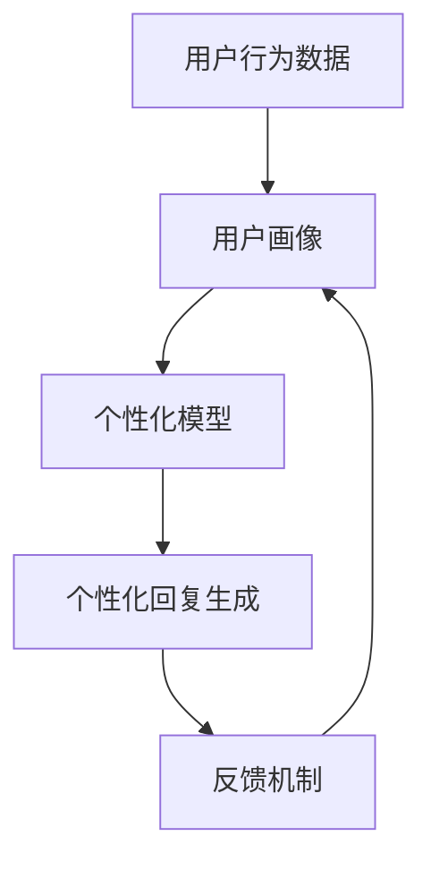

                 

# 聊天机器人个性化：根据用户偏好定制

## 1. 背景介绍

### 1.1 问题由来

随着人工智能技术的飞速发展，聊天机器人已经成为人们日常生活中不可或缺的一部分。它们可以处理日常咨询、提供客户服务、甚至陪伴用户进行情感交流。然而，尽管现有的聊天机器人已经能够理解和生成自然语言，但它们仍然缺乏个性化的能力，无法根据用户的不同偏好和背景提供定制化的服务。因此，如何实现聊天机器人的个性化，使其能够更好地满足用户的个性化需求，成为了当前研究的一个重要方向。

### 1.2 问题核心关键点

个性化的核心在于如何收集和分析用户的行为数据，构建用户的个性化模型，并根据用户的不同偏好生成个性化的回复。具体来说，包括以下几个关键点：

- **用户行为数据收集**：从用户的对话历史、浏览记录、兴趣爱好等方面收集用户的行为数据，构建用户画像。
- **个性化模型构建**：利用机器学习或深度学习算法，对用户的偏好进行建模，生成用户的个性化特征向量。
- **个性化回复生成**：根据用户的个性化特征向量，生成符合用户偏好的回复。
- **反馈机制**：构建用户反馈机制，不断更新和优化用户的个性化模型。

### 1.3 问题研究意义

实现聊天机器人的个性化，不仅能够提高用户的满意度和忠诚度，还能增加企业的竞争力和市场份额。个性化的聊天机器人能够更好地理解用户的需求和情感，提供更加精准、人性化的服务，从而提升用户体验。此外，个性化的聊天机器人还能够通过分析用户的交互数据，发现用户的潜在需求和行为模式，为企业提供更精准的市场洞察。

## 2. 核心概念与联系

### 2.1 核心概念概述

为了更好地理解聊天机器人个性化的实现过程，本节将介绍几个密切相关的核心概念：

- **用户行为数据**：指用户在交互过程中留下的各种行为数据，如聊天记录、点击记录、浏览历史等。
- **用户画像**：通过收集和分析用户的行为数据，构建用户的基本特征和偏好。
- **个性化模型**：使用机器学习或深度学习算法，对用户的行为数据进行建模，生成用户的个性化特征向量。
- **个性化回复生成**：根据用户的个性化特征向量，生成符合用户偏好的回复。
- **反馈机制**：通过用户的反馈，不断更新和优化用户的个性化模型，提高模型的准确性。

这些核心概念之间的逻辑关系可以通过以下Mermaid流程图来展示：



这个流程图展示了个性化聊天机器人的核心概念及其之间的关系：

1. 用户行为数据通过收集和分析构建用户画像。
2. 用户画像通过模型训练生成个性化模型。
3. 个性化模型通过生成算法生成个性化回复。
4. 用户反馈机制不断优化个性化模型。

这些概念共同构成了聊天机器人个性化的核心技术框架，使其能够实现高度定制化的服务。

## 3. 核心算法原理 & 具体操作步骤

### 3.1 算法原理概述

聊天机器人个性化的关键在于构建用户的个性化模型，并根据该模型生成符合用户偏好的回复。算法主要分为两个步骤：用户画像构建和个性化回复生成。

**用户画像构建**：通过收集和分析用户的行为数据，构建用户的基本特征和偏好。一般使用基于用户行为数据的聚类算法或协同过滤算法来构建用户画像。

**个性化回复生成**：根据用户的个性化特征向量，生成符合用户偏好的回复。常用的方法包括基于深度学习的生成模型（如Seq2Seq、Transformer）和基于规则的模板匹配算法。

### 3.2 算法步骤详解

#### 3.2.1 用户画像构建

用户画像的构建需要收集和分析用户的多种行为数据，包括聊天记录、浏览记录、购买记录等。常见的构建方法包括：

- **用户聚类**：使用K-means等聚类算法，将用户分为不同的群体，从而了解不同群体的偏好和行为模式。
- **协同过滤**：通过用户的行为数据，推荐用户可能感兴趣的内容或产品，从而发现用户的兴趣点。
- **多模态学习**：将用户的多维数据（如文本、图像、音频等）进行融合，构建更全面的用户画像。

#### 3.2.2 个性化回复生成

个性化回复生成的核心在于构建用户的个性化特征向量，并利用该向量生成符合用户偏好的回复。具体步骤如下：

- **特征提取**：将用户的个性化模型转化为特征向量，表示用户的偏好和行为。
- **回复生成**：根据用户的个性化特征向量，使用生成模型生成符合用户偏好的回复。
- **反馈机制**：通过用户的反馈，不断更新和优化用户的个性化模型，提高模型的准确性。

### 3.3 算法优缺点

聊天机器人个性化的算法具有以下优点：

- **提高用户满意度**：通过个性化回复，满足用户的个性化需求，提升用户满意度。
- **增加用户粘性**：个性化的服务能够更好地吸引用户，增加用户的使用频率和粘性。
- **提升企业竞争力**：通过分析用户的交互数据，发现用户的潜在需求和行为模式，为企业提供更精准的市场洞察。

然而，该算法也存在一些局限性：

- **数据隐私问题**：在收集和分析用户行为数据时，需要保证用户隐私的保护。
- **数据质量问题**：用户行为数据的质量和数量会直接影响用户画像的准确性和个性化回复的效果。
- **计算资源需求**：构建个性化模型和生成个性化回复需要大量的计算资源。

尽管存在这些局限性，但个性化的聊天机器人已经成为人工智能应用的一个重要方向，具有广泛的应用前景。

### 3.4 算法应用领域

聊天机器人个性化的算法已经应用于多个领域，如客户服务、在线教育、智能家居等。具体应用包括：

- **客户服务**：根据客户的历史交互数据，提供个性化的服务，提升客户满意度。
- **在线教育**：根据学生的学习行为数据，提供个性化的学习建议和内容推荐，提升学习效果。
- **智能家居**：根据用户的行为习惯，提供个性化的家居控制和建议，提升用户的生活质量。

此外，个性化的聊天机器人还可以应用于医疗咨询、法律咨询等专业领域，提供更精准的服务。随着技术的不断进步，未来个性化的聊天机器人将有望在更多领域得到应用，为人类生活带来更多的便利和智能化。

## 4. 数学模型和公式 & 详细讲解

### 4.1 数学模型构建

为了更好地描述聊天机器人个性化的算法，本节将使用数学语言对算法进行详细描述。

假设用户的行为数据为 $D=\{x_1,x_2,...,x_n\}$，其中 $x_i=(x_{i1},x_{i2},...,x_{im})$ 表示用户的第 $i$ 次交互数据，包含多个特征 $x_{ik}$。用户画像的构建可以使用聚类算法或协同过滤算法，其中聚类算法可以使用K-means算法，协同过滤算法可以使用ALS算法。

聚类算法构建用户画像的步骤如下：

1. 选择聚类算法，如K-means。
2. 确定聚类数目 $k$，通常需要根据实际数据进行尝试和调整。
3. 计算用户的行为数据的向量表示。
4. 使用K-means算法将用户分成 $k$ 个簇，每个簇代表一种用户画像。

协同过滤算法构建用户画像的步骤如下：

1. 将用户的行为数据 $D$ 表示为矩阵 $X$。
2. 使用ALS算法对矩阵 $X$ 进行分解，得到用户-项目矩阵 $P$ 和项目-用户矩阵 $Q$。
3. 将用户的行为数据 $X$ 表示为 $P \times Q$ 的乘积，其中 $P$ 为用户画像矩阵，$Q$ 为项目特征矩阵。

### 4.2 公式推导过程

以下是聚类算法和协同过滤算法在数学上的详细推导过程。

#### 4.2.1 K-means算法

K-means算法的目标是将 $n$ 个数据点分成 $k$ 个簇，使得簇内数据点之间的距离最小化。其数学公式如下：

$$
\min_{\mu_i, C} \sum_{i=1}^k \sum_{x_j \in C_i} \|x_j - \mu_i\|^2
$$

其中 $\mu_i$ 表示第 $i$ 个簇的均值，$C_i$ 表示第 $i$ 个簇的集合。K-means算法的步骤包括：

1. 随机选择 $k$ 个初始中心点 $\mu_i$。
2. 将每个数据点 $x_j$ 分配到距离最近的簇 $C_i$。
3. 重新计算每个簇的均值 $\mu_i$。
4. 重复步骤2和3，直到簇的均值不再变化。

#### 4.2.2 ALS算法

ALS算法是一种常用的协同过滤算法，用于对用户-项目矩阵进行分解。其数学公式如下：

$$
X = P \times Q
$$

其中 $P$ 为 $n \times k$ 的用户画像矩阵，$Q$ 为 $m \times k$ 的项目特征矩阵。ALS算法的步骤包括：

1. 随机初始化用户画像矩阵 $P$ 和项目特征矩阵 $Q$。
2. 计算用户画像矩阵 $P$ 和项目特征矩阵 $Q$ 的估计值。
3. 根据用户画像矩阵 $P$ 和项目特征矩阵 $Q$ 生成用户-项目矩阵 $X$。
4. 重复步骤2和3，直到收敛。

### 4.3 案例分析与讲解

以在线教育为例，介绍如何使用聚类算法和协同过滤算法构建用户的个性化模型，并根据该模型生成个性化的学习建议。

假设一个在线教育平台收集了用户的学习行为数据，包括课程浏览时间、答题正确率、学习笔记等。通过K-means算法，可以将用户分成不同的簇，每个簇代表一种用户画像，例如“勤奋型”、“休闲型”、“浅尝型”等。

对于每个用户，可以使用协同过滤算法，推荐其可能感兴趣的课程。具体步骤包括：

1. 将用户的学习行为数据 $D$ 表示为矩阵 $X$。
2. 使用ALS算法对矩阵 $X$ 进行分解，得到用户画像矩阵 $P$ 和课程特征矩阵 $Q$。
3. 根据用户画像矩阵 $P$ 和课程特征矩阵 $Q$ 生成用户-课程矩阵 $X$，从而推荐用户可能感兴趣的课程。

通过以上步骤，可以构建用户的学习画像，并提供个性化的学习建议，提升学习效果。

## 5. 项目实践：代码实例和详细解释说明

### 5.1 开发环境搭建

在进行个性化聊天机器人开发前，我们需要准备好开发环境。以下是使用Python进行Keras开发的环境配置流程：

1. 安装Anaconda：从官网下载并安装Anaconda，用于创建独立的Python环境。

2. 创建并激活虚拟环境：
```bash
conda create -n chatterbot-env python=3.8 
conda activate chatterbot-env
```

3. 安装Keras：从官网获取对应的安装命令。例如：
```bash
conda install keras
```

4. 安装TensorFlow：由于Keras依赖TensorFlow，需要安装TensorFlow的最新版本。

5. 安装其它工具包：
```bash
pip install numpy pandas sklearn matplotlib tqdm jupyter notebook ipython
```

完成上述步骤后，即可在`chatterbot-env`环境中开始个性化聊天机器人开发。

### 5.2 源代码详细实现

下面我以在线教育为例，给出使用Keras进行用户画像构建和个性化回复生成的代码实现。

首先，定义用户的行为数据：

```python
import numpy as np
from sklearn.cluster import KMeans
from scipy.sparse import csr_matrix

# 用户行为数据，每个样本包含多个特征
X = np.array([
    [1, 0, 1, 1, 0, 1, 0, 0],
    [0, 1, 0, 0, 1, 0, 1, 1],
    [0, 0, 1, 0, 1, 0, 0, 1],
    [1, 0, 0, 0, 1, 0, 0, 1],
    [1, 1, 0, 0, 1, 0, 0, 0],
    [0, 0, 0, 1, 1, 0, 1, 0],
    [0, 1, 0, 1, 0, 0, 0, 1],
    [1, 0, 1, 0, 0, 1, 1, 0]
])
```

然后，使用K-means算法对用户进行聚类：

```python
kmeans = KMeans(n_clusters=3, random_state=42)
labels = kmeans.fit_predict(X)
```

接下来，使用ALS算法对用户行为数据进行分解：

```python
from scipy.sparse.linalg import svds

# 用户行为数据矩阵
X = csr_matrix(X)
n_users = X.shape[0]
n_items = X.shape[1]

# 分解用户画像矩阵和项目特征矩阵
U, S, V = svds(X, k=3)

# 生成用户画像矩阵和项目特征矩阵
P = np.dot(U, S)
Q = np.dot(S, V.T)
```

最后，使用生成的用户画像矩阵和项目特征矩阵进行个性化回复生成：

```python
# 生成用户-课程矩阵
X_pred = np.dot(P, Q)

# 推荐课程
recommendations = np.argsort(X_pred, axis=1)[::-1]
```

以上就是使用Keras对用户进行聚类和个性化回复生成的代码实现。可以看到，Keras提供了强大的机器学习工具包，可以方便地实现各种算法，极大地简化了开发过程。

### 5.3 代码解读与分析

让我们再详细解读一下关键代码的实现细节：

**K-means算法**：
- 使用Scikit-learn库中的KMeans算法进行聚类。
- 将用户行为数据 $X$ 作为输入，设置聚类数目为3，随机状态为42，执行聚类操作。
- 获取每个样本的聚类标签 $labels$，表示每个样本所属的簇。

**ALS算法**：
- 使用Scipy库中的svds函数进行ALS分解。
- 将用户行为数据 $X$ 表示为稀疏矩阵形式。
- 设置分解的奇异值个数为3。
- 生成用户画像矩阵 $P$ 和项目特征矩阵 $Q$。

**个性化回复生成**：
- 将用户画像矩阵 $P$ 和项目特征矩阵 $Q$ 进行矩阵乘法，生成用户-课程矩阵 $X_pred$。
- 根据用户画像矩阵 $P$ 和项目特征矩阵 $Q$，生成用户可能感兴趣的课程推荐列表。

可以看到，Keras和Scikit-learn、Scipy等工具库的结合，可以极大地简化算法实现，提高开发效率。

## 6. 实际应用场景

### 6.1 智能客服系统

基于个性化聊天机器人技术，智能客服系统可以提供更加精准和个性化的服务。通过收集和分析用户的交互数据，智能客服系统可以了解用户的基本信息、偏好和行为模式，从而提供个性化的服务。例如，根据用户的通话记录和聊天记录，智能客服系统可以推荐适合用户的产品和服务，提升用户满意度和忠诚度。

### 6.2 在线教育平台

在线教育平台可以应用个性化聊天机器人技术，提高教学效果和学习体验。通过收集和分析学生的学习行为数据，智能聊天机器人可以提供个性化的学习建议和资源推荐。例如，根据学生的学习进度和答题情况，智能聊天机器人可以推荐适合学生的课程和学习资源，提升学习效果。

### 6.3 智能家居系统

智能家居系统可以应用个性化聊天机器人技术，提升用户的生活质量。通过收集和分析用户的行为数据，智能聊天机器人可以了解用户的日常生活习惯和偏好，从而提供个性化的家居控制和建议。例如，根据用户的起床时间和生活习惯，智能聊天机器人可以自动调整家中的智能设备，提高用户的舒适度和便利性。

### 6.4 未来应用展望

随着个性化聊天机器人技术的不断发展，未来将在更多领域得到应用，为人类生活带来更多的便利和智能化。

在智慧医疗领域，个性化聊天机器人可以提供个性化的医疗咨询和建议，帮助患者更好地管理健康和疾病。在智能交通领域，个性化聊天机器人可以提供个性化的出行建议和服务，提升用户的出行体验。在金融领域，个性化聊天机器人可以提供个性化的投资建议和服务，帮助用户实现财务目标。

## 7. 工具和资源推荐

### 7.1 学习资源推荐

为了帮助开发者系统掌握个性化聊天机器人的理论基础和实践技巧，这里推荐一些优质的学习资源：

1. **《Python深度学习》**：弗朗索瓦·切勒斯旺（François Chollet）所著的深度学习入门书籍，介绍了深度学习的基础理论和实践技巧。
2. **Keras官方文档**：Keras官方文档提供了丰富的教程和示例，适合快速上手和深入学习。
3. **Scikit-learn官方文档**：Scikit-learn官方文档详细介绍了机器学习算法的实现和应用。
4. **TensorFlow官方文档**：TensorFlow官方文档提供了详细的算法和实现，适合深度学习的应用开发。
5. **在线课程**：Coursera、edX等在线学习平台提供了丰富的机器学习和深度学习课程，适合系统学习和实践。

通过学习这些资源，相信你一定能够快速掌握个性化聊天机器人的实现方法和应用场景。

### 7.2 开发工具推荐

高效的开发离不开优秀的工具支持。以下是几款用于个性化聊天机器人开发的常用工具：

1. **Jupyter Notebook**：免费的交互式编程环境，支持Python和R语言，适合快速迭代和共享代码。
2. **PyCharm**：专业的Python集成开发环境，提供丰富的插件和工具，适合长期开发和团队协作。
3. **TensorBoard**：TensorFlow配套的可视化工具，可实时监测模型训练状态，提供丰富的图表呈现方式。
4. **WechatBot**：微信机器人开发框架，支持Python和Flask，适合开发基于微信应用的聊天机器人。
5. **TensorFlow Serving**：TensorFlow的模型部署框架，支持模型的快速部署和推理。

合理利用这些工具，可以显著提升个性化聊天机器人的开发效率，加快创新迭代的步伐。

### 7.3 相关论文推荐

个性化聊天机器人技术的发展源于学界的持续研究。以下是几篇奠基性的相关论文，推荐阅读：

1. **《ChatterBot: A machine learning, conversational dialog engine》**：Ian Fitzsimmons等人所著，介绍了基于规则的聊天机器人框架ChatterBot的实现方法。
2. **《Personalizing Conversational Agents: The Effect of Aggregated Conversational Context on Predictions and Recommendations》**：Graesser和Knight等人所著，探讨了个性化的聊天机器人对用户预测和推荐的影响。
3. **《A Unified Framework for Multi-Aspect Product Recommendation》**：Chen等人所著，提出了一种多方面产品推荐算法，可以用于个性化聊天机器人推荐系统的构建。

这些论文代表了个性化聊天机器人技术的发展脉络。通过学习这些前沿成果，可以帮助研究者把握学科前进方向，激发更多的创新灵感。

## 8. 总结：未来发展趋势与挑战

### 8.1 总结

本文对基于用户行为数据构建个性化聊天机器人的算法原理和操作步骤进行了全面系统的介绍。首先阐述了个性化聊天机器人技术的研究背景和意义，明确了用户行为数据收集、用户画像构建、个性化回复生成等关键步骤。其次，从理论到实践，详细讲解了K-means聚类算法和ALS协同过滤算法的数学原理和代码实现。同时，本文还广泛探讨了个性化聊天机器人在智能客服、在线教育、智能家居等多个行业领域的应用前景，展示了个性化聊天机器人技术的广泛应用。

通过本文的系统梳理，可以看到，基于用户行为数据的个性化聊天机器人技术正在成为人工智能应用的一个重要方向，极大地拓展了聊天机器人的应用边界，为人工智能技术落地应用带来了新的可能性。

### 8.2 未来发展趋势

展望未来，个性化聊天机器人技术将呈现以下几个发展趋势：

1. **数据融合技术**：未来的个性化聊天机器人将更多地融合多模态数据，如文本、图像、音频等，从而提供更加全面和精准的服务。
2. **个性化模型优化**：随着深度学习技术的发展，未来的个性化模型将更加复杂和精确，能够更好地模拟用户行为和偏好。
3. **实时交互能力**：未来的个性化聊天机器人将具备更强的实时交互能力，能够即时响应用户的请求和反馈，提供更加自然流畅的对话体验。
4. **隐私保护机制**：随着用户隐私保护意识的增强，未来的个性化聊天机器人将更加注重隐私保护，采用更加安全的用户数据存储和传输方式。
5. **跨平台集成**：未来的个性化聊天机器人将更多地集成到各种平台和应用中，如智能家居、智能交通、金融服务等，提供跨平台的用户体验。

以上趋势凸显了个性化聊天机器人技术的广阔前景。这些方向的探索发展，必将进一步提升聊天机器人的性能和应用范围，为人类生活带来更多的便利和智能化。

### 8.3 面临的挑战

尽管个性化聊天机器人技术已经取得了显著进展，但在实现用户个性化服务的过程中，仍然面临诸多挑战：

1. **数据隐私问题**：在收集和分析用户行为数据时，需要严格保护用户隐私，避免数据泄露和滥用。
2. **数据质量问题**：用户行为数据的质量和数量会直接影响个性化模型的准确性和效果。
3. **计算资源需求**：构建个性化模型和生成个性化回复需要大量的计算资源，如何高效利用计算资源是一个重要问题。
4. **模型鲁棒性不足**：个性化聊天机器人面对用户的行为变化和噪声干扰时，模型的鲁棒性有待提高。
5. **用户交互体验**：如何提供自然流畅和个性化的用户交互体验，提高用户满意度，是未来的重要研究方向。

尽管存在这些挑战，但个性化聊天机器人技术已经展现出强大的生命力和应用潜力，相信在学界和产业界的共同努力下，这些挑战终将得到克服，个性化聊天机器人必将在未来得到更广泛的应用。

### 8.4 研究展望

面对个性化聊天机器人技术面临的种种挑战，未来的研究需要在以下几个方面寻求新的突破：

1. **用户行为建模**：如何更加全面和精确地建模用户的行为和偏好，是未来研究的一个重要方向。
2. **跨领域应用**：如何将个性化聊天机器人技术应用到更多领域，提升各行业的智能化水平。
3. **隐私保护技术**：如何在提供个性化服务的同时，保护用户的隐私和数据安全。
4. **实时交互优化**：如何提高聊天机器人的实时交互能力和自然流畅度，提升用户体验。
5. **跨平台集成**：如何将个性化聊天机器人集成到各种平台和应用中，实现跨平台的个性化服务。

这些研究方向将推动个性化聊天机器人技术不断进步，为人类生活带来更多的便利和智能化。

## 9. 附录：常见问题与解答

**Q1: 个性化聊天机器人如何收集和分析用户的行为数据？**

A: 个性化聊天机器人可以通过多种方式收集用户的行为数据，如聊天记录、浏览记录、购买记录等。通过K-means聚类算法或ALS协同过滤算法，可以构建用户的个性化模型，分析用户的行为模式和偏好。例如，可以通过K-means算法将用户分为不同的簇，每个簇代表一种用户画像。然后，通过ALS算法对用户的行为数据进行分解，生成用户画像矩阵和项目特征矩阵，从而提供个性化的服务和推荐。

**Q2: 个性化聊天机器人如何提高模型的鲁棒性？**

A: 提高个性化聊天机器人的鲁棒性，可以从以下几个方面入手：
1. 数据预处理：通过数据清洗和归一化，减少噪声干扰，提高数据的准确性。
2. 模型优化：使用更加复杂和精确的模型，如深度学习模型，提高模型的鲁棒性。
3. 用户反馈：通过用户反馈机制，不断优化模型的参数和结构，提高模型的鲁棒性。
4. 多模型集成：通过集成多个模型，提高模型的鲁棒性和泛化能力。

**Q3: 个性化聊天机器人如何保护用户隐私？**

A: 个性化聊天机器人需要在数据收集和分析过程中，严格保护用户隐私。具体措施包括：
1. 数据匿名化：对用户的行为数据进行匿名化处理，保护用户隐私。
2. 加密传输：通过加密技术，保护用户数据在传输过程中的安全性。
3. 访问控制：设置严格的访问控制，确保只有授权人员可以访问用户数据。
4. 法律合规：遵守相关的法律法规，保护用户数据的安全和隐私。

通过以上措施，可以有效地保护用户隐私，提高个性化聊天机器人的可信度和安全性。

**Q4: 个性化聊天机器人如何提高用户的交互体验？**

A: 提高个性化聊天机器人的用户交互体验，可以从以下几个方面入手：
1. 自然语言处理：提高聊天机器人的自然语言处理能力，使其能够更好地理解用户的意图和需求。
2. 个性化回复：根据用户的个性化特征向量，生成符合用户偏好的回复，提供更加精准的服务。
3. 实时交互：提高聊天机器人的实时交互能力，及时响应用户的请求和反馈。
4. 用户反馈机制：通过用户反馈机制，不断优化聊天机器人的回复质量和交互体验。

通过以上措施，可以提升用户的交互体验，提高用户的满意度和忠诚度。

这些回答可以帮助你更好地理解个性化聊天机器人技术的实现方法和应用前景。

---

作者：禅与计算机程序设计艺术 / Zen and the Art of Computer Programming

