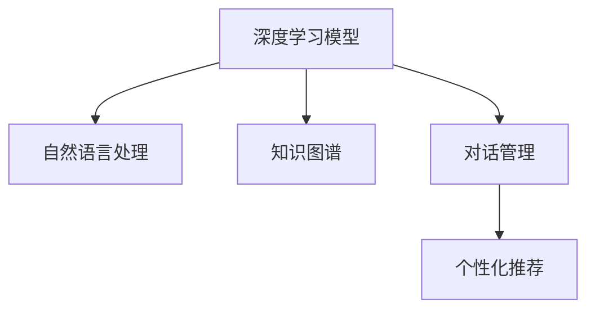

                 

# 聊天机器人：AI如何解答用户疑问，提升购物体验

> 关键词：聊天机器人, 人工智能, 自然语言处理(NLP), 深度学习, 购物体验, 客户服务, 智能推荐, 个性化

## 1. 背景介绍

### 1.1 问题由来
近年来，随着电子商务的飞速发展，在线购物已成为越来越多用户的首选方式。然而，与线下购物相比，在线购物面临的一个重要挑战是缺乏即时有效的客户服务。尤其是在遇到复杂问题时，用户无法获得快速、准确的解答，往往需要经历漫长的等待，甚至直接放弃购买，影响用户体验和销售转化率。

为了应对这一挑战，聊天机器人应运而生。基于深度学习和自然语言处理(NLP)技术的聊天机器人，可以通过自动化对话解决用户的疑问，提供个性化的购物推荐，提升用户购物体验。

### 1.2 问题核心关键点
聊天机器人通过与用户的自然语言交互，解答其疑问，推荐商品，从而提升购物体验。其核心关键点在于：

- 深度学习模型：利用深度学习技术，如卷积神经网络(CNN)、循环神经网络(RNN)、Transformer等，使得机器人能够理解和生成自然语言。
- 自然语言处理：通过NLP技术，如分词、词向量嵌入、序列标注等，将用户输入的自然语言转化为机器可理解的向量表示。
- 知识图谱：通过构建知识图谱，为机器人提供商品信息、价格、推荐规则等背景知识。
- 对话管理：通过对话管理技术，机器人可以控制对话流程，保持话题连贯，提高用户体验。
- 个性化推荐：通过分析用户的历史行为和偏好，机器人可以提供个性化的商品推荐，提升用户满意度。

这些核心技术共同构成了聊天机器人的工作原理和优化方向。通过理解这些关键点，我们可以更好地把握聊天机器人的应用前景和优化策略。

## 2. 核心概念与联系

### 2.1 核心概念概述

为更好地理解聊天机器人的技术实现，本节将介绍几个密切相关的核心概念：

- 深度学习模型：基于神经网络结构的深度学习模型，可以自动提取和处理复杂的数据模式。
- 自然语言处理：涉及文本处理、语言模型、语义理解、信息抽取等技术，使机器能够理解和生成自然语言。
- 知识图谱：由实体、属性、关系构成的图形结构，用于表示实体间的语义关系。
- 对话管理：通过管理对话状态和上下文，控制对话流程，保证对话连贯性和用户满意度。
- 个性化推荐：通过分析用户行为数据，提供个性化的商品推荐，提升用户体验和购买率。

这些核心概念之间的逻辑关系可以通过以下Mermaid流程图来展示：



这个流程图展示了聊天机器人的核心技术组件及其之间的关系：

1. 深度学习模型提供强大的数据处理能力，使机器人能够理解和生成自然语言。
2. 自然语言处理技术将用户输入的文本转化为向量表示，供深度学习模型处理。
3. 知识图谱提供商品信息、关系等背景知识，增强机器人的语义理解和推理能力。
4. 对话管理技术控制对话流程，保持话题连贯，提升用户体验。
5. 个性化推荐技术分析用户偏好，提供符合预期的商品推荐，增加销售转化率。

这些核心技术共同构成了聊天机器人的功能实现和优化方向。通过理解这些概念，我们可以更好地把握聊天机器人的技术架构和工作流程。

## 3. 核心算法原理 & 具体操作步骤
### 3.1 算法原理概述

聊天机器人通常基于深度学习模型进行训练，通过与用户对话获得自然语言数据，进行持续学习和优化。其核心算法原理如下：

1. **文本预处理**：将用户输入的文本进行分词、去停用词、词向量嵌入等处理，转化为模型可理解的向量表示。
2. **意图识别**：通过分类模型或序列标注模型，将用户输入的文本转化为意图类别，如查询商品、售后服务、支付咨询等。
3. **对话管理**：根据意图类别和上下文信息，生成对话回应，并通过对话状态管理技术，控制对话流程。
4. **知识推理**：结合知识图谱，对用户输入进行语义理解和推理，生成符合语义规则的对话回应。
5. **个性化推荐**：分析用户行为数据，提供个性化的商品推荐，提升用户体验。

### 3.2 算法步骤详解

以一个典型的购物聊天机器人为例，其算法流程如下：

**Step 1: 收集和预处理数据**
- 收集用户的历史对话数据，包括查询商品、售后服务、支付咨询等各类问题。
- 对数据进行清洗、分词、去停用词等预处理操作。
- 将预处理后的文本转化为词向量表示，供深度学习模型处理。

**Step 2: 意图识别**
- 设计意图识别模型，如LSTM或BERT等，将用户输入的文本转化为意图类别。
- 在训练集上训练模型，最小化分类误差。
- 使用测试集评估模型性能，调整模型参数。

**Step 3: 对话管理**
- 设计对话管理模型，如Seq2Seq模型或Transformers等，结合上下文信息生成对话回应。
- 在训练集上训练模型，最小化对话生成误差。
- 使用测试集评估模型性能，调整模型参数。

**Step 4: 知识推理**
- 构建知识图谱，描述商品信息、关系等背景知识。
- 将知识图谱与对话数据相结合，进行语义理解和推理。
- 在训练集上训练推理模型，最小化推理误差。
- 使用测试集评估模型性能，调整模型参数。

**Step 5: 个性化推荐**
- 收集用户的历史行为数据，如浏览记录、购买历史等。
- 分析用户行为数据，生成用户画像。
- 根据用户画像，生成个性化的商品推荐。
- 在训练集上训练推荐模型，最小化推荐误差。
- 使用测试集评估模型性能，调整模型参数。

**Step 6: 实时对话生成**
- 将意图识别、对话管理、知识推理和个性化推荐模型集成到一个系统框架中。
- 在实际对话中，根据用户输入，依次进行意图识别、对话管理、知识推理和推荐生成。
- 不断迭代模型参数，提高对话生成质量。

### 3.3 算法优缺点

聊天机器人的优点包括：

1. **高效性**：能够24小时不间断提供服务，响应速度快。
2. **低成本**：不需要大量人力，能够大幅降低运营成本。
3. **个性化推荐**：根据用户历史行为，提供个性化商品推荐，提升用户体验。
4. **多渠道支持**：支持多种对话渠道，如网站、APP、微信等，提升用户覆盖面。

聊天机器人的缺点包括：

1. **理解能力有限**：对于复杂问题或新问题，可能无法准确理解和处理。
2. **模型复杂度高**：深度学习模型和知识图谱的构建需要大量的数据和计算资源。
3. **需要持续维护**：随着用户行为的变化，需要定期更新模型和知识图谱，以保持系统性能。
4. **缺乏人情味**：与真人客服相比，机器人的交流缺乏情感和人性化，可能影响用户满意度。

尽管存在这些局限性，但聊天机器人以其高效、低成本、个性化的优势，在电商购物中具有广泛的应用前景。未来相关研究的重点在于如何进一步提升机器人的理解能力、降低复杂度，并增强其人性化交流能力。

### 3.4 算法应用领域

聊天机器人在电商购物中的应用广泛，涵盖了从查询商品、售后服务到个性化推荐等多个环节。具体应用包括：

1. **商品查询**：帮助用户查询商品信息、价格、库存等。
2. **售后服务**：解答用户关于退换货、物流查询、订单跟踪等售后问题。
3. **支付咨询**：处理用户关于支付流程、支付方式、支付安全等支付问题。
4. **个性化推荐**：根据用户行为数据，提供符合其偏好的商品推荐，提升用户体验。
5. **智能客服**：在用户遇到复杂问题时，提供智能化的解答和引导，提升用户满意度。

除了上述这些经典应用外，聊天机器人还被创新性地应用到更多场景中，如智能导购、个性化内容推荐、智能广告投放等，为电商购物带来了全新的体验。

## 4. 数学模型和公式 & 详细讲解  
### 4.1 数学模型构建

本节将使用数学语言对聊天机器人算法进行更加严格的刻画。

记用户输入为 $x_t$，机器人的回应为 $y_t$，上下文信息为 $c_t$。聊天机器人的数学模型可以表示为：

$$
y_t = f(x_t, c_t; \theta)
$$

其中 $f$ 表示模型函数， $\theta$ 为模型参数，$x_t$ 和 $c_t$ 为输入和上下文信息。

### 4.2 公式推导过程

以意图识别模型为例，推导其数学模型和公式。

假设意图识别模型为线性分类模型，其数学模型为：

$$
\hat{y}_t = Wx_t + b
$$

其中 $W$ 和 $b$ 为模型参数，$x_t$ 为用户输入的文本向量表示。

模型训练的目标是最小化交叉熵损失函数，即：

$$
L(\theta) = -\frac{1}{N}\sum_{t=1}^N \sum_{y \in \mathcal{Y}} y \log p(y|x_t; \theta)
$$

其中 $N$ 为样本数量， $\mathcal{Y}$ 为意图类别集合， $p(y|x_t; \theta)$ 表示模型在给定输入下的类别概率。

通过优化上述目标函数，可以训练意图识别模型，使其在给定输入下准确预测类别。

### 4.3 案例分析与讲解

以下我们以一个典型的购物聊天机器人为例，分析其数学模型和公式。

假设机器人面临两个意图类别：查询商品和售后服务。其数学模型为：

1. **意图识别**：
   - 输入：$x_t$，表示用户输入的文本。
   - 输出：$\hat{y}_t$，表示意图类别。
   - 模型：$W^I \cdot \text{word2vec}(x_t) + b^I$。
   - 损失函数：交叉熵损失函数。

2. **对话管理**：
   - 输入：$x_t$，$y_{t-1}$，表示上一步输入和回应。
   - 输出：$y_t$，表示当前回应。
   - 模型：$W^D \cdot \text{LSTM}([y_{t-1}, \text{word2vec}(x_t)]) + b^D$。
   - 损失函数：均方误差损失函数。

3. **知识推理**：
   - 输入：$x_t$，$y_{t-1}$，$c_t$，表示用户输入、上一步回应和知识图谱。
   - 输出：$y_t$，表示当前回应。
   - 模型：$W^K \cdot [y_{t-1}, \text{word2vec}(x_t), c_t] + b^K$。
   - 损失函数：交叉熵损失函数。

4. **个性化推荐**：
   - 输入：$x_t$，$c_t$，表示用户输入和上下文信息。
   - 输出：$y_t$，表示推荐商品。
   - 模型：$W^R \cdot \text{word2vec}(x_t) + b^R$。
   - 损失函数：均方误差损失函数。

在实际应用中，需要将这些模型集成到一个统一的框架中，进行联合训练和推理。聊天机器人的数学模型和公式展示了其核心算法原理，为后续的开发实践提供了理论依据。

## 5. 项目实践：代码实例和详细解释说明
### 5.1 开发环境搭建

在进行聊天机器人开发前，我们需要准备好开发环境。以下是使用Python进行PyTorch开发的环境配置流程：

1. 安装Anaconda：从官网下载并安装Anaconda，用于创建独立的Python环境。

2. 创建并激活虚拟环境：
```bash
conda create -n chatbot-env python=3.8 
conda activate chatbot-env
```

3. 安装PyTorch：根据CUDA版本，从官网获取对应的安装命令。例如：
```bash
conda install pytorch torchvision torchaudio cudatoolkit=11.1 -c pytorch -c conda-forge
```

4. 安装Transformers库：
```bash
pip install transformers
```

5. 安装各类工具包：
```bash
pip install numpy pandas scikit-learn matplotlib tqdm jupyter notebook ipython
```

完成上述步骤后，即可在`chatbot-env`环境中开始聊天机器人开发。

### 5.2 源代码详细实现

下面以一个基于对话管理技术的购物聊天机器人为例，给出使用Transformers库的PyTorch代码实现。

首先，定义对话管理模型的输入输出格式：

```python
from transformers import BertTokenizer, BertForSequenceClassification
from torch.utils.data import Dataset, DataLoader
import torch

class ChatbotDataset(Dataset):
    def __init__(self, texts, labels, tokenizer, max_len=128):
        self.texts = texts
        self.labels = labels
        self.tokenizer = tokenizer
        self.max_len = max_len
        
    def __len__(self):
        return len(self.texts)
    
    def __getitem__(self, item):
        text = self.texts[item]
        label = self.labels[item]
        
        encoding = self.tokenizer(text, return_tensors='pt', max_length=self.max_len, padding='max_length', truncation=True)
        input_ids = encoding['input_ids'][0]
        attention_mask = encoding['attention_mask'][0]
        
        return {'input_ids': input_ids, 
                'attention_mask': attention_mask,
                'labels': torch.tensor(label, dtype=torch.long)}
```

然后，定义模型和优化器：

```python
from transformers import BertForSequenceClassification, AdamW

model = BertForSequenceClassification.from_pretrained('bert-base-cased', num_labels=2)

optimizer = AdamW(model.parameters(), lr=2e-5)
```

接着，定义训练和评估函数：

```python
from tqdm import tqdm

device = torch.device('cuda') if torch.cuda.is_available() else torch.device('cpu')
model.to(device)

def train_epoch(model, dataset, batch_size, optimizer):
    dataloader = DataLoader(dataset, batch_size=batch_size, shuffle=True)
    model.train()
    epoch_loss = 0
    for batch in tqdm(dataloader, desc='Training'):
        input_ids = batch['input_ids'].to(device)
        attention_mask = batch['attention_mask'].to(device)
        labels = batch['labels'].to(device)
        model.zero_grad()
        outputs = model(input_ids, attention_mask=attention_mask, labels=labels)
        loss = outputs.loss
        epoch_loss += loss.item()
        loss.backward()
        optimizer.step()
    return epoch_loss / len(dataloader)

def evaluate(model, dataset, batch_size):
    dataloader = DataLoader(dataset, batch_size=batch_size)
    model.eval()
    preds, labels = [], []
    with torch.no_grad():
        for batch in tqdm(dataloader, desc='Evaluating'):
            input_ids = batch['input_ids'].to(device)
            attention_mask = batch['attention_mask'].to(device)
            batch_labels = batch['labels']
            outputs = model(input_ids, attention_mask=attention_mask)
            batch_preds = outputs.logits.argmax(dim=2).to('cpu').tolist()
            batch_labels = batch_labels.to('cpu').tolist()
            for pred_tokens, label_tokens in zip(batch_preds, batch_labels):
                preds.append(pred_tokens)
                labels.append(label_tokens)
                
    print(classification_report(labels, preds))
```

最后，启动训练流程并在测试集上评估：

```python
epochs = 5
batch_size = 16

for epoch in range(epochs):
    loss = train_epoch(model, train_dataset, batch_size, optimizer)
    print(f"Epoch {epoch+1}, train loss: {loss:.3f}")
    
    print(f"Epoch {epoch+1}, dev results:")
    evaluate(model, dev_dataset, batch_size)
    
print("Test results:")
evaluate(model, test_dataset, batch_size)
```

以上就是使用PyTorch对聊天机器人进行开发和评估的完整代码实现。可以看到，得益于Transformers库的强大封装，我们可以用相对简洁的代码实现对话管理模型的训练和评估。

### 5.3 代码解读与分析

让我们再详细解读一下关键代码的实现细节：

**ChatbotDataset类**：
- `__init__`方法：初始化文本、标签、分词器等关键组件。
- `__len__`方法：返回数据集的样本数量。
- `__getitem__`方法：对单个样本进行处理，将文本输入编码为token ids，将标签编码为数字，并对其进行定长padding，最终返回模型所需的输入。

**训练和评估函数**：
- 使用PyTorch的DataLoader对数据集进行批次化加载，供模型训练和推理使用。
- 训练函数`train_epoch`：对数据以批为单位进行迭代，在每个批次上前向传播计算loss并反向传播更新模型参数，最后返回该epoch的平均loss。
- 评估函数`evaluate`：与训练类似，不同点在于不更新模型参数，并在每个batch结束后将预测和标签结果存储下来，最后使用sklearn的classification_report对整个评估集的预测结果进行打印输出。

**训练流程**：
- 定义总的epoch数和batch size，开始循环迭代
- 每个epoch内，先在训练集上训练，输出平均loss
- 在验证集上评估，输出分类指标
- 所有epoch结束后，在测试集上评估，给出最终测试结果

可以看到，PyTorch配合Transformers库使得聊天机器人的开发变得简洁高效。开发者可以将更多精力放在数据处理、模型改进等高层逻辑上，而不必过多关注底层的实现细节。

当然，工业级的系统实现还需考虑更多因素，如模型的保存和部署、超参数的自动搜索、更灵活的任务适配层等。但核心的对话管理技术基本与此类似。

## 6. 实际应用场景
### 6.1 智能客服系统

聊天机器人被广泛应用于智能客服系统的构建。传统客服往往需要配备大量人力，高峰期响应缓慢，且一致性和专业性难以保证。而使用聊天机器人，可以7x24小时不间断服务，快速响应客户咨询，用自然流畅的语言解答各类常见问题。

在技术实现上，可以收集企业内部的历史客服对话记录，将问题和最佳答复构建成监督数据，在此基础上对预训练模型进行微调。微调后的模型能够自动理解用户意图，匹配最合适的答案模板进行回复。对于客户提出的新问题，还可以接入检索系统实时搜索相关内容，动态组织生成回答。如此构建的智能客服系统，能大幅提升客户咨询体验和问题解决效率。

### 6.2 个性化推荐系统

当前的推荐系统往往只依赖用户的历史行为数据进行物品推荐，无法深入理解用户的真实兴趣偏好。聊天机器人可以更好地挖掘用户行为背后的语义信息，从而提供个性化的购物推荐。

在实践中，可以收集用户浏览、点击、评论、分享等行为数据，提取和用户交互的物品标题、描述、标签等文本内容。将文本内容作为模型输入，用户的后续行为（如是否点击、购买等）作为监督信号，在此基础上微调预训练语言模型。微调后的模型能够从文本内容中准确把握用户的兴趣点。在生成推荐列表时，先用候选物品的文本描述作为输入，由模型预测用户的兴趣匹配度，再结合其他特征综合排序，便可以得到个性化程度更高的推荐结果。

### 6.3 购物引导和导购

聊天机器人可以引导用户进行购物决策，提高用户购物体验。通过与用户的自然语言交互，机器人能够了解用户的购物偏好和需求，推荐符合其兴趣的商品，甚至提供个性化的购物方案。

在技术实现上，可以设计一个问答系统，通过用户输入的问题，机器人能够回答关于商品价格、评价、库存等信息，并提供相关商品的推荐。通过不断与用户互动，机器人可以更好地了解用户的购物意图和偏好，提供更精准的购物引导和导购服务。

### 6.4 未来应用展望

随着聊天机器人技术的发展，其在电商购物中的应用将更加广泛和深入。未来，聊天机器人将不仅仅是简单的查询和推荐服务，而将成为用户购物决策的重要助手。

1. **智能导购**：通过与用户的自然语言交流，机器人可以更好地了解用户需求，提供更个性化的购物建议，提升用户体验。
2. **虚拟试衣间**：结合图像识别技术，机器人可以提供虚拟试衣间服务，帮助用户在家中尝试不同风格的服装。
3. **智能客服**：在用户遇到复杂问题时，机器人能够提供智能化的解答和引导，提升用户满意度。
4. **实时互动**：通过即时通信技术，机器人可以实时响应用户请求，提供即时咨询服务。
5. **语音交互**：结合语音识别和语音合成技术，聊天机器人将支持语音交互，提升用户体验。

聊天机器人在电商购物中的应用前景广阔，未来还将结合更多前沿技术，如增强现实(AR)、虚拟现实(VR)等，提供更丰富、更沉浸的购物体验。

## 7. 工具和资源推荐
### 7.1 学习资源推荐

为了帮助开发者系统掌握聊天机器人的技术基础和应用实践，这里推荐一些优质的学习资源：

1. 《深度学习入门之自然语言处理》系列博文：由大模型技术专家撰写，系统介绍了自然语言处理的基本概念和常用技术。
2. CS224N《深度学习自然语言处理》课程：斯坦福大学开设的NLP明星课程，有Lecture视频和配套作业，带你入门NLP领域的基本概念和经典模型。
3. 《深度学习与自然语言处理》书籍：详细介绍了深度学习与NLP的融合，包括意图识别、对话管理、知识推理等前沿话题。
4. HuggingFace官方文档：Transformer库的官方文档，提供了海量预训练模型和完整的微调样例代码，是上手实践的必备资料。
5. Kaggle竞赛：Kaggle平台上各类NLP竞赛，通过参与实践，积累项目经验，提升实战能力。

通过对这些资源的学习实践，相信你一定能够快速掌握聊天机器人的核心技术，并用于解决实际的NLP问题。
###  7.2 开发工具推荐

高效的开发离不开优秀的工具支持。以下是几款用于聊天机器人开发的常用工具：

1. PyTorch：基于Python的开源深度学习框架，灵活动态的计算图，适合快速迭代研究。大部分预训练语言模型都有PyTorch版本的实现。
2. TensorFlow：由Google主导开发的开源深度学习框架，生产部署方便，适合大规模工程应用。同样有丰富的预训练语言模型资源。
3. Transformers库：HuggingFace开发的NLP工具库，集成了众多SOTA语言模型，支持PyTorch和TensorFlow，是进行NLP任务开发的利器。
4. Weights & Biases：模型训练的实验跟踪工具，可以记录和可视化模型训练过程中的各项指标，方便对比和调优。与主流深度学习框架无缝集成。
5. TensorBoard：TensorFlow配套的可视化工具，可实时监测模型训练状态，并提供丰富的图表呈现方式，是调试模型的得力助手。
6. Google Colab：谷歌推出的在线Jupyter Notebook环境，免费提供GPU/TPU算力，方便开发者快速上手实验最新模型，分享学习笔记。

合理利用这些工具，可以显著提升聊天机器人的开发效率，加快创新迭代的步伐。

### 7.3 相关论文推荐

聊天机器人技术的发展源于学界的持续研究。以下是几篇奠基性的相关论文，推荐阅读：

1. Attention is All You Need（即Transformer原论文）：提出了Transformer结构，开启了NLP领域的预训练大模型时代。
2. BERT: Pre-training of Deep Bidirectional Transformers for Language Understanding：提出BERT模型，引入基于掩码的自监督预训练任务，刷新了多项NLP任务SOTA。
3. T5: Exploring the Limits of Transfer Learning with a Unified Text-to-Text Transformer：提出T5模型，在多模态任务上取得了突破性进展。
4. ELMo: Graph-based Neural Network Models for Natural Language Processing：提出ELMo模型，通过上下文敏感的词向量嵌入，提升了语言模型的理解能力。
5. Persona-Chat: Towards Longer and More Informative Conversations in Chatbots：提出Persona-Chat模型，通过引入角色扮演技术，提升聊天机器人的对话连贯性和互动性。

这些论文代表了大语言模型聊天机器人的发展脉络。通过学习这些前沿成果，可以帮助研究者把握学科前进方向，激发更多的创新灵感。

## 8. 总结：未来发展趋势与挑战

### 8.1 总结

本文对聊天机器人技术进行了全面系统的介绍。首先阐述了聊天机器人的背景和应用场景，明确了其在电商购物中的重要性。其次，从原理到实践，详细讲解了聊天机器人的核心算法和操作步骤，给出了代码实例和详细解释说明。同时，本文还探讨了聊天机器人在智能客服、个性化推荐、购物引导等多个领域的应用前景，展示了其广泛的应用价值。

通过本文的系统梳理，可以看到，聊天机器人通过深度学习、自然语言处理和知识推理等技术，能够提供自然流畅的对话和个性化的推荐服务，极大地提升了电商购物的用户体验。未来，伴随技术的不断演进，聊天机器人在电商购物中的应用将更加深入和广泛。

### 8.2 未来发展趋势

展望未来，聊天机器人在电商购物中的应用将呈现以下几个发展趋势：

1. **更加智能**：结合更多前沿技术，如增强现实、虚拟现实、语音识别等，提供更丰富、更沉浸的购物体验。
2. **更加个性化**：通过更深入的用户行为分析和情感识别，提供更符合用户需求的个性化推荐和导购服务。
3. **更加高效**：通过更高效的对话管理和知识推理，提升机器人的响应速度和处理能力，减少用户等待时间。
4. **更加普适**：支持更多对话渠道，如网站、APP、微信等，提升用户覆盖面和体验。
5. **更加安全**：通过更严格的隐私保护和数据安全措施，确保用户数据和交易安全。

以上趋势凸显了聊天机器人在电商购物中的巨大潜力和发展前景。这些方向的探索发展，必将进一步提升电商购物的用户体验和销售转化率，引领电商行业的创新变革。

### 8.3 面临的挑战

尽管聊天机器人技术已经取得了显著进展，但在电商购物中的应用仍面临诸多挑战：

1. **理解能力有限**：对于复杂问题或新问题，机器人可能无法准确理解和处理。
2. **数据依赖性强**：机器人需要大量的标注数据进行训练，获取高质量数据成本较高。
3. **模型复杂度高**：深度学习模型和知识图谱的构建需要大量的数据和计算资源。
4. **用户体验不足**：机器人缺乏人情味，与真人客服相比，交流缺乏情感和人性化，可能影响用户满意度。
5. **安全性问题**：机器人可能被恶意攻击，获取用户隐私信息，甚至进行诈骗等不良行为。

尽管存在这些挑战，但通过不断优化算法和提升技术，聊天机器人必将在电商购物中发挥更大的作用。未来相关研究的重点在于如何进一步提升机器人的理解能力、降低复杂度，并增强其人性化交流能力，保障用户数据和交易安全。

### 8.4 研究展望

面对聊天机器人在电商购物中所面临的挑战，未来的研究需要在以下几个方面寻求新的突破：

1. **深度学习模型的优化**：开发更加高效、鲁棒的深度学习模型，提升机器人的理解能力和处理速度。
2. **知识图谱的构建和扩展**：构建更全面、更准确的商品知识图谱，增强机器人的语义理解和推理能力。
3. **个性化推荐技术**：结合更多用户行为数据和情感信息，提供更符合用户需求的个性化推荐和导购服务。
4. **对话管理技术的改进**：引入更多对话管理技术，如角色扮演、上下文感知等，提升对话连贯性和用户体验。
5. **数据安全和隐私保护**：开发更加安全、可靠的对话管理技术，保障用户数据和交易安全。

这些研究方向的探索，必将引领聊天机器人在电商购物中的应用迈向新的高度，为电商行业带来更加智能、高效、安全的购物体验。面向未来，聊天机器人技术还需要与其他人工智能技术进行更深入的融合，如知识表示、因果推理、强化学习等，多路径协同发力，共同推动电商购物的智能化进步。只有勇于创新、敢于突破，才能不断拓展聊天机器人的应用边界，让智能技术更好地造福电商行业。

## 9. 附录：常见问题与解答

**Q1：聊天机器人如何提升购物体验？**

A: 聊天机器人通过自然语言交互，解答用户疑问，推荐商品，提升购物体验。具体包括：

1. **查询商品**：帮助用户查询商品信息、价格、库存等。
2. **售后服务**：解答用户关于退换货、物流查询、订单跟踪等售后问题。
3. **个性化推荐**：根据用户历史行为，提供符合其偏好的商品推荐，提升用户体验。
4. **智能导购**：结合用户需求，提供个性化的购物建议，提升用户满意度。

通过这些功能，聊天机器人能够有效减少用户等待时间，提升用户购物体验，提高销售转化率。

**Q2：聊天机器人有哪些常见问题？**

A: 聊天机器人在电商购物中的应用面临以下常见问题：

1. **理解能力有限**：对于复杂问题或新问题，可能无法准确理解和处理。
2. **数据依赖性强**：需要大量的标注数据进行训练，获取高质量数据成本较高。
3. **模型复杂度高**：深度学习模型和知识图谱的构建需要大量的数据和计算资源。
4. **用户体验不足**：缺乏人情味，交流缺乏情感和人性化，可能影响用户满意度。
5. **安全性问题**：可能被恶意攻击，获取用户隐私信息，甚至进行诈骗等不良行为。

这些问题需要通过技术创新和优化，不断改进和解决。

**Q3：如何提升聊天机器人的理解能力？**

A: 提升聊天机器人的理解能力可以从以下几个方面入手：

1. **模型优化**：开发更高效的深度学习模型，提升机器人的理解能力和处理速度。
2. **数据增强**：通过数据增强技术，扩充训练集，提升模型泛化能力。
3. **多模态融合**：结合语音、图像等多种模态数据，提升机器人的理解能力。
4. **知识图谱扩展**：构建更全面、更准确的商品知识图谱，增强机器人的语义理解和推理能力。
5. **迁移学习**：利用迁移学习技术，将预训练模型的知识迁移到特定任务中，提升机器人的理解能力。

通过这些方法，可以不断提升聊天机器人的理解能力，提供更加精准的对话和推荐服务。

**Q4：聊天机器人如何提升个性化推荐？**

A: 聊天机器人可以通过以下几个方面提升个性化推荐：

1. **用户画像构建**：分析用户历史行为和偏好，构建用户画像，提供符合用户需求的推荐。
2. **上下文感知**：结合上下文信息，如商品标题、描述、评价等，提升推荐的准确性。
3. **多模态融合**：结合语音、图像等多种模态数据，提升机器人的理解能力和推荐精度。
4. **实时调整**：根据用户实时行为，动态调整推荐策略，提供更符合用户需求的推荐。
5. **用户反馈机制**：引入用户反馈机制，及时调整推荐算法，提升推荐效果。

通过这些方法，聊天机器人可以提供更加个性化、精准的推荐服务，提升用户购物体验。

**Q5：聊天机器人如何保障数据安全？**

A: 聊天机器人保障数据安全可以从以下几个方面入手：

1. **数据加密**：对用户数据进行加密存储和传输，防止数据泄露。
2. **访问控制**：限制机器人的访问权限，确保只有授权人员能够访问数据。
3. **异常检测**：实时监控机器人的行为，检测异常操作，防止数据泄露和滥用。
4. **用户授权**：在用户授权的前提下，获取和使用用户数据，确保用户知情权和同意权。
5. **合规审查**：确保机器人的行为符合数据保护法律法规，如GDPR等。

通过这些措施，可以保障聊天机器人的数据安全，保护用户隐私和权益。

---

作者：禅与计算机程序设计艺术 / Zen and the Art of Computer Programming

