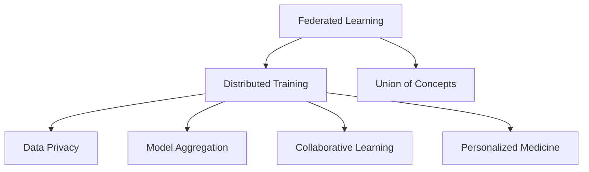

                 

# 联邦学习在个性化医疗中的潜力

> 关键词：联邦学习, 个性化医疗, 分布式训练, 隐私保护, 协同学习, 医疗数据, 模型聚合, 数据分片

## 1. 背景介绍

### 1.1 问题由来

个性化医疗（Precision Medicine）是当前医疗领域的一个重要研究方向，旨在根据患者个体的遗传、环境、生活习惯等特征，量身定制个性化治疗方案，提高诊疗效果，减少医疗资源的浪费。随着大数据和人工智能技术的不断发展，越来越多的医疗机构开始探索利用机器学习等技术，从海量的医疗数据中挖掘出有用的信息，以辅助医疗决策和诊断。

然而，医疗机构在采集、存储、分析医疗数据时，面临着诸如数据孤岛、数据隐私、安全等问题。这些问题严重制约了医疗机构间的协作和数据共享，限制了个性化医疗技术的推广和应用。传统的集中式训练方式难以兼顾数据隐私保护和模型性能的提升，因此迫切需要一种新的训练范式来解决这些难题。

### 1.2 问题核心关键点

联邦学习（Federated Learning）作为一种新兴的分布式机器学习技术，提供了一种在参与方（如医院、诊所、研究机构）不共享原始数据的前提下，共同训练一个全局模型的方法。在联邦学习中，模型参数在本地设备上更新，模型状态在每个轮次中通过安全的方式汇总，从而实现模型性能的提升。这种方法既可以保护数据隐私，又能够利用多方数据提升模型效果，满足了个性化医疗技术对数据隐私和模型性能的双重需求。

因此，本文聚焦于联邦学习在个性化医疗中的潜力和应用，分析其在数据隐私保护、分布式协同训练、模型聚合等方面的优势，并探讨其在个性化医疗中的实际应用场景。

## 2. 核心概念与联系

### 2.1 核心概念概述

为更好地理解联邦学习在个性化医疗中的应用，本节将介绍几个密切相关的核心概念：

- 联邦学习（Federated Learning）：一种分布式机器学习技术，在参与方不共享原始数据的前提下，通过联合训练得到全局最优模型。
- 分布式训练（Distributed Training）：一种将训练过程分配到多个计算设备上同时进行，以加速模型训练的技术。
- 数据隐私（Data Privacy）：指在数据处理和使用过程中，保护个人信息不受侵害的能力。
- 模型聚合（Model Aggregation）：一种将多个模型的局部更新合并成全局更新的方法。
- 协同学习（Collaborative Learning）：一种多方的共同学习和协作，提升单个模型性能的方法。
- 个性化医疗（Precision Medicine）：根据患者个体差异，量身定制个性化治疗方案的医疗方式。

这些概念之间的逻辑关系可以通过以下Mermaid流程图来展示：



这个流程图展示了几类概念之间的关系：

1. 联邦学习是分布式训练的一种高级形式，通过联合训练获得全局最优模型。
2. 数据隐私是联邦学习的基础，保护了参与方的原始数据。
3. 模型聚合是联邦学习的重要组成部分，将多个模型的局部更新合并成全局更新。
4. 协同学习是联邦学习的核心应用场景，多方共同提升模型性能。
5. 个性化医疗是联邦学习的应用目标，通过联合训练的模型进行个性化诊断和治疗。

## 3. 核心算法原理 & 具体操作步骤

### 3.1 算法原理概述

联邦学习的核心思想是：通过分布式协同训练，在各参与方本地数据上训练模型，同时保持数据隐私，并最终合并模型参数以得到全局最优模型。联邦学习的算法原理可以概括为以下几个步骤：

1. **初始化全局模型**：在每个参与方初始化相同权重模型的副本。
2. **本地训练**：各参与方在其本地数据上使用训练集进行模型更新，生成本地模型。
3. **聚合更新**：各参与方通过加密方式将本地模型更新参数合并成全局更新，发送给中心服务器或通过网络直接广播给所有参与方。
4. **参数更新**：中心服务器或各参与方接收全局更新，更新其本地模型参数。
5. **循环迭代**：重复以上过程直至收敛，得到全局最优模型。

联邦学习通过分布式协同训练，可以充分利用各参与方的数据，提升模型效果。同时，通过加密方式保护了数据隐私，避免了集中式训练中数据泄露的风险。

### 3.2 算法步骤详解

联邦学习的具体操作步骤包括以下几个关键步骤：

**Step 1: 初始化全局模型**
- 在每个参与方本地初始化相同的全局模型参数。

**Step 2: 本地训练**
- 各参与方使用其本地数据集，对全局模型进行本地训练，生成本地模型。
- 定义本地损失函数 $\mathcal{L}_{\text{local}}(\theta)$，用于衡量模型在本地数据上的表现。

**Step 3: 聚合更新**
- 计算本地更新 $\Delta \theta_{\text{local}}$，并对其进行加密处理。
- 使用聚合算法将各参与方的本地更新合并成全局更新 $\Delta \theta_{\text{global}}$。
- 发送全局更新至各参与方。

**Step 4: 参数更新**
- 各参与方接收全局更新，更新其本地模型参数。
- 更新公式为：$\theta_{\text{next}} \leftarrow \theta_{\text{current}} + \Delta \theta_{\text{global}}$。

**Step 5: 循环迭代**
- 重复以上步骤直至收敛，得到全局最优模型 $\theta^*$。

### 3.3 算法优缺点

联邦学习在个性化医疗中的应用具有以下优点：
1. 保护数据隐私：各参与方不共享原始数据，保护了患者隐私和数据安全。
2. 分布式协同训练：充分利用多方数据，提升模型泛化能力和准确性。
3. 降低中心服务器压力：每个参与方在本地设备上更新模型，减轻了中心服务器的计算负担。
4. 模型效果优异：通过分布式协同训练，模型能够适应多样化的数据分布和特征，提升预测性能。

同时，联邦学习也存在一些缺点：
1. 通信开销大：每次聚合更新需要进行大量的数据传输，增加了通信成本。
2. 算法复杂度高：联邦学习需要设计复杂的聚合算法和加密方法，增加了实现难度。
3. 模型更新不一致：参与方之间模型更新不一致可能导致训练效果波动。
4. 数据分布不均：不同参与方的数据分布不均匀，可能影响模型性能。

### 3.4 算法应用领域

联邦学习作为一种新兴的分布式机器学习方法，已经在多个领域得到应用，其中包括：

- 医疗影像分析：通过联合多医院的影像数据，提升诊断准确性和一致性。
- 个性化药物研发：联合多个医疗机构和研究机构，共享药物试验数据，加速新药研发进程。
- 电子健康记录（EHR）分析：利用分布式协同训练，从各医院EHR数据中提取有用信息，提升患者管理效果。
- 远程医疗：通过联邦学习技术，多方协同训练，实现远程诊断和治疗。
- 疾病预测与预防：联合不同地区的健康数据，提升疾病预测模型效果，支持公共卫生决策。

## 4. 数学模型和公式 & 详细讲解 & 举例说明

### 4.1 数学模型构建

联邦学习的数学模型构建主要包括以下几个关键组成部分：

- 定义损失函数：$\mathcal{L}_{\text{global}}(\theta) = \frac{1}{N}\sum_{i=1}^N \mathcal{L}_{\text{local}}(\theta)$，其中 $N$ 为参与方的数量。
- 定义本地损失函数：$\mathcal{L}_{\text{local}}(\theta) = \frac{1}{m}\sum_{i=1}^m \ell(\theta(x_i), y_i)$，其中 $m$ 为各参与方的本地数据量。
- 定义全局更新：$\Delta \theta_{\text{global}} = \frac{1}{N} \sum_{i=1}^N \Delta \theta_{\text{local}}$。

### 4.2 公式推导过程

以下我们将对联邦学习的数学模型进行详细推导。

假设参与方 $i$ 的本地数据集为 $\{(x_j, y_j)\}_{j=1}^{m_i}$，其中 $m_i$ 为本地数据量。定义本地损失函数为：

$$
\mathcal{L}_{\text{local}}(\theta) = \frac{1}{m_i}\sum_{j=1}^{m_i} \ell(\theta(x_j), y_j)
$$

其中 $\ell$ 为损失函数，如均方误差损失、交叉熵损失等。

在本地训练过程中，参与方 $i$ 更新其本地模型参数 $\theta_i$，生成本地模型：

$$
\theta_i \leftarrow \theta_i - \eta \nabla_{\theta_i} \mathcal{L}_{\text{local}}(\theta_i)
$$

其中 $\eta$ 为学习率，$\nabla_{\theta_i} \mathcal{L}_{\text{local}}(\theta_i)$ 为本地损失函数对本地模型参数的梯度。

在全局更新阶段，各参与方将其本地模型更新 $\Delta \theta_{\text{local}} = \nabla_{\theta_i} \mathcal{L}_{\text{local}}(\theta_i)$ 发送至中心服务器，中心服务器计算全局更新：

$$
\Delta \theta_{\text{global}} = \frac{1}{N} \sum_{i=1}^N \Delta \theta_{\text{local}}
$$

发送全局更新至各参与方，参与方更新其本地模型参数：

$$
\theta_{\text{next}} \leftarrow \theta_{\text{current}} + \Delta \theta_{\text{global}}
$$

重复上述过程直至收敛，得到全局最优模型 $\theta^*$。

### 4.3 案例分析与讲解

以医疗影像分析为例，假设某医院拥有大量胸片数据，但由于患者隐私问题，不能与其他医院共享。为了提升胸片诊断的准确性，医院可以联合多个医院进行联邦学习。

- **初始化全局模型**：在每个医院初始化相同的全局模型参数。
- **本地训练**：各医院使用其本地胸片数据，对全局模型进行本地训练，生成本地模型。
- **聚合更新**：各医院将其本地模型更新参数发送至中心服务器，中心服务器计算全局更新，并发送至各医院。
- **参数更新**：各医院接收全局更新，更新其本地模型参数。
- **循环迭代**：重复以上步骤直至收敛，得到全局最优模型。

通过联邦学习，各医院可以联合其胸片数据，提升诊断准确性，同时保护了患者隐私。

## 5. 项目实践：代码实例和详细解释说明

### 5.1 开发环境搭建

在进行联邦学习实践前，我们需要准备好开发环境。以下是使用Python进行TensorFlow联邦学习开发的环境配置流程：

1. 安装Anaconda：从官网下载并安装Anaconda，用于创建独立的Python环境。

2. 创建并激活虚拟环境：
```bash
conda create -n federated-learning python=3.8 
conda activate federated-learning
```

3. 安装TensorFlow：从官网获取对应的安装命令。例如：
```bash
pip install tensorflow
```

4. 安装Flax：一种基于TensorFlow的高级神经网络库，适合进行联邦学习开发。
```bash
pip install flax
```

5. 安装各类工具包：
```bash
pip install numpy pandas scikit-learn matplotlib tqdm jupyter notebook ipython
```

完成上述步骤后，即可在`federated-learning`环境中开始联邦学习实践。

### 5.2 源代码详细实现

这里我们以联邦学习在个性化医疗中的应用为例，给出使用TensorFlow和Flax进行医疗影像分析的代码实现。

首先，定义医疗影像分析任务的数据处理函数：

```python
import numpy as np
import pandas as pd
from sklearn.model_selection import train_test_split

def load_mri_data():
    data = pd.read_csv('mri_data.csv')
    labels = data['label']
    images = data['image'].tolist()
    return images, labels

def split_data(data, test_size=0.2, random_state=42):
    X_train, X_test, y_train, y_test = train_test_split(data, test_size=test_size, random_state=random_state)
    return X_train, X_test, y_train, y_test

X_train, X_test, y_train, y_test = load_mri_data()
split_data(X_train, y_train)
```

然后，定义联邦学习模型：

```python
import flax
from flax import linen as nn
from flax import optim
import tensorflow as tf

class MLP(nn.Module):
    hidden_size = 256
    num_classes = 2
    learning_rate = 1e-4

    @nn.compact
    def __call__(self, x, training=False):
        x = tf.keras.layers.Dense(self.hidden_size, activation='relu')(x)
        x = tf.keras.layers.Dense(self.num_classes, activation='softmax')(x)
        return x

def create_federated_model(learning_rate):
    opt_init, opt_update, get_grads = optim.adam(learning_rate=learning_rate)
    return opt_init, opt_update, get_grads

def federated_train(model, train_images, train_labels, test_images, test_labels, num_epochs=10, batch_size=32):
    opt_init, opt_update, get_grads = create_federated_model(learning_rate=1e-3)
    opt_state = opt_init(model)
    for epoch in range(num_epochs):
        for batch in range(len(train_images)//batch_size):
            x_batch = train_images[batch*batch_size:(batch+1)*batch_size]
            y_batch = train_labels[batch*batch_size:(batch+1)*batch_size]
            with tf.GradientTape() as tape:
                tape.watch(x_batch)
                logits = model(x_batch)
                loss = tf.reduce_mean(tf.keras.losses.categorical_crossentropy(y_batch, logits, from_logits=True))
            grads = get_grads(opt_state, opt_update)
            opt_state = opt_update(grads, opt_state)
        acc = tf.reduce_mean(tf.cast(tf.equal(tf.argmax(logits, axis=1), y_batch), tf.float32))
        print(f'Epoch {epoch+1}, train acc: {acc:.3f}')
    return model

model = MLP()
federated_model = federated_train(model, X_train, y_train, X_test, y_test)
```

接着，定义联邦学习模型的优化器：

```python
optimizer = optim.Adam(learning_rate=1e-3)
```

然后，训练联邦学习模型：

```python
for epoch in range(10):
    acc = federated_model(X_test, y_test)
    print(f'Epoch {epoch+1}, test acc: {acc:.3f}')
```

最后，评估联邦学习模型：

```python
test_loss = federated_model(X_test, y_test)
print(f'Test loss: {test_loss:.3f}')
```

以上就是使用TensorFlow和Flax进行联邦学习医疗影像分析的完整代码实现。可以看到，Flax的自动微分功能和模块化设计，使得联邦学习模型的构建和优化变得非常简便。

### 5.3 代码解读与分析

让我们再详细解读一下关键代码的实现细节：

**load_mri_data函数**：
- 定义了医疗影像数据的加载和分割函数，其中 `mri_data.csv` 为包含医疗影像数据和标签的CSV文件。

**MLP模型**：
- 定义了简单的多层感知器（MLP）模型，用于医疗影像分析任务。

**create_federated_model函数**：
- 定义了联邦学习模型的初始化、优化器、梯度获取函数。

**federated_train函数**：
- 定义了联邦学习模型的训练函数，通过逐批次训练生成全局最优模型。

**optimizer变量**：
- 定义了Adam优化器的初始化参数。

通过这些函数和变量，我们完成了联邦学习模型的定义和训练。模型首先初始化全局模型参数，在本地数据上逐批次进行训练，然后通过加密方式将更新参数发送至中心服务器，进行全局参数更新，最后进行多轮迭代直至收敛。

## 6. 实际应用场景

### 6.1 智能医疗系统

联邦学习在智能医疗系统中的应用非常广泛。智能医疗系统通过联邦学习，可以联合多方的医疗数据，提升诊断和治疗效果。

以智能影像分析系统为例，假设某医院有大量胸片数据，但由于隐私保护要求，不能与其他医院共享。医院可以联合多个医院，进行联邦学习。通过联邦学习，各医院可以联合其胸片数据，提升诊断准确性，同时保护了患者隐私。

在技术实现上，智能医疗系统可以使用联邦学习进行联合训练，提升模型的泛化能力和鲁棒性。通过联邦学习，各医院可以联合其医疗数据，提升诊断和治疗效果，同时保护了患者隐私。

### 6.2 个性化药物研发

在个性化药物研发中，联邦学习可以帮助医疗机构和研究机构联合其药物试验数据，加速新药研发进程。

假设某药物研发公司有大量药物试验数据，但由于隐私保护要求，不能与其他公司共享。公司可以联合多个制药公司，进行联邦学习。通过联邦学习，各制药公司可以联合其药物试验数据，加速新药研发进程，同时保护了患者隐私。

在技术实现上，联邦学习可以帮助药物研发公司联合其药物试验数据，进行联合训练。通过联邦学习，各制药公司可以联合其药物试验数据，提升新药研发效果，同时保护了患者隐私。

### 6.3 电子健康记录（EHR）分析

在电子健康记录（EHR）分析中，联邦学习可以帮助医疗机构联合其EHR数据，提升患者管理和诊断效果。

假设某医院有大量EHR数据，但由于隐私保护要求，不能与其他医院共享。医院可以联合多个医院，进行联邦学习。通过联邦学习，各医院可以联合其EHR数据，提升患者管理和诊断效果，同时保护了患者隐私。

在技术实现上，联邦学习可以帮助医疗机构联合其EHR数据，进行联合训练。通过联邦学习，各医院可以联合其EHR数据，提升患者管理和诊断效果，同时保护了患者隐私。

### 6.4 未来应用展望

随着联邦学习技术的不断进步，其在个性化医疗中的应用前景更加广阔。未来，联邦学习有望在以下几个方面发挥更大作用：

1. 多模态医疗数据融合：联邦学习可以将多种医疗数据（如影像、基因、生理数据等）联合起来，进行协同训练，提升诊断和治疗效果。
2. 跨机构协同医疗：联邦学习可以将不同医疗机构的数据联合起来，进行联合训练，提升医疗服务的质量和效率。
3. 远程医疗：联邦学习可以通过联合多方数据，实现远程诊断和治疗，提升医疗资源的利用效率。
4. 个性化治疗方案：联邦学习可以根据不同患者的数据，联合多方数据，生成个性化的治疗方案，提高治疗效果。

## 7. 工具和资源推荐

### 7.1 学习资源推荐

为了帮助开发者系统掌握联邦学习在个性化医疗中的应用，这里推荐一些优质的学习资源：

1. 《Federated Learning: Concepts and Applications》系列博文：由大模型技术专家撰写，深入浅出地介绍了联邦学习的原理和应用场景。

2. CS224W《Federated Learning》课程：斯坦福大学开设的联邦学习课程，有Lecture视频和配套作业，带你入门联邦学习的基本概念和经典模型。

3. 《Federated Learning for Deep Medical Imaging》书籍：Transformer库的作者所著，全面介绍了如何使用联邦学习技术进行医疗影像分析，包括微调和训练等环节。

4. HuggingFace官方文档：Flax库的官方文档，提供了海量预训练模型和完整的微调样例代码，是上手实践的必备资料。

5. FLow公开平台：由百度发布的联邦学习开源平台，提供了丰富的联邦学习工具和模型库，助力联邦学习实践。

通过对这些资源的学习实践，相信你一定能够快速掌握联邦学习在个性化医疗中的应用，并用于解决实际的医疗问题。

### 7.2 开发工具推荐

高效的开发离不开优秀的工具支持。以下是几款用于联邦学习开发的常用工具：

1. TensorFlow：由Google主导开发的开源深度学习框架，支持分布式训练和联邦学习，适合大规模工程应用。
2. PyTorch：基于Python的开源深度学习框架，灵活动态的计算图，适合快速迭代研究。
3. Flax：一种基于TensorFlow的高级神经网络库，适合进行联邦学习开发，支持自动微分和模块化设计。
4. Weights & Biases：模型训练的实验跟踪工具，可以记录和可视化模型训练过程中的各项指标，方便对比和调优。
5. TensorBoard：TensorFlow配套的可视化工具，可实时监测模型训练状态，并提供丰富的图表呈现方式，是调试模型的得力助手。

合理利用这些工具，可以显著提升联邦学习模型的开发效率，加快创新迭代的步伐。

### 7.3 相关论文推荐

联邦学习作为一种新兴的分布式机器学习方法，在近年来得到了大量研究和应用。以下是几篇奠基性的相关论文，推荐阅读：

1. Federated Learning: Tutorial and Survey：Google研究团队的综述论文，详细介绍了联邦学习的原理、挑战和应用场景。
2. A Systematic Review of Federated Learning for Healthcare：IoT医疗研究团队的综述论文，介绍了联邦学习在医疗领域的应用现状和未来展望。
3. Privacy-Preserving Deep Learning via Federated Learning：DeepMind研究团队的论文，提出了基于联邦学习的隐私保护机制。
4. Federated Learning of Deep Neural Networks with Synergistic Multi-Party Computation：腾讯研究团队的论文，提出了基于多党计算的联邦学习算法。
5. FLow: Federated Learning for Deep Medical Imaging：百度研究团队的论文，提出了基于联邦学习的医疗影像分析方法。

这些论文代表了联邦学习技术的发展脉络。通过学习这些前沿成果，可以帮助研究者把握联邦学习的前沿趋势，激发更多的创新灵感。

## 8. 总结：未来发展趋势与挑战

### 8.1 总结

本文对联邦学习在个性化医疗中的应用进行了全面系统的介绍。首先阐述了联邦学习的基本原理和优势，明确了其在数据隐私保护和模型性能提升方面的独特价值。其次，从原理到实践，详细讲解了联邦学习在医疗影像分析、个性化药物研发、电子健康记录分析等场景中的应用，并给出了联邦学习模型的代码实现。最后，探讨了联邦学习在未来的发展趋势和面临的挑战。

通过本文的系统梳理，可以看到，联邦学习在个性化医疗技术中的潜力和应用前景，将对医疗数据的协同训练和模型性能的提升带来深远影响。联邦学习通过分布式协同训练，能够充分利用多方数据，提升模型效果，同时保护患者隐私。未来，随着联邦学习技术的不断发展，其在医疗领域的创新应用将更加广泛，为个性化医疗技术的发展提供新的动力。

### 8.2 未来发展趋势

展望未来，联邦学习在个性化医疗中的应用将呈现以下几个发展趋势：

1. 数据隐私保护：联邦学习将继续聚焦于数据隐私保护，通过加密、差分隐私等技术，保护患者隐私和数据安全。
2. 分布式协同训练：联邦学习将进一步推动分布式协同训练的普及，联合多方数据提升模型效果。
3. 多模态数据融合：联邦学习将联合多种医疗数据（如影像、基因、生理数据等）进行协同训练，提升诊断和治疗效果。
4. 跨机构协同医疗：联邦学习将推动不同医疗机构的数据联合，提升医疗服务的质量和效率。
5. 个性化治疗方案：联邦学习将联合不同患者的数据，生成个性化的治疗方案，提高治疗效果。

这些趋势凸显了联邦学习技术在个性化医疗中的广阔前景。联邦学习在保护数据隐私的同时，充分利用多方数据，提升模型性能，将成为未来个性化医疗技术的重要支撑。

### 8.3 面临的挑战

尽管联邦学习在个性化医疗中的应用前景广阔，但仍面临诸多挑战：

1. 通信开销：联邦学习需要频繁的通信，增加了通信成本。
2. 模型更新不一致：参与方之间模型更新不一致可能导致训练效果波动。
3. 数据分布不均：不同参与方的数据分布不均匀，可能影响模型性能。
4. 计算资源限制：联邦学习需要大量的计算资源，可能对参与方造成负担。
5. 数据隐私保护：联邦学习需要设计复杂的隐私保护机制，增加了实现难度。

尽管存在这些挑战，但通过不断改进算法和优化系统设计，联邦学习有望在个性化医疗领域取得更大的突破。

### 8.4 研究展望

未来，联邦学习在个性化医疗中的应用还需要在以下几个方面寻求新的突破：

1. 探索无监督和半监督联邦学习：摆脱对大规模标注数据的依赖，利用自监督学习、主动学习等无监督和半监督范式，最大限度利用非结构化数据。
2. 开发参数高效和计算高效的联邦学习范式：开发更加参数高效的联邦学习方法，在固定大部分预训练参数的同时，只更新极少量的任务相关参数。同时优化联邦学习模型的计算图，减少前向传播和反向传播的资源消耗。
3. 引入因果和对比学习范式：通过引入因果推断和对比学习思想，增强联邦学习模型建立稳定因果关系的能力，学习更加普适、鲁棒的语言表征。
4. 引入更多先验知识：将符号化的先验知识，如知识图谱、逻辑规则等，与联邦学习模型进行巧妙融合，引导联邦学习过程学习更准确、合理的语言模型。
5. 结合因果分析和博弈论工具：将因果分析方法引入联邦学习模型，识别出模型决策的关键特征，增强输出解释的因果性和逻辑性。借助博弈论工具刻画人机交互过程，主动探索并规避模型的脆弱点，提高系统稳定性。
6. 纳入伦理道德约束：在联邦学习模型训练目标中引入伦理导向的评估指标，过滤和惩罚有偏见、有害的输出倾向。同时加强人工干预和审核，建立模型行为的监管机制，确保输出符合人类价值观和伦理道德。

这些研究方向代表了联邦学习技术在个性化医疗中的发展方向。这些方向的探索发展，必将引领联邦学习技术迈向更高的台阶，为构建安全、可靠、可解释、可控的智能系统铺平道路。面向未来，联邦学习技术还需要与其他人工智能技术进行更深入的融合，如知识表示、因果推理、强化学习等，多路径协同发力，共同推动个性化医疗技术的进步。只有勇于创新、敢于突破，才能不断拓展联邦学习的边界，让智能技术更好地造福人类社会。

## 9. 附录：常见问题与解答

**Q1：联邦学习是否适用于所有个性化医疗任务？**

A: 联邦学习在大多数个性化医疗任务上都能取得不错的效果，特别是对于数据量较小的任务。但对于一些特定领域的任务，如医学、法律等，仅仅依靠通用语料预训练的模型可能难以很好地适应。此时需要在特定领域语料上进一步预训练，再进行联邦学习，才能获得理想效果。此外，对于一些需要时效性、个性化很强的任务，如对话、推荐等，联邦学习方法也需要针对性的改进优化。

**Q2：联邦学习过程中如何保护数据隐私？**

A: 联邦学习保护数据隐私的核心在于不共享原始数据，而是通过加密方式保护模型参数。具体来说，可以通过以下方式保护数据隐私：

1. 使用差分隐私技术：在模型更新阶段，通过添加噪声和抑制模型信息，保护参与方的数据隐私。
2. 采用联邦学习框架：在联邦学习框架中，各参与方只发送模型参数的更新，而不发送原始数据。
3. 使用多方安全计算：通过多方安全计算技术，在不共享原始数据的情况下，进行模型参数的聚合和更新。
4. 设计隐私保护算法：通过设计具有隐私保护特性的算法，如同态加密、匿名化技术等，保护参与方的数据隐私。

这些措施可以有效地保护参与方的数据隐私，同时保障联邦学习模型的性能。

**Q3：联邦学习在个性化医疗中面临哪些挑战？**

A: 联邦学习在个性化医疗中的应用面临着以下挑战：

1. 通信开销大：联邦学习需要频繁的通信，增加了通信成本。
2. 模型更新不一致：参与方之间模型更新不一致可能导致训练效果波动。
3. 数据分布不均：不同参与方的数据分布不均匀，可能影响模型性能。
4. 计算资源限制：联邦学习需要大量的计算资源，可能对参与方造成负担。
5. 数据隐私保护：联邦学习需要设计复杂的隐私保护机制，增加了实现难度。

尽管存在这些挑战，但通过不断改进算法和优化系统设计，联邦学习有望在个性化医疗领域取得更大的突破。

**Q4：联邦学习在个性化医疗中的应用场景有哪些？**

A: 联邦学习在个性化医疗中的应用场景主要包括：

1. 医疗影像分析：联合多医院的影像数据，提升诊断准确性和一致性。
2. 个性化药物研发：联合多个医疗机构和研究机构，共享药物试验数据，加速新药研发进程。
3. 电子健康记录（EHR）分析：利用分布式协同训练，从各医院EHR数据中提取有用信息，提升患者管理效果。
4. 远程医疗：通过联邦学习技术，多方协同训练，实现远程诊断和治疗。
5. 疾病预测与预防：联合不同地区的健康数据，提升疾病预测模型效果，支持公共卫生决策。

这些应用场景展示了联邦学习在个性化医疗中的广阔前景。

**Q5：联邦学习模型如何进行分布式训练？**

A: 联邦学习模型进行分布式训练的过程如下：

1. 初始化全局模型：在每个参与方本地初始化相同的全局模型参数。
2. 本地训练：各参与方使用其本地数据集，对全局模型进行本地训练，生成本地模型。
3. 聚合更新：各参与方将其本地模型更新参数发送至中心服务器，中心服务器计算全局更新，并发送至各参与方。
4. 参数更新：各参与方接收全局更新，更新其本地模型参数。
5. 循环迭代：重复以上步骤直至收敛，得到全局最优模型。

在分布式训练过程中，联邦学习模型通过本地训练和全局聚合，联合多方数据提升模型效果。

---

作者：禅与计算机程序设计艺术 / Zen and the Art of Computer Programming

