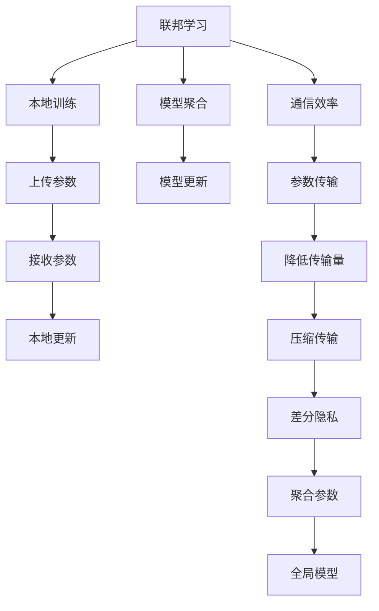

                 

## 1. 背景介绍

随着联邦学习(Federated Learning, FL)技术的发展，其在数据隐私保护、分布式计算和模型个性化方面展现出了强大的潜力。联邦学习通过在多个分布式设备上独立训练模型，然后将分散的知识进行聚合，达到全局最优。然而，联邦学习面临诸多技术挑战，尤其是通信效率和模型聚合的问题，这些问题直接关系到模型的收敛速度和泛化性能。

## 2. 核心概念与联系

### 2.1 核心概念概述

- **联邦学习**：一种分布式机器学习方法，允许多个用户在不共享本地数据的情况下，联合训练一个全局模型。
- **通信效率**：在分布式系统中，各设备之间传输数据的效率直接影响到整个联邦学习的训练效率。
- **模型聚合**：联邦学习最终目的是将各设备训练得到的模型参数进行聚合，形成全局模型。该过程的效率和效果直接影响全局模型的质量。
- **模型更新**：每个设备在本地更新模型参数，并通过模型更新策略将新参数传输到中央服务器进行聚合。
- **参数传输**：模型参数和梯度在各设备与中央服务器之间的传输。

这些核心概念之间有着密切的联系，通信效率和模型聚合是影响联邦学习效果和效率的两个关键因素，两者互相影响，共同决定了联邦学习的整体性能。

### 2.2 核心概念原理和架构的 Mermaid 流程图(Mermaid 流程节点中不要有括号、逗号等特殊字符)



这个流程图展示了联邦学习的工作流程和核心概念的相互关系：

- 本地训练：各设备在本地独立训练模型。
- 参数上传：设备将本地模型参数上传至中央服务器。
- 参数接收：中央服务器接收各设备的参数。
- 本地更新：设备接收中央服务器聚合后的参数，进行本地更新。
- 差分隐私：通过差分隐私保护，避免敏感信息泄露。
- 参数聚合：中央服务器对各设备上传的参数进行聚合。
- 全局模型：形成联邦学习的最终模型。

## 3. 核心算法原理 & 具体操作步骤

### 3.1 算法原理概述

联邦学习的基本原理是在本地设备上并行训练多个模型，每个模型只访问本地数据。模型参数在本地设备上迭代更新，并通过通信网络将更新后的参数传输至中央服务器进行聚合。联邦学习的目标是通过这种分布式方式，使全局模型能够学习到各本地数据集的综合知识，达到全局最优。

### 3.2 算法步骤详解

1. **初始化**：每个设备从初始参数开始训练，可以是随机初始化或预训练得到的参数。
2. **本地训练**：每个设备在本地数据集上训练模型，更新模型参数。
3. **参数上传**：每个设备将更新后的模型参数上传至中央服务器。
4. **模型聚合**：中央服务器接收各设备的参数，计算加权平均或加权加和，得到全局模型参数。
5. **全局模型更新**：使用全局模型参数更新所有设备的本地模型。
6. **重复**：重复执行本地训练、参数上传、模型聚合和全局模型更新的过程，直到达到预设的迭代次数或满足收敛条件。

### 3.3 算法优缺点

**优点**：
- 数据隐私保护：各设备只使用本地数据，避免了数据泄露风险。
- 模型个性化：每个设备可以针对自己的数据集训练模型，提升模型针对性。
- 降低通信成本：各设备仅上传更新后的参数，减少了通信开销。

**缺点**：
- 通信开销高：每次模型更新需要多次参数传输，通信成本较大。
- 模型聚合复杂：不同设备的数据分布和参数更新方式可能不同，模型聚合需要精心设计。
- 收敛速度慢：各设备间的通信延迟和网络拥堵可能导致训练速度变慢。

### 3.4 算法应用领域

联邦学习已经在多个领域得到广泛应用，包括但不限于：
- 医疗数据联合分析：保护病人隐私的同时，利用跨机构的数据联合训练模型。
- 金融风控：联合多个银行的客户数据训练模型，提高信用评估的准确性。
- 物联网设备管理：联合不同设备的传感器数据训练模型，优化设备能耗。
- 智能推荐：联合用户数据训练推荐模型，提供个性化推荐服务。

## 4. 数学模型和公式 & 详细讲解 & 举例说明

### 4.1 数学模型构建

假设共有 $K$ 个设备，每个设备在本地数据集 $D_k$ 上训练模型 $w_k$，模型更新目标为最小化损失函数 $L$。每个设备在每次迭代中，计算本地损失函数 $L_k$，更新模型参数 $w_k$，并上传更新后的参数 $\Delta w_k$ 到中央服务器进行聚合。

### 4.2 公式推导过程

设全局模型参数为 $w^*$，每个设备更新后的参数为 $\Delta w_k$，中央服务器计算聚合后的参数 $\Delta w^*$，则有：

$$
\Delta w^* = \frac{1}{K}\sum_{k=1}^K \Delta w_k
$$

每个设备接收全局聚合后的参数 $\Delta w^*$ 更新本地模型，更新公式为：

$$
w_k^{t+1} = w_k^t + \Delta w^*
$$

其中，$t$ 表示迭代次数。

### 4.3 案例分析与讲解

以医疗数据分析为例，联邦学习可以将不同医院的病人数据进行联合分析，但各医院对数据隐私有严格的保护要求，不能直接共享原始数据。联邦学习通过在每个医院本地训练模型，并将更新后的参数上传至中央服务器进行聚合，形成全局模型，用于疾病预测和诊断。这种方式既保护了数据隐私，又提升了模型的准确性和泛化能力。

## 5. 项目实践：代码实例和详细解释说明

### 5.1 开发环境搭建

搭建联邦学习项目环境需要以下步骤：

1. 安装Python：推荐使用Anaconda，以便创建和管理虚拟环境。
2. 配置虚拟环境：使用 `conda create -n fl-env python=3.8` 创建虚拟环境。
3. 安装必要的库：使用 `pip install fl-framework fl-optimizer fl-server` 安装联邦学习相关的库和服务器。

### 5.2 源代码详细实现

以下是一个简单的联邦学习项目示例，使用FL框架进行分布式训练：

```python
from fl import FLClient
from fl.models import LinearRegression

# 创建联邦学习客户端
client = FLClient()

# 初始化模型参数
w = np.random.randn(10)

# 定义本地损失函数
def local_loss(x, y):
    return (y - np.dot(w, x)) ** 2 / 2

# 定义全局损失函数
def global_loss(params):
    return sum([local_loss(x, y) for x, y in data]) / len(data)

# 定义本地更新策略
def local_update(x, y, learning_rate):
    delta = learning_rate * (y - np.dot(w, x))
    return w + delta

# 训练数据
data = [(x, y) for x in np.random.randn(100, 10) for y in np.random.randn(1)]
client.train(global_loss, local_loss, data, local_update)
```

### 5.3 代码解读与分析

以上代码实现了一个简单的线性回归任务，其中：
- `FLClient` 用于创建联邦学习客户端。
- `LinearRegression` 是模型类，用于定义本地模型。
- `local_loss` 是本地损失函数，计算本地样本的损失。
- `global_loss` 是全局损失函数，计算所有样本的平均损失。
- `local_update` 是本地更新策略，根据梯度更新模型参数。

### 5.4 运行结果展示

训练过程中，可以观察到各设备上传的参数变化，以及全局模型参数的聚合过程。

## 6. 实际应用场景

### 6.1 医疗数据联合分析

在医疗领域，联邦学习可以联合不同医院的病人数据进行联合分析，如疾病预测、药物疗效评估等。通过联邦学习，各医院的数据得以联合使用，但数据隐私得到充分保护，避免了数据泄露的风险。

### 6.2 金融风控

金融机构可以联合多家的客户数据进行联合风控模型的训练，提升风险评估的准确性。联邦学习通过在各银行本地训练模型，并联合数据进行聚合，既保护了客户隐私，又提升了模型的泛化能力。

### 6.3 智能推荐

互联网公司可以联合用户的点击、浏览、购买等行为数据进行推荐模型的联合训练，提升推荐系统的个性化和精准度。

### 6.4 未来应用展望

未来，联邦学习将在更多领域得到应用，如智能城市、工业控制、能源管理等。随着联邦学习技术的成熟，其应用范围将不断扩大，为各行各业带来新的变革。

## 7. 工具和资源推荐

### 7.1 学习资源推荐

- Coursera上的联邦学习课程：由斯坦福大学开设，系统介绍联邦学习的原理、算法和应用。
- 《Federated Learning for Wireless Networks》书籍：详细介绍联邦学习在无线网络中的应用，包括通信效率和模型聚合。
- PyFedLearn框架：一个用于联邦学习的Python框架，提供丰富的API和示例代码。

### 7.2 开发工具推荐

- FL-framework：一个用于联邦学习的Python框架，支持多种分布式算法和优化策略。
- FL-optimizer：一个用于联邦学习的优化器库，支持多种优化算法。
- FL-server：一个用于联邦学习的服务器端实现，支持多种通信协议。

### 7.3 相关论文推荐

- 《Communication-Efficient Learning of Deep Networks from Decentralized Data》：提出分布式平均梯度算法，提升联邦学习的通信效率。
- 《Optimizing Aggregation for Distributed Deep Learning》：研究不同的聚合策略，提升联邦学习的模型聚合效果。
- 《Federated Learning with Untrusted Servers: The Model-Averaging Approach》：讨论如何保护模型参数，避免恶意攻击。

## 8. 总结：未来发展趋势与挑战

### 8.1 研究成果总结

联邦学习技术在数据隐私保护、分布式计算和模型个性化方面展现出巨大潜力，已经被广泛应用于多个领域。其核心在于通信效率和模型聚合的优化，但仍然面临诸多挑战。

### 8.2 未来发展趋势

未来联邦学习的发展趋势包括：
- 更高效的通信协议：如区块链、分布式计算等技术，可以提升联邦学习的通信效率。
- 更精确的模型聚合：如分布式聚合、差分隐私等方法，可以提高模型聚合的效果。
- 更广泛的应用场景：如物联网、智能制造等新领域，联邦学习将有更多的应用机会。

### 8.3 面临的挑战

联邦学习在实际应用中仍面临以下挑战：
- 通信开销大：分布式系统中的通信延迟和网络拥堵可能导致训练速度变慢。
- 模型聚合复杂：不同设备的数据分布和参数更新方式可能不同，模型聚合需要精心设计。
- 数据异质性：不同设备的本地数据分布可能存在较大差异，影响模型的泛化能力。
- 隐私保护难度：保护用户隐私的同时，仍然需要高效地进行模型训练。

### 8.4 研究展望

未来研究可以从以下几个方面进行：
- 优化通信协议：研究更高效的分布式计算和数据传输方法，提升联邦学习的通信效率。
- 改进模型聚合：探索更精确的模型聚合策略，提升模型聚合效果。
- 应用新算法：引入新的机器学习算法，如强化学习、因果推断等，提升联邦学习的效果。
- 数据处理优化：研究如何处理数据异质性，提升联邦学习模型的泛化能力。
- 隐私保护技术：研究更高效的数据隐私保护方法，保护用户隐私。

## 9. 附录：常见问题与解答

**Q1：联邦学习是否适用于所有分布式系统？**

A：联邦学习适用于数据分布式存储、计算资源有限的系统，但需要考虑通信效率和模型聚合问题。对于数据集中存储、计算资源充足的系统，传统的分布式学习算法可能更为适合。

**Q2：联邦学习是否需要所有设备参与？**

A：联邦学习中的设备可以自由加入和退出，每个设备独立进行本地训练，只需在合适的时候上传和接收参数。如果某个设备出现问题，不影响其他设备的训练过程。

**Q3：联邦学习是否需要所有设备有相同的模型结构？**

A：联邦学习适用于多种模型结构，每个设备可以使用不同的模型架构。只需在模型更新时，按照统一的格式上传和接收参数即可。

**Q4：联邦学习如何避免恶意攻击？**

A：联邦学习可以通过差分隐私、安全聚合等方法，保护模型参数不被恶意攻击者窃取。同时，各设备可以定期更新参数，防止攻击者通过历史参数进行追踪。

**Q5：联邦学习是否可以用于在线数据集？**

A：联邦学习可以用于在线数据集，只需在每个新数据到达时，重新计算损失函数和模型参数。但在线数据集的分布可能发生变化，需要定期调整模型参数和聚合策略。

---

作者：禅与计算机程序设计艺术 / Zen and the Art of Computer Programming

