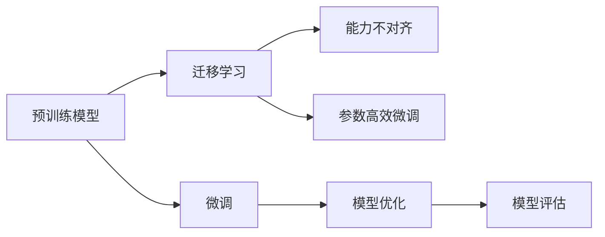

                 

# 能力不对齐对LLMs的影响

## 1. 背景介绍

### 1.1 问题由来

随着深度学习技术的发展，大规模预训练语言模型(LLMs)在自然语言处理(NLP)领域取得了显著的进展。这些模型通过在大规模无标签数据上进行自监督预训练，学习到了丰富的语言知识和常识。但在大规模预训练数据上的通用知识，并不一定能够直接迁移到特定任务上。因此，在实际应用中，如何利用预训练模型，提升特定任务的效果，成为了一个重要的问题。

### 1.2 问题核心关键点

预训练语言模型通常在自监督预训练任务上学习到语言的基本规则和结构，但在实际应用中，这些模型需要在特定任务上进行微调，才能得到理想的效果。这个过程中，预训练模型与目标任务之间可能存在能力不对齐的问题。具体来说，包括以下几个方面：

1. **任务类型不同**：预训练模型的通用语言理解能力，可能无法完全匹配特定任务的特殊需求。
2. **数据分布差异**：预训练数据的分布与目标任务的数据分布可能存在差异，影响模型泛化性能。
3. **知识保留与遗忘**：微调过程中，预训练模型学习到的知识可能部分被遗忘，影响微调效果。

解决能力不对齐问题，提升预训练模型在特定任务上的表现，是当前研究的热点。本文将围绕这个问题，探讨基于监督学习的微调方法，分析其优缺点，并提出一些改进策略。

## 2. 核心概念与联系

### 2.1 核心概念概述

本节将介绍几个关键概念及其联系，以帮助理解微调过程。

- **预训练语言模型(LLM)**：通过自监督预训练任务学习到的语言模型，如BERT、GPT等。
- **微调(Fine-tuning)**：在预训练模型基础上，使用少量标注数据进行有监督学习，优化模型在特定任务上的性能。
- **迁移学习(Transfer Learning)**：将预训练模型在不同任务之间的迁移应用，提升模型在特定任务上的表现。
- **能力不对齐**：预训练模型与目标任务之间的知识结构和需求不匹配，影响微调效果。
- **参数高效微调(PEFT)**：只更新预训练模型中的一部分参数，保留大部分预训练权重，减少过拟合风险。

这些概念通过以下Mermaid流程图连接起来，展示了它们之间的关系：



### 2.2 核心概念原理和架构

预训练语言模型通常由多个层组成，包括自注意力机制、前馈网络等。这些层在自监督预训练任务上学习到了丰富的语言表示能力。但不同任务对模型的知识需求不同，因此需要通过微调过程，将预训练模型的知识迁移到特定任务上。

微调过程中，通常使用少量标注数据进行有监督学习，优化模型在特定任务上的性能。微调的目标是找到最优的模型参数，使得模型在特定任务上的预测准确率最高。微调方法包括全参数微调和参数高效微调(PEFT)。

参数高效微调是一种保留预训练模型大部分权重，只更新少部分参数的微调方法。这种方法可以在固定大部分预训练权重的情况下，减少过拟合风险，提高模型泛化能力。

## 3. 核心算法原理 & 具体操作步骤

### 3.1 算法原理概述

基于监督学习的微调方法，本质上是一种任务特定的参数更新过程。其核心思想是：将预训练模型作为初始化参数，通过在特定任务的数据集上进行有监督学习，优化模型在目标任务上的表现。

假设预训练模型为 $M_{\theta}$，目标任务为 $T$，目标数据集为 $D$。微调的目标是找到最优的模型参数 $\hat{\theta}$，使得：

$$
\hat{\theta} = \mathop{\arg\min}_{\theta} \mathcal{L}(M_{\theta},D)
$$

其中 $\mathcal{L}$ 为针对任务 $T$ 设计的损失函数。常见的损失函数包括交叉熵损失、均方误差损失等。

微调过程通常分为以下几个步骤：

1. 准备预训练模型和数据集。
2. 设计任务适配层和损失函数。
3. 设置微调超参数。
4. 执行梯度训练。
5. 测试和部署微调后的模型。

### 3.2 算法步骤详解

#### 3.2.1 准备预训练模型和数据集

1. **选择预训练模型**：选择合适的预训练语言模型，如BERT、GPT等，作为微调的初始化参数。
2. **准备目标数据集**：收集目标任务的数据集，划分为训练集、验证集和测试集。数据集应该尽量覆盖目标任务的所有常见情况。

#### 3.2.2 设计任务适配层和损失函数

1. **任务适配层**：根据任务类型，在预训练模型的顶层添加适合该任务的任务适配层。例如，分类任务通常添加线性分类器，生成任务通常使用语言模型的解码器。
2. **损失函数**：选择适合该任务的数据集和任务适配层的损失函数。例如，分类任务通常使用交叉熵损失，生成任务通常使用负对数似然损失。

#### 3.2.3 设置微调超参数

1. **学习率**：选择合适的学习率，通常比从头训练时小。学习率的设置应考虑预训练模型的初始化参数。
2. **正则化**：应用L2正则化、Dropout、Early Stopping等正则化技术，防止过拟合。
3. **参数冻结**：选择冻结预训练模型的部分层，只微调顶层或部分层。

#### 3.2.4 执行梯度训练

1. **前向传播**：将训练集数据分批次输入模型，计算损失函数。
2. **反向传播**：计算损失函数对模型参数的梯度，根据设定的优化算法和学习率更新模型参数。
3. **验证集评估**：周期性在验证集上评估模型性能，决定是否停止训练。
4. **测试集测试**：在测试集上评估微调后的模型性能。

#### 3.2.5 测试和部署

1. **测试集测试**：在测试集上评估微调后的模型性能。
2. **模型部署**：将微调后的模型部署到实际应用中，提供服务。

### 3.3 算法优缺点

#### 3.3.1 优点

1. **简单高效**：微调方法相对简单，只需准备少量标注数据，即可提升模型在特定任务上的表现。
2. **泛化能力**：微调模型通常在少量数据上也能取得不错的泛化效果。
3. **参数高效**：通过参数高效微调方法，可以在保留大部分预训练权重的情况下，更新少部分参数，减少过拟合风险。
4. **适应性强**：微调方法适用于各种NLP任务，包括分类、匹配、生成等。

#### 3.3.2 缺点

1. **依赖标注数据**：微调效果很大程度上取决于标注数据的质量和数量，获取高质量标注数据的成本较高。
2. **过拟合风险**：在特定任务上，微调模型可能会过度适应训练集，泛化能力下降。
3. **知识遗忘**：预训练模型在微调过程中，部分知识可能被遗忘，影响微调效果。
4. **计算成本高**：微调过程需要大量的计算资源，尤其是全参数微调。

### 3.4 算法应用领域

基于监督学习的微调方法，已经在NLP领域得到了广泛应用，覆盖了几乎所有常见任务，例如：

1. **文本分类**：如情感分析、主题分类、意图识别等。
2. **命名实体识别**：识别文本中的人名、地名、机构名等特定实体。
3. **关系抽取**：从文本中抽取实体之间的语义关系。
4. **问答系统**：对自然语言问题给出答案。
5. **机器翻译**：将源语言文本翻译成目标语言。
6. **文本摘要**：将长文本压缩成简短摘要。
7. **对话系统**：使机器能够与人自然对话。

这些任务在实际应用中，都需要根据具体需求进行微调，以达到最佳效果。

## 4. 数学模型和公式 & 详细讲解 & 举例说明

### 4.1 数学模型构建

假设目标任务为二分类任务，预训练模型为 $M_{\theta}$，训练集为 $D=\{(x_i,y_i)\}_{i=1}^N$，其中 $x_i$ 为输入，$y_i$ 为标签。任务适配层为线性分类器，损失函数为交叉熵损失。

微调的目标是找到最优的模型参数 $\hat{\theta}$，使得：

$$
\hat{\theta} = \mathop{\arg\min}_{\theta} \mathcal{L}(M_{\theta},D)
$$

其中：

$$
\mathcal{L}(M_{\theta},D) = -\frac{1}{N} \sum_{i=1}^N \sum_{j=1}^k L_i(\theta_j)
$$

$$
L_i(\theta_j) = -y_i \log \hat{y}_i - (1-y_i) \log (1-\hat{y}_i)
$$

$$
\hat{y}_i = M_{\theta}(x_i)
$$

其中，$k$ 为分类器的输出节点数，$\theta_j$ 为第 $j$ 个输出节点的权重。

### 4.2 公式推导过程

在二分类任务中，模型 $M_{\theta}$ 在输入 $x_i$ 上的输出为 $\hat{y}=M_{\theta}(x_i) \in [0,1]$，表示样本属于正类的概率。真实标签 $y \in \{0,1\}$。

二分类交叉熵损失函数定义为：

$$
L_i(\theta_j) = -[y_i \log \hat{y}_i + (1-y_i) \log (1-\hat{y}_i)]
$$

在目标数据集 $D$ 上，经验风险为：

$$
\mathcal{L}(\theta) = -\frac{1}{N} \sum_{i=1}^N \sum_{j=1}^k L_i(\theta_j)
$$

通过梯度下降等优化算法，最小化损失函数，得到最优模型参数 $\hat{\theta}$。

### 4.3 案例分析与讲解

#### 案例一：文本分类

假设目标任务为情感分类，预训练模型为BERT，训练集为带有情感标签的文本数据。微调过程如下：

1. **准备数据集**：收集情感分类数据集，划分为训练集、验证集和测试集。
2. **准备模型**：选择BERT模型作为预训练模型。
3. **设计任务适配层**：在BERT模型顶层添加线性分类器，输出情感分类。
4. **设计损失函数**：使用交叉熵损失函数。
5. **设置超参数**：设置学习率、正则化参数等。
6. **执行微调**：使用微调库，对数据集进行微调。
7. **评估和部署**：在测试集上评估微调后的模型性能，并将模型部署到实际应用中。

#### 案例二：命名实体识别

假设目标任务为命名实体识别，预训练模型为BERT，训练集为标注有实体类型的文本数据。微调过程如下：

1. **准备数据集**：收集命名实体识别数据集，划分为训练集、验证集和测试集。
2. **准备模型**：选择BERT模型作为预训练模型。
3. **设计任务适配层**：在BERT模型顶层添加BiLSTM-CRF层，输出实体标签序列。
4. **设计损失函数**：使用序列标注损失函数。
5. **设置超参数**：设置学习率、正则化参数等。
6. **执行微调**：使用微调库，对数据集进行微调。
7. **评估和部署**：在测试集上评估微调后的模型性能，并将模型部署到实际应用中。

## 5. 项目实践：代码实例和详细解释说明

### 5.1 开发环境搭建

#### 5.1.1 安装Python和PyTorch

```bash
# 安装Python
sudo apt-get update
sudo apt-get install python3
```

```bash
# 安装PyTorch
pip install torch torchvision torchaudio
```

#### 5.1.2 安装Transformer库

```bash
pip install transformers
```

### 5.2 源代码详细实现

#### 5.2.1 案例一：文本分类

```python
import torch
import torch.nn as nn
import torch.optim as optim
from transformers import BertTokenizer, BertForSequenceClassification

# 加载数据集
train_data = ...
train_labels = ...
val_data = ...
val_labels = ...
test_data = ...
test_labels = ...

# 定义模型
tokenizer = BertTokenizer.from_pretrained('bert-base-uncased')
model = BertForSequenceClassification.from_pretrained('bert-base-uncased', num_labels=2)

# 定义损失函数和优化器
loss_fn = nn.CrossEntropyLoss()
optimizer = optim.Adam(model.parameters(), lr=1e-5)

# 定义微调函数
def fine_tune(model, train_data, train_labels, val_data, val_labels, num_epochs=3, batch_size=16):
    for epoch in range(num_epochs):
        model.train()
        for i, (inputs, labels) in enumerate(train_data):
            optimizer.zero_grad()
            outputs = model(inputs, labels=labels)
            loss = loss_fn(outputs.logits, labels)
            loss.backward()
            optimizer.step()
        val_loss = evaluate(model, val_data, val_labels)
        print(f'Epoch {epoch+1}, val_loss: {val_loss:.3f}')

# 定义评估函数
def evaluate(model, data, labels):
    model.eval()
    total_loss = 0
    total_correct = 0
    for inputs, labels in data:
        with torch.no_grad():
            outputs = model(inputs)
            loss = loss_fn(outputs.logits, labels)
            total_loss += loss.item() * inputs.size(0)
            total_correct += torch.sum(torch.argmax(outputs.logits, dim=1) == labels).item()
    return total_loss / (len(data) * labels.numel())

# 微调模型
fine_tune(model, train_data, train_labels, val_data, val_labels)
```

#### 5.2.2 案例二：命名实体识别

```python
import torch
import torch.nn as nn
import torch.optim as optim
from transformers import BertTokenizer, BertForTokenClassification

# 加载数据集
train_data = ...
train_labels = ...
val_data = ...
val_labels = ...
test_data = ...
test_labels = ...

# 定义模型
tokenizer = BertTokenizer.from_pretrained('bert-base-cased')
model = BertForTokenClassification.from_pretrained('bert-base-cased', num_labels=6)

# 定义损失函数和优化器
loss_fn = nn.CrossEntropyLoss()
optimizer = optim.Adam(model.parameters(), lr=1e-5)

# 定义微调函数
def fine_tune(model, train_data, train_labels, val_data, val_labels, num_epochs=3, batch_size=16):
    for epoch in range(num_epochs):
        model.train()
        for i, (inputs, labels) in enumerate(train_data):
            optimizer.zero_grad()
            outputs = model(inputs)
            loss = loss_fn(outputs.logits, labels)
            loss.backward()
            optimizer.step()
        val_loss = evaluate(model, val_data, val_labels)
        print(f'Epoch {epoch+1}, val_loss: {val_loss:.3f}')

# 定义评估函数
def evaluate(model, data, labels):
    model.eval()
    total_loss = 0
    total_correct = 0
    for inputs, labels in data:
        with torch.no_grad():
            outputs = model(inputs)
            loss = loss_fn(outputs.logits, labels)
            total_loss += loss.item() * inputs.size(0)
            total_correct += torch.sum(torch.argmax(outputs.logits, dim=2) == labels).item()
    return total_loss / (len(data) * labels.numel())

# 微调模型
fine_tune(model, train_data, train_labels, val_data, val_labels)
```

### 5.3 代码解读与分析

#### 5.3.1 案例一：文本分类

1. **数据准备**：加载训练集、验证集和测试集数据，以及对应的标签。
2. **模型准备**：加载预训练模型BERT，设置分类任务所需的标签数。
3. **损失函数和优化器**：选择交叉熵损失函数，设置Adam优化器。
4. **微调函数**：定义微调函数，在每个epoch中，前向传播计算损失，反向传播更新模型参数。
5. **评估函数**：定义评估函数，在验证集上评估模型性能。
6. **微调过程**：调用微调函数，在训练集上执行微调，并在验证集上评估性能。

#### 5.3.2 案例二：命名实体识别

1. **数据准备**：加载训练集、验证集和测试集数据，以及对应的标签。
2. **模型准备**：加载预训练模型BERT，设置序列标注任务所需的标签数。
3. **损失函数和优化器**：选择交叉熵损失函数，设置Adam优化器。
4. **微调函数**：定义微调函数，在每个epoch中，前向传播计算损失，反向传播更新模型参数。
5. **评估函数**：定义评估函数，在验证集上评估模型性能。
6. **微调过程**：调用微调函数，在训练集上执行微调，并在验证集上评估性能。

## 6. 实际应用场景

### 6.1 智能客服系统

智能客服系统通过微调对话模型，可以大大提升客户咨询体验。例如，在智能客服系统中，用户输入一个问题，模型通过微调后能够自然地回答用户，解决用户问题。这种系统可以7x24小时不间断服务，快速响应客户咨询，显著提高客户满意度。

### 6.2 金融舆情监测

金融舆情监测通过微调文本分类模型，能够及时监测网络上的舆情动态，预测市场趋势。例如，在金融舆情监测系统中，模型能够对网络上的新闻、评论等文本进行分类，判断其情感倾向，预测市场走向。这种系统有助于金融机构及时应对负面信息传播，规避金融风险。

### 6.3 个性化推荐系统

个性化推荐系统通过微调生成模型，能够更好地挖掘用户的兴趣偏好。例如，在个性化推荐系统中，模型通过微调能够从用户浏览、点击、评论等行为数据中，学习用户的兴趣点，并生成个性化的推荐内容。这种系统能够因材施教，提高推荐精准度，增强用户体验。

### 6.4 未来应用展望

随着微调技术的不断发展，未来将在更多领域得到应用，为各行各业带来变革性影响。

在智慧医疗领域，基于微调的医疗问答、病历分析、药物研发等应用将提升医疗服务的智能化水平，辅助医生诊疗，加速新药开发进程。

在智能教育领域，微调技术可应用于作业批改、学情分析、知识推荐等方面，因材施教，促进教育公平，提高教学质量。

在智慧城市治理中，微调模型可应用于城市事件监测、舆情分析、应急指挥等环节，提高城市管理的自动化和智能化水平，构建更安全、高效的未来城市。

此外，在企业生产、社会治理、文娱传媒等众多领域，基于微调的人工智能应用也将不断涌现，为经济社会发展注入新的动力。

## 7. 工具和资源推荐

### 7.1 学习资源推荐

为了帮助开发者系统掌握微调理论基础和实践技巧，推荐以下学习资源：

1. 《Transformers from the Inside》系列博文：深入浅出地介绍了Transformer原理、BERT模型、微调技术等前沿话题。
2. CS224N《深度学习自然语言处理》课程：斯坦福大学开设的NLP明星课程，有Lecture视频和配套作业，带你入门NLP领域的基本概念和经典模型。
3. 《Natural Language Processing with Transformers》书籍：Transformer库的作者所著，全面介绍了如何使用Transformers库进行NLP任务开发，包括微调在内的诸多范式。
4. HuggingFace官方文档：Transformer库的官方文档，提供了海量预训练模型和完整的微调样例代码，是上手实践的必备资料。
5. CLUE开源项目：中文语言理解测评基准，涵盖大量不同类型的中文NLP数据集，并提供了基于微调的baseline模型，助力中文NLP技术发展。

### 7.2 开发工具推荐

高效的开发离不开优秀的工具支持。以下是几款用于微调开发的常用工具：

1. PyTorch：基于Python的开源深度学习框架，灵活动态的计算图，适合快速迭代研究。大部分预训练语言模型都有PyTorch版本的实现。
2. TensorFlow：由Google主导开发的开源深度学习框架，生产部署方便，适合大规模工程应用。同样有丰富的预训练语言模型资源。
3. Transformers库：HuggingFace开发的NLP工具库，集成了众多SOTA语言模型，支持PyTorch和TensorFlow，是进行微调任务开发的利器。
4. Weights & Biases：模型训练的实验跟踪工具，可以记录和可视化模型训练过程中的各项指标，方便对比和调优。与主流深度学习框架无缝集成。
5. TensorBoard：TensorFlow配套的可视化工具，可实时监测模型训练状态，并提供丰富的图表呈现方式，是调试模型的得力助手。
6. Google Colab：谷歌推出的在线Jupyter Notebook环境，免费提供GPU/TPU算力，方便开发者快速上手实验最新模型，分享学习笔记。

### 7.3 相关论文推荐

微调技术的不断发展源于学界的持续研究。以下是几篇奠基性的相关论文，推荐阅读：

1. Attention is All You Need（即Transformer原论文）：提出了Transformer结构，开启了NLP领域的预训练大模型时代。
2. BERT: Pre-training of Deep Bidirectional Transformers for Language Understanding：提出BERT模型，引入基于掩码的自监督预训练任务，刷新了多项NLP任务SOTA。
3. Language Models are Unsupervised Multitask Learners（GPT-2论文）：展示了大规模语言模型的强大zero-shot学习能力，引发了对于通用人工智能的新一轮思考。
4. Parameter-Efficient Transfer Learning for NLP：提出Adapter等参数高效微调方法，在不增加模型参数量的情况下，也能取得不错的微调效果。
5. Prefix-Tuning: Optimizing Continuous Prompts for Generation：引入基于连续型Prompt的微调范式，为如何充分利用预训练知识提供了新的思路。
6. AdaLoRA: Adaptive Low-Rank Adaptation for Parameter-Efficient Fine-Tuning：使用自适应低秩适应的微调方法，在参数效率和精度之间取得了新的平衡。

这些论文代表了大语言模型微调技术的发展脉络。通过学习这些前沿成果，可以帮助研究者把握学科前进方向，激发更多的创新灵感。

## 8. 总结：未来发展趋势与挑战

### 8.1 总结

本文对基于监督学习的大语言模型微调方法进行了全面系统的介绍。首先阐述了微调方法在提高预训练模型特定任务表现方面的独特价值。其次，从原理到实践，详细讲解了微调过程，给出了微调任务开发的完整代码实例。同时，本文还广泛探讨了微调方法在智能客服、金融舆情、个性化推荐等多个行业领域的应用前景，展示了微调范式的巨大潜力。此外，本文精选了微调技术的各类学习资源，力求为读者提供全方位的技术指引。

通过本文的系统梳理，可以看到，基于监督学习的微调方法正在成为NLP领域的重要范式，极大地拓展了预训练语言模型的应用边界，催生了更多的落地场景。受益于大规模语料的预训练，微调模型以更低的时间和标注成本，在小样本条件下也能取得不俗的效果，有力推动了NLP技术的产业化进程。未来，伴随预训练语言模型和微调方法的持续演进，相信NLP技术将在更广阔的应用领域大放异彩，深刻影响人类的生产生活方式。

### 8.2 未来发展趋势

展望未来，大语言模型微调技术将呈现以下几个发展趋势：

1. 模型规模持续增大。随着算力成本的下降和数据规模的扩张，预训练语言模型的参数量还将持续增长。超大规模语言模型蕴含的丰富语言知识，有望支撑更加复杂多变的下游任务微调。
2. 微调方法日趋多样。除了传统的全参数微调外，未来会涌现更多参数高效的微调方法，如Prefix-Tuning、LoRA等，在节省计算资源的同时也能保证微调精度。
3. 持续学习成为常态。随着数据分布的不断变化，微调模型也需要持续学习新知识以保持性能。如何在不遗忘原有知识的同时，高效吸收新样本信息，将成为重要的研究课题。
4. 标注样本需求降低。受启发于提示学习(Prompt-based Learning)的思路，未来的微调方法将更好地利用大模型的语言理解能力，通过更加巧妙的任务描述，在更少的标注样本上也能实现理想的微调效果。
5. 多模态微调崛起。当前的微调主要聚焦于纯文本数据，未来会进一步拓展到图像、视频、语音等多模态数据微调。多模态信息的融合，将显著提升语言模型对现实世界的理解和建模能力。
6. 模型通用性增强。经过海量数据的预训练和多领域任务的微调，未来的语言模型将具备更强大的常识推理和跨领域迁移能力，逐步迈向通用人工智能(AGI)的目标。

以上趋势凸显了大语言模型微调技术的广阔前景。这些方向的探索发展，必将进一步提升NLP系统的性能和应用范围，为人类认知智能的进化带来深远影响。

### 8.3 面临的挑战

尽管大语言模型微调技术已经取得了瞩目成就，但在迈向更加智能化、普适化应用的过程中，它仍面临着诸多挑战：

1. 标注成本瓶颈。虽然微调大大降低了标注数据的需求，但对于长尾应用场景，难以获得充足的高质量标注数据，成为制约微调性能的瓶颈。如何进一步降低微调对标注样本的依赖，将是一大难题。
2. 模型鲁棒性不足。当前微调模型面对域外数据时，泛化性能往往大打折扣。对于测试样本的微小扰动，微调模型的预测也容易发生波动。如何提高微调模型的鲁棒性，避免灾难性遗忘，还需要更多理论和实践的积累。
3. 推理效率有待提高。大规模语言模型虽然精度高，但在实际部署时往往面临推理速度慢、内存占用大等效率问题。如何在保证性能的同时，简化模型结构，提升推理速度，优化资源占用，将是重要的优化方向。
4. 可解释性亟需加强。当前微调模型更像是"黑盒"系统，难以解释其内部工作机制和决策逻辑。对于医疗、金融等高风险应用，算法的可解释性和可审计性尤为重要。如何赋予微调模型更强的可解释性，将是亟待攻克的难题。
5. 安全性有待保障。预训练语言模型难免会学习到有偏见、有害的信息，通过微调传递到下游任务，产生误导性、歧视性的输出，给实际应用带来安全隐患。如何从数据和算法层面消除模型偏见，避免恶意用途，确保输出的安全性，也将是重要的研究课题。
6. 知识整合能力不足。现有的微调模型往往局限于任务内数据，难以灵活吸收和运用更广泛的先验知识。如何让微调过程更好地与外部知识库、规则库等专家知识结合，形成更加全面、准确的信息整合能力，还有很大的想象空间。

正视微调面临的这些挑战，积极应对并寻求突破，将是大语言模型微调走向成熟的必由之路。相信随着学界和产业界的共同努力，这些挑战终将一一被克服，大语言模型微调必将在构建安全、可靠、可解释、可控的智能系统铺平道路。

### 8.4 研究展望

面对大语言模型微调所面临的挑战，未来的研究需要在以下几个方面寻求新的突破：

1. 探索无监督和半监督微调方法。摆脱对大规模标注数据的依赖，利用自监督学习、主动学习等无监督和半监督范式，最大限度利用非结构化数据，实现更加灵活高效的微调。
2. 研究参数高效和计算高效的微调范式。开发更加参数高效的微调方法，在固定大部分预训练参数的情况下，更新少部分任务相关参数。同时优化微调模型的计算图，减少前向传播和反向传播的资源消耗，实现更加轻量级、实时性的部署。
3. 融合因果和对比学习范式。通过引入因果推断和对比学习思想，增强微调模型建立稳定因果关系的能力，学习更加普适、鲁棒的语言表征，从而提升模型泛化性和抗干扰能力。
4. 引入更多先验知识。将符号化的先验知识，如知识图谱、逻辑规则等，与神经网络模型进行巧妙融合，引导微调过程学习更准确、合理的语言模型。同时加强不同模态数据的整合，实现视觉、语音等多模态信息与文本信息的协同建模。
5. 结合因果分析和博弈论工具。将因果分析方法引入微调模型，识别出模型决策的关键特征，增强输出解释的因果性和逻辑性。借助博弈论工具刻画人机交互过程，主动探索并规避模型的脆弱点，提高系统稳定性。
6. 纳入伦理道德约束。在模型训练目标中引入伦理导向的评估指标，过滤和惩罚有偏见、有害的输出倾向。同时加强人工干预和审核，建立模型行为的监管机制，确保输出符合人类价值观和伦理道德。

这些研究方向的探索，必将引领大语言模型微调技术迈向更高的台阶，为构建安全、可靠、可解释、可控的智能系统铺平道路。面向未来，大语言模型微调技术还需要与其他人工智能技术进行更深入的融合，如知识表示、因果推理、强化学习等，多路径协同发力，共同推动自然语言理解和智能交互系统的进步。只有勇于创新、敢于突破，才能不断拓展语言模型的边界，让智能技术更好地造福人类社会。

## 9. 附录：常见问题与解答

**Q1：大语言模型微调是否适用于所有NLP任务？**

A: 大语言模型微调在大多数NLP任务上都能取得不错的效果，特别是对于数据量较小的任务。但对于一些特定领域的任务，如医学、法律等，仅仅依靠通用语料预训练的模型可能难以很好地适应。此时需要在特定领域语料上进一步预训练，再进行微调，才能获得理想效果。此外，对于一些需要时效性、个性化很强的任务，如对话、推荐等，微调方法也需要针对性的改进优化。

**Q2：微调过程中如何选择合适的学习率？**

A: 微调的学习率一般要比预训练时小1-2个数量级，如果使用过大的学习率，容易破坏预训练权重，导致过拟合。一般建议从1e-5开始调参，逐步减小学习率，直至收敛。也可以使用warmup策略，在开始阶段使用较小的学习率，再逐渐过渡到预设值。需要注意的是，不同的优化器(如AdamW、Adafactor等)以及不同的学习率调度策略，可能需要设置不同的学习率阈值。

**Q3：采用大模型微调时会面临哪些资源瓶颈？**

A: 目前主流的预训练大模型动辄以亿计的参数规模，对算力、内存、存储都提出了很高的要求。GPU/TPU等高性能设备是必不可少的，但即便如此，超大批次的训练和推理也可能遇到显存不足的问题。因此需要采用一些资源优化技术，如梯度积累、混合精度训练、模型并行等，来突破硬件瓶颈。同时，模型的存储和读取也可能占用大量时间和空间，需要采用模型压缩、稀疏化存储等方法进行优化。

**Q4：如何缓解微调过程中的过拟合问题？**

A: 过拟合是微调面临的主要挑战，尤其是在标注数据不足的情况下。常见的缓解策略包括：
1. 数据增强：通过回译、近义替换等方式扩充训练集
2. 正则化：使用L2正则、Dropout、Early Stopping等正则化技术，防止过拟合
3. 对抗训练：引入对抗样本，提高模型鲁棒性
4. 参数高效微调：只调整预训练模型中的一部分参数，保留大部分预训练权重不变
5. 多模型集成：训练多个微调模型，取平均输出，抑制过拟合

这些策略往往需要根据具体任务和数据特点进行灵活组合。只有在数据、模型、训练、推理等各环节进行全面优化，才能最大限度地发挥大模型微调的威力。

**Q5：微调模型在落地部署时需要注意哪些问题？**

A: 将微调模型转化为实际应用，还需要考虑以下因素：
1. 模型裁剪：去除不必要的层和参数，减小模型尺寸，加快推理速度
2. 量化加速：将浮点模型转为定点模型，压缩存储空间，提高计算效率
3. 服务化封装：将模型封装为标准化服务接口，便于集成调用
4. 弹性伸缩：根据请求流量动态调整资源配置，平衡服务质量和成本
5. 监控告警：实时采集系统指标，设置异常告警阈值，确保服务稳定性
6. 安全防护：采用访问鉴权、数据脱敏等措施，保障数据和模型安全

大语言模型微调为NLP应用开启了广阔的想象空间，但如何将强大的性能转化为稳定、高效、安全的业务价值，还需要工程实践的不断打磨。唯有从数据、算法、工程、业务等多个维度协同发力，才能真正实现人工智能技术在垂直行业的规模化落地。总之，微调需要开发者根据具体任务，不断迭代和优化模型、数据和算法，方能得到理想的效果。

---

作者：禅与计算机程序设计艺术 / Zen and the Art of Computer Programming

