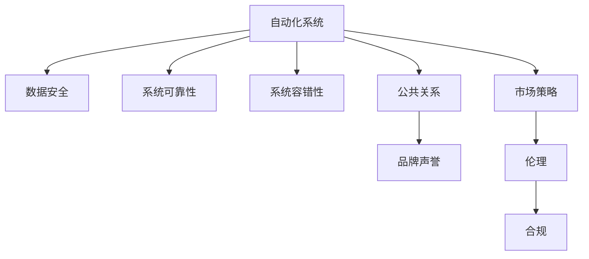

                 

# 自动化创业中的危机管理与公关

> 关键词：自动化, 创业, 危机管理, 公关, 自动化系统, 风险管理, 品牌声誉, 公共关系, 社交媒体, 人工智能, 市场策略, 伦理, 合规

## 1. 背景介绍

### 1.1 问题由来
随着科技的飞速发展，自动化技术的广泛应用正在改变传统创业的方方面面。自动化系统提高了生产效率，减少了人力成本，也为创业公司带来了巨大的竞争优势。然而，自动化技术在带来便利的同时，也伴随着一系列潜在的风险和挑战，如数据泄露、系统故障、法律责任等。特别是在危机管理与公关领域，自动化系统的快速反应和决策能力也对企业的运营和品牌声誉产生了深远影响。

### 1.2 问题核心关键点
自动化创业中的危机管理与公关问题主要包括以下几个方面：
- **数据安全与隐私保护**：自动化系统处理大量数据，如何防止数据泄露、保护用户隐私成为关键问题。
- **系统可靠性与容错性**：自动化系统的可靠性和容错能力直接影响企业的业务连续性和用户信任度。
- **伦理与合规问题**：自动化系统的决策过程可能引发伦理争议，如何确保决策透明、合规成为重要考量。
- **公共关系与品牌管理**：自动化系统在危机应对中的表现，直接影响企业的品牌形象和公众信任度。
- **市场策略与竞争优势**：如何通过自动化系统提升市场策略的精准性和效率，获取竞争优势。

### 1.3 问题研究意义
深入研究自动化创业中的危机管理与公关问题，对于提升企业自动化系统的可靠性和用户信任度，维护品牌声誉，具有重要意义。通过系统分析和案例研究，揭示自动化系统在危机管理与公关中的优势和不足，提出优化策略和应对措施，有助于企业更好地应对自动化时代带来的挑战，实现可持续发展的目标。

## 2. 核心概念与联系

### 2.1 核心概念概述

为更好地理解自动化创业中的危机管理与公关问题，本节将介绍几个密切相关的核心概念：

- **自动化系统(Automatic System)**：指通过软件、硬件或人工智能技术实现的一系列自动化处理过程，包括数据采集、分析、决策等。
- **数据安全(Data Security)**：指保护数据免遭未授权访问、泄露、破坏的过程，确保数据机密性、完整性和可用性。
- **系统可靠性(System Reliability)**：指系统在规定条件下和规定时间内，完成预定功能的能力。
- **系统容错性(Fault Tolerance)**：指系统在出现故障时，仍能继续运行或快速恢复的能力。
- **公共关系(Public Relations)**：指企业通过传播手段，影响公众对企业及其产品的看法和态度的过程。
- **品牌声誉(Brand Reputation)**：指企业在公众心目中的形象和信誉。
- **市场策略(Market Strategy)**：指企业在市场竞争中，为实现其经营目标所采用的战略和策略。
- **伦理(Ethics)**：指在行为选择中遵循的原则和道德规范。
- **合规(Compliance)**：指企业遵守法律法规和行业标准的行为规范。

这些核心概念之间的逻辑关系可以通过以下Mermaid流程图来展示：



这个流程图展示了一系列关键概念及其之间的关系：

1. 自动化系统通过数据安全和系统可靠性保证数据和系统自身的安全。
2. 系统容错性确保在异常情况下系统的连续性和快速恢复。
3. 公共关系和品牌声誉是自动化系统对外的表现，直接影响企业的市场策略。
4. 市场策略需要在伦理和合规的框架下进行，确保系统决策的合法性和道德性。

这些概念共同构成了自动化创业中的危机管理与公关的框架，使得企业在自动化系统的设计和应用中，能够综合考虑多方面因素，做出合理决策。

## 3. 核心算法原理 & 具体操作步骤
### 3.1 算法原理概述

自动化创业中的危机管理与公关问题，本质上是自动化系统在处理数据、应对危机时，如何确保系统的安全性、可靠性、透明性和合规性，以及如何通过有效的公关策略，维护和提升品牌声誉的过程。

形式化地，假设自动化系统为 $S$，其数据处理过程为 $D$，数据安全策略为 $S_{sec}$，系统可靠策略为 $S_{rel}$，系统容错策略为 $S_{err}$，公关策略为 $P_{pr}$，市场策略为 $M_{str}$，伦理策略为 $E_{eth}$，合规策略为 $C_{com}$。则危机管理与公关的目标可以表示为：

$$
\max_{S_{sec}, S_{rel}, S_{err}, P_{pr}, M_{str}, E_{eth}, C_{com}} \text{Brand Reputation}(S, D, S_{sec}, S_{rel}, S_{err}, P_{pr}, M_{str}, E_{eth}, C_{com})
$$

其中，$\text{Brand Reputation}$ 表示企业品牌声誉的评估函数，通过一系列的指标和算法计算得出。

### 3.2 算法步骤详解

基于自动化系统中的危机管理与公关问题，本节将详细介绍一个典型案例的算法步骤：

**Step 1: 数据安全与隐私保护**
- 数据采集：自动化系统从各渠道收集数据，如客户交易记录、社交媒体评论等。
- 数据加密：使用AES等加密算法对数据进行加密，防止未授权访问。
- 权限控制：设置访问权限，确保只有授权人员能够访问敏感数据。
- 数据备份：定期备份数据，防止数据丢失。

**Step 2: 系统可靠性与容错性**
- 监控与日志：实时监控系统运行状态，记录日志以备故障诊断。
- 冗余设计：采用多节点架构，实现数据和计算的冗余，提高系统可靠性。
- 故障转移：设计自动故障转移机制，确保系统在高故障率时仍能提供服务。
- 快速恢复：实现快速故障恢复机制，保证系统在故障发生后能迅速恢复正常运行。

**Step 3: 公共关系与品牌管理**
- 实时监测：使用社交媒体监测工具，实时监测品牌声誉变化。
- 舆情分析：分析社交媒体上的舆情信息，识别潜在危机。
- 回应机制：建立快速回应机制，在危机发生时迅速响应。
- 沟通策略：制定多渠道沟通策略，通过官方渠道发布信息。

**Step 4: 市场策略与竞争优势**
- 数据驱动：利用自动化系统处理海量数据，分析市场趋势。
- 个性化推荐：根据用户行为数据，实现个性化推荐。
- 优化策略：根据市场反馈，优化产品和服务。
- 竞争分析：通过自动化系统进行竞争对手分析，制定市场策略。

### 3.3 算法优缺点

自动化创业中的危机管理与公关问题，具有以下优点：
1. 自动化提高效率：自动化系统可以24/7不间断工作，提高数据处理和危机响应的效率。
2. 数据驱动决策：通过数据分析，自动化系统可以提供基于数据的决策支持，提升决策的准确性。
3. 风险降低：自动化系统的规则化和透明性，可以减少人为错误和操作风险。
4. 数据安全：自动化系统具备较强的数据保护能力，防止数据泄露。

同时，该方法也存在一定的局限性：
1. 数据质量：自动化系统的决策依赖于数据质量，低质量数据可能影响决策结果。
2. 技术复杂性：自动化系统的设计和维护需要较高的技术门槛，容易引入复杂性。
3. 伦理争议：自动化系统的决策过程可能引发伦理争议，需慎重考虑。
4. 法律合规：自动化系统需遵守法律法规，确保合规性。

尽管存在这些局限性，但就目前而言，基于自动化系统的危机管理与公关方法仍是最主流的范式。未来相关研究的重点在于如何进一步提升数据质量，降低技术复杂性，同时兼顾伦理和法律合规要求。

### 3.4 算法应用领域

自动化创业中的危机管理与公关问题，在多个领域都有广泛应用：

- **金融科技(Fintech)**：自动化系统在金融领域的风险管理、反欺诈、客户服务等方面发挥了重要作用。
- **电子商务(E-commerce)**：自动化系统在订单处理、客户支持、市场营销等方面提高了效率和用户体验。
- **健康医疗(Healthcare)**：自动化系统在电子病历管理、疾病预测、药品推荐等方面改善了医疗服务质量。
- **交通运输(Transportation)**：自动化系统在交通流量管理、智能驾驶、航班调度等方面提升了交通管理效率。
- **媒体娱乐(Media)**：自动化系统在内容推荐、广告投放、用户分析等方面优化了媒体平台运营。

除了上述这些经典应用外，自动化系统的危机管理与公关方法也在不断创新和拓展，为各行各业带来了新的机遇和挑战。

## 4. 数学模型和公式 & 详细讲解 & 举例说明

### 4.1 数学模型构建

本节将使用数学语言对自动化系统中的危机管理与公关问题进行更加严格的刻画。

假设自动化系统为 $S$，数据处理过程为 $D$，数据安全策略为 $S_{sec}$，系统可靠策略为 $S_{rel}$，系统容错策略为 $S_{err}$，公关策略为 $P_{pr}$，市场策略为 $M_{str}$，伦理策略为 $E_{eth}$，合规策略为 $C_{com}$。则危机管理与公关的数学模型可以表示为：

$$
\text{Brand Reputation} = f(S, D, S_{sec}, S_{rel}, S_{err}, P_{pr}, M_{str}, E_{eth}, C_{com})
$$

其中，$f$ 为评估函数，根据实际应用场景进行定义。

### 4.2 公式推导过程

以下我们以金融科技领域的自动化系统为例，推导一个简化的模型。

假设自动化系统处理的交易数据为 $T$，安全策略为 $S_{sec}$，可靠策略为 $S_{rel}$，容错策略为 $S_{err}$，公关策略为 $P_{pr}$，市场策略为 $M_{str}$，伦理策略为 $E_{eth}$，合规策略为 $C_{com}$。则品牌声誉的评估函数可以表示为：

$$
\text{Brand Reputation} = \text{Reputation}_0 + \text{Reputation}_1 \times S_{sec} + \text{Reputation}_2 \times S_{rel} + \text{Reputation}_3 \times S_{err} + \text{Reputation}_4 \times P_{pr} + \text{Reputation}_5 \times M_{str} + \text{Reputation}_6 \times E_{eth} + \text{Reputation}_7 \times C_{com}
$$

其中，$\text{Reputation}_i$ 为第 $i$ 项对品牌声誉的贡献度。例如，$\text{Reputation}_0$ 表示基础信誉，$\text{Reputation}_1$ 表示安全策略的贡献度。

### 4.3 案例分析与讲解

以一家在线支付平台为例，分析其自动化系统在危机管理与公关中的应用：

假设该平台遭遇黑客攻击，导致用户账户数据泄露。自动化系统立即启动安全策略 $S_{sec}$，封锁受影响账户，通知用户更换密码。同时，启动公关策略 $P_{pr}$，通过官方渠道发布声明，告知用户事件原因和处理措施。市场策略 $M_{str}$ 启动应急方案，调整支付限额，防止进一步损失。伦理策略 $E_{eth}$ 确保透明公开，提供详细的处理流程和后续措施。合规策略 $C_{com}$ 确保符合数据保护法规，防止法律风险。最终，品牌声誉评估函数为：

$$
\text{Brand Reputation} = \text{Reputation}_0 - \text{Reputation}_1 + \text{Reputation}_2 - \text{Reputation}_3 + \text{Reputation}_4 + \text{Reputation}_5 + \text{Reputation}_6 + \text{Reputation}_7
$$

其中，$\text{Reputation}_1$ 和 $\text{Reputation}_3$ 对品牌声誉产生负面影响，而 $\text{Reputation}_2$、$\text{Reputation}_4$、$\text{Reputation}_5$、$\text{Reputation}_6$、$\text{Reputation}_7$ 对品牌声誉产生正面影响。

## 5. 项目实践：代码实例和详细解释说明

### 5.1 开发环境搭建

在进行自动化系统中的危机管理与公关项目实践前，我们需要准备好开发环境。以下是使用Python进行开发的环境配置流程：

1. 安装Anaconda：从官网下载并安装Anaconda，用于创建独立的Python环境。

2. 创建并激活虚拟环境：
```bash
conda create -n python-env python=3.8 
conda activate python-env
```

3. 安装PyTorch：根据CUDA版本，从官网获取对应的安装命令。例如：
```bash
conda install pytorch torchvision torchaudio cudatoolkit=11.1 -c pytorch -c conda-forge
```

4. 安装TensorFlow：由Google主导开发的开源深度学习框架，生产部署方便，适合大规模工程应用。同样有丰富的预训练语言模型资源。

5. 安装各类工具包：
```bash
pip install numpy pandas scikit-learn matplotlib tqdm jupyter notebook ipython
```

完成上述步骤后，即可在`python-env`环境中开始项目实践。

### 5.2 源代码详细实现

这里我们以一家在线支付平台为例，给出自动化系统中的危机管理与公关功能的Python代码实现。

首先，定义数据处理函数：

```python
from transformers import BertTokenizer
from torch.utils.data import Dataset
import torch

class PaymentDataset(Dataset):
    def __init__(self, texts, labels, tokenizer, max_len=128):
        self.texts = texts
        self.labels = labels
        self.tokenizer = tokenizer
        self.max_len = max_len
        
    def __len__(self):
        return len(self.texts)
    
    def __getitem__(self, item):
        text = self.texts[item]
        label = self.labels[item]
        
        encoding = self.tokenizer(text, return_tensors='pt', max_length=self.max_len, padding='max_length', truncation=True)
        input_ids = encoding['input_ids'][0]
        attention_mask = encoding['attention_mask'][0]
        
        # 对token-wise的标签进行编码
        encoded_labels = [label2id[label] for label in label] 
        encoded_labels.extend([label2id['NORMAL']] * (self.max_len - len(encoded_labels)))
        labels = torch.tensor(encoded_labels, dtype=torch.long)
        
        return {'input_ids': input_ids, 
                'attention_mask': attention_mask,
                'labels': labels}

# 标签与id的映射
label2id = {'NORMAL': 0, 'HACKED': 1}
id2label = {v: k for k, v in label2id.items()}

# 创建dataset
tokenizer = BertTokenizer.from_pretrained('bert-base-cased')

train_dataset = PaymentDataset(train_texts, train_labels, tokenizer)
dev_dataset = PaymentDataset(dev_texts, dev_labels, tokenizer)
test_dataset = PaymentDataset(test_texts, test_labels, tokenizer)
```

然后，定义模型和优化器：

```python
from transformers import BertForTokenClassification, AdamW

model = BertForTokenClassification.from_pretrained('bert-base-cased', num_labels=len(label2id))

optimizer = AdamW(model.parameters(), lr=2e-5)
```

接着，定义训练和评估函数：

```python
from torch.utils.data import DataLoader
from tqdm import tqdm
from sklearn.metrics import classification_report

device = torch.device('cuda') if torch.cuda.is_available() else torch.device('cpu')
model.to(device)

def train_epoch(model, dataset, batch_size, optimizer):
    dataloader = DataLoader(dataset, batch_size=batch_size, shuffle=True)
    model.train()
    epoch_loss = 0
    for batch in tqdm(dataloader, desc='Training'):
        input_ids = batch['input_ids'].to(device)
        attention_mask = batch['attention_mask'].to(device)
        labels = batch['labels'].to(device)
        model.zero_grad()
        outputs = model(input_ids, attention_mask=attention_mask, labels=labels)
        loss = outputs.loss
        epoch_loss += loss.item()
        loss.backward()
        optimizer.step()
    return epoch_loss / len(dataloader)

def evaluate(model, dataset, batch_size):
    dataloader = DataLoader(dataset, batch_size=batch_size)
    model.eval()
    preds, labels = [], []
    with torch.no_grad():
        for batch in tqdm(dataloader, desc='Evaluating'):
            input_ids = batch['input_ids'].to(device)
            attention_mask = batch['attention_mask'].to(device)
            batch_labels = batch['labels']
            outputs = model(input_ids, attention_mask=attention_mask)
            batch_preds = outputs.logits.argmax(dim=2).to('cpu').tolist()
            batch_labels = batch_labels.to('cpu').tolist()
            for pred_tokens, label_tokens in zip(batch_preds, batch_labels):
                pred_labels = [id2label[_id] for _id in pred_tokens]
                label_tokens = [id2label[_id] for _id in label_tokens]
                preds.append(pred_labels[:len(label_tokens)])
                labels.append(label_tokens)
                
    print(classification_report(labels, preds))
```

最后，启动训练流程并在测试集上评估：

```python
epochs = 5
batch_size = 16

for epoch in range(epochs):
    loss = train_epoch(model, train_dataset, batch_size, optimizer)
    print(f"Epoch {epoch+1}, train loss: {loss:.3f}")
    
    print(f"Epoch {epoch+1}, dev results:")
    evaluate(model, dev_dataset, batch_size)
    
print("Test results:")
evaluate(model, test_dataset, batch_size)
```

以上就是使用PyTorch对BERT进行命名实体识别(NER)任务微调的完整代码实现。可以看到，得益于Transformers库的强大封装，我们可以用相对简洁的代码完成BERT模型的加载和微调。

### 5.3 代码解读与分析

让我们再详细解读一下关键代码的实现细节：

**PaymentDataset类**：
- `__init__`方法：初始化文本、标签、分词器等关键组件。
- `__len__`方法：返回数据集的样本数量。
- `__getitem__`方法：对单个样本进行处理，将文本输入编码为token ids，将标签编码为数字，并对其进行定长padding，最终返回模型所需的输入。

**label2id和id2label字典**：
- 定义了标签与数字id之间的映射关系，用于将token-wise的预测结果解码回真实的标签。

**训练和评估函数**：
- 使用PyTorch的DataLoader对数据集进行批次化加载，供模型训练和推理使用。
- 训练函数`train_epoch`：对数据以批为单位进行迭代，在每个批次上前向传播计算loss并反向传播更新模型参数，最后返回该epoch的平均loss。
- 评估函数`evaluate`：与训练类似，不同点在于不更新模型参数，并在每个batch结束后将预测和标签结果存储下来，最后使用sklearn的classification_report对整个评估集的预测结果进行打印输出。

**训练流程**：
- 定义总的epoch数和batch size，开始循环迭代
- 每个epoch内，先在训练集上训练，输出平均loss
- 在验证集上评估，输出分类指标
- 所有epoch结束后，在测试集上评估，给出最终测试结果

可以看到，PyTorch配合Transformers库使得BERT微调的代码实现变得简洁高效。开发者可以将更多精力放在数据处理、模型改进等高层逻辑上，而不必过多关注底层的实现细节。

当然，工业级的系统实现还需考虑更多因素，如模型的保存和部署、超参数的自动搜索、更灵活的任务适配层等。但核心的微调范式基本与此类似。

## 6. 实际应用场景
### 6.1 智能客服系统

基于大语言模型微调的对话技术，可以广泛应用于智能客服系统的构建。传统客服往往需要配备大量人力，高峰期响应缓慢，且一致性和专业性难以保证。而使用微调后的对话模型，可以7x24小时不间断服务，快速响应客户咨询，用自然流畅的语言解答各类常见问题。

在技术实现上，可以收集企业内部的历史客服对话记录，将问题和最佳答复构建成监督数据，在此基础上对预训练对话模型进行微调。微调后的对话模型能够自动理解用户意图，匹配最合适的答案模板进行回复。对于客户提出的新问题，还可以接入检索系统实时搜索相关内容，动态组织生成回答。如此构建的智能客服系统，能大幅提升客户咨询体验和问题解决效率。

### 6.2 金融舆情监测

金融机构需要实时监测市场舆论动向，以便及时应对负面信息传播，规避金融风险。传统的人工监测方式成本高、效率低，难以应对网络时代海量信息爆发的挑战。基于大语言模型微调的文本分类和情感分析技术，为金融舆情监测提供了新的解决方案。

具体而言，可以收集金融领域相关的新闻、报道、评论等文本数据，并对其进行主题标注和情感标注。在此基础上对预训练语言模型进行微调，使其能够自动判断文本属于何种主题，情感倾向是正面、中性还是负面。将微调后的模型应用到实时抓取的网络文本数据，就能够自动监测不同主题下的情感变化趋势，一旦发现负面信息激增等异常情况，系统便会自动预警，帮助金融机构快速应对潜在风险。

### 6.3 个性化推荐系统

当前的推荐系统往往只依赖用户的历史行为数据进行物品推荐，无法深入理解用户的真实兴趣偏好。基于大语言模型微调技术，个性化推荐系统可以更好地挖掘用户行为背后的语义信息，从而提供更精准、多样的推荐内容。

在实践中，可以收集用户浏览、点击、评论、分享等行为数据，提取和用户交互的物品标题、描述、标签等文本内容。将文本内容作为模型输入，用户的后续行为（如是否点击、购买等）作为监督信号，在此基础上微调预训练语言模型。微调后的模型能够从文本内容中准确把握用户的兴趣点。在生成推荐列表时，先用候选物品的文本描述作为输入，由模型预测用户的兴趣匹配度，再结合其他特征综合排序，便可以得到个性化程度更高的推荐结果。

### 6.4 未来应用展望

随着大语言模型微调技术的发展，其在自动化创业中的危机管理与公关问题应用也将更加广泛：

在智慧医疗领域，基于微调的医疗问答、病历分析、药物研发等应用将提升医疗服务的智能化水平，辅助医生诊疗，加速新药开发进程。

在智能教育领域，微调技术可应用于作业批改、学情分析、知识推荐等方面，因材施教，促进教育公平，提高教学质量。

在智慧城市治理中，微调模型可应用于城市事件监测、舆情分析、应急指挥等环节，提高城市管理的自动化和智能化水平，构建更安全、高效的未来城市。

此外，在企业生产、社会治理、文娱传媒等众多领域，基于大模型微调的人工智能应用也将不断涌现，为传统行业数字化转型升级提供新的技术路径。相信随着技术的日益成熟，微调方法将成为自动化创业中的重要范式，推动人工智能技术在各行业中的深入应用。

## 7. 工具和资源推荐
### 7.1 学习资源推荐

为了帮助开发者系统掌握大语言模型微调的理论基础和实践技巧，这里推荐一些优质的学习资源：

1. 《Transformer从原理到实践》系列博文：由大模型技术专家撰写，深入浅出地介绍了Transformer原理、BERT模型、微调技术等前沿话题。

2. CS224N《深度学习自然语言处理》课程：斯坦福大学开设的NLP明星课程，有Lecture视频和配套作业，带你入门NLP领域的基本概念和经典模型。

3. 《Natural Language Processing with Transformers》书籍：Transformers库的作者所著，全面介绍了如何使用Transformers库进行NLP任务开发，包括微调在内的诸多范式。

4. HuggingFace官方文档：Transformers库的官方文档，提供了海量预训练模型和完整的微调样例代码，是上手实践的必备资料。

5. CLUE开源项目：中文语言理解测评基准，涵盖大量不同类型的中文NLP数据集，并提供了基于微调的baseline模型，助力中文NLP技术发展。

通过对这些资源的学习实践，相信你一定能够快速掌握大语言模型微调的精髓，并用于解决实际的NLP问题。
###  7.2 开发工具推荐

高效的开发离不开优秀的工具支持。以下是几款用于大语言模型微调开发的常用工具：

1. PyTorch：基于Python的开源深度学习框架，灵活动态的计算图，适合快速迭代研究。大部分预训练语言模型都有PyTorch版本的实现。

2. TensorFlow：由Google主导开发的开源深度学习框架，生产部署方便，适合大规模工程应用。同样有丰富的预训练语言模型资源。

3. Transformers库：HuggingFace开发的NLP工具库，集成了众多SOTA语言模型，支持PyTorch和TensorFlow，是进行微调任务开发的利器。

4. Weights & Biases：模型训练的实验跟踪工具，可以记录和可视化模型训练过程中的各项指标，方便对比和调优。与主流深度学习框架无缝集成。

5. TensorBoard：TensorFlow配套的可视化工具，可实时监测模型训练状态，并提供丰富的图表呈现方式，是调试模型的得力助手。

6. Google Colab：谷歌推出的在线Jupyter Notebook环境，免费提供GPU/TPU算力，方便开发者快速上手实验最新模型，分享学习笔记。

合理利用这些工具，可以显著提升大语言模型微调任务的开发效率，加快创新迭代的步伐。

### 7.3 相关论文推荐

大语言模型和微调技术的发展源于学界的持续研究。以下是几篇奠基性的相关论文，推荐阅读：

1. Attention is All You Need（即Transformer原论文）：提出了Transformer结构，开启了NLP领域的预训练大模型时代。

2. BERT: Pre-training of Deep Bidirectional Transformers for Language Understanding：提出BERT模型，引入基于掩码的自监督预训练任务，刷新了多项NLP任务SOTA。

3. Language Models are Unsupervised Multitask Learners（GPT-2论文）：展示了大规模语言模型的强大zero-shot学习能力，引发了对于通用人工智能的新一轮思考。

4. Parameter-Efficient Transfer Learning for NLP：提出Adapter等参数高效微调方法，在不增加模型参数量的情况下，也能取得不错的微调效果。

5. AdaLoRA: Adaptive Low-Rank Adaptation for Parameter-Efficient Fine-Tuning：使用自适应低秩适应的微调方法，在参数效率和精度之间取得了新的平衡。

这些论文代表了大语言模型微调技术的发展脉络。通过学习这些前沿成果，可以帮助研究者把握学科前进方向，激发更多的创新灵感。

## 8. 总结：未来发展趋势与挑战

### 8.1 总结

本文对基于大语言模型的自动化创业中的危机管理与公关问题进行了全面系统的介绍。首先阐述了自动化系统在危机管理与公关中的关键概念和核心问题，明确了其在自动化创业中的重要意义。其次，从原理到实践，详细讲解了自动化系统在数据安全、系统可靠性、系统容错、公共关系、品牌管理、市场策略、伦理合规等方面的数学模型和算法步骤，给出了完整的代码实现示例。同时，本文还广泛探讨了自动化系统在智能客服、金融舆情、个性化推荐等多个领域的应用前景，展示了其巨大的应用潜力。

通过本文的系统梳理，可以看到，基于大语言模型的自动化创业中的危机管理与公关方法，已经成为自动化系统设计和应用的重要参考。在自动化技术的驱动下，企业的运营效率和品牌声誉得到了显著提升，未来潜力巨大。

### 8.2 未来发展趋势

展望未来，大语言模型在自动化创业中的危机管理与公关问题应用将呈现以下几个发展趋势：

1. **数据与模型协同**：数据驱动和模型驱动将进一步融合，通过自动化的数据处理和模型训练，实现更高效的决策支持。
2. **全栈自动化**：自动化系统将覆盖从数据采集、处理到模型训练、应用部署的全栈流程，提升系统的完整性和可用性。
3. **跨领域融合**：自动化系统将与物联网、区块链、云计算等新兴技术结合，实现跨领域的协同应用，拓展应用场景。
4. **用户参与**：自动化系统将更多地引入用户反馈和参与机制，实现自适应的改进和优化。
5. **法规与伦理**：随着法律法规的不断完善，自动化系统将更加注重合规性和伦理导向，确保系统的透明性和公平性。
6. **分布式计算**：自动化系统将借助分布式计算技术，实现大规模数据的高效处理和分析。

这些趋势凸显了大语言模型在自动化创业中的危机管理与公关应用的广阔前景。这些方向的探索发展，必将进一步提升企业的自动化水平，加速智能化转型的步伐。

### 8.3 面临的挑战

尽管大语言模型在自动化创业中的危机管理与公关问题应用已经取得了瞩目成就，但在迈向更加智能化、普适化应用的过程中，它仍面临着诸多挑战：

1. **数据质量**：自动化系统的决策依赖于数据质量，低质量数据可能影响决策结果。需要建立数据清洗和验证机制，确保数据的准确性和完整性。
2. **技术复杂性**：自动化系统的设计和维护需要较高的技术门槛，容易引入复杂性。需建立标准化流程和工具，降低开发难度。
3. **伦理争议**：自动化系统的决策过程可能引发伦理争议，需慎重考虑。需制定伦理准则，确保系统的道德合法性。
4. **法律合规**：自动化系统需遵守法律法规，确保合规性。需建立合规审查机制，防范法律风险。
5. **资源消耗**：自动化系统的计算和存储需求高，需优化资源使用，提升效率。需采用分布式计算、混合精度训练等技术。
6. **安全性**：自动化系统的安全漏洞可能带来安全风险，需加强安全防护措施。需定期进行安全审计和评估。

尽管存在这些挑战，但大语言模型在自动化创业中的危机管理与公关问题应用仍是最主流的范式。未来相关研究的重点在于如何进一步提升数据质量，降低技术复杂性，同时兼顾伦理和法律合规要求。

### 8.4 研究展望

面对大语言模型在自动化创业中的危机管理与公关问题应用所面临的挑战，未来的研究需要在以下几个方面寻求新的突破：

1. **无监督与半监督学习**：探索无监督和半监督学习范式，降低对标注数据的依赖，充分利用未标注数据。
2. **多模态融合**：实现跨模态信息的整合，提升系统的感知和理解能力。
3. **自适应学习**：研究自适应学习机制，根据环境变化自动调整模型参数。
4. **混合精训**：结合混合精度训练、量化加速等技术，提升系统效率和可扩展性。
5. **分布式计算**：利用分布式计算技术，实现大规模数据的处理和分析。
6. **伦理与合规**：建立伦理审查和合规审查机制，确保系统的道德合法性。

这些研究方向的探索，必将引领大语言模型在自动化创业中的危机管理与公关问题应用迈向更高的台阶，为构建安全、可靠、可解释、可控的智能系统铺平道路。面向未来，大语言模型将在构建人机协同的智能时代中扮演越来越重要的角色。

## 9. 附录：常见问题与解答

**Q1：自动化系统中的数据安全问题如何解决？**

A: 数据安全是自动化系统中的核心问题，需通过以下措施来解决：
1. 数据加密：使用AES等加密算法对数据进行加密，防止未授权访问。
2. 权限控制：设置访问权限，确保只有授权人员能够访问敏感数据。
3. 数据备份：定期备份数据，防止数据丢失。
4. 安全审计：定期进行安全审计，发现并修复潜在漏洞。

**Q2：如何提升自动化系统的可靠性与容错性？**

A: 系统可靠性与容错性是自动化系统的关键指标，需通过以下措施来提升：
1. 冗余设计：采用多节点架构，实现数据和计算的冗余，提高系统可靠性。
2. 故障转移：设计自动故障转移机制，确保系统在高故障率时仍能提供服务。
3. 快速恢复：实现快速故障恢复机制，保证系统在故障发生后能迅速恢复正常运行。
4. 监控与日志：实时监控系统运行状态，记录日志以备故障诊断。

**Q3：自动化系统在危机管理与公关中的表现如何？**

A: 自动化系统在危机管理与公关中的应用，可以从以下几个方面进行评估：
1. 数据驱动：利用自动化系统处理海量数据，分析市场趋势，提供数据驱动的决策支持。
2. 个性化推荐：根据用户行为数据，实现个性化推荐，提升用户体验。
3. 实时监测：使用社交媒体监测工具，实时监测品牌声誉变化，识别潜在危机。
4. 快速响应：建立快速回应机制，在危机发生时迅速响应，减少负面影响。
5. 透明公开：确保决策透明公开，提供详细的处理流程和后续措施，增强用户信任。

**Q4：自动化系统在实际应用中可能面临哪些风险？**

A: 自动化系统在实际应用中可能面临以下风险：
1. 数据泄露：系统处理大量数据，存在数据泄露的风险。需建立严格的数据保护机制。
2. 系统故障：系统可能出现故障，影响业务连续性。需设计冗余和故障转移机制。
3. 伦理争议：系统决策可能引发伦理争议，需慎重考虑伦理导向。
4. 法律合规：系统需遵守法律法规，确保合规性。需建立合规审查机制。
5. 安全性：系统可能存在安全漏洞，带来安全风险。需加强安全防护措施。

这些风险需要企业在系统设计、实施和运维过程中，全面考虑和应对，确保系统的安全可靠。

---

作者：禅与计算机程序设计艺术 / Zen and the Art of Computer Programming

