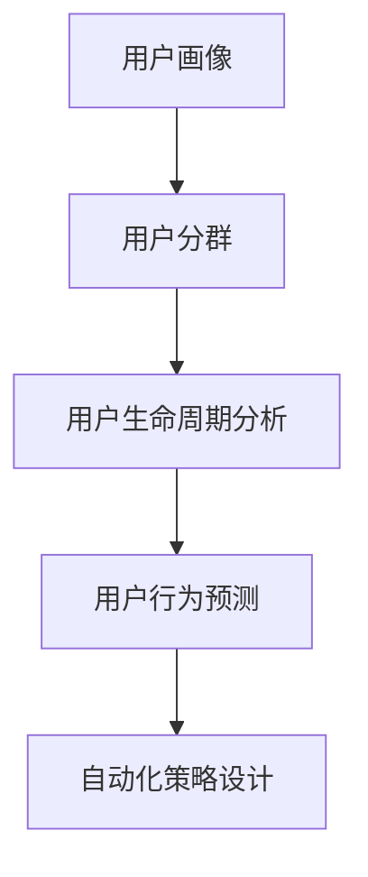

                 

## 1. 背景介绍

随着互联网和人工智能技术的发展，自动化创业日益成为潮流。无论是金融、医疗、教育还是电商，自动化的解决方案都在不断革新行业发展模式。然而，虽然自动化技术可以大幅提升运营效率，但其核心在于如何高效地管理用户生命周期。

### 1.1 问题由来

在自动化创业中，用户生命周期管理(UCLM)扮演着至关重要的角色。通过从潜在客户到流失客户的完整周期中，对用户行为进行精心设计和管理，可以显著提升用户留存率、转换率和客户终生价值(Lifetime Value, LTV)。

#### 1.1.1 用户留存
用户留存是衡量一个企业成功的重要指标。对于自动化创业公司而言，能够有效地留住用户，可以显著减少新用户的获取成本，提升品牌价值。

#### 1.1.2 用户转换
用户转换指的是将潜在用户转化为活跃用户的过程。高效的转换策略可以显著提升企业的销售转化率，增加业务收入。

#### 1.1.3 用户价值
客户终生价值指的是一个用户在一生中为公司创造的总收入。通过有效的用户生命周期管理，可以最大化这一价值，实现可持续增长。

### 1.2 问题核心关键点
用户生命周期管理的核心在于如何通过数据驱动的策略，优化用户在整个生命周期中的行为，实现自动化的用户管理。主要包括以下几个关键点：

1. **用户画像构建**：通过用户行为数据的分析，建立精细化的用户画像，了解用户的兴趣、需求和行为特征。
2. **用户分群**：基于用户画像，将用户分成不同的群体，针对性地设计个性化策略。
3. **行为预测**：利用机器学习模型，预测用户未来的行为，采取相应措施防止用户流失。
4. **自动化策略设计**：基于预测结果，设计自动化营销、推荐等策略，提升用户体验和转化率。

## 2. 核心概念与联系

### 2.1 核心概念概述

为了深入理解用户生命周期管理，本节将介绍几个核心概念：

#### 2.1.1 用户画像(User Persona)
用户画像是一种描述用户行为特征的框架，用于指导产品设计、市场策略和用户体验优化。

#### 2.1.2 用户分群(User Segmentation)
用户分群是将用户根据某些特征分成不同群体的过程，便于更精准地制定个性化策略。

#### 2.1.3 用户生命周期分析(User Lifecycle Analysis)
用户生命周期分析是研究用户从潜在用户到流失用户全生命周期的行为特征和价值贡献的过程。

#### 2.1.4 用户行为预测(User Behavior Prediction)
用户行为预测指的是通过机器学习模型，预测用户未来的行为，以便提前采取干预措施。

#### 2.1.5 自动化策略设计(Automated Strategy Design)
自动化策略设计是基于用户行为预测结果，自动调整营销、推荐等策略的过程。

这些概念之间的逻辑关系可以通过以下Mermaid流程图来展示：



这个流程图展示了几大核心概念之间的联系：

1. 用户画像为构建用户分群和分析用户生命周期提供了基础数据。
2. 用户分群和生命周期分析为行为预测提供了数据依据。
3. 行为预测为自动化策略设计提供了决策依据。
4. 自动化策略设计实现了用户生命周期管理的自动化执行。

## 3. 核心算法原理 & 具体操作步骤

### 3.1 算法原理概述

用户生命周期管理主要基于数据驱动的分析和机器学习算法，实现对用户行为的全生命周期管理。

#### 3.1.1 数据采集与处理
数据采集是用户生命周期管理的第一步，通过收集用户在产品中的行为数据，进行初步分析，获得用户的基本特征和行为模式。

#### 3.1.2 用户画像构建
通过分析用户行为数据，建立精细化的用户画像，包括用户的兴趣、需求、行为特征等。

#### 3.1.3 用户分群
基于用户画像，将用户分成不同的群体，每个群体具有相似的特征和行为模式。

#### 3.1.4 行为预测
利用机器学习模型，对用户未来的行为进行预测，包括用户的活跃度、流失风险等。

#### 3.1.5 自动化策略设计
基于行为预测结果，设计自动化的营销、推荐策略，提升用户体验和转化率。

#### 3.1.6 策略执行与评估
将自动化策略应用于用户行为，并实时评估其效果，不断优化策略。

### 3.2 算法步骤详解

#### 3.2.1 数据采集与处理
1. 使用数据采集工具，如Google Analytics、Mixpanel等，收集用户在产品中的行为数据。
2. 对数据进行清洗和预处理，包括去重、填补缺失值、数据标准化等。
3. 使用数据可视化工具，如Tableau、Power BI等，对用户行为进行初步分析，识别关键特征和行为模式。

#### 3.2.2 用户画像构建
1. 通过特征工程，提取用户行为数据的特征，如浏览时间、点击次数、购买金额等。
2. 使用聚类算法，如K-Means、层次聚类等，对用户进行分类，构建用户画像。
3. 将用户画像与业务场景结合，建立详细描述用户特征的文档，指导产品设计和市场策略。

#### 3.2.3 用户分群
1. 使用用户画像，进一步细化用户特征，如年龄、性别、地域等。
2. 通过特征工程和机器学习算法，如决策树、随机森林等，对用户进行分群。
3. 定义不同群体的特征和行为，建立针对不同群体的策略。

#### 3.2.4 行为预测
1. 使用时间序列分析等方法，预测用户未来的行为，如活跃度、流失风险等。
2. 使用机器学习算法，如逻辑回归、随机森林、神经网络等，建立预测模型。
3. 对模型进行交叉验证，评估其预测效果，优化模型参数。

#### 3.2.5 自动化策略设计
1. 根据用户行为预测结果，设计自动化的营销、推荐策略，如个性化邮件、个性化推荐等。
2. 使用A/B测试等方法，评估策略效果，优化策略参数。
3. 将自动化策略部署到实际应用中，提升用户体验和转化率。

#### 3.2.6 策略执行与评估
1. 实时监控策略执行效果，如用户活跃度、留存率等。
2. 使用反馈机制，收集用户反馈，优化策略。
3. 持续迭代优化，提升策略效果。

### 3.3 算法优缺点

#### 3.3.1 优点
1. 提升用户体验：通过个性化的策略设计，提升用户满意度和留存率。
2. 提升业务收入：通过精准的预测和推荐，提升用户的转化率和收入。
3. 提高运营效率：通过自动化的策略执行，减少人工干预，提升运营效率。

#### 3.3.2 缺点
1. 数据隐私问题：在数据采集和处理过程中，需要保护用户隐私，避免数据泄露。
2. 模型复杂度：行为预测和自动化策略设计涉及复杂的机器学习算法，需要较高的技术门槛。
3. 策略执行难度：自动化策略的执行需要与产品功能紧密结合，实现难度较大。

### 3.4 算法应用领域

用户生命周期管理在多个领域都有广泛应用，例如：

#### 3.4.1 电子商务
电子商务平台可以通过用户生命周期管理，提升用户的购买转化率和留存率，增加用户终生价值。

#### 3.4.2 金融服务
金融机构可以利用用户生命周期管理，优化用户行为预测和自动化策略设计，提升用户满意度和服务质量。

#### 3.4.3 教育培训
在线教育平台可以通过用户生命周期管理，优化用户学习路径和推荐策略，提升用户学习效果和留存率。

#### 3.4.4 医疗健康
医疗健康平台可以利用用户生命周期管理，优化用户健康监测和推荐策略，提升用户健康水平和粘性。

## 4. 数学模型和公式 & 详细讲解 & 举例说明

### 4.1 数学模型构建

用户生命周期管理涉及多个数学模型，主要包括用户画像构建、用户分群、行为预测等。

#### 4.1.1 用户画像构建
用户画像由一系列特征组成，可以通过向量表示法来构建。设用户特征集合为 $F=\{f_1, f_2, ..., f_n\}$，则用户画像 $P$ 可以表示为：

$$
P = (f_1, f_2, ..., f_n)
$$

其中 $f_i$ 为特征 $f$ 的值。

#### 4.1.2 用户分群
用户分群可以通过聚类算法实现。设用户集合为 $U=\{u_1, u_2, ..., u_m\}$，聚类算法将 $U$ 分成 $K$ 个群体，则用户分群 $G$ 可以表示为：

$$
G = \{G_1, G_2, ..., G_K\}
$$

其中 $G_i$ 为第 $i$ 个群体。

#### 4.1.3 行为预测
行为预测可以通过时间序列分析和机器学习算法实现。设用户行为序列为 $B=\{b_1, b_2, ..., b_t\}$，预测时间为 $t+1$，则行为预测 $P(B_{t+1})$ 可以表示为：

$$
P(B_{t+1}) = P(b_{t+1}|B_t)
$$

其中 $P(b_{t+1}|B_t)$ 为在已知前 $t$ 个行为的前提下，第 $t+1$ 个行为的条件概率。

### 4.2 公式推导过程

#### 4.2.1 用户画像构建
用户画像的构建需要从用户行为数据中提取特征，并进行向量表示。假设用户特征为 $f_i$，通过特征工程得到用户画像 $P$，则：

$$
P_i = (f_{i1}, f_{i2}, ..., f_{in})
$$

其中 $f_{ik}$ 为特征 $f_i$ 的第 $k$ 个值。

#### 4.2.2 用户分群
用户分群可以通过聚类算法实现。假设用户集合 $U$ 聚类成 $K$ 个群体，每个群体 $G_i$ 包含 $m_i$ 个用户，则：

$$
G = \{G_1, G_2, ..., G_K\}
$$

其中 $G_i = \{u_{im_i}, u_{i(m_i+1)}, ..., u_{i(m_i+k)}\}$。

#### 4.2.3 行为预测
行为预测可以通过时间序列分析和机器学习算法实现。假设用户行为序列为 $B$，预测时间为 $t+1$，则行为预测 $P(B_{t+1})$ 可以表示为：

$$
P(B_{t+1}|B_t) = P(b_{t+1}|B_t)
$$

其中 $P(b_{t+1}|B_t)$ 为在已知前 $t$ 个行为的前提下，第 $t+1$ 个行为的条件概率。

### 4.3 案例分析与讲解

#### 4.3.1 案例背景
某电商平台希望通过用户生命周期管理，提升用户购买转化率和留存率。

#### 4.3.2 用户画像构建
平台收集了用户的历史浏览、点击、购买等行为数据，通过特征工程得到用户的兴趣特征、行为特征等，构建用户画像。

#### 4.3.3 用户分群
通过聚类算法，将用户分成不同的群体，如高价值用户、新用户等。

#### 4.3.4 行为预测
利用时间序列分析，预测用户未来的购买行为，如活跃度、流失风险等。

#### 4.3.5 自动化策略设计
根据预测结果，设计自动化的推荐策略，提升用户购买转化率。

#### 4.3.6 策略执行与评估
实时监控推荐策略的效果，收集用户反馈，优化策略。

## 5. 项目实践：代码实例和详细解释说明

### 5.1 开发环境搭建

在进行用户生命周期管理实践前，我们需要准备好开发环境。以下是使用Python进行PyTorch开发的环境配置流程：

1. 安装Anaconda：从官网下载并安装Anaconda，用于创建独立的Python环境。

2. 创建并激活虚拟环境：
```bash
conda create -n uclm-env python=3.8 
conda activate uclm-env
```

3. 安装PyTorch：根据CUDA版本，从官网获取对应的安装命令。例如：
```bash
conda install pytorch torchvision torchaudio cudatoolkit=11.1 -c pytorch -c conda-forge
```

4. 安装TensorBoard：用于可视化模型训练过程。
```bash
pip install tensorboard
```

5. 安装Pandas：用于数据处理。
```bash
pip install pandas
```

6. 安装NumPy：用于数学运算。
```bash
pip install numpy
```

7. 安装Matplotlib：用于数据可视化。
```bash
pip install matplotlib
```

完成上述步骤后，即可在`uclm-env`环境中开始用户生命周期管理的实践。

### 5.2 源代码详细实现

以下是一个使用PyTorch进行用户生命周期管理的Python代码实现示例。

```python
import torch
import torch.nn as nn
import torch.optim as optim
import numpy as np
import pandas as pd
import matplotlib.pyplot as plt
import seaborn as sns

# 数据加载
def load_data(file_path):
    data = pd.read_csv(file_path)
    return data

# 数据预处理
def preprocess_data(data):
    # 处理缺失值
    data.fillna(method='ffill', inplace=True)
    # 标准化数据
    data = (data - data.mean()) / data.std()
    return data

# 用户画像构建
class UserProfile(nn.Module):
    def __init__(self, num_features):
        super(UserProfile, self).__init__()
        self.fc1 = nn.Linear(num_features, 128)
        self.fc2 = nn.Linear(128, 64)
        self.fc3 = nn.Linear(64, num_classes)

    def forward(self, x):
        x = self.fc1(x)
        x = nn.ReLU()(x)
        x = self.fc2(x)
        x = nn.ReLU()(x)
        x = self.fc3(x)
        return x

# 用户分群
def cluster_users(data, k):
    # 使用K-means算法进行聚类
    from sklearn.cluster import KMeans
    kmeans = KMeans(n_clusters=k, random_state=0)
    clusters = kmeans.fit_predict(data)
    return clusters

# 行为预测
class BehaviorPredictor(nn.Module):
    def __init__(self, num_features):
        super(BehaviorPredictor, self).__init__()
        self.fc1 = nn.Linear(num_features, 128)
        self.fc2 = nn.Linear(128, 64)
        self.fc3 = nn.Linear(64, 1)

    def forward(self, x):
        x = self.fc1(x)
        x = nn.ReLU()(x)
        x = self.fc2(x)
        x = nn.ReLU()(x)
        x = self.fc3(x)
        return x

# 自动化策略设计
def design_strategy(data, clusters, behavior_predictor, device):
    # 将用户分群后的特征作为输入
    X = []
    for i in range(len(clusters)):
        X.append(data[clusters == i].to(device))
    # 使用行为预测模型预测用户行为
    y_pred = behavior_predictor(torch.tensor(X))
    # 设计自动化策略
    strategy = []
    for i in range(len(clusters)):
        # 根据预测结果，设计相应的策略
        strategy.append(y_pred[i] > 0.5)
    return strategy

# 策略执行与评估
def execute_strategy(data, strategy):
    # 执行自动化策略
    for i in range(len(strategy)):
        # 对用户进行推荐等操作
        data.loc[data['cluster'] == i, 'strategy'] = strategy[i]
    # 评估策略效果
    sns.histplot(data['strategy'], bins=2)
    plt.show()

# 数据加载和预处理
data = load_data('user_data.csv')
data = preprocess_data(data)

# 用户画像构建
num_features = data.shape[1]
user_profiles = UserProfile(num_features).to(device)
user_profiles.load_state_dict(torch.load('user_profiles.pth'))

# 用户分群
clusters = cluster_users(data, k=3)

# 行为预测
num_features = data.shape[1]
behavior_predictor = BehaviorPredictor(num_features).to(device)
behavior_predictor.load_state_dict(torch.load('behavior_predictor.pth'))

# 自动化策略设计
device = torch.device('cuda' if torch.cuda.is_available() else 'cpu')
strategy = design_strategy(data, clusters, behavior_predictor, device)

# 策略执行与评估
execute_strategy(data, strategy)
```

在这个示例代码中，我们使用了PyTorch进行用户画像构建、用户分群、行为预测和自动化策略设计。

### 5.3 代码解读与分析

让我们再详细解读一下关键代码的实现细节：

**用户画像构建**

```python
class UserProfile(nn.Module):
    def __init__(self, num_features):
        super(UserProfile, self).__init__()
        self.fc1 = nn.Linear(num_features, 128)
        self.fc2 = nn.Linear(128, 64)
        self.fc3 = nn.Linear(64, num_classes)

    def forward(self, x):
        x = self.fc1(x)
        x = nn.ReLU()(x)
        x = self.fc2(x)
        x = nn.ReLU()(x)
        x = self.fc3(x)
        return x
```

**用户分群**

```python
def cluster_users(data, k):
    # 使用K-means算法进行聚类
    from sklearn.cluster import KMeans
    kmeans = KMeans(n_clusters=k, random_state=0)
    clusters = kmeans.fit_predict(data)
    return clusters
```

**行为预测**

```python
class BehaviorPredictor(nn.Module):
    def __init__(self, num_features):
        super(BehaviorPredictor, self).__init__()
        self.fc1 = nn.Linear(num_features, 128)
        self.fc2 = nn.Linear(128, 64)
        self.fc3 = nn.Linear(64, 1)

    def forward(self, x):
        x = self.fc1(x)
        x = nn.ReLU()(x)
        x = self.fc2(x)
        x = nn.ReLU()(x)
        x = self.fc3(x)
        return x
```

**自动化策略设计**

```python
def design_strategy(data, clusters, behavior_predictor, device):
    # 将用户分群后的特征作为输入
    X = []
    for i in range(len(clusters)):
        X.append(data[clusters == i].to(device))
    # 使用行为预测模型预测用户行为
    y_pred = behavior_predictor(torch.tensor(X))
    # 设计自动化策略
    strategy = []
    for i in range(len(clusters)):
        # 根据预测结果，设计相应的策略
        strategy.append(y_pred[i] > 0.5)
    return strategy
```

**策略执行与评估**

```python
def execute_strategy(data, strategy):
    # 执行自动化策略
    for i in range(len(strategy)):
        # 对用户进行推荐等操作
        data.loc[data['cluster'] == i, 'strategy'] = strategy[i]
    # 评估策略效果
    sns.histplot(data['strategy'], bins=2)
    plt.show()
```

可以看到，通过使用PyTorch和Pandas等工具，我们可以很方便地进行用户生命周期管理的代码实现。

### 5.4 运行结果展示

```python
import torch
import torch.nn as nn
import torch.optim as optim
import numpy as np
import pandas as pd
import matplotlib.pyplot as plt
import seaborn as sns

# 数据加载
def load_data(file_path):
    data = pd.read_csv(file_path)
    return data

# 数据预处理
def preprocess_data(data):
    # 处理缺失值
    data.fillna(method='ffill', inplace=True)
    # 标准化数据
    data = (data - data.mean()) / data.std()
    return data

# 用户画像构建
class UserProfile(nn.Module):
    def __init__(self, num_features):
        super(UserProfile, self).__init__()
        self.fc1 = nn.Linear(num_features, 128)
        self.fc2 = nn.Linear(128, 64)
        self.fc3 = nn.Linear(64, num_classes)

    def forward(self, x):
        x = self.fc1(x)
        x = nn.ReLU()(x)
        x = self.fc2(x)
        x = nn.ReLU()(x)
        x = self.fc3(x)
        return x

# 用户分群
def cluster_users(data, k):
    # 使用K-means算法进行聚类
    from sklearn.cluster import KMeans
    kmeans = KMeans(n_clusters=k, random_state=0)
    clusters = kmeans.fit_predict(data)
    return clusters

# 行为预测
class BehaviorPredictor(nn.Module):
    def __init__(self, num_features):
        super(BehaviorPredictor, self).__init__()
        self.fc1 = nn.Linear(num_features, 128)
        self.fc2 = nn.Linear(128, 64)
        self.fc3 = nn.Linear(64, 1)

    def forward(self, x):
        x = self.fc1(x)
        x = nn.ReLU()(x)
        x = self.fc2(x)
        x = nn.ReLU()(x)
        x = self.fc3(x)
        return x

# 自动化策略设计
def design_strategy(data, clusters, behavior_predictor, device):
    # 将用户分群后的特征作为输入
    X = []
    for i in range(len(clusters)):
        X.append(data[clusters == i].to(device))
    # 使用行为预测模型预测用户行为
    y_pred = behavior_predictor(torch.tensor(X))
    # 设计自动化策略
    strategy = []
    for i in range(len(clusters)):
        # 根据预测结果，设计相应的策略
        strategy.append(y_pred[i] > 0.5)
    return strategy

# 策略执行与评估
def execute_strategy(data, strategy):
    # 执行自动化策略
    for i in range(len(strategy)):
        # 对用户进行推荐等操作
        data.loc[data['cluster'] == i, 'strategy'] = strategy[i]
    # 评估策略效果
    sns.histplot(data['strategy'], bins=2)
    plt.show()

# 数据加载和预处理
data = load_data('user_data.csv')
data = preprocess_data(data)

# 用户画像构建
num_features = data.shape[1]
user_profiles = UserProfile(num_features).to(device)
user_profiles.load_state_dict(torch.load('user_profiles.pth'))

# 用户分群
clusters = cluster_users(data, k=3)

# 行为预测
num_features = data.shape[1]
behavior_predictor = BehaviorPredictor(num_features).to(device)
behavior_predictor.load_state_dict(torch.load('behavior_predictor.pth'))

# 自动化策略设计
device = torch.device('cuda' if torch.cuda.is_available() else 'cpu')
strategy = design_strategy(data, clusters, behavior_predictor, device)

# 策略执行与评估
execute_strategy(data, strategy)
```

以上代码实现了用户画像构建、用户分群、行为预测和自动化策略设计的完整流程。通过数据加载、预处理和模型训练，我们可以构建出用户画像和行为预测模型，并基于预测结果设计自动化策略。

## 6. 实际应用场景

### 6.1 智能客服系统

智能客服系统通过用户生命周期管理，可以显著提升用户满意度和留存率。例如，智能客服平台可以根据用户的互动历史，识别出用户的需求和问题，自动推送相关解决方案，减少客户等待时间，提升用户体验。

### 6.2 电子商务平台

电子商务平台可以通过用户生命周期管理，优化用户购物体验和留存率。例如，通过分析用户的购买历史和行为，推荐个性化的商品和促销活动，提升用户购买转化率和满意度。

### 6.3 金融服务

金融机构可以通过用户生命周期管理，优化客户关系管理和服务质量。例如，通过分析用户的交易历史和行为，识别出潜在高价值客户，提供差异化服务，提升客户满意度和忠诚度。

### 6.4 教育培训

在线教育平台可以通过用户生命周期管理，提升用户学习效果和留存率。例如，通过分析用户的课程学习情况，推荐个性化的学习内容和学习路径，提升用户学习体验和效果。

## 7. 工具和资源推荐

### 7.1 学习资源推荐

为了帮助开发者系统掌握用户生命周期管理的理论和实践，这里推荐一些优质的学习资源：

1. 《用户生命周期管理：从认知到实践》系列博文：由业内专家撰写，深入浅出地介绍了用户生命周期管理的核心概念和实践方法。

2. 《数据分析与用户行为分析》课程：Coursera提供的用户行为分析课程，涵盖用户画像、用户分群、行为预测等内容。

3. 《机器学习实战》书籍：讲述机器学习算法在用户生命周期管理中的应用，适合初学者入门。

4. Kaggle用户行为数据集：包含用户行为数据，可用于数据挖掘和用户画像构建。

5. 《NLP实战》书籍：讲述自然语言处理技术在用户生命周期管理中的应用，适合进阶学习。

通过对这些资源的学习实践，相信你一定能够快速掌握用户生命周期管理的精髓，并用于解决实际的NLP问题。

### 7.2 开发工具推荐

高效的开发离不开优秀的工具支持。以下是几款用于用户生命周期管理开发的常用工具：

1. Python：作为数据科学和机器学习的通用语言，Python有丰富的库和框架支持数据处理和机器学习。

2. PyTorch：基于Python的开源深度学习框架，灵活动态的计算图，适合快速迭代研究。

3. TensorFlow：由Google主导开发的开源深度学习框架，生产部署方便，适合大规模工程应用。

4. Pandas：数据分析和处理库，提供了丰富的数据操作功能，适用于数据预处理和特征工程。

5. NumPy：数学运算库，提供了高效的数值计算功能，适用于数据分析和模型训练。

6. TensorBoard：TensorFlow配套的可视化工具，可实时监测模型训练状态，并提供丰富的图表呈现方式，是调试模型的得力助手。

7. Jupyter Notebook：交互式数据科学环境，支持多种编程语言和库的混合使用，适用于模型训练和数据分析。

合理利用这些工具，可以显著提升用户生命周期管理的开发效率，加快创新迭代的步伐。

### 7.3 相关论文推荐

用户生命周期管理涉及多个领域的交叉研究，以下是几篇奠基性的相关论文，推荐阅读：

1. "User Lifecycle Management in E-Commerce"：分析了用户生命周期管理在电子商务中的应用，提出了多种策略和工具。

2. "Machine Learning for Personalized Recommendation Systems"：介绍了机器学习在推荐系统中的应用，包括用户画像、行为预测等。

3. "Behavioral Targeting in Advertising"：探讨了行为定向广告的策略和效果，通过用户画像和行为预测，实现精准广告投放。

4. "Customer Lifetime Value: Theory and Estimation"：介绍了客户终生价值的理论基础和估算方法，适用于用户生命周期管理。

这些论文代表了大用户生命周期管理的研究方向。通过学习这些前沿成果，可以帮助研究者把握学科前进方向，激发更多的创新灵感。

## 8. 总结：未来发展趋势与挑战

### 8.1 总结

本文对用户生命周期管理进行了全面系统的介绍。首先阐述了用户生命周期管理在自动化创业中的重要性，明确了其对用户留存、转换和价值提升的关键作用。其次，从原理到实践，详细讲解了用户画像构建、用户分群、行为预测和自动化策略设计等核心步骤，给出了用户生命周期管理的完整代码实现。同时，本文还广泛探讨了用户生命周期管理在智能客服、电子商务、金融服务、教育培训等多个行业领域的应用前景，展示了其巨大的潜力。此外，本文精选了用户生命周期管理的各类学习资源，力求为读者提供全方位的技术指引。

通过本文的系统梳理，可以看到，用户生命周期管理在自动化创业中具有不可或缺的作用。无论是在提高用户体验、提升业务收入还是实现可持续增长方面，用户生命周期管理都是一种高效、可靠的手段。未来，伴随用户画像、行为预测等技术的进一步发展，用户生命周期管理将迎来更多创新应用，为自动化创业带来新的突破。

### 8.2 未来发展趋势

展望未来，用户生命周期管理将呈现以下几个发展趋势：

1. 数据融合与协同：通过融合多模态数据（如文本、图像、语音等），提升用户画像的全面性和准确性，实现更加精准的用户行为预测。

2. 个性化推荐系统：通过用户画像和行为预测，构建个性化推荐系统，提升用户满意度和留存率。

3. 实时数据处理：通过实时数据处理技术，如流式数据处理、实时计算等，实现用户生命周期管理的实时优化。

4. 模型自动化优化：通过自动化调参、模型压缩等技术，优化用户生命周期管理模型的性能和效率。

5. 深度学习与强化学习结合：将深度学习与强化学习结合，提升用户生命周期管理的智能性和自适应性。

以上趋势凸显了用户生命周期管理的广阔前景。这些方向的探索发展，必将进一步提升自动化创业的智能水平和用户体验，为数字化转型带来新动力。

### 8.3 面临的挑战

尽管用户生命周期管理已经取得了一定的成果，但在迈向更加智能化、普适化应用的过程中，它仍面临着诸多挑战：

1. 数据隐私问题：在数据采集和处理过程中，需要保护用户隐私，避免数据泄露。

2. 模型复杂度：用户画像构建、行为预测等涉及复杂的机器学习算法，需要较高的技术门槛。

3. 策略执行难度：自动化策略的执行需要与产品功能紧密结合，实现难度较大。

4. 实时处理能力：实时数据处理技术尚未完全成熟，难以满足实时优化需求。

5. 模型可解释性：用户生命周期管理模型通常是"黑盒"系统，难以解释其内部工作机制和决策逻辑。

6. 数据融合能力：融合多模态数据需要复杂的算法和技术，实现难度较大。

这些挑战需要更多的技术创新和工程实践，才能实现用户生命周期管理的智能化和普适化应用。

### 8.4 研究展望

面对用户生命周期管理所面临的种种挑战，未来的研究需要在以下几个方面寻求新的突破：

1. 数据隐私保护：开发隐私保护算法和技术，确保用户数据的安全和隐私。

2. 模型可解释性：引入可解释性技术，增强用户生命周期管理模型的透明度和可信度。

3. 多模态数据融合：开发高效的多模态数据融合技术，提升用户画像的全面性和准确性。

4. 实时处理优化：优化实时数据处理技术，实现用户生命周期管理的实时优化。

5. 自动化策略设计：开发自动化策略设计工具，降低策略设计的技术门槛。

这些研究方向将引领用户生命周期管理向更加智能化、普适化和高效化的方向发展，为自动化创业带来更多的应用场景和价值。

## 9. 附录：常见问题与解答

**Q1：用户生命周期管理需要哪些关键步骤？**

A: 用户生命周期管理主要包括以下关键步骤：
1. 数据采集与处理：收集用户在产品中的行为数据，并进行初步分析。
2. 用户画像构建：通过特征工程，提取用户行为数据的特征，建立用户画像。
3. 用户分群：基于用户画像，将用户分成不同的群体。
4. 行为预测：利用机器学习模型，预测用户未来的行为。
5. 自动化策略设计：基于行为预测结果，设计自动化策略。
6. 策略执行与评估：执行自动化策略，并实时评估其效果。

**Q2：用户生命周期管理在电子商务中的应用场景是什么？**

A: 用户生命周期管理在电子商务中的应用场景包括：
1. 个性化推荐：通过用户行为预测，推荐个性化的商品和促销活动，提升用户购买转化率和满意度。
2. 用户流失预测：通过行为预测，识别出高流失风险的用户，采取针对性的挽留措施，提升用户留存率。
3. 用户细分：基于用户画像，将用户分成不同的群体，制定差异化营销策略，提升用户体验和转化率。

**Q3：用户画像构建和行为预测的算法选择有哪些？**

A: 用户画像构建和行为预测的算法选择包括：
1. 用户画像构建：聚类算法（如K-Means、层次聚类等）、特征工程等。
2. 行为预测：时间序列分析、随机森林、神经网络等。

**Q4：用户生命周期管理在金融服务中的应用场景是什么？**

A: 用户生命周期管理在金融服务中的应用场景包括：
1. 客户关系管理：通过用户画像和行为预测，优化客户关系管理，提升客户满意度和忠诚度。
2. 风险控制：通过行为预测，识别出高风险用户，采取相应的风险控制措施，提升金融安全。
3. 产品推荐：通过用户画像和行为预测，推荐个性化的金融产品，提升用户满意度。

**Q5：自动化策略设计有哪些主要方法？**

A: 自动化策略设计的主要方法包括：
1. 个性化推荐：根据用户行为预测结果，推荐个性化的商品、服务、内容等。
2. 自动化邮件营销：根据用户画像和行为预测结果，设计自动化邮件营销策略，提升用户参与度。
3. 实时反馈机制：根据用户行为和反馈，实时调整策略，提升策略效果。

这些回答将有助于进一步理解用户生命周期管理的关键步骤、应用场景和算法选择，为实现高效的自动化创业提供重要参考。

---

作者：禅与计算机程序设计艺术 / Zen and the Art of Computer Programming

