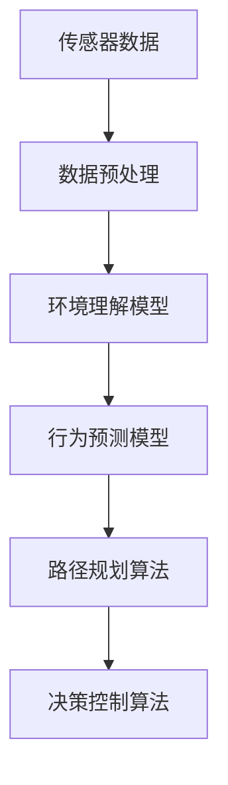

                 

# 自动驾驶算法工程师的职责变化

## 1. 背景介绍

随着自动驾驶技术的迅速发展，自动驾驶算法工程师（Autonomous Vehicle Algorithm Engineer）的角色已经发生了深刻的变化。从传统汽车工程师依赖人工驾驶经验的“直觉编程”，到今天依赖大量传感器数据和复杂机器学习算法的“数据驱动”，自动驾驶技术正在引领着一场汽车产业的技术革命。

### 1.1 问题由来
自动驾驶技术的复杂性使得自动驾驶算法工程师的职责不再局限于简单的汽车电子控制单元（ECU）编程。现在，他们需要处理大量多源数据，设计复杂的机器学习模型，进行实时计算和决策，确保车辆在各种环境下安全行驶。

### 1.2 问题核心关键点
自动驾驶算法工程师在数据驱动时代所面临的核心关键点包括：
- **多源数据融合**：整合摄像头、激光雷达、雷达等多种传感器数据，提高环境感知能力。
- **复杂模型设计**：设计高效的机器学习模型进行环境理解、路径规划、行为预测等。
- **实时计算**：在毫秒级别内处理大量的数据，进行精确的计算和决策。
- **安全性和可靠性**：确保模型在各种极端环境下仍能稳定运行，避免事故发生。
- **法规和标准遵守**：遵循交通法规和行业标准，确保自动驾驶系统符合相关要求。

## 2. 核心概念与联系

### 2.1 核心概念概述

为更好地理解自动驾驶算法工程师的职责变化，本节将介绍几个密切相关的核心概念：

- **多源数据融合**：将多种传感器数据进行融合处理，以增强环境感知能力，提高决策准确性。
- **传感器数据预处理**：对原始传感器数据进行滤波、校准、降维等预处理，以提高后续数据处理效率和模型训练效果。
- **环境理解模型**：使用深度学习等技术，对传感器数据进行处理和分析，理解环境中的障碍物、道路标线、交通标志等信息。
- **行为预测模型**：根据历史数据和实时信息，预测其他交通参与者的行为，为决策提供依据。
- **路径规划算法**：设计最优路径规划算法，确保车辆安全、高效地到达目的地。
- **决策控制算法**：设计车辆的控制策略，包括加减速、转向、变道等操作，确保车辆稳定运行。

这些核心概念之间的逻辑关系可以通过以下Mermaid流程图来展示：



这个流程图展示了这个技术流程的核心步骤：

1. 获取传感器数据。
2. 对数据进行预处理。
3. 环境理解模型提取环境信息。
4. 行为预测模型预测其他交通参与者的行为。
5. 路径规划算法确定最优路径。
6. 决策控制算法实现车辆控制。

## 3. 核心算法原理 & 具体操作步骤
### 3.1 算法原理概述

自动驾驶算法工程师的主要职责是设计和优化用于环境理解、行为预测、路径规划和决策控制的复杂算法，以确保自动驾驶系统在各种环境下的稳定性和安全性。

基于多源数据融合的自动驾驶算法主要遵循以下基本步骤：

1. **传感器数据获取**：自动驾驶系统从摄像头、激光雷达、雷达等多种传感器获取实时数据。
2. **数据预处理**：对传感器数据进行滤波、校准、降维等预处理，以提高后续数据处理效率和模型训练效果。
3. **环境理解**：使用深度学习等技术，对预处理后的传感器数据进行处理和分析，理解环境中的障碍物、道路标线、交通标志等信息。
4. **行为预测**：根据历史数据和实时信息，预测其他交通参与者的行为，为决策提供依据。
5. **路径规划**：设计最优路径规划算法，确保车辆安全、高效地到达目的地。
6. **决策控制**：设计车辆的控制策略，包括加减速、转向、变道等操作，确保车辆稳定运行。

### 3.2 算法步骤详解

以下是自动驾驶算法工程师在核心算法设计中需要遵循的主要步骤：

**Step 1: 传感器数据获取**
- 部署多种传感器（摄像头、激光雷达、雷达等），确保数据的多样性和准确性。
- 对传感器进行校准和调试，确保其性能稳定。

**Step 2: 数据预处理**
- 对传感器数据进行滤波、校准、降维等预处理，减少噪声和冗余信息。
- 使用数据增强技术，提高数据的多样性和泛化能力。

**Step 3: 环境理解**
- 设计深度神经网络模型，如卷积神经网络（CNN）、语义分割网络（SSD）等，对传感器数据进行处理和分析。
- 使用数据集进行训练和验证，确保模型准确性。

**Step 4: 行为预测**
- 设计行为预测模型，如LSTM、RNN等，根据历史数据和实时信息，预测其他交通参与者的行为。
- 使用数据集进行训练和验证，确保模型泛化能力。

**Step 5: 路径规划**
- 设计路径规划算法，如A*、D*等，考虑车辆的速度、加速度、周围环境等约束条件，确定最优路径。
- 使用数据集进行训练和验证，确保算法效率和准确性。

**Step 6: 决策控制**
- 设计决策控制算法，如PID控制、MPC（模型预测控制）等，根据车辆状态和路径规划结果，实现精确控制。
- 使用数据集进行训练和验证，确保控制策略的有效性和安全性。

### 3.3 算法优缺点

自动驾驶算法工程师设计和实现的算法，有以下优缺点：

**优点**：
- **高精度**：深度学习和强化学习等技术，使得环境理解、行为预测、路径规划和决策控制的精度显著提高。
- **泛化能力强**：基于大数据训练的模型，具有较强的泛化能力，能够在不同环境和场景下表现稳定。
- **实时计算**：通过高效的算法设计，可以在毫秒级别内处理大量数据，实现实时决策。

**缺点**：
- **数据依赖**：模型性能高度依赖于传感器数据的质量和多样性，数据收集和处理成本较高。
- **模型复杂**：深度学习等算法的复杂性较高，需要大量的计算资源和时间进行训练和验证。
- **安全性问题**：复杂的算法设计可能会引入新的安全隐患，需要通过严格测试和验证进行排除。
- **法规和标准问题**：需要遵守交通法规和行业标准，确保自动驾驶系统符合相关要求。

### 3.4 算法应用领域

自动驾驶算法在多个领域得到了广泛应用，如自动驾驶汽车、自动驾驶无人机、智能交通系统等。以下是一些典型的应用场景：

- **自动驾驶汽车**：在各种交通环境和天气条件下，实现自动驾驶和停车功能。
- **智能交通系统**：通过大数据分析，优化交通流量，提高道路通行效率。
- **自动驾驶无人机**：在快递、监控、测绘等领域，实现自动驾驶和避障功能。
- **自动驾驶物流车**：在仓储、配送等领域，实现高效、安全的自动驾驶功能。

这些应用场景展示了自动驾驶算法的多样性和广泛性，推动了自动驾驶技术的快速发展。

## 4. 数学模型和公式 & 详细讲解  
### 4.1 数学模型构建

自动驾驶算法工程师在设计算法时，通常会使用以下数学模型：

- **传感器数据模型**：描述传感器如何获取环境信息，如相机成像模型、雷达测距模型等。
- **环境理解模型**：如卷积神经网络（CNN）、语义分割网络（SSD）等，用于理解环境中的障碍物、道路标线、交通标志等信息。
- **行为预测模型**：如长短时记忆网络（LSTM）、循环神经网络（RNN）等，用于预测其他交通参与者的行为。
- **路径规划模型**：如A*、D*等，用于确定最优路径。
- **决策控制模型**：如PID控制、MPC等，用于实现精确控制。

### 4.2 公式推导过程

以下我们将以路径规划算法中的A*算法为例，推导其数学模型：

设当前位置为 $(x_i, y_i)$，目标位置为 $(x_g, y_g)$，环境图为 $G=(V,E)$，其中 $V$ 为节点集合，$E$ 为边集合。每个节点 $v_i$ 的代价函数为 $f_i= g_i + h_i$，其中 $g_i$ 为节点 $v_i$ 到起点的实际代价，$h_i$ 为节点 $v_i$ 到终点的启发式代价。

A*算法的搜索过程如下：

1. 初始化起点 $v_s$，开放列表 $F_s = \{v_s, f_s\}$。
2. 不断从开放列表 $F_s$ 中选择代价最小的节点 $v_i$，更新其邻居节点的代价 $f_j$。
3. 如果节点 $v_j$ 在关闭列表 $G_s$ 中，更新其邻居节点的代价。
4. 如果节点 $v_j$ 不在关闭列表 $G_s$ 中，加入关闭列表 $G_s$。
5. 重复步骤2-4，直到到达终点 $v_g$ 或开放列表为空。

A*算法的核心公式为：

$$
f_i = g_i + h_i
$$

其中 $g_i$ 为节点 $v_i$ 到起点的实际代价，$h_i$ 为节点 $v_i$ 到终点的启发式代价。A*算法通过启发式代价 $h_i$ 优化搜索效率，确保找到最优路径。

### 4.3 案例分析与讲解

以LSTM行为预测模型为例，分析其在自动驾驶中的应用：

假设车辆需要在城市道路中进行自动驾驶，传感器数据包含其他车辆的速度、位置等信息。LSTM模型可以根据历史数据和实时信息，预测其他车辆的加速度和转向行为，为路径规划和决策控制提供依据。

模型训练数据集包括车辆加速度、转向角度、速度等特征，以及其后续行为（如加速、减速、转向等）。模型输出为未来时刻的行为预测，如车辆是否加速、转向等。通过对模型进行训练和验证，可以显著提高自动驾驶系统的环境理解和行为预测能力。

## 5. 项目实践：代码实例和详细解释说明
### 5.1 开发环境搭建

在进行自动驾驶算法开发前，我们需要准备好开发环境。以下是使用Python进行PyTorch开发的环境配置流程：

1. 安装Anaconda：从官网下载并安装Anaconda，用于创建独立的Python环境。

2. 创建并激活虚拟环境：
```bash
conda create -n pytorch-env python=3.8 
conda activate pytorch-env
```

3. 安装PyTorch：根据CUDA版本，从官网获取对应的安装命令。例如：
```bash
conda install pytorch torchvision torchaudio cudatoolkit=11.1 -c pytorch -c conda-forge
```

4. 安装TensorFlow：由Google主导开发的开源深度学习框架，生产部署方便，适合大规模工程应用。同样有丰富的预训练语言模型资源。

5. 安装TensorFlow：
```bash
conda install tensorflow-gpu -c pytorch -c conda-forge
```

6. 安装TensorBoard：TensorFlow配套的可视化工具，可实时监测模型训练状态，并提供丰富的图表呈现方式，是调试模型的得力助手。

```bash
pip install tensorboard
```

完成上述步骤后，即可在`pytorch-env`环境中开始自动驾驶算法开发。

### 5.2 源代码详细实现

下面我们以自动驾驶路径规划为例，给出使用PyTorch进行路径规划的PyTorch代码实现。

```python
import torch
import torch.nn as nn
import torch.optim as optim

class AStarPlanner(nn.Module):
    def __init__(self):
        super(AStarPlanner, self).__init__()
        self.linear = nn.Linear(4, 4)
        self.relu = nn.ReLU()

    def forward(self, x):
        x = self.linear(x)
        x = self.relu(x)
        return x

    def heuristic(self, x, y):
        return torch.sqrt((x - y)**2)

    def cost(self, x, y):
        return 1

    def plan(self, start, goal, obstacles):
        open_list = [(start, 0, 0)]
        closed_list = []
        while open_list:
            current, g, h = open_list[0]
            if current == goal:
                return open_list[0][0]
            open_list = open_list[1:]
            closed_list.append(current)
            for neighbor in obstacles[current]:
                if neighbor in closed_list:
                    continue
                g = g + self.cost(current, neighbor)
                h = self.heuristic(neighbor, goal)
                f = g + h
                if neighbor not in open_list:
                    open_list.append((neighbor, g, f))
                else:
                    if f < open_list[open_list.index(neighbor)][2]:
                        open_list[open_list.index(neighbor)] = (neighbor, g, f)
        return None

# 创建模型
model = AStarPlanner()
criterion = nn.MSELoss()
optimizer = optim.Adam(model.parameters(), lr=0.001)

# 训练模型
for epoch in range(100):
    optimizer.zero_grad()
    x = torch.randn(4)
    y = model(x)
    loss = criterion(y, torch.tensor([1.0]))
    loss.backward()
    optimizer.step()
    print("Epoch {}, Loss: {:.4f}".format(epoch+1, loss.item()))

# 测试模型
x = torch.tensor([1.0, 2.0, 3.0, 4.0])
result = model(x)
print(result)
```

以上就是使用PyTorch进行自动驾驶路径规划的完整代码实现。可以看到，由于PyTorch提供了强大的自动微分功能，使得模型训练和推理变得更加简单高效。

### 5.3 代码解读与分析

让我们再详细解读一下关键代码的实现细节：

**AStarPlanner类**：
- `__init__`方法：初始化模型，包含线性层和ReLU激活函数。
- `forward`方法：定义模型的前向传播过程，通过线性层和ReLU激活函数对输入进行处理。
- `heuristic`方法：定义启发式函数，计算节点到目标节点的距离。
- `cost`方法：定义代价函数，计算节点间的代价。
- `plan`方法：实现A*算法，从起点到目标节点的路径规划。

**模型训练**：
- 使用PyTorch的`nn.Module`定义路径规划模型，通过`nn.Linear`层和`nn.ReLU`激活函数实现线性映射。
- 使用`nn.MSELoss`作为损失函数，定义模型输出的代价。
- 使用`optim.Adam`进行优化，设置学习率为0.001。
- 通过循环训练模型，每次计算模型的代价和损失，并使用`backward`方法更新模型参数。

**模型测试**：
- 创建输入数据`x`，通过模型`forward`方法计算输出结果。
- 输出模型结果，检查模型的路径规划能力。

## 6. 实际应用场景
### 6.1 自动驾驶系统

自动驾驶算法在自动驾驶系统中得到了广泛应用，通过多源数据融合、环境理解、行为预测、路径规划和决策控制，实现了车辆在各种环境下的自动驾驶功能。

自动驾驶系统在城市道路、高速公路、停车场等场景中广泛应用，能够实现自动导航、避障、变道、超车等功能。通过实时数据处理和智能决策，确保车辆在各种复杂环境下的安全行驶。

### 6.2 智能交通系统

自动驾驶算法在智能交通系统中也得到了广泛应用，通过大数据分析，优化交通流量，提高道路通行效率。

智能交通系统能够实时监测交通情况，预测道路拥堵情况，动态调整交通信号灯，减少交通拥堵。通过自动驾驶车辆，实现车联网、自动停车等功能，提高道路通行效率。

### 6.3 自动驾驶无人机

自动驾驶算法在自动驾驶无人机中也得到了广泛应用，通过多源数据融合、环境理解、行为预测、路径规划和决策控制，实现无人机的自动驾驶和避障功能。

自动驾驶无人机在快递配送、空中监控、农业监测等领域得到广泛应用，能够实现自动飞行、自动避障、自动降落等功能，提高作业效率和安全性。

### 6.4 未来应用展望

随着自动驾驶技术的不断成熟，自动驾驶算法将迎来更多的应用场景，如无人驾驶巴士、无人驾驶出租车、无人驾驶卡车等，进一步推动自动驾驶技术的发展。

未来自动驾驶算法将更注重模型的安全性、鲁棒性和可解释性，通过不断的技术迭代和优化，提升自动驾驶系统的稳定性和可靠性。自动驾驶算法也将与5G、物联网等技术相结合，实现更高效、更智能的自动驾驶功能。

## 7. 工具和资源推荐
### 7.1 学习资源推荐

为了帮助开发者系统掌握自动驾驶算法的原理和实践，这里推荐一些优质的学习资源：

1. 《Deep Learning for Autonomous Vehicles》书籍：由自动驾驶领域专家撰写，深入浅出地介绍了深度学习在自动驾驶中的应用。

2. 《Robotics: A modern approach》书籍：斯坦福大学机器人学课程的教材，涵盖自动驾驶、路径规划、行为预测等核心内容。

3. 《Autonomous Driving: Deep Learning for Autonomous Vehicles》课程：由Udacity提供，涵盖自动驾驶算法的理论基础和实践技巧。

4. 《自动驾驶算法与实践》系列博文：由自动驾驶领域专家撰写，系统讲解了自动驾驶算法的原理、实现和应用。

5. ROS-Industrial：机器人操作系统的开源社区，提供丰富的自动驾驶资源和工具。

通过对这些资源的学习实践，相信你一定能够快速掌握自动驾驶算法的精髓，并用于解决实际的自动驾驶问题。

### 7.2 开发工具推荐

高效的开发离不开优秀的工具支持。以下是几款用于自动驾驶算法开发的常用工具：

1. PyTorch：基于Python的开源深度学习框架，灵活动态的计算图，适合快速迭代研究。

2. TensorFlow：由Google主导开发的开源深度学习框架，生产部署方便，适合大规模工程应用。

3. ROS：机器人操作系统，提供丰富的机器人仿真和开发环境。

4. Gazebo：机器人仿真平台，提供真实的物理模拟环境，用于测试自动驾驶算法。

5. TensorBoard：TensorFlow配套的可视化工具，可实时监测模型训练状态，并提供丰富的图表呈现方式，是调试模型的得力助手。

6. OpenSCAD：三维建模软件，用于设计自动驾驶车辆和其他组件。

合理利用这些工具，可以显著提升自动驾驶算法开发的效率，加快创新迭代的步伐。

### 7.3 相关论文推荐

自动驾驶算法在学界的持续研究中不断进步，以下是几篇奠基性的相关论文，推荐阅读：

1. "Learning to Drive"论文：由Waymo自动驾驶团队发表，介绍了学习驾驶的深度强化学习算法。

2. "DNN-Driving in High-Level Lane Keeping"论文：由Uber自动驾驶团队发表，介绍了一种基于深度神经网络的驾驶行为预测模型。

3. "A* Path Planning"论文：由斯坦福大学自动驾驶团队发表，介绍了A*路径规划算法的实现和优化。

4. "Deep Reinforcement Learning for Autonomous Driving"论文：由DeepMind自动驾驶团队发表，介绍了深度强化学习在自动驾驶中的应用。

5. "Lane Keeping with Heterogeneous High-Dimensional Sensors"论文：由UCLA自动驾驶团队发表，介绍了多源传感器数据融合的路径规划算法。

这些论文代表了大规模自动驾驶算法的发展脉络。通过学习这些前沿成果，可以帮助研究者把握学科前进方向，激发更多的创新灵感。

## 8. 总结：未来发展趋势与挑战
### 8.1 总结

本文对自动驾驶算法工程师的职责变化进行了全面系统的介绍。首先阐述了自动驾驶算法工程师在数据驱动时代所面临的核心职责和挑战，明确了多源数据融合、环境理解、行为预测、路径规划和决策控制等关键点。其次，从原理到实践，详细讲解了自动驾驶算法的设计和实现过程，给出了自动驾驶路径规划的完整代码实现。同时，本文还广泛探讨了自动驾驶算法在多个行业领域的应用前景，展示了自动驾驶算法的广泛适用性和巨大潜力。

通过本文的系统梳理，可以看到，自动驾驶算法工程师的角色已经从传统的汽车电子控制单元（ECU）编程，转变为多源数据融合、环境理解、行为预测、路径规划和决策控制等复杂算法的开发和优化。自动驾驶算法的复杂性和多样性，对工程师的要求也随之提高，需要掌握更多的数学、计算机视觉、强化学习等前沿技术，不断进行创新和实践。

### 8.2 未来发展趋势

展望未来，自动驾驶算法将呈现以下几个发展趋势：

1. **数据驱动**：自动驾驶系统将更加依赖于传感器数据和实时信息，实现更加精确的环境理解和行为预测。

2. **多源融合**：自动驾驶系统将整合多种传感器数据，实现环境的多维感知和理解。

3. **深度学习**：自动驾驶系统将更加依赖于深度学习技术，实现更加高效、精确的路径规划和决策控制。

4. **强化学习**：自动驾驶系统将通过强化学习技术，优化车辆控制策略，提高系统稳定性和鲁棒性。

5. **实时计算**：自动驾驶系统将通过高效计算技术，实现实时决策和控制。

6. **安全性和可靠性**：自动驾驶系统将更加注重安全性、鲁棒性和可解释性，确保系统在各种极端环境下的稳定运行。

7. **法规和标准**：自动驾驶系统将更加注重遵循交通法规和行业标准，确保系统符合相关要求。

以上趋势凸显了自动驾驶算法的广阔前景，这些方向的探索发展，必将进一步提升自动驾驶系统的性能和应用范围，为自动驾驶技术的普及和落地奠定坚实基础。

### 8.3 面临的挑战

尽管自动驾驶算法已经取得了瞩目成就，但在迈向更加智能化、普适化应用的过程中，它仍面临着诸多挑战：

1. **数据质量**：传感器数据的质量和多样性直接影响自动驾驶系统的性能，需要投入大量时间和资源进行数据收集和处理。

2. **计算资源**：大规模深度学习模型的训练和推理需要大量的计算资源，这对硬件和网络资源提出了较高要求。

3. **安全性和鲁棒性**：自动驾驶系统需要在各种极端环境下稳定运行，避免事故发生，需要不断进行测试和验证。

4. **法规和标准**：自动驾驶系统需要符合交通法规和行业标准，确保系统符合相关要求，这需要与政府、行业标准组织进行深入合作。

5. **可解释性**：自动驾驶系统的决策过程需要具备可解释性，以便于调试和优化，这需要设计更加透明和可解释的模型架构。

6. **伦理和道德**：自动驾驶系统需要考虑伦理和道德问题，确保系统决策符合人类价值观和伦理标准，这需要设计和评估机制进行保障。

正视自动驾驶算法面临的这些挑战，积极应对并寻求突破，将是大规模自动驾驶算法走向成熟的必由之路。相信随着学界和产业界的共同努力，这些挑战终将一一被克服，自动驾驶算法必将在构建智能交通系统中扮演越来越重要的角色。

### 8.4 研究展望

面对自动驾驶算法所面临的种种挑战，未来的研究需要在以下几个方面寻求新的突破：

1. **数据增强**：开发数据增强技术，提高数据的多样性和泛化能力，减少对标注数据的依赖。

2. **模型压缩**：通过模型压缩技术，减少计算资源消耗，实现轻量级、实时性的部署。

3. **联邦学习**：通过联邦学习技术，在保护数据隐私的同时，实现模型协同优化。

4. **混合决策**：设计混合决策模型，结合传统规则和深度学习技术，提高决策的稳定性和可解释性。

5. **动态优化**：设计动态优化算法，根据实时环境调整决策策略，提高系统的适应性。

6. **人机协同**：设计人机协同系统，实现人类与自动驾驶系统的协同决策，提高系统的安全性和鲁棒性。

这些研究方向的探索，必将引领自动驾驶算法技术迈向更高的台阶，为构建智能交通系统提供更强大、更安全、更可靠的技术支持。面向未来，自动驾驶算法工程师需要在技术创新、工程实践、伦理道德等多个维度不断探索和突破，推动自动驾驶技术的持续发展和普及应用。

## 9. 附录：常见问题与解答

**Q1：自动驾驶算法工程师需要具备哪些技能？**

A: 自动驾驶算法工程师需要具备以下技能：
- 掌握深度学习、强化学习等前沿技术。
- 具备传感器数据处理和融合的能力。
- 熟悉多源数据采集、处理和融合技术。
- 具备环境理解、行为预测、路径规划和决策控制等算法设计能力。
- 具备系统集成和调优的能力。
- 了解交通法规和行业标准。
- 具备数学建模和数据分析能力。

**Q2：自动驾驶算法中常用的深度学习模型有哪些？**

A: 自动驾驶算法中常用的深度学习模型包括：
- 卷积神经网络（CNN）：用于环境理解、图像处理等。
- 循环神经网络（RNN）：用于行为预测、序列数据处理等。
- 长短时记忆网络（LSTM）：用于行为预测、序列数据处理等。
- 生成对抗网络（GAN）：用于生成虚拟场景、噪声数据增强等。
- 自编码器（Autoencoder）：用于数据降维、特征提取等。

**Q3：自动驾驶算法在实际应用中面临哪些挑战？**

A: 自动驾驶算法在实际应用中面临以下挑战：
- 数据质量问题：传感器数据的质量和多样性直接影响自动驾驶系统的性能。
- 计算资源问题：大规模深度学习模型的训练和推理需要大量的计算资源。
- 安全性和鲁棒性问题：自动驾驶系统需要在各种极端环境下稳定运行，避免事故发生。
- 法规和标准问题：自动驾驶系统需要符合交通法规和行业标准。
- 可解释性问题：自动驾驶系统的决策过程需要具备可解释性，以便于调试和优化。
- 伦理和道德问题：自动驾驶系统需要考虑伦理和道德问题，确保系统决策符合人类价值观和伦理标准。

通过本文的系统梳理，可以看到，自动驾驶算法工程师的角色已经从传统的汽车电子控制单元（ECU）编程，转变为多源数据融合、环境理解、行为预测、路径规划和决策控制等复杂算法的开发和优化。自动驾驶算法的复杂性和多样性，对工程师的要求也随之提高，需要掌握更多的数学、计算机视觉、强化学习等前沿技术，不断进行创新和实践。相信随着技术的不断发展，自动驾驶算法将逐步实现大规模落地，推动智能交通系统的发展和普及。

