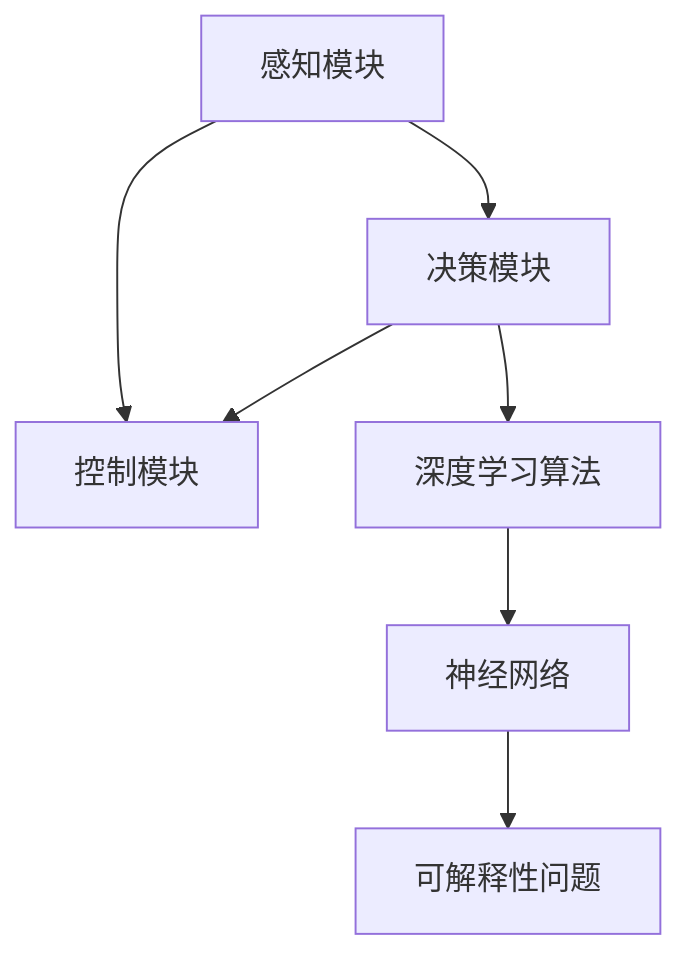

                 

# 自动驾驶算法的可解释性问题

## 1. 背景介绍

自动驾驶技术近年来取得了显著进展，但伴随着算法的复杂性提升，算法的可解释性问题也日益凸显。传统上，许多决策和控制任务依赖于基于规则的逻辑，易于理解和解释。然而，现代深度学习算法，如卷积神经网络（CNN）、循环神经网络（RNN）和深度强化学习（DRL），由于其黑盒特性，其内部运作机制难以解释，导致决策过程的透明度降低，增加了用户和监管机构对其信赖度的疑虑。

自动驾驶车辆的安全性和可靠性是其核心需求，而算法的可解释性（Explainability）成为了其中的关键点。特别是对于安全关键性任务，其结果必须可追溯和可验证，以确保在出现异常情况或故障时，能够迅速定位问题原因并及时修正。同时，可解释性也有助于提高用户对自动驾驶技术的信任度，促进法规合规和技术接受度的提升。

## 2. 核心概念与联系

### 2.1 核心概念概述

为更好地理解自动驾驶算法中的可解释性问题，本节将介绍几个核心概念：

- 深度学习(Deep Learning)：一种基于多层神经网络的学习方法，通过数据驱动的方式自动学习数据的特征表示。
- 可解释性(Explainability)：指算法或模型决策过程的透明度和可理解性，即能够清晰地解释其输入、处理和输出的过程。
- 自动驾驶(Autonomous Driving)：一种使车辆能够自主导航和执行驾驶任务的技术，涉及感知、决策和控制三大核心模块。
- 感知模块(Perception Module)：负责获取和处理车辆周围环境的实时数据，包括摄像头、激光雷达、雷达等传感器的数据。
- 决策模块(Decision Module)：基于感知数据，通过深度学习算法生成驾驶策略。
- 控制模块(Control Module)：将决策模块输出的控制指令转化为车辆的具体行为，如加速、转向、刹车等。

这些核心概念之间的逻辑关系可以通过以下Mermaid流程图来展示：



这个流程图展示了这个模型的工作原理和关键组件：

1. 车辆通过传感器获取环境数据。
2. 感知模块对这些数据进行处理和分析。
3. 决策模块基于感知数据进行驾驶策略的生成。
4. 控制模块执行决策策略，调整车辆行为。
5. 深度学习算法处理感知和决策数据。
6. 深度学习算法的黑盒特性带来了可解释性问题。

## 3. 核心算法原理 & 具体操作步骤

### 3.1 算法原理概述

自动驾驶中的深度学习算法，如卷积神经网络（CNN）、循环神经网络（RNN）和深度强化学习（DRL），由于其复杂性和高阶非线性特性，其内部运作机制难以直观解释。这些算法的可解释性问题主要集中在以下几个方面：

- **输入依赖性**：算法的输出高度依赖于输入数据的特征，难以理解和解释输入对输出的具体影响。
- **输出非线性**：深度学习模型通常具有非线性特性，其内部复杂的非线性映射关系使得难以追溯输入与输出之间的直接联系。
- **模型复杂性**：深度学习模型的参数数量庞大，模型的内部结构和参数配置难以直观理解。
- **动态决策过程**：自动驾驶中的决策过程需要实时响应不断变化的环境，模型的动态行为难以解释。

基于上述问题，自动驾驶中的可解释性问题可以通过以下方式来解决：

1. **透明感知模块**：通过使用可视化技术和传感器的多模态数据融合，提高感知模块的透明度，使其工作原理可被理解。
2. **可解释性算法**：采用可解释性算法，如决策树、LIME、SHAP等，将深度学习模型的决策过程转化为易于理解的形式。
3. **模型简化**：使用模型简化技术，如模型压缩、参数剪枝、特征重要性评估等，减少模型复杂度，提高可解释性。
4. **后验分析**：在模型训练和测试阶段，进行后验分析，评估模型对输入数据的依赖和预测结果的准确性。
5. **交互式设计**：设计交互式界面，允许用户与模型进行交互，直观地观察模型行为和决策过程。

### 3.2 算法步骤详解

基于可解释性的算法步骤可以概括为以下几步：

**Step 1: 选择可解释性算法**
- 确定适合的可解释性算法，如LIME、SHAP、GiniCoefficient等。
- 根据具体任务选择合适的特征重要性评估方法，如 permutation importance、SHAP value、LIME等。

**Step 2: 数据预处理**
- 收集和准备自动驾驶相关的数据集，包括车辆传感器数据、地图数据、道路标志等。
- 对数据进行预处理，如缺失值填补、标准化、归一化等。

**Step 3: 特征工程**
- 提取有效的特征，如车辆位置、速度、传感器读数等。
- 使用PCA、LDA等降维技术，减少特征数量，提升模型效率。

**Step 4: 模型训练与评估**
- 训练深度学习模型，如CNN、RNN、DRL等。
- 使用可解释性算法计算特征的重要性，可视化输入数据对模型输出的影响。

**Step 5: 模型解释与验证**
- 将特征重要性可视化，通过图表展示模型的决策过程。
- 在实际测试环境中验证解释的有效性，确保解释结果的准确性和实用性。

**Step 6: 交互式界面设计**
- 设计交互式界面，允许用户查看模型输出、输入和决策过程。
- 提供模型解释结果的交互式展示，使用户能够直观理解模型的行为。

### 3.3 算法优缺点

基于可解释性的自动驾驶算法具有以下优点：

- **增强信任**：通过提供直观的决策过程解释，增强用户和监管机构对自动驾驶技术的信任。
- **便于调试和维护**：有助于开发人员和工程师更好地理解模型行为，提高系统可靠性和稳定性。
- **促进法规合规**：提供透明性和可验证性，满足法规对算法透明度的要求，促进法规合规。

但这些算法也存在一些缺点：

- **计算复杂度增加**：可解释性算法通常需要额外的计算资源和时间，增加模型的计算负担。
- **模型精度下降**：为了简化模型结构，可能牺牲一定的模型精度。
- **解释结果可靠性**：解释结果可能受到数据质量、模型参数和算法选择的影响，需要仔细验证。
- **用户理解门槛**：解释结果需要用户具备一定的背景知识，否则可能难以理解。

### 3.4 算法应用领域

基于可解释性的自动驾驶算法已经应用于多个领域，包括但不限于：

- 道路交通监管：通过可视化车辆感知和决策过程，辅助监管部门了解车辆行为。
- 事故分析：对交通事故进行分析，了解车辆在事故发生前的感知和决策情况。
- 用户体验优化：通过解释用户界面操作结果，优化用户体验和系统设计。
- 模型调试与优化：通过解释模型行为，定位问题并进行调试优化。
- 法规合规支持：提供透明的决策过程，满足法规对算法透明度的要求。

## 4. 数学模型和公式 & 详细讲解

### 4.1 数学模型构建

可解释性算法中的数学模型通常用于计算特征的重要性，通过将深度学习模型的输出结果与特征分布进行关联，来解释模型的决策过程。这里以SHAP（SHapley Additive exPlanations）为例，构建数学模型。

记深度学习模型为 $f(x)$，其中 $x$ 为输入数据。设 $f(x)$ 的输出为 $y$，则 $f(x)$ 对特征 $i$ 的 SHAP值 $\phi_i(x)$ 定义为：

$$
\phi_i(x) = \sum_{S \subseteq [1,...,n]} \frac{f(x_S)}{2^{|S|}} - \frac{f(x)}{2^n}
$$

其中 $S$ 是特征 $i$ 所在的所有特征集合的子集，$x_S$ 是特征 $S$ 对应的数据样本，$|S|$ 是特征集合 $S$ 的元素数量。

### 4.2 公式推导过程

SHAP值的推导过程可以分为以下几步：

1. **基线模型**：首先定义一个基线模型 $f_0(x)$，如常数函数。
2. **模型差分**：计算深度学习模型 $f(x)$ 与基线模型 $f_0(x)$ 的差分，即 $f(x) - f_0(x)$。
3. **SHAP值计算**：通过迭代计算所有特征的贡献度，即计算所有可能的特征子集的 SHAP值和。
4. **解释与可视化**：将 SHAP值转化为可视化图表，展示输入特征对模型输出的贡献。

以LIME（Local Interpretable Model-agnostic Explanations）为例，其公式推导过程类似，但更加注重局部可解释性，通过构建局部线性模型来解释决策过程。

### 4.3 案例分析与讲解

以下是一个基于SHAP值的可解释性案例：

假设有如下的输入数据 $x$ 和输出 $y$：

$$
x = [\text{speed}=60, \text{distance}=50, \text{time}=5], \quad y = \text{stop}
$$

其中 $speed$、$distance$ 和 $time$ 分别为速度、距离和时间。

设深度学习模型为 $f(x)$，其对 $speed$ 的 SHAP值为 $\phi_{speed}(x) = 0.2$，对 $distance$ 的 SHAP值为 $\phi_{distance}(x) = -0.1$，对 $time$ 的 SHAP值为 $\phi_{time}(x) = 0.3$。

这些SHAP值说明：

- $speed$ 对模型输出的贡献度为0.2，意味着速度对停止决策有正面影响。
- $distance$ 对模型输出的贡献度为-0.1，意味着距离对停止决策有负面影响。
- $time$ 对模型输出的贡献度为0.3，意味着时间对停止决策有正面影响。

通过SHAP值，我们可以直观地理解输入特征对输出决策的贡献，从而提升模型的可解释性。

## 5. 项目实践：代码实例和详细解释说明

### 5.1 开发环境搭建

在进行自动驾驶算法的可解释性实践前，我们需要准备好开发环境。以下是使用Python进行Keras和TensorFlow开发的环境配置流程：

1. 安装Anaconda：从官网下载并安装Anaconda，用于创建独立的Python环境。

2. 创建并激活虚拟环境：
```bash
conda create -n driving-env python=3.8 
conda activate driving-env
```

3. 安装Keras：
```bash
pip install keras
```

4. 安装TensorFlow：根据CUDA版本，从官网获取对应的安装命令。例如：
```bash
conda install tensorflow -c tensorflow -c conda-forge
```

5. 安装相关库：
```bash
pip install numpy pandas sklearn matplotlib seaborn
```

完成上述步骤后，即可在`driving-env`环境中开始可解释性实践。

### 5.2 源代码详细实现

下面我们以LIME和SHAP为例，给出使用Keras和TensorFlow进行模型解释的PyTorch代码实现。

首先，定义深度学习模型：

```python
from keras.models import Sequential
from keras.layers import Dense, Dropout

model = Sequential([
    Dense(64, activation='relu', input_dim=3),
    Dropout(0.5),
    Dense(1, activation='sigmoid')
])

model.compile(optimizer='adam', loss='binary_crossentropy', metrics=['accuracy'])
```

接着，准备数据集并进行预处理：

```python
import numpy as np
from sklearn.model_selection import train_test_split

# 生成样本数据
X = np.random.rand(100, 3)
y = np.random.randint(0, 2, 100)

# 数据分割
X_train, X_test, y_train, y_test = train_test_split(X, y, test_size=0.2, random_state=42)

# 标准化数据
from sklearn.preprocessing import StandardScaler
scaler = StandardScaler()
X_train = scaler.fit_transform(X_train)
X_test = scaler.transform(X_test)
```

然后，使用LIME进行可解释性计算：

```python
from lime.lime_tabular import LimeTabularExplainer
from sklearn.linear_model import LogisticRegression

# 基线模型
baseline = LogisticRegression(solver='liblinear', random_state=42)
baseline.fit(X_train, y_train)

# 解释器
explainer = LimeTabularExplainer(X_train, categorical_features=['label'], verbose=True)

# 计算SHAP值
import lime
from lime.lime_tabular import SHAPRegressor

regressor = SHAPRegressor()
regressor.fit(X_train, y_train)
shap_values = regressor.shap_values(X_train)
```

最后，可视化解释结果：

```python
import matplotlib.pyplot as plt
from lime.lime_tabular import Plot

# 可视化LIME结果
exp = explainer.explain_instance(X_train[0], model.predict_proba)
plt.figure(figsize=(10, 10))
Plot().add_descriptions(exp.descriptions).add_values(exp.values).show()

# 可视化SHAP结果
import shap
shap_values[0].plot()
plt.show()
```

以上就是使用PyTorch对LIME和SHAP进行模型解释的完整代码实现。可以看到，通过Keras和TensorFlow，我们能够快速实现深度学习模型及其解释器，生成直观的可视化结果。

### 5.3 代码解读与分析

让我们再详细解读一下关键代码的实现细节：

**LIME解释器**：
- `LimeTabularExplainer`：定义LIME解释器，计算模型对输入数据的局部线性近似。
- `explain_instance`：对单个输入数据进行解释，生成LIME结果。

**SHAP解释器**：
- `SHAPRegressor`：定义SHAP解释器，计算模型对输入数据的SHAP值。
- `shap_values`：计算模型对输入数据的SHAP值，并可视化结果。

**可视化过程**：
- 使用`matplotlib`库生成可视化图表。
- 使用`LimeTabularExplainer`生成LIME结果，并可视化。
- 使用`SHAPRegressor`生成SHAP值，并可视化。

**注意**：在实际应用中，为了提升解释结果的可信度，需要仔细选择基线模型和解释器参数。同时，为了保证解释结果的可靠性，需要进行多次实验和验证，确保解释结果的一致性和准确性。

## 6. 实际应用场景

### 6.1 智能交通管理

在智能交通管理中，基于可解释性的自动驾驶算法可以用于提升交通管理的智能化水平。通过可视化感知和决策过程，可以实时监控和管理交通流量，优化信号灯控制，降低交通事故率。

具体而言，可以将可解释性算法集成到交通管理系统，实时分析车辆的行为和决策过程，根据实时数据调整信号灯时长和方向，确保交通流畅和安全。这种做法不仅提高了交通管理效率，还增加了系统的透明性和可解释性。

### 6.2 事故原因分析

在交通事故分析中，基于可解释性的自动驾驶算法可以用于分析事故原因。通过可视化事故前的感知和决策过程，可以追溯事故发生前车辆的决策依据，帮助分析事故责任，指导交通安全教育。

例如，如果事故发生在车辆启动自动驾驶功能后，可以通过可视化其感知数据和决策过程，判断是否存在感知不足或误判，从而进行事故责任的认定和改进决策系统的设计。这种做法有助于提升交通安全性，减少交通事故的发生。

### 6.3 用户界面设计

在自动驾驶系统的用户界面设计中，基于可解释性的算法可以用于优化用户界面的操作效果。通过可视化用户操作对车辆行为的影响，可以提升用户的操作体验和系统设计的直观性。

例如，可以显示用户在界面上进行的操作对车辆行为的具体影响，如加速、转向、刹车等，帮助用户理解操作结果。这种做法不仅提升了用户的操作满意度，还提高了系统的用户友好性和可靠性。

### 6.4 法规合规支持

在自动驾驶系统的法规合规方面，基于可解释性的算法可以用于证明算法的透明性和可信度。通过提供透明的决策过程，可以满足法规对算法透明度的要求，减少监管机构的质疑和审查。

例如，如果法规要求自动驾驶系统必须提供其决策过程的解释，可以将可解释性算法集成到系统中，实时生成对用户的解释结果。这种做法有助于提升系统的合规性和可信赖度，促进自动驾驶技术的普及和应用。

## 7. 工具和资源推荐

### 7.1 学习资源推荐

为了帮助开发者系统掌握自动驾驶算法的可解释性问题，这里推荐一些优质的学习资源：

1. 《Deep Learning with Python》系列博文：由大模型技术专家撰写，深入浅出地介绍了深度学习的基本概念和实践技巧。

2. CS229《Machine Learning》课程：斯坦福大学开设的机器学习明星课程，有Lecture视频和配套作业，带你入门机器学习领域的基本概念和经典模型。

3. 《The Elements of Statistical Learning》书籍：统计学习领域的经典著作，详细介绍了机器学习算法的理论基础和实现细节。

4. LIME和SHAP库官方文档：提供详细的API文档和实例代码，帮助你快速上手使用这些可解释性算法。

5. AutoViz开源项目：提供基于可解释性算法的可视化工具，支持Keras和TensorFlow等主流深度学习框架。

通过对这些资源的学习实践，相信你一定能够快速掌握自动驾驶算法的可解释性问题，并用于解决实际的自动驾驶问题。

### 7.2 开发工具推荐

高效的开发离不开优秀的工具支持。以下是几款用于自动驾驶算法的可解释性开发的常用工具：

1. Jupyter Notebook：提供交互式编程环境，方便进行数据处理和模型解释。

2. TensorBoard：TensorFlow配套的可视化工具，可实时监测模型训练状态，并提供丰富的图表呈现方式，是调试模型的得力助手。

3. Weights & Biases：模型训练的实验跟踪工具，可以记录和可视化模型训练过程中的各项指标，方便对比和调优。

4. SHAP和LIME库：提供简单易用的API接口，支持多模态数据的可解释性分析。

5. AutoViz：基于SHAP值的可视化工具，能够自动生成解释结果，并支持多种输出格式。

合理利用这些工具，可以显著提升自动驾驶算法可解释性实践的开发效率，加快创新迭代的步伐。

### 7.3 相关论文推荐

自动驾驶算法的可解释性研究源于学界的持续研究。以下是几篇奠基性的相关论文，推荐阅读：

1. A Unified Approach to Interpreting Model Predictions (LIME)：提出LIME算法，通过局部线性模型解释模型决策过程，被广泛应用于深度学习模型的可解释性分析。

2. SHAP Values: A Unified Approach to Interpreting Model Predictions：提出SHAP值，通过Shapley值理论解释模型决策过程，具有较高的可信度和解释精度。

3. Explaining the Invisible Hand: An Algorithms-Agnostic Approach to Deep Learning Interpretability：提出算子函数理论，提供一种通用的可解释性分析方法，支持多种深度学习模型的解释。

4. Deep Learning with Interpretable Models (SHAP)：介绍SHAP值的计算方法和应用场景，强调其在深度学习模型中的重要性和优势。

这些论文代表了大语言模型微调技术的发展脉络。通过学习这些前沿成果，可以帮助研究者把握学科前进方向，激发更多的创新灵感。

## 8. 总结：未来发展趋势与挑战

### 8.1 总结

本文对自动驾驶算法的可解释性问题进行了全面系统的介绍。首先阐述了可解释性问题在自动驾驶中的应用背景和重要性，明确了可解释性在提升系统透明性、用户信任度和法规合规方面的独特价值。其次，从原理到实践，详细讲解了可解释性算法的数学模型和具体操作步骤，给出了可解释性算法开发的完整代码实例。同时，本文还广泛探讨了可解释性算法在智能交通管理、事故原因分析、用户界面设计等多个实际应用场景中的前景，展示了可解释性范式的巨大潜力。此外，本文精选了可解释性算法的各类学习资源，力求为读者提供全方位的技术指引。

通过本文的系统梳理，可以看到，自动驾驶算法的可解释性问题是一个涉及算法、工程、法律等多个维度的复杂话题。尽管目前存在诸多挑战，但未来仍有许多方向值得深入探索，这将推动自动驾驶技术向着更加安全、可靠和用户友好的方向发展。

### 8.2 未来发展趋势

展望未来，自动驾驶算法的可解释性问题将呈现以下几个发展趋势：

1. **多模态数据融合**：未来可解释性算法将更好地处理多模态数据，如融合摄像头、雷达、激光雷达等传感器的信息，提升决策过程的可解释性。

2. **动态可解释性**：随着自动驾驶系统的实时性和动态性增强，未来的可解释性算法将能够实时生成对输入数据的解释，动态调整模型行为，增强系统的透明度。

3. **通用化可解释性**：未来的可解释性算法将能够适用于各种类型的深度学习模型，如CNN、RNN、DRL等，提升解释结果的通用性和普适性。

4. **交互式可解释性**：设计更加交互式的用户界面，使用户能够实时查看模型解释结果，增强系统的用户体验和可解释性。

5. **法规合规支持**：随着法规对算法透明度的要求日益严格，未来的可解释性算法将更好地支持法规合规，增强系统的可信度。

这些趋势将进一步提升自动驾驶算法的可解释性，使其更加透明、可靠和用户友好，为未来的智能交通和自动驾驶技术奠定坚实的基础。

### 8.3 面临的挑战

尽管自动驾驶算法的可解释性问题已经取得了一些进展，但在迈向更加智能化、普适化应用的过程中，它仍面临着诸多挑战：

1. **数据复杂性**：自动驾驶环境数据复杂多样，包括车辆状态、道路条件、交通流量等，难以全面解释。
2. **模型复杂性**：深度学习模型的复杂性使得难以解释其决策过程，特别是在多模态数据融合的场景下。
3. **解释结果可靠性**：解释结果可能受到数据质量、模型参数和算法选择的影响，需要仔细验证。
4. **用户理解门槛**：解释结果需要用户具备一定的背景知识，否则可能难以理解。
5. **计算资源消耗**：可解释性算法通常需要额外的计算资源和时间，增加模型的计算负担。

### 8.4 研究展望

面对自动驾驶算法可解释性问题所面临的挑战，未来的研究需要在以下几个方面寻求新的突破：

1. **模型简化与优化**：开发更加参数高效和计算高效的模型，提高解释结果的可靠性。
2. **多模态数据处理**：发展多模态数据融合技术，提升系统对复杂环境的适应能力。
3. **交互式解释系统**：设计更加交互式的解释界面，增强用户的理解和信任。
4. **法规合规技术**：研究符合法规要求的解释技术，满足监管机构对算法的透明性和可信度要求。
5. **可解释性算法融合**：将多种可解释性算法结合使用，提供多角度、全方位的解释结果。

这些研究方向将进一步提升自动驾驶算法的可解释性，推动自动驾驶技术向更加安全、可靠和用户友好的方向发展。总之，自动驾驶算法可解释性问题的研究需要多学科协同努力，结合工程实践和法规要求，才能真正实现系统透明性和用户信任度的提升。

## 9. 附录：常见问题与解答

**Q1：如何选择合适的可解释性算法？**

A: 选择合适的可解释性算法需要考虑多个因素，包括数据类型、任务类型和算法特性。对于分类任务，LIME、SHAP等算法效果较好。对于回归任务，GiniCoefficient、Mean Absolute Error等算法可能更适用。同时，需要评估算法的解释效果，如可视化结果的清晰度和可信度。

**Q2：可解释性算法会降低模型精度吗？**

A: 可解释性算法在一定程度上会降低模型精度，特别是在复杂模型和大量数据的情况下。例如，LIME和SHAP等方法通过引入额外的假设和计算复杂度，可能会牺牲一定的模型精度。然而，通过优化算法和调整参数，可以平衡模型精度和解释效果，提升系统的整体性能。

**Q3：如何提高可解释性算法的计算效率？**

A: 提高可解释性算法的计算效率可以从以下几个方面入手：
1. 优化算法：选择高效的可解释性算法，如LIME、SHAP等，避免使用复杂度高的解释方法。
2. 降维处理：使用降维技术，如PCA、LDA等，减少特征数量，降低计算复杂度。
3. 硬件优化：使用高性能计算设备，如GPU、TPU等，加速计算过程。

**Q4：如何验证可解释性算法的可靠性？**

A: 验证可解释性算法的可靠性可以通过以下几个方面进行：
1. 数据质量：确保数据集的质量和代表性，避免数据偏差和异常值的影响。
2. 算法验证：使用交叉验证等方法评估算法在不同数据集上的解释效果，确保解释结果的一致性和准确性。
3. 实验对比：与基准模型或无解释模型进行对比实验，评估解释结果的可靠性和实用性。
4. 用户反馈：通过用户测试和反馈，收集对解释结果的评价和建议，不断改进解释系统。

**Q5：可解释性算法是否适用于所有自动驾驶任务？**

A: 可解释性算法并非适用于所有自动驾驶任务。对于感知和决策任务，可解释性算法可以有效提升系统透明度和用户信任度。但对于实时动态环境，如自动驾驶中的车辆动态控制和决策过程，可能难以提供实时解释。在这种情况下，可以考虑结合其他技术手段，如模型压缩、参数剪枝等，优化模型结构和性能。

**Q6：可解释性算法是否可以应用于其他领域？**

A: 可解释性算法的思想可以应用于多个领域，如医疗、金融、推荐系统等。通过解释模型的决策过程，可以提升系统的透明度和用户信任度，促进法规合规和用户接受度。然而，具体应用需要根据领域特点进行定制和优化，以确保解释结果的可靠性和实用性。

通过本文的系统梳理，可以看到，自动驾驶算法的可解释性问题是一个涉及算法、工程、法律等多个维度的复杂话题。尽管目前存在诸多挑战，但未来仍有许多方向值得深入探索，这将推动自动驾驶技术向着更加安全、可靠和用户友好的方向发展。总之，自动驾驶算法的可解释性问题的研究需要多学科协同努力，结合工程实践和法规要求，才能真正实现系统透明性和用户信任度的提升。

