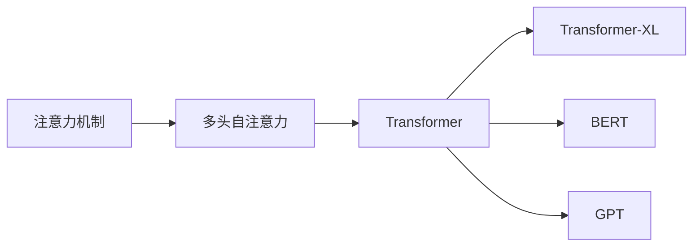

                 

# 自注意力机制在大模型中的应用

## 1. 背景介绍

自注意力机制(Attention Mechanism)是大模型中最核心的技术之一。它在自然语言处理(NLP)、计算机视觉(CV)等诸多领域表现出色，推动了大模型应用的前沿发展。自1990年代神经网络诞生以来，人们就意识到将注意力机制引入深度学习，可以有效缓解传统方法中信息损失的问题。自2017年Transformer论文发表以来，自注意力机制更是被广泛应用在深度学习模型中，成为大模型不可或缺的核心组件。

本文将从原理、应用、工程实现等角度，系统介绍自注意力机制在大模型中的应用。文章将首先阐述自注意力机制的基本概念和原理，其次详细介绍其在不同应用场景中的具体实现，最后介绍实际应用中的优化策略和工程挑战。希望通过本文，读者可以更好地理解和应用自注意力机制，掌握大模型开发的先进技巧。

## 2. 核心概念与联系

### 2.1 核心概念概述

为帮助读者快速理解自注意力机制，本节将首先介绍几个关键概念：

- **注意力机制(Attention Mechanism)**：一种能自动选择相关信息的机制，常用于深度学习模型，帮助模型从输入中提取关键信息。常见的注意力机制包括点积注意力、多头注意力、双头注意力等。

- **自注意力(Self-Attention)**：一种特殊形式的注意力机制，每个位置需要与其他位置计算注意力权重，并根据这些权重进行加权求和。

- **多头自注意力(Multi-Head Self-Attention)**：对同一输入进行多次自注意力计算，获得多个独立的注意力表示。多头自注意力能更好地捕捉输入的多重关系，提升模型表达能力。

- **Transformer**：一种基于自注意力机制的深度学习模型，被广泛应用于自然语言处理、计算机视觉、语音识别等领域。Transformer结构中的编码器、解码器等模块，均通过自注意力机制实现。

- **Transformer-XL**：对标准Transformer进行扩展，实现了长序列建模。Transformer-XL通过相对位置编码和自引用机制，解决标准Transformer无法有效处理长序列的问题。

- **BERT**：一种基于Transformer的大语言模型，通过对大规模无标签文本进行预训练，获得强大的语言理解能力，并可在下游任务上进行微调。

- **GPT**：一种基于Transformer的大语言模型，采用自回归生成方式，适用于文本生成、机器翻译等任务。

这些核心概念之间的联系如下：



自注意力机制作为Transformer等大模型的核心，能有效地捕捉输入序列之间的相关性，从而提升模型性能。其核心思想是通过计算注意力权重，对输入进行加权求和，得到更加聚焦的表示。

### 2.2 核心概念原理和架构

自注意力机制的计算过程主要分为三个步骤：

1. **计算注意力权重**：对于输入序列中的每个位置，通过计算其他位置的表示与当前位置的表示之间的相似度，得到注意力权重。相似度计算可以使用点积、余弦相似度等多种方法。

2. **加权求和**：将注意力权重与对应位置的表示进行加权求和，得到该位置的自注意力表示。

3. **多头并行计算**：对输入序列进行多头并行计算，得到多个独立的自注意力表示。

自注意力机制的计算过程如图1所示：


**图1: 自注意力机制计算过程**

## 3. 核心算法原理 & 具体操作步骤

### 3.1 算法原理概述

自注意力机制的核心思想是通过计算输入序列中各个位置之间的注意力权重，实现对输入的加权聚合。具体地，对于输入序列 $X=\{x_1, x_2, ..., x_n\}$，其自注意力表示 $Y=\{y_1, y_2, ..., y_n\}$ 的计算公式为：

$$
y_i = \text{Softmax}(\frac{Q_iK_i^T}{\sqrt{d_k}})V_i
$$

其中：
- $Q$、$K$、$V$ 为输入序列经过线性变换后得到的三个矩阵；
- $d_k$ 为键向量的维度；
- $\text{Softmax}(\cdot)$ 为注意力权重计算函数，保证注意力权重之和为1。

计算过程中，对于每个输入 $x_i$，计算其与所有输入位置 $x_j$ 的注意力权重 $\alpha_{ij}$，并根据权重对输入进行加权求和，得到自注意力表示 $y_i$。

### 3.2 算法步骤详解

自注意力机制的具体计算步骤如下：

1. **计算查询矩阵**：将输入 $X$ 经过线性变换得到查询矩阵 $Q$。

2. **计算键值矩阵**：将输入 $X$ 经过线性变换得到键矩阵 $K$ 和值矩阵 $V$。

3. **计算注意力权重**：对于输入 $X$ 中的每个位置，计算其与其他位置的注意力权重。

4. **加权求和**：对于每个位置，根据注意力权重计算自注意力表示。

5. **多头并行计算**：对输入 $X$ 进行多头自注意力计算，得到多个独立的自注意力表示。

具体实现时，通常使用矩阵乘法和 softmax 函数进行计算。下面以一个简单的例子来说明自注意力机制的计算过程。

**输入序列**：$X = [\text{I}, \text{love}, \text{deep}, \text{learning}]$

**线性变换**：将输入序列 $X$ 线性变换得到查询矩阵 $Q$、键矩阵 $K$ 和值矩阵 $V$。

$$
Q = W_QX, \quad K = W_KX, \quad V = W_VX
$$

**计算注意力权重**：对于输入 $X$ 中的每个位置，计算其与其他位置的注意力权重。

$$
\alpha_{ij} = \frac{\exp(\text{dot}(Q_iK_j^T)/\sqrt{d_k})}{\sum_{j=1}^{n}\exp(\text{dot}(Q_iK_j^T)/\sqrt{d_k})}
$$

**加权求和**：对于每个位置，根据注意力权重计算自注意力表示。

$$
y_i = \sum_{j=1}^{n}\alpha_{ij}V_j
$$

**多头并行计算**：对输入 $X$ 进行多头自注意力计算，得到多个独立的自注意力表示。

$$
Y = [y_i]_{i=1}^{n}
$$

### 3.3 算法优缺点

自注意力机制在大模型的应用中具有以下优点：

1. **高效性**：自注意力机制能够同时计算输入序列中所有位置的表示，计算效率高。

2. **表达能力**：自注意力机制能够捕捉输入序列中各个位置之间的复杂关系，提升模型的表达能力。

3. **通用性**：自注意力机制适用于多种深度学习模型，如Transformer、BERT等。

同时，自注意力机制也存在以下缺点：

1. **计算复杂度高**：自注意力机制需要计算输入序列中每个位置与其他位置的注意力权重，计算复杂度高。

2. **内存占用大**：自注意力机制需要保存输入序列的多个矩阵表示，内存占用大。

3. **过拟合风险**：自注意力机制容易学习到输入序列中的噪声信息，存在过拟合风险。

### 3.4 算法应用领域

自注意力机制在大模型的应用中，具有广泛的适用性。以下是几个典型的应用场景：

1. **自然语言处理(NLP)**：自注意力机制被广泛应用于机器翻译、文本分类、情感分析等任务，如Transformer模型、BERT模型等。

2. **计算机视觉(CV)**：自注意力机制被应用于图像分类、物体检测、语义分割等任务，如Transformer-based CNNs。

3. **语音识别**：自注意力机制被应用于语音识别中的词向量和特征表示，提升模型性能。

4. **强化学习**：自注意力机制被应用于强化学习中的注意力机制，帮助模型在复杂环境中进行决策。

5. **推荐系统**：自注意力机制被应用于推荐系统中的用户-物品关联关系建模，提升推荐效果。

## 4. 数学模型和公式 & 详细讲解 & 举例说明

### 4.1 数学模型构建

自注意力机制的数学模型如下：

$$
Q = W_QX, \quad K = W_KX, \quad V = W_VX
$$

其中，$W_Q$、$W_K$、$W_V$ 为线性变换矩阵，$X$ 为输入序列，$Q$、$K$、$V$ 为输入序列经过线性变换后的查询矩阵、键矩阵和值矩阵。

### 4.2 公式推导过程

**步骤1: 计算查询矩阵 $Q$**

$$
Q = W_QX
$$

**步骤2: 计算键值矩阵 $K$ 和 $V$**

$$
K = W_KX, \quad V = W_VX
$$

**步骤3: 计算注意力权重 $\alpha_{ij}$**

$$
\alpha_{ij} = \frac{\exp(\text{dot}(Q_iK_j^T)/\sqrt{d_k})}{\sum_{j=1}^{n}\exp(\text{dot}(Q_iK_j^T)/\sqrt{d_k})}
$$

**步骤4: 加权求和得到自注意力表示 $y_i$**

$$
y_i = \sum_{j=1}^{n}\alpha_{ij}V_j
$$

**步骤5: 多头并行计算**

$$
Y = [y_i]_{i=1}^{n}
$$

### 4.3 案例分析与讲解

以下是一个简单的例子，通过具体的数值计算说明自注意力机制的计算过程。

**输入序列**：$X = [\text{I}, \text{love}, \text{deep}, \text{learning}]$

**线性变换**：将输入序列 $X$ 线性变换得到查询矩阵 $Q$、键矩阵 $K$ 和值矩阵 $V$。

$$
Q = W_QX, \quad K = W_KX, \quad V = W_VX
$$

假设 $Q = [q_1, q_2, q_3, q_4]$，$K = [k_1, k_2, k_3, k_4]$，$V = [v_1, v_2, v_3, v_4]$。

**计算注意力权重 $\alpha_{ij}$**

$$
\alpha_{11} = \frac{\exp(\text{dot}(q_1k_1^T)/\sqrt{d_k})}{\sum_{j=1}^{4}\exp(\text{dot}(q_1k_j^T)/\sqrt{d_k})}
$$
$$
\alpha_{12} = \frac{\exp(\text{dot}(q_1k_2^T)/\sqrt{d_k})}{\sum_{j=1}^{4}\exp(\text{dot}(q_1k_j^T)/\sqrt{d_k})}
$$
$$
\alpha_{13} = \frac{\exp(\text{dot}(q_1k_3^T)/\sqrt{d_k})}{\sum_{j=1}^{4}\exp(\text{dot}(q_1k_j^T)/\sqrt{d_k})}
$$
$$
\alpha_{14} = \frac{\exp(\text{dot}(q_1k_4^T)/\sqrt{d_k})}{\sum_{j=1}^{4}\exp(\text{dot}(q_1k_j^T)/\sqrt{d_k})}
$$

**加权求和得到自注意力表示 $y_1$**

$$
y_1 = \alpha_{11}v_1 + \alpha_{12}v_2 + \alpha_{13}v_3 + \alpha_{14}v_4
$$

**重复计算 $y_2$、$y_3$、$y_4$**，得到完整的自注意力表示 $Y$。

## 5. 项目实践：代码实例和详细解释说明

### 5.1 开发环境搭建

在进行自注意力机制的开发实践时，我们需要准备好开发环境。以下是使用Python进行TensorFlow或PyTorch开发的环境配置流程：

1. 安装Anaconda：从官网下载并安装Anaconda，用于创建独立的Python环境。

2. 创建并激活虚拟环境：
```bash
conda create -n pytorch-env python=3.8 
conda activate pytorch-env
```

3. 安装TensorFlow或PyTorch：根据CUDA版本，从官网获取对应的安装命令。例如：
```bash
pip install tensorflow torch torchvision torchaudio cudatoolkit=11.1 -c pytorch -c conda-forge
```

4. 安装各类工具包：
```bash
pip install numpy pandas scikit-learn matplotlib tqdm jupyter notebook ipython
```

完成上述步骤后，即可在`pytorch-env`环境中开始自注意力机制的开发实践。

### 5.2 源代码详细实现

以下是使用TensorFlow实现自注意力机制的代码示例：

```python
import tensorflow as tf
import numpy as np

# 定义输入序列和参数
X = np.array([[1, 2, 3, 4], [5, 6, 7, 8], [9, 10, 11, 12]])
W_Q = tf.Variable(tf.random.normal([3, 4]))
W_K = tf.Variable(tf.random.normal([3, 4]))
W_V = tf.Variable(tf.random.normal([3, 4]))

# 定义查询矩阵、键值矩阵和值矩阵
Q = tf.matmul(X, W_Q)
K = tf.matmul(X, W_K)
V = tf.matmul(X, W_V)

# 定义注意力权重计算函数
def self_attention(Q, K, V):
    # 计算注意力权重
    alpha = tf.exp(tf.matmul(Q, K, transpose_b=True) / np.sqrt(4))
    alpha = alpha / tf.reduce_sum(alpha, axis=1, keepdims=True)
    # 加权求和得到自注意力表示
    y = tf.matmul(alpha, V)
    return y

# 计算自注意力表示
Y = self_attention(Q, K, V)

# 输出自注意力表示
print(Y.numpy())
```

### 5.3 代码解读与分析

以下是代码的详细解读：

**输入序列和参数**：
```python
X = np.array([[1, 2, 3, 4], [5, 6, 7, 8], [9, 10, 11, 12]])
W_Q = tf.Variable(tf.random.normal([3, 4]))
W_K = tf.Variable(tf.random.normal([3, 4]))
W_V = tf.Variable(tf.random.normal([3, 4]))
```

定义输入序列 $X$ 为3行4列的矩阵，线性变换矩阵 $W_Q$、$W_K$、$W_V$ 为4行3列的矩阵。

**查询矩阵、键值矩阵和值矩阵**：
```python
Q = tf.matmul(X, W_Q)
K = tf.matmul(X, W_K)
V = tf.matmul(X, W_V)
```

计算查询矩阵 $Q$、键矩阵 $K$、值矩阵 $V$，得到3行4列的矩阵。

**注意力权重计算函数**：
```python
def self_attention(Q, K, V):
    # 计算注意力权重
    alpha = tf.exp(tf.matmul(Q, K, transpose_b=True) / np.sqrt(4))
    alpha = alpha / tf.reduce_sum(alpha, axis=1, keepdims=True)
    # 加权求和得到自注意力表示
    y = tf.matmul(alpha, V)
    return y
```

定义自注意力计算函数，计算注意力权重 $\alpha$，并进行加权求和。

**计算自注意力表示**：
```python
Y = self_attention(Q, K, V)
```

调用自注意力计算函数，得到完整的自注意力表示 $Y$。

**输出自注意力表示**：
```python
print(Y.numpy())
```

输出自注意力表示 $Y$ 的数值结果。

## 6. 实际应用场景

### 6.1 自然语言处理(NLP)

自注意力机制在NLP领域的应用非常广泛。常见的应用场景包括：

1. **机器翻译**：通过自注意力机制，Transformer模型能够捕捉输入序列中不同位置之间的依赖关系，实现高效翻译。

2. **文本分类**：使用自注意力机制对输入序列进行编码，提取文本的关键特征，用于分类任务。

3. **文本生成**：通过自注意力机制，GPT等模型能够捕捉输入序列的长期依赖关系，生成连贯的文本内容。

4. **文本摘要**：使用自注意力机制对输入序列进行编码，提取出关键信息，用于生成摘要。

### 6.2 计算机视觉(CV)

自注意力机制在CV领域也有广泛应用。常见的应用场景包括：

1. **图像分类**：通过自注意力机制，卷积神经网络能够捕捉输入序列中不同位置之间的依赖关系，提升分类效果。

2. **物体检测**：使用自注意力机制对输入序列进行编码，提取物体的关键特征，用于检测任务。

3. **语义分割**：通过自注意力机制，卷积神经网络能够捕捉输入序列中不同位置之间的依赖关系，实现像素级的语义分割。

4. **图像生成**：使用自注意力机制，生成对抗网络(Generative Adversarial Network, GAN)等模型能够生成高质量的图像内容。

### 6.3 语音识别

自注意力机制在语音识别领域也有应用。常见的应用场景包括：

1. **语音特征表示**：通过自注意力机制，能够对输入序列中的语音特征进行编码，提升特征表示效果。

2. **语音识别**：使用自注意力机制对输入序列进行编码，提取语音的关键特征，用于识别任务。

### 6.4 未来应用展望

随着深度学习技术的不断发展，自注意力机制在未来将有更广泛的应用前景：

1. **多模态学习**：自注意力机制能够同时处理视觉、文本、语音等多种模态信息，推动多模态学习的进步。

2. **长期依赖关系建模**：自注意力机制能够捕捉输入序列中的长期依赖关系，提升模型在长期序列任务上的表现。

3. **自监督学习**：自注意力机制能够自动生成无标签的负样本，用于自监督学习，提升模型的泛化能力。

4. **实时计算**：自注意力机制能够高效计算输入序列的表示，支持实时计算和推理。

5. **大规模数据处理**：自注意力机制能够并行处理大规模数据，支持分布式计算和优化。

6. **跨领域应用**：自注意力机制能够适用于多种领域，推动跨领域应用的发展。

## 7. 工具和资源推荐

### 7.1 学习资源推荐

为了帮助开发者掌握自注意力机制的原理和应用，以下是一些优质的学习资源：

1. **《深度学习入门：基于Python的理论与实现》**：由李沐等人编写的深度学习入门书籍，介绍了自注意力机制的基本原理和实现方法。

2. **Coursera《Deep Learning Specialization》**：由Andrew Ng等人授课的深度学习课程，涵盖了自注意力机制等核心内容。

3. **arXiv上的相关论文**：自注意力机制的研究论文众多，可以通过arXiv搜索最新的研究成果。

4. **Kaggle上的竞赛**：Kaggle上有很多基于自注意力机制的竞赛项目，可以通过实践掌握应用技巧。

5. **Google Colab**：谷歌提供的在线Jupyter Notebook环境，方便开发者在云端进行实验。

### 7.2 开发工具推荐

自注意力机制的开发离不开优秀的工具支持。以下是几款常用的开发工具：

1. **TensorFlow**：由Google开发的深度学习框架，支持多种模型和优化器。

2. **PyTorch**：由Facebook开发的深度学习框架，灵活性和易用性高。

3. **JAX**：由Google开发的自动微分库，支持高效计算和自动并行化。

4. **TensorBoard**：TensorFlow配套的可视化工具，用于监控和调试模型。

5. **Weights & Biases**：模型训练的实验跟踪工具，可以记录和可视化模型训练过程中的各项指标。

### 7.3 相关论文推荐

以下是几篇有代表性的自注意力机制的论文，推荐阅读：

1. **Attention Is All You Need**：Transformer论文，提出自注意力机制，解决了标准卷积网络在处理长序列时的问题。

2. **BERT: Pre-training of Deep Bidirectional Transformers for Language Understanding**：BERT论文，提出预训练语言模型BERT，在大规模无标签文本上进行预训练，显著提升了语言理解能力。

3. **The Illustrated Transformer**：一篇通俗易懂的Transformer介绍文章，详细讲解了Transformer的原理和实现方法。

4. **How Attention Works in Transformers**：一篇解释自注意力机制的博客文章，从原理到实现进行了详细讲解。

5. **Self-Attention for Object Detection**：一篇介绍自注意力机制在物体检测领域应用的论文，展示了自注意力机制在图像处理中的优势。

## 8. 总结：未来发展趋势与挑战

### 8.1 研究成果总结

自注意力机制作为大模型中最核心的技术之一，其发展取得了巨大的成功。自2017年Transformer论文发表以来，自注意力机制被广泛应用于自然语言处理、计算机视觉、语音识别等多个领域，推动了深度学习技术的发展。通过不断优化和扩展，自注意力机制已经成为一个重要的研究热点。

### 8.2 未来发展趋势

未来，自注意力机制在大模型的应用将呈现出以下几个发展趋势：

1. **多样化的自注意力机制**：未来的自注意力机制将更加多样化和复杂化，如多头自注意力、双头自注意力等，以提升模型的表达能力和泛化能力。

2. **跨领域的自注意力机制**：未来的自注意力机制将更加适用于跨领域应用，如多模态自注意力机制，推动多模态学习的进步。

3. **高效的自注意力计算**：未来的自注意力计算将更加高效和并行化，支持大规模数据和实时计算。

4. **自监督学习中的自注意力**：未来的自注意力机制将更多地应用于自监督学习中，提升模型的泛化能力和数据利用率。

5. **自注意力机制的优化**：未来的自注意力机制将更加关注优化问题，如计算复杂度、内存占用等问题，推动自注意力机制的广泛应用。

### 8.3 面临的挑战

尽管自注意力机制在深度学习中取得了巨大的成功，但在实际应用中仍然面临诸多挑战：

1. **计算复杂度**：自注意力机制的计算复杂度较高，需要在计算效率和模型表达之间进行权衡。

2. **内存占用**：自注意力机制需要保存多个矩阵表示，内存占用较大，需要在计算效率和内存使用之间进行权衡。

3. **过拟合问题**：自注意力机制容易学习到输入序列中的噪声信息，存在过拟合风险。

4. **模型解释性**：自注意力机制通常被视为"黑盒"模型，难以解释其内部工作机制，存在模型解释性问题。

### 8.4 研究展望

未来的研究需要在以下几个方面寻求新的突破：

1. **计算效率的提升**：开发更高效的自注意力计算方法，如矩阵乘法优化、模型并行化等，提升计算效率和并行性。

2. **自注意力机制的优化**：优化自注意力机制的计算复杂度和内存占用，使其更加高效和易于实现。

3. **模型解释性的提升**：研究如何提升自注意力机制的模型解释性，使其更具可解释性和可解释性。

4. **多模态学习的探索**：研究如何将自注意力机制与其他模态信息结合，推动多模态学习的进步。

5. **自监督学习的应用**：研究如何利用自注意力机制进行自监督学习，提升模型的泛化能力和数据利用率。

6. **跨领域应用**：研究如何使自注意力机制适用于跨领域应用，推动跨领域应用的发展。

综上所述，自注意力机制在大模型的应用前景广阔，未来的研究将继续推动深度学习技术的发展。只有不断创新和突破，才能使自注意力机制更好地服务于各个领域，推动人工智能技术的前进步伐。

## 9. 附录：常见问题与解答

**Q1: 自注意力机制与卷积神经网络(CNN)的区别是什么？**

A: 自注意力机制和CNN的主要区别在于特征提取的方式。CNN通过卷积操作提取局部特征，而自注意力机制通过计算输入序列中不同位置之间的依赖关系，提取全局特征。自注意力机制能够更好地捕捉输入序列中的长期依赖关系，适用于长序列任务。

**Q2: 自注意力机制在NLP任务中的表现如何？**

A: 自注意力机制在NLP任务中表现出色，尤其是在长序列任务中。如Transformer模型、BERT模型等，在机器翻译、文本分类、情感分析等任务上取得了SOTA效果。

**Q3: 自注意力机制在CV任务中的应用效果如何？**

A: 自注意力机制在CV任务中也有广泛应用。如Transformer-based CNNs、自注意力卷积神经网络等，在图像分类、物体检测、语义分割等任务上取得了SOTA效果。

**Q4: 自注意力机制在语音识别中的应用效果如何？**

A: 自注意力机制在语音识别领域也有应用。如使用自注意力机制对语音特征进行编码，能够提升语音识别的准确率。

**Q5: 自注意力机制的计算复杂度如何？**

A: 自注意力机制的计算复杂度较高，主要取决于输入序列的长度和自注意力层的深度。需要使用高效的计算方法和优化技术，提升计算效率。

**Q6: 自注意力机制的实现难点有哪些？**

A: 自注意力机制的实现难点包括：计算复杂度高、内存占用大、过拟合风险等。需要在使用过程中注意这些问题，并进行优化和改进。

本文系统介绍了自注意力机制在大模型中的应用，希望能帮助读者更好地理解自注意力机制的原理和应用，掌握大模型开发的先进技巧。

---

作者：禅与计算机程序设计艺术 / Zen and the Art of Computer Programming

