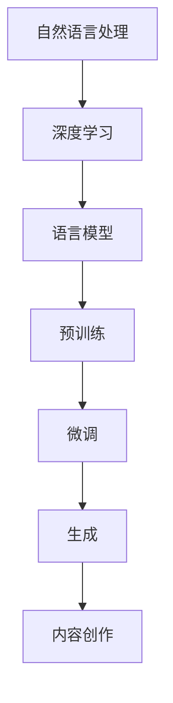

                 

# 自然语言处理的应用：AI内容创作革命

> 关键词：
- 自然语言处理 (NLP)
- 人工智能 (AI)
- 内容创作
- 深度学习
- 语言模型
- 文本生成
- 创作工具

## 1. 背景介绍

### 1.1 问题由来
随着互联网的普及和社交媒体的兴起，内容创作已经成为了一个蓬勃发展的领域。无论是博客文章、新闻报道、社交媒体帖子，还是广告文案，优质的内容创作都需要大量的专业知识和创意。然而，传统的内容创作过程往往耗时耗力，且容易受制于作者的经验和知识限制。

近年来，自然语言处理（NLP）技术，尤其是深度学习驱动的语言模型，取得了显著进展。特别是以Transformer为基础的大规模预训练语言模型（如GPT、BERT等），已经能够生成高质量的自然语言文本，甚至在许多领域超越了人类作家的创作能力。这种技术革新为内容创作带来了革命性的变化，推动了人工智能在内容生成领域的广泛应用。

### 1.2 问题核心关键点
AI内容创作的核心在于利用语言模型生成高质量的文本。主要包括以下几个关键点：

- **预训练语言模型**：通过在大规模无标签文本数据上预训练，学习到通用的语言知识，能够在各种任务上提供初步的文本生成能力。
- **微调与训练**：针对特定任务，对预训练模型进行微调，通过有标签数据进行训练，优化模型的文本生成性能。
- **生成与优化**：在生成过程中引入各种优化技巧，如温度控制、样本过滤等，提升生成文本的质量和多样性。
- **应用场景**：在新闻、广告、文案、文学创作等领域进行广泛应用，助力内容创作过程。

## 2. 核心概念与联系

### 2.1 核心概念概述

为了更好地理解AI内容创作的原理，本节将介绍几个关键概念及其相互联系：

- **自然语言处理（NLP）**：涉及计算机对人类语言进行理解、处理和生成的一系列技术。
- **深度学习（DL）**：一种机器学习范式，使用多层次神经网络进行模型训练。
- **语言模型**：用于预测给定上下文条件下下一个词汇的概率，是NLP的核心技术。
- **预训练**：在大量无标签数据上训练模型，学习通用的语言表示。
- **微调（Fine-tuning）**：在预训练模型的基础上，针对特定任务进行训练，提升模型性能。
- **生成（Generation）**：利用模型生成新的文本，可以是文章、对话、描述等。
- **内容创作**：结合语言生成和优化技术，创作高质量的文本内容。

这些概念之间的关系可以通过以下Mermaid流程图来展示：



这个流程图展示了从深度学习到内容创作的整个流程。通过深度学习和预训练，模型学习到通用的语言知识，经过微调适应特定任务，最终生成高质量的内容。

## 3. 核心算法原理 & 具体操作步骤
### 3.1 算法原理概述

AI内容创作的核心算法基于深度学习和语言模型，通过预训练和微调，生成具有高语义准确性和语言流畅性的文本。其基本原理如下：

1. **预训练语言模型**：使用大规模无标签文本数据，训练一个通用的语言模型，学习到丰富的语言知识，包括词义、语法和上下文关系等。常见的预训练任务包括自回归语言建模和掩码语言建模。

2. **微调与训练**：将预训练模型作为初始化参数，针对特定的内容创作任务（如新闻写作、广告文案、小说创作等），利用小规模有标签数据进行微调训练。微调过程通常包括调整顶层分类器或解码器，使用较小的学习率更新全部或部分模型参数。

3. **生成与优化**：在训练完成后，利用微调后的模型进行文本生成。生成过程可以引入温度控制、样本过滤等优化技巧，以提升生成文本的质量和多样性。

### 3.2 算法步骤详解

以下是一个基于深度学习的内容创作算法详细步骤：

1. **数据准备**：
   - 收集与内容创作相关的标注数据集，如新闻报道、广告文案、文学作品等。
   - 将数据集划分为训练集、验证集和测试集，确保数据集的分布与实际应用场景相匹配。

2. **模型选择与初始化**：
   - 选择适合预训练的语言模型，如GPT、BERT等，作为内容创作的初始化模型。
   - 使用预训练模型的权重作为初始化参数。

3. **微调与训练**：
   - 针对特定任务，设计合适的输出层和损失函数。
   - 选择合适的优化器（如AdamW、SGD等）和超参数（如学习率、批大小、迭代轮数等）。
   - 在训练集上进行微调，周期性地在验证集上评估模型性能，根据性能指标决定是否触发Early Stopping。

4. **生成与优化**：
   - 使用微调后的模型生成新的文本内容。
   - 引入温度控制等优化技巧，调节生成文本的多样性和流畅性。
   - 使用样本过滤等策略，筛选高质量、符合语境的生成文本。

### 3.3 算法优缺点

AI内容创作算法具有以下优点：

- **高效性**：通过预训练和微调，可以快速生成高质量文本，适应不同领域的创作需求。
- **广泛性**：适用于多种内容创作任务，如新闻报道、广告文案、文学创作等。
- **可定制性**：通过调整微调参数和优化策略，可以定制化生成文本的风格和特点。

同时，也存在一些局限性：

- **依赖数据**：生成的文本质量很大程度上取决于训练数据的数量和质量，数据收集和标注成本较高。
- **过拟合风险**：微调过程可能过拟合训练数据，导致生成文本过于依赖特定的语境和风格。
- **创造性不足**：生成文本缺乏人类作家的创造性和创新性，可能出现语法错误、逻辑不合理等问题。

## 4. 数学模型和公式 & 详细讲解 & 举例说明

### 4.1 数学模型构建

本节将使用数学语言对AI内容创作的数学模型进行详细构建。

假设我们有一个语言模型 $M$，输入为文本 $X$，输出为文本 $Y$。内容创作的目标是通过微调模型 $M$，生成符合特定任务要求的文本。微调的优化目标是最小化经验风险：

$$
\mathcal{L}(\theta) = \frac{1}{N}\sum_{i=1}^N \ell(M(x_i),y_i)
$$

其中 $\ell$ 为任务特定的损失函数，$x_i$ 和 $y_i$ 分别为训练集中的输入和输出。

### 4.2 公式推导过程

以新闻报道生成为例，假设模型 $M$ 的输出为 $y$，对应的真实新闻文本为 $y^*$。我们希望最大化生成文本与真实文本的相似度，最小化差异：

$$
\mathcal{L}(\theta) = -\log p(y^*|M(x))
$$

其中 $p(y|x)$ 表示模型在输入 $x$ 条件下生成文本 $y$ 的概率。因此，微调的目标是最大化 $p(y^*|M(x))$。

在实践中，我们通常使用交叉熵损失函数：

$$
\mathcal{L}(\theta) = -\frac{1}{N}\sum_{i=1}^N \sum_{j=1}^{|\mathcal{Y}|} y_{i,j} \log \hat{y}_{i,j}
$$

其中 $y_{i,j}$ 为真实文本 $y_i$ 中的第 $j$ 个词汇，$\hat{y}_{i,j}$ 为模型生成的文本中第 $j$ 个词汇的概率。

### 4.3 案例分析与讲解

以广告文案生成为例，我们可以使用类似的方法进行微调。假设我们的目标是生成广告文案，其真实文本为 $y$，模型生成的文本为 $\hat{y}$。为了最大化生成文本与真实文本的匹配度，我们定义如下损失函数：

$$
\mathcal{L}(\theta) = -\frac{1}{N}\sum_{i=1}^N \log \frac{p(y_i|\hat{y}_i)}{p(\hat{y}_i)}
$$

其中 $p(y_i|\hat{y}_i)$ 表示在生成文本 $\hat{y}_i$ 条件下真实文本 $y_i$ 的概率，$p(\hat{y}_i)$ 表示生成文本 $\hat{y}_i$ 的概率。

通过上述方法，我们可以训练一个广告文案生成模型，用于自动生成具有商业吸引力的文案。

## 5. 项目实践：代码实例和详细解释说明

### 5.1 开发环境搭建

在进行内容创作实践前，我们需要准备好开发环境。以下是使用Python进行PyTorch开发的环境配置流程：

1. 安装Anaconda：从官网下载并安装Anaconda，用于创建独立的Python环境。

2. 创建并激活虚拟环境：
```bash
conda create -n pytorch-env python=3.8 
conda activate pytorch-env
```

3. 安装PyTorch：根据CUDA版本，从官网获取对应的安装命令。例如：
```bash
conda install pytorch torchvision torchaudio cudatoolkit=11.1 -c pytorch -c conda-forge
```

4. 安装Transformers库：
```bash
pip install transformers
```

5. 安装各类工具包：
```bash
pip install numpy pandas scikit-learn matplotlib tqdm jupyter notebook ipython
```

完成上述步骤后，即可在`pytorch-env`环境中开始内容创作实践。

### 5.2 源代码详细实现

下面我们以广告文案生成为例，给出使用Transformers库进行内容创作的PyTorch代码实现。

首先，定义广告文案生成任务的数据处理函数：

```python
from transformers import BertTokenizer
from torch.utils.data import Dataset
import torch

class AdDataset(Dataset):
    def __init__(self, texts, tags, tokenizer, max_len=128):
        self.texts = texts
        self.tags = tags
        self.tokenizer = tokenizer
        self.max_len = max_len
        
    def __len__(self):
        return len(self.texts)
    
    def __getitem__(self, item):
        text = self.texts[item]
        tags = self.tags[item]
        
        encoding = self.tokenizer(text, return_tensors='pt', max_length=self.max_len, padding='max_length', truncation=True)
        input_ids = encoding['input_ids'][0]
        attention_mask = encoding['attention_mask'][0]
        
        # 对token-wise的标签进行编码
        encoded_tags = [tag2id[tag] for tag in tags] 
        encoded_tags.extend([tag2id['O']] * (self.max_len - len(encoded_tags)))
        labels = torch.tensor(encoded_tags, dtype=torch.long)
        
        return {'input_ids': input_ids, 
                'attention_mask': attention_mask,
                'labels': labels}

# 标签与id的映射
tag2id = {'O': 0, 'B-ADV': 1, 'I-ADV': 2, 'B-PRD': 3, 'I-PRD': 4, 'B-LOC': 5, 'I-LOC': 6}
id2tag = {v: k for k, v in tag2id.items()}

# 创建dataset
tokenizer = BertTokenizer.from_pretrained('bert-base-cased')

train_dataset = AdDataset(train_texts, train_tags, tokenizer)
dev_dataset = AdDataset(dev_texts, dev_tags, tokenizer)
test_dataset = AdDataset(test_texts, test_tags, tokenizer)
```

然后，定义模型和优化器：

```python
from transformers import BertForTokenClassification, AdamW

model = BertForTokenClassification.from_pretrained('bert-base-cased', num_labels=len(tag2id))

optimizer = AdamW(model.parameters(), lr=2e-5)
```

接着，定义训练和评估函数：

```python
from torch.utils.data import DataLoader
from tqdm import tqdm
from sklearn.metrics import classification_report

device = torch.device('cuda') if torch.cuda.is_available() else torch.device('cpu')
model.to(device)

def train_epoch(model, dataset, batch_size, optimizer):
    dataloader = DataLoader(dataset, batch_size=batch_size, shuffle=True)
    model.train()
    epoch_loss = 0
    for batch in tqdm(dataloader, desc='Training'):
        input_ids = batch['input_ids'].to(device)
        attention_mask = batch['attention_mask'].to(device)
        labels = batch['labels'].to(device)
        model.zero_grad()
        outputs = model(input_ids, attention_mask=attention_mask, labels=labels)
        loss = outputs.loss
        epoch_loss += loss.item()
        loss.backward()
        optimizer.step()
    return epoch_loss / len(dataloader)

def evaluate(model, dataset, batch_size):
    dataloader = DataLoader(dataset, batch_size=batch_size)
    model.eval()
    preds, labels = [], []
    with torch.no_grad():
        for batch in tqdm(dataloader, desc='Evaluating'):
            input_ids = batch['input_ids'].to(device)
            attention_mask = batch['attention_mask'].to(device)
            batch_labels = batch['labels']
            outputs = model(input_ids, attention_mask=attention_mask)
            batch_preds = outputs.logits.argmax(dim=2).to('cpu').tolist()
            batch_labels = batch_labels.to('cpu').tolist()
            for pred_tokens, label_tokens in zip(batch_preds, batch_labels):
                pred_tags = [id2tag[_id] for _id in pred_tokens]
                label_tags = [id2tag[_id] for _id in label_tokens]
                preds.append(pred_tags[:len(label_tags)])
                labels.append(label_tags)
                
    print(classification_report(labels, preds))
```

最后，启动训练流程并在测试集上评估：

```python
epochs = 5
batch_size = 16

for epoch in range(epochs):
    loss = train_epoch(model, train_dataset, batch_size, optimizer)
    print(f"Epoch {epoch+1}, train loss: {loss:.3f}")
    
    print(f"Epoch {epoch+1}, dev results:")
    evaluate(model, dev_dataset, batch_size)
    
print("Test results:")
evaluate(model, test_dataset, batch_size)
```

以上就是使用PyTorch对BERT进行广告文案生成任务的微调实践。可以看到，通过简单的代码实现，我们就能利用BERT模型生成符合特定广告风格的高质量文案。

### 5.3 代码解读与分析

让我们再详细解读一下关键代码的实现细节：

**AdDataset类**：
- `__init__`方法：初始化文本、标签、分词器等关键组件。
- `__len__`方法：返回数据集的样本数量。
- `__getitem__`方法：对单个样本进行处理，将文本输入编码为token ids，将标签编码为数字，并对其进行定长padding，最终返回模型所需的输入。

**tag2id和id2tag字典**：
- 定义了标签与数字id之间的映射关系，用于将token-wise的预测结果解码回真实的标签。

**训练和评估函数**：
- 使用PyTorch的DataLoader对数据集进行批次化加载，供模型训练和推理使用。
- 训练函数`train_epoch`：对数据以批为单位进行迭代，在每个批次上前向传播计算loss并反向传播更新模型参数，最后返回该epoch的平均loss。
- 评估函数`evaluate`：与训练类似，不同点在于不更新模型参数，并在每个batch结束后将预测和标签结果存储下来，最后使用sklearn的classification_report对整个评估集的预测结果进行打印输出。

**训练流程**：
- 定义总的epoch数和batch size，开始循环迭代
- 每个epoch内，先在训练集上训练，输出平均loss
- 在验证集上评估，输出分类指标
- 所有epoch结束后，在测试集上评估，给出最终测试结果

可以看到，PyTorch配合Transformers库使得广告文案生成任务的微调代码实现变得简洁高效。开发者可以将更多精力放在数据处理、模型改进等高层逻辑上，而不必过多关注底层的实现细节。

当然，工业级的系统实现还需考虑更多因素，如模型的保存和部署、超参数的自动搜索、更灵活的任务适配层等。但核心的微调范式基本与此类似。

## 6. 实际应用场景
### 6.1 智能广告推荐

基于广告文案生成的大语言模型，可以广泛应用于智能广告推荐系统。传统的广告推荐系统往往依赖用户的历史行为数据进行推荐，难以实时捕捉用户的即时需求。而通过微调后的语言模型，可以在数秒内自动生成符合用户兴趣的广告文案，实时推荐给用户，提升广告点击率和转化率。

在技术实现上，可以收集用户的历史浏览记录、点击记录、搜索记录等数据，提取和用户交互的物品标题、描述、标签等文本内容。将文本内容作为模型输入，用户的后续行为（如是否点击、购买等）作为监督信号，在此基础上微调预训练语言模型。微调后的模型能够从文本内容中准确把握用户的兴趣点。在推荐广告时，先用候选广告的文本描述作为输入，由模型预测用户的兴趣匹配度，再结合其他特征综合排序，便可以得到个性化程度更高的广告推荐结果。

### 6.2 内容生成与创作

除了广告文案生成外，AI内容创作技术还能应用于新闻报道、小说创作、电影剧本生成等广泛领域。通过微调后的大语言模型，可以在短时间内生成高质量的文本内容，弥补人力资源不足的缺口，助力内容创作的效率和质量。

例如，新闻报道生成可以用于自动撰写简短的新闻摘要，小说创作可以生成情节大纲和人物设定，电影剧本生成可以提供初稿素材等。这些应用不仅能够提高内容创作的效率，还能为创作者提供灵感和参考，加速内容创作过程。

### 6.3 教育和培训

AI内容创作技术在教育领域也有广泛的应用前景。传统的教育培训往往需要大量教师进行手动编写教材和讲义，耗时耗力。通过微调后的大语言模型，可以自动生成课程大纲、习题、教材等内容，为教师提供辅助材料，减轻其负担。

例如，可以设计教师的授课视频作为微调数据，利用微调后的语言模型自动生成配套的教材、习题和练习。此外，还可以将学生的历史成绩和学习记录作为监督信号，训练生成个性化的学习内容，提高教学效果。

### 6.4 未来应用展望

随着AI内容创作技术的不断进步，其在更多领域的应用前景将更加广阔。

- **智能客服**：通过微调后的大语言模型，可以构建智能客服系统，自动处理客户咨询，提升服务效率和质量。
- **金融分析**：利用微调后的语言模型，可以自动生成金融报告、分析文档等，为投资者提供辅助决策支持。
- **健康医疗**：生成医学知识库、患者问答、健康教育内容，辅助医生诊疗，提升医疗服务的智能化水平。
- **法律咨询**：自动生成法律文书、合同、案例分析等，为律师提供辅助工具，提高工作效率。

总之，AI内容创作技术正逐步渗透到各行各业，成为推动数字化转型、提升工作效率、降低成本的重要手段。未来，伴随技术的不断成熟和应用场景的不断拓展，AI内容创作技术必将在更多领域发挥重要作用。

## 7. 工具和资源推荐
### 7.1 学习资源推荐

为了帮助开发者系统掌握AI内容创作的理论基础和实践技巧，这里推荐一些优质的学习资源：

1. 《Transformer from Principles to Practice》系列博文：由大模型技术专家撰写，深入浅出地介绍了Transformer原理、BERT模型、内容创作技术等前沿话题。

2. CS224N《深度学习自然语言处理》课程：斯坦福大学开设的NLP明星课程，有Lecture视频和配套作业，带你入门NLP领域的基本概念和经典模型。

3. 《Natural Language Processing with Transformers》书籍：Transformers库的作者所著，全面介绍了如何使用Transformers库进行NLP任务开发，包括内容创作在内的诸多范式。

4. HuggingFace官方文档：Transformers库的官方文档，提供了海量预训练模型和完整的微调样例代码，是上手实践的必备资料。

5. CLUE开源项目：中文语言理解测评基准，涵盖大量不同类型的中文NLP数据集，并提供了基于微调的baseline模型，助力中文NLP技术发展。

通过对这些资源的学习实践，相信你一定能够快速掌握AI内容创作的精髓，并用于解决实际的NLP问题。

### 7.2 开发工具推荐

高效的开发离不开优秀的工具支持。以下是几款用于AI内容创作开发的常用工具：

1. PyTorch：基于Python的开源深度学习框架，灵活动态的计算图，适合快速迭代研究。大部分预训练语言模型都有PyTorch版本的实现。

2. TensorFlow：由Google主导开发的开源深度学习框架，生产部署方便，适合大规模工程应用。同样有丰富的预训练语言模型资源。

3. Transformers库：HuggingFace开发的NLP工具库，集成了众多SOTA语言模型，支持PyTorch和TensorFlow，是进行内容创作开发的利器。

4. Weights & Biases：模型训练的实验跟踪工具，可以记录和可视化模型训练过程中的各项指标，方便对比和调优。与主流深度学习框架无缝集成。

5. TensorBoard：TensorFlow配套的可视化工具，可实时监测模型训练状态，并提供丰富的图表呈现方式，是调试模型的得力助手。

6. Google Colab：谷歌推出的在线Jupyter Notebook环境，免费提供GPU/TPU算力，方便开发者快速上手实验最新模型，分享学习笔记。

合理利用这些工具，可以显著提升AI内容创作的开发效率，加快创新迭代的步伐。

### 7.3 相关论文推荐

AI内容创作技术的发展源于学界的持续研究。以下是几篇奠基性的相关论文，推荐阅读：

1. Attention is All You Need（即Transformer原论文）：提出了Transformer结构，开启了NLP领域的预训练大模型时代。

2. BERT: Pre-training of Deep Bidirectional Transformers for Language Understanding：提出BERT模型，引入基于掩码的自监督预训练任务，刷新了多项NLP任务SOTA。

3. Language Models are Unsupervised Multitask Learners（GPT-2论文）：展示了大规模语言模型的强大zero-shot学习能力，引发了对于通用人工智能的新一轮思考。

4. Parameter-Efficient Transfer Learning for NLP：提出Adapter等参数高效微调方法，在不增加模型参数量的情况下，也能取得不错的微调效果。

5. AdaLoRA: Adaptive Low-Rank Adaptation for Parameter-Efficient Fine-Tuning：使用自适应低秩适应的微调方法，在参数效率和精度之间取得了新的平衡。

6. Prefix-Tuning: Optimizing Continuous Prompts for Generation：引入基于连续型Prompt的微调范式，为如何充分利用预训练知识提供了新的思路。

这些论文代表了大语言模型内容创作技术的发展脉络。通过学习这些前沿成果，可以帮助研究者把握学科前进方向，激发更多的创新灵感。

## 8. 总结：未来发展趋势与挑战

### 8.1 总结

本文对AI内容创作的原理和应用进行了全面系统的介绍。首先阐述了AI内容创作在NLP领域的应用背景和重要性，明确了内容创作在当前技术环境下的主要实现方法。其次，从原理到实践，详细讲解了AI内容创作的数学模型和关键步骤，给出了内容创作任务开发的完整代码实例。同时，本文还探讨了内容创作在广告推荐、教育培训、智能客服等多个行业领域的应用前景，展示了其广阔的应用空间。

通过本文的系统梳理，可以看到，AI内容创作技术正在成为NLP领域的重要范式，极大地拓展了语言模型的应用边界，为内容创作过程提供了新的工具和思路。未来，伴随技术的不断演进和应用场景的不断拓展，AI内容创作技术必将在更多领域大放异彩。

### 8.2 未来发展趋势

展望未来，AI内容创作技术将呈现以下几个发展趋势：

1. **模型规模持续增大**：随着算力成本的下降和数据规模的扩张，预训练语言模型的参数量还将持续增长。超大规模语言模型蕴含的丰富语言知识，有望支撑更加复杂多变的文本生成任务。

2. **生成模型的多样化**：除了传统的文本生成模型外，未来将涌现更多类型的生成模型，如语音生成、图像生成等，推动多模态内容创作的兴起。

3. **生成策略的创新**：引入更多生成策略，如变分生成、对抗生成等，提升生成文本的多样性和创造性。

4. **内容创作的智能化**：结合更多智能算法，如知识图谱、因果推理等，使内容创作更具逻辑性和知识深度。

5. **内容创作的个性化**：通过用户画像、历史行为等数据，实现内容创作的个性化定制，满足用户的个性化需求。

6. **内容创作的人机协作**：将人工智能与人类创作结合，形成人机协作的创作模式，提升创作效果和质量。

以上趋势凸显了AI内容创作技术的广阔前景。这些方向的探索发展，必将进一步提升内容创作的效率和质量，为内容创作者提供更强大、更智能的工具。

### 8.3 面临的挑战

尽管AI内容创作技术已经取得了显著进展，但在迈向更加智能化、普适化应用的过程中，仍面临诸多挑战：

1. **数据隐私问题**：内容创作过程中涉及用户隐私数据，如何保护用户隐私，确保数据安全，是一个重要的问题。

2. **内容真实性**：生成的文本可能存在错误信息或误导性内容，如何确保生成的内容真实可信，避免虚假信息的传播，是一个亟待解决的问题。

3. **版权问题**：生成的文本可能存在抄袭或侵权，如何确保生成的内容不侵犯版权，避免法律风险，是一个需要谨慎考虑的问题。

4. **伦理道德**：生成的内容可能包含有害信息、歧视性言论等，如何确保内容创作的伦理道德，是一个重要的问题。

5. **模型公平性**：生成的文本可能存在偏见，如何确保模型的公平性，避免对特定群体造成歧视，是一个重要的问题。

6. **技术门槛**：AI内容创作技术需要较高的技术门槛，如何降低技术门槛，使更多开发者能够使用，是一个需要解决的问题。

正视AI内容创作面临的这些挑战，积极应对并寻求突破，将是大语言模型内容创作走向成熟的必由之路。相信随着学界和产业界的共同努力，这些挑战终将一一被克服，AI内容创作技术必将在构建人机协同的智能内容创作体系中扮演越来越重要的角色。

### 8.4 研究展望

面对AI内容创作技术面临的挑战，未来的研究需要在以下几个方面寻求新的突破：

1. **生成内容的验证与审核**：结合人工智能和人工审核，构建内容验证与审核机制，确保生成的内容真实可信、无偏见、无侵权。

2. **内容创作的伦理道德规范**：在模型训练和内容生成的过程中，引入伦理道德导向的评估指标，构建内容创作的伦理道德规范。

3. **多模态内容创作**：结合语音、图像、视频等多模态信息，推动多模态内容创作的突破。

4. **内容创作的可解释性**：研究内容创作模型的可解释性，增强模型的透明性和可信度。

5. **内容的个性化定制**：结合用户画像、历史行为等数据，实现内容创作的个性化定制，满足用户的个性化需求。

6. **内容的版权保护**：研究内容创作的版权保护机制，确保生成的内容不侵犯版权，避免法律风险。

这些研究方向将引领AI内容创作技术迈向更高的台阶，为内容创作者提供更强大、更智能的工具，推动人工智能技术在更多领域的应用。

## 9. 附录：常见问题与解答

**Q1：AI内容创作是否适用于所有类型的文本生成任务？**

A: AI内容创作技术在许多文本生成任务上都能取得较好的效果，如新闻报道、广告文案、小说创作等。但对于一些特定领域的任务，如医学、法律等，仅仅依靠通用语料预训练的模型可能难以很好地适应。此时需要在特定领域语料上进一步预训练，再进行微调，才能获得理想效果。此外，对于一些需要时效性、个性化很强的任务，如对话、推荐等，内容创作方法也需要针对性的改进优化。

**Q2：内容创作过程中如何处理数据隐私问题？**

A: 数据隐私问题是内容创作中必须重视的一个问题。为了保护用户隐私，可以采用以下措施：
1. 匿名化处理：对用户数据进行匿名化处理，去除个人身份信息。
2. 数据脱敏：对敏感数据进行脱敏处理，保护用户隐私。
3. 用户授权：在内容创作过程中，获取用户的明确授权，确保数据使用的合法性。

**Q3：如何确保生成内容的真实性和可信度？**

A: 确保生成内容的真实性和可信度，可以采用以下措施：
1. 结合人工审核：在内容生成后，进行人工审核，确保内容的真实性。
2. 引入可信来源：使用可信的数据源作为微调数据，提升生成内容的可信度。
3. 构建知识图谱：结合知识图谱等知识库，提升生成内容的逻辑性和可信度。

**Q4：如何提升内容创作的个性化水平？**

A: 提升内容创作的个性化水平，可以采用以下措施：
1. 结合用户画像：通过用户画像，了解用户的兴趣和需求，生成符合用户喜好的内容。
2. 引入用户反馈：收集用户反馈，不断调整模型参数，提升内容创作的个性化水平。
3. 动态生成：根据用户实时行为和兴趣，动态生成个性化的内容。

**Q5：如何确保内容创作的伦理道德？**

A: 确保内容创作的伦理道德，可以采用以下措施：
1. 引入伦理导向：在模型训练和内容生成的过程中，引入伦理道德导向的评估指标。
2. 构建伦理规范：建立内容创作的伦理规范，避免生成有害信息、歧视性言论等内容。
3. 人工审核：在内容生成后，进行人工审核，确保内容创作的伦理道德。

**Q6：如何降低AI内容创作的门槛？**

A: 降低AI内容创作的门槛，可以采用以下措施：
1. 简化模型使用：简化内容创作模型的使用，降低技术门槛。
2. 提供使用指南：提供详细的模型使用指南，帮助开发者快速上手。
3. 开源工具包：提供开源的内容创作工具包，方便开发者使用。

这些措施将有助于降低技术门槛，使更多开发者能够使用AI内容创作技术，推动其在更多领域的应用。

---

作者：禅与计算机程序设计艺术 / Zen and the Art of Computer Programming

