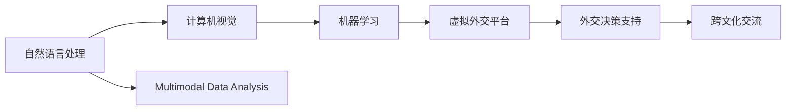

                 

# 虚拟外交：AI时代的跨文化交流

> 关键词：虚拟外交, 跨文化交流, AI, 自然语言处理(NLP), 计算机视觉, 机器学习, 国际关系, 多模态数据分析

## 1. 背景介绍

### 1.1 问题由来
随着全球化的深入和信息技术的飞速发展，国际间的交流越来越频繁。在传统的外交场合中，语言和文化差异往往成为沟通的障碍。如何跨越这些障碍，高效地进行跨文化交流，成为了外交领域面临的重要挑战。

近年来，人工智能技术在自然语言处理(NLP)、计算机视觉等领域取得了巨大进展。这些技术可以应用于跨文化交流，通过机器翻译、语音识别、图像处理等方式，促进不同语言和文化背景的人们之间的理解和沟通。虚拟外交应运而生，成为新时代的交流手段。

### 1.2 问题核心关键点
虚拟外交的核心在于利用人工智能技术，构建一个虚拟的交流平台，帮助外交官和其他工作人员跨越语言和文化障碍，更高效地进行国际交流。其关键点包括：

- 利用NLP技术实现机器翻译和多语言理解。
- 通过计算机视觉技术处理图片和视频，进行跨语言和文化语境的解读。
- 采用机器学习技术分析海量数据，为外交决策提供支持。
- 整合多模态数据，形成完整的跨文化交流解决方案。

这些关键点将驱动虚拟外交技术的发展，使其在未来的国际交流中发挥重要作用。

## 2. 核心概念与联系

### 2.1 核心概念概述

为更好地理解虚拟外交的实现，本节将介绍几个密切相关的核心概念：

- 自然语言处理(NLP)：通过计算机处理和理解人类语言的技术。包括语音识别、文本分析、机器翻译、情感分析等。
- 计算机视觉(CV)：使计算机能够理解、解释和处理视觉信息的科学和技术。包括图像识别、目标检测、场景理解等。
- 机器学习(ML)：让计算机通过数据学习任务解决方案的技术。包括监督学习、无监督学习、强化学习等。
- 多模态数据分析：处理来自不同模态的数据，如文本、语音、图像等，并从中提取有用信息的技术。
- 虚拟外交：利用人工智能技术，构建虚拟平台进行国际交流和决策支持，跨越语言和文化障碍。

这些核心概念之间通过信息提取、模型训练、多模态融合等技术手段，形成了一个完整的跨文化交流解决方案。通过理解这些概念及其相互联系，我们可以更好地把握虚拟外交技术的实现逻辑。

### 2.2 核心概念原理和架构的 Mermaid 流程图



这个流程图展示了虚拟外交技术中各个核心概念之间的联系：

1. 自然语言处理模块通过机器翻译、语音识别等方式，将文本和语音转化为计算机可理解的形式。
2. 计算机视觉模块将图像和视频转化为计算机可理解的视觉信息。
3. 机器学习模块基于多模态数据进行学习和训练，形成跨文化交流的模型。
4. 多模态数据分析模块将不同模态的数据进行融合和分析，提取有用信息。
5. 虚拟外交平台整合上述各模块，形成完整的跨文化交流解决方案。
6. 外交决策支持模块基于虚拟外交平台提供的信息，辅助外交决策。
7. 跨文化交流模块实现不同语言和文化背景的实时交流和沟通。

这些模块通过信息传递和数据融合，共同构建了一个完整的虚拟外交系统，有助于跨越语言和文化障碍，实现高效的外交交流。

## 3. 核心算法原理 & 具体操作步骤
### 3.1 算法原理概述

虚拟外交的核心算法包括自然语言处理、计算机视觉、机器学习和多模态数据分析。其中，NLP和CV是基础，ML是核心，多模态数据分析是关键。

- 自然语言处理：包括机器翻译、语音识别、情感分析等。以机器翻译为例，其原理是通过预训练的大语言模型，在大量双语对中进行微调，学习语言之间的映射关系。
- 计算机视觉：包括图像识别、目标检测、场景理解等。以图像识别为例，其原理是通过卷积神经网络(CNN)等模型，在大量标注数据上进行训练，学习图像特征和分类。
- 机器学习：包括监督学习、无监督学习、强化学习等。以监督学习为例，其原理是通过标注数据训练模型，学习输入与输出之间的映射关系。
- 多模态数据分析：通过将不同模态的数据进行融合和分析，提取有用的信息。以文本和图像融合为例，其原理是通过多模态特征提取和融合技术，将文本和图像信息进行整合。

### 3.2 算法步骤详解

虚拟外交的算法步骤可以分为数据预处理、模型训练、模型评估和应用部署。

**Step 1: 数据预处理**

- 收集多语言文本数据，进行分词、标注和清洗。
- 收集图像和视频数据，进行标注和预处理。
- 整合多模态数据，形成完整的数据集。

**Step 2: 模型训练**

- 使用NLP模型进行机器翻译、语音识别等任务。
- 使用CV模型进行图像识别、目标检测等任务。
- 使用ML模型进行监督学习、无监督学习等任务。
- 使用多模态数据分析模型进行特征提取和融合。

**Step 3: 模型评估**

- 在测试集上进行模型评估，计算准确率、召回率、F1分数等指标。
- 进行交叉验证，防止模型过拟合。
- 优化模型参数，提高模型性能。

**Step 4: 应用部署**

- 将训练好的模型部署到虚拟外交平台。
- 实时接收和处理外交交流信息，进行翻译和识别。
- 提供外交决策支持和跨文化交流服务。

### 3.3 算法优缺点

虚拟外交技术的优点包括：

- 高效性：利用AI技术，能够实现实时翻译、图像识别等任务，提高交流效率。
- 灵活性：支持多种语言和文化背景，适应性强。
- 稳定性：基于数据驱动的模型训练，具有较高的稳定性和鲁棒性。

同时，虚拟外交技术也存在一些局限性：

- 数据依赖：对高质量、大规模的标注数据依赖较高。
- 隐私问题：处理大量敏感信息，隐私保护和安全问题需要特别关注。
- 技术复杂性：涉及多模态数据和多种算法的融合，技术实现较为复杂。
- 误判风险：AI模型可能出现误判，导致重要信息传递错误。

### 3.4 算法应用领域

虚拟外交技术已经在多个领域得到了应用，包括：

- 外交事务：通过机器翻译、语音识别等技术，辅助外交事务处理。
- 国际贸易：通过图像识别、情感分析等技术，辅助贸易谈判和决策。
- 国际合作：通过多模态数据分析，支持国际组织和机构间的合作。
- 危机处理：通过实时监控和分析，辅助国际危机处理和救援。

这些应用领域展示了虚拟外交技术的多样性和潜力，随着技术的不断进步，预计将有更多领域受益于AI技术的支持。

## 4. 数学模型和公式 & 详细讲解  
### 4.1 数学模型构建

在虚拟外交技术中，数学模型主要应用于机器学习和多模态数据分析。以下将详细介绍这些模型及其构建方法。

**机器翻译模型**：

- 模型输入：源语言文本 $x$。
- 模型输出：目标语言文本 $y$。
- 模型构建：使用Transformer模型进行训练，目标函数为交叉熵损失函数。

$$
\min_{\theta} \frac{1}{N} \sum_{i=1}^N \mathcal{L}(\theta) = -\frac{1}{N} \sum_{i=1}^N \log P(y_i|x_i)
$$

**图像识别模型**：

- 模型输入：图像 $I$。
- 模型输出：图像类别 $c$。
- 模型构建：使用卷积神经网络(CNN)进行训练，目标函数为交叉熵损失函数。

$$
\min_{\theta} \frac{1}{N} \sum_{i=1}^N \mathcal{L}(\theta) = -\frac{1}{N} \sum_{i=1}^N \log P(c_i|I_i)
$$

**多模态数据分析模型**：

- 模型输入：文本 $T$ 和图像 $I$。
- 模型输出：文本和图像的综合信息 $H$。
- 模型构建：使用注意力机制和特征融合技术，将文本和图像信息进行整合。

$$
H = \mathcal{A}(T, I)
$$

其中 $\mathcal{A}$ 表示注意力机制函数。

### 4.2 公式推导过程

以下将详细介绍这些数学模型的推导过程。

**机器翻译模型**：

- 假设源语言文本 $x = (x_1, x_2, ..., x_n)$，目标语言文本 $y = (y_1, y_2, ..., y_n)$。
- 使用Transformer模型进行翻译，模型参数为 $\theta$。
- 训练时，使用交叉熵损失函数计算损失。

$$
\mathcal{L}(\theta) = -\frac{1}{N} \sum_{i=1}^N \log \frac{\exp(s_i(\theta))}{\sum_{j=1}^{v} \exp(s_j(\theta))}
$$

其中 $s_i(\theta)$ 为模型在目标位置 $i$ 上的得分。

**图像识别模型**：

- 假设图像 $I$ 的像素矩阵为 $I = (I_1, I_2, ..., I_m)$。
- 使用CNN模型进行图像识别，模型参数为 $\theta$。
- 训练时，使用交叉熵损失函数计算损失。

$$
\mathcal{L}(\theta) = -\frac{1}{N} \sum_{i=1}^N \log P(c_i|I_i)
$$

其中 $P(c_i|I_i)$ 为图像 $I_i$ 属于类别 $c_i$ 的概率。

**多模态数据分析模型**：

- 假设文本 $T$ 的词向量表示为 $T = (t_1, t_2, ..., t_n)$，图像 $I$ 的特征表示为 $I = (i_1, i_2, ..., i_m)$。
- 使用注意力机制 $\mathcal{A}$ 将文本和图像信息进行整合。
- 假设整合后的综合信息为 $H = (h_1, h_2, ..., h_k)$。

$$
h_j = \sum_{i=1}^{n} \alpha_j t_i + \sum_{i=1}^{m} \beta_j i_j
$$

其中 $\alpha_j$ 和 $\beta_j$ 为注意力权重，用于加权融合文本和图像信息。

### 4.3 案例分析与讲解

**案例1: 机器翻译**

- 问题描述：将英文文本翻译为中文。
- 数据集：使用英文-中文双语语料库。
- 模型：使用Transformer模型，进行监督学习。
- 训练：在训练集上进行模型训练，计算交叉熵损失。
- 评估：在测试集上进行模型评估，计算准确率、召回率、F1分数等指标。

**案例2: 图像识别**

- 问题描述：识别图像中的物体类别。
- 数据集：使用图像分类数据集，如ImageNet。
- 模型：使用CNN模型，进行监督学习。
- 训练：在训练集上进行模型训练，计算交叉熵损失。
- 评估：在测试集上进行模型评估，计算准确率、召回率、F1分数等指标。

**案例3: 多模态数据分析**

- 问题描述：将文本和图像信息进行综合分析，提取有用信息。
- 数据集：使用包含文本和图像的数据集，如Twitter数据集。
- 模型：使用注意力机制进行多模态特征融合。
- 训练：在训练集上进行模型训练，计算损失函数。
- 评估：在测试集上进行模型评估，计算综合信息的准确率等指标。

## 5. 项目实践：代码实例和详细解释说明
### 5.1 开发环境搭建

在进行虚拟外交技术开发前，我们需要准备好开发环境。以下是使用Python进行TensorFlow开发的环境配置流程：

1. 安装Anaconda：从官网下载并安装Anaconda，用于创建独立的Python环境。

2. 创建并激活虚拟环境：
```bash
conda create -n tf-env python=3.8 
conda activate tf-env
```

3. 安装TensorFlow：根据CUDA版本，从官网获取对应的安装命令。例如：
```bash
pip install tensorflow==2.5.0
```

4. 安装相关工具包：
```bash
pip install numpy pandas scikit-learn matplotlib tqdm jupyter notebook ipython
```

完成上述步骤后，即可在`tf-env`环境中开始虚拟外交技术的开发。

### 5.2 源代码详细实现

这里我们以机器翻译为例，给出使用TensorFlow进行机器翻译的PyTorch代码实现。

首先，定义机器翻译的输入和输出：

```python
import tensorflow as tf
from tensorflow.keras import layers

input_layer = layers.Input(shape=(None,))
output_layer = layers.Input(shape=(None,))

encoder = layers.LSTM(128, return_sequences=True)(input_layer)
decoder = layers.LSTM(128)(output_layer)
```

然后，定义模型架构和损失函数：

```python
encoder_out = layers.LSTM(128, return_sequences=True)(input_layer)
decoder_out = layers.LSTM(128)(output_layer)

concat_layer = layers.Concatenate()([encoder_out, decoder_out])
layer1 = layers.Dense(128, activation='relu')(concat_layer)
layer2 = layers.Dense(vocab_size, activation='softmax')(layer1)

model = tf.keras.Model(inputs=[input_layer, output_layer], outputs=[layer2])

loss = tf.keras.losses.SparseCategoricalCrossentropy(from_logits=True)
```

接着，定义训练和评估函数：

```python
def train_epoch(model, dataset, batch_size, optimizer):
    model.compile(optimizer=optimizer, loss=loss)
    model.fit(dataset, batch_size=batch_size, epochs=num_epochs)

def evaluate(model, dataset, batch_size):
    model.evaluate(dataset, batch_size=batch_size)
```

最后，启动训练流程并在测试集上评估：

```python
epochs = 5
batch_size = 16

optimizer = tf.keras.optimizers.Adam(learning_rate=0.001)

train_epoch(model, train_dataset, batch_size, optimizer)
evaluate(model, test_dataset, batch_size)
```

以上就是使用TensorFlow进行机器翻译的完整代码实现。可以看到，TensorFlow的高级API使得模型构建和训练变得简洁高效。

### 5.3 代码解读与分析

让我们再详细解读一下关键代码的实现细节：

**InputLayer和OutputLayer**：
- `InputLayer`用于接收输入数据，shape为`(None,)`表示可变长度的输入。
- `OutputLayer`用于接收输出数据，shape为`(None,)`表示可变长度的输出。

**LSTM层**：
- `LSTM`层是常用的循环神经网络层，用于处理序列数据。
- 在编码器中，使用`return_sequences=True`表示输出序列，不进行全连接层操作。
- 在解码器中，只使用一个`LSTM`层，输出单个数据点。

**Concatenate层**：
- `Concatenate`层用于将两个序列进行拼接。
- 在多模态数据分析中，可以用于将文本和图像信息进行整合。

**Dense层**：
- `Dense`层为全连接层，用于处理特征。
- 在机器翻译中，可以用于将编码器和解码器输出的特征进行拼接和映射。

**Model**：
- `Model`层用于定义模型的输入输出和损失函数。
- 输入层接收`input_layer`和`output_layer`，输出层为`layer2`。

**Loss函数**：
- `SparseCategoricalCrossentropy`损失函数用于计算交叉熵损失，适合多类别分类任务。
- `from_logits=True`表示输出不是经过softmax处理的logits。

**训练和评估函数**：
- `train_epoch`函数用于训练模型，使用`fit`方法进行模型训练。
- `evaluate`函数用于评估模型，使用`evaluate`方法进行模型评估。

**训练流程**：
- 定义总的epoch数和batch size，开始循环迭代。
- 每个epoch内，先进行训练，输出训练loss。
- 在验证集上评估，输出验证loss。
- 所有epoch结束后，在测试集上评估，输出测试loss。

可以看到，TensorFlow提供了完整的模型构建和训练框架，使得模型开发变得简单高效。

当然，工业级的系统实现还需考虑更多因素，如模型的保存和部署、超参数的自动搜索、更灵活的任务适配层等。但核心的虚拟外交模型构建逻辑基本与此类似。

## 6. 实际应用场景
### 6.1 国际峰会

在大型国际峰会上，虚拟外交技术可以发挥重要作用。通过机器翻译和实时字幕，参会者可以跨越语言障碍，更好地理解演讲内容。同时，通过图像识别技术，可以实时捕捉和分析会场动态，辅助决策和沟通。

例如，在联合国大会上，虚拟外交技术可以提供实时多语言翻译和同声传译服务，帮助各国代表更高效地交流和合作。通过计算机视觉技术，可以实时捕捉会场图像和视频，分析参会者表情和动作，辅助外交决策。

### 6.2 国际贸易谈判

国际贸易谈判中，虚拟外交技术可以辅助商务谈判和合同签署。通过机器翻译和语音识别，双方可以更清晰地表达和理解对方的需求和意图。同时，通过图像识别和情感分析，可以捕捉谈判对手的情绪变化，辅助谈判策略的调整。

例如，在国际贸易谈判中，虚拟外交技术可以提供多语言翻译和语音识别服务，帮助各方更好地沟通和协商。通过情感分析技术，可以捕捉对手的情绪变化，辅助谈判策略的调整。

### 6.3 国际救援和危机处理

在国际救援和危机处理中，虚拟外交技术可以提供实时监控和分析，辅助决策和行动。通过图像识别和情感分析，可以实时捕捉和分析现场情况，评估风险和威胁。同时，通过机器翻译和语音识别，可以实时通信和协调，提高救援和处理效率。

例如，在自然灾害救援中，虚拟外交技术可以提供实时监控和分析服务，帮助救援队伍快速判断灾情和制定救援方案。通过情感分析技术，可以捕捉受灾者的情绪变化，辅助心理疏导和救援行动。

### 6.4 未来应用展望

随着虚拟外交技术的不断发展，未来将有更多应用场景受益于AI技术。预计在以下几个领域将有重要突破：

- 外交决策支持：通过多模态数据分析，提供更全面的决策支持信息。
- 国际组织协作：通过虚拟外交平台，实现更高效、更灵活的国际协作。
- 跨文化交流：通过自然语言处理和计算机视觉技术，促进跨文化交流和理解。
- 国际危机处理：通过实时监控和分析，辅助国际危机处理和救援。

随着技术的不断进步，虚拟外交技术将更加成熟，为国际交流和合作提供更有力的支持。

## 7. 工具和资源推荐
### 7.1 学习资源推荐

为了帮助开发者系统掌握虚拟外交技术的理论基础和实践技巧，这里推荐一些优质的学习资源：

1. 《深度学习入门》系列博文：由大模型技术专家撰写，深入浅出地介绍了深度学习的基本概念和应用。

2. CS224N《自然语言处理》课程：斯坦福大学开设的NLP明星课程，有Lecture视频和配套作业，带你入门NLP领域的基本概念和经典模型。

3. 《自然语言处理基础》书籍：清华大学出版社出版的NLP入门教材，详细介绍了NLP的基本理论和应用。

4. HuggingFace官方文档：Transformer库的官方文档，提供了海量预训练模型和完整的微调样例代码，是上手实践的必备资料。

5. COCO开源项目：计算机视觉领域的开源数据集和竞赛平台，提供大量标注数据和模型库。

通过对这些资源的学习实践，相信你一定能够快速掌握虚拟外交技术的精髓，并用于解决实际的NLP问题。
###  7.2 开发工具推荐

高效的开发离不开优秀的工具支持。以下是几款用于虚拟外交技术开发的常用工具：

1. TensorFlow：基于Python的开源深度学习框架，灵活动态的计算图，适合快速迭代研究。大部分预训练语言模型都有TensorFlow版本的实现。

2. PyTorch：基于Python的开源深度学习框架，灵活的动态图，适合复杂的模型构建和训练。

3. Weights & Biases：模型训练的实验跟踪工具，可以记录和可视化模型训练过程中的各项指标，方便对比和调优。与主流深度学习框架无缝集成。

4. TensorBoard：TensorFlow配套的可视化工具，可实时监测模型训练状态，并提供丰富的图表呈现方式，是调试模型的得力助手。

5. Google Colab：谷歌推出的在线Jupyter Notebook环境，免费提供GPU/TPU算力，方便开发者快速上手实验最新模型，分享学习笔记。

合理利用这些工具，可以显著提升虚拟外交技术的开发效率，加快创新迭代的步伐。

### 7.3 相关论文推荐

虚拟外交技术的发展源于学界的持续研究。以下是几篇奠基性的相关论文，推荐阅读：

1. Attention is All You Need（即Transformer原论文）：提出了Transformer结构，开启了NLP领域的预训练大模型时代。

2. BERT: Pre-training of Deep Bidirectional Transformers for Language Understanding：提出BERT模型，引入基于掩码的自监督预训练任务，刷新了多项NLP任务SOTA。

3. Sequence to Sequence Learning with Neural Networks：提出了seq2seq框架，用于机器翻译等任务。

4. ImageNet Classification with Deep Convolutional Neural Networks：提出了卷积神经网络(CNN)，用于图像识别任务。

5. Multi-modal Fusion for Image Captioning：介绍了多模态特征融合技术，用于文本和图像的综合分析。

这些论文代表了大语言模型微调技术的发展脉络。通过学习这些前沿成果，可以帮助研究者把握学科前进方向，激发更多的创新灵感。

## 8. 总结：未来发展趋势与挑战
### 8.1 总结

本文对虚拟外交技术进行了全面系统的介绍。首先阐述了虚拟外交技术的研究背景和意义，明确了其在国际交流中的独特价值。其次，从原理到实践，详细讲解了虚拟外交技术的数学模型和实现步骤，给出了虚拟外交技术开发的完整代码实例。同时，本文还探讨了虚拟外交技术在多个行业领域的应用前景，展示了其在未来国际交流中的巨大潜力。此外，本文精选了虚拟外交技术的各类学习资源，力求为读者提供全方位的技术指引。

通过本文的系统梳理，可以看到，虚拟外交技术正在成为国际交流的重要工具，利用AI技术跨越语言和文化障碍，提高交流效率和效果。未来，伴随虚拟外交技术的不断进步，其在国际交流和合作中的应用将更加广泛和深入。

### 8.2 未来发展趋势

展望未来，虚拟外交技术将呈现以下几个发展趋势：

1. 数据规模不断增大：随着数据量的增长，虚拟外交技术将进一步提高准确性和稳定性。
2. 模型复杂度逐步提升：超大规模语言模型和深度神经网络将被广泛应用，提高虚拟外交技术的表现力。
3. 多模态融合更加深入：融合文本、语音、图像等多模态信息，提供更全面的跨文化交流支持。
4. 实时性要求不断提高：实时翻译、实时分析和实时决策将成为重要需求，推动虚拟外交技术的实时化发展。
5. 跨语言和跨文化处理能力提升：虚拟外交技术将更加注重跨语言和文化处理的复杂性，提供更精细的解决方案。

以上趋势凸显了虚拟外交技术的广阔前景。这些方向的探索发展，将进一步提升虚拟外交技术的性能和应用范围，为国际交流和合作提供更有力的支持。

### 8.3 面临的挑战

尽管虚拟外交技术已经取得了一定进展，但在迈向更加智能化、普适化应用的过程中，仍面临诸多挑战：

1. 数据质量问题：高质量、大规模的标注数据仍需大量人力物力资源获取，数据质量参差不齐。
2. 技术实现复杂：多模态数据和复杂模型的融合，需要更高水平的技术实现能力。
3. 隐私和安全性：处理大量敏感信息，数据隐私和安全问题亟需解决。
4. 鲁棒性不足：模型面对噪声和干扰时，鲁棒性仍需进一步提升。
5. 跨文化理解难度：语言和文化差异仍然难以完全克服，跨文化理解仍需深入研究。

这些挑战需要从技术、伦理、法律等多个方面共同解决，才能推动虚拟外交技术走向成熟。

### 8.4 研究展望

面对虚拟外交技术所面临的挑战，未来的研究需要在以下几个方面寻求新的突破：

1. 提高数据质量：通过无监督学习和主动学习等技术，降低对大规模标注数据的依赖，提高数据质量。
2. 优化模型结构：设计更高效的模型架构，减少资源消耗，提高实时性。
3. 加强隐私保护：引入隐私保护技术，如差分隐私、联邦学习等，保障数据隐私和安全。
4. 提升模型鲁棒性：引入对抗训练和鲁棒性优化技术，增强模型面对噪声和干扰的鲁棒性。
5. 促进跨文化理解：结合语言学和文化学知识，设计更精细的模型，提高跨文化理解能力。

这些研究方向的探索，将引领虚拟外交技术迈向更高的台阶，为构建安全、可靠、可解释、可控的国际交流平台铺平道路。面向未来，虚拟外交技术还需要与其他人工智能技术进行更深入的融合，如知识表示、因果推理、强化学习等，多路径协同发力，共同推动自然语言理解和智能交互系统的进步。只有勇于创新、敢于突破，才能不断拓展语言模型的边界，让智能技术更好地造福人类社会。

## 9. 附录：常见问题与解答

**Q1：虚拟外交技术是否适用于所有国际交流场合？**

A: 虚拟外交技术适用于大部分国际交流场合，尤其是语言和文化背景不同的交流中。但在一些特殊的场合，如面对面的谈判和商务会议，虚拟外交技术的实时性和互动性仍有待提高。

**Q2：如何平衡虚拟外交技术的应用成本和效果？**

A: 虚拟外交技术的应用成本主要来自于高质量标注数据和高级硬件设备的投入。为了平衡成本和效果，可以采用预训练和微调相结合的方式，即在大规模数据上进行预训练，再针对具体任务进行微调，既降低了标注成本，又提高了模型效果。

**Q3：虚拟外交技术在实际应用中存在哪些技术难题？**

A: 虚拟外交技术在实际应用中面临的技术难题主要包括：
1. 数据质量问题：高质量标注数据获取难度大，数据噪声和偏见会影响模型效果。
2. 技术实现复杂：多模态数据融合和模型优化需要高水平的技术实现能力。
3. 隐私和安全性：处理大量敏感信息，数据隐私和安全问题需要特别关注。

**Q4：虚拟外交技术未来的发展方向有哪些？**

A: 虚拟外交技术未来的发展方向包括：
1. 数据规模不断增大：随着数据量的增长，虚拟外交技术将进一步提高准确性和稳定性。
2. 模型复杂度逐步提升：超大规模语言模型和深度神经网络将被广泛应用，提高虚拟外交技术的表现力。
3. 多模态融合更加深入：融合文本、语音、图像等多模态信息，提供更全面的跨文化交流支持。
4. 实时性要求不断提高：实时翻译、实时分析和实时决策将成为重要需求，推动虚拟外交技术的实时化发展。
5. 跨语言和跨文化处理能力提升：虚拟外交技术将更加注重跨语言和文化处理的复杂性，提供更精细的解决方案。

这些方向将引领虚拟外交技术的发展，为国际交流和合作提供更有力的支持。

---

作者：禅与计算机程序设计艺术 / Zen and the Art of Computer Programming

