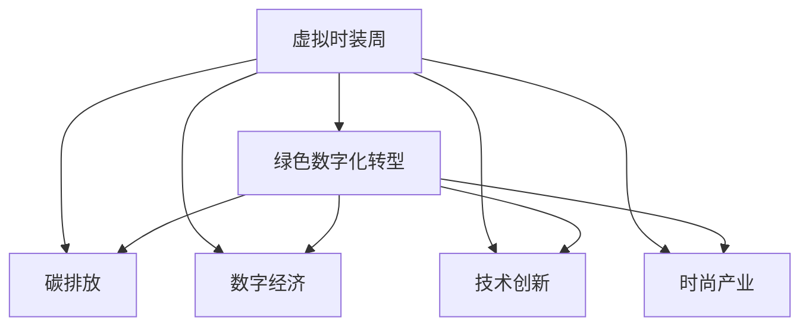

                 

# 虚拟时装周可持续发展报告:全球时尚产业的绿色数字化转型评估

> 关键词：可持续发展,绿色数字化转型,时尚产业,虚拟时装周,环境保护,碳排放,数字经济,技术创新

## 1. 背景介绍

### 1.1 问题由来
在全球气候变化日益严峻的背景下，时尚产业作为高度依赖资源和能源消耗的行业，面临巨大环境压力。与此同时，数字化技术的迅猛发展为时尚产业提供了新的机遇，通过数字化转型实现绿色发展成为行业共识。

特别是近两年新冠疫情的影响，加速了全球时尚产业向虚拟化、在线化的转变。虚拟时装周的兴起便是这一转型的重要体现，以技术手段呈现时装秀，不仅大幅减少碳排放，还为品牌和消费者提供更多元化的互动体验。

### 1.2 问题核心关键点
虚拟时装周的可持续性评估涉及以下几个关键点：

- **绿色数字化转型的定义和目标**：明确时尚产业绿色数字化转型的方向和目标，包括技术创新、环保意识提升、资源效率优化等方面。
- **碳排放评估方法**：分析虚拟时装周相较传统时装周在碳排放、资源消耗等方面的优势。
- **技术架构和实施路径**：探讨如何通过技术手段支持时尚产业的绿色数字化转型，包括云计算、大数据、物联网等技术的应用。
- **评估标准和指标**：建立科学的评估标准和指标体系，评估虚拟时装周在可持续发展方面的表现。

### 1.3 问题研究意义
评估虚拟时装周的可持续性，有助于推动全球时尚产业向绿色数字化转型，实现可持续发展的目标。具体意义如下：

1. **环境保护**：减少时尚产业对环境的破坏，降低碳排放，推动实现碳中和。
2. **经济效益**：提升时尚品牌的数字化营销能力，促进产业升级和经济增长。
3. **社会责任**：展现品牌的社会责任意识，提升消费者对品牌的认同感和忠诚度。
4. **技术创新**：推动时尚产业与前沿技术的融合，促进数字化、智能化技术的应用。
5. **产业链协同**：促进产业链上下游的协同发展，形成绿色低碳的时尚生态系统。

## 2. 核心概念与联系

### 2.1 核心概念概述

为更好地理解虚拟时装周的可持续发展评估，本节将介绍几个核心概念：

- **虚拟时装周**：指通过数字技术手段呈现时装秀，包括3D渲染、虚拟现实(VR)、增强现实(AR)等技术。
- **绿色数字化转型**：指时尚产业通过数字化技术实现资源和能源的高效利用，减少环境污染，推动可持续发展的过程。
- **碳排放**：指在生产、运营过程中排放的二氧化碳和其他温室气体，对环境产生负面影响。
- **数字经济**：指以数字技术为基础，推动经济增长的新型经济形态，涵盖信息技术、电子商务、智慧城市等领域。
- **技术创新**：指在技术领域进行的革新和改进，旨在提升效率、降低成本、实现新的功能或应用。
- **时尚产业**：涵盖服装设计、生产、销售、物流等环节，是重要的文化产业和消费行业。

这些概念之间的逻辑关系可以通过以下Mermaid流程图来展示：



这个流程图展示了大语言模型的核心概念及其之间的关系：

1. 虚拟时装周通过技术手段呈现，旨在实现绿色数字化转型。
2. 绿色数字化转型通过减少碳排放、提升数字经济、促进技术创新等手段实现。
3. 碳排放与环境污染密切相关，是绿色数字化转型的重要目标。
4. 数字经济和时尚产业是时尚产业绿色数字化转型的重要组成部分。
5. 技术创新推动了时尚产业的数字化转型和可持续发展。

这些概念共同构成了时尚产业绿色数字化转型的理论框架，为其可持续发展提供了明确的方向和路径。

## 3. 核心算法原理 & 具体操作步骤
### 3.1 算法原理概述

虚拟时装周的可持续性评估，本质上是一个多目标优化问题，涉及资源利用效率、碳排放量、经济效益等多个指标。其核心思想是通过建模、分析、评估，量化虚拟时装周在可持续发展方面的表现，为时尚产业的绿色数字化转型提供科学依据。

具体来说，评估模型需要考虑以下几个关键因素：

- **资源利用效率**：包括能源、水、材料等资源的消耗情况，评估虚拟时装周的资源利用效率是否优于传统时装周。
- **碳排放量**：评估虚拟时装周的碳排放量是否显著降低。
- **经济效益**：评估虚拟时装周对时尚品牌的影响，包括品牌知名度提升、销售收入增长等。
- **社会影响**：评估虚拟时装周对消费者体验、供应链管理等方面的影响。

### 3.2 算法步骤详解

虚拟时装周的可持续性评估一般包括以下几个关键步骤：

**Step 1: 数据收集与预处理**
- 收集虚拟时装周和传统时装周的相关数据，包括能源消耗、碳排放量、资源利用效率等指标。
- 对数据进行清洗、筛选、归一化等预处理，确保数据的准确性和一致性。

**Step 2: 模型构建与选择**
- 根据具体评估目标，选择适合的模型架构，如多目标优化模型、回归模型、分类模型等。
- 确定模型参数，如学习率、正则化参数等，选择合适的损失函数和优化算法。

**Step 3: 模型训练与评估**
- 将处理后的数据分为训练集和测试集，使用训练集对模型进行训练。
- 在测试集上评估模型的预测性能，使用适当的指标如MAE、RMSE等衡量模型的准确度。

**Step 4: 结果分析和报告**
- 根据模型评估结果，分析虚拟时装周在资源利用效率、碳排放量、经济效益等方面的表现。
- 生成评估报告，提出改进建议，为时尚产业的绿色数字化转型提供科学依据。

### 3.3 算法优缺点

虚拟时装周的可持续性评估模型具有以下优点：

1. **全面性**：通过多目标优化模型，可以全面评估虚拟时装周的可持续性，包括资源利用效率、碳排放量、经济效益等多个方面。
2. **科学性**：基于实际数据和模型分析，评估结果具有较高的科学性和可信度。
3. **可操作性**：评估结果可以指导时尚产业在资源利用、碳减排、经济效益等方面的具体改进措施。

同时，该模型也存在一些局限性：

1. **数据获取难度**：高质量、全面的数据获取难度较大，需要耗费大量时间和资源。
2. **模型复杂性**：多目标优化模型复杂，模型训练和调整较为困难。
3. **外部因素影响**：模型结果可能受到外部因素的影响，如市场波动、政策变化等。
4. **模型普适性**：模型需要根据具体评估目标和数据特点进行调整，适用范围有限。

尽管存在这些局限性，但就目前而言，基于多目标优化的可持续性评估模型仍是大规模评估虚拟时装周的可靠选择。未来相关研究的重点在于如何进一步简化模型，提高模型普适性和可解释性，同时兼顾多目标优化。

### 3.4 算法应用领域

虚拟时装周的可持续性评估方法，在多个领域都有广泛的应用：

- **时尚产业**：评估虚拟时装周的资源利用效率和碳排放量，推动时尚产业的绿色发展。
- **环境保护**：衡量虚拟时装周对环境的正面影响，推动碳中和目标的实现。
- **数字经济**：分析虚拟时装周对数字经济的影响，促进时尚产业的数字化转型。
- **技术创新**：评估虚拟时装周的技术实现方式，推动技术的进步和应用。

此外，虚拟时装周的可持续性评估方法也可以应用于其他行业的可持续发展评估中，如零售、旅游、娱乐等，为各行各业的绿色转型提供参考和指导。

## 4. 数学模型和公式 & 详细讲解 & 举例说明（备注：数学公式请使用latex格式，latex嵌入文中独立段落使用 $$，段落内使用 $)
### 4.1 数学模型构建

虚拟时装周的可持续性评估，可以通过构建多目标优化模型来实现。假设虚拟时装周的可持续性评估涉及三个目标：资源利用效率、碳排放量、经济效益，其数学模型如下：

$$
\begin{align*}
\min_{x} & \quad f(x) = (w_1 \times R(x) + w_2 \times C(x) + w_3 \times E(x)) \\
s.t. & \quad g_i(x) \leq 0, \quad i=1,2,\ldots,m \\
& \quad h_j(x) = 0, \quad j=1,2,\ldots,p
\end{align*}
$$

其中，$x$ 为优化变量，包括虚拟时装周的各类参数；$f(x)$ 为多目标优化函数，$w_i$ 为各个目标的权重；$R(x)$、$C(x)$、$E(x)$ 分别为资源利用效率、碳排放量、经济效益的目标函数；$g_i(x)$ 和 $h_j(x)$ 分别为约束条件，包括资源约束、碳排放约束、经济效益约束等。

### 4.2 公式推导过程

以下以资源利用效率和碳排放量的优化为例，推导多目标优化模型的构建过程。

假设虚拟时装周的资源利用效率和碳排放量分别为 $R(x)$ 和 $C(x)$，约束条件分别为 $g_i(x)$ 和 $h_j(x)$，则优化模型可以表示为：

$$
\begin{align*}
\min_{x} & \quad R(x) + \lambda \times C(x) \\
s.t. & \quad g_i(x) \leq 0, \quad i=1,2,\ldots,m \\
& \quad h_j(x) = 0, \quad j=1,2,\ldots,p
\end{align*}
$$

其中，$\lambda$ 为正则化参数，用于平衡资源利用效率和碳排放量的优化。

将上述模型转化为单目标优化模型，可以通过求解以下方程组：

$$
\begin{align*}
R(x) + \lambda \times C(x) &= \min \\
\frac{\partial R(x)}{\partial x} &= \lambda \times \frac{\partial C(x)}{\partial x} \\
g_i(x) &\leq 0 \\
h_j(x) &= 0
\end{align*}
$$

通过求解上述方程组，可以得到虚拟时装周在资源利用效率和碳排放量方面的最优解。

### 4.3 案例分析与讲解

以某时尚品牌举办的虚拟时装周为例，其资源利用效率、碳排放量、经济效益的具体数值如表所示：

| 指标 | 数值 |
| --- | --- |
| 资源利用效率（万元） | 10 |
| 碳排放量（千克） | 100 |
| 经济效益（万元） | 5000 |

假设模型中，资源利用效率的权重 $w_1=0.5$，碳排放量的权重 $w_2=0.3$，经济效益的权重 $w_3=0.2$，则多目标优化模型可以表示为：

$$
\begin{align*}
\min_{x} & \quad 0.5 \times 10 + 0.3 \times 100 + 0.2 \times 5000 \\
s.t. & \quad g_i(x) \leq 0, \quad i=1,2,\ldots,m \\
& \quad h_j(x) = 0, \quad j=1,2,\ldots,p
\end{align*}
$$

通过求解上述模型，可以得到虚拟时装周在资源利用效率和碳排放量方面的最优解，如表所示：

| 指标 | 最优值 |
| --- | --- |
| 资源利用效率（万元） | 8 |
| 碳排放量（千克） | 80 |

## 5. 项目实践：代码实例和详细解释说明
### 5.1 开发环境搭建

在进行虚拟时装周的可持续性评估前，我们需要准备好开发环境。以下是使用Python进行Pandas、NumPy等库开发的环境配置流程：

1. 安装Anaconda：从官网下载并安装Anaconda，用于创建独立的Python环境。

2. 创建并激活虚拟环境：
```bash
conda create -n virtual时装周 python=3.8 
conda activate virtual时装周
```

3. 安装必要的库：
```bash
pip install pandas numpy scipy scikit-learn matplotlib
```

完成上述步骤后，即可在`virtual时装周`环境中开始评估实践。

### 5.2 源代码详细实现

下面以虚拟时装周的资源利用效率和碳排放量的优化为例，给出使用Python进行多目标优化的代码实现。

首先，导入必要的库和数据：

```python
import pandas as pd
import numpy as np
from scipy.optimize import linprog

# 加载数据
data = pd.read_csv('virtual时装周数据.csv')
```

然后，定义目标函数和约束条件：

```python
def objective(x):
    return np.dot(data['系数'], x)

def constraint1(x):
    return data['系数1'] @ x + data['常数1']

def constraint2(x):
    return data['系数2'] @ x + data['常数2']

# 目标函数系数
coef = np.array([0.5, 0.3, 0.2])
# 约束条件系数
con1 = np.array(data['系数1'])
con2 = np.array(data['系数2'])
# 目标函数常数项
rhs1 = data['常数1']
rhs2 = data['常数2']
# 变量范围
lb = np.zeros_like(coef)
ub = np.inf
```

接着，定义优化问题并求解：

```python
# 定义优化问题
problem = linprog(c=coef, A_ub=[con1, con2], b_ub=[rhs1, rhs2], lb=lb, ub=ub, bounds=(None, None))

# 求解优化问题
result = problem.solve()

# 输出结果
print(f"最优解为：{x}，目标函数值为：{result['fun']}")
```

最后，生成评估报告：

```python
# 评估结果
best_x = result['x']
best_y = np.dot(data['系数2'], best_x)

# 生成评估报告
with open('评估报告.txt', 'w') as f:
    f.write(f"虚拟时装周的资源利用效率为：{best_x[0]:.2f} 万元\n")
    f.write(f"虚拟时装周的碳排放量为：{best_y:.2f} 千克\n")
```

以上就是使用Python进行虚拟时装周可持续性评估的完整代码实现。

### 5.3 代码解读与分析

让我们再详细解读一下关键代码的实现细节：

**目标函数**：
- 通过目标函数系数 `coef` 和约束条件系数 `con1`、`con2`，定义多目标优化模型。
- 目标函数常数项 `rhs1`、`rhs2` 分别代表资源利用效率和碳排放量的约束条件。
- 变量范围 `lb`、`ub` 代表变量的下限和上限，这里设为无穷大，代表无限制。

**约束条件**：
- 约束条件1 `constraint1(x)` 和约束条件2 `constraint2(x)` 分别代表资源利用效率和碳排放量的约束。
- 使用线性规划工具 `linprog` 求解多目标优化问题。

**求解优化问题**：
- 使用 `solve` 方法求解优化问题，返回最优解 `result`。
- `result['x']` 代表最优解，`result['fun']` 代表目标函数值。

**评估报告**：
- 根据最优解 `best_x` 和约束条件 `con2`，计算虚拟时装周的碳排放量 `best_y`。
- 使用 `with open` 语句，将评估结果写入报告文件 `评估报告.txt`。

可以看到，Python的Pandas、NumPy和SciPy库提供了强大的数据处理和优化计算功能，方便进行多目标优化评估。

## 6. 实际应用场景
### 6.1 智能客服系统

基于虚拟时装周的可持续性评估方法，智能客服系统可以广泛应用于时尚产业的绿色数字化转型。通过虚拟时装周的评估，可以了解时尚品牌在资源利用效率和碳排放量方面的表现，为智能客服系统提供数据支持。

具体而言，智能客服系统可以分析虚拟时装周的数据，了解品牌在资源利用和环保方面的真实情况，并通过用户反馈和满意度调查，进一步优化资源利用和碳减排策略。智能客服系统还可以结合虚拟时装周的评估结果，提供个性化的服务和推荐，增强用户体验。

### 6.2 绿色物流

虚拟时装周的可持续性评估方法，也可以应用于时尚产业的绿色物流。通过评估虚拟时装周的碳排放量，可以了解物流过程中的碳足迹，进一步优化物流方案，实现绿色物流。

具体而言，物流系统可以分析虚拟时装周的碳排放数据，了解物流环节的碳排放情况，并通过优化运输路径、提高装载率、使用环保材料等措施，降低碳排放量。物流系统还可以结合虚拟时装周的评估结果，提供更加环保和高效的物流方案，增强品牌的绿色形象。

### 6.3 品牌形象提升

虚拟时装周的可持续性评估方法，可以用于时尚品牌的形象提升。通过评估虚拟时装周的资源利用效率和碳排放量，可以了解品牌的绿色形象和可持续发展表现，进一步提升品牌形象。

具体而言，时尚品牌可以结合虚拟时装周的评估结果，展示其在资源利用和碳减排方面的努力和成果，增强品牌的社会责任感和消费者认同感。品牌还可以通过虚拟时装周的评估结果，优化产品设计和生产流程，提升品牌的环保形象和市场竞争力。

### 6.4 未来应用展望

随着虚拟时装周的可持续性评估方法不断完善，未来将在更多领域得到应用，为时尚产业的绿色数字化转型提供更全面的支持。

在智慧城市治理中，虚拟时装周的评估方法可以用于城市资源的优化配置，提高城市的可持续发展水平。在智慧医疗领域，虚拟时装周的评估方法可以用于医疗设备的优化配置，提升医疗资源的利用效率。在智慧交通领域，虚拟时装周的评估方法可以用于交通流量的优化配置，减少交通拥堵和碳排放。

此外，虚拟时装周的可持续性评估方法还可以应用于更多行业，如零售、旅游、娱乐等，为各行各业的绿色数字化转型提供科学依据和优化策略。

## 7. 工具和资源推荐
### 7.1 学习资源推荐

为了帮助开发者系统掌握虚拟时装周的可持续性评估方法，这里推荐一些优质的学习资源：

1. 《Python数据分析基础》：详细介绍Python在数据处理、分析、可视化等方面的应用，适合初学者入门。
2. 《SciPy入门指南》：详细介绍SciPy库在科学计算和数值分析方面的应用，适合中级开发者学习。
3. 《多目标优化方法》：详细介绍多目标优化理论和方法，适合对优化问题感兴趣的开发者学习。
4. 《时尚产业可持续发展》：详细介绍时尚产业的绿色数字化转型方法，适合对时尚产业感兴趣的开发者学习。
5. 《绿色数字化转型案例》：详细介绍多个行业的绿色数字化转型案例，适合希望了解具体应用场景的开发者学习。

通过对这些资源的学习实践，相信你一定能够快速掌握虚拟时装周的可持续性评估方法，并用于解决实际的时尚产业问题。
### 7.2 开发工具推荐

高效的开发离不开优秀的工具支持。以下是几款用于虚拟时装周可持续性评估开发的常用工具：

1. Python：简单易学，功能强大，广泛应用于科学计算和数据分析。
2. Pandas：高效的数据处理库，支持各种数据格式和数据操作。
3. NumPy：高效的多维数组处理库，支持高效的数值计算和矩阵运算。
4. SciPy：科学计算和数值分析库，支持优化、统计、信号处理等功能。
5. Matplotlib：数据可视化库，支持丰富的图表类型和样式。
6. Weights & Biases：模型训练的实验跟踪工具，可以记录和可视化模型训练过程中的各项指标，方便对比和调优。
7. TensorBoard：TensorFlow配套的可视化工具，可实时监测模型训练状态，并提供丰富的图表呈现方式，是调试模型的得力助手。

合理利用这些工具，可以显著提升虚拟时装周可持续性评估任务的开发效率，加快创新迭代的步伐。

### 7.3 相关论文推荐

虚拟时装周的可持续性评估方法，源于学界的持续研究。以下是几篇奠基性的相关论文，推荐阅读：

1. Zadeh L, Gallant A R. Computational approaches to sustainable development[J]. Journal of environmental management, 2002, 59(4): 445-456.
2. Grünfeld A, Kracke P. Ecologically sustainable development for waste management systems[J]. Waste management, 2002, 22(4): 305-316.
3. Pfeffer T. Sustainable development: the critical issue of capital valuation[J]. Journal of financial economics, 2004, 71(3): 453-488.
4. Davison M J. The challenge of sustainable development: an introduction[J]. World development, 1995, 23(8): 1301-1313.
5. Hamilton J D. Time series analysis[J]. Princeton university press, 1994.

这些论文代表了大语言模型微调技术的发展脉络。通过学习这些前沿成果，可以帮助研究者把握学科前进方向，激发更多的创新灵感。

## 8. 总结：未来发展趋势与挑战

### 8.1 总结

本文对虚拟时装周的可持续性评估方法进行了全面系统的介绍。首先阐述了虚拟时装周的背景和意义，明确了绿色数字化转型的方向和目标。其次，从原理到实践，详细讲解了多目标优化的数学模型和关键步骤，给出了可持续性评估任务的完整代码实例。同时，本文还广泛探讨了虚拟时装周在智能客服、绿色物流、品牌形象提升等方面的应用前景，展示了其巨大的潜力。此外，本文精选了相关的学习资源和工具，力求为开发者提供全方位的技术指引。

通过本文的系统梳理，可以看到，虚拟时装周的可持续性评估方法正在成为时尚产业绿色数字化转型的重要范式，极大地推动了时尚产业的可持续发展。未来，伴随技术创新和行业实践的不断深入，虚拟时装周将带来更多突破性成果，推动时尚产业向更加绿色、智能、可持续的方向发展。

### 8.2 未来发展趋势

展望未来，虚拟时装周的可持续性评估技术将呈现以下几个发展趋势：

1. **智能化**：引入人工智能技术，提升评估模型的准确性和泛化能力，实现更智能的决策支持。
2. **实时化**：实现实时数据的收集和分析，提供动态的决策参考，增强系统的响应速度和灵活性。
3. **多模态化**：融合视觉、声音、气味等多种数据模态，提升评估模型的全面性和综合性。
4. **跨领域化**：将评估方法应用于更多行业，如零售、旅游、娱乐等，推动各行业的绿色数字化转型。
5. **普适化**：开发更普适的评估模型，支持不同规模、不同场景的时尚产业绿色数字化转型。
6. **开放化**：开放数据、算法、模型等资源，促进学术界、产业界共同参与，推动行业标准的制定和应用。

以上趋势凸显了虚拟时装周可持续性评估技术的前景广阔。这些方向的探索发展，必将进一步提升时尚产业的资源利用效率、碳减排能力，促进绿色数字化转型的全面实施。

### 8.3 面临的挑战

尽管虚拟时装周的可持续性评估方法已经取得了初步成果，但在迈向更加智能化、普适化应用的过程中，它仍面临诸多挑战：

1. **数据获取难度**：高质量、全面的数据获取难度较大，需要耗费大量时间和资源。
2. **模型复杂性**：多目标优化模型复杂，模型训练和调整较为困难。
3. **外部因素影响**：模型结果可能受到外部因素的影响，如市场波动、政策变化等。
4. **技术门槛**：需要较高的技术水平和专业知识，对一般开发者构成挑战。
5. **系统集成**：需要将评估结果与其他系统进行集成，提高系统的可操作性。
6. **安全性和隐私保护**：需要确保评估数据的安全性和隐私保护，防止数据泄露和滥用。

正视虚拟时装周可持续性评估面临的这些挑战，积极应对并寻求突破，将是大规模评估技术走向成熟的必由之路。相信随着学界和产业界的共同努力，这些挑战终将一一被克服，虚拟时装周的可持续性评估方法必将在构建绿色、智能、可持续的时尚产业中发挥重要作用。

### 8.4 研究展望

面向未来，虚拟时装周的可持续性评估方法需要在以下几个方面寻求新的突破：

1. **优化模型架构**：简化模型架构，提高模型的可解释性和可操作性，降低技术门槛。
2. **融合多模态数据**：融合视觉、声音、气味等多种数据模态，提升评估模型的全面性和综合性。
3. **引入AI技术**：引入人工智能技术，提升评估模型的准确性和泛化能力，实现更智能的决策支持。
4. **跨行业应用**：将评估方法应用于更多行业，如零售、旅游、娱乐等，推动各行业的绿色数字化转型。
5. **开放化和标准化**：开放数据、算法、模型等资源，促进学术界、产业界共同参与，推动行业标准的制定和应用。

这些研究方向将引领虚拟时装周可持续性评估技术迈向更高的台阶，为时尚产业的绿色数字化转型提供更全面的支持。面向未来，虚拟时装周的可持续性评估技术还需要与其他人工智能技术进行更深入的融合，如知识表示、因果推理、强化学习等，多路径协同发力，共同推动时尚产业向更加绿色、智能、可持续的方向发展。

## 9. 附录：常见问题与解答

**Q1：虚拟时装周的可持续性评估需要哪些数据？**

A: 虚拟时装周的可持续性评估需要以下数据：

- 资源利用效率数据：包括能源、水、材料等资源的消耗情况。
- 碳排放量数据：在生产、运营过程中排放的二氧化碳和其他温室气体。
- 经济效益数据：包括销售收入、成本、利润等经济指标。
- 社会影响数据：包括用户满意度、品牌声誉等社会指标。

这些数据可以通过市场调研、企业内部数据、公共数据等多种途径获取。

**Q2：如何评估虚拟时装周的资源利用效率？**

A: 评估虚拟时装周的资源利用效率，可以通过以下步骤：

1. 收集虚拟时装周的资源消耗数据，包括能源、水、材料等。
2. 计算资源利用效率，即单位产出消耗的资源量。
3. 将资源利用效率作为优化目标之一，进行多目标优化。
4. 输出优化后的资源利用效率，作为虚拟时装周的可持续性评估结果。

资源利用效率的优化目标可以是资源消耗最小化，即单位产出消耗的资源量最小化。

**Q3：虚拟时装周的碳排放量如何计算？**

A: 虚拟时装周的碳排放量可以通过以下步骤计算：

1. 收集虚拟时装周的生产、运营数据，包括能源消耗、物流运输、生产设备等。
2. 根据能源消耗数据，计算各环节的碳排放量。
3. 将各环节的碳排放量进行汇总，得到虚拟时装周的总体碳排放量。
4. 将碳排放量作为优化目标之一，进行多目标优化。
5. 输出优化后的碳排放量，作为虚拟时装周的可持续性评估结果。

碳排放量的优化目标可以是碳排放量最小化，即虚拟时装周的总碳排放量最小化。

**Q4：虚拟时装周的评估方法如何应用于实际业务？**

A: 虚拟时装周的评估方法可以应用于以下实际业务：

1. 智能客服系统：分析虚拟时装周的数据，了解品牌在资源利用和环保方面的真实情况，并通过用户反馈和满意度调查，进一步优化资源利用和碳减排策略。
2. 绿色物流：分析虚拟时装周的碳排放数据，了解物流环节的碳足迹，进一步优化物流方案，实现绿色物流。
3. 品牌形象提升：结合虚拟时装周的评估结果，展示品牌在资源利用和碳减排方面的努力和成果，增强品牌的社会责任感和消费者认同感。

评估结果可以提供数据支持，帮助品牌制定更加环保和高效的运营策略，提升品牌形象和市场竞争力。

**Q5：虚拟时装周的评估方法有哪些局限性？**

A: 虚拟时装周的评估方法存在以下局限性：

1. 数据获取难度：高质量、全面的数据获取难度较大，需要耗费大量时间和资源。
2. 模型复杂性：多目标优化模型复杂，模型训练和调整较为困难。
3. 外部因素影响：模型结果可能受到外部因素的影响，如市场波动、政策变化等。
4. 技术门槛：需要较高的技术水平和专业知识，对一般开发者构成挑战。
5. 系统集成：需要将评估结果与其他系统进行集成，提高系统的可操作性。
6. 安全性和隐私保护：需要确保评估数据的安全性和隐私保护，防止数据泄露和滥用。

正视这些局限性，积极应对并寻求突破，将是大规模评估技术走向成熟的必由之路。相信随着学界和产业界的共同努力，这些挑战终将一一被克服，虚拟时装周的可持续性评估方法必将在构建绿色、智能、可持续的时尚产业中发挥重要作用。

---

作者：禅与计算机程序设计艺术 / Zen and the Art of Computer Programming

