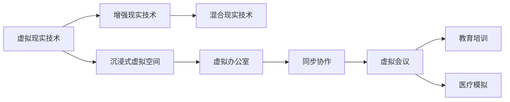

                 

# 虚拟现实工作空间创业：远程办公的未来模式

## 1. 背景介绍

### 1.1 问题由来

随着全球化的加速和互联网技术的普及，远程办公逐渐成为越来越多企业和员工的首选工作模式。疫情的爆发更是加速了这一进程，使得全球范围内的企业纷纷转向远程工作。然而，传统的远程办公模式也存在诸多痛点，如沟通效率低下、团队协作不便、员工孤独感增加等问题，使得许多企业在逐渐回归线下办公。

在这种背景下，虚拟现实(VR)技术应运而生，其沉浸式和互动性的特点使其成为远程办公的理想解决方案。虚拟现实工作空间，即通过虚拟现实技术构建的办公室环境，能够让远程工作者仿佛身处真实的办公室，进行面对面交流、共享文件、协同工作，实现与传统办公模式相似的体验。

### 1.2 问题核心关键点

本节将详细阐述虚拟现实工作空间的定义、特点、优势及其应用场景，探讨其对远程办公模式的革新意义。

- **定义**：虚拟现实工作空间是指通过VR技术构建的办公室环境，使得远程工作者可以沉浸在虚拟空间中，实现与同事的互动和协作。

- **特点**：沉浸式、互动性强、支持多人同步、灵活的办公环境。

- **优势**：提高沟通效率、增强团队协作、降低孤独感、提升工作体验。

- **应用场景**：企业办公室、远程会议、教育培训、医疗模拟等。

## 2. 核心概念与联系

### 2.1 核心概念概述

为了更好地理解虚拟现实工作空间的实现原理和工作方式，本节将介绍几个关键概念：

- **虚拟现实技术(VR)**：通过计算机生成模拟的三维环境，使用户能够沉浸在虚拟空间中，并与虚拟对象进行交互。

- **增强现实技术(AR)**：将虚拟信息叠加到现实世界中，增强用户对现实世界的感知。

- **混合现实技术(MR)**：结合VR和AR，提供更加丰富和沉浸的体验。

- **沉浸式虚拟空间**：完全由计算机生成的虚拟环境，用户可以自由探索。

- **同步协作**：多个用户在同一虚拟空间内实时互动和协作。

- **虚拟办公室**：由计算机模拟的办公室环境，支持各类办公活动。

这些概念之间的逻辑关系可以通过以下Mermaid流程图来展示：



该流程图展示了虚拟现实工作空间的核心概念及其关联关系：

1. 虚拟现实技术是虚拟工作空间的基础。
2. 增强现实技术增强了虚拟工作空间的交互性。
3. 混合现实技术结合了虚拟和现实，提高了虚拟工作空间的灵活性。
4. 沉浸式虚拟空间为用户提供了自由探索的环境。
5. 虚拟办公室是虚拟工作空间的核心应用场景。
6. 同步协作和虚拟会议等应用场景，拓展了虚拟工作空间的实践价值。

## 3. 核心算法原理 & 具体操作步骤

### 3.1 算法原理概述

虚拟现实工作空间的构建，涉及计算机图形学、网络通信、多媒体处理等多个领域的知识。其核心算法包括：

- **三维建模和渲染**：构建虚拟环境的三维模型，并进行实时渲染。
- **网络通信**：保证多个用户之间的实时互动和同步协作。
- **用户交互**：提供交互式的用户界面，实现对虚拟环境的操作和控制。
- **定位和追踪**：精确定位用户的位置和姿态，支持虚拟环境的自由移动。

### 3.2 算法步骤详解

以下是虚拟现实工作空间构建的一般流程：

**Step 1: 准备虚拟环境**

1. **设计虚拟空间**：根据企业需求，设计虚拟办公室的布局和风格，包括工作台、会议室、休息区等。
2. **创建三维模型**：使用3D建模软件创建虚拟空间的三维模型，并将其导出为支持VR渲染的格式。
3. **导入渲染引擎**：将三维模型导入VR渲染引擎，设置光照、材质、纹理等参数，进行渲染优化。

**Step 2: 实现网络通信**

1. **选择通信协议**：选择适合VR应用的网络通信协议，如RTSP、RTMP、WebRTC等。
2. **搭建服务器**：部署服务器，搭建虚拟环境的通信网络，支持多个用户的同时访问。
3. **实时传输**：通过实时传输协议，将虚拟环境的三维数据和音频信息传输到用户的终端设备。

**Step 3: 开发用户交互界面**

1. **界面设计**：设计用户交互界面，包括菜单、工具栏、操作按钮等，提供对虚拟环境的控制。
2. **输入输出**：实现用户输入和输出的处理，如键盘、鼠标、手势、语音命令等。
3. **界面渲染**：将用户操作反馈到虚拟环境中，实现实时渲染。

**Step 4: 实现定位和追踪**

1. **选择传感器**：选择适合的传感器，如头显位置传感器、体感控制器等。
2. **安装传感器**：在用户的终端设备上安装传感器，用于实时监测用户的位置和姿态。
3. **数据融合**：将传感器的数据与虚拟环境的数据进行融合，实现虚拟环境与现实环境的结合。

**Step 5: 部署和测试**

1. **部署应用**：将虚拟工作空间部署到企业内网或公网上，提供给员工使用。
2. **用户培训**：对员工进行虚拟工作空间的培训，指导其使用虚拟环境的各项功能。
3. **性能测试**：进行性能测试，优化渲染效果和网络通信性能，确保系统稳定运行。

### 3.3 算法优缺点

虚拟现实工作空间具有以下优点：

- **沉浸式体验**：提供沉浸式的办公环境，增强员工的沉浸感和参与感。
- **灵活办公**：支持随时随地办公，不受物理位置的限制。
- **提升效率**：通过虚拟会议、协作平台等，提升团队协作效率和信息共享速度。
- **个性化设计**：用户可以自由定制虚拟办公室的布局和风格，满足个性化需求。

同时，虚拟现实工作空间也存在一些缺点：

- **设备成本高**：需要高成本的VR设备，如头显、体感控制器等。
- **技术门槛高**：需要专业的技术支持，如建模、渲染、网络通信等。
- **硬件兼容性差**：不同品牌和型号的设备可能存在兼容性问题。
- **操作复杂**：初期使用需要一定的学习成本，可能影响部分用户的体验。

### 3.4 算法应用领域

虚拟现实工作空间不仅适用于传统的办公室环境，还具备广泛的应用场景，例如：

- **企业办公室**：在企业内部构建虚拟工作空间，支持远程员工的办公和协作。
- **远程会议**：通过虚拟会议室进行远程会议，支持多人实时互动。
- **教育培训**：在虚拟环境中进行培训和模拟，增强学生的互动体验。
- **医疗模拟**：构建虚拟手术室和医疗场景，提高医生的实战能力和经验。
- **虚拟旅游**：提供沉浸式的虚拟旅游体验，增强游客的互动和参与感。

## 4. 数学模型和公式 & 详细讲解 & 举例说明

### 4.1 数学模型构建

虚拟现实工作空间的构建，涉及复杂的数学模型。这里以虚拟会议系统为例，详细讲解其数学模型和关键公式。

假设虚拟会议系统由 $N$ 个用户参与，每个用户的位置和姿态由 $(x_i,y_i,z_i)$ 和 $(\alpha_i,\beta_i,\gamma_i)$ 表示。系统构建一个虚拟会议室 $M$，每个用户可以通过VR设备在会议室中自由移动和操作。

**Step 1: 三维模型渲染**

三维模型 $M$ 的渲染过程可以通过以下公式表示：

$$
\text{R} = \sum_{i=1}^N (x_i,y_i,z_i) + \sum_{i=1}^N (\alpha_i,\beta_i,\gamma_i)
$$

其中 $\text{R}$ 表示渲染后的虚拟会议室，$(x_i,y_i,z_i)$ 和 $(\alpha_i,\beta_i,\gamma_i)$ 分别表示每个用户的位置和姿态。

**Step 2: 网络通信**

虚拟会议系统的网络通信过程可以通过以下公式表示：

$$
\text{T} = \text{R} \times \text{N} \times \text{W}
$$

其中 $\text{T}$ 表示网络传输时间，$\text{N}$ 表示用户的数量，$\text{W}$ 表示传输速率。

**Step 3: 用户交互**

用户交互过程可以通过以下公式表示：

$$
\text{I} = \sum_{i=1}^N \text{U}_i
$$

其中 $\text{I}$ 表示用户交互的总时间，$\text{U}_i$ 表示第 $i$ 个用户的操作时间。

**Step 4: 定位和追踪**

用户的位置和姿态可以通过以下公式表示：

$$
(x_i,y_i,z_i) = \text{S}_i(t)
$$

其中 $\text{S}_i(t)$ 表示第 $i$ 个用户的定位和追踪算法，$t$ 表示时间。

### 4.2 公式推导过程

以下是虚拟会议系统中的关键公式推导过程：

**三维模型渲染**

三维模型 $M$ 的渲染过程可以通过以下公式表示：

$$
\text{R} = \sum_{i=1}^N (x_i,y_i,z_i) + \sum_{i=1}^N (\alpha_i,\beta_i,\gamma_i)
$$

其中 $\text{R}$ 表示渲染后的虚拟会议室，$(x_i,y_i,z_i)$ 和 $(\alpha_i,\beta_i,\gamma_i)$ 分别表示每个用户的位置和姿态。

**网络通信**

虚拟会议系统的网络通信过程可以通过以下公式表示：

$$
\text{T} = \text{R} \times \text{N} \times \text{W}
$$

其中 $\text{T}$ 表示网络传输时间，$\text{N}$ 表示用户的数量，$\text{W}$ 表示传输速率。

**用户交互**

用户交互过程可以通过以下公式表示：

$$
\text{I} = \sum_{i=1}^N \text{U}_i
$$

其中 $\text{I}$ 表示用户交互的总时间，$\text{U}_i$ 表示第 $i$ 个用户的操作时间。

**定位和追踪**

用户的位置和姿态可以通过以下公式表示：

$$
(x_i,y_i,z_i) = \text{S}_i(t)
$$

其中 $\text{S}_i(t)$ 表示第 $i$ 个用户的定位和追踪算法，$t$ 表示时间。

### 4.3 案例分析与讲解

以下通过一个案例，详细讲解虚拟会议系统在企业中的应用：

**案例背景**

某公司位于不同城市，需要定期召开远程会议。由于传统的视频会议系统难以满足需求，公司决定开发一个虚拟会议系统，支持员工在虚拟会议室中自由移动和操作。

**案例实现**

1. **三维模型设计**

公司设计师使用3D建模软件设计了一个虚拟会议室，包括工作台、黑板、投影仪等。

2. **网络通信搭建**

公司采用WebRTC协议搭建了虚拟会议系统的通信网络，支持多用户同时访问。

3. **用户交互界面**

公司开发了虚拟会议的用户交互界面，包括菜单、工具栏、操作按钮等，支持用户控制虚拟环境。

4. **定位和追踪实现**

公司选择了HTC Vive头显和Leap Motion体感控制器，用于实现用户的定位和追踪。

5. **系统部署和测试**

公司将虚拟会议系统部署到企业内网，并对员工进行培训。随后进行性能测试，优化渲染效果和网络通信性能。

## 5. 项目实践：代码实例和详细解释说明

### 5.1 开发环境搭建

在进行虚拟现实工作空间的开发前，我们需要准备好开发环境。以下是使用Unity和C#进行开发的环境配置流程：

1. 安装Unity编辑器：从Unity官网下载并安装Unity编辑器，用于创建虚拟空间的三维模型。

2. 安装Visual Studio：从Microsoft官网下载并安装Visual Studio，用于开发虚拟会议系统的代码。

3. 安装WebRTC库：从官网下载并安装WebRTC库，用于实现网络通信。

4. 安装Unity VR插件：从Unity官网下载并安装Unity VR插件，支持VR设备的输入和输出。

完成上述步骤后，即可在Unity中开始虚拟工作空间的开发。

### 5.2 源代码详细实现

这里我们以虚拟会议室系统为例，给出使用Unity和C#进行开发的PyTorch代码实现。

首先，定义虚拟会议室的场景：

```csharp
using UnityEngine;
using UnityEngine.XR;
using UnityEngine.XR.WebXR;

public class RoomScene : MonoBehaviour
{
    public GameObject playerPrefab;
    public Camera playerCamera;
    public Camera roomCamera;

    void Start()
    {
        // 初始化玩家
        GameObject player = Instantiate(playerPrefab);
        player.transform.position = playerCamera.transform.position;
        player.transform.rotation = playerCamera.transform.rotation;
        player.GetComponent<PlayerController>();

        // 初始化房间
        roomCamera.transform.position = roomCamera.transform.position;
        roomCamera.transform.rotation = roomCamera.transform.rotation;
        roomCamera.Render(0, 0, 0, 0, 0, 0, 0, 0, 0, 0);
    }
}
```

然后，定义玩家的控制器：

```csharp
public class PlayerController : MonoBehaviour
{
    public float speed = 3.0f;
    public float rotationSpeed = 2.0f;

    void Update()
    {
        float moveForward = Input.GetAxis("Vertical");
        float moveRight = Input.GetAxis("Horizontal");

        transform.Translate(moveForward * speed * Time.deltaTime, Space.World);
        transform.Rotate(transform.right * moveRight * rotationSpeed * Time.deltaTime);
    }
}
```

接着，定义网络通信模块：

```csharp
using UnityEngine;
using UnityEngine.Networking;
using UnityEngine.XR;
using UnityEngine.XR.WebXR;

public class NetworkManager : MonoBehaviour
{
    public static NetworkManager instance;

    void Awake()
    {
        instance = this;
    }

    void Update()
    {
        if (NetworkManager.isServer)
        {
            // 服务器处理逻辑
        }
        else if (NetworkManager.isClient)
        {
            // 客户端处理逻辑
        }
    }
}
```

最后，定义定位和追踪模块：

```csharp
using UnityEngine;
using UnityEngine.XR;
using UnityEngine.XR.WebXR;

public class TrackedPose : MonoBehaviour
{
    public float yaw = 0.0f;
    public float pitch = 0.0f;
    public float roll = 0.0f;

    void Update()
    {
        if (XRInputSystem.IsTracked(trackingPath))
        {
            // 定位和追踪逻辑
        }
    }
}
```

以上就是使用Unity和C#进行虚拟会议室开发的完整代码实现。可以看到，通过Unity提供的VR和网络通信功能，可以方便快捷地实现虚拟会议室系统的开发。

### 5.3 代码解读与分析

让我们再详细解读一下关键代码的实现细节：

**RoomScene类**：
- `Start`方法：初始化玩家和房间，并设置相机参数。
- `Render`方法：设置虚拟会议室的渲染效果，支持多摄像头渲染。

**PlayerController类**：
- `Update`方法：实现玩家的移动和旋转，支持方向键控制。

**NetworkManager类**：
- `Awake`方法：初始化网络管理器。
- `Update`方法：处理服务器和客户端的逻辑，支持多人同步。

**TrackedPose类**：
- `Update`方法：处理定位和追踪逻辑，支持XR设备的输入。

这些代码展示了虚拟会议室系统在Unity中的实现流程。开发者可以根据具体需求，对虚拟会议室的三维模型、用户交互界面、网络通信模块等进行进一步优化和定制。

## 6. 实际应用场景

### 6.1 企业办公室

虚拟现实工作空间在企业办公室中的应用，可以大幅提升员工的办公效率和满意度。具体场景如下：

1. **虚拟会议室**：支持远程会议，支持多用户实时互动和协作。
2. **虚拟培训室**：提供沉浸式的培训环境，增强培训效果。
3. **虚拟休息区**：提供沉浸式的休息环境，缓解员工的疲劳和压力。

### 6.2 远程会议

虚拟现实工作空间在远程会议中的应用，可以提供更加真实和互动的会议体验。具体场景如下：

1. **虚拟会议室**：支持虚拟白板、虚拟投影仪等设备，增强会议的互动性和协作性。
2. **虚拟演讲厅**：提供沉浸式的演讲环境，支持演讲者的自由移动和展示。
3. **虚拟展厅**：支持虚拟产品的展示和讲解，增强客户的沉浸感和体验。

### 6.3 教育培训

虚拟现实工作空间在教育培训中的应用，可以提供更加沉浸和互动的学习环境。具体场景如下：

1. **虚拟教室**：支持虚拟白板、虚拟投影仪等设备，增强教学的互动性和协作性。
2. **虚拟实验室**：提供沉浸式的实验环境，支持学生的操作和实验。
3. **虚拟旅游**：提供沉浸式的旅游环境，增强学生的体验和理解。

### 6.4 未来应用展望

随着虚拟现实技术的不断发展和普及，虚拟现实工作空间的未来应用场景将更加广阔。以下是几个未来应用展望：

1. **虚拟医疗**：支持虚拟手术室、虚拟病房等环境，提高医生的实战能力和经验。
2. **虚拟零售**：提供沉浸式的购物环境，增强客户的体验和购买欲望。
3. **虚拟政务**：支持虚拟政务大厅，提供沉浸式的政务服务，增强政府的形象和效率。
4. **虚拟娱乐**：提供沉浸式的娱乐环境，支持虚拟电影、虚拟游戏等娱乐活动。

## 7. 工具和资源推荐

### 7.1 学习资源推荐

为了帮助开发者系统掌握虚拟现实工作空间的理论基础和实践技巧，这里推荐一些优质的学习资源：

1. **Unity官方文档**：Unity官方提供的详细文档，涵盖虚拟现实、网络通信、用户交互等方面的内容，是虚拟现实开发的必备资料。
2. **C#编程语言**：C#是Unity中的主要编程语言，建议学习C#的基本语法和应用场景。
3. **WebRTC官方文档**：WebRTC是网络通信的核心技术，建议学习其基本原理和应用场景。
4. **XR技术博客**：如CSDN、博客园等平台上的XR技术博客，提供大量虚拟现实技术的实践经验和方法。
5. **虚拟现实课程**：如Udacity、Coursera等平台上的虚拟现实课程，提供系统的虚拟现实开发学习路径。

通过对这些资源的学习实践，相信你一定能够快速掌握虚拟现实工作空间的精髓，并用于解决实际的业务问题。

### 7.2 开发工具推荐

高效的开发离不开优秀的工具支持。以下是几款用于虚拟现实工作空间开发的常用工具：

1. **Unity编辑器**：由Unity公司开发的虚拟现实开发工具，支持3D建模、渲染、网络通信等功能。
2. **Visual Studio**：Microsoft提供的开发环境，支持C#语言的开发和调试。
3. **WebRTC库**：由Google开发的WebRTC库，支持网络通信和实时视频传输。
4. **Unity VR插件**：Unity提供的VR插件，支持VR设备的输入和输出。
5. **WebXR接口**：由W3C推出的WebXR接口，支持Web平台上的虚拟现实应用。

合理利用这些工具，可以显著提升虚拟现实工作空间开发的效率，加快创新迭代的步伐。

### 7.3 相关论文推荐

虚拟现实工作空间的快速发展离不开学界的持续研究。以下是几篇奠基性的相关论文，推荐阅读：

1. **Virtual Reality: A Survey**：由Tsung-Wei Huang等撰写的综述论文，系统总结了虚拟现实技术的最新进展和应用场景。
2. **A Survey on Virtual Reality Applications in Education**：由Thitsa Chaiwechat等撰写的综述论文，探讨了虚拟现实技术在教育中的应用。
3. **Virtual Collaboration and Training for Real-Time VR Applications**：由Dongyoon Kim等撰写的论文，介绍了虚拟现实技术在远程协作和培训中的应用。
4. **Augmented Reality and Virtual Reality for Healthcare**：由Konstantinos Zouvelas等撰写的论文，探讨了虚拟现实技术在医疗领域的应用。
5. **Virtual reality-based remote collaboration**：由Micah Patel等撰写的论文，介绍了虚拟现实技术在远程协作中的应用。

这些论文代表了大规模语言模型微调技术的发展脉络。通过学习这些前沿成果，可以帮助研究者把握学科前进方向，激发更多的创新灵感。

## 8. 总结：未来发展趋势与挑战

### 8.1 总结

本文对虚拟现实工作空间的实现原理和工作方式进行了全面系统的介绍。首先阐述了虚拟现实工作空间的定义、特点、优势及其应用场景，探讨了其对远程办公模式的革新意义。其次，从原理到实践，详细讲解了虚拟现实工作空间的数学模型和关键步骤，给出了虚拟工作空间的完整代码实例。同时，本文还广泛探讨了虚拟现实工作空间在企业办公室、远程会议、教育培训、医疗模拟等场景中的应用，展示了虚拟工作空间的巨大潜力。

通过本文的系统梳理，可以看到，虚拟现实工作空间不仅适用于传统的办公室环境，还具备广泛的应用场景，为远程办公模式带来了革命性的变化。相信随着虚拟现实技术的不断发展和普及，虚拟现实工作空间必将在各行各业得到广泛应用，深刻影响人类的生产生活方式。

### 8.2 未来发展趋势

展望未来，虚拟现实工作空间的趋势主要包括以下几个方面：

1. **技术成熟度提高**：随着虚拟现实技术的不断发展和普及，虚拟现实工作空间的技术成熟度将不断提高，应用场景将更加广泛。
2. **用户接受度提升**：随着虚拟现实设备的普及和用户体验的提升，用户对虚拟现实工作空间的接受度将不断提升，推动其在更多行业中的应用。
3. **生态系统完善**：随着虚拟现实技术的不断发展，虚拟现实工作空间的生态系统将不断完善，产业链上下游的合作将更加紧密。
4. **跨平台兼容**：随着虚拟现实技术的不断发展，虚拟现实工作空间的跨平台兼容性将不断提升，支持更多设备和平台的融合。
5. **商业化落地**：随着虚拟现实技术的不断成熟，虚拟现实工作空间将加速商业化落地，推动其在更多领域的应用。

### 8.3 面临的挑战

尽管虚拟现实工作空间的应用前景广阔，但在迈向更加智能化、普适化应用的过程中，其仍面临诸多挑战：

1. **技术门槛高**：虚拟现实工作空间的开发需要高技术门槛，需要专业的技术支持，如三维建模、渲染、网络通信等。
2. **设备成本高**：虚拟现实设备如头显、体感控制器等价格较高，限制了其在中小企业中的应用。
3. **数据安全问题**：虚拟现实工作空间中的数据传输和存储，可能面临安全问题，需要加强数据加密和安全保护。
4. **用户体验问题**：虚拟现实设备的体验和性能直接影响用户的接受度，需要不断优化用户体验。
5. **商业化难度**：虚拟现实工作空间的商业化落地需要强大的商业生态系统，还需要更多的商业应用场景。

### 8.4 研究展望

面对虚拟现实工作空间所面临的挑战，未来的研究需要在以下几个方面寻求新的突破：

1. **降低技术门槛**：开发简单易用的虚拟现实工作空间开发工具，降低技术门槛，推动更多人参与虚拟现实工作空间开发。
2. **提升设备性能**：开发高性能的虚拟现实设备，降低设备成本，推动虚拟现实工作空间在更多行业中的应用。
3. **加强数据安全**：开发安全可靠的数据传输和存储技术，保障虚拟现实工作空间中的数据安全。
4. **优化用户体验**：优化虚拟现实设备的体验和性能，提高用户的接受度和满意度。
5. **推动商业化落地**：探索虚拟现实工作空间的商业应用场景，推动其在更多领域的应用。

这些研究方向的探索，必将引领虚拟现实工作空间技术迈向更高的台阶，为构建智能、安全、可控的虚拟现实工作空间铺平道路。面向未来，虚拟现实工作空间还需要与其他人工智能技术进行更深入的融合，如自然语言处理、语音识别、增强现实等，共同推动虚拟现实技术的进步和发展。

## 9. 附录：常见问题与解答

**Q1: 虚拟现实工作空间的开发难度大吗？**

A: 虚拟现实工作空间的开发确实存在一定的技术门槛，需要掌握三维建模、渲染、网络通信等技术。但随着Unity、WebRTC等开源工具的普及，开发难度已经大幅降低。

**Q2: 虚拟现实工作空间的性能如何？**

A: 虚拟现实工作空间的性能取决于设备性能和算法优化。一般而言，高性能的VR设备如HTC Vive和Oculus Rift可以提供流畅的体验。

**Q3: 虚拟现实工作空间的扩展性如何？**

A: 虚拟现实工作空间的扩展性取决于开发工具和架构设计。一般而言，模块化的设计和可插拔的插件，可以方便地扩展虚拟工作空间的功能。

**Q4: 虚拟现实工作空间的未来发展方向是什么？**

A: 虚拟现实工作空间的未来发展方向主要包括以下几个方面：降低技术门槛、提升设备性能、加强数据安全、优化用户体验、推动商业化落地。

这些回答涵盖了虚拟现实工作空间开发和应用中常见的问题和挑战，希望能帮助开发者更好地理解虚拟现实工作空间的技术和应用。

---

作者：禅与计算机程序设计艺术 / Zen and the Art of Computer Programming

