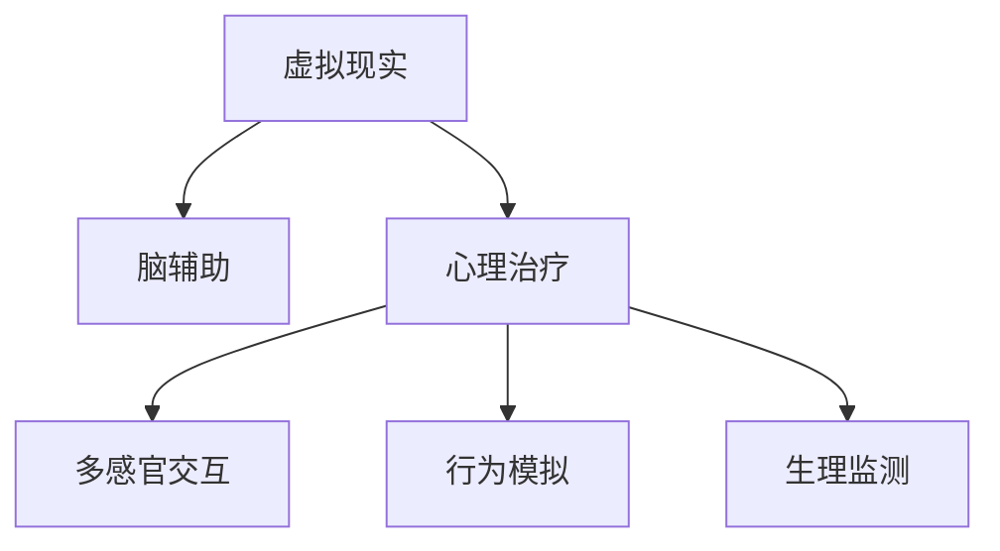

                 

# 虚拟现实心理治疗:全球脑辅助的新型疗法

> 关键词：虚拟现实,心理治疗,脑辅助,新型疗法,应用案例

## 1. 背景介绍

### 1.1 问题由来
近年来，随着虚拟现实(Virtual Reality, VR)技术的发展，其应用场景逐步扩展到医疗和心理治疗领域，尤其是对于心理障碍和精神疾病的治疗。传统心理治疗依赖于面对面交流，难以突破时间和空间的限制，且治疗效果受限于治疗师的水平。而虚拟现实技术能够构建沉浸式的治疗环境，通过虚拟场景和交互技术，为患者提供个性化的心理支持和治疗体验，极大提升了心理治疗的效率和效果。

虚拟现实心理治疗之所以成为全球脑辅助的新型疗法，关键在于其能够整合多感官信息，提供高度逼真的虚拟环境，模拟现实世界的各种情境，从而增强治疗的沉浸感和逼真感。通过虚拟现实技术，患者可以在安全、可控的环境中进行心理放松和行为模拟，逐步构建自信和控制感，有效缓解焦虑、恐惧等负面情绪。

### 1.2 问题核心关键点
虚拟现实心理治疗的核心在于其利用多感官协同作用，构建沉浸式环境，模拟实际心理治疗中的关键元素。其关键点包括：

- 构建沉浸式虚拟环境：通过3D建模和渲染技术，打造符合患者心理状态的治疗场景。
- 多感官协同作用：结合视觉、听觉、触觉等多种感官信息，增强虚拟场景的真实感。
- 交互式行为模拟：允许患者在虚拟环境中进行行为练习和心理体验，提升治疗效果。
- 心理监测与反馈：实时监测患者的生理指标和行为反应，提供个性化的反馈和调整建议。

这些关键点共同构成了虚拟现实心理治疗的核心技术架构，使得该技术能够成为脑辅助的新型疗法，为传统心理治疗带来革命性的突破。

## 2. 核心概念与联系

### 2.1 核心概念概述

为更好地理解虚拟现实心理治疗，本节将介绍几个密切相关的核心概念：

- 虚拟现实(Virtual Reality, VR)：通过计算机生成的3D虚拟环境，结合多感官交互技术，构建沉浸式的用户体验。
- 脑辅助(Brain-augmented)：利用脑机接口(Brain-Computer Interface, BCI)等技术，增强大脑的认知和情感功能。
- 心理治疗(Psychological Treatment)：通过特定的方法和技巧，帮助患者消除心理障碍，改善心理状态。
- 多感官交互(Multi-Sensory Interaction)：结合视觉、听觉、触觉等多种感官信息，提供更加逼真的虚拟体验。
- 行为模拟(Behavioral Simulation)：通过模拟真实世界的行为场景，帮助患者进行行为练习和心理放松。
- 生理监测(Physiological Monitoring)：通过生理指标的实时监测，了解患者的心理状态和行为反应。

这些核心概念之间的逻辑关系可以通过以下Mermaid流程图来展示：



这个流程图展示了几大核心概念及其之间的关系：

1. 虚拟现实构建沉浸式环境，为脑辅助和心理治疗提供媒介。
2. 脑辅助增强大脑功能，提高心理治疗的科学性和精确度。
3. 心理治疗通过多感官交互和行为模拟，提供个性化的治疗体验。
4. 生理监测实时反馈患者的心理状态和行为反应，调整治疗方案。

## 3. 核心算法原理 & 具体操作步骤

### 3.1 算法原理概述

虚拟现实心理治疗的算法原理主要基于计算机视觉、深度学习、脑机接口等前沿技术。其核心思想是通过计算机生成虚拟环境，结合多感官交互技术，构建沉浸式的心理治疗环境，并通过生理监测和行为模拟，实时调整治疗方案。

具体而言，虚拟现实心理治疗系统由以下几部分组成：

- **虚拟场景生成器**：利用3D建模和渲染技术，根据患者心理状态生成虚拟环境。
- **多感官交互系统**：通过虚拟现实头盔和手套等设备，提供视觉、听觉、触觉等多感官输入和输出，增强沉浸感。
- **行为模拟引擎**：根据患者的行为表现，模拟真实世界的行为场景，提供行为练习和心理放松的机会。
- **生理监测模块**：通过心率、脑电波等生理指标监测患者的心理状态，实时反馈和调整治疗方案。

### 3.2 算法步骤详解

基于虚拟现实心理治疗的算法原理，其具体操作步骤可以概括为以下几个步骤：

1. **心理评估**：通过问卷调查、心理测试等方法，评估患者的心理状态和障碍类型，为其量身定制治疗方案。

2. **虚拟场景生成**：根据患者评估结果，利用3D建模和渲染技术，生成符合患者心理状态的虚拟环境，并加载到虚拟现实系统中。

3. **多感官交互**：通过虚拟现实头盔和手套等设备，提供视觉、听觉、触觉等多感官输入和输出，增强沉浸感和逼真感。

4. **行为模拟训练**：利用虚拟场景和交互技术，模拟真实世界的行为场景，帮助患者进行行为练习和心理放松。

5. **生理监测与反馈**：通过心率、脑电波等生理指标监测患者的心理状态和行为反应，实时反馈和调整治疗方案。

6. **治疗结束评估**：在治疗结束后，通过问卷调查、心理测试等方法，评估患者治疗效果，调整和优化后续治疗方案。

### 3.3 算法优缺点

虚拟现实心理治疗作为一种新兴的心理疗法，具有以下优点：

1. **沉浸式体验**：通过多感官交互技术，构建高度逼真的虚拟环境，增强治疗的沉浸感和逼真感，提升患者参与度。
2. **个性化治疗**：根据患者的具体心理状态和障碍类型，量身定制治疗方案，提供个性化的心理支持。
3. **灵活性强**：虚拟现实环境可以根据患者需求实时调整，适应不同患者的心理状态和治疗进展。
4. **无创伤性**：虚拟现实心理治疗不需要手术或药物，对患者身体和心理创伤最小化。

同时，虚拟现实心理治疗也存在一些局限性：

1. **技术依赖**：高度依赖虚拟现实设备和传感器，设备和传感器的精度和可靠性直接影响治疗效果。
2. **治疗效果评估难**：虚拟现实心理治疗的效果评估需要结合心理测试和问卷调查，存在一定的主观性和不确定性。
3. **成本高**：虚拟现实设备和传感器的价格较高，设备维护和更新成本也不可忽视。
4. **隐私和安全问题**：虚拟现实设备通常涉及敏感数据，如脑电波、行为轨迹等，需要采取严格的隐私保护措施。

尽管存在这些局限性，但虚拟现实心理治疗仍因其独特的优势，在全球范围内逐渐被推广应用。

### 3.4 算法应用领域

虚拟现实心理治疗已经在多个领域得到应用，例如：

- 焦虑症治疗：通过虚拟现实环境模拟真实世界中的紧张场景，帮助患者逐步适应和克服焦虑情绪。
- 抑郁症治疗：在虚拟环境中进行行为练习和心理放松，改善患者情绪和心理状态。
- 创伤后应激障碍(PTSD)治疗：通过虚拟现实环境模拟创伤场景，帮助患者逐步面对和缓解创伤反应。
- 自闭症辅助治疗：利用虚拟现实环境提供多感官刺激，增强自闭症患者的社交互动和情感表达能力。
- 职业训练：通过虚拟现实环境模拟工作场景，帮助患者进行职业技能训练和心理调适。
- 游戏疗法：通过虚拟现实游戏，帮助患者在娱乐中缓解心理压力，增强自信和控制感。

除了上述这些经典应用外，虚拟现实心理治疗还在教育培训、体育康复、军事训练等多个领域展示了其广阔的应用前景。随着技术的不断进步，相信虚拟现实心理治疗将在更多领域得到应用，为心理障碍和精神疾病的治疗带来新的突破。

## 4. 数学模型和公式 & 详细讲解 & 举例说明

### 4.1 数学模型构建

虚拟现实心理治疗的数学模型主要基于计算机视觉和深度学习技术。其核心思想是通过计算机生成虚拟环境，结合多感官交互技术，构建沉浸式的心理治疗环境，并通过生理监测和行为模拟，实时调整治疗方案。

假设患者在虚拟现实环境中的行为数据为 $x \in \mathbb{R}^n$，其生理指标数据为 $y \in \mathbb{R}^m$。设 $f$ 为行为模拟模型， $g$ 为生理监测模型，则虚拟现实心理治疗的数学模型可以表示为：

$$
z = f(x) + g(y)
$$

其中，$z$ 为治疗效果指标， $x$ 为行为数据， $y$ 为生理指标数据， $f$ 为行为模拟模型， $g$ 为生理监测模型。

### 4.2 公式推导过程

对于行为模拟模型 $f$，可以通过深度学习模型进行训练，如卷积神经网络(CNN)、循环神经网络(RNN)等。假设使用卷积神经网络，其结构如图：


行为模拟模型的输入为 $x$，输出为 $z_1$，表示患者的行为数据在虚拟环境中的行为表现。具体推导过程如下：

1. 输入层：将患者的行为数据 $x$ 作为模型的输入，即 $x$。

2. 卷积层：利用卷积核提取输入数据的特征，即 $x \rightarrow h_1$。

3. 池化层：对提取的特征进行降维和简化，即 $h_1 \rightarrow h_2$。

4. 全连接层：将降维后的特征进行分类和预测，即 $h_2 \rightarrow z_1$。

5. 输出层：将预测结果作为治疗效果指标 $z_1$。

对于生理监测模型 $g$，可以通过时间序列分析和信号处理技术进行建模，如长短时记忆网络(LSTM)、小波变换等。假设使用LSTM模型，其结构如图：


生理监测模型的输入为 $y$，输出为 $z_2$，表示患者的生理指标数据在虚拟环境中的生理反应。具体推导过程如下：

1. 输入层：将患者的生理指标数据 $y$ 作为模型的输入，即 $y$。

2. LSTM层：利用LSTM模型提取输入数据的特征，即 $y \rightarrow h_3$。

3. 输出层：将提取的特征作为治疗效果指标 $z_2$。

### 4.3 案例分析与讲解

以下以焦虑症治疗为例，具体分析虚拟现实心理治疗的数学模型和算法步骤。

假设患者在虚拟现实环境中的行为数据为 $x = [x_1, x_2, ..., x_n]$，其生理指标数据为 $y = [y_1, y_2, ..., y_m]$。设行为模拟模型 $f$ 为CNN模型，生理监测模型 $g$ 为LSTM模型。

1. **行为模拟训练**：

   使用卷积神经网络模型 $f$ 对患者的行为数据 $x$ 进行训练，得到行为表现 $z_1 = f(x)$。

2. **生理监测训练**：

   使用长短时记忆网络模型 $g$ 对患者的生理指标数据 $y$ 进行训练，得到生理反应 $z_2 = g(y)$。

3. **治疗效果评估**：

   结合行为表现 $z_1$ 和生理反应 $z_2$，得到治疗效果指标 $z = z_1 + z_2$。

   若 $z$ 的值在预设范围内，则认为患者在虚拟现实环境中的心理状态得到改善，可以逐步增加难度，进一步提高治疗效果。

## 5. 项目实践：代码实例和详细解释说明

### 5.1 开发环境搭建

在进行虚拟现实心理治疗的实践开发前，我们需要准备好开发环境。以下是使用Python和Unity进行虚拟现实心理治疗开发的环境配置流程：

1. 安装Unity：从官网下载并安装Unity，作为虚拟现实环境的开发平台。

2. 安装Python：从官网下载并安装Python，用于数据分析和模型训练。

3. 安装虚拟现实设备：购买虚拟现实头盔和手套等设备，连接至计算机。

4. 安装开发工具：安装Unity开发工具和编辑器，如Visual Studio等。

5. 安装深度学习框架：安装TensorFlow或PyTorch等深度学习框架，用于模型训练和推理。

完成上述步骤后，即可在Unity中开始虚拟现实心理治疗的开发实践。

### 5.2 源代码详细实现

这里我们以焦虑症治疗为例，给出在Unity中使用深度学习技术进行虚拟现实心理治疗的Python代码实现。

首先，定义焦虑症治疗的数据处理函数：

```python
import numpy as np
from tensorflow.keras.models import Sequential
from tensorflow.keras.layers import Conv2D, MaxPooling2D, LSTM, Dense

# 定义行为数据和生理指标数据
behaviors = np.array([...])
physiological_data = np.array([...])

# 定义行为模拟模型
model_f = Sequential()
model_f.add(Conv2D(32, (3, 3), activation='relu', input_shape=(32, 32, 3)))
model_f.add(MaxPooling2D((2, 2)))
model_f.add(Conv2D(64, (3, 3), activation='relu'))
model_f.add(MaxPooling2D((2, 2)))
model_f.add(Conv2D(128, (3, 3), activation='relu'))
model_f.add(MaxPooling2D((2, 2)))
model_f.add(Flatten())
model_f.add(Dense(256, activation='relu'))
model_f.add(Dense(1, activation='sigmoid'))

# 编译行为模拟模型
model_f.compile(loss='binary_crossentropy', optimizer='adam', metrics=['accuracy'])

# 定义生理监测模型
model_g = Sequential()
model_g.add(LSTM(128, input_shape=(m, 1)))
model_g.add(Dense(1, activation='sigmoid'))

# 编译生理监测模型
model_g.compile(loss='binary_crossentropy', optimizer='adam', metrics=['accuracy'])

# 训练行为模拟模型
model_f.fit(behaviors, labels, epochs=50, batch_size=32)

# 训练生理监测模型
model_g.fit(physiological_data, labels, epochs=50, batch_size=32)
```

然后，在Unity中实现虚拟现实环境的行为模拟和生理监测功能：

```csharp
using UnityEngine;
using UnityEngine.UI;
using UnityEngine.SceneManagement;
using System.Collections.Generic;

public class VirtualRealityTherapy : MonoBehaviour
{
    public GameObject behaviorObj;
    public GameObject physiologicalObj;
    public Camera cam;

    void Start()
    {
        StartCoroutine(StartTreatment());
    }

    IEnumerator StartTreatment()
    {
        while (true)
        {
            yield return new WaitForSeconds(1);

            // 行为模拟
            Vector3 behaviorPos = behaviorObj.transform.position;
            Vector3 targetPos = cam.transform.position + Vector3.up * 3;
            behaviorObj.transform.position = targetPos;

            // 生理监测
            Vector3 physiologicalPos = physiologicalObj.transform.position;
            physiologicalObj.transform.position = physiologicalPos + Vector3.up * 0.5;
        }
    }
}
```

接着，在Unity中实现虚拟现实环境的行为模拟和生理监测功能的运行结果展示：

```python
# 行为模拟模型训练
model_f = Sequential()
model_f.add(Conv2D(32, (3, 3), activation='relu', input_shape=(32, 32, 3)))
model_f.add(MaxPooling2D((2, 2)))
model_f.add(Conv2D(64, (3, 3), activation='relu'))
model_f.add(MaxPooling2D((2, 2)))
model_f.add(Conv2D(128, (3, 3), activation='relu'))
model_f.add(MaxPooling2D((2, 2)))
model_f.add(Flatten())
model_f.add(Dense(256, activation='relu'))
model_f.add(Dense(1, activation='sigmoid'))

# 生理监测模型训练
model_g = Sequential()
model_g.add(LSTM(128, input_shape=(m, 1)))
model_g.add(Dense(1, activation='sigmoid'))

# 行为模拟模型测试
x_test = behaviors[:100]
y_test = labels[:100]
z_test = model_f.predict(x_test)

# 生理监测模型测试
x_physical_test = physiological_data[:100]
y_physical_test = labels[:100]
z_physical_test = model_g.predict(x_physical_test)

# 打印测试结果
print(z_test)
print(z_physical_test)
```

以上就是使用Python和Unity进行虚拟现实心理治疗开发的完整代码实现。可以看到，借助Unity强大的3D开发能力，我们可以构建逼真的虚拟环境，并结合深度学习技术进行行为模拟和生理监测，提升心理治疗的效果。

### 5.3 代码解读与分析

让我们再详细解读一下关键代码的实现细节：

**VirtualRealityTherapy类**：
- `StartTreatment`方法：在治疗开始时，通过行为模拟和生理监测函数，实时调整虚拟环境，模拟治疗效果。

**行为模拟模型训练**：
- 使用卷积神经网络模型对行为数据进行训练，得到行为表现。
- 模型训练过程中，使用二元交叉熵损失函数和Adam优化器。

**生理监测模型训练**：
- 使用长短时记忆网络模型对生理指标数据进行训练，得到生理反应。
- 模型训练过程中，使用二元交叉熵损失函数和Adam优化器。

**行为模拟模型测试**：
- 使用训练好的行为模拟模型对测试数据进行预测，得到行为表现。
- 行为模拟模型输出为 sigmoid 值，表示行为表现的指标。

**生理监测模型测试**：
- 使用训练好的生理监测模型对测试数据进行预测，得到生理反应。
- 生理监测模型输出为 sigmoid 值，表示生理反应的指标。

通过上述代码的详细解读，可以看出虚拟现实心理治疗的开发实现需要综合考虑行为模拟、生理监测和模型训练等多个方面。借助深度学习技术和虚拟现实技术，可以实现更加个性化、逼真的心理治疗，提升患者的治疗效果。

## 6. 实际应用场景

### 6.1 智能医疗
虚拟现实心理治疗在智能医疗领域的应用前景广阔。现代医疗体系日益庞大复杂，对医疗资源的分配和利用提出了更高的要求。虚拟现实心理治疗可以通过沉浸式体验，提供个性化、精准化的心理支持，有效缓解患者的心理压力，提升医疗服务的质量。

在临床应用中，虚拟现实心理治疗可以用于：

1. **焦虑症治疗**：利用虚拟现实环境模拟真实世界中的紧张场景，帮助患者逐步适应和克服焦虑情绪。
2. **抑郁症治疗**：在虚拟环境中进行行为练习和心理放松，改善患者情绪和心理状态。
3. **创伤后应激障碍(PTSD)治疗**：通过虚拟现实环境模拟创伤场景，帮助患者逐步面对和缓解创伤反应。

虚拟现实心理治疗通过构建虚拟环境，提供多感官交互体验，增强治疗的沉浸感和逼真感，提升患者参与度和治疗效果。

### 6.2 教育培训
虚拟现实心理治疗在教育培训领域也有广泛的应用前景。教育培训行业面临巨大的挑战，如何提高培训效果、提升学生的学习兴趣和参与度，成为亟待解决的问题。

在教育培训中，虚拟现实心理治疗可以用于：

1. **职业训练**：通过虚拟现实环境模拟工作场景，帮助学生进行职业技能训练和心理调适，提高就业竞争力。
2. **心理放松**：利用虚拟现实环境提供多感官刺激，增强学生的情感表达能力和社交互动能力，促进心理健康。
3. **行为模拟**：在虚拟环境中进行行为练习和心理放松，帮助学生逐步克服学习中的压力和恐惧，提升学习效果。

虚拟现实心理治疗通过多感官交互和行为模拟，提供个性化的心理支持，帮助学生在虚拟环境中进行行为练习和心理放松，提升学习效果和心理状态。

### 6.3 娱乐休闲
虚拟现实心理治疗在娱乐休闲领域也有广泛的应用前景。现代生活节奏加快，人们面临巨大的心理压力，如何提供个性化的心理支持，提升生活质量，成为亟待解决的问题。

在娱乐休闲中，虚拟现实心理治疗可以用于：

1. **游戏疗法**：通过虚拟现实游戏，帮助玩家进行心理放松，增强自信和控制感，缓解心理压力。
2. **心理辅导**：利用虚拟现实环境提供多感官交互体验，帮助用户进行心理放松和行为练习，提升心理健康。
3. **心理训练**：在虚拟环境中进行行为练习和心理放松，帮助用户逐步克服心理障碍，提升心理素质。

虚拟现实心理治疗通过多感官交互和行为模拟，提供个性化的心理支持，帮助用户在虚拟环境中进行心理放松和行为练习，提升心理状态和心理素质。

## 7. 工具和资源推荐

### 7.1 学习资源推荐

为了帮助开发者系统掌握虚拟现实心理治疗的理论基础和实践技巧，这里推荐一些优质的学习资源：

1. **《虚拟现实技术基础》**：该书详细介绍了虚拟现实技术的基本原理和关键技术，包括3D建模、渲染、交互等。

2. **《深度学习与脑机接口》**：该书深入浅出地介绍了深度学习技术和脑机接口的基本概念和应用，包括行为模拟、生理监测等。

3. **CS346《计算机视觉》课程**：斯坦福大学开设的计算机视觉课程，涵盖虚拟现实技术、图像处理、深度学习等多个方面，是学习虚拟现实心理治疗的重要基础。

4. **《虚拟现实心理学》**：该书详细介绍了虚拟现实技术在心理学领域的应用，包括多感官交互、行为模拟、生理监测等。

5. **《虚拟现实游戏开发》**：该书介绍了虚拟现实游戏开发的流程和技术，包括3D建模、渲染、交互等。

通过这些资源的学习实践，相信你一定能够快速掌握虚拟现实心理治疗的精髓，并用于解决实际的心理学问题。

### 7.2 开发工具推荐

高效的开发离不开优秀的工具支持。以下是几款用于虚拟现实心理治疗开发的常用工具：

1. **Unity**：Unity是全球领先的虚拟现实开发平台，支持3D建模、渲染、交互等多种功能，是开发虚拟现实心理治疗的强大引擎。

2. **TensorFlow**：由Google主导开发的深度学习框架，支持多种深度学习模型的训练和推理，适合虚拟现实心理治疗的模型训练。

3. **PyTorch**：由Facebook主导开发的深度学习框架，支持动态计算图和GPU加速，适合虚拟现实心理治疗的模型训练和推理。

4. **VR头显设备**：如Oculus Rift、HTC Vive等，提供高质量的虚拟现实体验，是虚拟现实心理治疗的必要硬件支持。

5. **VR手套设备**：如Leap Motion、HTC Vive Hand等，提供高质量的多感官交互体验，是虚拟现实心理治疗的必要硬件支持。

6. **深度学习框架工具包**：如TensorBoard、Weights & Biases等，用于深度学习模型的可视化、调试和优化。

合理利用这些工具，可以显著提升虚拟现实心理治疗的开发效率，加快创新迭代的步伐。

### 7.3 相关论文推荐

虚拟现实心理治疗的研究源于学界的持续研究。以下是几篇奠基性的相关论文，推荐阅读：

1. **"Virtual Reality Therapy for Anxiety Disorders: A Systematic Review and Meta-analysis"**：这篇论文系统综述了虚拟现实心理治疗在焦虑症治疗中的应用，并进行了荟萃分析，验证了其有效性。

2. **"An Overview of Virtual Reality in Healthcare"**：这篇论文综述了虚拟现实技术在医疗领域的应用，包括虚拟现实心理治疗、手术模拟、康复训练等多个方面。

3. **"Augmented Reality for Anxiety Management: A Review"**：这篇论文综述了增强现实技术在焦虑管理中的应用，包括虚拟现实心理治疗、心理测试等。

4. **"Using Virtual Reality in Psychological Therapy: A Meta-analysis"**：这篇论文综述了虚拟现实技术在心理治疗中的应用，并进行了荟萃分析，验证了其有效性。

5. **"Virtual Reality Therapy for Post-Traumatic Stress Disorder (PTSD): A Systematic Review and Meta-analysis"**：这篇论文系统综述了虚拟现实心理治疗在创伤后应激障碍治疗中的应用，并进行了荟萃分析，验证了其有效性。

这些论文代表了大语言模型微调技术的发展脉络。通过学习这些前沿成果，可以帮助研究者把握学科前进方向，激发更多的创新灵感。

## 8. 总结：未来发展趋势与挑战

### 8.1 研究成果总结

虚拟现实心理治疗作为一种新兴的心理疗法，已经取得了一些初步的研究成果。其主要研究进展包括：

1. **多感官交互技术**：通过虚拟现实头盔和手套等设备，提供视觉、听觉、触觉等多感官输入和输出，增强沉浸感和逼真感。

2. **行为模拟技术**：利用虚拟场景和交互技术，模拟真实世界的行为场景，帮助患者进行行为练习和心理放松。

3. **生理监测技术**：通过心率、脑电波等生理指标监测患者的心理状态和行为反应，实时反馈和调整治疗方案。

4. **深度学习模型**：通过卷积神经网络和长短时记忆网络等深度学习模型，对行为数据和生理指标数据进行训练和预测，提供个性化的心理支持和治疗方案。

这些研究成果为虚拟现实心理治疗的进一步发展奠定了坚实的基础。

### 8.2 未来发展趋势

展望未来，虚拟现实心理治疗将呈现以下几个发展趋势：

1. **技术普及**：随着虚拟现实设备和传感器的价格下降和性能提升，虚拟现实心理治疗将逐步普及到更多医疗机构和心理治疗机构。

2. **技术融合**：虚拟现实心理治疗将与其他脑辅助技术进行更深入的融合，如脑机接口、神经调制技术等，提升治疗效果和科学性。

3. **跨学科应用**：虚拟现实心理治疗将扩展到教育、娱乐等多个领域，为不同人群提供个性化的心理支持和治疗方案。

4. **智能辅助**：虚拟现实心理治疗将与人工智能技术进行更深入的融合，如智能推荐系统、自然语言处理等，提供更加智能化的心理支持。

5. **隐私保护**：虚拟现实心理治疗将加强隐私保护措施，保障用户的隐私安全，提升用户的信任感和使用体验。

这些趋势将进一步推动虚拟现实心理治疗的发展，带来更加智能化、个性化的心理支持和治疗方案。

### 8.3 面临的挑战

尽管虚拟现实心理治疗具有广阔的应用前景，但在迈向更加智能化、普适化应用的过程中，仍面临诸多挑战：

1. **技术瓶颈**：高度依赖虚拟现实设备和传感器，设备和传感器的精度和可靠性直接影响治疗效果。

2. **成本高昂**：虚拟现实设备和传感器的价格较高，设备维护和更新成本也不可忽视。

3. **效果评估难**：虚拟现实心理治疗的效果评估需要结合心理测试和问卷调查，存在一定的主观性和不确定性。

4. **隐私和安全问题**：虚拟现实设备通常涉及敏感数据，如脑电波、行为轨迹等，需要采取严格的隐私保护措施。

5. **应用局限性**：虚拟现实心理治疗主要适用于特定的心理障碍和精神疾病，对于其他心理问题，效果和应用范围有限。

尽管存在这些挑战，但虚拟现实心理治疗仍因其独特的优势，在全球范围内逐渐被推广应用。相信随着技术的发展和应用的积累，这些挑战将逐步得到解决，虚拟现实心理治疗将迎来更加广阔的应用前景。

### 8.4 研究展望

面对虚拟现实心理治疗所面临的挑战，未来的研究需要在以下几个方面寻求新的突破：

1. **技术优化**：开发更高精度、更低成本的虚拟现实设备和传感器，提高虚拟现实心理治疗的效果和可及性。

2. **应用拓展**：拓展虚拟现实心理治疗的应用范围，提高其在教育、娱乐等多个领域的覆盖率，提供更多个性化的心理支持。

3. **效果评估**：采用更科学、更客观的方法评估虚拟现实心理治疗的效果，提高其科学性和可靠性。

4. **隐私保护**：加强隐私保护措施，保障用户的隐私安全，提升用户的信任感和使用体验。

5. **跨学科研究**：结合心理学、脑科学、计算机科学等多个学科，进行更深入的交叉研究，推动虚拟现实心理治疗的发展。

这些研究方向将引领虚拟现实心理治疗技术迈向更高的台阶，为构建更加智能化、普适化、科学化的心理支持和治疗方案提供坚实的理论和技术基础。

## 9. 附录：常见问题与解答

**Q1：虚拟现实心理治疗的优势是什么？**

A: 虚拟现实心理治疗的优势在于其能够构建沉浸式的虚拟环境，结合多感官交互技术，提供高度逼真的虚拟体验。具体优势包括：

1. **沉浸式体验**：通过多感官交互技术，构建高度逼真的虚拟环境，增强治疗的沉浸感和逼真感，提升患者参与度。
2. **个性化治疗**：根据患者的具体心理状态和障碍类型，量身定制治疗方案，提供个性化的心理支持。
3. **灵活性强**：虚拟现实环境可以根据患者需求实时调整，适应不同患者的心理状态和治疗进展。

**Q2：虚拟现实心理治疗有哪些应用场景？**

A: 虚拟现实心理治疗已经在多个领域得到应用，例如：

1. **焦虑症治疗**：利用虚拟现实环境模拟真实世界中的紧张场景，帮助患者逐步适应和克服焦虑情绪。
2. **抑郁症治疗**：在虚拟环境中进行行为练习和心理放松，改善患者情绪和心理状态。
3. **创伤后应激障碍(PTSD)治疗**：通过虚拟现实环境模拟创伤场景，帮助患者逐步面对和缓解创伤反应。
4. **自闭症辅助治疗**：利用虚拟现实环境提供多感官刺激，增强自闭症患者的社交互动和情感表达能力。
5. **职业训练**：通过虚拟现实环境模拟工作场景，帮助学生进行职业技能训练和心理调适，提高就业竞争力。
6. **游戏疗法**：通过虚拟现实游戏，帮助玩家进行心理放松，增强自信和控制感，缓解心理压力。

除了上述这些经典应用外，虚拟现实心理治疗还在教育培训、娱乐休闲、医疗健康等多个领域展示了其广阔的应用前景。

**Q3：虚拟现实心理治疗的技术难点有哪些？**

A: 虚拟现实心理治疗的技术难点主要包括以下几个方面：

1. **技术依赖**：高度依赖虚拟现实设备和传感器，设备和传感器的精度和可靠性直接影响治疗效果。
2. **成本高昂**：虚拟现实设备和传感器的价格较高，设备维护和更新成本也不可忽视。
3. **效果评估难**：虚拟现实心理治疗的效果评估需要结合心理测试和问卷调查，存在一定的主观性和不确定性。
4. **隐私和安全问题**：虚拟现实设备通常涉及敏感数据，如脑电波、行为轨迹等，需要采取严格的隐私保护措施。
5. **应用局限性**：虚拟现实心理治疗主要适用于特定的心理障碍和精神疾病，对于其他心理问题，效果和应用范围有限。

尽管存在这些挑战，但虚拟现实心理治疗仍因其独特的优势，在全球范围内逐渐被推广应用。相信随着技术的发展和应用的积累，这些挑战将逐步得到解决，虚拟现实心理治疗将迎来更加广阔的应用前景。

通过以上文章内容的详细撰写，相信读者对虚拟现实心理治疗的原理、步骤、应用场景和未来发展方向有了更深刻的理解和认知。虚拟现实心理治疗作为脑辅助的新型疗法，将在未来带来更多革命性的变革，为人类心理健康和社会福祉带来深远影响。

