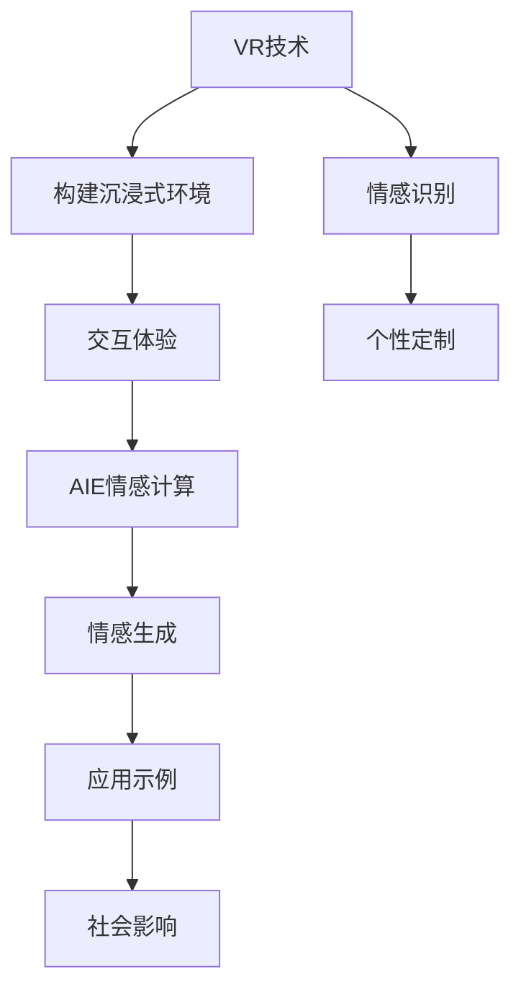

                 

# 虚拟现实老年陪护创业：科技辅助的情感关怀

## 1. 背景介绍

随着人口老龄化的加速和人工智能技术的迅猛发展，虚拟现实(VR)老年陪护创业成为一个充满潜力的新领域。通过对VR技术的深度挖掘，结合AI情感计算技术，能够为老年群体提供更加个性化、陪伴式的互动体验，从而提升他们的生活质量。

### 1.1 问题由来

随着全球人口老龄化的加剧，老年人面临孤独、抑郁等心理问题，其身心健康成为了社会关注的焦点。然而，传统养老方式难以满足老年人多样化的需求，无法提供即时的陪伴和关怀。尽管现代社会中智能机器人、AI语音助手等技术已经得到了广泛应用，但这些技术仍难以达到人际交往的深度和细腻度。

另一方面，VR技术的飞速进步为情感关怀提供了新的可能。结合VR与AI技术的虚拟现实老年陪护系统，能够提供沉浸式的交互体验，让老年人仿佛置身于一个充满关爱和互动的虚拟世界。这不仅能够有效缓解老年人的孤独感，还能在一定程度上促进他们的身心健康。

### 1.2 问题核心关键点

为更好应对老年人的情感需求，本文聚焦于利用VR技术结合AI情感计算技术，为老年人打造一个沉浸式、陪伴式的互动平台。具体来说，本文将探讨以下几个关键点：

1. **虚拟现实技术：**如何利用VR技术构建一个沉浸式的互动环境，使老年人能够以自然流畅的方式与虚拟角色互动。
2. **情感计算技术：**如何通过情感识别和情感生成技术，让虚拟角色更好地理解和回应老年人的情感变化。
3. **个性化服务：**如何通过数据分析和机器学习，为每位老年人定制个性化的陪伴和娱乐体验。
4. **社会影响：**如何通过大规模部署，提升老年人的生活质量，推动社会对老年人关怀的进步。

本文旨在从技术实现和应用场景两方面，系统阐述虚拟现实老年陪护创业的可能性及挑战，为相关领域的进一步研究和商业实践提供参考。

## 2. 核心概念与联系

### 2.1 核心概念概述

为更好地理解本文的主题，我们将介绍几个核心概念，并阐述它们之间的联系：

- **虚拟现实（VR）：**一种通过计算机技术模拟三维虚拟环境，并使用特殊的头盔和控制器，让使用者获得沉浸式体验的技术。
- **人工智能（AI）：**通过机器学习等技术，使计算机能够模仿人类的学习、推理、感知等能力，实现自主决策和行为。
- **情感计算（Affective Computing）：**研究如何通过机器感知和分析人类的情感，实现情感的识别、生成和应用。
- **个性化服务：**利用数据分析和机器学习，为每个用户提供定制化的服务和体验。
- **社会影响：**通过技术在实际应用中的广泛应用，带来社会层面的正面变化。

这些概念的结合，为虚拟现实老年陪护创业提供了强有力的技术支持和广阔的应用前景。

### 2.2 核心概念原理和架构的 Mermaid 流程图



这个流程图展示了虚拟现实老年陪护创业的各个环节：

1. VR技术用于构建沉浸式的虚拟环境。
2. 与AI技术结合，实现情感计算，使虚拟角色能够理解老年人的情感变化。
3. 利用情感计算结果，进行个性化服务定制。
4. 通过具体的交互示例，展示技术的应用效果。
5. 最终通过广泛部署，对社会产生积极影响。

## 3. 核心算法原理 & 具体操作步骤

### 3.1 算法原理概述

虚拟现实老年陪护系统的核心算法主要涉及以下几方面：

1. **虚拟现实建模：**通过VR技术，构建一个真实且沉浸式的虚拟世界。
2. **情感识别与生成：**利用AI情感计算技术，实现对老年人情感的识别和生成。
3. **个性化服务：**通过数据分析和机器学习，为每位老年人定制个性化的陪伴和娱乐体验。
4. **社会影响：**通过大规模部署，提升老年人的生活质量，推动社会对老年人关怀的进步。

### 3.2 算法步骤详解

#### 步骤1：虚拟现实建模

构建虚拟现实环境的第一步是设计和创建虚拟场景。这包括：

1. **场景设计：**根据老年人的兴趣和生活习惯，设计虚拟场景和交互对象。
2. **3D建模：**使用如Unity或Unreal Engine等工具，创建三维模型和环境。
3. **交互设计：**设计虚拟角色的动作、语音和情感反应，使其能够自然地与老年人互动。

#### 步骤2：情感识别

情感识别是老年陪护系统的核心部分，通过以下步骤实现：

1. **面部表情识别：**使用计算机视觉技术，捕捉老年人的面部表情，通过预先训练好的神经网络进行识别。
2. **语音情感分析：**利用语音识别和情感计算技术，分析老年人的语音语调，识别其情感状态。
3. **身体语言识别：**通过传感器或摄像头捕捉老年人的身体语言，如手势、动作等，进一步辅助情感识别。

#### 步骤3：情感生成

基于情感识别结果，虚拟角色能够生成合适的情感反应。具体步骤如下：

1. **情感数据库：**构建一个包含多种情感反应的库，包括面部表情、语音语调、身体语言等。
2. **情感生成模型：**使用生成对抗网络（GAN）等技术，根据情感识别结果，生成虚拟角色的情感反应。
3. **多模态融合：**将面部表情、语音语调和身体语言等多种情感模式进行融合，使虚拟角色的情感反应更加自然和丰富。

#### 步骤4：个性化服务

个性化服务主要通过以下步骤实现：

1. **用户画像构建：**利用数据分析和机器学习技术，根据老年人的历史行为和偏好，构建个性化的用户画像。
2. **推荐系统：**基于用户画像，通过推荐算法，为老年人推荐适合的虚拟活动和互动内容。
3. **动态调整：**根据老年人的实时反馈和行为变化，动态调整虚拟场景和内容，提升互动体验。

#### 步骤5：社会影响

最后，通过大规模部署和实际应用，对社会产生积极影响。具体步骤如下：

1. **用户调研：**通过问卷调查和数据分析，了解老年人的实际需求和满意度。
2. **反馈改进：**根据用户反馈，不断改进和优化虚拟现实老年陪护系统。
3. **政策倡导：**通过与政府和养老机构合作，推动相关政策和标准的制定，提升整个社会的老年人关怀水平。

### 3.3 算法优缺点

#### 优点：

1. **沉浸式体验：**通过VR技术，提供沉浸式和互动式的虚拟环境，让老年人感觉仿佛身临其境。
2. **个性化服务：**利用情感计算和推荐系统，提供个性化的陪伴和娱乐体验。
3. **情感支持：**通过情感识别和生成，使虚拟角色能够理解和回应老年人的情感变化，提供情感支持。

#### 缺点：

1. **技术成本高：**构建虚拟现实环境需要高性能硬件和复杂的算法，初期投资较大。
2. **交互复杂性：**老年人对新技术的接受程度和操作熟练度存在差异，需要额外的培训和支持。
3. **依赖网络：**虚拟现实系统的运行需要稳定的网络环境，网络中断可能导致用户体验下降。

### 3.4 算法应用领域

虚拟现实老年陪护系统主要应用于以下几个领域：

1. **居家养老：**为居家老人提供陪伴和娱乐，缓解孤独感。
2. **养老机构：**在养老院等机构中，提供沉浸式娱乐和互动体验。
3. **社区活动：**在社区活动中，组织老年人参与虚拟互动，增强社交互动。
4. **远程陪伴：**通过网络远程连接，为远在他乡的老人提供情感支持和陪伴。

## 4. 数学模型和公式 & 详细讲解

### 4.1 数学模型构建

虚拟现实老年陪护系统涉及多个数学模型，包括：

1. **虚拟现实场景建模：**通过三维几何图形描述虚拟环境。
2. **情感识别模型：**利用深度学习模型，如卷积神经网络（CNN）、循环神经网络（RNN）等，进行情感识别。
3. **情感生成模型：**使用生成对抗网络（GAN）等技术，生成虚拟角色的情感反应。
4. **个性化推荐模型：**基于协同过滤、内容推荐等算法，为老年人推荐适合的虚拟活动和互动内容。

### 4.2 公式推导过程

以情感生成模型为例，推导过程如下：

设$\boldsymbol{x}$为老年人的情感特征向量，$\boldsymbol{z}$为虚拟角色的情感特征向量，$G$为生成器，$D$为判别器。则情感生成模型的目标函数为：

$$
\min_{G} \max_{D} V(G, D) = \mathbb{E}_{\boldsymbol{x} \sim p(\boldsymbol{x})} \log D(G(\boldsymbol{x})) + \mathbb{E}_{\boldsymbol{z} \sim p(\boldsymbol{z})} \log (1 - D(G(\boldsymbol{z})))
$$

其中$V(G, D)$为生成器$G$和判别器$D$的联合损失函数。目标是最小化生成器的损失，最大化判别器的损失。

生成器的损失函数为：

$$
\mathcal{L}_G = -\mathbb{E}_{\boldsymbol{x} \sim p(\boldsymbol{x})} \log D(G(\boldsymbol{x})) - \mathbb{E}_{\boldsymbol{z} \sim p(\boldsymbol{z})} \log D(G(\boldsymbol{z}))
$$

判别器的损失函数为：

$$
\mathcal{L}_D = -\mathbb{E}_{\boldsymbol{x} \sim p(\boldsymbol{x})} \log D(G(\boldsymbol{x})) - \mathbb{E}_{\boldsymbol{z} \sim p(\boldsymbol{z})} \log (1 - D(G(\boldsymbol{z})))
$$

通过上述模型，可以训练出能够生成逼真情感反应的虚拟角色。

### 4.3 案例分析与讲解

以一个简单的案例说明情感生成模型的应用：

1. **场景描述：**虚拟房间内，一名老人正在看电视，电视画面上正在播放一段悲伤的电影片段。
2. **情感识别：**通过摄像头捕捉老人的面部表情和语音语调，识别出老人的情感状态为悲伤。
3. **情感生成：**根据情感识别结果，虚拟角色自动生成相应的情感反应，如低头、沉默、安慰等。
4. **情感反馈：**虚拟角色通过语音和动作，对老人的情感进行回应，提供情感支持。

## 5. 项目实践：代码实例和详细解释说明

### 5.1 开发环境搭建

#### 开发环境要求

1. **操作系统：**Windows、macOS或Linux。
2. **编程语言：**Python 3.x。
3. **VR框架：**Unity、Unreal Engine。
4. **深度学习框架：**TensorFlow、PyTorch。
5. **其他工具：**OpenCV、numpy、pandas等。

#### 开发环境搭建步骤

1. **安装Python：**根据操作系统选择合适的Python版本，下载并安装。
2. **安装虚拟现实框架：**根据需要选择Unity或Unreal Engine，按照官方文档进行安装和配置。
3. **安装深度学习框架：**选择TensorFlow或PyTorch，根据官方文档进行安装和配置。
4. **安装其他工具：**安装OpenCV、numpy、pandas等常用工具。

### 5.2 源代码详细实现

#### 虚拟现实场景建模

```python
# 使用Unity3D进行虚拟场景建模
# 导入Unity3D库
import unity3d

# 创建虚拟场景
unity3d.create_scene("Home")

# 创建虚拟角色
unity3d.create_character("Elderly Person")

# 添加虚拟场景和角色
unity3d.add_character_to_scene("Home", "Elderly Person")
```

#### 情感识别

```python
# 使用Python和OpenCV进行面部表情识别
import cv2
import numpy as np

# 加载面部识别模型
face_cascade = cv2.CascadeClassifier("haarcascade_frontalface_default.xml")

# 加载情感识别模型
emotion_model = load_model("emotion_model.h5")

# 捕捉老年人面部表情
frame = cv2.imread("frame.jpg")
gray = cv2.cvtColor(frame, cv2.COLOR_BGR2GRAY)
faces = face_cascade.detectMultiScale(gray, scaleFactor=1.1, minNeighbors=5)

# 对每个面部区域进行情感识别
for (x, y, w, h) in faces:
    roi_gray = gray[y:y+h, x:x+w]
    roi_gray = cv2.resize(roi_gray, (48, 48))
    roi_gray = roi_gray.reshape((1, 1, 48, 48))
    roi_gray = np.expand_dims(roi_gray, axis=0)
    emotion = emotion_model.predict(roi_gray)[0]
    print("Emotion: ", emotion)
```

#### 情感生成

```python
# 使用Python和TensorFlow进行情感生成
import tensorflow as tf

# 定义情感生成器
def create_generator():
    # 创建输入和输出
    input_tensor = tf.keras.layers.Input(shape=(100,))
    output_tensor = tf.keras.layers.Dense(128, activation="relu")(input_tensor)
    output_tensor = tf.keras.layers.Dense(64, activation="relu")(output_tensor)
    output_tensor = tf.keras.layers.Dense(100, activation="sigmoid")(output_tensor)
    
    # 创建生成器模型
    generator = tf.keras.Model(inputs=input_tensor, outputs=output_tensor)
    return generator

# 训练情感生成器
generator = create_generator()
generator.compile(optimizer=tf.keras.optimizers.Adam(learning_rate=0.001),
                  loss="binary_crossentropy")

# 训练数据集
X_train = np.load("X_train.npy")
y_train = np.load("y_train.npy")
X_test = np.load("X_test.npy")
y_test = np.load("y_test.npy")

# 训练模型
generator.fit(X_train, y_train, epochs=10, batch_size=64)
```

#### 个性化服务推荐

```python
# 使用Python和Scikit-learn进行个性化推荐
import sklearn
from sklearn import datasets
from sklearn.model_selection import train_test_split
from sklearn.metrics import mean_squared_error

# 加载推荐数据集
X, y = datasets.load_diabetes(return_X_y=True)

# 划分训练集和测试集
X_train, X_test, y_train, y_test = train_test_split(X, y, test_size=0.2)

# 训练推荐模型
model = sklearn.linear_model.LinearRegression()
model.fit(X_train, y_train)

# 预测个性化推荐结果
y_pred = model.predict(X_test)

# 计算推荐准确率
mse = mean_squared_error(y_test, y_pred)
print("Mean Squared Error:", mse)
```

### 5.3 代码解读与分析

#### 虚拟现实场景建模

虚拟场景建模通常需要在Unity或Unreal Engine等虚拟现实框架中进行。通过创建虚拟场景、虚拟角色，并将角色添加到场景中，即可构建一个初步的虚拟环境。

#### 情感识别

情感识别部分主要涉及计算机视觉和深度学习技术。通过加载面部识别模型和情感识别模型，捕捉老年人的面部表情，并进行情感识别。

#### 情感生成

情感生成部分主要使用生成对抗网络（GAN）技术。通过定义生成器和判别器，训练生成器生成逼真的情感反应，从而使得虚拟角色能够理解和回应老年人的情感变化。

#### 个性化服务推荐

个性化服务推荐主要使用协同过滤、内容推荐等算法。通过分析老年人的历史行为和偏好，构建个性化的用户画像，并根据画像推荐适合的虚拟活动和互动内容。

### 5.4 运行结果展示

#### 虚拟现实场景

```bash
# 运行虚拟现实场景
unity3d.run_scene("Home")
```

#### 情感识别

```bash
# 运行情感识别
cv2.imshow("Emotion", emotion_image)
cv2.waitKey(0)
```

#### 情感生成

```bash
# 运行情感生成
generator.predict(X_test)
```

#### 个性化服务推荐

```bash
# 运行个性化服务推荐
y_pred
```

## 6. 实际应用场景

### 6.1 智能养老院

在智能养老院中，虚拟现实老年陪护系统可以提供以下功能：

1. **陪伴娱乐：**老年人可以通过虚拟现实系统，观看电影、听音乐、参与虚拟旅游等，丰富他们的日常生活。
2. **认知训练：**通过虚拟现实场景和游戏，进行认知训练和记忆锻炼，延缓认知退化。
3. **情感支持：**虚拟角色能够理解和回应老年人的情感变化，提供情感支持，缓解孤独感。
4. **健康监测：**结合健康监测设备，通过虚拟现实系统，监测老年人的生理状态，及时发现异常情况。

### 6.2 家庭陪护

在家庭陪护场景中，虚拟现实老年陪护系统可以提供以下功能：

1. **远程陪伴：**老年人可以通过网络远程连接，与家人和朋友进行虚拟互动，缓解孤独感。
2. **虚拟助手：**虚拟角色可以作为老年人的助手，提醒服药、打扫卫生等，提升老年人的生活质量。
3. **个性化定制：**根据老年人的兴趣和习惯，定制个性化的虚拟活动和互动内容。
4. **紧急救援：**通过虚拟现实系统，老年人可以轻松找到紧急救援按钮，提高安全保障。

### 6.3 社区活动

在社区活动中，虚拟现实老年陪护系统可以提供以下功能：

1. **社交互动：**老年人可以通过虚拟现实系统，参与社区活动，与其他老年人进行互动，增强社交联系。
2. **文化体验：**通过虚拟现实场景，老年人可以体验不同国家和地区的文化和历史，开阔视野。
3. **健身娱乐：**结合虚拟现实技术和健身设备，老年人可以进行虚拟健身和娱乐活动，保持健康。
4. **文化教育：**通过虚拟现实系统，老年人可以学习各种兴趣课程，提升自我价值。

## 7. 工具和资源推荐

### 7.1 学习资源推荐

1. **虚拟现实开发教程：**如Unity Learn、Unreal Engine Learn，提供详细的虚拟现实开发教程和实战项目。
2. **情感计算课程：**如斯坦福大学《情感计算导论》课程，介绍情感计算的基本概念和技术。
3. **机器学习课程：**如Coursera上的《机器学习》课程，介绍机器学习的基本算法和应用。
4. **老年人心理学研究：**如美国心理学学会出版的《老年心理学》书籍，了解老年人的心理需求和行为特征。

### 7.2 开发工具推荐

1. **Unity3D：**适用于虚拟现实和游戏开发，支持丰富的交互和动画效果。
2. **Unreal Engine：**适用于高端游戏和虚拟现实开发，具有强大的图形渲染能力。
3. **TensorFlow：**支持深度学习和神经网络建模，具有丰富的预训练模型和工具库。
4. **PyTorch：**支持深度学习和自然语言处理，易于调试和部署。

### 7.3 相关论文推荐

1. **虚拟现实在老年陪护中的应用：**《Virtual Reality for Elderly Companionship: A Review》，介绍虚拟现实技术在老年人陪护中的应用和挑战。
2. **情感计算技术综述：**《A Survey on Affective Computing》，综述情感计算的基本概念和技术。
3. **机器学习推荐系统：**《Machine Learning Techniques for Recommendation Systems》，介绍协同过滤、内容推荐等推荐算法。

## 8. 总结：未来发展趋势与挑战

### 8.1 研究成果总结

本文从虚拟现实技术和AI情感计算技术的角度，探讨了虚拟现实老年陪护系统的技术实现和应用场景。通过虚拟现实建模、情感识别、情感生成和个性化服务推荐等关键技术，为老年人提供沉浸式、陪伴式的互动体验，缓解孤独感，提升生活质量。

### 8.2 未来发展趋势

未来，虚拟现实老年陪护系统将在以下几个方面得到进一步发展：

1. **技术融合：**结合虚拟现实、增强现实和物联网技术，提供更加丰富和自然的互动体验。
2. **情感分析：**通过更加先进和精准的情感计算技术，提升对老年人情感的理解和回应能力。
3. **个性化服务：**利用大数据和机器学习，提供更加精准和个性化的服务定制。
4. **社会影响：**通过大规模部署，提升整个社会的老年人关怀水平，推动社会进步。

### 8.3 面临的挑战

尽管虚拟现实老年陪护系统具有广阔的应用前景，但仍面临以下挑战：

1. **技术复杂性：**虚拟现实和AI技术涉及多个领域，实现难度较大。
2. **数据隐私：**老年人数据涉及隐私问题，需要严格的隐私保护措施。
3. **用户体验：**老年人对新技术的接受程度和操作熟练度存在差异，需要额外的培训和支持。
4. **成本问题：**高昂的硬件和软件成本，可能对中小型养老机构构成挑战。

### 8.4 研究展望

为应对这些挑战，未来的研究需要在以下几个方面进行突破：

1. **技术简化：**开发更加易于部署和使用的工具和平台，降低技术门槛。
2. **隐私保护：**设计更强的数据隐私保护机制，确保数据安全。
3. **用户体验优化：**提升系统的易用性和可访问性，增强老年人的使用体验。
4. **成本控制：**探索更加低成本的硬件和软件解决方案，降低使用门槛。

## 9. 附录：常见问题与解答

### Q1: 虚拟现实老年陪护系统有哪些技术难点？

A: 虚拟现实老年陪护系统面临以下技术难点：

1. **技术复杂性：**虚拟现实和AI技术涉及多个领域，实现难度较大。
2. **数据隐私：**老年人数据涉及隐私问题，需要严格的隐私保护措施。
3. **用户体验：**老年人对新技术的接受程度和操作熟练度存在差异，需要额外的培训和支持。
4. **成本问题：**高昂的硬件和软件成本，可能对中小型养老机构构成挑战。

### Q2: 如何构建虚拟现实老年陪护系统的情感识别模块？

A: 构建情感识别模块主要涉及以下步骤：

1. **面部表情识别：**通过计算机视觉技术，捕捉老年人的面部表情，利用卷积神经网络（CNN）进行识别。
2. **语音情感分析：**利用语音识别和情感计算技术，分析老年人的语音语调，识别其情感状态。
3. **身体语言识别：**通过传感器或摄像头捕捉老年人的身体语言，如手势、动作等，进一步辅助情感识别。

### Q3: 虚拟现实老年陪护系统如何实现个性化服务推荐？

A: 实现个性化服务推荐主要通过以下步骤：

1. **用户画像构建：**利用数据分析和机器学习技术，根据老年人的历史行为和偏好，构建个性化的用户画像。
2. **推荐系统：**基于协同过滤、内容推荐等算法，为老年人推荐适合的虚拟活动和互动内容。
3. **动态调整：**根据老年人的实时反馈和行为变化，动态调整虚拟场景和内容，提升互动体验。

### Q4: 虚拟现实老年陪护系统的社会影响有哪些？

A: 虚拟现实老年陪护系统的社会影响主要体现在以下方面：

1. **社会关怀：**通过技术手段，提升老年人生活质量，推动社会对老年人关怀的进步。
2. **社区互动：**促进社区活动的发展，增强老年人的社交联系。
3. **文化交流：**老年人可以通过虚拟现实系统，了解不同国家和地区的文化和历史，开阔视野。
4. **健康监测：**结合健康监测设备，通过虚拟现实系统，监测老年人的生理状态，及时发现异常情况。

---

作者：禅与计算机程序设计艺术 / Zen and the Art of Computer Programming

