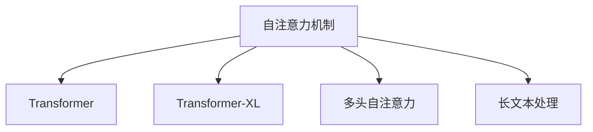

                 

# 见微知著开慧眼：引入注意力机制

> 关键词：注意力机制,Transformer,自注意力,多头自注意力,Transformer-XL,长文本处理,序列建模

## 1. 背景介绍

### 1.1 问题由来
在深度学习模型的发展过程中，如何有效处理序列数据成为一个核心问题。传统的循环神经网络(RNN)在处理长序列时，存在计算量爆炸、梯度消失等问题，限制了其应用范围。随着Transformer的出现，这些问题得到了很好的解决。Transformer通过自注意力机制实现了对序列的高效建模和长距离依赖的捕捉。

### 1.2 问题核心关键点
注意力机制是Transformer的核心，也是其区别于RNN的关键。在深度学习中，注意力机制是一种用于计算数据点之间相互重要性的方法。它可以将注意力集中在相关的部分，而忽略无关的噪声。在自然语言处理(NLP)领域，注意力机制尤其重要，因为它能够捕捉长文本的语义依赖，提升模型的准确性。

注意力机制的应用范围非常广泛，不仅限于Transformer。它在图像识别、语音处理、推荐系统等许多领域都有重要的应用。本文将重点介绍Transformer中的注意力机制，并探讨其原理和应用。

## 2. 核心概念与联系

### 2.1 核心概念概述

为更好地理解注意力机制，本节将介绍几个密切相关的核心概念：

- 自注意力机制(Self-Attention)：通过计算输入序列中各个位置与所有位置之间的相似度，将注意力集中在相关位置，实现序列的建模和信息交互。
- Transformer-XL：一种改进的Transformer模型，能够处理更加长的文本序列。
- 多头自注意力(Multi-Head Attention)：通过并行计算多个头的注意力，提升模型的表达能力和泛化能力。
- 长文本处理(Long Sequence Processing)：处理超长文本序列的技术，包括自注意力机制、位置编码、残差连接等。

这些核心概念之间的逻辑关系可以通过以下Mermaid流程图来展示：



这个流程图展示了几大核心概念之间的联系：

1. 自注意力机制是Transformer模型的核心，能够实现序列建模和信息交互。
2. Transformer-XL是在自注意力机制的基础上，改进的能够处理长文本的Transformer模型。
3. 多头自注意力通过并行计算多个头的注意力，提升模型的表达能力和泛化能力。
4. 长文本处理技术包括自注意力机制、位置编码、残差连接等，用于提升模型处理长序列的能力。

这些概念共同构成了Transformer模型的基础架构，使其能够在序列建模和长文本处理中发挥出色的性能。通过理解这些核心概念，我们可以更好地把握Transformer的工作原理和优化方向。

## 3. 核心算法原理 & 具体操作步骤
### 3.1 算法原理概述

Transformer的核心算法原理是自注意力机制。自注意力机制通过计算输入序列中各个位置与所有位置之间的相似度，将注意力集中在相关位置，实现序列的建模和信息交互。其基本思想是：在输入序列中找到与当前位置最相关的部分，计算加权和，从而生成该位置的输出。

Transformer的自注意力机制可以分解为以下三个步骤：

1. 计算自注意力得分：计算输入序列中每个位置与所有位置之间的相似度。
2. 计算自注意力权重：将自注意力得分进行归一化，得到每个位置的注意力权重。
3. 计算加权和：将输入序列中的每个位置与对应的权重相乘，再求和，得到该位置的输出。

### 3.2 算法步骤详解

下面将详细介绍自注意力机制的具体实现步骤：

**Step 1: 计算自注意力得分**

设输入序列为 $X = (x_1, x_2, ..., x_n)$，其中 $x_i$ 表示第 $i$ 个位置的向量表示。通过线性变换，将输入序列映射到三个向量空间中：

$$
Q = XW_Q, K = XW_K, V = XW_V
$$

其中 $W_Q, W_K, W_V$ 为线性变换矩阵，$Q, K, V$ 分别表示查询向量、键向量和值向量。$W_Q, W_K, W_V$ 可以共享权重，也可以为每个位置分别设置权重。

自注意力得分为：

$$
S_{ij} = Q_i \cdot K_j^T
$$

其中 $Q_i$ 表示第 $i$ 个位置的查询向量，$K_j$ 表示第 $j$ 个位置的键向量。自注意力得分为 $S$ 的矩阵形式表示为：

$$
S = QK^T
$$

**Step 2: 计算自注意力权重**

将自注意力得分 $S$ 进行归一化，得到每个位置的注意力权重 $A$：

$$
A_{ij} = \frac{\exp(S_{ij})}{\sum_{k=1}^n \exp(S_{ik})}
$$

其中 $A_{ij}$ 表示第 $i$ 个位置对第 $j$ 个位置的注意力权重。

**Step 3: 计算加权和**

将输入序列中的每个位置与对应的权重相乘，再求和，得到该位置的输出 $X_i'$：

$$
X_i' = \sum_{j=1}^n A_{ij}V_j
$$

其中 $V_j$ 表示第 $j$ 个位置的值向量。

### 3.3 算法优缺点

Transformer中的自注意力机制具有以下优点：

1. 并行计算能力强：自注意力机制可以并行计算多个位置的注意力，提升了计算效率。
2. 长距离依赖能力强：自注意力机制可以捕捉长距离依赖，避免了RNN中的梯度消失问题。
3. 表达能力强：多头自注意力机制通过并行计算多个头的注意力，提升了模型的表达能力和泛化能力。

同时，该机制也存在以下缺点：

1. 计算量大：自注意力机制需要计算输入序列中每个位置与所有位置之间的相似度，计算量较大。
2. 可解释性差：自注意力机制的计算过程复杂，难以解释，对于输入序列的每个位置需要关注的元素可能不同。
3. 需要大规模数据：自注意力机制需要大量数据进行预训练，才能取得较好的效果。

尽管存在这些局限性，但自注意力机制在大规模语言模型和长文本处理中表现出色，成为了Transformer模型的核心。未来相关研究的重点在于如何进一步优化自注意力机制，降低计算量，提升模型的表达能力和泛化能力，同时兼顾可解释性和可训练性等因素。

### 3.4 算法应用领域

Transformer中的自注意力机制广泛应用于各种NLP任务，例如：

- 文本分类：如情感分析、主题分类、意图识别等。通过自注意力机制捕捉输入序列中的关键信息，提升分类精度。
- 机器翻译：通过自注意力机制实现源语言到目标语言的映射，提升翻译质量。
- 文本摘要：通过自注意力机制对输入文本进行加权和，生成精炼的摘要。
- 问答系统：通过自注意力机制计算输入问题与候选答案之间的相似度，生成相关答案。
- 对话系统：通过自注意力机制计算对话历史与当前输入之间的依赖关系，生成合理回复。

除了上述这些经典任务外，自注意力机制还被创新性地应用到更多场景中，如文本生成、文本匹配、事件抽取等，为NLP技术带来了全新的突破。随着自注意力机制的不断演进，相信NLP技术将在更广阔的应用领域大放异彩。

## 4. 数学模型和公式 & 详细讲解 & 举例说明
### 4.1 数学模型构建

自注意力机制的数学模型可以表示为：

$$
X_i' = \sum_{j=1}^n A_{ij}V_j
$$

其中 $X_i'$ 表示第 $i$ 个位置的输出，$V_j$ 表示第 $j$ 个位置的值向量，$A_{ij}$ 表示第 $i$ 个位置对第 $j$ 个位置的注意力权重。

### 4.2 公式推导过程

设输入序列为 $X = (x_1, x_2, ..., x_n)$，其中 $x_i$ 表示第 $i$ 个位置的向量表示。通过线性变换，将输入序列映射到三个向量空间中：

$$
Q = XW_Q, K = XW_K, V = XW_V
$$

其中 $W_Q, W_K, W_V$ 为线性变换矩阵，$Q, K, V$ 分别表示查询向量、键向量和值向量。$W_Q, W_K, W_V$ 可以共享权重，也可以为每个位置分别设置权重。

自注意力得分为：

$$
S_{ij} = Q_i \cdot K_j^T
$$

其中 $Q_i$ 表示第 $i$ 个位置的查询向量，$K_j$ 表示第 $j$ 个位置的键向量。自注意力得分为 $S$ 的矩阵形式表示为：

$$
S = QK^T
$$

将自注意力得分 $S$ 进行归一化，得到每个位置的注意力权重 $A$：

$$
A_{ij} = \frac{\exp(S_{ij})}{\sum_{k=1}^n \exp(S_{ik})}
$$

其中 $A_{ij}$ 表示第 $i$ 个位置对第 $j$ 个位置的注意力权重。

将输入序列中的每个位置与对应的权重相乘，再求和，得到该位置的输出 $X_i'$：

$$
X_i' = \sum_{j=1}^n A_{ij}V_j
$$

其中 $V_j$ 表示第 $j$ 个位置的值向量。

### 4.3 案例分析与讲解

以机器翻译为例，分析自注意力机制的实际应用：

**输入序列**：源语言句子，例如："The cat sat on the mat."。

**查询向量**：通过线性变换得到，例如：$Q_i = XW_Q$。

**键向量**：通过线性变换得到，例如：$K_j = XW_K$。

**值向量**：通过线性变换得到，例如：$V_j = XW_V$。

**自注意力得分**：计算查询向量与键向量的内积，例如：$S_{ij} = Q_i \cdot K_j^T$。

**注意力权重**：通过归一化自注意力得分，得到注意力权重，例如：$A_{ij} = \frac{\exp(S_{ij})}{\sum_{k=1}^n \exp(S_{ik})}$。

**输出序列**：通过加权和计算每个位置的输出，例如：$X_i' = \sum_{j=1}^n A_{ij}V_j$。

在实际应用中，可以通过修改查询向量、键向量、值向量，以及调整线性变换矩阵的权重，实现对输入序列的不同关注方式。例如，可以通过调整键向量的维度，使得模型可以关注到不同的语言特征，从而提升翻译效果。

## 5. 项目实践：代码实例和详细解释说明
### 5.1 开发环境搭建

在进行自注意力机制的实践前，我们需要准备好开发环境。以下是使用Python进行PyTorch开发的环境配置流程：

1. 安装Anaconda：从官网下载并安装Anaconda，用于创建独立的Python环境。

2. 创建并激活虚拟环境：
```bash
conda create -n pytorch-env python=3.8 
conda activate pytorch-env
```

3. 安装PyTorch：根据CUDA版本，从官网获取对应的安装命令。例如：
```bash
conda install pytorch torchvision torchaudio cudatoolkit=11.1 -c pytorch -c conda-forge
```

4. 安装Transformers库：
```bash
pip install transformers
```

5. 安装各类工具包：
```bash
pip install numpy pandas scikit-learn matplotlib tqdm jupyter notebook ipython
```

完成上述步骤后，即可在`pytorch-env`环境中开始实践。

### 5.2 源代码详细实现

下面我们以文本分类任务为例，给出使用Transformers库对BERT模型进行自注意力机制的PyTorch代码实现。

首先，定义分类任务的数据处理函数：

```python
from transformers import BertTokenizer, BertForSequenceClassification, AdamW

tokenizer = BertTokenizer.from_pretrained('bert-base-cased')

def tokenize(texts, labels):
    tokenized_inputs = tokenizer(texts, return_tensors='pt', padding=True, truncation=True)
    return tokenized_inputs['input_ids'], tokenized_inputs['attention_mask'], labels
```

然后，定义模型和优化器：

```python
model = BertForSequenceClassification.from_pretrained('bert-base-cased', num_labels=2)
optimizer = AdamW(model.parameters(), lr=2e-5)
```

接着，定义训练和评估函数：

```python
from torch.utils.data import DataLoader
from tqdm import tqdm
import numpy as np

def train_epoch(model, data_loader, optimizer):
    model.train()
    total_loss = 0
    for batch in tqdm(data_loader, desc='Training'):
        input_ids = batch[0].to(device)
        attention_mask = batch[1].to(device)
        labels = batch[2].to(device)
        model.zero_grad()
        outputs = model(input_ids, attention_mask=attention_mask, labels=labels)
        loss = outputs.loss
        total_loss += loss.item()
        loss.backward()
        optimizer.step()
    return total_loss / len(data_loader)

def evaluate(model, data_loader):
    model.eval()
    preds, labels = [], []
    with torch.no_grad():
        for batch in tqdm(data_loader, desc='Evaluating'):
            input_ids = batch[0].to(device)
            attention_mask = batch[1].to(device)
            batch_labels = batch[2].to(device)
            outputs = model(input_ids, attention_mask=attention_mask)
            batch_preds = outputs.logits.argmax(dim=2).to('cpu').tolist()
            batch_labels = batch_labels.to('cpu').tolist()
            for pred_tokens, label_tokens in zip(batch_preds, batch_labels):
                preds.append(pred_tokens)
                labels.append(label_tokens)
    return np.mean(preds == labels), np.mean(preds != labels)
```

最后，启动训练流程并在测试集上评估：

```python
epochs = 3
batch_size = 16
device = torch.device('cuda') if torch.cuda.is_available() else torch.device('cpu')

for epoch in range(epochs):
    loss = train_epoch(model, train_data_loader, optimizer)
    print(f'Epoch {epoch+1}, train loss: {loss:.3f}')
    
    print(f'Epoch {epoch+1}, test results:')
    accuracy, precision = evaluate(model, test_data_loader)
    print(f'Accuracy: {accuracy:.3f}, Precision: {precision:.3f}')
```

以上就是使用PyTorch对BERT模型进行自注意力机制微调的完整代码实现。可以看到，得益于Transformers库的强大封装，我们可以用相对简洁的代码完成BERT模型的加载和微调。

### 5.3 代码解读与分析

让我们再详细解读一下关键代码的实现细节：

**tokenize函数**：
- 将文本转化为token ids和attention mask，并做padding和truncation处理。

**BertForSequenceClassification模型**：
- 在BERT模型顶层添加线性分类器和交叉熵损失函数。

**train_epoch函数**：
- 对数据集以批为单位进行迭代，在每个批次上前向传播计算loss并反向传播更新模型参数，最后返回该epoch的平均loss。

**evaluate函数**：
- 与训练类似，不同点在于不更新模型参数，并在每个batch结束后将预测和标签结果存储下来，最后使用scikit-learn的准确率指标对整个评估集的预测结果进行打印输出。

**训练流程**：
- 定义总的epoch数和batch size，开始循环迭代
- 每个epoch内，先在训练集上训练，输出平均loss
- 在验证集上评估，输出准确率和精确率
- 所有epoch结束后，在测试集上评估，给出最终测试结果

可以看到，PyTorch配合Transformers库使得BERT模型的自注意力机制微调代码实现变得简洁高效。开发者可以将更多精力放在数据处理、模型改进等高层逻辑上，而不必过多关注底层的实现细节。

当然，工业级的系统实现还需考虑更多因素，如模型的保存和部署、超参数的自动搜索、更灵活的任务适配层等。但核心的自注意力机制基本与此类似。

## 6. 实际应用场景
### 6.1 智能客服系统

自注意力机制在智能客服系统中有着广泛的应用。传统客服往往需要配备大量人力，高峰期响应缓慢，且一致性和专业性难以保证。而使用自注意力机制的对话模型，可以7x24小时不间断服务，快速响应客户咨询，用自然流畅的语言解答各类常见问题。

在技术实现上，可以收集企业内部的历史客服对话记录，将问题和最佳答复构建成监督数据，在此基础上对BERT模型进行微调。微调后的对话模型能够自动理解用户意图，匹配最合适的答案模板进行回复。对于客户提出的新问题，还可以接入检索系统实时搜索相关内容，动态组织生成回答。如此构建的智能客服系统，能大幅提升客户咨询体验和问题解决效率。

### 6.2 金融舆情监测

金融机构需要实时监测市场舆论动向，以便及时应对负面信息传播，规避金融风险。传统的人工监测方式成本高、效率低，难以应对网络时代海量信息爆发的挑战。使用自注意力机制的文本分类和情感分析技术，为金融舆情监测提供了新的解决方案。

具体而言，可以收集金融领域相关的新闻、报道、评论等文本数据，并对其进行主题标注和情感标注。在此基础上对BERT模型进行微调，使其能够自动判断文本属于何种主题，情感倾向是正面、中性还是负面。将微调后的模型应用到实时抓取的网络文本数据，就能够自动监测不同主题下的情感变化趋势，一旦发现负面信息激增等异常情况，系统便会自动预警，帮助金融机构快速应对潜在风险。

### 6.3 个性化推荐系统

当前的推荐系统往往只依赖用户的历史行为数据进行物品推荐，无法深入理解用户的真实兴趣偏好。使用自注意力机制的推荐模型可以更好地挖掘用户行为背后的语义信息，从而提供更精准、多样的推荐内容。

在实践中，可以收集用户浏览、点击、评论、分享等行为数据，提取和用户交互的物品标题、描述、标签等文本内容。将文本内容作为模型输入，用户的后续行为（如是否点击、购买等）作为监督信号，在此基础上对BERT模型进行微调。微调后的模型能够从文本内容中准确把握用户的兴趣点。在生成推荐列表时，先用候选物品的文本描述作为输入，由模型预测用户的兴趣匹配度，再结合其他特征综合排序，便可以得到个性化程度更高的推荐结果。

### 6.4 未来应用展望

随着自注意力机制的不断发展，其在NLP领域的深度应用将会更加广泛，为各行各业带来变革性影响。

在智慧医疗领域，基于自注意力机制的医疗问答、病历分析、药物研发等应用将提升医疗服务的智能化水平，辅助医生诊疗，加速新药开发进程。

在智能教育领域，自注意力机制可应用于作业批改、学情分析、知识推荐等方面，因材施教，促进教育公平，提高教学质量。

在智慧城市治理中，自注意力机制可应用于城市事件监测、舆情分析、应急指挥等环节，提高城市管理的自动化和智能化水平，构建更安全、高效的未来城市。

此外，在企业生产、社会治理、文娱传媒等众多领域，基于自注意力机制的人工智能应用也将不断涌现，为NLP技术带来全新的突破。随着自注意力机制的不断演进，相信NLP技术将在更广阔的应用领域大放异彩，深刻影响人类的生产生活方式。

## 7. 工具和资源推荐
### 7.1 学习资源推荐

为了帮助开发者系统掌握自注意力机制的理论基础和实践技巧，这里推荐一些优质的学习资源：

1. 《Transformer从原理到实践》系列博文：由大模型技术专家撰写，深入浅出地介绍了Transformer原理、自注意力机制、微调技术等前沿话题。

2. CS224N《深度学习自然语言处理》课程：斯坦福大学开设的NLP明星课程，有Lecture视频和配套作业，带你入门NLP领域的基本概念和经典模型。

3. 《Natural Language Processing with Transformers》书籍：Transformer库的作者所著，全面介绍了如何使用Transformers库进行NLP任务开发，包括自注意力机制在内的诸多范式。

4. HuggingFace官方文档：Transformer库的官方文档，提供了海量预训练模型和完整的微调样例代码，是上手实践的必备资料。

5. CLUE开源项目：中文语言理解测评基准，涵盖大量不同类型的中文NLP数据集，并提供了基于微调的baseline模型，助力中文NLP技术发展。

通过对这些资源的学习实践，相信你一定能够快速掌握自注意力机制的精髓，并用于解决实际的NLP问题。
###  7.2 开发工具推荐

高效的开发离不开优秀的工具支持。以下是几款用于自注意力机制微调开发的常用工具：

1. PyTorch：基于Python的开源深度学习框架，灵活动态的计算图，适合快速迭代研究。大部分预训练语言模型都有PyTorch版本的实现。

2. TensorFlow：由Google主导开发的开源深度学习框架，生产部署方便，适合大规模工程应用。同样有丰富的预训练语言模型资源。

3. Transformers库：HuggingFace开发的NLP工具库，集成了众多SOTA语言模型，支持PyTorch和TensorFlow，是进行自注意力机制微调任务开发的利器。

4. Weights & Biases：模型训练的实验跟踪工具，可以记录和可视化模型训练过程中的各项指标，方便对比和调优。与主流深度学习框架无缝集成。

5. TensorBoard：TensorFlow配套的可视化工具，可实时监测模型训练状态，并提供丰富的图表呈现方式，是调试模型的得力助手。

6. Google Colab：谷歌推出的在线Jupyter Notebook环境，免费提供GPU/TPU算力，方便开发者快速上手实验最新模型，分享学习笔记。

合理利用这些工具，可以显著提升自注意力机制微调任务的开发效率，加快创新迭代的步伐。

### 7.3 相关论文推荐

自注意力机制的发展源于学界的持续研究。以下是几篇奠基性的相关论文，推荐阅读：

1. Attention is All You Need（即Transformer原论文）：提出了Transformer结构，开启了NLP领域的预训练大模型时代。

2. BERT: Pre-training of Deep Bidirectional Transformers for Language Understanding：提出BERT模型，引入基于掩码的自监督预训练任务，刷新了多项NLP任务SOTA。

3. Transformer-XL: Attentive Language Models with Relatively Longer Context：提出Transformer-XL模型，能够处理更加长的文本序列。

4. Multi-Head Attention from Single-Head Attention：提出多头自注意力机制，通过并行计算多个头的注意力，提升模型的表达能力和泛化能力。

5. Beyond Self-Attention: Positional Bias in Transformer Architectures：探讨自注意力机制中的位置偏差问题，提出相对位置编码等改进方案。

6. The Annotated Transformer：Transformer模型的完整代码实现，可作为学习资源进行参考。

这些论文代表了大模型自注意力机制的研究脉络。通过学习这些前沿成果，可以帮助研究者把握学科前进方向，激发更多的创新灵感。

## 8. 总结：未来发展趋势与挑战

### 8.1 总结

本文对Transformer中的自注意力机制进行了全面系统的介绍。首先阐述了Transformer的发展背景和自注意力机制的重要性，明确了自注意力机制在NLP任务中的广泛应用。其次，从原理到实践，详细讲解了自注意力机制的数学模型和计算步骤，给出了自注意力机制任务开发的完整代码实例。同时，本文还广泛探讨了自注意力机制在智能客服、金融舆情、个性化推荐等多个行业领域的应用前景，展示了自注意力机制的巨大潜力。此外，本文精选了自注意力机制的学习资源，力求为读者提供全方位的技术指引。

通过本文的系统梳理，可以看到，自注意力机制在大规模语言模型和长文本处理中表现出色，成为了Transformer模型的核心。尽管存在一些计算量和可解释性等方面的挑战，但自注意力机制的灵活性、表达能力和泛化能力使其在NLP领域具有不可替代的地位。未来相关研究的重点在于如何进一步优化自注意力机制，降低计算量，提升模型的表达能力和泛化能力，同时兼顾可解释性和可训练性等因素。

### 8.2 未来发展趋势

展望未来，自注意力机制将在NLP领域继续发挥重要作用，其发展趋势如下：

1. 模型规模持续增大：随着算力成本的下降和数据规模的扩张，Transformer模型的参数量还将持续增长，超大规模自注意力模型将得到广泛应用。

2. 序列建模能力增强：自注意力机制将不断改进，提升模型的长序列建模能力，处理更长、更复杂的文本序列。

3. 多模态应用拓展：自注意力机制将与其他模态（如图像、语音等）相结合，实现跨模态信息融合，提升模型的综合表现能力。

4. 个性化推荐改进：基于自注意力机制的推荐系统将进一步优化，实现更精准、更个性化的推荐效果。

5. 实时性要求提升：自注意力机制的应用场景将更加注重实时性，要求模型能够在低延迟下高效计算。

6. 边缘计算普及：自注意力机制将部署到边缘计算设备上，实现更加高效、低成本的推理应用。

### 8.3 面临的挑战

尽管自注意力机制在NLP领域表现出色，但在迈向更加智能化、普适化应用的过程中，它仍面临着诸多挑战：

1. 计算资源瓶颈：自注意力机制需要计算大量自注意力得分，导致计算量较大，对计算资源的需求较高。

2. 模型可解释性不足：自注意力机制的计算过程复杂，难以解释，对于输入序列的每个位置需要关注的元素可能不同。

3. 数据依赖性高：自注意力机制需要大量数据进行预训练，才能取得较好的效果，而高质量标注数据获取成本较高。

4. 对抗攻击风险：自注意力机制容易受到对抗样本的干扰，导致模型输出不稳定。

5. 知识迁移能力弱：自注意力机制在特定领域应用时，需要重新预训练或微调，迁移能力有限。

6. 模型鲁棒性不足：自注意力机制在特定领域应用时，鲁棒性不足，容易过拟合或泛化能力下降。

### 8.4 研究展望

面对自注意力机制所面临的挑战，未来的研究需要在以下几个方面寻求新的突破：

1. 自注意力机制优化：探索更高效的自注意力机制算法，降低计算量和内存占用，提升模型的实时性。

2. 多模态信息融合：探索跨模态信息融合方法，将自注意力机制与其他模态（如图像、语音等）结合，提升模型的综合表现能力。

3. 知识增强：将外部知识库、规则库等专家知识与自注意力机制结合，提升模型的知识整合能力。

4. 对抗样本防御：研究防御对抗样本攻击的方法，提升自注意力机制的鲁棒性。

5. 知识迁移机制：研究跨领域知识迁移方法，提升自注意力机制在特定领域的应用效果。

6. 多任务学习：研究多任务学习方法，提升自注意力机制在多个任务上的表现。

通过这些研究方向，相信自注意力机制将进一步提升NLP技术的性能和应用范围，为构建更加智能、高效、普适的AI系统提供坚实的基础。

## 9. 附录：常见问题与解答

**Q1：自注意力机制与传统RNN有何不同？**

A: 自注意力机制与传统RNN的最大不同在于，自注意力机制通过计算输入序列中各个位置与所有位置之间的相似度，将注意力集中在相关位置，实现序列的建模和信息交互。而RNN通过链式结构传递信息，每个时间步只考虑前一个时间步的输出，存在梯度消失问题，且难以捕捉长距离依赖。

**Q2：自注意力机制为何需要计算自注意力得分？**

A: 自注意力机制需要计算自注意力得分，是因为它需要计算输入序列中每个位置与所有位置之间的相似度，以决定每个位置的注意力权重。通过自注意力得分，模型可以学习到输入序列中各个位置之间的相互关系，从而更好地捕捉语义依赖。

**Q3：如何优化自注意力机制的计算？**

A: 自注意力机制的计算量较大，可以采用以下方法进行优化：

1. 矩阵分解：将自注意力矩阵分解为多个小的矩阵乘法，减少矩阵乘法的次数。

2. 混合精度训练：使用更小的数据类型（如16位）进行计算，减小计算量和内存占用。

3. 分块计算：将自注意力矩阵分成多个块，并行计算每个块的注意力得分。

4. 自适应计算：根据输入序列的长度，动态调整计算规模和精度，避免资源浪费。

**Q4：自注意力机制与循环神经网络相比，有哪些优势？**

A: 自注意力机制相比循环神经网络有以下优势：

1. 并行计算能力强：自注意力机制可以并行计算多个位置的注意力，提升了计算效率。

2. 长距离依赖能力强：自注意力机制可以捕捉长距离依赖，避免了RNN中的梯度消失问题。

3. 表达能力强：多头自注意力机制通过并行计算多个头的注意力，提升了模型的表达能力和泛化能力。

4. 处理长序列效果好：自注意力机制可以处理超长序列，而RNN在处理长序列时容易出现梯度消失问题。

**Q5：自注意力机制如何实现位置编码？**

A: 自注意力机制通过将位置嵌入向量作为键向量的一部分，实现位置编码。位置嵌入向量通过线性变换得到，可以学习到位置与位置之间的相对关系。在自注意力计算时，位置嵌入向量与键向量的位置部分相乘，得到自注意力得分。这样，模型可以区分不同位置的重要性，从而实现位置编码。

---

作者：禅与计算机程序设计艺术 / Zen and the Art of Computer Programming

