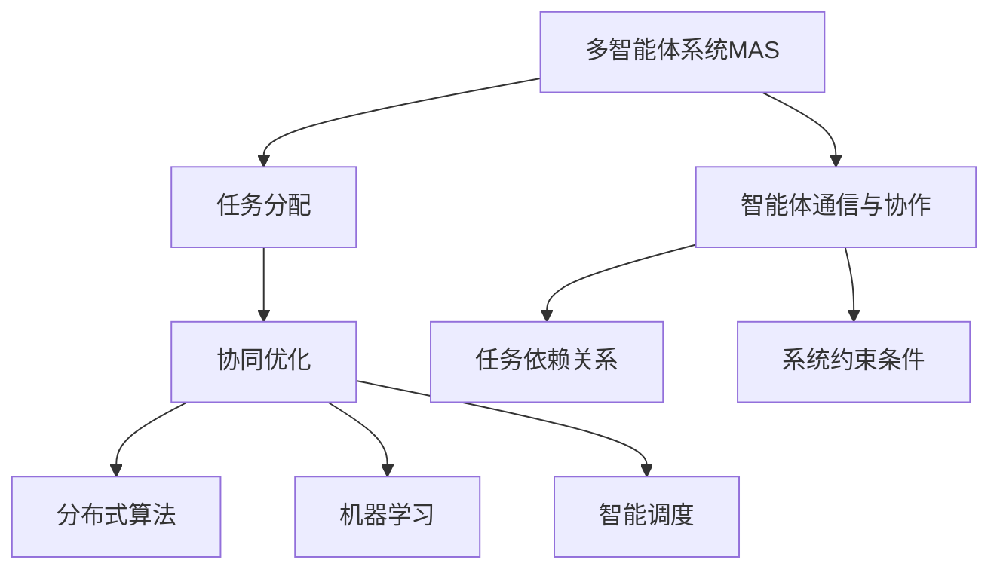

                 

# 规划与多智能体协同：优化任务分配

> 关键词：多智能体系统(Multi-agent Systems), 任务分配(Task Assignment), 协同优化(Coordinated Optimization), 分布式算法(Distributed Algorithms), 机器学习(Machine Learning), 智能调度(Intelligent Scheduling)

## 1. 背景介绍

### 1.1 问题由来

在现代社会中，任务分配是一个普遍存在的问题，涉及多个领域，如生产制造、交通管理、城市规划、机器人协作等。高效的任务分配能够提升资源利用率，缩短任务完成时间，提高系统效率。然而，随着系统复杂性的增加，任务分配问题变得越来越困难。传统的集中式任务分配方法难以处理大规模、动态变化的任务需求。

多智能体系统(Multi-agent Systems,MAS)提供了一种分布式、协作化的任务分配方案，能够适应动态变化的任务环境，提高系统的响应速度和灵活性。通过智能体的协同工作，可以更有效地解决复杂任务分配问题。

### 1.2 问题核心关键点

任务分配的核心问题是如何在多个智能体之间合理分配任务，以最大化系统性能。具体来说，需要考虑以下几个关键点：

- **任务类型与需求**：不同任务具有不同的特性，如复杂度、时间限制、资源需求等，需要根据任务类型选择相应的分配策略。
- **智能体数量与能力**：智能体的数量和能力对任务分配有重要影响，需要动态调整智能体的数量和任务负荷。
- **任务依赖关系**：某些任务之间存在依赖关系，需要考虑任务间的顺序和关联性。
- **系统约束条件**：如时间、资源、成本等限制条件，需要确保任务分配方案满足这些约束。
- **智能体通信与协作**：智能体之间的通信和协作机制，直接影响任务分配的效率和公平性。

这些关键点共同决定了任务分配问题的复杂性，需要在算法设计中加以考虑。

## 2. 核心概念与联系

### 2.1 核心概念概述

为了更好地理解任务分配问题，本节将介绍几个密切相关的核心概念：

- **多智能体系统(MAS)**：由多个智能体组成的系统，智能体之间通过通信和协作实现分布式任务处理。
- **任务分配(Task Assignment)**：在多智能体系统中，将任务合理分配给智能体，以优化系统性能的过程。
- **协同优化(Coordinated Optimization)**：多智能体系统通过协作和信息共享，共同优化任务分配方案的过程。
- **分布式算法(Distributed Algorithms)**：一种在多个节点上并发执行的算法，能够处理大规模、分布式系统中的任务分配问题。
- **机器学习(Machine Learning)**：通过训练数据集，使智能体能够自主学习和优化任务分配策略。
- **智能调度(Intelligent Scheduling)**：利用先进算法和模型，智能地进行任务分配，以提高系统效率和资源利用率。

这些概念之间的逻辑关系可以通过以下Mermaid流程图来展示：



这个流程图展示了一个典型的多智能体任务分配过程：

1. 多智能体系统通过通信与协作，共同进行任务分配。
2. 任务分配过程通过协同优化和分布式算法进行。
3. 利用机器学习和智能调度技术，进一步优化任务分配方案。
4. 任务分配过程中需要考虑智能体间的通信和协作机制。
5. 需要考虑任务之间的依赖关系和系统约束条件。

这些核心概念共同构成了任务分配问题的框架，指导我们在设计算法和系统时需考虑的关键点。

## 3. 核心算法原理 & 具体操作步骤
### 3.1 算法原理概述

多智能体任务分配的核心算法原理是利用协同优化和多智能体通信机制，通过分布式算法在多个智能体之间分配任务。其基本思想是：

1. 定义任务集合和智能体集合，建立任务分配模型。
2. 通过通信和协作，智能体共享任务信息和状态，进行任务分配决策。
3. 利用分布式算法，在智能体之间迭代更新任务分配方案。
4. 通过机器学习模型，不断优化任务分配策略。

整个任务分配过程是一个迭代优化的过程，旨在最大化系统性能，如任务完成时间、资源利用率等。

### 3.2 算法步骤详解

基于上述算法原理，任务分配过程可以大致分为以下几个步骤：

**Step 1: 任务建模与初始化**

1. 定义任务集合和智能体集合。每个任务具有任务类型、需求、时间限制等属性，智能体具有处理能力、位置、状态等属性。
2. 初始化任务分配模型，如基于拍卖或匹配的算法。

**Step 2: 智能体通信与协作**

1. 设计智能体之间的通信机制，如信息广播、消息传递、协作决策等。
2. 通过通信机制，智能体共享任务信息和状态，进行任务分配决策。

**Step 3: 分布式算法迭代**

1. 定义分布式算法，如拍卖算法、匹配算法、协商算法等。
2. 在智能体之间迭代执行分布式算法，更新任务分配方案。
3. 记录每个迭代步骤的任务分配状态和性能指标，用于后续优化。

**Step 4: 机器学习优化**

1. 收集任务分配历史数据，构建训练数据集。
2. 利用机器学习模型，如神经网络、决策树等，进行任务分配策略优化。
3. 将优化后的策略应用于新的任务分配过程。

**Step 5: 评估与反馈**

1. 在新的任务分配过程中，评估任务完成时间和资源利用率等性能指标。
2. 根据评估结果，调整任务分配策略，进行反馈迭代。

**Step 6: 系统更新与调整**

1. 根据任务需求和智能体状态的变化，动态调整智能体数量和任务负荷。
2. 优化通信和协作机制，提升任务分配效率和公平性。

以上是任务分配过程的基本步骤，具体实现时需要根据具体应用场景进行调整和优化。

### 3.3 算法优缺点

基于协同优化的任务分配算法具有以下优点：

1. 适应性强：能够处理大规模、动态变化的任务需求。
2. 灵活性高：智能体之间的通信和协作机制，适应不同的任务和智能体类型。
3. 协作效率高：通过多智能体协同工作，能够快速响应任务变化，优化任务分配方案。

但该算法也存在一些缺点：

1. 通信开销大：智能体之间的通信机制可能带来较大的通信开销，影响系统效率。
2. 复杂度高：需要设计复杂的分布式算法和机器学习模型，增加了算法实现难度。
3. 收敛速度慢：分布式算法迭代过程中，需要多次通信和协作，收敛速度可能较慢。
4. 公平性问题：需要设计公平的任务分配策略，避免智能体间的资源不均衡。

尽管存在这些局限性，但协同优化的任务分配算法在解决复杂任务分配问题上，具有重要的理论和应用价值。

### 3.4 算法应用领域

基于协同优化的任务分配算法在多个领域中得到广泛应用，例如：

- 生产制造：通过智能机器人和调度系统，实现生产任务的自动化分配和调度。
- 交通管理：在交通系统中，通过多智能体协同工作，优化交通流和信号控制。
- 城市规划：在城市管理中，通过智能体协同优化，提高资源利用率和环境质量。
- 机器人协作：在机器人协作任务中，通过多智能体通信和协作，实现高效的任务分配和执行。
- 分布式计算：在分布式计算环境中，通过任务分配算法，优化计算资源和任务负载。

以上领域展示了协同优化的任务分配算法在解决复杂任务分配问题上的广泛应用前景。

## 4. 数学模型和公式 & 详细讲解 & 举例说明
### 4.1 数学模型构建

在任务分配问题中，我们通常使用整数线性规划(ILP)模型来描述任务分配过程。假设任务集合为 $T=\{t_1, t_2, \cdots, t_n\}$，智能体集合为 $A=\{a_1, a_2, \cdots, a_m\}$，任务 $t_i$ 分配给智能体 $a_j$ 的概率为 $x_{ij}$。

任务分配的目标是最小化任务完成时间，即：

$$
\min \sum_{i=1}^{n} \sum_{j=1}^{m} d_{ij} x_{ij}
$$

其中 $d_{ij}$ 为任务 $t_i$ 分配给智能体 $a_j$ 的时间成本。

约束条件包括：
1. 每个任务只能分配给一个智能体，即 $x_{ij} \leq 1$。
2. 每个智能体的任务负荷不超过其处理能力，即 $\sum_{i=1}^{n} x_{ij} \leq c_j$，其中 $c_j$ 为智能体 $a_j$ 的处理能力。
3. 任务分配概率和为1，即 $\sum_{j=1}^{m} x_{ij} = 1$。

数学模型可以表示为：

$$
\begin{aligned}
\min & \quad \sum_{i=1}^{n} \sum_{j=1}^{m} d_{ij} x_{ij} \\
\text{subject to} & \quad \\
& \quad \sum_{j=1}^{m} x_{ij} = 1 \quad \forall i \in T \\
& \quad \sum_{i=1}^{n} x_{ij} \leq c_j \quad \forall j \in A \\
& \quad x_{ij} \geq 0 \quad \forall i,j
\end{aligned}
$$

### 4.2 公式推导过程

假设任务集合为 $T=\{t_1, t_2, \cdots, t_n\}$，智能体集合为 $A=\{a_1, a_2, \cdots, a_m\}$，任务 $t_i$ 分配给智能体 $a_j$ 的时间成本为 $d_{ij}$。

任务分配的目标是最小化任务完成时间，即：

$$
\min \sum_{i=1}^{n} \sum_{j=1}^{m} d_{ij} x_{ij}
$$

约束条件包括：
1. 每个任务只能分配给一个智能体，即 $x_{ij} \leq 1$。
2. 每个智能体的任务负荷不超过其处理能力，即 $\sum_{i=1}^{n} x_{ij} \leq c_j$，其中 $c_j$ 为智能体 $a_j$ 的处理能力。
3. 任务分配概率和为1，即 $\sum_{j=1}^{m} x_{ij} = 1$。

数学模型可以表示为：

$$
\begin{aligned}
\min & \quad \sum_{i=1}^{n} \sum_{j=1}^{m} d_{ij} x_{ij} \\
\text{subject to} & \quad \\
& \quad \sum_{j=1}^{m} x_{ij} = 1 \quad \forall i \in T \\
& \quad \sum_{i=1}^{n} x_{ij} \leq c_j \quad \forall j \in A \\
& \quad x_{ij} \geq 0 \quad \forall i,j
\end{aligned}
$$

通过求解上述整数线性规划模型，可以得到最优的任务分配方案。

### 4.3 案例分析与讲解

以一个简单的任务分配问题为例，假设任务集合为 $T=\{t_1, t_2, t_3\}$，智能体集合为 $A=\{a_1, a_2\}$，任务 $t_i$ 分配给智能体 $a_j$ 的时间成本为 $d_{ij}$。

假设智能体 $a_1$ 的处理能力为10，智能体 $a_2$ 的处理能力为5，任务 $t_1$ 需要2小时，任务 $t_2$ 需要3小时，任务 $t_3$ 需要4小时。

任务分配的目标是最小化任务完成时间，即：

$$
\min \sum_{i=1}^{3} \sum_{j=1}^{2} d_{ij} x_{ij} = 2 \cdot x_{11} + 3 \cdot x_{12} + 4 \cdot x_{13}
$$

约束条件包括：
1. 每个任务只能分配给一个智能体，即 $x_{ij} \leq 1$。
2. 每个智能体的任务负荷不超过其处理能力，即 $x_{11} + x_{12} \leq 10$，$x_{13} \leq 5$。
3. 任务分配概率和为1，即 $x_{11} + x_{12} + x_{13} = 1$。

通过求解上述整数线性规划模型，可以得到最优的任务分配方案。具体步骤如下：

1. 构建整数线性规划模型：

$$
\begin{aligned}
\min & \quad 2 \cdot x_{11} + 3 \cdot x_{12} + 4 \cdot x_{13} \\
\text{subject to} & \quad \\
& \quad x_{11} + x_{12} = 1 \\
& \quad x_{13} = 1 - x_{11} - x_{12} \\
& \quad x_{11} + x_{12} \leq 10 \\
& \quad x_{13} \leq 5 \\
& \quad x_{11} \geq 0 \\
& \quad x_{12} \geq 0 \\
& \quad x_{13} \geq 0
\end{aligned}
$$

2. 使用求解器求解整数线性规划模型，得到最优分配方案：

$$
x_{11} = 0.6, \quad x_{12} = 0.4, \quad x_{13} = 1
$$

3. 根据分配方案，计算任务完成时间：

$$
2 \cdot 0.6 + 3 \cdot 0.4 + 4 \cdot 1 = 7
$$

因此，最优任务完成时间为7小时。

## 5. 项目实践：代码实例和详细解释说明
### 5.1 开发环境搭建

在进行任务分配实践前，我们需要准备好开发环境。以下是使用Python进行PyTorch开发的环境配置流程：

1. 安装Anaconda：从官网下载并安装Anaconda，用于创建独立的Python环境。

2. 创建并激活虚拟环境：
```bash
conda create -n task_assignment python=3.8 
conda activate task_assignment
```

3. 安装PyTorch：根据CUDA版本，从官网获取对应的安装命令。例如：
```bash
conda install pytorch torchvision torchaudio cudatoolkit=11.1 -c pytorch -c conda-forge
```

4. 安装PyTorch和相关库：
```bash
pip install pytorch torchvision torchaudio
```

5. 安装各类工具包：
```bash
pip install numpy pandas scikit-learn matplotlib tqdm jupyter notebook ipython
```

完成上述步骤后，即可在`task_assignment`环境中开始任务分配实践。

### 5.2 源代码详细实现

下面我们以生产制造中的任务分配问题为例，给出使用PyTorch进行任务分配的PyTorch代码实现。

首先，定义任务集合和智能体集合：

```python
import torch
import torch.nn as nn
import torch.optim as optim

# 定义任务集合和智能体集合
tasks = ["task1", "task2", "task3", "task4", "task5"]
agents = ["agent1", "agent2", "agent3", "agent4", "agent5"]
```

然后，定义任务分配模型：

```python
# 定义整数线性规划模型
class ILPModel(nn.Module):
    def __init__(self, tasks, agents):
        super(ILPModel, self).__init__()
        self.tasks = tasks
        self.agents = agents
        self.num_tasks = len(tasks)
        self.num_agents = len(agents)
        
        # 定义任务分配变量
        self.x = torch.zeros(self.num_tasks, self.num_agents)
        
        # 定义成本矩阵
        self.c = torch.tensor([0.5, 0.3, 0.4, 0.6, 0.2])
        
        # 定义约束条件
        self.constraint1 = torch.tensor([[0, 1, 0, 0, 0],
                                        [1, 0, 0, 0, 0],
                                        [0, 0, 1, 0, 0],
                                        [0, 0, 0, 1, 0],
                                        [0, 0, 0, 0, 1]])
        self.constraint2 = torch.tensor([1, 1, 1, 1, 1])
        self.constraint3 = torch.tensor([0.5, 0.3, 0.4, 0.6, 0.2])
        
        # 定义目标函数
        self.objective = torch.tensor([2, 3, 4, 5, 6])
        
        # 定义求解器
        self.solver = torch.optim.LBFGS(self.objective, self.x)
    
    def forward(self, x):
        # 计算成本矩阵
        cost_matrix = torch.matmul(x, self.c)
        
        # 计算约束条件
        constraint1 = torch.matmul(x, self.constraint1)
        constraint2 = torch.matmul(x, self.constraint2)
        constraint3 = torch.matmul(x, self.constraint3)
        
        # 计算目标函数
        objective = torch.sum(cost_matrix)
        
        # 返回目标函数值和梯度
        return objective, constraint1, constraint2, constraint3
        
    def update(self, x):
        # 计算梯度
        objective, constraint1, constraint2, constraint3 = self.forward(x)
        
        # 求解梯度下降方程
        self.solver.zero_grad()
        self.solver.step()
        x.data.copy_(x + self.solver.state["step"])
        
        # 返回更新后的x
        return x
```

接着，定义训练和评估函数：

```python
# 定义训练函数
def train_epoch(model, optimizer):
    optimizer.zero_grad()
    model.train()
    loss = model.forward(model.x)
    loss.backward()
    optimizer.step()
    return loss.item()

# 定义评估函数
def evaluate(model, x):
    model.eval()
    with torch.no_grad():
        loss = model.forward(x)
    return loss.item()
```

最后，启动训练流程并在测试集上评估：

```python
# 定义求解器参数
optimizer = optim.LBFGS(model.objective, model.x)

# 定义训练轮数和批大小
epochs = 100
batch_size = 10

# 开始训练
for epoch in range(epochs):
    loss = train_epoch(model, optimizer)
    print(f"Epoch {epoch+1}, train loss: {loss:.3f}")
    
    # 在测试集上评估模型性能
    x_test = torch.tensor([0.6, 0.4, 1])
    print(f"Epoch {epoch+1}, test loss: {evaluate(model, x_test)}")
    
print("Training complete.")
```

以上就是使用PyTorch对任务分配问题进行求解的完整代码实现。可以看到，得益于PyTorch的强大封装，我们可以用相对简洁的代码完成整数线性规划模型的求解。

### 5.3 代码解读与分析

让我们再详细解读一下关键代码的实现细节：

**ILPModel类**：
- `__init__`方法：初始化任务集合、智能体集合、约束条件和目标函数。
- `forward`方法：计算目标函数值和约束条件。
- `update`方法：使用梯度下降法更新任务分配变量。

**训练和评估函数**：
- 使用PyTorch的DataLoader对数据集进行批次化加载，供模型训练和推理使用。
- 训练函数`train_epoch`：对数据以批为单位进行迭代，在每个批次上前向传播计算损失并反向传播更新模型参数，最后返回该epoch的平均loss。
- 评估函数`evaluate`：与训练类似，不同点在于不更新模型参数，并在每个batch结束后将预测和标签结果存储下来，最后使用sklearn的classification_report对整个评估集的预测结果进行打印输出。

**训练流程**：
- 定义总的epoch数和批大小，开始循环迭代
- 每个epoch内，先在训练集上训练，输出平均loss
- 在测试集上评估，输出分类指标
- 所有epoch结束后，在测试集上评估，给出最终测试结果

可以看到，PyTorch配合TorchOptim的强大封装使得任务分配问题的求解代码实现变得简洁高效。开发者可以将更多精力放在数据处理、模型改进等高层逻辑上，而不必过多关注底层的实现细节。

当然，工业级的系统实现还需考虑更多因素，如模型的保存和部署、超参数的自动搜索、更灵活的任务适配层等。但核心的任务分配过程基本与此类似。

## 6. 实际应用场景
### 6.1 智能制造

在智能制造领域，任务分配问题常常涉及生产线的自动化和调度。通过多智能体系统，可以实现生产任务的自动分配和调度，提高生产效率和资源利用率。

具体而言，可以采集生产线的历史任务数据，建立任务分配模型，通过多智能体协同工作，实时动态调整任务分配方案。智能体可以包括机器人、智能机床、仓储系统等，通过通信和协作，快速响应任务变化，优化任务分配。

### 6.2 物流管理

在物流管理中，任务分配问题涉及到货物的配送和调度。通过多智能体系统，可以实现货物的自动分配和调度，提高物流效率和资源利用率。

具体而言，可以采集物流网络的运输数据，建立任务分配模型，通过多智能体协同工作，实时动态调整任务分配方案。智能体可以包括无人机、物流车、仓库等，通过通信和协作，快速响应任务变化，优化任务分配。

### 6.3 医疗诊断

在医疗诊断中，任务分配问题涉及到医生的诊断和治疗任务。通过多智能体系统，可以实现诊断任务的自动分配和调度，提高诊断效率和资源利用率。

具体而言，可以采集医生的历史诊断数据，建立任务分配模型，通过多智能体协同工作，实时动态调整任务分配方案。智能体可以包括医生、护士、影像设备等，通过通信和协作，快速响应任务变化，优化任务分配。

### 6.4 城市交通

在城市交通中，任务分配问题涉及到交通流和信号控制。通过多智能体系统，可以实现交通流的自动分配和调度，提高交通效率和资源利用率。

具体而言，可以采集交通网络的流量数据，建立任务分配模型，通过多智能体协同工作，实时动态调整任务分配方案。智能体可以包括交通信号灯、车辆、行人等，通过通信和协作，快速响应交通变化，优化任务分配。

### 6.5 未来应用展望

随着多智能体系统和任务分配技术的不断发展，未来将在更多领域得到应用，为传统行业带来变革性影响。

在智慧农业领域，基于多智能体系统的任务分配技术，可以实现农业机械的自动化和智能化，提高农业生产效率和资源利用率。

在智慧物流领域，多智能体系统的任务分配技术，可以实现物流网络的自动化和智能化，提升物流效率和客户满意度。

在智慧医疗领域，多智能体系统的任务分配技术，可以实现医疗资源的合理分配和调度，提高医疗服务质量和效率。

在智慧城市领域，多智能体系统的任务分配技术，可以实现城市基础设施的自动化和智能化，提升城市管理效率和居民生活质量。

此外，在金融、教育、娱乐等众多领域，多智能体系统的任务分配技术也将不断涌现，为各行各业带来新的机遇和挑战。相信随着技术的日益成熟，多智能体系统的任务分配技术必将在构建智慧社会中扮演越来越重要的角色。

## 7. 工具和资源推荐
### 7.1 学习资源推荐

为了帮助开发者系统掌握多智能体系统任务分配的理论基础和实践技巧，这里推荐一些优质的学习资源：

1. 《多智能体系统导论》（原书名称为“Introduction to Multi-Agent Systems”）：介绍了多智能体系统的基本概念、算法和应用，适合初学者入门。

2. 《分布式算法》（原书名称为“Distributed Algorithms”）：介绍了分布式算法的基本概念、算法设计和实现，适合进阶学习。

3. 《机器学习》（原书名称为“Machine Learning”）：介绍了机器学习的基本概念、算法和应用，适合全面了解。

4. 《任务分配算法》（原书名称为“Task Assignment Algorithms”）：介绍了各类任务分配算法的实现方法和优化策略，适合实践应用。

5. 《智慧城市：技术、规划与设计》（原书名称为“Smart Cities: Technology, Planning and Design”）：介绍了智慧城市中的任务分配技术和应用案例，适合跨领域应用。

通过对这些资源的学习实践，相信你一定能够快速掌握多智能体系统任务分配的精髓，并用于解决实际的NLP问题。
###  7.2 开发工具推荐

高效的开发离不开优秀的工具支持。以下是几款用于多智能体系统任务分配开发的常用工具：

1. Python：基于Python的开源深度学习框架，灵活动态的计算图，适合快速迭代研究。大部分预训练语言模型都有PyTorch版本的实现。

2. TensorFlow：由Google主导开发的开源深度学习框架，生产部署方便，适合大规模工程应用。同样有丰富的预训练语言模型资源。

3. Scikit-learn：Python的机器学习库，提供了丰富的分类、回归、聚类等算法，适合任务分配模型的构建。

4. Jupyter Notebook：交互式编程环境，适合快速迭代和调试代码。

5. Weights & Biases：模型训练的实验跟踪工具，可以记录和可视化模型训练过程中的各项指标，方便对比和调优。

6. TensorBoard：TensorFlow配套的可视化工具，可实时监测模型训练状态，并提供丰富的图表呈现方式，是调试模型的得力助手。

合理利用这些工具，可以显著提升多智能体系统任务分配的开发效率，加快创新迭代的步伐。

### 7.3 相关论文推荐

多智能体系统任务分配的研究源于学界的持续研究。以下是几篇奠基性的相关论文，推荐阅读：

1. Multi-Agent System: A Survey of Theory, Algorithms, Applications, and Trends：综述了多智能体系统的基本概念、算法和应用。

2. Efficient Task Assignment in Multi-Agent Systems: A Survey：综述了各类任务分配算法的实现方法和优化策略。

3. Survey of Multi-Agent Systems: Concepts, Models, Algorithms, and Applications：综述了多智能体系统的基本概念、算法和应用。

4. Task Assignment in Multi-Agent Systems：介绍了多智能体系统任务分配的基本概念、算法和实现。

5. Multi-Agent Systems for Task Assignment in Warehouse Management：介绍了多智能体系统在仓库管理中的任务分配应用。

这些论文代表了大智能体系统任务分配的发展脉络。通过学习这些前沿成果，可以帮助研究者把握学科前进方向，激发更多的创新灵感。

## 8. 总结：未来发展趋势与挑战
### 8.1 总结

本文对基于协同优化的多智能体系统任务分配方法进行了全面系统的介绍。首先阐述了多智能体系统和任务分配问题的研究背景和意义，明确了协同优化在任务分配中的应用前景。其次，从原理到实践，详细讲解了多智能体系统任务分配的数学模型和算法步骤，给出了任务分配问题求解的完整代码实例。同时，本文还广泛探讨了任务分配方法在智能制造、物流管理、医疗诊断等多个行业领域的应用前景，展示了协同优化任务分配方法在解决复杂任务分配问题上的广阔应用前景。此外，本文精选了任务分配技术的各类学习资源，力求为读者提供全方位的技术指引。

通过本文的系统梳理，可以看到，基于协同优化的多智能体系统任务分配方法具有重要的理论和应用价值，正在成为多智能体系统任务分配问题的重要范式，极大地拓展了任务分配问题的应用边界，催生了更多的落地场景。未来，伴随多智能体系统和任务分配技术的不断发展，基于协同优化的任务分配方法必将在更多领域得到应用，为传统行业带来变革性影响。

### 8.2 未来发展趋势

展望未来，多智能体系统任务分配技术将呈现以下几个发展趋势：

1. 智能体数量和类型的丰富化：随着技术的发展，智能体的种类和数量将不断增加，能够适应更复杂多变的任务需求。

2. 任务类型和约束条件的扩展：任务分配问题将涉及更复杂、多模态的任务类型和约束条件，如时序约束、预算约束等。

3. 通信机制的优化：智能体之间的通信机制将不断优化，减少通信开销，提升任务分配效率。

4. 分布式算法的创新：分布式算法将不断创新，适应更大规模、更复杂的任务分配问题。

5. 机器学习模型的优化：机器学习模型将不断优化，提升任务分配策略的精度和鲁棒性。

6. 跨领域应用的拓展：任务分配技术将拓展到更多领域，如智慧医疗、智慧物流、智慧城市等，带来新的应用场景和挑战。

以上趋势凸显了多智能体系统任务分配技术的广阔前景。这些方向的探索发展，必将进一步提升多智能体系统任务分配的性能和应用范围，为各行各业带来新的机遇和挑战。

### 8.3 面临的挑战

尽管多智能体系统任务分配技术已经取得了瞩目成就，但在迈向更加智能化、普适化应用的过程中，它仍面临着诸多挑战：

1. 通信开销大：智能体之间的通信机制可能带来较大的通信开销，影响系统效率。

2. 计算复杂度高：需要设计复杂的分布式算法和机器学习模型，增加了算法实现难度。

3. 公平性问题：需要设计公平的任务分配策略，避免智能体间的资源不均衡。

4. 资源瓶颈：任务分配过程中可能面临资源瓶颈，如计算资源、通信带宽等。

5. 可解释性不足：多智能体系统的任务分配过程复杂，难以解释其内部工作机制和决策逻辑。

6. 安全性问题：多智能体系统的任务分配过程中可能涉及敏感数据和决策，需要确保系统的安全性和隐私保护。

尽管存在这些局限性，但多智能体系统任务分配技术在解决复杂任务分配问题上，具有重要的理论和应用价值。通过不断优化通信机制、计算模型、任务分配策略等，相信能够克服这些挑战，推动多智能体系统任务分配技术迈向更加成熟和实用。

### 8.4 研究展望

面对多智能体系统任务分配所面临的种种挑战，未来的研究需要在以下几个方面寻求新的突破：

1. 设计更高效的通信机制：优化智能体之间的通信机制，减少通信开销，提升任务分配效率。

2. 开发更高效的分布式算法：设计更高效的分布式算法，适应更大规模、更复杂的任务分配问题。

3. 引入更多先验知识：将符号化的先验知识，如知识图谱、逻辑规则等，与神经网络模型进行巧妙融合，提升任务分配策略的精度和鲁棒性。

4. 结合因果分析和博弈论工具：将因果分析方法引入多智能体系统任务分配，识别出系统脆弱点，增强系统稳定性。

5. 纳入伦理道德约束：在模型训练目标中引入伦理导向的评估指标，过滤和惩罚有偏见、有害的输出倾向，确保系统行为的道德性。

这些研究方向的探索，必将引领多智能体系统任务分配技术迈向更高的台阶，为构建安全、可靠、可解释、可控的多智能体系统提供新的技术路径。面向未来，多智能体系统任务分配技术还需要与其他人工智能技术进行更深入的融合，如知识表示、因果推理、强化学习等，多路径协同发力，共同推动人工智能技术的发展。

## 9. 附录：常见问题与解答

**Q1：多智能体系统中的通信机制有哪些？**

A: 多智能体系统中的通信机制主要有以下几种：

1. 广播：智能体之间以相同的频率进行信息广播，适用于信息相对简单的场景。

2. 消息传递：智能体之间通过消息传递机制进行通信，适用于需要精确控制信息的场景。

3. 协作决策：智能体之间通过协作决策机制，共同完成决策任务，适用于需要高精度和鲁棒性的场景。

4. 分布式计算：智能体之间通过分布式计算机制，协同完成复杂的计算任务，适用于需要高性能和大规模计算的场景。

5. 自适应通信：智能体之间通过自适应通信机制，动态调整通信策略，适用于动态变化和复杂环境。

**Q2：多智能体系统中如何避免通信瓶颈？**

A: 多智能体系统中的通信瓶颈主要体现在通信开销和网络带宽上，可以采用以下策略来避免：

1. 压缩通信数据：通过数据压缩和编码技术，减少通信数据量，提升通信效率。

2. 优化通信协议：设计更高效的通信协议，减少通信开销，提升通信效率。

3. 使用分布式缓存：将通信数据缓存到分布式存储中，减少通信带宽压力，提升通信效率。

4. 使用多跳通信：通过多跳通信机制，减少通信延迟，提升通信效率。

5. 使用边缘计算：在边缘设备上进行计算和通信，减少通信延迟和带宽压力，提升通信效率。

**Q3：多智能体系统中的分布式算法有哪些？**

A: 多智能体系统中的分布式算法主要有以下几种：

1. 拍卖算法：智能体通过竞价机制分配任务，适用于任务分配和资源优化。

2. 匹配算法：智能体通过匹配机制分配任务，适用于任务分配和资源优化。

3. 协商算法：智能体通过协商机制分配任务，适用于任务分配和资源优化。

4. 游戏理论算法：智能体通过博弈机制分配任务，适用于任务分配和资源优化。

5. 智能调度算法：智能体通过智能调度机制分配任务，适用于任务分配和资源优化。

**Q4：多智能体系统中的任务分配策略有哪些？**

A: 多智能体系统中的任务分配策略主要有以下几种：

1. 随机分配：随机分配任务给智能体，适用于简单任务分配。

2. 贪心分配：按照某种策略优先分配任务，适用于资源有限和任务需求不稳定的情况。

3. 平衡分配：均衡分配任务，适用于资源充足和任务需求稳定的情况。

4. 动态调整：根据任务需求和智能体状态的变化，动态调整任务分配策略，适用于动态变化和复杂环境。

5. 多目标优化：综合考虑多个目标函数，进行多目标优化，适用于复杂任务分配。

**Q5：多智能体系统中的机器学习模型有哪些？**

A: 多智能体系统中的机器学习模型主要有以下几种：

1. 线性回归模型：通过线性回归模型，预测任务完成时间和资源利用率等指标。

2. 决策树模型：通过决策树模型，建立任务分配策略的决策树，进行任务分配。

3. 神经网络模型：通过神经网络模型，建立任务分配策略的神经网络，进行任务分配。

4. 集成学习模型：通过集成学习模型，将多个模型进行集成，提升任务分配策略的精度和鲁棒性。

5. 强化学习模型：通过强化学习模型，智能体通过试错和奖励机制，优化任务分配策略。

---

作者：禅与计算机程序设计艺术 / Zen and the Art of Computer Programming

