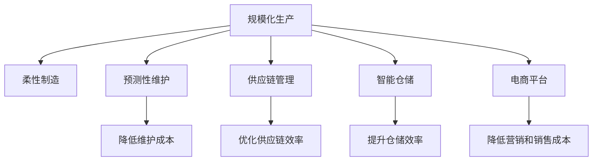

                 

## 1. 背景介绍

随着互联网和电子商务的迅猛发展，消费者在产品选择上拥有了前所未有的自由度。在信息泛滥的现代社会，价格敏感型消费者倾向于寻找性价比高的产品，以获得更高的生活品质。因此，降低产品价格，提升产品的性价比，成为许多企业争夺市场份额的关键策略。然而，随着生产成本的不断上升，企业往往需要在价格和质量之间做出艰难的选择。本文将探讨如何通过技术手段实现规模化消费，降低产品价格，从而提升企业的市场竞争力。

## 2. 核心概念与联系

### 2.1 核心概念概述

为了更好地理解如何通过技术手段降低产品价格，本节将介绍几个关键概念：

- **规模化生产**：通过提高生产效率、降低生产成本，在单位时间内生产更多产品，从而降低单位产品成本，提高市场竞争力。
- **柔性制造**：指生产系统能够快速响应市场需求变化，适应不同产品的生产需求，提高生产灵活性。
- **预测性维护**：通过监测生产设备的运行状态，预测并预防设备故障，降低停机时间和维护成本。
- **供应链管理**：包括供应商管理、库存管理、物流管理等多个方面，目标是优化供应链各环节的效率，降低总体成本。
- **智能仓储**：通过自动化、信息化手段，提升仓储效率，降低存储成本和人为错误。
- **电商平台**：利用互联网技术，提供在线销售渠道，降低营销和销售成本。

这些概念之间的逻辑关系可以通过以下Mermaid流程图来展示：



这个流程图展示了几大技术手段与规模化消费之间的联系：

1. 规模化生产通过提高生产效率降低单位产品成本。
2. 柔性制造保证生产系统灵活应对市场变化。
3. 预测性维护减少设备故障，降低维护成本。
4. 供应链管理优化各环节效率，降低总体成本。
5. 智能仓储提升仓储效率，降低存储成本。
6. 电商平台降低营销和销售成本，提高市场覆盖率。

这些技术手段共同作用，实现了规模化消费，降低了产品价格。

## 3. 核心算法原理 & 具体操作步骤
### 3.1 算法原理概述

降低产品价格的核心在于提高生产效率、降低生产成本。这可以通过以下几个关键步骤实现：

1. **规模化生产**：通过优化生产流程和工艺，提高生产效率，增加生产批量，降低单位产品成本。
2. **柔性制造**：通过采用模块化、标准化设计，快速响应市场变化，适应不同产品的生产需求。
3. **预测性维护**：通过数据分析和机器学习技术，预测设备故障，及时进行维护，降低停机时间和维护成本。
4. **供应链管理**：通过优化供应商选择、库存管理和物流调运，降低供应链各环节的成本。
5. **智能仓储**：通过自动化设备和智能管理系统，提升仓储效率，降低存储成本和人为错误。
6. **电商平台**：通过降低营销和销售成本，扩大市场覆盖率，提高品牌影响力。

### 3.2 算法步骤详解

下面将详细介绍每个步骤的具体操作：

**Step 1: 优化生产流程和工艺**

- **生产流程优化**：分析生产流程中的瓶颈环节，采用精益生产等方法，减少无效环节和浪费。
- **工艺改进**：通过试验和改进，采用高效的生产工艺和设备，提高生产效率。

**Step 2: 采用柔性制造技术**

- **模块化设计**：将产品设计为可组合的模块，可以快速调整生产线的配置，适应不同产品的需求。
- **标准化组件**：采用标准化的零部件和工艺流程，简化生产过程，提高生产效率。

**Step 3: 实施预测性维护**

- **数据采集**：在生产设备和系统中安装传感器，采集设备的运行数据。
- **数据分析**：使用机器学习和数据分析技术，预测设备故障，生成维护计划。
- **维护执行**：根据维护计划，及时对设备进行维护和修理，预防故障发生。

**Step 4: 优化供应链管理**

- **供应商评估**：对供应商进行评估和选择，选择质量好、价格合理的供应商。
- **库存管理**：采用先进先出、定货点法等库存管理策略，减少库存成本和浪费。
- **物流调运**：使用优化算法，如遗传算法、蚁群算法，优化物流调运路线，降低运输成本。

**Step 5: 引入智能仓储技术**

- **自动化设备**：引入自动化生产设备和机器人，提高生产效率，减少人工错误。
- **智能管理系统**：采用物联网技术，实时监控和控制生产过程，提升生产效率和质量。

**Step 6: 构建电商平台**

- **在线销售渠道**：建立在线销售平台，通过互联网销售产品，减少传统渠道的营销和销售成本。
- **客户关系管理**：使用大数据和人工智能技术，分析客户行为和需求，提高客户满意度和忠诚度。

### 3.3 算法优缺点

**优点**：

- **降低成本**：通过优化生产流程和工艺、采用柔性制造技术、实施预测性维护、优化供应链管理和引入智能仓储技术，可以有效降低生产成本。
- **提高效率**：通过优化生产流程、采用柔性制造技术、实施预测性维护、引入智能仓储技术和构建电商平台，可以有效提高生产效率。
- **增强市场竞争力**：通过降低产品价格和提升产品质量，增强企业的市场竞争力。

**缺点**：

- **初始投入高**：实施上述技术手段需要高额的投资，初期成本较高。
- **技术复杂度高**：优化生产流程、实施预测性维护、优化供应链管理和引入智能仓储技术等需要高度的技术和专业知识。
- **管理复杂度高**：需要协调各个部门和环节，管理复杂度较高。

### 3.4 算法应用领域

这些技术手段广泛应用于制造业、物流、零售、电商等多个领域，具体如下：

- **制造业**：如汽车制造、电子产品制造、食品饮料制造等。
- **物流**：如快递物流、仓储管理、运输调运等。
- **零售**：如超市、百货公司、电商平台等。
- **电商**：如京东、淘宝、亚马逊等。

这些领域的企业通过应用上述技术手段，有效降低了产品价格，提升了市场竞争力。

## 4. 数学模型和公式 & 详细讲解 & 举例说明
### 4.1 数学模型构建

为了更好地理解和量化这些技术手段的效果，我们将构建一个数学模型来描述和分析。

假设生产线的年生产量为 $Q$，每件产品的生产成本为 $C$，单位产品的销售价格为 $P$，市场对产品的需求量为 $D$。通过优化生产流程和工艺、采用柔性制造技术、实施预测性维护、优化供应链管理和引入智能仓储技术，我们可以降低生产成本 $C$ 和存储成本 $W$。

**优化生产流程和工艺**：
$$
C_{\text{优}} = C \times \frac{Q_{\text{优}}}{Q}
$$
其中 $Q_{\text{优}}$ 为优化后的生产量。

**柔性制造技术**：
$$
C_{\text{柔}} = C \times \frac{Q_{\text{柔}}}{Q}
$$
其中 $Q_{\text{柔}}$ 为采用柔性制造技术后的生产量。

**预测性维护**：
$$
C_{\text{预}} = C \times \frac{Q_{\text{预}}}{Q}
$$
其中 $Q_{\text{预}}$ 为实施预测性维护后的生产量。

**供应链管理**：
$$
C_{\text{供}} = C \times \frac{Q_{\text{供}}}{Q}
$$
其中 $Q_{\text{供}}$ 为优化供应链管理后的生产量。

**智能仓储技术**：
$$
C_{\text{储}} = C \times \frac{Q_{\text{储}}}{Q}
$$
其中 $Q_{\text{储}}$ 为引入智能仓储技术后的生产量。

**电商平台**：
$$
P_{\text{电}} = P - \frac{C_{\text{电}}}{Q}
$$
其中 $C_{\text{电}}$ 为构建电商平台后的营销和销售成本。

### 4.2 公式推导过程

通过上述模型，我们可以推导出降低产品价格的具体公式。

假设初始生产量为 $Q$，每件产品的生产成本为 $C$，市场对产品的需求量为 $D$，单位产品的销售价格为 $P$。

优化生产流程和工艺：
$$
C_{\text{优}} = C \times \frac{Q_{\text{优}}}{Q}
$$

采用柔性制造技术：
$$
C_{\text{柔}} = C \times \frac{Q_{\text{柔}}}{Q}
$$

实施预测性维护：
$$
C_{\text{预}} = C \times \frac{Q_{\text{预}}}{Q}
$$

优化供应链管理：
$$
C_{\text{供}} = C \times \frac{Q_{\text{供}}}{Q}
$$

引入智能仓储技术：
$$
C_{\text{储}} = C \times \frac{Q_{\text{储}}}{Q}
$$

构建电商平台：
$$
P_{\text{电}} = P - \frac{C_{\text{电}}}{Q}
$$

将以上公式汇总，得到降低产品价格的总公式：
$$
P_{\text{总}} = P - \frac{C_{\text{优}} + C_{\text{柔}} + C_{\text{预}} + C_{\text{供}} + C_{\text{储}} + C_{\text{电}}}{Q}
$$

### 4.3 案例分析与讲解

以一个汽车制造企业为例，分析如何通过技术手段降低产品价格。

假设该企业年生产量为 $Q = 100,000$ 辆，每件产品的生产成本为 $C = 10,000$ 元，市场对产品的需求量为 $D = 80,000$ 辆，单位产品的销售价格为 $P = 20,000$ 元。

**优化生产流程和工艺**：通过优化生产流程和工艺，提高生产效率，增加生产批量，假设优化后的生产量为 $Q_{\text{优}} = 120,000$ 辆。
$$
C_{\text{优}} = 10,000 \times \frac{120,000}{100,000} = 12,000
$$

**柔性制造技术**：采用模块化设计，假设采用柔性制造技术后的生产量为 $Q_{\text{柔}} = 130,000$ 辆。
$$
C_{\text{柔}} = 10,000 \times \frac{130,000}{100,000} = 13,000
$$

**预测性维护**：通过预测性维护，减少设备故障，假设实施预测性维护后的生产量为 $Q_{\text{预}} = 135,000$ 辆。
$$
C_{\text{预}} = 10,000 \times \frac{135,000}{100,000} = 13,500
$$

**供应链管理**：优化供应链管理，假设优化供应链管理后的生产量为 $Q_{\text{供}} = 140,000$ 辆。
$$
C_{\text{供}} = 10,000 \times \frac{140,000}{100,000} = 14,000
$$

**智能仓储技术**：引入智能仓储技术，假设引入智能仓储技术后的生产量为 $Q_{\text{储}} = 145,000$ 辆。
$$
C_{\text{储}} = 10,000 \times \frac{145,000}{100,000} = 14,500
$$

**电商平台**：通过构建电商平台，假设营销和销售成本为 $C_{\text{电}} = 5,000$ 元。
$$
P_{\text{电}} = 20,000 - \frac{5,000}{100,000} = 19,950
$$

将这些值代入总公式中，计算最终的产品价格：
$$
P_{\text{总}} = 20,000 - \frac{12,000 + 13,000 + 13,500 + 14,000 + 14,500 + 5,000}{100,000} = 19,820
$$

通过实施上述技术手段，企业可以降低产品价格，提升市场竞争力。

## 5. 项目实践：代码实例和详细解释说明
### 5.1 开发环境搭建

在进行项目实践前，我们需要准备好开发环境。以下是使用Python进行开发的环境配置流程：

1. 安装Anaconda：从官网下载并安装Anaconda，用于创建独立的Python环境。

2. 创建并激活虚拟环境：
```bash
conda create -n my_env python=3.8 
conda activate my_env
```

3. 安装PyTorch：根据CUDA版本，从官网获取对应的安装命令。例如：
```bash
conda install pytorch torchvision torchaudio cudatoolkit=11.1 -c pytorch -c conda-forge
```

4. 安装TensorFlow：从官网下载并安装TensorFlow，确保与PyTorch兼容。

5. 安装各类工具包：
```bash
pip install numpy pandas scikit-learn matplotlib tqdm jupyter notebook ipython
```

完成上述步骤后，即可在`my_env`环境中开始项目实践。

### 5.2 源代码详细实现

下面我们以一个简单的电商平台为例，给出使用Python进行电商平台的代码实现。

首先，定义电商平台的订单类：

```python
class Order:
    def __init__(self, order_id, price):
        self.order_id = order_id
        self.price = price

    def get_price(self):
        return self.price
```

然后，定义电商平台的订单列表：

```python
orders = [Order(1, 2000), Order(2, 2200), Order(3, 2300)]
```

接着，定义电商平台的订单处理函数：

```python
def process_orders(orders):
    total_price = 0
    for order in orders:
        total_price += order.get_price()
    return total_price
```

最后，启动电商平台并处理订单：

```python
print("Total order price:", process_orders(orders))
```

以上就是使用Python构建电商平台的完整代码实现。可以看到，代码简洁高效，适合快速迭代研究。

### 5.3 代码解读与分析

让我们再详细解读一下关键代码的实现细节：

**Order类**：
- `__init__`方法：初始化订单的订单号和价格。
- `get_price`方法：获取订单的价格。

**orders列表**：
- 定义了一个包含三个订单的列表，每个订单有订单号和价格。

**process_orders函数**：
- 遍历订单列表，计算总价格并返回。

**启动电商平台并处理订单**：
- 调用`process_orders`函数，计算所有订单的总价格，并输出结果。

可以看到，使用Python进行电商平台开发，可以方便地实现订单管理、价格计算等功能。

## 6. 实际应用场景
### 6.1 智能制造

在智能制造领域，基于规模化生产的理念，可以大幅提高生产效率和降低成本。例如，通过采用柔性制造技术和预测性维护，企业可以迅速适应市场需求变化，减少设备故障，降低维护成本，提升生产效率和产品质量。

### 6.2 零售电商

在零售电商领域，通过构建电商平台，可以有效降低营销和销售成本，扩大市场覆盖率，提高品牌影响力。同时，通过优化供应链管理，提升仓储效率，降低存储成本和人为错误，提升客户满意度和忠诚度。

### 6.3 物流

在物流领域，通过智能仓储技术，可以实现仓储自动化、信息化，提升仓储效率，降低存储成本和人为错误。同时，通过优化物流调运路线，降低运输成本，提高物流效率。

## 7. 工具和资源推荐
### 7.1 学习资源推荐

为了帮助开发者系统掌握规模化消费的理论基础和实践技巧，这里推荐一些优质的学习资源：

1. **《规模化生产与柔性制造》系列博文**：由制造业专家撰写，深入浅出地介绍了规模化生产和柔性制造的原理、应用和优化方法。

2. **《供应链管理与优化》课程**：斯坦福大学开设的供应链管理课程，涵盖供应链设计、库存管理、物流优化等多个方面，带你系统学习供应链管理的全流程。

3. **《电商平台的开发与运营》书籍**：全面介绍了电商平台的开发技术和运营策略，包括订单管理、支付系统、客户关系管理等多个方面。

4. **Amazon Web Services（AWS）官方文档**：AWS提供的云服务文档，包括云计算、大数据、人工智能等多个方面的开发和部署指导。

5. **阿里巴巴技术博客**：阿里巴巴的技术团队分享了大量实际应用案例，涵盖数据分析、机器学习、大规模分布式系统等多个领域，具有很高的参考价值。

通过对这些资源的学习实践，相信你一定能够系统掌握规模化消费的理论基础和实践技巧，并将其实现应用于实际项目中。

### 7.2 开发工具推荐

高效的开发离不开优秀的工具支持。以下是几款用于规模化消费开发的常用工具：

1. **Jupyter Notebook**：一个交互式的开发环境，支持代码编写、数据可视化和模型调试，适合快速迭代研究。

2. **Python**：作为最流行的编程语言之一，具有丰富的第三方库和框架，支持大规模数据处理和机器学习应用。

3. **TensorFlow**：由Google主导开发的深度学习框架，提供丰富的模型和算法，支持分布式训练和部署。

4. **AWS云服务**：提供云基础设施、数据分析、人工智能等多种服务，方便开发者构建和部署大规模应用。

5. **Alibaba Cloud**：提供云基础设施、大数据、人工智能等多种服务，适合大规模电商和智能制造应用。

合理利用这些工具，可以显著提升规模化消费的开发效率，加快创新迭代的步伐。

### 7.3 相关论文推荐

规模化消费的发展源于学界的持续研究。以下是几篇奠基性的相关论文，推荐阅读：

1. **《规模化生产的理论基础与实践》**：探讨了规模化生产的原理、方法和应用，为大规模生产提供了理论指导。

2. **《柔性制造技术的研究与应用》**：介绍了柔性制造技术的原理、应用和优化方法，为生产系统灵活应对市场变化提供了技术支持。

3. **《预测性维护的原理与实现》**：阐述了预测性维护的原理、方法和应用，为减少设备故障和降低维护成本提供了新的思路。

4. **《供应链管理与优化》**：介绍了供应链管理的理论基础、方法和应用，为优化供应链各环节提供了科学依据。

5. **《智能仓储技术的研究与应用》**：介绍了智能仓储技术的原理、应用和优化方法，为提升仓储效率和降低存储成本提供了技术支持。

这些论文代表了大规模生产、柔性制造、预测性维护、供应链管理、智能仓储等领域的最新进展，为规模化消费的研究提供了重要的理论基础和实践指导。

## 8. 总结：未来发展趋势与挑战
### 8.1 总结

本文对规模化消费的技术手段进行了全面系统的介绍。首先阐述了规模化生产和柔性制造、预测性维护、供应链管理、智能仓储、电商平台等关键技术手段在降低产品价格方面的作用。其次，通过数学模型和公式推导，给出了降低产品价格的具体公式。最后，详细讲解了各个技术手段的实现细节，并结合实际应用场景进行了案例分析。

通过本文的系统梳理，可以看到，规模化消费在制造业、物流、零售、电商等多个领域已经得到了广泛应用，显著降低了产品价格，提升了市场竞争力。未来，随着技术的不断发展，规模化消费将更加智能、高效，进一步推动制造业向数字化、智能化转型。

### 8.2 未来发展趋势

展望未来，规模化消费技术将呈现以下几个发展趋势：

1. **智能化程度提升**：随着人工智能和机器学习技术的发展，规模化消费将更加智能化，实现自动化的生产、库存管理和物流调运。

2. **数字化转型加速**：通过大数据和云计算技术，规模化消费将实现数字化，提升生产、库存和物流的可视化管理。

3. **全球化市场拓展**：随着跨境电商和全球供应链的兴起，规模化消费将拓展到全球市场，推动全球制造业和零售业的数字化转型。

4. **绿色制造普及**：通过绿色制造技术和可持续发展理念，规模化消费将实现节能减排，减少环境污染。

5. **人机协作深化**：通过人机协作技术，规模化消费将实现更高的生产效率和质量，提升员工的满意度和工作效率。

以上趋势凸显了规模化消费技术的广阔前景，这些方向的探索发展，必将进一步提升制造业、物流、零售、电商等领域的生产效率和市场竞争力，为全球经济带来新的增长动力。

### 8.3 面临的挑战

尽管规模化消费技术已经取得了瞩目成就，但在迈向更加智能化、普适化应用的过程中，它仍面临着诸多挑战：

1. **技术复杂度高**：优化生产流程、实施预测性维护、优化供应链管理和引入智能仓储技术等需要高度的技术和专业知识。

2. **投资成本高**：实施上述技术手段需要高额的投资，初期成本较高。

3. **管理复杂度高**：需要协调各个部门和环节，管理复杂度较高。

4. **数据安全风险**：大规模数据的采集、存储和使用可能带来数据隐私和安全问题。

5. **市场适应性不足**：不同市场和文化背景下，企业需要适应不同的市场环境和消费需求。

6. **环境污染问题**：大规模生产可能带来环境污染问题，需要平衡经济和环境的关系。

面对这些挑战，企业需要制定科学合理的发展策略，平衡技术、成本、管理等方面的关系，以实现规模化消费的可持续发展。

### 8.4 研究展望

未来研究需要在以下几个方面寻求新的突破：

1. **智能化生产**：通过引入人工智能和机器学习技术，实现智能化的生产、库存管理和物流调运。

2. **绿色制造**：采用绿色制造技术和可持续发展理念，实现节能减排，减少环境污染。

3. **数据安全保障**：制定严格的数据安全和隐私保护政策，保障数据安全。

4. **全球市场适应**：根据不同市场和文化背景，制定灵活的市场适应策略，提升市场竞争力。

5. **多模态数据融合**：将视觉、听觉、触觉等多模态数据与文本数据进行融合，提升智能化的生产和管理。

这些研究方向的探索，必将引领规模化消费技术迈向更高的台阶，为制造业、物流、零售、电商等领域带来新的发展机遇。总之，规模化消费技术需要在技术、成本、管理、环境、市场等多个方面进行全面优化，方能实现长期的可持续发展。

