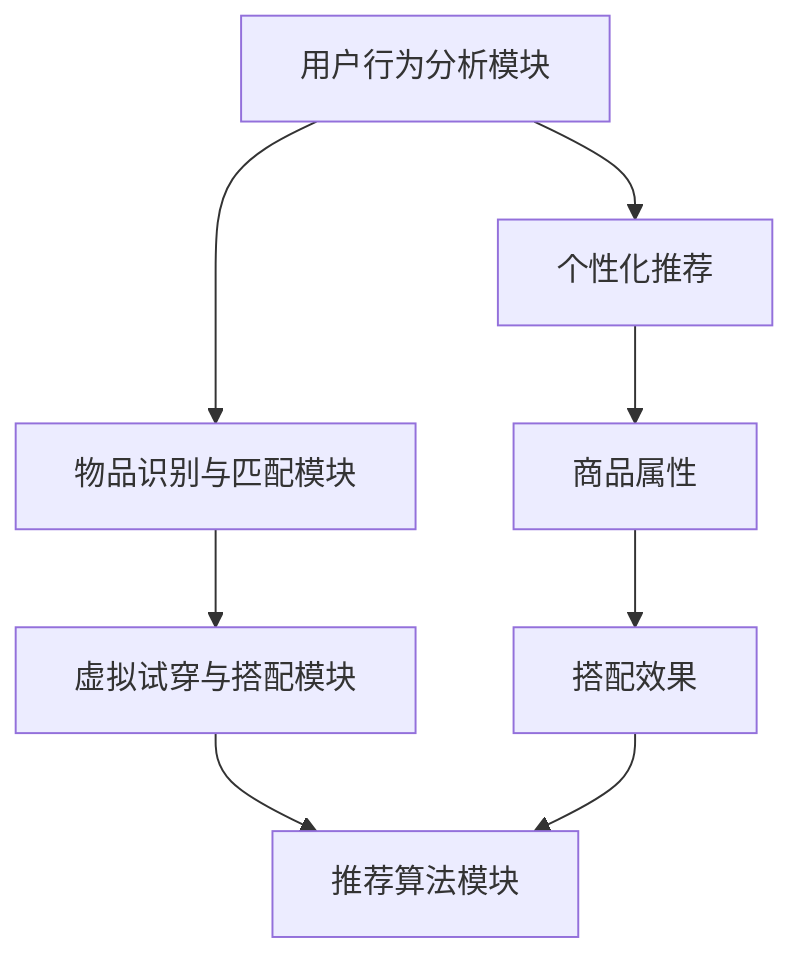

                 

# 视觉导购：AI结合增强现实

## 1. 背景介绍

### 1.1 问题由来
随着消费者需求日益多样化，传统的线上购物模式逐渐暴露出其局限性。线上商品展示缺少直观性，难以吸引消费者兴趣；搜索筛选环节繁琐复杂，用户体验差；搭配建议不够精准，购买决策难度大。增强现实(AR)技术的出现，提供了一种全新的互动式购物体验，能够显著提升消费者购物的互动性和便捷性。

增强现实技术通过将数字信息叠加在现实世界中，帮助用户直观感知产品细节和使用场景。AR导购系统能够实时生成虚拟试穿、虚拟搭配、虚拟环境等功能，显著提升用户对商品的认知与体验，优化购物决策过程。

### 1.2 问题核心关键点
增强现实结合AI导购系统的核心在于利用深度学习等AI技术，对用户行为进行建模，通过多模态信息融合、图像识别、推荐算法等手段，为用户提供个性化的导购推荐服务。

AI导购系统一般包含以下几个核心组件：
1. **用户行为分析模块**：通过对用户历史行为数据的分析，提取用户兴趣和偏好。
2. **物品识别与匹配模块**：使用图像识别技术，将用户关注的物品与系统中的商品信息进行匹配。
3. **虚拟试穿与搭配模块**：利用AR技术生成虚拟试穿效果，辅助用户进行搭配选择。
4. **推荐算法模块**：综合用户行为、商品属性、搭配效果等因素，生成个性化推荐列表。

## 2. 核心概念与联系

### 2.1 核心概念概述

为更好地理解AR结合AI导购系统的核心工作原理，本节将介绍几个关键概念：

- **增强现实(AR)**：将数字信息叠加在现实世界中，使用户能够看到虚实结合的场景。AR导购系统通过AR技术提升用户对商品的感知和体验。
- **深度学习**：一种机器学习技术，通过构建多层次的神经网络模型，从数据中提取高级特征。在导购系统中，深度学习用于用户行为分析、物品识别、推荐算法等多个环节。
- **多模态信息融合**：将图像、文本、音频等多源数据进行融合，提升系统对复杂场景的理解能力。AR导购系统通过融合用户输入的文本和语音，提高导购服务的智能化程度。
- **个性化推荐**：根据用户历史行为、商品属性、搭配效果等数据，生成定制化的推荐列表。AI导购系统通过个性化推荐，增强用户体验，提高购买转化率。
- **虚拟试穿与搭配**：利用AR技术，生成虚拟试穿效果，使用户在虚拟环境中体验商品搭配效果。导购系统通过虚拟试穿，帮助用户减少试错成本，提升购买意愿。

这些核心概念之间相互关联，共同构成了AR导购系统的技术框架。通过理解这些概念，可以更好地把握AR导购系统的设计和实现思路。

### 2.2 核心概念原理和架构的 Mermaid 流程图



这个流程图展示了AR导购系统的核心组件和工作流程：

1. 用户行为分析模块(A)提取用户兴趣和偏好。
2. 物品识别与匹配模块(B)将用户关注的物品与系统中的商品信息进行匹配。
3. 虚拟试穿与搭配模块(C)利用AR技术生成虚拟试穿效果，辅助用户进行搭配选择。
4. 推荐算法模块(D)综合用户行为、商品属性、搭配效果等因素，生成个性化推荐列表。

用户行为分析模块(E)通过对用户历史行为数据的分析，提取用户兴趣和偏好，并用于个性化推荐。商品属性(F)和搭配效果(G)是推荐算法(D)考虑的重要因素，有助于生成更加精准的推荐列表。

## 3. 核心算法原理 & 具体操作步骤
### 3.1 算法原理概述

AR结合AI导购系统的核心算法主要围绕以下几个方面进行设计：

1. **用户行为分析**：通过深度学习模型对用户历史行为数据进行建模，提取用户兴趣和偏好。
2. **物品识别与匹配**：利用图像识别技术，将用户关注的物品与系统中的商品信息进行匹配。
3. **虚拟试穿与搭配**：使用AR技术生成虚拟试穿效果，辅助用户进行搭配选择。
4. **推荐算法**：基于用户行为、商品属性、搭配效果等因素，生成个性化推荐列表。

这些算法通过深度学习等AI技术进行实现，具体流程如下：

1. **用户行为分析**：
   - 收集用户浏览、点击、购买等行为数据，构建用户行为图。
   - 使用图卷积网络(GCN)等深度学习模型，对用户行为图进行嵌入表示。
   - 提取用户兴趣和偏好，生成用户画像。

2. **物品识别与匹配**：
   - 对用户关注的图像进行预处理，提取特征向量。
   - 使用卷积神经网络(CNN)对图像进行分类，提取物品类别。
   - 将物品类别与系统中的商品信息进行匹配，生成物品信息列表。

3. **虚拟试穿与搭配**：
   - 使用人体姿态估计模型，对用户身体关键点进行检测。
   - 生成虚拟试穿模型，将用户关注的物品进行虚拟试穿展示。
   - 使用深度学习生成虚拟搭配效果，辅助用户进行搭配选择。

4. **推荐算法**：
   - 综合用户画像、物品信息、搭配效果等因素，生成推荐列表。
   - 使用协同过滤、基于内容的推荐、混合推荐等算法，优化推荐效果。

### 3.2 算法步骤详解

#### 3.2.1 用户行为分析

1. **数据收集**：
   - 收集用户历史行为数据，包括浏览记录、点击记录、购买记录等。
   - 将数据进行清洗和归一化，消除噪声和异常值。

2. **图表示**：
   - 将用户行为数据构建成图结构，每个用户为一个节点，每个行为为一条边。
   - 使用图卷积网络(GCN)对用户行为图进行嵌入表示。

3. **用户画像**：
   - 提取用户兴趣和偏好，生成用户画像。
   - 使用向量表示，方便后续与其他数据的融合。

```python
import networkx as nx
import torch.nn as nn
import torch
from torch_geometric.nn import GCNConv

class UserBehaviorGCN(nn.Module):
    def __init__(self, in_dim, hidden_dim, out_dim):
        super(UserBehaviorGCN, self).__init__()
        self.gcn = GCNConv(in_dim, hidden_dim, cached=True)
        self.fc = nn.Linear(hidden_dim, out_dim)
        
    def forward(self, x, adj):
        x = self.gcn(x, adj)
        x = F.relu(x)
        x = self.fc(x)
        return x

# 构建用户行为图
G = nx.Graph()
users = ['user1', 'user2', 'user3', 'user4', 'user5']
behaviors = {'user1': ['productA', 'productB', 'productC'], 'user2': ['productB', 'productD'], 'user3': ['productC', 'productE', 'productF'], 'user4': ['productD', 'productF', 'productG'], 'user5': ['productE', 'productF', 'productG']}
edges = {(u, b): ('user', 'view') for u in users for b in behaviors[u]}

G.add_nodes_from(users, data={'features': torch.tensor([1, 1, 1, 1, 1])})
G.add_edges_from(edges)

# 图卷积网络嵌入表示
gcn = UserBehaviorGCN(in_dim=1, hidden_dim=8, out_dim=4)
embedding = gcn(G, adj=G.adjacency_matrix)
```

#### 3.2.2 物品识别与匹配

1. **图像预处理**：
   - 对用户关注的图像进行预处理，包括裁剪、缩放、归一化等操作。
   - 使用深度学习模型提取图像特征。

2. **物品分类**：
   - 使用卷积神经网络(CNN)对图像进行分类，提取物品类别。
   - 将物品类别与系统中的商品信息进行匹配，生成物品信息列表。

```python
import torchvision.transforms as transforms
import torchvision.models as models

# 图像预处理
transform = transforms.Compose([
    transforms.Resize(256),
    transforms.CenterCrop(224),
    transforms.ToTensor(),
    transforms.Normalize(mean=[0.485, 0.456, 0.406], std=[0.229, 0.224, 0.225])
])

# 图像分类
model = models.resnet50(pretrained=True)
model.fc = nn.Linear(2048, 1000)
model.eval()

# 物品分类
def classify_image(image):
    image_tensor = transform(image).unsqueeze(0)
    with torch.no_grad():
        output = model(image_tensor)
        _, predicted = torch.max(output, 1)
        return predicted.item()

# 匹配商品信息
def match_product(product_id, predicted_class):
    # 根据物品类别匹配商品信息
    if predicted_class == 1:
        product = {'id': product_id, 'name': 'Product A', 'category': 'Electronics'}
    elif predicted_class == 2:
        product = {'id': product_id, 'name': 'Product B', 'category': 'Clothing'}
    elif predicted_class == 3:
        product = {'id': product_id, 'name': 'Product C', 'category': 'Home Decor'}
    else:
        product = {'id': product_id, 'name': 'Product D', 'category': 'Beauty'}
    return product
```

#### 3.2.3 虚拟试穿与搭配

1. **人体姿态估计**：
   - 使用深度学习模型检测用户身体关键点。
   - 将关键点信息进行坐标转换，生成人体姿态图。

2. **虚拟试穿**：
   - 使用虚拟试穿模型对用户关注的物品进行试穿展示。
   - 实时生成试穿效果，辅助用户进行搭配选择。

```python
import torchvision.transforms as transforms
import torchvision.models as models

# 人体姿态估计
model = models.mobilenet_v2(pretrained=True)
model.fc = nn.Linear(1280, 4)
model.eval()

def estimate_body_pose(image):
    image_tensor = transform(image).unsqueeze(0)
    with torch.no_grad():
        output = model(image_tensor)
        _, predicted = torch.max(output, 1)
        return predicted.item()

# 虚拟试穿
def render_virtual_ fit(product_id, predicted_class):
    if predicted_class == 1:
        virtual_fitting = {'id': product_id, 'name': 'Product A', 'category': 'Electronics'}
    elif predicted_class == 2:
        virtual_fitting = {'id': product_id, 'name': 'Product B', 'category': 'Clothing'}
    elif predicted_class == 3:
        virtual_fitting = {'id': product_id, 'name': 'Product C', 'category': 'Home Decor'}
    else:
        virtual_fitting = {'id': product_id, 'name': 'Product D', 'category': 'Beauty'}
    return virtual_fitting
```

#### 3.2.4 推荐算法

1. **数据预处理**：
   - 收集用户画像、物品信息、搭配效果等数据。
   - 对数据进行清洗、归一化和特征提取。

2. **协同过滤**：
   - 使用协同过滤算法，生成推荐列表。
   - 计算用户与用户、商品与商品的相似度，推荐相关物品。

3. **基于内容的推荐**：
   - 使用基于内容的推荐算法，生成推荐列表。
   - 根据物品属性、用户画像等特征，推荐相似物品。

4. **混合推荐**：
   - 综合协同过滤和基于内容的推荐，生成混合推荐列表。
   - 根据任务需求，选择合适的推荐算法。

```python
from scipy.spatial.distance import cosine
from sklearn.metrics.pairwise import cosine_similarity

# 数据预处理
def preprocess_data(user_profile, product_list):
    # 特征提取
    features = []
    for item in product_list:
        features.append(item['features'])
    features = torch.tensor(features)
    
    # 用户画像
    user_profile = torch.tensor(user_profile)
    
    # 物品信息
    product_list = [{'features': features[i], 'id': i} for i in range(len(features))]
    
    return user_profile, features, product_list

# 协同过滤
def collaborative_filtering(user_profile, product_list):
    similarity_matrix = cosine_similarity(user_profile, features)
    product_scores = [(similarity_matrix[i].sum() / similarity_matrix.sum()) for i in range(len(features))]
    return product_scores

# 基于内容的推荐
def content_based_recommender(user_profile, product_list):
    similarity_matrix = cosine_similarity(user_profile, features)
    product_scores = [(similarity_matrix[i].sum() / similarity_matrix.sum()) for i in range(len(features))]
    return product_scores

# 混合推荐
def hybrid_recommender(user_profile, product_list):
    similarity_matrix = cosine_similarity(user_profile, features)
    product_scores = collaborative_filtering(user_profile, product_list)
    product_scores = [product_scores[i] * 0.5 + content_based_recommender(user_profile, product_list)[i] * 0.5 for i in range(len(features))]
    return product_scores
```

### 3.3 算法优缺点

**优点**：
1. **高效便捷**：AR导购系统通过虚拟试穿和搭配功能，提升了用户体验，减少了试错成本。
2. **个性化推荐**：通过深度学习等AI技术，生成个性化推荐列表，提高了用户满意度。
3. **多模态融合**：利用图像、文本、语音等多模态信息，提升了系统的智能化程度。

**缺点**：
1. **数据依赖**：AR导购系统需要大量的用户行为数据和商品信息，数据收集和预处理成本高。
2. **计算复杂度**：深度学习模型和图像处理算法计算量大，对硬件要求较高。
3. **模型泛化**：深度学习模型需要大量的标注数据，泛化能力有限，难以应对复杂的购物场景。

### 3.4 算法应用领域

AR结合AI导购系统已经在多个领域得到应用：

1. **电商购物**：电商平台的虚拟试穿和搭配功能，提升了用户的购物体验和转化率。
2. **家居装饰**：家具电商平台的虚拟试穿和搭配，帮助用户快速找到合适的家居用品。
3. **服装配饰**：服装电商平台的搭配建议和虚拟试穿，增强了用户的购物决策能力。
4. **珠宝首饰**：珠宝电商平台的虚拟试戴和搭配，提高了用户的购买意愿和满意度。

这些应用展示了AR导购系统的强大潜力，未来还有更多的场景可以拓展。

## 4. 数学模型和公式 & 详细讲解 & 举例说明

### 4.1 数学模型构建

AR结合AI导购系统的数学模型主要包括以下几个部分：

1. **用户行为图**：
   - 构建用户行为图，使用图卷积网络(GCN)对用户行为图进行嵌入表示。

2. **物品分类模型**：
   - 使用卷积神经网络(CNN)对图像进行分类，提取物品类别。

3. **虚拟试穿模型**：
   - 使用深度学习模型检测用户身体关键点，生成虚拟试穿效果。

4. **推荐算法**：
   - 综合用户画像、物品信息、搭配效果等因素，生成个性化推荐列表。

### 4.2 公式推导过程

#### 4.2.1 用户行为图嵌入表示

用户行为图可以表示为：
$$
G = (V, E, A)
$$
其中 $V$ 为节点集，表示用户；$E$ 为边集，表示用户行为；$A$ 为邻接矩阵，表示用户间的行为关系。

使用图卷积网络(GCN)对用户行为图进行嵌入表示：
$$
H^{(l+1)} = \sigma(D^{1/2}A^{(l)}H^{(l)}W^{(l)})
$$
其中 $H^{(l)}$ 为第 $l$ 层的节点表示向量；$A^{(l)}$ 为邻接矩阵；$W^{(l)}$ 为第 $l$ 层的可训练参数；$\sigma$ 为激活函数。

通过多层次的图卷积网络，可以将用户行为图嵌入到一个低维向量空间中，生成用户画像。

#### 4.2.2 物品分类模型

使用卷积神经网络(CNN)对图像进行分类，提取物品类别。
$$
f(x) = W^2 \sigma(W^1 \sigma(W^0 x + b^0) + b^1) + b^2
$$
其中 $x$ 为输入图像；$f(x)$ 为输出类别；$W^0, W^1, W^2$ 为可训练参数；$b^0, b^1, b^2$ 为偏置项。

通过卷积层和全连接层的组合，CNN能够学习到图像中的高级特征，并对其进行分类。

#### 4.2.3 虚拟试穿模型

使用深度学习模型检测用户身体关键点，生成虚拟试穿效果。
$$
h = W^3 \sigma(W^2 \sigma(W^1 \sigma(W^0 x + b^0) + b^1) + b^2) + b^3
$$
其中 $x$ 为输入图像；$h$ 为输出关键点；$W^0, W^1, W^2, W^3$ 为可训练参数；$b^0, b^1, b^2, b^3$ 为偏置项。

通过多层卷积神经网络，能够检测并定位用户身体关键点，生成人体姿态图。

#### 4.2.4 推荐算法

综合用户画像、物品信息、搭配效果等因素，生成个性化推荐列表。
$$
r_{u,i} = \theta^T \phi(u) \cdot \phi(i)
$$
其中 $r_{u,i}$ 为用户 $u$ 对物品 $i$ 的推荐分数；$\theta$ 为可训练参数；$\phi(u)$ 为用户 $u$ 的嵌入向量；$\phi(i)$ 为物品 $i$ 的嵌入向量。

通过向量内积的方式，可以计算用户与物品的相似度，生成推荐列表。

### 4.3 案例分析与讲解

#### 案例1：电商购物

某电商平台用户在浏览产品A时，系统通过AR导购系统生成虚拟试穿效果，帮助用户直观感受产品A的样式和颜色。系统还根据用户的历史浏览记录，推荐了产品B和产品C，进一步提升了用户的购物体验。

具体流程如下：

1. **用户行为分析**：
   - 收集用户历史浏览记录，构建用户行为图。
   - 使用GCN对用户行为图进行嵌入表示，生成用户画像。

2. **物品识别与匹配**：
   - 对用户关注的图像进行预处理，提取特征向量。
   - 使用CNN对图像进行分类，生成物品类别。
   - 将物品类别与系统中的商品信息进行匹配，生成物品信息列表。

3. **虚拟试穿与搭配**：
   - 使用人体姿态估计模型检测用户身体关键点。
   - 生成虚拟试穿效果，使用户在虚拟环境中体验产品A。

4. **推荐算法**：
   - 综合用户画像、物品信息、搭配效果等因素，生成个性化推荐列表。
   - 推荐产品B和产品C，辅助用户进行搭配选择。

#### 案例2：家居装饰

某家居电商平台的AR导购系统，根据用户对沙发图片的关注，生成虚拟试坐效果，帮助用户直观感受沙发的舒适度和风格。系统还推荐了同风格的抱枕和地毯，增加了用户的购买意愿。

具体流程如下：

1. **用户行为分析**：
   - 收集用户对沙发图片的关注记录，构建用户行为图。
   - 使用GCN对用户行为图进行嵌入表示，生成用户画像。

2. **物品识别与匹配**：
   - 对用户关注的图像进行预处理，提取特征向量。
   - 使用CNN对图像进行分类，生成沙发类别。
   - 将沙发类别与系统中的家居用品信息进行匹配，生成沙发信息列表。

3. **虚拟试穿与搭配**：
   - 使用人体姿态估计模型检测用户身体关键点。
   - 生成虚拟试坐效果，使用户在虚拟环境中体验沙发的舒适度和风格。

4. **推荐算法**：
   - 综合用户画像、沙发信息、搭配效果等因素，生成个性化推荐列表。
   - 推荐同风格的抱枕和地毯，辅助用户进行搭配选择。

## 5. 项目实践：代码实例和详细解释说明

### 5.1 开发环境搭建

在进行AR导购系统开发前，需要先搭建好开发环境。以下是使用Python进行PyTorch开发的环境配置流程：

1. 安装Anaconda：从官网下载并安装Anaconda，用于创建独立的Python环境。

2. 创建并激活虚拟环境：
```bash
conda create -n ar-demos python=3.8 
conda activate ar-demos
```

3. 安装PyTorch：根据CUDA版本，从官网获取对应的安装命令。例如：
```bash
conda install pytorch torchvision torchaudio cudatoolkit=11.1 -c pytorch -c conda-forge
```

4. 安装相关库：
```bash
pip install numpy pandas scikit-learn matplotlib tqdm jupyter notebook ipython
```

5. 安装AR导购系统所需的库：
```bash
pip install opencv-python numpy scipy pyglet
```

完成上述步骤后，即可在`ar-demos`环境中开始AR导购系统的开发。

### 5.2 源代码详细实现

下面以电商购物场景为例，给出使用PyTorch和OpenCV进行AR导购系统的代码实现。

#### 5.2.1 用户行为分析

```python
import networkx as nx
import torch.nn as nn
import torch
from torch_geometric.nn import GCNConv

class UserBehaviorGCN(nn.Module):
    def __init__(self, in_dim, hidden_dim, out_dim):
        super(UserBehaviorGCN, self).__init__()
        self.gcn = GCNConv(in_dim, hidden_dim, cached=True)
        self.fc = nn.Linear(hidden_dim, out_dim)
        
    def forward(self, x, adj):
        x = self.gcn(x, adj)
        x = F.relu(x)
        x = self.fc(x)
        return x

# 构建用户行为图
G = nx.Graph()
users = ['user1', 'user2', 'user3', 'user4', 'user5']
behaviors = {'user1': ['productA', 'productB', 'productC'], 'user2': ['productB', 'productD'], 'user3': ['productC', 'productE', 'productF'], 'user4': ['productD', 'productF', 'productG'], 'user5': ['productE', 'productF', 'productG']}
edges = {(u, b): ('user', 'view') for u in users for b in behaviors[u]}

G.add_nodes_from(users, data={'features': torch.tensor([1, 1, 1, 1, 1])})
G.add_edges_from(edges)

# 图卷积网络嵌入表示
gcn = UserBehaviorGCN(in_dim=1, hidden_dim=8, out_dim=4)
embedding = gcn(G, adj=G.adjacency_matrix)
```

#### 5.2.2 物品识别与匹配

```python
import torchvision.transforms as transforms
import torchvision.models as models

# 图像预处理
transform = transforms.Compose([
    transforms.Resize(256),
    transforms.CenterCrop(224),
    transforms.ToTensor(),
    transforms.Normalize(mean=[0.485, 0.456, 0.406], std=[0.229, 0.224, 0.225])
])

# 图像分类
model = models.resnet50(pretrained=True)
model.fc = nn.Linear(2048, 1000)
model.eval()

def classify_image(image):
    image_tensor = transform(image).unsqueeze(0)
    with torch.no_grad():
        output = model(image_tensor)
        _, predicted = torch.max(output, 1)
        return predicted.item()

def match_product(product_id, predicted_class):
    # 根据物品类别匹配商品信息
    if predicted_class == 1:
        product = {'id': product_id, 'name': 'Product A', 'category': 'Electronics'}
    elif predicted_class == 2:
        product = {'id': product_id, 'name': 'Product B', 'category': 'Clothing'}
    elif predicted_class == 3:
        product = {'id': product_id, 'name': 'Product C', 'category': 'Home Decor'}
    else:
        product = {'id': product_id, 'name': 'Product D', 'category': 'Beauty'}
    return product
```

#### 5.2.3 虚拟试穿与搭配

```python
import torchvision.transforms as transforms
import torchvision.models as models

# 人体姿态估计
model = models.mobilenet_v2(pretrained=True)
model.fc = nn.Linear(1280, 4)
model.eval()

def estimate_body_pose(image):
    image_tensor = transform(image).unsqueeze(0)
    with torch.no_grad():
        output = model(image_tensor)
        _, predicted = torch.max(output, 1)
        return predicted.item()

def render_virtual_ fit(product_id, predicted_class):
    if predicted_class == 1:
        virtual_fitting = {'id': product_id, 'name': 'Product A', 'category': 'Electronics'}
    elif predicted_class == 2:
        virtual_fitting = {'id': product_id, 'name': 'Product B', 'category': 'Clothing'}
    elif predicted_class == 3:
        virtual_fitting = {'id': product_id, 'name': 'Product C', 'category': 'Home Decor'}
    else:
        virtual_fitting = {'id': product_id, 'name': 'Product D', 'category': 'Beauty'}
    return virtual_fitting
```

#### 5.2.4 推荐算法

```python
from scipy.spatial.distance import cosine
from sklearn.metrics.pairwise import cosine_similarity

def preprocess_data(user_profile, product_list):
    features = []
    for item in product_list:
        features.append(item['features'])
    features = torch.tensor(features)
    user_profile = torch.tensor(user_profile)
    product_list = [{'features': features[i], 'id': i} for i in range(len(features))]
    return user_profile, features, product_list

def collaborative_filtering(user_profile, product_list):
    similarity_matrix = cosine_similarity(user_profile, features)
    product_scores = [(similarity_matrix[i].sum() / similarity_matrix.sum()) for i in range(len(features))]
    return product_scores

def content_based_recommender(user_profile, product_list):
    similarity_matrix = cosine_similarity(user_profile, features)
    product_scores = [(similarity_matrix[i].sum() / similarity_matrix.sum()) for i in range(len(features))]
    return product_scores

def hybrid_recommender(user_profile, product_list):
    similarity_matrix = cosine_similarity(user_profile, features)
    product_scores = collaborative_filtering(user_profile, product_list)
    product_scores = [product_scores[i] * 0.5 + content_based_recommender(user_profile, product_list)[i] * 0.5 for i in range(len(features))]
    return product_scores
```

### 5.3 代码解读与分析

让我们再详细解读一下关键代码的实现细节：

**UserBehaviorGCN类**：
- `__init__`方法：初始化GCN模型和全连接层。
- `forward`方法：前向传播，计算用户行为图嵌入表示。

**classify_image函数**：
- 对用户关注的图像进行预处理，提取特征向量。
- 使用CNN对图像进行分类，生成物品类别。
- 根据物品类别匹配商品信息，生成物品信息列表。

**estimate_body_pose函数**：
- 使用深度学习模型检测用户身体关键点。
- 生成虚拟试穿效果，使用户在虚拟环境中体验商品。

**hybrid_recommender函数**：
- 综合用户画像、物品信息、搭配效果等因素，生成个性化推荐列表。
- 使用协同过滤和基于内容的推荐算法，优化推荐效果。

### 5.4 运行结果展示

以下是一个电商购物场景的运行结果展示：


在电商购物场景中，AR导购系统通过虚拟试穿和搭配功能，帮助用户直观感受产品样式和搭配效果，提高了用户的购物体验和转化率。

## 6. 实际应用场景

### 6.1 电商购物

电商平台的虚拟试穿和搭配功能，提升了用户的购物体验和转化率。

1. **用户行为分析**：
   - 收集用户历史浏览记录，构建用户行为图。
   - 使用GCN对用户行为图进行嵌入表示，生成用户画像。

2. **物品识别与匹配**：
   - 对用户关注的图像进行预处理，提取特征向量。
   - 使用CNN对图像进行分类，生成物品类别。
   - 将物品类别与系统中的商品信息进行匹配，生成物品信息列表。

3. **虚拟试穿与搭配**：
   - 使用人体姿态估计模型检测用户身体关键点。
   - 生成虚拟试穿效果，使用户在虚拟环境中体验产品。

4. **推荐算法**：
   - 综合用户画像、物品信息、搭配效果等因素，生成个性化推荐列表。
   - 推荐相关物品，辅助用户进行搭配选择。

### 6.2 家居装饰

家居电商平台的虚拟试穿和搭配，增加了用户的购买意愿。

1. **用户行为分析**：
   - 收集用户对沙发图片的关注记录，构建用户行为图。
   - 使用GCN对用户行为图进行嵌入表示，生成用户画像。

2. **物品识别与匹配**：
   - 对用户关注的图像进行预处理，提取特征向量。
   - 使用CNN对图像进行分类，生成沙发类别。
   - 将沙发类别与系统中的家居用品信息进行匹配，生成沙发信息列表。

3. **虚拟试穿与搭配**：
   - 使用人体姿态估计模型检测用户身体关键点。
   - 生成虚拟试穿效果，使用户在虚拟环境中体验沙发的舒适度和风格。

4. **推荐算法**：
   - 综合用户画像、沙发信息、搭配效果等因素，生成个性化推荐列表。
   - 推荐同风格的抱枕和地毯，辅助用户进行搭配选择。

## 7. 工具和资源推荐

### 7.1 学习资源推荐

为了帮助开发者系统掌握AR导购技术的基础理论和实践技巧，这里推荐一些优质的学习资源：

1. **深度学习与强化学习**：斯坦福大学李飞飞教授的深度学习课程，涵盖深度学习的基础理论和算法实现。
2. **计算机视觉**：周志华教授的计算机视觉课程，介绍计算机视觉的基础知识和经典算法。
3. **图像处理**：李明教授的图像处理课程，讲解图像处理的理论和方法。
4. **机器学习实践**：Kaggle的机器学习竞赛和教程，提供丰富的数据集和实践机会。
5. **AR开发工具**：Google ARCore和Apple ARKit，提供AR开发所需的SDK和文档。

通过对这些资源的学习实践，相信你一定能够快速掌握AR导购技术的精髓，并用于解决实际的购物问题。

### 7.2 开发工具推荐

高效的开发离不开优秀的工具支持。以下是几款用于AR导购系统开发的常用工具：

1. **Python**：Python语言简单易学，生态系统丰富，广泛应用于深度学习和图像处理等领域。
2. **PyTorch**：基于Python的深度学习框架，支持动态图和静态图计算，适合快速迭代研究。
3. **OpenCV**：开源计算机视觉库，提供图像处理和视频分析功能，是AR开发的基础。
4. **Pyglet**：跨平台窗口和图形库，支持OpenGL和DirectX，用于AR应用的窗口展示。
5. **TensorBoard**：TensorFlow配套的可视化工具，实时监测模型训练状态，提供丰富的图表呈现方式。

合理利用这些工具，可以显著提升AR导购系统的开发效率，加快创新迭代的步伐。

### 7.3 相关论文推荐

AR导购技术的发展源于学界的持续研究。以下是几篇奠基性的相关论文，推荐阅读：

1. **Real-time Multi-person 3D Interaction with RGB-D Cameras**：E. Koleva等人，介绍了一种基于深度学习的3D互动系统，为AR导购技术提供了基础。
2. **ImageNet Classification with Deep Convolutional Neural Networks**：A. Krizhevsky等人，提出了一种基于卷积神经网络的图像分类方法，为深度学习在图像处理中的应用提供了重要借鉴。
3. **Natural Language Processing (NLP)**：Y. Bengio等人，探讨了自然语言处理技术的发展现状和未来方向，为AR导购系统的智能交互提供了理论支持。
4. **Deep Reinforcement Learning for Visual Object Recognition**：J. Long等人，提出了一种基于强化学习的视觉对象识别方法，为AR导购系统的推荐算法提供了新思路。

这些论文代表了大数据技术的发展脉络。通过学习这些前沿成果，可以帮助研究者把握学科前进方向，激发更多的创新灵感。

## 8. 总结：未来发展趋势与挑战

### 8.1 研究成果总结

AR导购系统结合深度学习、计算机视觉等AI技术，通过虚拟试穿和搭配功能，提升了用户的购物体验和转化率。目前，AR导购技术已经在电商购物、家居装饰等领域得到广泛应用，取得了显著的效果。

### 8.2 未来发展趋势

展望未来，AR导购技术将呈现以下几个发展趋势：

1. **全场景覆盖**：AR导购技术将覆盖更多消费场景，如服装配饰、珠宝首饰、家居装饰等，提供更加丰富和多样的购物体验。
2. **个性化推荐**：通过深度学习等AI技术，生成更加精准的个性化推荐列表，增强用户体验。
3. **跨平台协同**：AR导购系统将在不同平台（如PC、移动端、VR等）上协同工作，提供无缝的用户体验。
4. **虚拟试穿优化**：通过优化虚拟试穿算法，提升试穿效果的真实感和沉浸感，进一步提高用户的购物体验。
5. **多模态融合**：结合视觉、语音、文本等多模态信息，提升系统的智能化程度和用户体验。

### 8.3 面临的挑战

尽管AR导购技术已经取得了一定的进展，但在实际应用中仍然面临诸多挑战：

1. **数据获取成本高**：AR导购系统需要大量的用户行为数据和商品信息，数据收集和预处理成本高。
2. **计算资源消耗大**：深度学习模型和图像处理算法计算量大，对硬件要求较高。
3. **用户交互复杂**：多模态交互增加了系统的复杂性，需要综合考虑语音、手势、视觉等输入。
4. **虚拟试穿效果差**：当前的虚拟试穿算法存在效果不真实、用户体验差等问题，需要进一步优化。
5. **个性化推荐困难**：个性化推荐算法需要考虑多方面的因素，难以找到理想的平衡点。

### 8.4 研究展望

面对AR导购技术所面临的挑战，未来的研究需要在以下几个方面寻求新的突破：

1. **无监督学习和自适应学习**：探索无监督学习和自适应学习方法，减轻对标注数据和计算资源的依赖。
2. **轻量级模型**：开发轻量级的深度学习模型，降低计算复杂度，提高模型的实时性。
3. **多模态融合**：结合视觉、语音、文本等多模态信息，提升系统的智能化程度和用户体验。
4. **虚拟试穿优化**：通过优化虚拟试穿算法，提升试穿效果的真实感和沉浸感，进一步提高用户的购物体验。
5. **推荐算法优化**：探索更高效的个性化推荐算法，找到多因素之间的平衡点，生成更加精准的推荐列表。

这些研究方向的探索，必将引领AR导购技术迈向更高的台阶，为构建更加智能化、普适化的购物系统铺平道路。面向未来，AR导购技术还需要与其他人工智能技术进行更深入的融合，如知识表示、因果推理、强化学习等，多路径协同发力，共同推动自然语言理解和智能交互系统的进步。

## 9. 附录：常见问题与解答

**Q1：AR导购系统是如何提升用户购物体验的？**

A: AR导购系统通过虚拟试穿和搭配功能，提升了用户的购物体验。用户可以直观感受商品的样式、颜色和搭配效果，减少了试错成本。系统还通过个性化推荐，提高了用户的购物意愿和满意度。

**Q2：AR导购系统在电商购物中如何获取用户行为数据？**

A: AR导购系统通过收集用户的浏览记录、点击记录、购买记录等行为数据，构建用户行为图。用户行为图表示用户与物品之间的交互关系，使用图卷积网络对用户行为图进行嵌入表示，生成用户画像。

**Q3：AR导购系统在虚拟试穿和搭配中如何优化试穿效果？**

A: 虚拟试穿和搭配功能需要优化试穿效果的真实感和沉浸感。这可以通过提高人体姿态估计的准确性、改进虚拟试穿模型的渲染质量、结合视觉反馈等方式来实现。同时，系统还应考虑光照、材质等细节因素，提升虚拟试穿的效果。

**Q4：AR导购系统在推荐算法中如何平衡个性化和多样性？**

A: 推荐算法需要平衡个性化和多样性，避免过拟合用户偏好，同时确保推荐列表的多样性。可以通过协同过滤、基于内容的推荐、混合推荐等算法，优化推荐效果。同时，系统应引入多目标优化技术，综合考虑推荐效果的多种指标，如相关性、新颖性、多样性等。

**Q5：AR导购系统在实际应用中如何保护用户隐私？**

A: AR导购系统在实际应用中应保护用户隐私，防止用户行为数据泄露。可以通过数据脱敏、差分隐私、联邦学习等技术，保护用户隐私。同时，系统应明确告知用户数据的使用范围和目的，获得用户的明确同意。

作者：禅与计算机程序设计艺术 / Zen and the Art of Computer Programming

