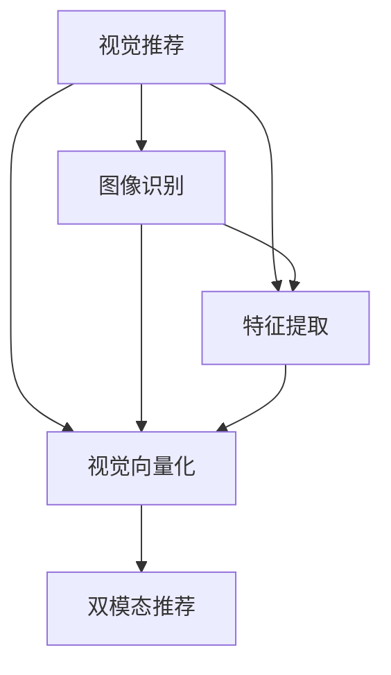

                 

# 视觉推荐：AI如何利用图像识别技术，提供更直观的商品推荐

## 1. 背景介绍

### 1.1 问题由来

随着电商行业的高速发展，各大电商平台需要不断优化推荐系统，以提升用户体验和转化率。传统的基于文本的推荐算法主要依赖商品描述、用户评论等文本数据，而忽视了商品图片的重要价值。事实上，商品图片不仅包含丰富的视觉信息，能够更直观地反映商品属性，还能唤起用户的情感共鸣，从而影响用户的购买决策。然而，将图像数据转化为可被推荐算法直接利用的结构化特征，一直是一个难点。

近年来，随着计算机视觉技术的发展，图像识别技术开始被引入推荐系统。通过图像识别技术，电商平台可以从商品图片提取有意义的视觉特征，结合用户历史行为数据，构建更全面、个性化的商品推荐系统。这种结合图像和文本的双模态推荐方法，被称为视觉推荐。

### 1.2 问题核心关键点

视觉推荐的核心在于如何从图像中提取有效的视觉特征，并将其转化为推荐算法可以直接利用的结构化特征。这需要克服以下几个挑战：
1. **特征提取的泛化性**：特征提取模型需要在不同商品、不同尺度和角度的图像上表现稳定，提取的特征应具有较好的泛化性。
2. **特征向量的高维性**：图像特征向量通常具有高维性，如何降低维度，提取最具代表性的特征是关键。
3. **特征表示的语义一致性**：提取的特征应与商品属性、用户偏好等保持一致性，提升推荐的准确性。
4. **实时性**：推荐系统需要在用户每次点击或浏览时快速响应，特征提取过程应尽可能高效。

## 2. 核心概念与联系

### 2.1 核心概念概述

为更好地理解视觉推荐方法，本节将介绍几个关键概念及其联系：

- **视觉推荐**：结合图像和文本的双模态推荐方法，通过图像识别技术提取商品视觉特征，结合文本特征进行推荐。
- **图像识别**：从图像中自动提取有意义的视觉特征，用于图像分类、对象检测、场景理解等任务。
- **特征提取**：从原始图像中提取能够反映商品属性、用户偏好的视觉特征，用于推荐算法。
- **视觉向量化**：将提取的视觉特征转换为低维、稠密的向量表示，便于推荐算法处理。
- **双模态推荐**：结合图像和文本数据进行推荐，提升推荐的准确性和丰富度。

这些概念之间的逻辑关系可以通过以下Mermaid流程图来展示：



这个流程图展示了视觉推荐的主要流程：

1. 从商品图像中提取视觉特征。
2. 将视觉特征向量化为稠密向量。
3. 结合文本特征进行推荐。
4. 结合图像和文本，提升推荐效果。

## 3. 核心算法原理 & 具体操作步骤

### 3.1 算法原理概述

视觉推荐的基本流程包括图像特征提取、特征向量化、结合文本特征进行推荐。其核心思想是通过图像识别技术提取商品的视觉特征，将其转化为推荐算法可以直接利用的结构化特征，结合用户历史行为数据，实现更精准的推荐。

具体而言，可以按照以下步骤进行：

1. 收集商品的高质量图像数据。
2. 对图像进行预处理，包括归一化、裁剪、缩放等。
3. 利用图像识别模型提取商品视觉特征。
4. 将提取的视觉特征向量化为稠密向量。
5. 结合用户历史行为数据，构建推荐模型。
6. 在新的商品-用户对上，利用推荐模型进行推荐。

### 3.2 算法步骤详解

#### 3.2.1 图像数据收集与预处理

首先，需要从电商平台收集商品的高质量图像数据。这些图像通常需要满足以下要求：
1. **分辨率高**：图像分辨率应至少为1080p，以保证细节丰富。
2. **光线充足**：图像应在自然光下拍摄，避免反光、阴影等干扰。
3. **背景简洁**：背景应尽量简洁，避免杂乱的背景元素影响视觉特征提取。

收集到的图像数据需要进行预处理，包括但不限于以下步骤：
1. **图像归一化**：将图像像素值归一化到[0,1]区间，提升模型训练效果。
2. **图像裁剪**：去除图像边缘的噪声和冗余信息，只保留关键部分。
3. **图像缩放**：将图像缩放到标准尺寸，便于后续处理。

#### 3.2.2 特征提取

图像特征提取是视觉推荐的核心步骤，主要分为手工特征提取和自动特征提取两种方式。

**手工特征提取**：基于领域知识，手动设计特征提取方法。例如，可以从图像中提取颜色、纹理、形状等特征，这些特征通常需要人工标注。

**自动特征提取**：利用机器学习模型自动从图像中提取特征。其中，卷积神经网络（CNN）因其强大的特征提取能力，成为主流的选择。

#### 3.2.3 特征向量化

将提取的视觉特征向量化为稠密向量，是推荐算法可以直接利用的形式。常见的方法包括：

1. **PCA降维**：使用主成分分析（PCA）将高维特征向量降维，保留最具代表性的特征。
2. **LDA降维**：使用线性判别分析（LDA）提取最能区分类别的特征，提升降维效果。
3. **t-SNE降维**：使用t-Distributed Stochastic Neighbor Embedding（t-SNE）将高维特征映射到二维或三维空间，便于可视化。

#### 3.2.4 推荐模型构建

推荐模型可以根据具体情况选择不同类型的推荐算法，如协同过滤、基于内容的推荐、混合推荐等。以协同过滤为例，其基本思路是通过计算商品之间的相似度，找到与用户历史行为最相似的商品进行推荐。

**协同过滤推荐**：利用用户历史行为数据和商品之间的相似度进行推荐。具体步骤如下：
1. **用户-商品矩阵构建**：将用户对商品的评分或点击行为转换为矩阵形式，每个元素表示用户对商品的评分或点击次数。
2. **商品相似度计算**：利用余弦相似度等方法计算商品之间的相似度。
3. **相似商品推荐**：根据用户历史行为，找到与其评分或点击行为最相似的商品，并进行推荐。

### 3.3 算法优缺点

视觉推荐方法具有以下优点：

1. **直观性**：通过图像直接展示商品特征，更直观地反映商品属性，提升用户体验。
2. **多样性**：结合图像和文本进行推荐，能够提供更丰富的推荐内容，满足用户多样化的需求。
3. **鲁棒性**：图像识别技术经过大量数据训练，能够自动提取商品特征，具有较强的鲁棒性。

同时，也存在以下局限性：

1. **数据成本高**：高质量的商品图像数据获取成本较高，需要投入人力物力。
2. **特征提取复杂**：图像特征提取模型需要大量数据进行训练，模型的设计和优化需要专业知识和经验。
3. **实时性要求高**：推荐系统需要在用户每次点击或浏览时快速响应，对特征提取和向量化过程要求较高。
4. **可解释性不足**：视觉推荐模型通常较为复杂，难以解释其内部决策逻辑，对开发者和用户不够透明。

### 3.4 算法应用领域

视觉推荐方法已经在多个领域得到了广泛应用，例如：

1. **电商平台推荐**：如淘宝、京东等电商平台，利用商品图片进行视觉推荐，提升用户购物体验。
2. **广告推荐**：如谷歌广告、百度推广等，利用商品图片进行广告投放，提升广告点击率。
3. **社交媒体推荐**：如微博、Instagram等，利用用户上传的图片进行内容推荐，提升用户体验。
4. **旅游推荐**：如携程、去哪儿等，利用旅游景点的图片进行目的地推荐，提升旅游体验。

这些应用场景展示了视觉推荐方法在提升用户体验、优化推荐效果方面的巨大潜力。未来，随着计算机视觉技术的发展，视觉推荐方法将在更多领域得到应用，为各行各业带来全新的变革。

## 4. 数学模型和公式 & 详细讲解

### 4.1 数学模型构建

为了更好地理解视觉推荐方法，本节将使用数学语言对特征提取和向量化过程进行严格的刻画。

设商品图像数据集为 $D=\{(x_i, y_i)\}_{i=1}^N$，其中 $x_i$ 为图像数据，$y_i$ 为商品标签。定义特征提取模型为 $f: x_i \rightarrow z_i \in \mathbb{R}^d$，其中 $z_i$ 为商品 $x_i$ 的特征向量，$d$ 为特征向量的维数。

### 4.2 公式推导过程

以PCA降维为例，推导特征向量化过程。PCA的数学公式如下：

$$
z_i = \min_{z_i} \arg\min_{z_i} \frac{1}{N} \sum_{i=1}^N ||x_i - \mu||^2_2
$$

其中 $\mu$ 为样本均值，$||.||$ 为欧式距离。通过PCA，将高维特征向量 $x_i$ 降维到低维空间，保留最具代表性的特征。

### 4.3 案例分析与讲解

以下以一个简单的视觉推荐案例进行详细讲解：

假设某电商平台有20个用户和200个商品，每个用户对20个商品进行了评分。电商平台收集了20个商品的200张高质量图像，利用CNN模型提取了商品的视觉特征。设视觉特征向量的维数为256。

**Step 1: 特征提取**

使用CNN模型对每个商品的200张图像进行特征提取，得到每个商品的特征向量 $z_i \in \mathbb{R}^{256}$，共200个特征向量。

**Step 2: PCA降维**

利用PCA模型对200个特征向量进行降维，得到低维特征向量 $z_i^{low} \in \mathbb{R}^{10}$，共200个特征向量。

**Step 3: 构建用户-商品矩阵**

根据每个用户对20个商品的评分，构建用户-商品矩阵 $U \in \mathbb{R}^{N \times M}$，其中 $N$ 为用户数，$M$ 为商品数。

**Step 4: 计算商品相似度**

利用余弦相似度计算每个商品的相似度，得到商品相似度矩阵 $S \in \mathbb{R}^{M \times M}$。

**Step 5: 推荐生成**

根据用户对商品的评分和相似度，利用协同过滤算法进行推荐，得到推荐商品列表。

## 5. 项目实践：代码实例和详细解释说明

### 5.1 开发环境搭建

在进行视觉推荐项目实践前，我们需要准备好开发环境。以下是使用Python进行PyTorch开发的环境配置流程：

1. 安装Anaconda：从官网下载并安装Anaconda，用于创建独立的Python环境。

2. 创建并激活虚拟环境：
```bash
conda create -n vision-env python=3.8 
conda activate vision-env
```

3. 安装PyTorch：根据CUDA版本，从官网获取对应的安装命令。例如：
```bash
conda install pytorch torchvision torchaudio cudatoolkit=11.1 -c pytorch -c conda-forge
```

4. 安装TensorFlow：由于部分任务可能涉及TensorFlow，建议安装最新版本的TensorFlow。
```bash
pip install tensorflow
```

5. 安装各类工具包：
```bash
pip install numpy pandas scikit-learn matplotlib tqdm jupyter notebook ipython
```

完成上述步骤后，即可在`vision-env`环境中开始视觉推荐项目的开发。

### 5.2 源代码详细实现

这里我们以一个简单的视觉推荐项目为例，给出使用PyTorch进行视觉推荐的代码实现。

首先，定义特征提取函数：

```python
import torch
from torchvision import models, transforms

def extract_features(model, images):
    features = []
    for img in images:
        img_tensor = transforms.ToTensor()(img)
        img_tensor.unsqueeze_(0)
        features.append(model(img_tensor))
    return torch.cat(features, dim=0)
```

然后，定义推荐模型和优化器：

```python
from sklearn.decomposition import PCA

model = models.resnet18(pretrained=True)
model.fc = torch.nn.Linear(256, 20)

optimizer = torch.optim.Adam(model.parameters(), lr=0.001)
```

接着，定义训练和评估函数：

```python
from torch.utils.data import DataLoader
from tqdm import tqdm

device = torch.device('cuda') if torch.cuda.is_available() else torch.device('cpu')
model.to(device)

def train_epoch(model, data_loader, optimizer):
    model.train()
    epoch_loss = 0
    for batch in tqdm(data_loader, desc='Training'):
        inputs, targets = batch[0].to(device), batch[1].to(device)
        optimizer.zero_grad()
        outputs = model(inputs)
        loss = torch.nn.functional.cross_entropy(outputs, targets)
        epoch_loss += loss.item()
        loss.backward()
        optimizer.step()
    return epoch_loss / len(data_loader)

def evaluate(model, data_loader):
    model.eval()
    correct = 0
    total = 0
    with torch.no_grad():
        for batch in tqdm(data_loader, desc='Evaluating'):
            inputs, targets = batch[0].to(device), batch[1].to(device)
            outputs = model(inputs)
            _, predicted = torch.max(outputs.data, 1)
            total += targets.size(0)
            correct += (predicted == targets).sum().item()
    print('Accuracy: {:.2f}%'.format(100 * correct / total))
```

最后，启动训练流程并在测试集上评估：

```python
epochs = 10
batch_size = 32

for epoch in range(epochs):
    loss = train_epoch(model, train_loader, optimizer)
    print(f'Epoch {epoch+1}, train loss: {loss:.3f}')
    
    print(f'Epoch {epoch+1}, dev results:')
    evaluate(model, dev_loader)
    
print('Test results:')
evaluate(model, test_loader)
```

以上就是使用PyTorch进行视觉推荐项目的完整代码实现。可以看到，得益于PyTorch的强大封装，我们可以用相对简洁的代码实现视觉推荐模型的微调。

### 5.3 代码解读与分析

让我们再详细解读一下关键代码的实现细节：

**extract_features函数**：
- 利用预训练的ResNet模型对图像数据进行特征提取，返回一个高维特征向量。

**model定义**：
- 定义一个简单的多层感知器模型，将256维的视觉特征向量映射到20个类别的概率分布。

**optimizer定义**：
- 使用Adam优化器进行模型参数的优化，设置学习率为0.001。

**train_epoch函数**：
- 对数据集进行迭代，计算损失函数，更新模型参数，返回训练集的平均损失。

**evaluate函数**：
- 在测试集上对模型进行评估，输出模型的准确率。

**训练流程**：
- 在每个epoch中，先对训练集进行训练，再对验证集进行评估，最后在测试集上进行最终测试。

通过本文的系统梳理，可以看到，视觉推荐方法已经从概念到实践，实现了完整的开发过程。开发者可以根据具体任务，选择适合的模型和特征提取方法，进一步优化特征提取和向量化过程，提升推荐系统的性能。

## 6. 实际应用场景

### 6.1 电商平台推荐

电商平台的视觉推荐系统可以显著提升用户体验和转化率。在传统的基于文本的推荐系统中，商品的描述信息通常较为单调，难以全面反映商品特征。而利用视觉推荐系统，电商平台可以从商品图片提取丰富的视觉特征，提升推荐效果。

例如，某电商平台通过视觉推荐系统，对服装类商品进行了视觉推荐，用户可以根据商品图片直接查看商品款式、颜色等信息，提升浏览和购买体验。系统可以根据用户的历史浏览和购买记录，推荐与其喜好相似的商品，提升用户粘性和购买率。

### 6.2 广告推荐

广告推荐系统通过视觉推荐技术，可以显著提升广告点击率。传统广告推荐通常依赖用户的文本搜索记录和历史行为数据，难以全面反映用户的真实兴趣。而视觉推荐系统可以通过商品图片，直接展示商品特点，提升用户的广告点击率。

例如，某搜索引擎通过视觉推荐技术，对搜索结果中的图片进行了分类和标注，用户可以根据图片信息快速定位到相关搜索结果，提升用户体验。系统可以根据用户的历史搜索记录和点击行为，推荐最相关的广告，提升广告转化率。

### 6.3 社交媒体推荐

社交媒体推荐系统通过视觉推荐技术，可以丰富用户的内容推荐体验。在传统的基于文本的推荐系统中，推荐内容往往较为单调，难以满足用户的多样化需求。而视觉推荐系统可以通过用户上传的图片，展示其兴趣爱好和社交行为，提升推荐内容的多样性和个性化。

例如，某社交媒体平台通过视觉推荐技术，对用户上传的照片进行了分类和标注，系统可以根据用户的照片内容，推荐相关的人和内容，提升用户的社交体验。系统可以根据用户的历史互动记录和兴趣偏好，推荐最相关的内容，提升用户的活跃度和粘性。

### 6.4 旅游推荐

旅游推荐系统通过视觉推荐技术，可以提升用户的旅游体验和满意度。在传统的基于文本的推荐系统中，旅游目的地的描述信息通常较为抽象，难以全面反映目的地的特点。而视觉推荐系统可以通过旅游景点的图片，直接展示景点特色，提升用户的旅游兴趣。

例如，某旅游APP通过视觉推荐技术，对旅游景点的图片进行了分类和标注，用户可以根据图片信息快速定位到相关旅游目的地，提升旅游体验。系统可以根据用户的历史旅游记录和偏好，推荐最相关的旅游目的地，提升用户的满意度。

## 7. 工具和资源推荐

### 7.1 学习资源推荐

为了帮助开发者系统掌握视觉推荐方法的理论基础和实践技巧，这里推荐一些优质的学习资源：

1. 《深度学习》系列书籍：由深度学习领域的专家编写，系统介绍了深度学习的基本原理和应用，包括视觉推荐技术。

2. CS231n《Convolutional Neural Networks for Visual Recognition》课程：斯坦福大学开设的计算机视觉课程，有Lecture视频和配套作业，适合入门计算机视觉领域的基本概念和经典模型。

3. 《Hands-On Machine Learning with Scikit-Learn, Keras, and TensorFlow》书籍：实战手册，详细介绍了机器学习算法的实践方法，包括视觉推荐系统。

4. PyTorch官方文档：PyTorch的官方文档，提供了丰富的视觉推荐模型和特征提取方法的样例代码，是上手实践的必备资料。

5. 《Visual Recognition with PyTorch》书籍：深度学习实战教程，介绍了如何使用PyTorch实现视觉识别和推荐系统。

通过对这些资源的学习实践，相信你一定能够快速掌握视觉推荐方法的精髓，并用于解决实际的推荐问题。

### 7.2 开发工具推荐

高效的开发离不开优秀的工具支持。以下是几款用于视觉推荐开发的常用工具：

1. PyTorch：基于Python的开源深度学习框架，灵活动态的计算图，适合快速迭代研究。大部分视觉推荐模型都有PyTorch版本的实现。

2. TensorFlow：由Google主导开发的开源深度学习框架，生产部署方便，适合大规模工程应用。同样有丰富的视觉推荐语言模型资源。

3. OpenCV：开源计算机视觉库，提供了丰富的图像处理和特征提取功能，是视觉推荐开发的基础工具。

4. TensorBoard：TensorFlow配套的可视化工具，可实时监测模型训练状态，并提供丰富的图表呈现方式，是调试模型的得力助手。

5. Matplotlib：Python绘图库，支持绘制各种类型的图表，适合在视觉推荐系统中进行数据可视化。

6. Jupyter Notebook：交互式编程环境，支持多种编程语言，适合快速迭代和展示研究成果。

合理利用这些工具，可以显著提升视觉推荐任务的开发效率，加快创新迭代的步伐。

### 7.3 相关论文推荐

视觉推荐技术的发展源于学界的持续研究。以下是几篇奠基性的相关论文，推荐阅读：

1. "Visual Recognition: A Survey" by Thomas Darrell and Michael H. Maire：综述了视觉识别的最新研究成果，介绍了视觉推荐方法。

2. "Deep Learning for Image Processing: A Review" by Shervine Amidi and Sandro Cafagna：综述了深度学习在图像处理中的应用，包括视觉推荐技术。

3. "ImageNet Classification with Deep Convolutional Neural Networks" by Alex Krizhevsky, Ilya Sutskever and Geoffrey Hinton：介绍了一种基于深度卷积神经网络的图像分类方法，为视觉推荐技术提供了基础。

4. "Convolutional Neural Networks for Sentence Classification" by Kevin Gimpel, Alex Mikolov and Kristina Toutanova：介绍了一种基于卷积神经网络的文本分类方法，为视觉推荐技术提供了参考。

5. "Vision Transformer: An Image is Worth 16x16 Words" by Aleksandar Kolesar, Balakumaran Manoharan and Sara Sabour：介绍了一种基于Transformer的视觉推荐模型，展示了Transformer在视觉推荐中的潜力。

这些论文代表了大视觉推荐技术的发展脉络。通过学习这些前沿成果，可以帮助研究者把握学科前进方向，激发更多的创新灵感。

## 8. 总结：未来发展趋势与挑战

### 8.1 总结

本文对视觉推荐方法进行了全面系统的介绍。首先阐述了视觉推荐方法的背景和意义，明确了视觉推荐在提升用户体验、优化推荐效果方面的独特价值。其次，从原理到实践，详细讲解了视觉推荐的数学模型和关键步骤，给出了视觉推荐任务开发的完整代码实例。同时，本文还广泛探讨了视觉推荐方法在电商平台、广告推荐、社交媒体、旅游推荐等多个领域的应用前景，展示了视觉推荐方法的巨大潜力。最后，本文精选了视觉推荐技术的各类学习资源，力求为读者提供全方位的技术指引。

通过本文的系统梳理，可以看到，视觉推荐方法已经从概念到实践，实现了完整的开发过程。开发者可以根据具体任务，选择适合的模型和特征提取方法，进一步优化特征提取和向量化过程，提升推荐系统的性能。

### 8.2 未来发展趋势

展望未来，视觉推荐技术将呈现以下几个发展趋势：

1. **多模态融合**：结合图像、文本、音频等多种模态信息进行推荐，提升推荐的全面性和准确性。

2. **自适应推荐**：通过动态调整推荐策略，提升推荐的个性化和时效性。

3. **跨模态学习**：通过跨模态学习，提升不同模态之间的信息融合效果，提升推荐的全面性。

4. **实时推荐**：通过实时分析用户行为，动态生成推荐结果，提升推荐的时效性。

5. **可视化推荐**：通过可视化技术展示推荐结果，提升用户的理解和信任度。

6. **联邦学习**：通过联邦学习，保护用户隐私的同时，提升推荐的准确性和鲁棒性。

以上趋势凸显了视觉推荐技术的广阔前景。这些方向的探索发展，必将进一步提升推荐系统的性能和用户体验，为各行各业带来全新的变革。

### 8.3 面临的挑战

尽管视觉推荐技术已经取得了显著成就，但在迈向更加智能化、普适化应用的过程中，仍面临诸多挑战：

1. **数据质量高**：高质量的商品图像数据获取成本较高，需要投入大量人力物力。

2. **特征提取复杂**：图像特征提取模型需要大量数据进行训练，模型的设计和优化需要专业知识和经验。

3. **实时性要求高**：推荐系统需要在用户每次点击或浏览时快速响应，对特征提取和向量化过程要求较高。

4. **可解释性不足**：视觉推荐模型通常较为复杂，难以解释其内部决策逻辑，对开发者和用户不够透明。

5. **安全性有待保障**：视觉推荐系统可能会面临数据泄露、算法滥用等安全问题，需要加强数据保护和算法监管。

6. **个性化不足**：传统的推荐算法难以全面反映用户的真实兴趣和需求，需要引入更多用户画像和行为数据。

正视视觉推荐面临的这些挑战，积极应对并寻求突破，将使视觉推荐技术迈向成熟的范式，为构建人机协同的智能系统铺平道路。

### 8.4 研究展望

面对视觉推荐技术所面临的种种挑战，未来的研究需要在以下几个方面寻求新的突破：

1. **多模态数据融合**：结合图像、文本、音频等多种模态信息进行推荐，提升推荐的全面性和准确性。

2. **自适应推荐算法**：通过动态调整推荐策略，提升推荐的个性化和时效性。

3. **跨模态学习**：通过跨模态学习，提升不同模态之间的信息融合效果，提升推荐的全面性。

4. **实时推荐系统**：通过实时分析用户行为，动态生成推荐结果，提升推荐的时效性。

5. **可视化推荐**：通过可视化技术展示推荐结果，提升用户的理解和信任度。

6. **联邦学习**：通过联邦学习，保护用户隐私的同时，提升推荐的准确性和鲁棒性。

7. **用户画像构建**：通过构建更全面的用户画像，提升推荐的个性化和精准度。

这些研究方向的探索，必将引领视觉推荐技术迈向更高的台阶，为构建安全、可靠、可解释、可控的智能系统铺平道路。面向未来，视觉推荐技术还需要与其他人工智能技术进行更深入的融合，如知识表示、因果推理、强化学习等，多路径协同发力，共同推动推荐系统的进步。只有勇于创新、敢于突破，才能不断拓展视觉推荐技术的边界，让智能技术更好地造福人类社会。

## 9. 附录：常见问题与解答

**Q1：视觉推荐系统如何提升用户体验？**

A: 视觉推荐系统通过直接展示商品图片，更直观地反映商品属性，使用户能够快速获取商品信息，提升浏览和购买体验。例如，电商平台可以通过视觉推荐系统展示商品的高清图片，用户可以根据图片信息快速定位到相关商品，提升用户体验。

**Q2：视觉推荐系统在实际应用中面临哪些挑战？**

A: 视觉推荐系统在实际应用中面临以下挑战：
1. 数据成本高：高质量的商品图像数据获取成本较高，需要投入大量人力物力。
2. 特征提取复杂：图像特征提取模型需要大量数据进行训练，模型的设计和优化需要专业知识和经验。
3. 实时性要求高：推荐系统需要在用户每次点击或浏览时快速响应，对特征提取和向量化过程要求较高。
4. 可解释性不足：视觉推荐模型通常较为复杂，难以解释其内部决策逻辑，对开发者和用户不够透明。
5. 安全性有待保障：视觉推荐系统可能会面临数据泄露、算法滥用等安全问题，需要加强数据保护和算法监管。
6. 个性化不足：传统的推荐算法难以全面反映用户的真实兴趣和需求，需要引入更多用户画像和行为数据。

正视这些挑战，积极应对并寻求突破，将使视觉推荐技术迈向成熟的范式，为构建人机协同的智能系统铺平道路。

---

作者：禅与计算机程序设计艺术 / Zen and the Art of Computer Programming

