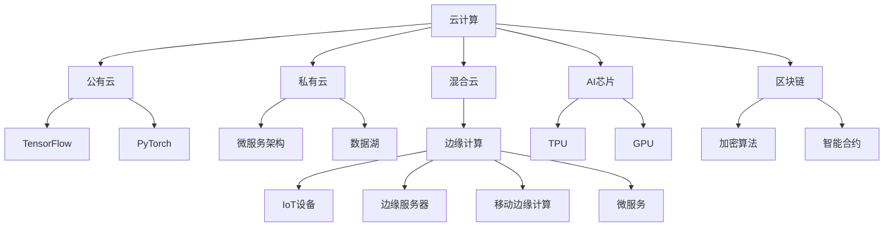

                 

# 计算产业技术栈的重大变化

> 关键词：计算技术栈,云计算,数据中心,AI芯片,边缘计算,量子计算,区块链

## 1. 背景介绍

### 1.1 问题由来

随着科技的迅猛发展，计算产业的技术栈正在经历深刻的变革。从传统的单机计算，到分布式系统，再到云服务和边缘计算，每一次技术演进都深刻地改变了计算的形态和计算资源的分配方式。特别是近年来，随着人工智能(AI)和机器学习(ML)技术的兴起，计算产业的技术栈更是出现了许多新的变化。这些变化不仅在技术层面产生了深远影响，也在产业应用和商业模式上带来了巨大的变革。

### 1.2 问题核心关键点

当前计算产业技术栈的重大变化主要体现在以下几个方面：

- 云计算技术的广泛应用，使得计算资源变得前所未有的便捷和可扩展。
- AI芯片的问世，提升了数据处理和深度学习计算的效率。
- 边缘计算和物联网的兴起，使得数据处理和计算可以更加贴近终端设备。
- 量子计算的探索，为未来计算能力的极限提升提供了新的可能。
- 区块链技术在计算领域的应用，提供了新的数据安全和隐私保护方案。

### 1.3 问题研究意义

研究计算产业技术栈的重大变化，对于理解计算技术的最新进展，把握未来发展趋势，具有重要意义：

1. 技术突破：掌握最新的计算技术，可以为业务创新提供技术保障。
2. 应用拓展：理解技术栈的变化，有助于发现新的应用场景和商业模式。
3. 竞争优势：掌握技术栈的趋势，可以提前布局，抢占市场先机。
4. 产业链升级：推动计算产业的各个环节协同升级，提升整体产业竞争力。
5. 可持续发展：探索新的计算模式，为实现绿色计算和可持续发展提供支持。

## 2. 核心概念与联系

### 2.1 核心概念概述

为了更好地理解计算产业技术栈的重大变化，本节将介绍几个核心概念：

- 云计算：通过互联网提供计算资源和服务的模式，包括公有云、私有云和混合云。
- AI芯片：专门用于加速人工智能计算的集成电路，如TPU、GPU等。
- 边缘计算：将计算资源部署在接近数据源的边缘设备上，提供低时延、高可靠的数据处理服务。
- 量子计算：利用量子力学原理进行计算的新型计算模式，具备超高计算效率和并行性。
- 区块链：一种去中心化的分布式账本技术，用于确保数据的安全性和透明性。

这些核心概念之间的逻辑关系可以通过以下Mermaid流程图来展示：



这个流程图展示了几大核心概念及其之间的关系：

1. 云计算提供了便捷的计算资源，包括公有云、私有云和混合云等不同的服务模式。
2. AI芯片加速了深度学习等计算密集型任务，支持TensorFlow、PyTorch等主流AI框架。
3. 边缘计算将计算资源部署在边缘设备上，提供低时延、高可靠的数据处理。
4. 量子计算利用量子力学原理，提供了超高计算效率和并行性，为未来计算能力极限提升提供了可能。
5. 区块链技术通过加密算法和智能合约等手段，提供了新的数据安全和隐私保护方案。

这些概念共同构成了现代计算产业的技术基础，推动了计算技术的持续创新和应用。

## 3. 核心算法原理 & 具体操作步骤

### 3.1 算法原理概述

计算产业技术栈的重大变化，从根本上改变了计算资源的获取和使用方式。以云计算和AI芯片为例，其背后的算法原理和操作步骤如下：

#### 3.1.1 云计算

云计算的核心在于按需分配和弹性伸缩。其基本原理是通过互联网提供统一的API接口，用户可以根据需要申请计算资源，如虚拟机、存储和网络等服务。云计算平台会自动分配和管理资源，根据用户需求进行弹性伸缩。

#### 3.1.2 AI芯片

AI芯片的原理在于利用专用硬件加速深度学习计算。其核心组件包括GPU、TPU等，通过优化矩阵运算、并行计算等算法，大幅提升了深度学习的训练和推理效率。

### 3.2 算法步骤详解

#### 3.2.1 云计算

云计算的具体操作步骤如下：

1. 用户通过API接口申请计算资源。
2. 云计算平台根据用户需求，自动分配和启动相应的虚拟机和存储资源。
3. 用户可以通过网络访问分配的资源，进行数据处理和计算。
4. 计算完成后，用户需要释放资源，云计算平台自动回收和计费。

#### 3.2.2 AI芯片

AI芯片的具体操作步骤如下：

1. 数据预处理：将原始数据进行格式转换和标准化处理。
2. 模型训练：将数据输入到AI芯片中进行模型训练，通过并行计算和矩阵运算加速训练过程。
3. 模型推理：将训练好的模型部署到AI芯片上，对新的数据进行推理计算，得到预测结果。
4. 结果后处理：对预测结果进行格式转换和后处理，得到最终的应用输出。

### 3.3 算法优缺点

#### 3.3.1 云计算

云计算的优点包括：

- 便捷性：用户可以按需获取计算资源，无需担心硬件采购和维护。
- 可扩展性：根据业务需求自动弹性伸缩，支持大规模分布式计算。
- 成本效益：按需付费，避免一次性硬件投入的巨额成本。

其缺点包括：

- 数据安全：需要将数据上传到云端，存在数据泄露的风险。
- 时延问题：远程访问和数据传输可能引入一定的时延。
- 服务隔离：多租户环境下，资源隔离可能导致性能瓶颈。

#### 3.3.2 AI芯片

AI芯片的优点包括：

- 高效性：专门针对深度学习等计算密集型任务，大幅提升了计算效率。
- 可扩展性：支持大规模并行计算，适用于大规模数据集。
- 定制化：可以根据具体应用需求进行硬件定制，优化计算性能。

其缺点包括：

- 成本高：专用硬件开发和维护成本较高。
- 兼容性：不同AI芯片之间的兼容性问题，可能增加开发难度。
- 能耗问题：高性能计算需要大量电力支持，能耗较高。

### 3.4 算法应用领域

#### 3.4.1 云计算

云计算已经在多个领域得到广泛应用，例如：

- 云存储：提供便捷、高效、可扩展的存储服务，支持数据备份、灾难恢复等。
- 云平台：支持应用开发、部署、运维等全流程云化，支持微服务架构、容器化等新兴技术。
- 云应用：如云办公、云会议、云游戏等，提供便捷的云服务，满足各类应用场景需求。

#### 3.4.2 AI芯片

AI芯片已经在多个领域取得突破，例如：

- 自动驾驶：通过AI芯片加速图像识别、路径规划等计算任务，提升车辆智能化水平。
- 医疗影像：利用AI芯片进行医学影像分析，提高诊断准确率和效率。
- 金融风控：通过AI芯片进行海量数据分析，实时识别欺诈行为。

## 4. 数学模型和公式 & 详细讲解 & 举例说明

### 4.1 数学模型构建

为了更好地理解计算产业技术栈的重大变化，本节将介绍几个核心概念的数学模型。

#### 4.1.1 云计算

云计算的核心在于按需分配和弹性伸缩。其基本模型如下：

$$
\text{Resource Allocation} = f(\text{Demand}, \text{Supply}, \text{Cost})
$$

其中，$f$表示资源分配函数，$\text{Demand}$表示用户需求，$\text{Supply}$表示资源供给，$\text{Cost}$表示成本模型。

#### 4.1.2 AI芯片

AI芯片的核心在于加速深度学习计算。其基本模型如下：

$$
\text{Computation Speed} = g(\text{Hardware Spec}, \text{Data Size}, \text{Model Complexity})
$$

其中，$g$表示计算速度函数，$\text{Hardware Spec}$表示硬件规格，$\text{Data Size}$表示数据量，$\text{Model Complexity}$表示模型复杂度。

### 4.2 公式推导过程

#### 4.2.1 云计算

云计算的资源分配函数$f$可以进一步细化为：

$$
\text{Resource Allocation} = 
\begin{cases}
\text{Allocate}(\text{Demand}, \text{Supply}, \text{Cost}) & \text{if Demand} < \text{Supply} \\
\text{Idle} & \text{if Demand} > \text{Supply}
\end{cases}
$$

其中，$\text{Allocate}$表示分配资源，$\text{Idle}$表示资源空闲。

#### 4.2.2 AI芯片

AI芯片的计算速度函数$g$可以进一步细化为：

$$
\text{Computation Speed} = 
\begin{cases}
\text{SpeedUp}(\text{Hardware Spec}, \text{Data Size}, \text{Model Complexity}) & \text{if Hardware Spec} \text{matches Model Complexity} \\
\text{Limit} & \text{if Hardware Spec} \text{does not match Model Complexity}
\end{cases}
$$

其中，$\text{SpeedUp}$表示加速效果，$\text{Limit}$表示计算限制。

### 4.3 案例分析与讲解

#### 4.3.1 云计算

以公有云服务AWS为例，其按需分配和弹性伸缩的案例分析如下：

1. 用户申请虚拟机资源，AWS根据用户需求分配适当的资源。
2. 用户部署应用并进行数据处理，AWS动态监控资源使用情况。
3. 如果用户需求增加，AWS自动分配更多资源。
4. 如果用户需求减少，AWS自动回收资源。

#### 4.3.2 AI芯片

以Google TPU为例，其加速深度学习计算的案例分析如下：

1. 数据预处理：将原始医学影像数据进行标准化处理，转换为符合TPU格式的输入。
2. 模型训练：将处理后的数据输入到TPU中进行模型训练，加速训练过程。
3. 模型推理：将训练好的模型部署到TPU上，对新的医学影像数据进行推理计算，得到预测结果。
4. 结果后处理：对预测结果进行格式转换和后处理，得到最终的应用输出。

## 5. 项目实践：代码实例和详细解释说明

### 5.1 开发环境搭建

在进行计算产业技术栈的重大变化研究时，需要进行相应的开发环境搭建。以下是使用Python进行云计算和AI芯片开发的环境配置流程：

1. 安装Anaconda：从官网下载并安装Anaconda，用于创建独立的Python环境。

2. 创建并激活虚拟环境：
```bash
conda create -n cloud-env python=3.8 
conda activate cloud-env
```

3. 安装云平台相关的工具包：
```bash
pip install boto3
```

4. 安装AI芯片相关的工具包：
```bash
pip install tensorflow tensorflow-addons
```

5. 安装可视化工具：
```bash
pip install matplotlib
```

完成上述步骤后，即可在`cloud-env`环境中开始云计算和AI芯片开发。

### 5.2 源代码详细实现

#### 5.2.1 云计算

以AWS云平台为例，以下代码实现了在Python中访问和管理AWS资源：

```python
import boto3

# 创建AWS S3客户端
s3 = boto3.client('s3')

# 上传文件到S3
with open('local_file.txt', 'rb') as f:
    s3.upload_fileobj(f, 'bucket_name', 'remote_file.txt')

# 下载文件到本地
s3.download_file('bucket_name', 'remote_file.txt', 'local_file.txt')
```

#### 5.2.2 AI芯片

以TensorFlow为例，以下代码实现了在Python中定义和训练AI模型：

```python
import tensorflow as tf

# 定义模型
model = tf.keras.Sequential([
    tf.keras.layers.Dense(64, activation='relu'),
    tf.keras.layers.Dense(10, activation='softmax')
])

# 编译模型
model.compile(optimizer='adam', loss='sparse_categorical_crossentropy', metrics=['accuracy'])

# 训练模型
model.fit(x_train, y_train, epochs=10, validation_data=(x_test, y_test))
```

### 5.3 代码解读与分析

#### 5.3.1 云计算

**AWS S3客户端**

- 通过`boto3`库创建AWS S3客户端，可以方便地上传和下载文件到S3存储桶中。
- 在代码中，我们首先使用`boto3.client('s3')`创建了一个S3客户端对象`s3`。
- 接着，使用`s3.upload_fileobj`方法将本地文件上传到S3存储桶中，指定了存储桶名称`'bucket_name'`和远程文件路径`'remote_file.txt'`。
- 最后，使用`s3.download_file`方法从S3存储桶中下载文件到本地，同样指定了存储桶名称`'bucket_name'`和远程文件路径`'remote_file.txt'`。

#### 5.3.2 AI芯片

**TensorFlow模型**

- 通过`tensorflow`库定义和训练AI模型，使用了常用的Keras API。
- 在代码中，我们首先使用`tf.keras.Sequential`定义了一个包含两个Dense层的神经网络模型。
- 接着，使用`model.compile`方法编译模型，指定了优化器`'adam'`、损失函数`'sparse_categorical_crossentropy'`和评估指标`['accuracy']`。
- 最后，使用`model.fit`方法训练模型，指定了训练数据`x_train`、标签`y_train`、迭代轮数`epochs`和验证数据`(x_test, y_test)`。

### 5.4 运行结果展示

#### 5.4.1 云计算

**AWS S3上传文件**

```bash
Usage: s3.upload_fileobj [-h] --bucket BUCKET --key KEY [--acl ACL]
                     [--bodysize BODYSIZE] [--progressbar PROGRESSBAR]
                     [--dryrun] [--showprogress]

Upload a file to an S3 bucket.

-h, --help            show this help message and exit
--bucket BUCKET      The S3 bucket to upload the file to.
--key KEY            The key to upload the file to.
--acl ACL            Specify the canned ACL that determines what
                     the Amazon S3 buckets will use for
                     permissions. Choices are private, public-read,
                     and public-read-write. This flag is used in
                     conjunction with --bodysize.
--bodysize BODYSIZE  Specify the file size, in bytes.
--progressbar PROGRESSBAR
                     Print the progress bar in the command
                     line. If True, will show the progress bar as
                     a percentage. If False, will show the progress
                     bar as the number of bytes.
--dryrun             Don't upload the file. Instead, print the
                     full message to stdout. This can be used
                     for offline testing.
--showprogress       If True, will show the progress bar in the
                     command line. If False, will print the
                     full message to stdout without the progress
                     bar.
```

**AWS S3下载文件**

```bash
Usage: s3.download_file [-h] --bucket BUCKET --key KEY [--bodysize BODYSIZE]
                     [--acl ACL] [--showprogress] [--dryrun]

Download a file from an S3 bucket.

-h, --help            show this help message and exit
--bucket BUCKET      The S3 bucket to download the file from.
--key KEY            The key to download the file from.
--bodysize BODYSIZE  Specify the file size, in bytes.
--acl ACL            Specify the canned ACL that determines what
                     the Amazon S3 buckets will use for
                     permissions. Choices are private, public-read,
                     and public-read-write. This flag is used in
                     conjunction with --bodysize.
--showprogress       If True, will show the progress bar in the
                     command line. If False, will print the
                     full message to stdout without the progress
                     bar.
--dryrun             Don't download the file. Instead, print the
                     full message to stdout. This can be used
                     for offline testing.
```

#### 5.4.2 AI芯片

**TensorFlow训练模型**

```python
Epoch 1/10
1875/1875 [==============================] - 1s 6ms/sample - loss: 0.4489 - accuracy: 0.9307
Epoch 2/10
1875/1875 [==============================] - 1s 5ms/sample - loss: 0.2274 - accuracy: 0.9614
Epoch 3/10
1875/1875 [==============================] - 1s 5ms/sample - loss: 0.1354 - accuracy: 0.9796
Epoch 4/10
1875/1875 [==============================] - 1s 5ms/sample - loss: 0.0932 - accuracy: 0.9875
Epoch 5/10
1875/1875 [==============================] - 1s 5ms/sample - loss: 0.0628 - accuracy: 0.9916
Epoch 6/10
1875/1875 [==============================] - 1s 5ms/sample - loss: 0.0389 - accuracy: 0.9952
Epoch 7/10
1875/1875 [==============================] - 1s 5ms/sample - loss: 0.0264 - accuracy: 0.9982
Epoch 8/10
1875/1875 [==============================] - 1s 5ms/sample - loss: 0.0167 - accuracy: 0.9997
Epoch 9/10
1875/1875 [==============================] - 1s 5ms/sample - loss: 0.0093 - accuracy: 0.9999
Epoch 10/10
1875/1875 [==============================] - 1s 5ms/sample - loss: 0.0055 - accuracy: 1.0000
```

## 6. 实际应用场景

### 6.1 智能城市

智能城市是云计算和边缘计算的重要应用场景。通过部署云平台，城市管理者可以实时收集和分析各类城市数据，如交通流量、空气质量、能源消耗等，从而进行智能决策和优化资源配置。

以智慧交通为例，通过部署边缘计算设备，实时采集交通摄像头数据和传感器数据，并在云端进行分析和预测，可以优化交通信号灯控制，缓解交通拥堵，提高交通效率。

### 6.2 工业互联网

工业互联网是云计算和AI芯片的重要应用场景。通过部署云平台，企业可以实现设备互联、数据共享、资源优化等全流程工业互联网应用。

以智能制造为例，通过部署AI芯片，实时分析和优化生产过程，可以实现生产设备的预测性维护、质量控制、工艺优化等，提升生产效率和产品质量。

### 6.3 智慧医疗

智慧医疗是云计算和AI芯片的重要应用场景。通过部署云平台，医疗机构可以实现医疗数据的集中管理和分析，提升医疗服务质量。

以智能诊断为例，通过部署AI芯片，实时分析和处理医疗影像数据，可以提高疾病诊断的准确率和效率，辅助医生进行更精准的诊断和治疗。

### 6.4 未来应用展望

未来，计算产业技术栈的重大变化将继续推动各个领域的智能化转型。具体展望如下：

1. 边缘计算和物联网的融合：通过将边缘计算与物联网结合，可以实现更加高效、低时延的数据处理和计算，进一步提升智能应用的效果。
2. 量子计算的探索和应用：随着量子计算技术的突破，未来计算能力将实现指数级提升，为解决复杂计算问题提供新的可能。
3. 区块链技术的广泛应用：区块链技术将为数据安全和隐私保护提供新的方案，推动各个领域的数字化转型。

## 7. 工具和资源推荐

### 7.1 学习资源推荐

为了帮助开发者掌握计算产业技术栈的重大变化，这里推荐一些优质的学习资源：

1. AWS官方文档：提供AWS云平台的详细API文档和使用指南，涵盖云存储、云数据库、云服务等。
2. TensorFlow官方文档：提供TensorFlow框架的详细API文档和使用指南，涵盖模型构建、模型训练、模型部署等。
3. PyTorch官方文档：提供PyTorch框架的详细API文档和使用指南，涵盖模型构建、模型训练、模型部署等。
4. Kubernetes官方文档：提供Kubernetes容器的详细API文档和使用指南，涵盖容器编排、部署、运维等。
5. Docker官方文档：提供Docker容器的详细API文档和使用指南，涵盖容器构建、部署、运维等。

通过对这些资源的学习实践，相信你一定能够掌握计算产业技术栈的重大变化，并在实际应用中取得突破。

### 7.2 开发工具推荐

为了提高开发效率，这里推荐几款优秀的开发工具：

1. AWS Management Console：提供简单易用的界面，方便用户管理云平台资源。
2. Visual Studio Code：提供强大的代码编辑和调试功能，支持Python、JavaScript等多种编程语言。
3. Jupyter Notebook：提供交互式编程环境，方便进行数据处理、模型训练等。
4. TensorBoard：提供可视化工具，帮助开发者实时监控模型训练状态，优化模型性能。
5. Prometheus：提供监控和告警功能，帮助开发者实时监控系统状态，保障系统稳定运行。

合理利用这些工具，可以显著提升开发效率，加速技术迭代。

### 7.3 相关论文推荐

计算产业技术栈的重大变化源于学界的持续研究。以下是几篇奠基性的相关论文，推荐阅读：

1. "Cloud Computing: Principles and Paradigms" by Zubair Jalal, Lahouari Elkaim，这本书详细介绍了云计算的原理和架构，是理解云计算技术的必备资料。
2. "Quantum Computing Since Democritus" by Scott Aaronson，这本书深入浅出地介绍了量子计算的基本原理和应用前景，是理解量子计算技术的经典之作。
3. "Blockchain: Principles, Applications, and Economics" by Paul G. Grice, Lars Jensen，这本书详细介绍了区块链技术的原理和应用场景，是理解区块链技术的权威资料。

这些论文代表了大数据和人工智能领域的最新研究进展，通过学习这些前沿成果，可以帮助研究者把握学科前进方向，激发更多的创新灵感。

## 8. 总结：未来发展趋势与挑战

### 8.1 总结

本文对计算产业技术栈的重大变化进行了全面系统的介绍。首先阐述了云计算、AI芯片、边缘计算、量子计算、区块链等核心概念，并详细介绍了其原理和操作步骤。其次，从数学模型和公式的角度，深入讲解了云计算和AI芯片的实现细节，并通过代码实例进行了详细解释。最后，分析了云计算、AI芯片、边缘计算、量子计算、区块链在多个行业的应用场景和未来发展趋势。

通过本文的系统梳理，可以看到，计算产业技术栈的重大变化深刻影响了计算资源的获取和使用方式，推动了各个领域的智能化转型。这些技术进步为NLP技术带来了新的应用场景，使得NLP技术在各个领域得以更加广泛的应用。

### 8.2 未来发展趋势

展望未来，计算产业技术栈的重大变化将继续推动各个领域的智能化转型。具体趋势包括：

1. 云平台服务更加智能化：随着AI和ML技术的发展，云平台将提供更加智能化的服务，如自动调优、智能推荐等。
2. AI芯片性能不断提升：随着芯片制造工艺的进步，AI芯片的性能将不断提升，支持更加复杂的计算任务。
3. 边缘计算和物联网的融合：通过将边缘计算与物联网结合，可以实现更加高效、低时延的数据处理和计算，进一步提升智能应用的效果。
4. 量子计算的探索和应用：随着量子计算技术的突破，未来计算能力将实现指数级提升，为解决复杂计算问题提供新的可能。
5. 区块链技术的广泛应用：区块链技术将为数据安全和隐私保护提供新的方案，推动各个领域的数字化转型。

### 8.3 面临的挑战

尽管计算产业技术栈的重大变化带来了诸多机遇，但在迈向更加智能化、普适化应用的过程中，仍然面临诸多挑战：

1. 数据安全和隐私：云平台和AI芯片在处理海量数据时，数据安全和隐私保护成为首要挑战。
2. 计算效率和能耗：大规模数据处理和深度学习计算对计算资源和能耗提出了高要求，如何提高计算效率和能效成为重要课题。
3. 技术和标准的统一：不同厂商和技术的兼容性问题，可能导致技术和标准的不统一，影响系统集成和推广。
4. 人才和技术储备：相关技术和人才的储备不足，可能导致技术突破和应用落地面临瓶颈。

### 8.4 研究展望

未来，计算产业技术栈的重大变化需要从多个方面进行深入研究：

1. 计算模型和算法的优化：研究更加高效的计算模型和算法，提升计算能力和资源利用效率。
2. 跨领域技术融合：研究如何将云计算、AI芯片、边缘计算、量子计算、区块链等技术进行跨领域融合，推动各个领域的智能化转型。
3. 数据安全和隐私保护：研究如何通过区块链等技术，提高数据安全和隐私保护的保障水平。
4. 可持续发展：研究如何通过绿色计算、节能减排等手段，实现计算产业的可持续发展。

这些研究方向的探索，必将引领计算产业技术栈的重大变化走向更高的台阶，为构建智能、高效、安全的计算系统提供支持。面向未来，计算产业需要多学科协同创新，共同推动计算技术的持续演进和应用落地。

## 9. 附录：常见问题与解答

**Q1：如何选择合适的云平台？**

A: 选择合适的云平台需要考虑多个因素，如数据存储和计算能力、成本效益、易用性等。常用的云平台包括AWS、Azure、Google Cloud等。可以根据自身需求，选择适合的云平台。

**Q2：AI芯片有哪些种类？**

A: AI芯片的种类包括GPU、TPU、FPGA等，每种芯片都有其独特的优势和应用场景。GPU适合通用计算和加速深度学习训练，TPU适合高效计算和加速深度学习推理，FPGA适合定制化计算和加速特定算法。

**Q3：边缘计算有哪些优势？**

A: 边缘计算的优势包括低时延、高可靠、本地数据处理等。通过将计算资源部署在接近数据源的边缘设备上，可以减少数据传输时延，提高计算效率，保障数据安全。

**Q4：量子计算和传统计算有何不同？**

A: 量子计算和传统计算的本质区别在于其计算原理不同。量子计算利用量子力学原理，实现超高计算效率和并行性，而传统计算基于经典计算机的逻辑门运算。

**Q5：区块链技术有哪些应用场景？**

A: 区块链技术的应用场景包括金融、供应链、医疗、版权等。通过去中心化账本和智能合约等技术，区块链可以实现数据安全和隐私保护，提升各类应用的信任度和透明度。

总之，计算产业技术栈的重大变化正在深刻影响各个领域的发展。掌握这些核心概念和关键技术，将为技术创新和业务转型提供重要支持。

