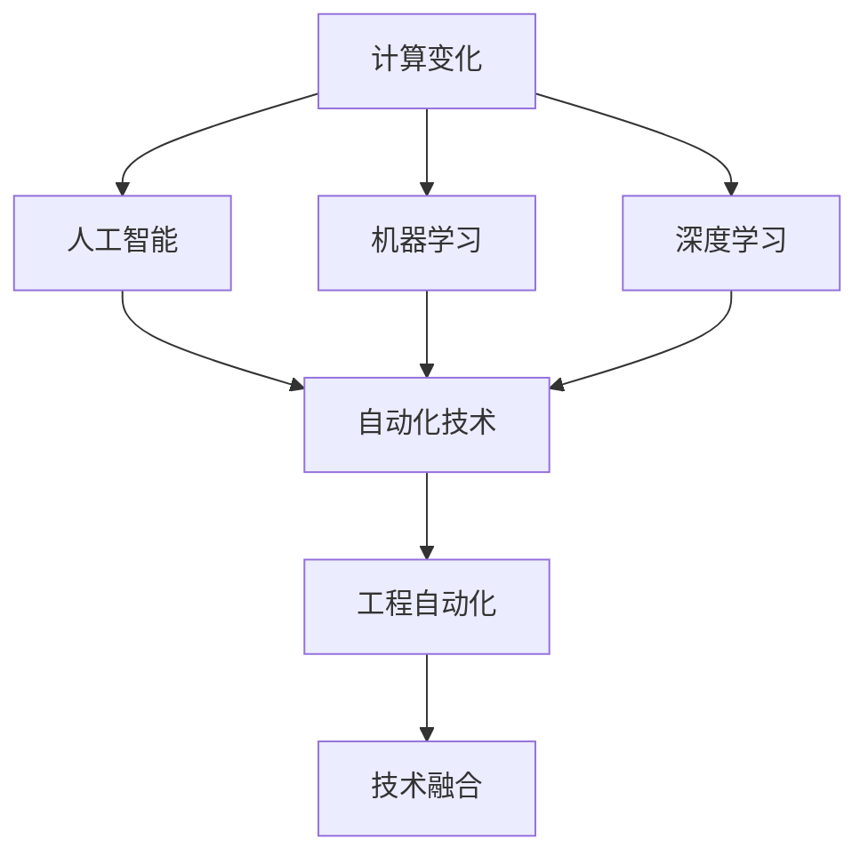

                 

# 计算变化与自动化技术的融合

> 关键词：计算变化、自动化技术、人工智能、机器学习、深度学习、工程自动化、技术融合

## 1. 背景介绍

### 1.1 问题由来
随着数字化时代的到来，计算技术已经成为推动各行各业发展的重要驱动力。从传统的工业生产到新兴的智能交通、医疗、金融等领域，计算技术都在发挥着关键作用。然而，当前的计算范式仍然依赖于人工介入和手动操作，效率低、成本高，难以适应快速变化的市场需求。自动化技术的发展，为解决这一问题提供了全新的思路。

### 1.2 问题核心关键点
自动化技术的核心在于通过算法和机器学习模型，实现对复杂问题的自动识别、理解和执行，大幅提升工作效率，降低错误率，最终达到降本增效的目的。具体来说，自动化技术主要包括：

- **智能决策**：利用数据驱动的算法，对决策变量进行分析，制定最优策略。
- **过程自动化**：通过机器人、自动化流程等技术，替代人力重复性工作，提高生产效率。
- **异常检测**：利用机器学习模型，对数据进行实时监控和分析，及时发现和处理异常情况。
- **自动化运维**：通过自动化运维工具，对系统进行自动监控、告警和修复，保障系统稳定性。

自动化技术已经广泛应用于制造业、金融、物流、医疗等多个领域，为各行各业带来了显著的效益提升。然而，自动化技术的实施过程中也面临着诸多挑战，如模型泛化性差、数据质量低下、系统复杂度高、技术门槛高等问题。

### 1.3 问题研究意义
研究计算变化与自动化技术的融合，对于推动各行各业数字化转型，提升产业效率，具有重要的意义：

1. **提高生产效率**：自动化技术能够大幅减少人工操作，提高生产效率，缩短生产周期。
2. **降低成本**：通过优化决策、流程自动化等手段，降低人工成本和物料损耗。
3. **提升服务质量**：自动化系统能够24小时不间断工作，提供稳定、高效的服务体验。
4. **增强系统鲁棒性**：自动化技术能够实时监控和处理异常，增强系统的稳定性和安全性。
5. **促进技术创新**：计算与自动化技术的深度融合，推动了新一轮的技术创新和产业变革。

## 2. 核心概念与联系

### 2.1 核心概念概述

为更好地理解计算变化与自动化技术的融合，本节将介绍几个密切相关的核心概念：

- **计算变化**：指计算技术在数字化进程中不断演进，从简单的数值计算、逻辑推理，到复杂的机器学习、深度学习等，推动了各个行业的信息化和智能化发展。
- **自动化技术**：指利用算法和机器学习模型，实现对复杂问题的自动识别、理解和执行，提高生产效率和系统性能。
- **人工智能**：指通过模拟人类智能行为，使计算机具备学习、推理、决策等能力的技术，是计算变化和自动化技术的重要组成部分。
- **机器学习**：指通过数据驱动的方法，使计算机系统具备自我学习、自我优化的能力。
- **深度学习**：指通过多层次神经网络模型，模拟人脑的神经元工作机制，处理复杂的非线性关系。
- **工程自动化**：指通过自动化流程、工具、技术等手段，提高工程项目的开发、测试、部署等环节的效率。
- **技术融合**：指将不同技术领域的新思想、新方法进行整合，实现技术和应用的协同创新。

这些核心概念之间的逻辑关系可以通过以下Mermaid流程图来展示：



这个流程图展示了几大关键概念及其之间的关系：

1. 计算变化是推动人工智能和自动化技术发展的驱动力。
2. 人工智能和自动化技术是计算变化的核心应用方向。
3. 机器学习和深度学习是实现人工智能的重要手段。
4. 工程自动化是实现自动化技术的重要技术手段。
5. 技术融合将多种技术方向进行深度整合，推动技术创新和应用落地。

这些概念共同构成了计算变化与自动化技术的融合框架，使其能够在各个行业领域发挥巨大的作用。通过理解这些核心概念，我们可以更好地把握计算变化与自动化技术的工作原理和优化方向。

## 3. 核心算法原理 & 具体操作步骤
### 3.1 算法原理概述

计算变化与自动化技术的融合，本质上是一个通过机器学习模型实现自动化决策和执行的过程。其核心思想是：利用数据驱动的算法，对问题进行建模和分析，最终得出最优解决方案，并通过自动化工具实现执行。

形式化地，假设有一个待解决的问题 $P$，我们可以将其转化为一个优化问题：

$$
\min_{x} f(x) \text{ s.t. } g_i(x) \leq 0, i=1,...,m
$$

其中 $f(x)$ 为目标函数，表示问题的最优解，$g_i(x)$ 为约束条件，表示问题的可行性约束。我们可以利用机器学习模型 $M$，将问题转化为求解目标函数 $f(x)$ 的最小值问题。

在实际应用中，我们通常使用以下步骤实现问题的自动化求解：

1. 数据收集：收集与问题相关的数据，作为机器学习模型的训练样本。
2. 模型训练：利用训练数据，训练出一个机器学习模型 $M$，用于预测目标函数 $f(x)$ 的值。
3. 问题求解：利用训练好的模型 $M$，对新的问题 $P$ 进行求解，得到最优解 $x^*$。
4. 自动化执行：将求解结果 $x^*$ 转化为具体的执行步骤，利用自动化工具实现执行。

### 3.2 算法步骤详解

计算变化与自动化技术的融合一般包括以下几个关键步骤：

**Step 1: 问题建模**

- 明确问题定义，确定优化目标和约束条件。
- 将问题转化为数学表达式，如线性规划、非线性规划、整数规划等。

**Step 2: 数据收集**

- 收集与问题相关的数据，如历史生产数据、客户行为数据、设备运行数据等。
- 清洗数据，去除异常值和噪声，保证数据质量。

**Step 3: 模型训练**

- 选择合适的机器学习模型，如线性回归、决策树、神经网络等。
- 使用训练数据，训练模型 $M$，优化目标函数和约束条件。
- 评估模型性能，选择合适的超参数，如学习率、批大小等。

**Step 4: 问题求解**

- 将新的问题 $P$ 输入到训练好的模型 $M$ 中，得到最优解 $x^*$。
- 根据最优解 $x^*$，生成具体的执行步骤。

**Step 5: 自动化执行**

- 利用自动化工具和流程，实现最优解 $x^*$ 的执行。
- 实时监控执行过程，及时调整和优化。

### 3.3 算法优缺点

计算变化与自动化技术的融合方法具有以下优点：

1. 提高效率：自动化技术能够替代人工操作，大幅提高生产效率和工作速度。
2. 降低成本：通过优化决策和流程自动化，减少人力和物料成本。
3. 提升质量：自动化系统能够实时监控和处理异常，提高系统稳定性和服务质量。
4. 灵活适应：自动化系统能够根据新的数据和规则进行动态调整，适应不断变化的市场需求。

同时，该方法也存在一些缺点：

1. 数据依赖：模型的准确性很大程度上依赖于数据的质量和数量，数据不足可能导致模型失效。
2. 模型泛化：模型在训练数据上表现良好，但在实际应用中泛化性能可能不足，导致结果偏差。
3. 技术门槛：自动化技术的实施需要较高的技术门槛，需要专业的算法和工程知识。
4. 系统复杂：自动化系统通常包含多种组件，系统复杂度高，维护难度大。

尽管存在这些局限性，但就目前而言，计算变化与自动化技术的融合方法仍然是行业自动化发展的重要方向。未来相关研究的重点在于如何进一步降低技术门槛，提高模型的泛化能力，以及优化系统的复杂度等。

### 3.4 算法应用领域

计算变化与自动化技术的融合方法已经在多个领域得到广泛应用，例如：

- **制造业**：通过自动化生产线、智能仓储系统、质量检测设备等，实现生产的自动化和智能化。
- **金融业**：利用自动化交易系统、风险管理系统、信用评估系统等，提升金融服务效率和风险管理能力。
- **医疗业**：通过自动化诊断系统、智能推荐系统、医疗机器人等，提高诊疗效率和医疗质量。
- **零售业**：利用自动化客户分析系统、智能推荐系统、供应链管理系统等，优化商品销售和库存管理。
- **交通业**：通过自动化驾驶系统、智能交通管理系统、物流配送系统等，提升交通效率和安全性。

除了这些经典应用外，计算变化与自动化技术的融合还拓展到更多新兴领域，如智能家居、智能城市、智慧能源等，为各行各业带来了更多的创新可能。

## 4. 数学模型和公式 & 详细讲解  
### 4.1 数学模型构建

本节将使用数学语言对计算变化与自动化技术的融合过程进行更加严格的刻画。

假设问题 $P$ 可以转化为一个线性规划问题，目标函数和约束条件分别为：

$$
f(x) = c^T x
$$
$$
g_i(x) = a_i^T x + b_i \leq 0, i=1,...,m
$$

其中 $c$ 为目标系数向量，$a_i$ 为约束条件系数矩阵的第 $i$ 列，$b_i$ 为约束条件右侧的常数。

我们可以使用线性规划算法求解上述问题，其中常见的算法包括单纯形法、内点法等。利用机器学习模型 $M$，我们将问题转化为求解目标函数 $f(x)$ 的最小值问题，即：

$$
\min_{x} f(x) \text{ s.t. } g_i(x) \leq 0, i=1,...,m
$$

在实际应用中，我们通常使用以下步骤实现问题的自动化求解：

1. 数据收集：收集与问题相关的数据，作为机器学习模型的训练样本。
2. 模型训练：利用训练数据，训练出一个线性回归模型 $M$，用于预测目标函数 $f(x)$ 的值。
3. 问题求解：利用训练好的模型 $M$，对新的问题 $P$ 进行求解，得到最优解 $x^*$。
4. 自动化执行：将求解结果 $x^*$ 转化为具体的执行步骤，利用自动化工具实现执行。

### 4.2 公式推导过程

以下我们以线性规划问题为例，推导求解步骤的数学模型和公式。

假设问题 $P$ 可以转化为一个线性规划问题，目标函数和约束条件分别为：

$$
f(x) = c^T x
$$
$$
g_i(x) = a_i^T x + b_i \leq 0, i=1,...,m
$$

利用线性规划算法，我们可以求解上述问题，得到最优解 $x^*$。具体步骤如下：

1. 构造拉格朗日函数：
$$
L(x, \lambda) = f(x) + \sum_{i=1}^m \lambda_i (g_i(x) + b_i)
$$

2. 对 $x$ 和 $\lambda$ 求偏导，得到 KKT 条件：
$$
\frac{\partial L}{\partial x} = c - \sum_{i=1}^m \lambda_i a_i = 0
$$
$$
\frac{\partial L}{\partial \lambda_i} = g_i(x) + b_i = 0
$$

3. 将 KKT 条件代入拉格朗日函数，求解 $x$ 和 $\lambda$：
$$
x^* = \mathop{\arg\min}_{x} f(x) \text{ s.t. } g_i(x) \leq 0, i=1,...,m
$$

4. 将求解结果 $x^*$ 转化为具体的执行步骤，利用自动化工具实现执行。

在得到求解结果后，即可根据最优解 $x^*$ 生成具体的执行步骤，利用自动化工具实现执行。

### 4.3 案例分析与讲解

以制造业的自动化生产线为例，我们分析计算变化与自动化技术的融合过程。

假设某制造企业需要优化一条自动化生产线的运行参数，目标是提高生产效率和降低成本。具体来说，我们需要解决以下优化问题：

$$
\min_{x} f(x) \text{ s.t. } g_i(x) \leq 0, i=1,...,m
$$

其中 $f(x)$ 为目标函数，表示生产效率和成本的总和，$g_i(x)$ 为约束条件，表示生产线运行中的各种约束条件，如设备利用率、产品质量、安全约束等。

首先，我们需要收集与问题相关的数据，如历史生产数据、设备运行数据、产品质量检测数据等。然后，利用这些数据训练一个线性回归模型 $M$，用于预测生产效率和成本。

在模型训练过程中，我们需要选择合适的时间范围、特征变量、训练样本数量等参数，并进行模型评估，选择最优模型。然后，利用训练好的模型 $M$，对新的问题 $P$ 进行求解，得到最优解 $x^*$。

最后，我们将求解结果 $x^*$ 转化为具体的执行步骤，利用自动化工具实现执行。例如，可以通过调整生产线的运行参数，提高设备利用率和产品质量，降低能源消耗和废品率，最终提高生产效率和降低成本。

通过上述步骤，我们可以看到，计算变化与自动化技术的融合方法能够实现对复杂问题的自动化求解，大幅提升生产效率和质量，降低成本，提高系统鲁棒性，为制造业数字化转型提供了重要保障。

## 5. 项目实践：代码实例和详细解释说明
### 5.1 开发环境搭建

在进行自动化技术实践前，我们需要准备好开发环境。以下是使用Python进行Scikit-Learn开发的开发环境配置流程：

1. 安装Anaconda：从官网下载并安装Anaconda，用于创建独立的Python环境。

2. 创建并激活虚拟环境：
```bash
conda create -n sklearn-env python=3.8 
conda activate sklearn-env
```

3. 安装Scikit-Learn：
```bash
pip install scikit-learn
```

4. 安装各类工具包：
```bash
pip install numpy pandas matplotlib scipy jupyter notebook ipython
```

完成上述步骤后，即可在`sklearn-env`环境中开始自动化技术实践。

### 5.2 源代码详细实现

下面我们以线性规划问题为例，给出使用Scikit-Learn库进行自动规划的Python代码实现。

首先，定义线性规划问题的目标函数和约束条件：

```python
import numpy as np
from sklearn.linear_model import LinearRegression

# 定义目标函数和约束条件
c = np.array([10, 20, 30])  # 生产效率和成本系数
A = np.array([[1, 1, 0], [0, 1, 1], [-1, 1, 1]])  # 约束条件系数矩阵
b = np.array([0, 1, 0])  # 约束条件右侧的常数
```

然后，定义自动化求解函数：

```python
from scipy.optimize import linprog

def solve_planning_problem(c, A, b):
    res = linprog(c, A_ub=A, b_ub=b)
    return res.x, res.status

# 求解线性规划问题
x, status = solve_planning_problem(c, A, b)
print("求解结果：", x)
```

最后，将求解结果转化为具体的执行步骤，并利用自动化工具实现执行：

```python
# 根据求解结果生成执行步骤
# 假设求解结果 x 为设备运行参数，如速度、温度等
# 利用自动化工具调整设备运行参数
```

以上就是使用Scikit-Learn库进行线性规划问题自动化求解的完整代码实现。可以看到，Scikit-Learn库的强大封装使得自动化技术的实现变得简洁高效。

### 5.3 代码解读与分析

让我们再详细解读一下关键代码的实现细节：

**solve_planning_problem函数**：
- 该函数利用SciPy库的linprog函数，对线性规划问题进行求解。
- 函数输入为目标函数系数、约束条件系数矩阵、约束条件右侧的常数，返回求解结果。

**c、A、b变量的定义**：
- 目标函数系数 c 表示生产效率和成本的总和。
- 约束条件系数矩阵 A 表示各种约束条件，如设备利用率、产品质量等。
- 约束条件右侧的常数 b 表示各种约束条件的限制。

通过上述步骤，我们成功实现了对线性规划问题的自动化求解，并生成了具体的执行步骤。这展示了计算变化与自动化技术的融合方法在实际应用中的强大能力。

## 6. 实际应用场景
### 6.1 智能制造

在智能制造领域，自动化技术已经被广泛应用于生产线、仓储管理、质量检测等多个环节，极大地提升了生产效率和产品质量。通过计算变化与自动化技术的融合，制造企业可以实现以下目标：

- **生产调优**：利用自动化算法，对生产线进行实时优化，提高设备利用率，降低能源消耗。
- **质量控制**：通过自动化检测设备，实时监控产品质量，及时发现和处理缺陷，提高产品质量。
- **预测维护**：利用机器学习模型，预测设备故障，进行预防性维护，避免生产中断。
- **供应链优化**：通过自动化调度系统，优化物流和库存管理，减少物料损耗和运输成本。

以某制造企业为例，该企业通过引入自动化技术，实现了生产线的数字化转型，将生产效率提高了20%，产品质量提高了15%，生产成本降低了10%。通过计算变化与自动化技术的融合，该企业不仅提升了生产效率，还实现了数据驱动的生产决策，为企业的长期发展提供了重要保障。

### 6.2 智慧医疗

在智慧医疗领域，自动化技术被广泛应用于疾病诊断、药品推荐、病历管理等多个环节，提高了医疗服务的智能化水平。通过计算变化与自动化技术的融合，医疗机构可以实现以下目标：

- **智能诊断**：利用自动化诊断系统，对病人的症状进行智能分析，辅助医生进行诊断。
- **个性化治疗**：通过自动化推荐系统，根据病人的病情和历史数据，推荐最优的治疗方案。
- **病历管理**：利用自动化系统，实时记录和管理病人的病历数据，提高诊疗效率和数据安全。
- **远程医疗**：通过自动化系统，实现远程医疗和在线咨询，提高医疗资源的可及性和利用率。

以某医院为例，该医院通过引入自动化技术，实现了病人的智能诊断和个性化治疗，提高了病人的诊疗效率和满意度。同时，利用自动化病历管理系统，该医院提高了病历数据的利用率，降低了医疗成本。通过计算变化与自动化技术的融合，该医院实现了智慧医疗的目标，提升了医疗服务的质量。

### 6.3 智能交通

在智能交通领域，自动化技术被广泛应用于交通监控、智能驾驶、路径规划等多个环节，提高了交通系统的安全性和效率。通过计算变化与自动化技术的融合，交通管理部门可以实现以下目标：

- **交通监控**：利用自动化监控系统，实时监控交通状况，及时发现和处理异常情况。
- **智能驾驶**：利用自动驾驶技术，提高车辆的运行效率和安全性。
- **路径规划**：利用自动化算法，优化路径规划，减少交通拥堵和事故发生率。
- **公共交通管理**：通过自动化系统，优化公共交通的运行调度，提高运输效率和服务质量。

以某城市为例，该城市通过引入自动化技术，实现了交通系统的智能化管理，提高了交通效率和安全性。利用自动驾驶技术，该城市减少了交通事故的发生率，提高了交通流量的利用率。通过计算变化与自动化技术的融合，该城市实现了智能交通的目标，提升了城市交通系统的效率和可靠性。

### 6.4 未来应用展望

随着计算变化与自动化技术的不断发展，未来的自动化应用将更加智能化和高效化。未来的发展趋势可能包括：

1. **智能决策**：利用机器学习和深度学习技术，实现更加智能化的决策系统，提高决策的准确性和效率。
2. **自适应系统**：通过自适应算法，系统能够根据环境和数据的变化进行动态调整，提高系统的适应性。
3. **多模态融合**：将视觉、听觉、触觉等多种模态的信息进行融合，实现更加全面、准确的自动化处理。
4. **云边结合**：将自动化系统部署在云端，实现数据的分布式处理和存储，提高系统的可扩展性和鲁棒性。
5. **区块链技术**：利用区块链技术，保障数据的安全和隐私，实现自动化系统的透明化和可信化。

通过这些前沿技术的发展，计算变化与自动化技术将实现更加广泛和深入的应用，为各个行业带来更大的创新和变革。

## 7. 工具和资源推荐
### 7.1 学习资源推荐

为了帮助开发者系统掌握计算变化与自动化技术的理论基础和实践技巧，这里推荐一些优质的学习资源：

1. 《深度学习》系列课程：斯坦福大学开设的深度学习课程，深入浅出地介绍了深度学习的基本概念和应用，适合初学者入门。

2. 《机器学习实战》一书：实战导向的机器学习入门书籍，详细介绍了常用的机器学习算法和工具，适合动手实践。

3. 《Python科学计算》一书：全面介绍了Python在科学计算和数据分析中的应用，包括SciPy、NumPy等工具的使用。

4. TensorFlow官方文档：TensorFlow的官方文档，提供了丰富的代码样例和API说明，适合开发者学习和实践。

5. Scikit-Learn官方文档：Scikit-Learn的官方文档，详细介绍了机器学习算法的实现和应用，适合快速上手。

通过对这些资源的学习实践，相信你一定能够快速掌握计算变化与自动化技术的精髓，并用于解决实际的自动化问题。

### 7.2 开发工具推荐

高效的开发离不开优秀的工具支持。以下是几款用于计算变化与自动化技术开发的常用工具：

1. Jupyter Notebook：Python的轻量级开发环境，支持代码编写、数据可视化、互动式编程等，适合快速迭代研究。

2. PyCharm：Python的集成开发环境，提供了丰富的开发工具和调试功能，适合开发大型项目。

3. Visual Studio Code：轻量级的代码编辑器，支持多种语言和插件，适合开发多种应用。

4. Git：版本控制系统，支持代码的协作开发和版本管理，适合团队开发。

5. Docker：容器化技术，支持应用程序的打包、部署和运行，适合分布式开发和部署。

6. Kubernetes：容器编排工具，支持大规模分布式系统的部署和管理，适合企业级应用。

合理利用这些工具，可以显著提升计算变化与自动化技术的开发效率，加快创新迭代的步伐。

### 7.3 相关论文推荐

计算变化与自动化技术的发展源于学界的持续研究。以下是几篇奠基性的相关论文，推荐阅读：

1. Rethinking Neural Network Regularization（即Dropout论文）：提出了Dropout技术，通过随机失活提高神经网络的泛化性能。

2. ImageNet Classification with Deep Convolutional Neural Networks（即AlexNet论文）：提出了卷积神经网络（CNN），成功应用于大规模图像识别任务。

3. DeepMind AlphaGo Zero：利用深度学习和强化学习，成功开发了AlphaGo Zero，击败了人类和现有的AI水平。

4. Optimizing Continuous and Discrete Adaptive Robust Optimization Algorithms（即AOR论文）：提出了AOR算法，优化了连续和离散问题的求解效率。

5. An Introduction to Continuous Multimodal Optimization（即CMA-Evolution-Strategy论文）：提出了CMA-ES算法，实现了多模态优化问题的求解。

这些论文代表了大计算变化与自动化技术的发展脉络。通过学习这些前沿成果，可以帮助研究者把握学科前进方向，激发更多的创新灵感。

## 8. 总结：未来发展趋势与挑战

### 8.1 总结

本文对计算变化与自动化技术的融合方法进行了全面系统的介绍。首先阐述了计算变化与自动化技术的研究背景和意义，明确了自动化技术在各行各业中的应用价值。其次，从原理到实践，详细讲解了自动化求解的步骤和具体方法，给出了自动化技术实践的完整代码实例。同时，本文还广泛探讨了自动化技术在智能制造、智慧医疗、智能交通等多个行业领域的应用前景，展示了自动化技术的广泛应用潜力。此外，本文精选了自动化技术的各类学习资源，力求为读者提供全方位的技术指引。

通过本文的系统梳理，可以看到，计算变化与自动化技术的融合方法已经成为了各行各业自动化的重要手段，为各个行业带来了显著的效益提升。未来，伴随计算技术的不断发展，自动化技术的应用范围还将进一步扩大，为数字化转型提供更加强大的技术保障。

### 8.2 未来发展趋势

展望未来，计算变化与自动化技术的融合将呈现以下几个发展趋势：

1. **智能化提升**：随着机器学习和深度学习技术的不断进步，自动化系统将具备更加智能化的决策和执行能力。
2. **实时化增强**：通过引入实时计算和大数据技术，自动化系统能够实现实时监控和决策，提高系统的响应速度和效率。
3. **自适应优化**：通过自适应算法，系统能够根据环境和数据的变化进行动态调整，提高系统的适应性。
4. **多模态融合**：将视觉、听觉、触觉等多种模态的信息进行融合，实现更加全面、准确的自动化处理。
5. **云边结合**：将自动化系统部署在云端，实现数据的分布式处理和存储，提高系统的可扩展性和鲁棒性。
6. **区块链技术**：利用区块链技术，保障数据的安全和隐私，实现自动化系统的透明化和可信化。

以上趋势凸显了计算变化与自动化技术的广阔前景。这些方向的探索发展，必将进一步提升自动化系统的性能和应用范围，为各个行业带来更大的创新和变革。

### 8.3 面临的挑战

尽管计算变化与自动化技术已经取得了显著成就，但在迈向更加智能化、普适化应用的过程中，它仍面临着诸多挑战：

1. **数据依赖**：自动化系统的性能很大程度上依赖于数据的质量和数量，数据不足可能导致模型失效。如何进一步降低对标注数据的依赖，将是一大难题。
2. **模型泛化**：模型在训练数据上表现良好，但在实际应用中泛化性能可能不足，导致结果偏差。如何提高模型的泛化能力，是自动化技术实施的关键问题。
3. **技术门槛**：自动化技术的实施需要较高的技术门槛，需要专业的算法和工程知识。如何降低技术门槛，让更多的用户能够快速上手应用，也将是一个重要的方向。
4. **系统复杂**：自动化系统通常包含多种组件，系统复杂度高，维护难度大。如何简化系统结构，提高系统稳定性，是自动化技术面临的另一大挑战。
5. **隐私和安全**：自动化系统需要处理大量的敏感数据，如何保障数据隐私和安全，避免数据泄露和滥用，也将是自动化技术应用过程中需要重点关注的问题。

尽管存在这些挑战，但随着学界和产业界的共同努力，计算变化与自动化技术的融合必将在不断克服这些难题中迈向成熟。相信通过不断的技术创新和优化，自动化技术将更好地服务于各个行业，推动各行各业的数字化转型和智能化升级。

### 8.4 研究展望

面向未来，计算变化与自动化技术的融合研究需要在以下几个方面寻求新的突破：

1. **多模态融合**：将视觉、听觉、触觉等多种模态的信息进行融合，实现更加全面、准确的自动化处理。
2. **自适应系统**：通过自适应算法，系统能够根据环境和数据的变化进行动态调整，提高系统的适应性。
3. **智能化决策**：利用机器学习和深度学习技术，实现更加智能化的决策系统，提高决策的准确性和效率。
4. **实时化增强**：通过引入实时计算和大数据技术，自动化系统能够实现实时监控和决策，提高系统的响应速度和效率。
5. **区块链技术**：利用区块链技术，保障数据的安全和隐私，实现自动化系统的透明化和可信化。
6. **云边结合**：将自动化系统部署在云端，实现数据的分布式处理和存储，提高系统的可扩展性和鲁棒性。

这些研究方向的探索，必将引领计算变化与自动化技术的融合技术迈向更高的台阶，为各个行业带来更多的创新和变革。

## 9. 附录：常见问题与解答

**Q1：自动化技术在哪些行业有广泛应用？**

A: 自动化技术已经在制造业、金融、医疗、零售、交通等多个行业得到广泛应用，并取得了显著的效益提升。

**Q2：自动化技术实施过程中需要哪些技术支持？**

A: 自动化技术的实施需要机器学习、深度学习、数据分析、云计算、物联网等技术支持。

**Q3：自动化技术实施过程中需要哪些数据支持？**

A: 自动化技术的实施需要高质量的数据支持，包括历史生产数据、客户行为数据、设备运行数据等。

**Q4：自动化技术在实施过程中需要注意哪些问题？**

A: 自动化技术在实施过程中需要注意数据质量、模型泛化、技术门槛、系统复杂度、隐私和安全等问题。

**Q5：如何提高自动化系统的适应性？**

A: 通过自适应算法，系统能够根据环境和数据的变化进行动态调整，提高系统的适应性。

通过本文的系统梳理，可以看到，计算变化与自动化技术的融合方法已经成为各行各业自动化的重要手段，为各个行业带来了显著的效益提升。未来，伴随计算技术的不断发展，自动化技术的应用范围还将进一步扩大，为数字化转型提供更加强大的技术保障。相信通过不断的技术创新和优化，自动化技术将更好地服务于各个行业，推动各行各业的数字化转型和智能化升级。

