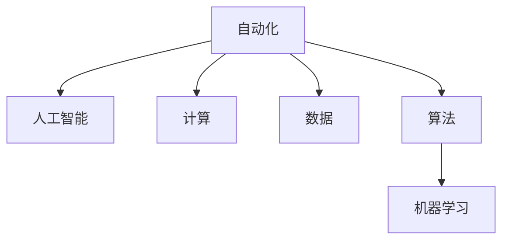

                 

# 计算变化带来的自动化机遇

在快速发展的信息技术浪潮中，自动化技术逐渐深入各行各业，从制造业到金融业，从医疗到教育，计算技术正在不断改变人们的工作和生活方式。自动化技术以其高效、可靠、低成本等优势，在提升生产效率、改善用户体验、降低运营成本等方面展现出巨大的潜力。本文将深入探讨计算变化带来的自动化机遇，分析其在不同领域的实际应用，并对未来的发展趋势进行展望。

## 1. 背景介绍

### 1.1 自动化技术的发展历程
自动化技术的发展可以追溯到19世纪的工业革命，当时蒸汽机的发明极大地提升了生产效率。随着科技的进步，自动化技术不断演进，从早期的机械自动化到电子自动化，再到如今的智能自动化。

在20世纪中叶，计算机的问世标志着自动化技术进入了一个新的阶段。早期的计算机主要是用于科学计算和数据处理，而随着算力提升和软件算法的发展，计算机在各个领域的应用逐渐扩展，自动化技术也逐渐深入各行各业。

### 1.2 计算技术的进步对自动化带来的影响
随着计算技术的不断进步，自动化技术在效率、精度、灵活性等方面得到了显著提升。现代计算机以极高的计算速度、庞大的存储空间和先进的算法，使自动化系统能够处理更复杂、更精细的任务，极大地扩展了自动化的应用范围和深度。

具体而言，计算技术进步对自动化带来的影响主要体现在以下几个方面：

- **计算速度的提升**：计算速度的提升使得自动化系统能够实时处理大量数据，提高了系统的响应速度和处理效率。
- **存储容量的增加**：存储容量的增加使得自动化系统能够存储和处理更多的数据，为更复杂的数据分析和处理提供了可能。
- **算法的多样化**：算法的不断发展，特别是机器学习、深度学习等技术的兴起，使得自动化系统能够进行更高级的数据分析和决策。

## 2. 核心概念与联系

### 2.1 核心概念概述

为了更好地理解计算变化带来的自动化机遇，本节将介绍几个密切相关的核心概念：

- **自动化（Automation）**：指利用计算机和软件系统自动执行重复性、可程序化的任务，以提高工作效率、降低运营成本和提升用户体验。
- **人工智能（AI）**：通过模拟人类智能，使计算机具备识别、理解、学习、推理、预测等能力，从而实现更加复杂、智能的自动化应用。
- **计算（Computation）**：指利用计算机进行数据的处理和计算，是自动化和人工智能的基础。
- **数据（Data）**：自动化和人工智能系统的核心资源，通过数据收集、存储、分析和应用，实现对现实世界的理解和预测。
- **算法（Algorithm）**：计算机执行任务时遵循的规则和流程，是自动化和人工智能系统的核心组成部分。
- **机器学习（Machine Learning）**：一种通过数据驱动的算法，使计算机能够自动学习规律和模式，实现自主决策和优化。

这些核心概念之间的逻辑关系可以通过以下Mermaid流程图来展示：



这个流程图展示了几大核心概念之间的关系：

1. 自动化以计算和算法为基础，通过处理数据实现任务自动化。
2. 人工智能是自动化的高级形态，通过学习数据和算法，实现更加智能的自动化应用。
3. 数据是自动化和人工智能系统的核心资源，其质量和数量直接影响系统的性能。
4. 算法是自动化和人工智能系统的关键组成部分，决定了系统的功能和效果。

## 3. 核心算法原理 & 具体操作步骤

### 3.1 算法原理概述

基于计算变化的自动化机遇，主要依赖于人工智能技术中的算法原理。这些算法通过处理数据，识别模式，预测未来，从而实现自动化的目标。

自动化技术常用的算法包括但不限于：

- **机器学习算法**：如决策树、随机森林、支持向量机、神经网络等，用于数据分析和模式识别。
- **自然语言处理算法**：如分词、命名实体识别、情感分析等，用于处理文本数据。
- **计算机视觉算法**：如图像识别、物体检测、视频分析等，用于处理视觉数据。
- **优化算法**：如遗传算法、粒子群算法、模拟退火等，用于求解复杂问题。

这些算法通过不断迭代优化，实现了自动化任务的自动化。算法的有效性取决于数据的质量和数量，以及算法的复杂度和可解释性。

### 3.2 算法步骤详解

自动化技术的实现通常包括以下几个关键步骤：

**Step 1: 数据收集与预处理**
- 收集相关的数据，包括原始数据、中间数据和最终数据。
- 对数据进行清洗、筛选、标注等预处理，确保数据的质量和一致性。

**Step 2: 模型训练与优化**
- 选择合适的算法和模型，对数据进行训练。
- 使用交叉验证等方法进行模型评估和调优，提高模型的泛化能力。

**Step 3: 模型部署与监控**
- 将训练好的模型部署到生产环境中，实现自动化应用。
- 持续监控模型的运行状态和性能，及时发现和修复问题。

**Step 4: 反馈与迭代**
- 收集用户的反馈，评估自动化应用的效果。
- 根据反馈对模型进行迭代优化，提升自动化系统的性能。

### 3.3 算法优缺点

基于计算变化的自动化技术具有以下优点：

- **高效性**：自动化技术能够高效处理大量数据，提高工作效率。
- **可靠性**：自动化系统基于算法和模型，决策过程具有高度的可靠性和稳定性。
- **灵活性**：算法和模型可以根据任务需求进行调整和优化，适应不同的应用场景。
- **低成本**：自动化技术减少了人力和物力的投入，降低了运营成本。

然而，自动化技术也存在一些缺点：

- **数据依赖**：算法的有效性依赖于高质量的数据，数据质量和数量的不足可能导致模型性能下降。
- **复杂性**：高级自动化系统的开发和维护需要较高的技术门槛，对于缺乏技术背景的用户可能存在一定的门槛。
- **可解释性不足**：部分高级算法和模型缺乏足够的可解释性，用户难以理解其决策过程。
- **依赖性强**：自动化系统的正常运行依赖于稳定的计算资源和基础设施，一旦系统故障，可能导致自动化任务的中断。

### 3.4 算法应用领域

基于计算变化的自动化技术在多个领域得到了广泛应用，以下是一些典型应用场景：

- **制造业自动化**：如工业机器人、自动化生产线、智能仓储等，通过自动化技术提高生产效率和产品质量。
- **金融自动化**：如智能客服、交易自动化、风险管理等，通过自动化技术提升金融服务效率和风险控制能力。
- **医疗自动化**：如智能诊断、手术辅助、医疗记录管理等，通过自动化技术改善医疗服务质量和效率。
- **物流自动化**：如无人机配送、智能分拣、车辆调度等，通过自动化技术优化物流流程和提高配送效率。
- **教育自动化**：如智能教育平台、自动批改作业、个性化推荐等，通过自动化技术提升教育质量和教学效果。

这些应用场景展示了计算变化带来的自动化机遇的广泛性和重要性，为各行各业提供了转型升级的新方向。

## 4. 数学模型和公式 & 详细讲解

### 4.1 数学模型构建

为了更好地理解计算变化带来的自动化机遇，本节将使用数学语言对自动化系统的设计和实现进行更加严格的刻画。

假设有一个简单的自动化任务，目标是判断一张图片是否包含动物。自动化的数学模型可以表示为：

$$
y = f(x, \theta)
$$

其中 $x$ 为输入的数据（如图片），$\theta$ 为模型参数，$y$ 为模型的输出（如判断结果）。

### 4.2 公式推导过程

我们以图像识别任务为例，推导卷积神经网络（CNN）的数学模型和损失函数。

假设输入图片 $x$ 的尺寸为 $H \times W \times C$，其中 $H$ 和 $W$ 为图片的高度和宽度，$C$ 为通道数。CNN 模型由多个卷积层、池化层和全连接层组成，可以表示为：

$$
x' = f_{conv}(x, \theta_{conv})
$$
$$
x'' = f_{pool}(x', \theta_{pool})
$$
$$
y = f_{fc}(x'', \theta_{fc})
$$

其中 $f_{conv}$、$f_{pool}$ 和 $f_{fc}$ 分别表示卷积、池化和全连接层的操作，$\theta_{conv}$、$\theta_{pool}$ 和 $\theta_{fc}$ 为各层的权重和偏置。

模型的输出 $y$ 与真实标签 $y_{true}$ 的损失函数可以表示为交叉熵损失：

$$
\mathcal{L}(y, y_{true}) = -\sum_{i=1}^C y_i \log y_{true_i}
$$

在训练过程中，模型的目标是最小化损失函数：

$$
\theta^* = \mathop{\arg\min}_{\theta} \mathcal{L}(y, y_{true})
$$

通过反向传播算法，可以计算损失函数对模型参数的梯度，从而更新模型参数 $\theta$，最小化损失函数。

### 4.3 案例分析与讲解

以图像识别为例，CNN 模型能够通过卷积层和池化层提取图片的特征，全连接层将这些特征转化为分类结果。通过大量标注数据的训练，CNN 模型能够学习到图片与分类之间的映射关系，实现高效的图像识别。

在实际应用中，CNN 模型可以通过迁移学习的方式，利用在大规模数据上预训练的模型参数，提升在小数据集上的识别能力。同时，通过微调算法，针对特定任务的数据集进行参数优化，进一步提高模型的性能。

## 5. 项目实践：代码实例和详细解释说明

### 5.1 开发环境搭建

在进行自动化系统开发前，我们需要准备好开发环境。以下是使用Python进行TensorFlow开发的环境配置流程：

1. 安装Anaconda：从官网下载并安装Anaconda，用于创建独立的Python环境。

2. 创建并激活虚拟环境：
```bash
conda create -n tf-env python=3.8 
conda activate tf-env
```

3. 安装TensorFlow：根据CUDA版本，从官网获取对应的安装命令。例如：
```bash
conda install tensorflow=2.4 -c tf -c conda-forge
```

4. 安装各类工具包：
```bash
pip install numpy pandas scikit-learn matplotlib tqdm jupyter notebook ipython
```

完成上述步骤后，即可在`tf-env`环境中开始自动化系统开发。

### 5.2 源代码详细实现

下面我们以图像识别任务为例，给出使用TensorFlow对CNN模型进行开发的PyTorch代码实现。

首先，定义图像识别任务的数据处理函数：

```python
from tensorflow.keras.preprocessing.image import ImageDataGenerator

def preprocess_image(x):
    x = x / 255.0  # 归一化处理
    x = tf.expand_dims(x, axis=0)
    return x
```

然后，定义CNN模型和损失函数：

```python
from tensorflow.keras.models import Sequential
from tensorflow.keras.layers import Conv2D, MaxPooling2D, Flatten, Dense
from tensorflow.keras.losses import SparseCategoricalCrossentropy

model = Sequential([
    Conv2D(32, (3, 3), activation='relu', input_shape=(224, 224, 3)),
    MaxPooling2D((2, 2)),
    Conv2D(64, (3, 3), activation='relu'),
    MaxPooling2D((2, 2)),
    Conv2D(128, (3, 3), activation='relu'),
    MaxPooling2D((2, 2)),
    Flatten(),
    Dense(128, activation='relu'),
    Dense(2, activation='softmax')
])

loss = SparseCategoricalCrossentropy()
```

接着，定义训练和评估函数：

```python
from tensorflow.keras.optimizers import Adam

def train(model, train_dataset, epochs, batch_size):
    model.compile(optimizer=Adam(learning_rate=0.001), loss=loss)
    model.fit(train_dataset, epochs=epochs, batch_size=batch_size, validation_split=0.2)
```

最后，启动训练流程并在测试集上评估：

```python
epochs = 10
batch_size = 32

train_dataset = ImageDataGenerator().flow_from_directory('train', target_size=(224, 224), batch_size=batch_size, class_mode='categorical')
test_dataset = ImageDataGenerator().flow_from_directory('test', target_size=(224, 224), batch_size=batch_size, class_mode='categorical')

train(model, train_dataset, epochs, batch_size)
test_loss = model.evaluate(test_dataset)
print(f'Test loss: {test_loss:.4f}')
```

以上就是使用TensorFlow对CNN模型进行图像识别任务开发的完整代码实现。可以看到，TensorFlow提供了丰富的API和工具，使得模型的设计和训练过程变得简单易行。

### 5.3 代码解读与分析

让我们再详细解读一下关键代码的实现细节：

**preprocess_image函数**：
- 对输入的图像进行归一化处理，并转换为4D张量，以便与CNN模型兼容。

**model定义**：
- 定义了一个简单的CNN模型，包含多个卷积层和全连接层。
- 使用ReLU作为激活函数，提升模型的非线性能力。
- 使用softmax作为输出层的激活函数，实现多分类预测。

**train函数**：
- 使用Adam优化器进行模型训练。
- 使用交叉熵损失函数，衡量模型预测与真实标签之间的差异。
- 通过ImageDataGenerator，批量处理图像数据，自动进行数据增强和数据扩充。

**测试和评估**：
- 使用evaluate函数在测试集上评估模型性能。
- 输出模型在测试集上的损失值，用于衡量模型的泛化能力。

可以看出，TensorFlow提供了一站式的深度学习框架，可以轻松实现各种自动化任务。开发者可以将更多精力放在数据处理和模型优化上，而不必过多关注底层实现细节。

## 6. 实际应用场景

### 6.1 智能制造

智能制造是制造业自动化的重要方向，通过自动化技术提高生产效率和产品质量。以下是一个智能制造系统的实际应用案例：

- **生产调度**：利用自动化系统实时监控生产线的运行状态，自动调度生产任务，提高生产效率。
- **质量控制**：通过传感器和机器视觉系统，自动检测产品缺陷，进行质量控制和返修。
- **设备维护**：自动化系统可以实时监测设备的运行状态，预测设备故障，及时进行维护，避免生产中断。

### 6.2 金融风险管理

金融行业的自动化主要集中在风险管理和交易自动化。以下是一个金融风险管理系统的实际应用案例：

- **风险评估**：利用机器学习算法，对客户的信用记录和行为数据进行分析，评估其信用风险。
- **交易自动化**：通过自动化系统自动执行交易指令，提高交易效率和精准度。
- **异常检测**：自动化系统可以实时监测市场波动，自动预警风险事件，帮助决策者及时应对。

### 6.3 智能医疗

智能医疗是医疗自动化的重要方向，通过自动化技术提高医疗服务的效率和质量。以下是一个智能医疗系统的实际应用案例：

- **病历分析**：利用自然语言处理算法，自动分析患者的病历记录，辅助医生进行诊断。
- **药物推荐**：通过机器学习算法，根据患者的症状和历史用药记录，推荐合适的药物。
- **手术辅助**：利用计算机视觉算法，辅助医生进行手术操作，提高手术的精准度和安全性。

### 6.4 未来应用展望

随着计算技术的不断进步，自动化技术将在更多领域得到应用，为传统行业带来变革性影响。

在智慧城市治理中，自动化技术可以应用于城市事件监测、舆情分析、应急指挥等环节，提高城市管理的自动化和智能化水平，构建更安全、高效的未来城市。

在智能交通领域，自动化技术可以应用于交通流量控制、智能导航、自动驾驶等方向，提升交通系统的效率和安全性。

在智能家居领域，自动化技术可以应用于智能安防、智能家电、智能健康等方向，提升家庭生活的便捷性和舒适度。

## 7. 工具和资源推荐

### 7.1 学习资源推荐

为了帮助开发者系统掌握自动化技术的理论基础和实践技巧，这里推荐一些优质的学习资源：

1. 《Deep Learning》书籍：Ian Goodfellow等人著，全面介绍了深度学习的基本概念和算法原理。
2. 《Artificial Intelligence: A Modern Approach》书籍：Stuart Russell和Peter Norvig著，介绍了人工智能的历史和现状。
3. 《Hands-On Machine Learning with Scikit-Learn, Keras, and TensorFlow》书籍：Aurélien Géron著，介绍了机器学习算法和TensorFlow框架的使用。
4. CS229《机器学习》课程：斯坦福大学开设的机器学习课程，提供了丰富的教学资源和作业练习。
5. DeepLearning.AI的深度学习课程：由Andrew Ng等人主讲，涵盖深度学习的基本概念和应用实践。

通过对这些资源的学习实践，相信你一定能够快速掌握自动化技术的精髓，并用于解决实际的自动化问题。

### 7.2 开发工具推荐

高效的开发离不开优秀的工具支持。以下是几款用于自动化技术开发的常用工具：

1. TensorFlow：由Google主导开发的深度学习框架，支持分布式计算和GPU加速，广泛应用于各种自动化任务。
2. PyTorch：由Facebook开发的深度学习框架，灵活性高，支持动态计算图，广泛应用于研究和生产环境。
3. Keras：基于TensorFlow和Theano开发的高级神经网络API，易于使用，适合快速原型开发。
4. OpenCV：开源计算机视觉库，提供了丰富的图像处理和计算机视觉算法，广泛应用于自动化系统开发。
5. ROS：机器人操作系统，支持多种传感器和硬件设备的集成，适合自动化系统开发和机器人应用。

合理利用这些工具，可以显著提升自动化技术开发的效率，加快创新迭代的步伐。

### 7.3 相关论文推荐

自动化技术的发展源于学界的持续研究。以下是几篇奠基性的相关论文，推荐阅读：

1. Deep Blue: A Computer Created to Win the Game of Chess（深度蓝棋的诞生）：IBM开发的国际象棋程序，展示了人工智能在特定领域的成功应用。
2. AlphaGo: Mastering the Game of Go without Human Knowledge（AlphaGo：无知识掌握围棋的挑战）：DeepMind开发的围棋程序，展示了人工智能在复杂决策问题上的突破。
3. Rethinking the Inception Architecture for Computer Vision（重新思考卷积神经网络架构）：Google提出的一种改进卷积神经网络的架构，提高了图像识别的精度和效率。
4. Generative Adversarial Nets（生成对抗网络）：Ian Goodfellow等人提出的生成对抗网络，解决了生成模型训练中的不稳定问题，提高了生成模型的质量。
5. Deep Reinforcement Learning for Resource Allocation in Cloud Data Centers（基于深度强化学习的云数据中心资源分配）：NVIDIA提出的基于深度强化学习的云资源分配算法，优化了云数据中心的资源使用。

这些论文代表了大数据驱动的自动化技术的发展脉络。通过学习这些前沿成果，可以帮助研究者把握学科前进方向，激发更多的创新灵感。

## 8. 总结：未来发展趋势与挑战

### 8.1 总结

本文对计算变化带来的自动化机遇进行了全面系统的介绍。首先阐述了自动化技术的发展历程和计算技术进步对自动化带来的影响，明确了自动化技术在提升效率、降低成本和提升用户体验方面的独特价值。其次，从原理到实践，详细讲解了自动化技术的算法原理和操作步骤，给出了自动化任务开发的完整代码实例。同时，本文还广泛探讨了自动化技术在智能制造、金融风险管理、智能医疗等多个领域的应用前景，展示了自动化技术的发展潜力。

通过本文的系统梳理，可以看到，计算技术的发展为自动化技术提供了强大的推动力，使得自动化技术的应用范围和深度不断扩展。自动化技术将在更多领域发挥其价值，为各行各业带来转型升级的新机遇。

### 8.2 未来发展趋势

展望未来，自动化技术将呈现以下几个发展趋势：

1. **智能化**：随着人工智能技术的进步，自动化系统将具备更高的智能水平，能够进行更复杂、自主的决策。
2. **集成化**：自动化系统将与其他系统和服务集成，形成更加复杂、协同的工作流程，提高整体效率。
3. **自适应**：自动化系统将具备更强的自适应能力，能够根据环境变化自动调整策略和参数，提升系统的鲁棒性和灵活性。
4. **个性化**：自动化系统将能够根据用户需求和偏好提供个性化的服务，提升用户体验。
5. **边缘化**：随着物联网和边缘计算技术的发展，自动化系统将更多地部署在本地设备和环境中，减少对集中式计算的依赖。

这些趋势展示了自动化技术的发展方向和未来应用前景，为各行各业带来了新的机遇和挑战。

### 8.3 面临的挑战

尽管自动化技术已经取得了显著成就，但在迈向更加智能化、普适化应用的过程中，它仍面临着诸多挑战：

1. **数据质量**：自动化系统的性能高度依赖于数据的质量和数量，低质量的数据可能导致模型性能下降。
2. **算力需求**：高级自动化系统的运行需要强大的计算资源，算力的提升需要大量的硬件投入。
3. **算法复杂性**：高级算法和模型的设计和实现需要较高的技术门槛，对开发者提出了更高的要求。
4. **安全性**：自动化系统面临恶意攻击和数据泄露的风险，需要加强安全防护措施。
5. **法律和伦理问题**：自动化系统的决策过程可能涉及法律和伦理问题，需要制定相应的规范和标准。

### 8.4 研究展望

面对自动化技术面临的挑战，未来的研究需要在以下几个方面寻求新的突破：

1. **数据增强技术**：通过数据增强技术提高数据质量和数量，提升自动化系统的性能。
2. **分布式计算**：通过分布式计算技术提升自动化系统的算力，支持更大规模、更复杂的应用。
3. **自动化系统集成**：通过自动化系统集成技术，实现不同系统和服务之间的协同工作。
4. **可解释性研究**：通过可解释性研究，提高自动化系统的透明性和可解释性，增强用户信任。
5. **自适应学习算法**：通过自适应学习算法，提高自动化系统的自适应能力和鲁棒性。

这些研究方向的探索，必将引领自动化技术迈向更高的台阶，为构建安全、可靠、可解释、可控的智能系统铺平道路。面向未来，自动化技术还需要与其他人工智能技术进行更深入的融合，如知识表示、因果推理、强化学习等，多路径协同发力，共同推动自动化技术的发展。

## 9. 附录：常见问题与解答

**Q1：自动化技术是否适用于所有行业？**

A: 自动化技术在绝大多数行业中都有广泛的应用前景。然而，一些高度依赖人工直觉和创造力的行业，如艺术、娱乐等，可能难以完全自动化。

**Q2：自动化技术的开发和维护是否需要高技术门槛？**

A: 高级自动化技术的开发和维护确实需要较高的技术门槛，但通过学习和实践，可以在较短时间内掌握相关技能。同时，许多自动化平台和工具已经降低了技术门槛，使得非专业人士也能进行开发和部署。

**Q3：自动化技术是否会取代人力？**

A: 自动化技术将提高生产效率，减少人力投入，但不会完全取代人力。许多工作仍需要人类的判断、创造力和人际交往能力，自动化技术将更多地成为人类工作的辅助工具。

**Q4：自动化技术在应用中是否面临道德和法律问题？**

A: 自动化技术的应用确实可能面临道德和法律问题，如自动化决策的透明性、责任归属等。需要制定相应的规范和标准，确保自动化技术的应用符合伦理和法律要求。

通过本文的系统梳理，可以看到，计算技术的发展为自动化技术提供了强大的推动力，使得自动化技术的应用范围和深度不断扩展。自动化技术将在更多领域发挥其价值，为各行各业带来转型升级的新机遇。面向未来，自动化技术还需要与其他人工智能技术进行更深入的融合，共同推动自动化技术的发展。只有勇于创新、敢于突破，才能不断拓展自动化技术的边界，让智能技术更好地造福人类社会。

---

作者：禅与计算机程序设计艺术 / Zen and the Art of Computer Programming

