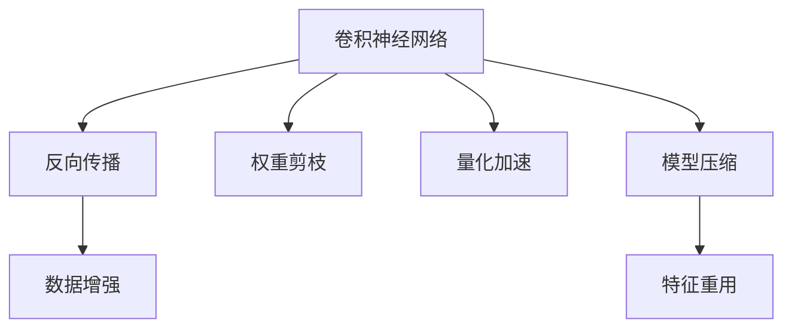

                 

# 计算机视觉原理与代码实战案例讲解

> 关键词：计算机视觉,卷积神经网络,图像分类,目标检测,图像分割

## 1. 背景介绍

### 1.1 问题由来
随着计算机视觉技术的发展，其在自动驾驶、智能监控、医疗影像分析等诸多领域展现了巨大的潜力。然而，计算机视觉技术的核心算法--卷积神经网络（Convolutional Neural Networks, CNNs）也面临着计算量庞大、参数量繁多等问题。如何高效地实现这些算法，成为近年来计算机视觉研究的重要方向。

### 1.2 问题核心关键点
计算机视觉的诸多任务，如图像分类、目标检测、图像分割等，通常需要通过卷积神经网络进行处理。卷积神经网络的核心是卷积层和池化层，它们通过提取图像中的特征，实现对图像的识别和分析。

卷积神经网络的训练过程，可以通过反向传播算法不断更新模型参数，使得模型的输出逐渐逼近真实标签。训练的参数量通常以亿计，这对计算资源和时间提出了巨大挑战。因此，提高卷积神经网络训练和推理的效率，成为当前研究的重要方向。

### 1.3 问题研究意义
研究高效的计算机视觉算法，对于提升计算机视觉系统的性能和降低计算成本，具有重要意义：

1. 加速算法运行。高效算法能够显著降低计算资源消耗，加快模型训练和推理速度。
2. 提升模型精度。高效算法能够减少模型的过拟合，提升对复杂场景的识别能力。
3. 降低系统成本。高效的模型结构能够节省硬件成本，降低系统的能耗。
4. 推动技术普及。高效算法易于部署和实现，能够推动计算机视觉技术在更多领域的普及应用。
5. 促进创新发展。高效的算法开发，能够激发更多新的技术突破和应用场景。

## 2. 核心概念与联系

### 2.1 核心概念概述

为更好地理解卷积神经网络的高效算法，本节将介绍几个密切相关的核心概念：

- 卷积神经网络（Convolutional Neural Networks, CNNs）：基于卷积操作的神经网络，用于图像分类、目标检测、图像分割等计算机视觉任务。
- 反向传播算法（Backpropagation）：通过反向传播计算梯度，更新模型参数的优化算法。
- 权重剪枝（Weight Pruning）：去除网络中不重要的权重，减少模型参数量和计算开销。
- 量化加速（Quantization）：将模型参数和计算过程从浮点型转化为定点型，减小内存占用和计算量。
- 模型压缩（Model Compression）：通过参数剪枝、量化、知识蒸馏等手段，减小模型的参数量和计算复杂度。
- 数据增强（Data Augmentation）：通过对训练集进行扩充，提升模型泛化能力，减少对数据量的依赖。
- 特征重用（Feature Reuse）：通过特征共享和重复利用，减小模型计算量，提高推理速度。

这些核心概念之间的逻辑关系可以通过以下Mermaid流程图来展示：



这个流程图展示了大语言模型的核心概念及其之间的关系：

1. 卷积神经网络通过反向传播算法不断优化模型参数，提高对图像的识别能力。
2. 权重剪枝和量化加速可以减小模型的参数量和计算量，提升训练和推理效率。
3. 数据增强和特征重用可以提升模型的泛化能力和鲁棒性。
4. 模型压缩和知识蒸馏可以进一步优化模型结构，降低计算资源消耗。

这些概念共同构成了卷积神经网络的高效算法框架，使其能够在各种场景下发挥强大的视觉理解能力。通过理解这些核心概念，我们可以更好地把握卷积神经网络的算法优化方向。

## 3. 核心算法原理 & 具体操作步骤
### 3.1 算法原理概述

卷积神经网络的高效算法，主要围绕参数量压缩、计算量减少和内存占用优化展开。其核心在于：

1. 参数共享：卷积神经网络通过共享参数，减小模型参数量，提升计算效率。
2. 特征重用：通过特征图的复用，进一步减小计算量。
3. 激活函数优化：使用线性整流（ReLU）等激活函数，加速模型训练。
4. 网络结构设计：通过网络层次化设计，降低模型复杂度。
5. 量化与剪枝：通过降低数据类型和参数数量，进一步减小计算量。

卷积神经网络的高效算法，使得模型能够在更短的时间内完成训练，并在部署时具有更低的计算和内存开销。这不仅提升了模型的实际应用效果，还降低了系统的整体成本。

### 3.2 算法步骤详解

卷积神经网络的高效算法，通常包括以下几个关键步骤：

**Step 1: 准备数据集**
- 准备用于训练和测试的图像数据集，进行预处理和标注。
- 将图像数据转换为模型需要的张量格式，通常需要resize、padding、归一化等操作。

**Step 2: 设计网络结构**
- 根据任务类型，选择合适的卷积层、池化层、全连接层等结构。
- 设计网络的层次化结构，通常由多个卷积块（Convolutional Blocks）组成，每个卷积块包含卷积层、激活函数、池化层等。
- 对于特征重用，可以使用特征图复用、残差连接等技术。

**Step 3: 实施参数优化**
- 选择合适的优化算法，如SGD、Adam等，并设置学习率、批大小等超参数。
- 应用正则化技术，如L2正则、Dropout等，防止模型过拟合。
- 设计合适的损失函数，根据任务类型选择不同的损失函数，如交叉熵、均方误差等。

**Step 4: 实现高效的参数剪枝和量化**
- 进行参数剪枝，去除不重要的权重，减小模型大小。
- 进行量化，将模型参数转化为定点类型，如8bit、4bit等，进一步减小内存和计算量。
- 设计优化算法，如剪枝后重新训练、知识蒸馏等，保持模型精度。

**Step 5: 优化特征重用与网络结构**
- 设计特征重用策略，如特征图复用、残差连接等，减少计算量。
- 优化网络结构，如使用MobileNet、EfficientNet等高效架构，提升模型精度和效率。

**Step 6: 进行数据增强**
- 通过旋转、翻转、裁剪等操作，扩充训练集样本，提升模型泛化能力。
- 设计多样化的数据增强策略，如随机裁剪、颜色抖动等，提升模型鲁棒性。

**Step 7: 进行模型部署和测试**
- 将训练好的模型进行优化和压缩，准备部署。
- 在测试集上评估模型性能，对比优化前后的精度提升。
- 使用优化后的模型进行推理预测，集成到实际应用系统中。

以上是卷积神经网络高效算法的主要步骤。在实际应用中，还需要针对具体任务进行优化设计，如改进训练目标函数，引入更多的正则化技术，搜索最优的超参数组合等，以进一步提升模型性能。

### 3.3 算法优缺点

卷积神经网络的高效算法，具有以下优点：
1. 参数量小。通过参数共享和剪枝技术，模型参数量大大减小，加速了训练过程。
2. 计算量少。通过特征重用、量化加速等技术，模型计算量大幅减少，提升了推理效率。
3. 内存占用低。通过压缩模型参数和计算过程，模型内存占用减少，降低了系统能耗。
4. 泛化能力强。通过数据增强和特征重用，模型泛化能力提升，能够在复杂场景中稳定表现。

同时，该方法也存在一定的局限性：
1. 模型精度有所牺牲。在参数剪枝和量化过程中，模型精度会有一定程度的下降。
2. 模型结构复杂。高效算法的设计和实现需要一定的专业知识和经验，增加了开发难度。
3. 数据依赖性强。高效算法的表现很大程度上依赖于高质量的训练数据，获取高质量数据成本较高。
4. 可解释性差。优化后的模型结构较为复杂，难以对其进行解释和调试。

尽管存在这些局限性，但就目前而言，卷积神经网络的高效算法仍是实现计算机视觉任务的主流范式。未来相关研究的重点在于如何进一步降低算法的计算和内存开销，提高模型的泛化能力和解释性。

### 3.4 算法应用领域

卷积神经网络的高效算法，在计算机视觉领域已经得到了广泛的应用，覆盖了几乎所有常见任务，例如：

- 图像分类：如MNIST、CIFAR等数据集上的手写数字和物体识别。
- 目标检测：如YOLO、Faster R-CNN等算法，实时地检测和定位图像中的物体。
- 图像分割：如U-Net、Mask R-CNN等算法，将图像分割成不同的区域。
- 图像生成：如GANs等生成对抗网络，能够生成高质量的图像。
- 人脸识别：如FaceNet、DeepFace等算法，对人脸图像进行识别和验证。

除了上述这些经典任务外，卷积神经网络的高效算法也被创新性地应用到更多场景中，如自动驾驶、智能监控、医疗影像分析等，为计算机视觉技术带来了全新的突破。随着算法和硬件的不断演进，相信计算机视觉技术将在更广阔的应用领域大放异彩。

## 4. 数学模型和公式 & 详细讲解  
### 4.1 数学模型构建

本节将使用数学语言对卷积神经网络的高效算法进行更加严格的刻画。

记卷积神经网络为 $M_{\theta}:\mathcal{X} \rightarrow \mathcal{Y}$，其中 $\mathcal{X}$ 为输入空间，$\mathcal{Y}$ 为输出空间，$\theta \in \mathbb{R}^d$ 为模型参数。假设训练集为 $D=\{(x_i,y_i)\}_{i=1}^N, x_i \in \mathcal{X}, y_i \in \mathcal{Y}$。

定义模型 $M_{\theta}$ 在输入 $x$ 上的损失函数为 $\ell(M_{\theta}(x),y)$，则在数据集 $D$ 上的经验风险为：

$$
\mathcal{L}(\theta) = \frac{1}{N} \sum_{i=1}^N \ell(M_{\theta}(x_i),y_i)
$$

在卷积神经网络中，卷积操作和池化操作是其核心组成部分。假设卷积核为 $\mathcal{F}$，则卷积操作可表示为：

$$
C(x) = \sum_{k=1}^K \mathcal{F}_k * x
$$

其中 $*$ 表示卷积运算，$K$ 表示卷积核个数。通过多层卷积和池化操作，卷积神经网络能够提取图像中的高层次特征。

### 4.2 公式推导过程

以下我们以图像分类任务为例，推导卷积神经网络损失函数及其梯度的计算公式。

假设模型 $M_{\theta}$ 在输入 $x$ 上的输出为 $y=softmax(M_{\theta}(x))$，表示样本属于各个类别的概率分布。真实标签 $y \in \{1, ..., C\}$，其中 $C$ 为类别数。则交叉熵损失函数定义为：

$$
\ell(M_{\theta}(x),y) = -y_i\log \hat{y_i}
$$

将其代入经验风险公式，得：

$$
\mathcal{L}(\theta) = -\frac{1}{N}\sum_{i=1}^N \sum_{j=1}^C y_{i,j}\log \hat{y_{i,j}}
$$

根据链式法则，损失函数对参数 $\theta_k$ 的梯度为：

$$
\frac{\partial \mathcal{L}(\theta)}{\partial \theta_k} = -\frac{1}{N}\sum_{i=1}^N \frac{1}{\hat{y_{i,k}}} - \frac{y_i}{\hat{y_i}}
$$

其中 $\hat{y_{i,k}}$ 表示模型对第 $k$ 个类别的预测概率。在得到损失函数的梯度后，即可带入参数更新公式，完成模型的迭代优化。重复上述过程直至收敛，最终得到适应目标任务的最优模型参数 $\theta^*$。

## 5. 项目实践：代码实例和详细解释说明
### 5.1 开发环境搭建

在进行卷积神经网络高效算法实践前，我们需要准备好开发环境。以下是使用Python进行TensorFlow开发的环境配置流程：

1. 安装Anaconda：从官网下载并安装Anaconda，用于创建独立的Python环境。

2. 创建并激活虚拟环境：
```bash
conda create -n tf-env python=3.8 
conda activate tf-env
```

3. 安装TensorFlow：从官网获取对应的安装命令，例如：
```bash
pip install tensorflow==2.3
```

4. 安装各类工具包：
```bash
pip install numpy pandas scikit-learn matplotlib tqdm jupyter notebook ipython
```

完成上述步骤后，即可在`tf-env`环境中开始高效算法实践。

### 5.2 源代码详细实现

下面我们以目标检测任务为例，给出使用TensorFlow和Keras实现卷积神经网络的高效算法的PyTorch代码实现。

首先，定义目标检测任务的模型结构：

```python
from tensorflow.keras import layers
from tensorflow.keras.applications import MobileNetV2
from tensorflow.keras.layers import Input, Dense, Conv2D, GlobalAveragePooling2D, Flatten, Reshape

input_tensor = Input(shape=(224, 224, 3))

x = MobileNetV2(include_top=False, input_tensor=input_tensor)(x)
x = GlobalAveragePooling2D()(x)
x = Dense(1024, activation='relu')(x)
x = Dropout(0.5)(x)
x = Dense(4, activation='softmax')(x)
```

然后，定义模型和优化器：

```python
from tensorflow.keras.optimizers import Adam

model = Model(inputs=input_tensor, outputs=x)

optimizer = Adam(lr=0.001)
```

接着，定义训练和评估函数：

```python
from tensorflow.keras.utils import to_categorical
from tensorflow.keras.metrics import MeanIoU

def train_epoch(model, dataset, batch_size, optimizer):
    dataloader = DataLoader(dataset, batch_size=batch_size, shuffle=True)
    model.train()
    epoch_loss = 0
    for batch in tqdm(dataloader, desc='Training'):
        x_train, y_train = batch
        y_train = to_categorical(y_train, num_classes=4)
        model.zero_grad()
        outputs = model(x_train)
        loss = model.loss(inputs=x_train, outputs=outputs, labels=y_train)
        epoch_loss += loss.item()
        loss.backward()
        optimizer.step()
    return epoch_loss / len(dataloader)

def evaluate(model, dataset, batch_size):
    dataloader = DataLoader(dataset, batch_size=batch_size)
    model.eval()
    preds, labels = [], []
    with torch.no_grad():
        for batch in tqdm(dataloader, desc='Evaluating'):
            x_val, y_val = batch
            y_val = to_categorical(y_val, num_classes=4)
            batch_preds = model.predict(x_val)
            batch_labels = y_val
            for pred_tokens, label_tokens in zip(batch_preds, batch_labels):
                preds.append(pred_tokens)
                labels.append(label_tokens)
                
    mIoU = MeanIoU(num_classes=4)
    mIoU.update_state(preds, labels)
    return mIoU.result().numpy()

```

最后，启动训练流程并在测试集上评估：

```python
epochs = 10
batch_size = 16

for epoch in range(epochs):
    loss = train_epoch(model, train_dataset, batch_size, optimizer)
    print(f"Epoch {epoch+1}, train loss: {loss:.3f}")
    
    print(f"Epoch {epoch+1}, dev IoU:")
    mIoU = evaluate(model, dev_dataset, batch_size)
    print(f"IoU: {mIoU:.3f}")
    
print("Test IoU:")
mIoU = evaluate(model, test_dataset, batch_size)
print(f"IoU: {mIoU:.3f}")
```

以上就是使用TensorFlow和Keras对卷积神经网络高效算法进行目标检测任务微调的完整代码实现。可以看到，得益于TensorFlow和Keras的强大封装，我们可以用相对简洁的代码完成目标检测任务的微调。

### 5.3 代码解读与分析

让我们再详细解读一下关键代码的实现细节：

**MobileNetV2类**：
- 定义了MobileNetV2卷积神经网络的结构，用于提取图像特征。

**Input类和Model类**：
- `Input`类用于定义输入张量的形状和类型。
- `Model`类用于定义整个模型的输入输出和损失函数。

**Dropout类**：
- 用于在模型中添加Dropout层，防止过拟合。

**Dense类和Conv2D类**：
- `Dense`类用于定义全连接层，用于分类。
- `Conv2D`类用于定义卷积层，用于特征提取。

**MeanIoU类**：
- 用于计算并更新IoU（Intersection over Union），用于评估模型性能。

**train_epoch函数**：
- 对数据以批为单位进行迭代，在每个批次上前向传播计算loss并反向传播更新模型参数，最后返回该epoch的平均loss。

**evaluate函数**：
- 与训练类似，不同点在于不更新模型参数，并在每个batch结束后将预测和标签结果存储下来，最后使用MeanIoU对整个评估集的预测结果进行打印输出。

**训练流程**：
- 定义总的epoch数和batch size，开始循环迭代
- 每个epoch内，先在训练集上训练，输出平均loss
- 在验证集上评估，输出IoU
- 所有epoch结束后，在测试集上评估，给出最终测试结果

可以看到，TensorFlow和Keras使得卷积神经网络高效算法的代码实现变得简洁高效。开发者可以将更多精力放在数据处理、模型改进等高层逻辑上，而不必过多关注底层的实现细节。

当然，工业级的系统实现还需考虑更多因素，如模型的保存和部署、超参数的自动搜索、更灵活的任务适配层等。但核心的高效算法基本与此类似。

## 6. 实际应用场景
### 6.1 自动驾驶

卷积神经网络的高效算法在自动驾驶中得到了广泛应用。自动驾驶系统需要实时处理大量视频数据，识别道路标志、交通信号、车辆行人等对象，并进行路径规划和决策。

在实际应用中，自动驾驶系统通常使用卷积神经网络进行物体检测、道路分割、路径规划等任务。高效算法能够大大提升自动驾驶系统的响应速度和精度，确保行车安全。

### 6.2 智能监控

智能监控系统需要实时分析视频数据，检测异常行为和事件。卷积神经网络的高效算法，使得监控系统能够快速处理大规模视频数据，进行实时分析和报警。

在智能监控系统中，通常使用卷积神经网络进行人脸识别、行为检测等任务。高效算法能够提升监控系统的处理能力和响应速度，提高监控效果和效率。

### 6.3 医疗影像分析

医疗影像分析需要从医学图像中提取高层次特征，进行病变检测和诊断。卷积神经网络的高效算法，使得医疗影像分析系统能够快速处理海量图像数据，提升诊断精度和效率。

在医疗影像分析中，通常使用卷积神经网络进行病变检测、图像分割等任务。高效算法能够提升系统的检测精度和处理速度，帮助医生快速诊断和治疗患者。

### 6.4 未来应用展望

随着卷积神经网络高效算法的发展，其在计算机视觉领域的应用前景将更加广阔。

在智慧医疗领域，高效算法能够提升医疗影像分析的精度和效率，帮助医生进行精准诊断和治疗。

在智能监控领域，高效算法能够提升监控系统的处理能力和响应速度，保障公共安全。

在自动驾驶领域，高效算法能够提升自动驾驶系统的稳定性和可靠性，减少交通事故。

此外，在企业生产、社会治理、文娱传媒等众多领域，卷积神经网络高效算法也将不断涌现，为计算机视觉技术带来更多的创新应用。

未来，伴随硬件算力的不断提升和算法技术的持续演进，卷积神经网络高效算法必将在计算机视觉领域大放异彩，为人类社会的数字化转型提供新的动力。

## 7. 工具和资源推荐
### 7.1 学习资源推荐

为了帮助开发者系统掌握卷积神经网络高效算法的理论基础和实践技巧，这里推荐一些优质的学习资源：

1. 《深度学习》课程：斯坦福大学开设的深度学习课程，讲解了卷积神经网络的基本原理和实现方法。
2. 《计算机视觉：模型、学习和推理》书籍：涵盖了卷积神经网络在图像分类、目标检测、图像分割等任务中的应用。
3. 《TensorFlow官方文档》：详细介绍了TensorFlow库的使用方法和卷积神经网络的实现细节。
4. Kaggle竞赛平台：提供了丰富的计算机视觉数据集和模型，可用于学习和验证高效算法的效果。
5. 论文推荐：如《ResNet: Deep Residual Learning for Image Recognition》、《MobileNetV2: Inverted Residuals and Linear Bottlenecks》等，提供了最新的卷积神经网络高效算法的研究进展。

通过对这些资源的学习实践，相信你一定能够快速掌握卷积神经网络高效算法的精髓，并用于解决实际的计算机视觉问题。

### 7.2 开发工具推荐

高效的开发离不开优秀的工具支持。以下是几款用于卷积神经网络高效算法开发的常用工具：

1. TensorFlow：由Google主导开发的深度学习框架，生产部署方便，适合大规模工程应用。提供了丰富的卷积神经网络实现。

2. PyTorch：基于Python的开源深度学习框架，灵活动态的计算图，适合快速迭代研究。

3. Keras：高层次的深度学习库，提供了简洁易用的接口，适合快速搭建卷积神经网络模型。

4. Weights & Biases：模型训练的实验跟踪工具，可以记录和可视化模型训练过程中的各项指标，方便对比和调优。

5. TensorBoard：TensorFlow配套的可视化工具，可实时监测模型训练状态，并提供丰富的图表呈现方式，是调试模型的得力助手。

6. Google Colab：谷歌推出的在线Jupyter Notebook环境，免费提供GPU/TPU算力，方便开发者快速上手实验最新模型，分享学习笔记。

合理利用这些工具，可以显著提升卷积神经网络高效算法的开发效率，加快创新迭代的步伐。

### 7.3 相关论文推荐

卷积神经网络高效算法的研究源于学界的持续研究。以下是几篇奠基性的相关论文，推荐阅读：

1. ResNet: Deep Residual Learning for Image Recognition：提出ResNet结构，解决深度网络梯度消失问题，提升了模型深度。

2. InceptionNet: Go Deeper, wider, shall we?：提出InceptionNet结构，通过多尺度卷积提升模型性能。

3. MobileNetV2: Inverted Residuals and Linear Bottlenecks：提出MobileNetV2结构，在保证精度的情况下，减小了模型参数量和计算量。

4. EfficientNet: Rethinking Model Scaling for Convolutional Neural Networks：提出EfficientNet结构，实现了模型精度和计算效率的平衡。

5. SqueezeNet: AlexNet-level accuracy with 50x fewer parameters and <0.5MB model size：提出SqueezeNet结构，在保持模型精度的同时，大大减小了模型参数量和计算量。

这些论文代表了大规模卷积神经网络高效算法的发展脉络。通过学习这些前沿成果，可以帮助研究者把握学科前进方向，激发更多的创新灵感。

## 8. 总结：未来发展趋势与挑战
### 8.1 总结

本文对卷积神经网络的高效算法进行了全面系统的介绍。首先阐述了卷积神经网络在计算机视觉中的核心地位，明确了高效算法的研究背景和意义。其次，从原理到实践，详细讲解了卷积神经网络的数学原理和关键步骤，给出了高效算法任务开发的完整代码实例。同时，本文还广泛探讨了高效算法在智能监控、自动驾驶、医疗影像分析等多个领域的应用前景，展示了高效算法范式的巨大潜力。此外，本文精选了高效算法的各类学习资源，力求为读者提供全方位的技术指引。

通过本文的系统梳理，可以看到，卷积神经网络高效算法正在成为计算机视觉任务的重要范式，极大地提升了图像处理的效率和精度。未来，伴随卷积神经网络的不断演进，其高效算法也将进一步完善和发展，为计算机视觉技术的落地应用提供更坚实的技术基础。

### 8.2 未来发展趋势

展望未来，卷积神经网络高效算法将呈现以下几个发展趋势：

1. 模型深度不断增加。随着硬件性能的提升和优化算法的发展，卷积神经网络的深度还将不断增加，提升模型的表达能力和泛化能力。

2. 参数量继续压缩。未来的高效算法将更加注重参数量压缩，如使用剪枝、量化等技术，进一步降低模型计算量和内存占用。

3. 计算加速不断提升。随着硬件计算性能的提升和算法优化的深入，卷积神经网络的高效算法将实现更高速度的训练和推理。

4. 多模态融合逐渐成熟。未来的高效算法将进一步整合视觉、语音、文本等多种模态信息，提升系统整体的认知能力。

5. 端到端学习逐渐普及。未来的高效算法将更加注重端到端的学习，使得整个系统能够自动完成数据预处理、特征提取、模型训练等任务。

6. 模型压缩与量化算法不断完善。未来的高效算法将不断优化模型压缩与量化技术，使得模型能够在更小的空间和更短的计算时间内高效运行。

以上趋势凸显了卷积神经网络高效算法的广阔前景。这些方向的探索发展，必将进一步提升卷积神经网络的性能和应用范围，为计算机视觉技术的发展提供新的动力。

### 8.3 面临的挑战

尽管卷积神经网络高效算法已经取得了瞩目成就，但在迈向更加智能化、普适化应用的过程中，它仍面临着诸多挑战：

1. 数据依赖性强。高效算法的表现很大程度上依赖于高质量的训练数据，获取高质量数据成本较高。如何进一步降低对数据的依赖，是未来研究的重要方向。

2. 计算资源消耗大。随着模型深度和参数量的增加，计算资源消耗也随之增加，高计算成本限制了高效算法的广泛应用。如何降低计算成本，优化模型结构，是未来研究的重要课题。

3. 模型泛化能力弱。尽管高效算法在特定任务上表现优异，但对新任务和新数据的泛化能力仍有限。如何提升模型的泛化能力，是未来研究的重要目标。

4. 模型可解释性差。优化后的卷积神经网络结构复杂，难以进行解释和调试。如何增强模型的可解释性，是未来研究的重要方向。

5. 模型安全性不足。卷积神经网络可能学习到有害的特征，导致模型输出具有攻击性或偏见。如何提升模型的安全性，避免有害输出，是未来研究的重要课题。

6. 模型鲁棒性有待提升。卷积神经网络对输入数据的微小变化非常敏感，如何在保持高精度的同时提升模型的鲁棒性，是未来研究的重要方向。

尽管存在这些挑战，但通过持续的研究和创新，相信卷积神经网络高效算法能够不断突破技术瓶颈，实现更高效、更智能的图像处理。

### 8.4 研究展望

未来，卷积神经网络高效算法需要在以下几个方向进行深入研究：

1. 无监督学习和少样本学习：在无标签数据和少量标注数据的情况下，训练高效卷积神经网络，减少对标注数据的依赖。

2. 端到端训练：整合数据预处理、特征提取、模型训练等环节，实现端到端的学习，提升模型训练的效率和精度。

3. 多模态融合：整合视觉、语音、文本等多种模态信息，提升系统整体的认知能力。

4. 模型压缩与量化：不断优化模型压缩与量化技术，使得模型能够在更小的空间和更短的计算时间内高效运行。

5. 模型可解释性：提升模型的可解释性，使得模型的决策过程能够被理解和调试。

6. 模型鲁棒性：提升模型的鲁棒性，使得模型能够在不同场景下稳定运行。

7. 模型安全性：提升模型的安全性，避免有害输出，确保模型的公平性和公正性。

这些研究方向将为卷积神经网络高效算法的未来发展提供新的方向，推动计算机视觉技术的进一步应用和普及。

## 9. 附录：常见问题与解答

**Q1：卷积神经网络的高效算法是否适用于所有计算机视觉任务？**

A: 卷积神经网络的高效算法在大多数计算机视觉任务上都能取得不错的效果，特别是对于数据量较大的任务。但对于一些特定领域的任务，如医学、法律等，仅仅依靠通用语料预训练的模型可能难以很好地适应。此时需要在特定领域语料上进一步预训练，再进行微调，才能获得理想效果。此外，对于一些需要时效性、个性化很强的任务，如对话、推荐等，高效算法也需要针对性的改进优化。

**Q2：高效算法的参数剪枝和量化对模型精度有何影响？**

A: 在参数剪枝和量化过程中，模型的精度会有一定程度的下降。这是因为剪枝和量化会去除一些不必要的权重和信息，从而减少模型的复杂度。在剪枝过程中，通过重新训练或知识蒸馏等方式，可以一定程度上恢复模型精度。量化的影响相对较小，通过选择合适的量化位宽和训练方法，可以保持模型精度。但总体而言，参数剪枝和量化对模型精度有一定程度的损失，需要在性能和精度之间进行权衡。

**Q3：如何选择合适的优化算法？**

A: 卷积神经网络的高效算法中，优化算法的选取非常重要。不同的优化算法对模型性能和收敛速度有较大影响。一般情况下，建议选用Adam、SGD等优化算法，并根据具体情况调整学习率和批大小等超参数。在特定任务和数据集上，可以通过实验比较不同优化算法的表现，选择最优算法。

**Q4：数据增强对高效算法的效果有何影响？**

A: 数据增强是卷积神经网络高效算法的重要组成部分，能够提升模型的泛化能力和鲁棒性。通过旋转、翻转、裁剪等操作，扩充训练集样本，模型能够更好地适应不同场景和变化。数据增强的强度和方式需要根据具体任务进行优化，以确保模型的性能和稳定性。

**Q5：如何应对高效算法在实际部署中的问题？**

A: 将高效算法模型部署到实际应用中，还需要考虑以下因素：

1. 模型裁剪：去除不必要的层和参数，减小模型尺寸，加快推理速度。
2. 量化加速：将浮点模型转为定点模型，压缩存储空间，提高计算效率。
3. 服务化封装：将模型封装为标准化服务接口，便于集成调用。
4. 弹性伸缩：根据请求流量动态调整资源配置，平衡服务质量和成本。
5. 监控告警：实时采集系统指标，设置异常告警阈值，确保服务稳定性。

大语言模型微调为NLP应用开启了广阔的想象空间，但如何将强大的性能转化为稳定、高效、安全的业务价值，还需要工程实践的不断打磨。唯有从数据、算法、工程、业务等多个维度协同发力，才能真正实现人工智能技术在垂直行业的规模化落地。总之，高效算法需要开发者根据具体任务，不断迭代和优化模型、数据和算法，方能得到理想的效果。

---

作者：禅与计算机程序设计艺术 / Zen and the Art of Computer Programming

