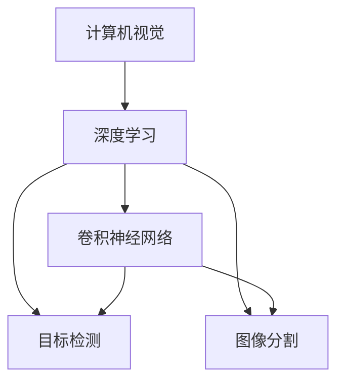

                 

# 计算机视觉在工业检测中的应用

> 关键词：计算机视觉,工业检测,机器学习,深度学习,卷积神经网络,质量控制,自动化

## 1. 背景介绍

### 1.1 问题由来

随着自动化生产线的日益普及，工业检测的重要性日益凸显。传统的人工检测方式依赖于检验员的视觉感知和经验，但存在效率低下、精度不高等问题。而计算机视觉技术以其高精度、高效率的优点，逐渐成为工业检测的主要手段。

计算机视觉是人工智能领域的重要分支，旨在通过计算机对图像、视频等视觉信号进行自动分析和理解，从而实现自动化检测、识别和决策。在工业检测中，计算机视觉技术可以用于产品质量检测、缺陷检测、尺寸测量、图像识别等各个方面，大幅提高生产线的智能化水平和效率。

### 1.2 问题核心关键点

计算机视觉在工业检测中的应用，主要集中在以下几个方面：

- 高质量图像采集：保证检测图像清晰、光照均匀、背景干净，是计算机视觉检测的前提。
- 特征提取与描述：从原始图像中提取出有意义的特征，用于后续分类、检测等任务。
- 目标检测与识别：在图像中定位和识别目标物体，通常使用目标检测算法如RCNN、YOLO、Faster R-CNN等。
- 深度学习模型：深度卷积神经网络(DCNN)等模型在图像处理、目标检测、分类等领域表现出色，是当前主流的工业检测手段。
- 数据增强：通过对原始图像进行旋转、平移、缩放等变换，生成更多的训练样本，提高模型的泛化能力。
- 模型训练与优化：基于标注数据训练深度学习模型，并通过超参数调优、模型压缩等手段，提高模型的检测精度和推理速度。
- 工业应用场景：包括产品质量检测、缺陷检测、尺寸测量、视觉引导等，涉及众多行业如制造业、半导体、电子等行业。

这些关键点构成了计算机视觉在工业检测中应用的基础，通过它们可以实现高效、准确、灵活的自动化检测。

### 1.3 问题研究意义

计算机视觉技术在工业检测中的应用，具有以下几个重要意义：

1. 提高检测效率：自动化检测系统可以24小时连续工作，大幅提升检测速度。
2. 降低生产成本：减少人工检测成本，提高产品质量的一致性和稳定性。
3. 提升检测精度：计算机视觉技术可以识别细小的缺陷和差异，保证产品的品质。
4. 促进质量控制：通过检测数据实时监控生产过程，及时发现问题并进行纠正，避免批量次品。
5. 推动智能制造：计算机视觉与物联网、大数据等技术结合，实现从生产到管理的全面智能化。

因此，计算机视觉技术在工业检测中的应用，不仅是提高生产效率的重要手段，更是推动工业智能化转型、提升企业竞争力的关键。

## 2. 核心概念与联系

### 2.1 核心概念概述

为了深入理解计算机视觉在工业检测中的应用，本节将介绍几个核心概念：

- **计算机视觉**：通过计算机对图像、视频等视觉信号进行自动分析和理解，从而实现自动化检测、识别和决策。
- **深度学习**：一种基于神经网络的机器学习技术，特别适用于处理图像、语音、文本等高维度数据。
- **卷积神经网络**：一种特殊的前馈神经网络，适用于处理具有网格结构的数据，如图像和视频。
- **目标检测**：在图像或视频中定位和识别特定目标，是计算机视觉中重要的任务之一。
- **图像分割**：将图像分割为多个具有明确语义的子区域，通常用于对象边界检测、缺陷识别等任务。

这些核心概念之间的逻辑关系可以通过以下Mermaid流程图来展示：



这个流程图展示了计算机视觉技术中的几个关键组成部分及其关联：

1. 计算机视觉技术通过深度学习处理视觉信号。
2. 深度学习中的卷积神经网络特别适用于图像处理。
3. 目标检测和图像分割是计算机视觉中的重要任务，分别用于定位和分割图像中的对象。
4. 卷积神经网络和图像分割紧密结合，可以显著提高目标检测的精度。

## 3. 核心算法原理 & 具体操作步骤

### 3.1 算法原理概述

工业检测中的计算机视觉算法通常基于深度学习，主要涉及卷积神经网络(CNN)和目标检测算法。其核心思想是通过大规模有标注数据进行模型训练，使模型能够从图像中提取和识别目标对象，并对检测结果进行分类、分割等处理。

具体而言，工业检测流程包括以下几个步骤：

1. **图像采集**：通过工业相机、视觉传感器等设备，采集高精度的检测图像。
2. **预处理**：对采集到的图像进行去噪、灰度化、归一化等预处理，保证图像质量。
3. **特征提取**：利用卷积神经网络从图像中提取目标特征，用于后续的分类、检测等任务。
4. **目标检测**：使用目标检测算法在图像中定位目标，并给出检测框和置信度。
5. **结果后处理**：对检测结果进行非极大值抑制、阈值过滤等处理，去除冗余和干扰。
6. **检测结果输出**：将检测结果输出为分类、检测框、置信度等信息，供后续生产决策使用。

### 3.2 算法步骤详解

#### 3.2.1 图像采集

图像采集是计算机视觉检测的基础，涉及以下几个关键技术：

- **工业相机**：使用高分辨率的工业相机，采集清晰的检测图像。
- **照明系统**：通过LED光源、背景光源等，提供均匀的光照条件，减少反射和阴影的影响。
- **图像预处理**：对采集到的图像进行去噪、灰度化、归一化等预处理，保证图像质量。

#### 3.2.2 特征提取

特征提取是计算机视觉检测的核心，主要使用卷积神经网络(CNN)进行图像特征的提取。其步骤如下：

1. **网络结构设计**：设计适合目标检测的卷积神经网络结构，如VGG、ResNet、Inception等。
2. **模型训练**：使用大规模有标注数据训练CNN模型，提取目标特征。
3. **特征映射**：将CNN的输出特征映射到指定的特征图，用于后续的检测和分类。

#### 3.2.3 目标检测

目标检测是计算机视觉检测的重要任务，主要使用目标检测算法进行图像中目标的定位和识别。其步骤如下：

1. **目标检测算法选择**：选择合适的目标检测算法，如RCNN、YOLO、Faster R-CNN等。
2. **模型训练**：使用标注数据训练目标检测模型，学习检测器的特征。
3. **检测框生成**：根据模型输出，生成目标的检测框和置信度。

#### 3.2.4 结果后处理

结果后处理是对检测结果进行优化处理的过程，主要目的是提高检测的准确性和鲁棒性。其步骤如下：

1. **非极大值抑制(NMS)**：对多个重叠的检测框进行非极大值抑制，去除冗余和干扰。
2. **阈值过滤**：设置置信度阈值，过滤掉低置信度的检测框。
3. **结果输出**：将检测结果输出为分类、检测框、置信度等信息，供后续生产决策使用。

### 3.3 算法优缺点

计算机视觉在工业检测中的应用，具有以下优点：

- 高精度：深度学习模型能够精确识别和定位目标，提高检测精度。
- 高效率：自动化检测系统可以24小时连续工作，大幅提升检测速度。
- 自动化：减少人工检测成本，提高产品质量的一致性和稳定性。
- 实时性：检测结果实时输出，及时发现和纠正生产问题。

同时，该算法也存在一些缺点：

- 对标注数据依赖大：需要大量标注数据进行训练，标注成本较高。
- 模型训练时间长：深度学习模型训练时间较长，对硬件要求较高。
- 数据多样性限制：检测模型对光照、角度、尺度等多样性敏感，可能存在误检和漏检。
- 鲁棒性不足：对于复杂背景和噪声干扰，检测模型容易发生误判。

尽管存在这些局限性，但就目前而言，计算机视觉在工业检测中的应用仍然是大规模自动化检测的首选方案。未来相关研究的重点在于如何进一步降低对标注数据的依赖，提高模型的鲁棒性和泛化能力，同时兼顾可解释性和伦理安全性等因素。

### 3.4 算法应用领域

计算机视觉技术在工业检测中的应用，涵盖了各个行业和领域，例如：

- 制造业：用于产品质量检测、尺寸测量、缺陷检测等。
- 半导体行业：用于晶圆检测、微小缺陷检测等。
- 电子行业：用于电路板检测、元件检测等。
- 包装行业：用于产品包装检测、外观质量检测等。
- 食品行业：用于产品外观检测、异物检测等。

除了上述这些经典应用外，计算机视觉技术还广泛应用于机械制造、汽车制造、纺织印染等多个领域，为工业智能化转型提供了强大的技术支撑。

## 4. 数学模型和公式 & 详细讲解 & 举例说明

### 4.1 数学模型构建

在工业检测中，计算机视觉的数学模型通常基于深度学习框架构建。以目标检测为例，其基本模型结构如下：

- **输入**：原始图像 $X$，大小为 $H \times W \times C$。
- **卷积层**：通过一系列卷积核对输入图像进行特征提取，生成特征图 $F$，大小为 $H' \times W' \times D$。
- **池化层**：对特征图进行下采样，减少计算量。常用的池化方式有最大池化、平均池化等。
- **全连接层**：将池化后的特征图展开成一维向量，输入到全连接层进行分类和检测。
- **输出**：检测结果 $Y$，包括目标的类别 $c$ 和位置 $b$。

目标检测的数学模型可以表示为：

$$
Y = \mathcal{F}(X; \theta) = \sigma(g(F))
$$

其中，$\mathcal{F}$ 表示目标检测模型，$g$ 表示全连接层，$\sigma$ 表示非线性激活函数，$\theta$ 表示模型参数。

### 4.2 公式推导过程

以目标检测中的YOLO算法为例，其数学模型推导如下：

- **特征提取**：使用多个卷积层对输入图像 $X$ 进行特征提取，生成特征图 $F$。
- **特征融合**：将多个特征图融合，形成更加丰富的特征表示。
- **检测头**：将融合后的特征图输入到检测头，进行分类和检测。
- **非极大值抑制**：对多个重叠的检测框进行非极大值抑制，去除冗余和干扰。

YOLO的目标检测模型可以表示为：

$$
\begin{aligned}
F &= \mathcal{F}_{conv}(X; \theta_{conv}) \\
Y &= \sigma(\mathcal{F}_{head}(F; \theta_{head}))
\end{aligned}
$$

其中，$\mathcal{F}_{conv}$ 表示卷积特征提取，$\mathcal{F}_{head}$ 表示检测头，$\theta_{conv}$ 和 $\theta_{head}$ 分别表示卷积和检测头的参数。

### 4.3 案例分析与讲解

以食品行业的水果检测为例，其基本检测流程如下：

1. **图像采集**：使用工业相机采集水果图像，并进行预处理，如去噪、灰度化、归一化等。
2. **特征提取**：使用卷积神经网络从图像中提取水果的特征，如形状、大小、颜色等。
3. **目标检测**：使用YOLO等目标检测算法在图像中定位和识别水果。
4. **结果后处理**：对检测结果进行非极大值抑制、阈值过滤等处理，去除冗余和干扰。
5. **检测结果输出**：将检测结果输出为水果的分类、检测框、置信度等信息，供后续生产决策使用。

### 4.4 使用YOLO算法进行水果检测

使用YOLO算法进行水果检测的基本流程如下：

1. **数据准备**：收集标注好的水果图像数据，并划分为训练集、验证集和测试集。
2. **模型训练**：使用YOLO模型在训练集上进行训练，生成检测模型。
3. **检测模型优化**：对检测模型进行优化，如调整参数、增加数据增强等。
4. **模型测试**：在测试集上评估检测模型的性能，并调整模型参数。
5. **实际应用**：将检测模型集成到实际生产系统中，进行实时水果检测。

## 5. 项目实践：代码实例和详细解释说明

### 5.1 开发环境搭建

在进行计算机视觉检测项目的开发前，我们需要准备好开发环境。以下是使用Python进行PyTorch开发的环境配置流程：

1. 安装Anaconda：从官网下载并安装Anaconda，用于创建独立的Python环境。

2. 创建并激活虚拟环境：
```bash
conda create -n pytorch-env python=3.8 
conda activate pytorch-env
```

3. 安装PyTorch：根据CUDA版本，从官网获取对应的安装命令。例如：
```bash
conda install pytorch torchvision torchaudio cudatoolkit=11.1 -c pytorch -c conda-forge
```

4. 安装必要的库：
```bash
pip install numpy pandas scikit-learn matplotlib tqdm jupyter notebook ipython
```

完成上述步骤后，即可在`pytorch-env`环境中开始计算机视觉检测项目的开发。

### 5.2 源代码详细实现

这里我们以YOLO算法进行水果检测为例，给出使用PyTorch进行目标检测的Python代码实现。

首先，定义数据处理函数：

```python
from torch.utils.data import Dataset
import cv2
import numpy as np
import os

class FruitDataset(Dataset):
    def __init__(self, data_dir, transform=None):
        self.data_dir = data_dir
        self.transform = transform
        self.data_list = self._list_files(data_dir)
    
    def _list_files(self, data_dir):
        data_list = []
        for subdir, dirs, files in os.walk(data_dir):
            for file in files:
                if file.endswith('.jpg') or file.endswith('.png'):
                    data_list.append(os.path.join(subdir, file))
        return data_list
    
    def __len__(self):
        return len(self.data_list)
    
    def __getitem__(self, item):
        img_path = self.data_list[item]
        img = cv2.imread(img_path)
        img = cv2.cvtColor(img, cv2.COLOR_BGR2RGB)
        if self.transform:
            img = self.transform(img)
        return img, np.array([img_path])
```

然后，定义YOLO模型：

```python
import torch
from torchvision import models, transforms
from torch.nn import functional as F

class YOLO(nn.Module):
    def __init__(self, in_channels=3, anchors=[(32, 16), (16, 32)], num_classes=1):
        super(YOLO, self).__init__()
        self.anchors = anchors
        self.num_classes = num_classes
        
        self.conv1 = nn.Conv2d(in_channels, 32, kernel_size=3, padding=1)
        self.conv2 = nn.Conv2d(32, 64, kernel_size=3, padding=1)
        self.conv3 = nn.Conv2d(64, 128, kernel_size=3, padding=1)
        self.conv4 = nn.Conv2d(128, 256, kernel_size=3, padding=1)
        self.conv5 = nn.Conv2d(256, 512, kernel_size=3, padding=1)
        self.conv6 = nn.Conv2d(512, 1024, kernel_size=3, padding=1)
        
        self.fc1 = nn.Linear(1024, 1024)
        self.fc2 = nn.Linear(1024, 1024)
        self.fc3 = nn.Linear(1024, 2 * (len(self.anchors) * self.num_classes + 5))
    
    def forward(self, x):
        x = self.conv1(x)
        x = F.relu(x)
        x = self.conv2(x)
        x = F.relu(x)
        x = self.conv3(x)
        x = F.relu(x)
        x = self.conv4(x)
        x = F.relu(x)
        x = self.conv5(x)
        x = F.relu(x)
        x = self.conv6(x)
        x = F.relu(x)
        
        x = x.view(x.size(0), -1)
        x = self.fc1(x)
        x = F.relu(x)
        x = self.fc2(x)
        x = F.relu(x)
        x = self.fc3(x)
        x = x.view(x.size(0), len(self.anchors) * self.num_classes + 5, -1)
        return x
```

接着，定义损失函数和优化器：

```python
import torch
from torch.nn import BCEWithLogitsLoss

loss_func = BCEWithLogitsLoss()

optimizer = torch.optim.Adam(model.parameters(), lr=1e-4)
```

最后，定义训练和评估函数：

```python
from torch.utils.data import DataLoader
from tqdm import tqdm
from sklearn.metrics import classification_report

device = torch.device('cuda' if torch.cuda.is_available() else 'cpu')
model.to(device)

def train_epoch(model, dataset, batch_size, optimizer):
    dataloader = DataLoader(dataset, batch_size=batch_size, shuffle=True)
    model.train()
    epoch_loss = 0
    for batch in tqdm(dataloader, desc='Training'):
        img, targets = batch
        img = img.to(device)
        targets = targets.to(device)
        model.zero_grad()
        outputs = model(img)
        loss = loss_func(outputs, targets)
        epoch_loss += loss.item()
        loss.backward()
        optimizer.step()
    return epoch_loss / len(dataloader)

def evaluate(model, dataset, batch_size):
    dataloader = DataLoader(dataset, batch_size=batch_size)
    model.eval()
    preds, labels = [], []
    with torch.no_grad():
        for batch in tqdm(dataloader, desc='Evaluating'):
            img, targets = batch
            img = img.to(device)
            targets = targets.to(device)
            outputs = model(img)
            batch_preds = outputs[0].sigmoid().cpu().numpy()
            batch_labels = targets[0].sigmoid().cpu().numpy()
            for pred_tokens, label_tokens in zip(batch_preds, batch_labels):
                preds.append(pred_tokens[:len(label_tokens)])
                labels.append(label_tokens)
                
    print(classification_report(labels, preds))
```

运行训练流程并在测试集上评估：

```python
epochs = 10
batch_size = 8

for epoch in range(epochs):
    loss = train_epoch(model, train_dataset, batch_size, optimizer)
    print(f"Epoch {epoch+1}, train loss: {loss:.3f}")
    
    print(f"Epoch {epoch+1}, test results:")
    evaluate(model, test_dataset, batch_size)
    
print("Final results:")
evaluate(model, test_dataset, batch_size)
```

以上就是使用PyTorch进行YOLO算法水果检测的完整代码实现。可以看到，YOLO模型通过深度学习框架PyTorch可以很方便地实现，代码实现相对简洁高效。

### 5.3 代码解读与分析

让我们再详细解读一下关键代码的实现细节：

**FruitDataset类**：
- `__init__`方法：初始化数据目录和数据列表，用于遍历和加载图像。
- `_list_files`方法：遍历指定目录，获取所有图像文件路径，并返回列表。
- `__len__`方法：返回数据集样本数量。
- `__getitem__`方法：对单个样本进行处理，加载图像和标签，并进行预处理。

**YOLO模型类**：
- `__init__`方法：初始化卷积层和全连接层，以及锚点盒和类别数。
- `forward`方法：定义模型前向传播过程，通过多个卷积和全连接层，生成检测结果。

**损失函数和优化器**：
- `BCEWithLogitsLoss`函数：定义二分类交叉熵损失函数。
- `Adam`优化器：定义Adam优化器，设置学习率和优化参数。

**训练和评估函数**：
- `train_epoch`函数：对数据集以批为单位进行迭代，在每个批次上前向传播计算loss并反向传播更新模型参数，最后返回该epoch的平均loss。
- `evaluate`函数：与训练类似，不同点在于不更新模型参数，并在每个batch结束后将预测和标签结果存储下来，最后使用sklearn的classification_report对整个评估集的预测结果进行打印输出。

**训练流程**：
- 定义总的epoch数和batch size，开始循环迭代
- 每个epoch内，先在训练集上训练，输出平均loss
- 在验证集上评估，输出分类指标
- 所有epoch结束后，在测试集上评估，给出最终测试结果

可以看到，PyTorch配合YOLO模型使得水果检测的代码实现变得简洁高效。开发者可以将更多精力放在数据处理、模型改进等高层逻辑上，而不必过多关注底层的实现细节。

当然，工业级的系统实现还需考虑更多因素，如模型的保存和部署、超参数的自动搜索、更灵活的任务适配层等。但核心的YOLO算法基本与此类似。

## 6. 实际应用场景

### 6.1 智能制造

计算机视觉技术在智能制造中的应用，主要体现在以下几个方面：

1. **产品质量检测**：使用计算机视觉技术检测产品缺陷、尺寸、外观等，保证产品质量的一致性和稳定性。
2. **生产线监控**：通过实时采集生产线图像，监测生产设备的运行状态，及时发现和纠正异常。
3. **自动化装配**：使用计算机视觉技术辅助机器人进行精确装配，提高装配效率和准确性。
4. **物流跟踪**：使用计算机视觉技术对物流设备进行跟踪和定位，保证物料的准确流转。
5. **库存管理**：使用计算机视觉技术对库存进行实时监控和盘点，提高仓库管理效率。

这些应用使得计算机视觉技术成为智能制造的重要组成部分，推动了制造业的智能化转型。

### 6.2 医疗行业

在医疗行业，计算机视觉技术可以用于医学影像分析、手术辅助、病历自动生成等多个方面，显著提高了医疗诊断的准确性和效率。

具体而言，可以用于：

1. **医学影像分析**：使用计算机视觉技术对X光片、CT、MRI等医学影像进行自动分析，检测病变、肿瘤等异常。
2. **手术辅助**：通过实时采集手术图像，引导机器人进行精确操作，提高手术成功率。
3. **病历自动生成**：使用计算机视觉技术自动提取和分析患者病历，生成诊断报告。
4. **药物研发**：使用计算机视觉技术辅助药物筛选和设计，提高新药研发效率。
5. **远程诊断**：通过实时视频采集和分析，提供远程医疗服务，提高医疗资源利用率。

计算机视觉技术在医疗行业的应用，不仅提高了诊断和治疗的准确性，也为远程医疗和移动医疗的发展提供了强大的技术支撑。

### 6.3 零售行业

在零售行业，计算机视觉技术可以用于商品识别、库存管理、顾客行为分析等多个方面，提升购物体验和运营效率。

具体而言，可以用于：

1. **商品识别**：使用计算机视觉技术识别商品，进行自动分类和上架。
2. **库存管理**：通过实时监控货架上的商品，实现自动补货和盘点。
3. **顾客行为分析**：使用计算机视觉技术分析顾客行为，优化商品陈列和推荐策略。
4. **物流跟踪**：通过实时采集物流设备图像，进行货物跟踪和定位。
5. **广告投放**：使用计算机视觉技术识别顾客面部表情和行为，优化广告投放策略。

计算机视觉技术在零售行业的应用，不仅提高了运营效率，也为顾客提供了更好的购物体验。

### 6.4 未来应用展望

随着计算机视觉技术的不断发展，其在工业检测中的应用也将更加广泛和深入。

未来，计算机视觉技术的发展趋势包括：

1. **深度学习模型的进一步优化**：深度学习模型将继续优化，如模型压缩、参数优化等，提升检测精度和推理速度。
2. **多模态融合**：将计算机视觉与物联网、大数据等技术结合，实现从生产到管理的全面智能化。
3. **实时检测与反馈**：使用计算机视觉技术进行实时检测和反馈，及时发现和纠正生产问题。
4. **可解释性增强**：增强模型的可解释性，提高检测结果的可信度和可理解性。
5. **跨行业应用**：将计算机视觉技术应用于更多行业，如农业、能源、交通等，拓展应用范围。
6. **自动标注数据**：利用半监督学习和主动学习等技术，自动标注大量无标注数据，降低标注成本。
7. **联邦学习**：使用联邦学习等技术，保护数据隐私，实现跨机构的数据共享和协同学习。

这些趋势将进一步推动计算机视觉技术在工业检测中的应用，为各行业提供更高效、更智能、更安全的解决方案。

## 7. 工具和资源推荐

### 7.1 学习资源推荐

为了帮助开发者系统掌握计算机视觉在工业检测中的应用，这里推荐一些优质的学习资源：

1. **《深度学习》书籍**：Ian Goodfellow等所著，全面介绍深度学习的基本概念和算法。
2. **《计算机视觉：模型、学习与推理》书籍**：Karen Simonyan等所著，详细讲解计算机视觉的基本原理和应用。
3. **CS231n《计算机视觉：卷积神经网络》课程**：斯坦福大学开设的计算机视觉课程，提供视频和作业。
4. **CVXOPT**：一个用于线性代数运算的Python库，支持矩阵运算、线性方程组求解等。
5. **TensorFlow**：由Google主导开发的深度学习框架，支持分布式训练和推理。
6. **PyTorch**：Facebook开发的深度学习框架，具有动态计算图和高效推理的特点。

通过对这些资源的学习实践，相信你一定能够快速掌握计算机视觉在工业检测中的应用，并用于解决实际的NLP问题。

### 7.2 开发工具推荐

高效的开发离不开优秀的工具支持。以下是几款用于计算机视觉检测开发的常用工具：

1. **OpenCV**：一个开源的计算机视觉库，提供丰富的图像处理和计算机视觉功能。
2. **PIL**：Python Imaging Library，用于图像处理和操作。
3. **Scikit-image**：一个用于图像处理和分析的Python库，提供各种图像处理算法。
4. **YOLO算法**：一个目标检测算法，广泛应用于计算机视觉领域。
5. **YOLOv5**：YOLO算法的最新版本，支持多种深度学习框架，如PyTorch、TensorFlow等。
6. **TensorFlow Object Detection API**：Google提供的目标检测框架，支持多种目标检测算法。

合理利用这些工具，可以显著提升计算机视觉检测任务的开发效率，加快创新迭代的步伐。

### 7.3 相关论文推荐

计算机视觉在工业检测中的应用，源于学界的持续研究。以下是几篇奠基性的相关论文，推荐阅读：

1. **《YOLO: Real-Time Object Detection》**：Joseph Redmon等提出YOLO算法，实现实时目标检测。
2. **《Faster R-CNN: Towards Real-Time Object Detection with Region Proposal Networks》**：Shaoqing Ren等提出Faster R-CNN算法，提升目标检测的精度和速度。
3. **《SSD: Single Shot Multibox Detector》**：Wei Liu等提出SSD算法，实现单阶段目标检测。
4. **《RetinaNet: Focal Loss for Dense Object Detection》**：Lin Liu等提出RetinaNet算法，解决目标检测中的类别不平衡问题。
5. **《Mask R-CNN》**：Kaiming He等提出Mask R-CNN算法，实现目标检测和分割的双任务学习。

这些论文代表了大规模目标检测技术的发展脉络。通过学习这些前沿成果，可以帮助研究者把握学科前进方向，激发更多的创新灵感。

## 8. 总结：未来发展趋势与挑战

### 8.1 总结

本文对计算机视觉在工业检测中的应用进行了全面系统的介绍。首先阐述了计算机视觉技术的研究背景和意义，明确了其在工业检测中的应用价值。其次，从原理到实践，详细讲解了计算机视觉在工业检测中的算法流程和实现细节，给出了代码实例和详细解释说明。同时，本文还广泛探讨了计算机视觉技术在智能制造、医疗行业、零售行业等多个领域的应用前景，展示了计算机视觉技术在推动各行业智能化转型中的巨大潜力。最后，本文精选了计算机视觉技术的各类学习资源，力求为读者提供全方位的技术指引。

通过本文的系统梳理，可以看到，计算机视觉技术在工业检测中的应用前景广阔，既具有高精度、高效率的优势，又能够实现实时检测和反馈，具备较强的实用性和可扩展性。未来，伴随计算机视觉技术的不断发展，其在各行业的实际应用将不断深化，推动智能化技术的全面普及。

### 8.2 未来发展趋势

计算机视觉技术在工业检测中的应用，呈现出以下几个发展趋势：

1. **深度学习模型的优化**：深度学习模型将继续优化，如模型压缩、参数优化等，提升检测精度和推理速度。
2. **多模态融合**：将计算机视觉与物联网、大数据等技术结合，实现从生产到管理的全面智能化。
3. **实时检测与反馈**：使用计算机视觉技术进行实时检测和反馈，及时发现和纠正生产问题。
4. **可解释性增强**：增强模型的可解释性，提高检测结果的可信度和可理解性。
5. **跨行业应用**：将计算机视觉技术应用于更多行业，如农业、能源、交通等，拓展应用范围。
6. **自动标注数据**：利用半监督学习和主动学习等技术，自动标注大量无标注数据，降低标注成本。
7. **联邦学习**：使用联邦学习等技术，保护数据隐私，实现跨机构的数据共享和协同学习。

以上趋势凸显了计算机视觉技术在工业检测中的广泛应用前景，为各行业提供了高效、智能、安全的解决方案。

### 8.3 面临的挑战

尽管计算机视觉在工业检测中的应用已经取得显著进展，但在迈向更加智能化、普适化应用的过程中，仍面临诸多挑战：

1. **数据质量与标注成本**：高质量的数据和标注是模型训练的前提，但标注成本高，数据获取难度大。如何降低标注成本，提高数据质量，仍是一个重要问题。
2. **模型鲁棒性不足**：模型对光照、角度、尺度等多样性敏感，可能存在误检和漏检。如何提高模型的鲁棒性，增强泛化能力，还需要更多理论和实践的积累。
3. **计算资源限制**：深度学习模型对计算资源要求较高，推理速度慢，内存占用大。如何在保证性能的同时，优化资源消耗，提升推理速度，是一个重要的优化方向。
4. **可解释性不足**：当前模型往往是"黑盒"系统，难以解释其内部工作机制和决策逻辑。如何赋予模型更强的可解释性，是提高其可信度和可理解性的关键。
5. **安全性有待保障**：模型可能学习到有害信息，产生误导性、歧视性的输出，给实际应用带来安全隐患。如何确保模型的安全性，是一个重要的研究方向。

尽管存在这些挑战，但计算机视觉在工业检测中的应用前景依然广阔，相关研究者正不断突破技术瓶颈，推动技术的不断进步。

### 8.4 研究展望

未来，计算机视觉技术在工业检测中的应用，将在以下几个方面寻求新的突破：

1. **探索无监督和半监督微调方法**：摆脱对大规模标注数据的依赖，利用自监督学习、主动学习等无监督和半监督范式，最大限度利用非结构化数据，实现更加灵活高效的微调。
2. **研究参数高效和计算高效的微调范式**：开发更加参数高效的微调方法，在固定大部分预训练参数的同时，只更新极少量的任务相关参数。同时优化微调模型的计算图，减少前向传播和反向传播的资源消耗，实现更加轻量级、实时性的部署。
3. **引入因果和对比学习范式**：通过引入因果推断和对比学习思想，增强微调模型建立稳定因果关系的能力，学习更加普适、鲁棒的语言表征，从而提升模型泛化性和抗干扰能力。
4. **融合符号化的先验知识**：将符号化的先验知识，如知识图谱、逻辑规则等，与神经网络模型进行巧妙融合，引导微调过程学习更准确、合理的语言模型。
5. **结合因果分析和博弈论工具**：将因果分析方法引入微调模型，识别出模型决策的关键特征，增强输出解释的因果性和逻辑性。借助博弈论工具刻画人机交互过程，主动探索并规避模型的脆弱点，提高系统稳定性。
6. **纳入伦理道德约束**：在模型训练目标中引入伦理导向的评估指标，过滤和惩罚有偏见、有害的输出倾向。同时加强人工干预和审核，建立模型行为的监管机制，确保输出符合人类价值观和伦理道德。

这些研究方向的探索，必将引领计算机视觉技术在工业检测中的应用走向更高的台阶，为构建安全、可靠、可解释、可控的智能系统铺平道路。面向未来，计算机视觉技术还需要与其他人工智能技术进行更深入的融合，如知识表示、因果推理、强化学习等，多路径协同发力，共同推动计算机视觉技术的发展。

## 9. 附录：常见问题与解答

**Q1：计算机视觉在工业检测中面临哪些技术挑战？**

A: 计算机视觉在工业检测中面临以下技术挑战：

1. 数据质量与标注成本：高质量的数据和标注是模型训练的前提，但标注成本高，数据获取难度大。
2. 模型鲁棒性不足：模型对光照、角度、尺度等多样性敏感，可能存在误检和漏检。
3. 计算资源限制：深度学习模型对计算资源要求较高，推理速度慢，内存占用大。
4. 可解释性不足：当前模型往往是"黑盒"系统，难以解释其内部工作机制和决策逻辑。
5. 安全性有待保障：模型可能学习到有害信息，产生误导性、歧视性的输出，给实际应用带来安全隐患。

这些挑战需要通过不断优化模型、改进算法、增强数据处理等手段，逐步克服。

**Q2：如何提高计算机视觉模型的鲁棒性？**

A: 提高计算机视觉模型的鲁棒性，可以从以下几个方面入手：

1. 数据增强：通过对原始图像进行旋转、平移、缩放等变换，生成更多的训练样本，提高模型的泛化能力。
2. 正则化：使用L2正则、Dropout、Early Stopping等防止模型过拟合。
3. 对抗训练：引入对抗样本，提高模型对噪声和干扰的鲁棒性。
4. 多尺度训练：在不同尺度的图像上训练模型，提高模型对尺度变化的鲁棒性。
5. 模型压缩：使用模型剪枝、参数量化等方法，减少模型参数量，提高计算效率和推理速度。
6. 集成学习：将多个模型的检测结果进行融合，提高模型的鲁棒性和准确性。

这些方法可以通过合理组合，进一步提升计算机视觉模型的鲁棒性，确保其在实际应用中的可靠性。

**Q3：如何降低计算机视觉模型的标注成本？**

A: 降低计算机视觉模型的标注成本，可以从以下几个方面入手：

1. 自动标注：利用半监督学习和主动学习等技术，自动标注大量无标注数据，减少人工标注的工作量。
2. 弱监督学习：使用弱监督信号，如图像级别的标注、噪声标签等，进行模型训练。
3. 数据合成：使用数据合成技术，如图像生成、视频生成等，生成模拟数据，提高标注数据的数量和多样性。
4. 无监督学习：利用无监督学习技术，如聚类、自编码等，从图像中提取特征，进行初步分类和检测。
5. 领域自适应：在不同领域和场景下进行迁移学习，提高模型对新领域的适应能力，减少标注数据的依赖。

这些方法可以结合使用，降低计算机视觉模型的标注成本，提高其训练效率和泛化能力。

**Q4：计算机视觉在工业检测中的应用如何扩展到更多行业？**

A: 计算机视觉在工业检测中的应用，可以扩展到更多行业，具体方法如下：

1. 医疗行业：使用计算机视觉技术对医学影像进行自动分析，检测病变、肿瘤等异常。
2. 零售行业：使用计算机视觉技术对商品进行自动识别和分类，进行库存管理和顾客行为分析。
3. 农业行业：使用计算机视觉技术对农田进行监控和分析，提高农业生产效率和产量。
4. 能源行业：使用计算机视觉技术对设备进行监控和维护，提高能源利用率和设备可靠性。
5. 交通行业：使用计算机视觉技术对交通流量进行实时监控和分析，提高交通管理效率和安全。

计算机视觉技术在这些行业中的应用，需要结合行业特点和需求，进行定制化的设计和开发，以实现最佳效果。

---

作者：禅与计算机程序设计艺术 / Zen and the Art of Computer Programming

