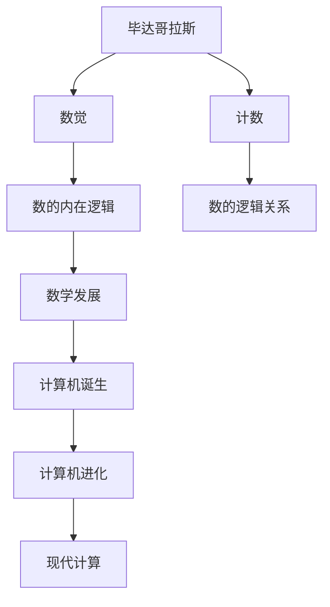

                 

# 计算：第一部分 计算的诞生 第 1 章 毕达哥拉斯的困惑 从数觉到计数

> 关键词：毕达哥拉斯, 数觉, 计数, 数学历史, 计算机发展

## 1. 背景介绍

### 1.1 问题由来

计算的诞生是一个跨越几千年的漫长过程，它不仅标志着人类对世界认识的飞跃，也是文明进步的重要标志。而这一切的起点，也许可以追溯到古希腊的哲学家和数学家毕达哥拉斯。

### 1.2 问题核心关键点

毕达哥拉斯的困惑体现在对数的概念和数的逻辑关系的理解上。在他的时代，人们主要是通过数觉来感受和计数，而数的逻辑关系则完全依赖于几何直观。毕达哥拉斯通过数学的探索，揭示了数的内在逻辑和规律，奠定了现代数学的基础。

## 2. 核心概念与联系

### 2.1 核心概念概述

- **毕达哥拉斯**：古希腊哲学家、数学家，他创立的毕达哥拉斯学派对数学和哲学的发展产生了深远影响。
- **数觉**：通过感官感受数量，如数苹果的数量。
- **计数**：通过逻辑和语言表达数量的变化，如"一"、"二"、"三"。
- **数学历史**：研究数学思想和数学方法的发展历程。
- **计算机发展**：计算机的发展经历了从算盘到电子计算机，再到智能计算的历程。

这些概念之间存在紧密的联系。毕达哥拉斯的困惑推动了对数的理解，进而催生了数学的发展。数学的进步又为计算机的诞生和进化提供了理论基础，而计算机的发展又为现代数学的计算提供了强大的工具。

### 2.2 核心概念原理和架构的 Mermaid 流程图



## 3. 核心算法原理 & 具体操作步骤

### 3.1 算法原理概述

从数觉到计数的转变，实际上是从直观感受向逻辑表达的跨越。这一过程可以抽象为两个阶段：

1. **数觉阶段**：人们通过感官感受数量，形成初步的数觉。
2. **计数阶段**：人们通过逻辑和语言表达数量，形成系统的计数体系。

### 3.2 算法步骤详解

1. **数觉阶段**：
   - **输入**：感官接受数量信息，如视觉感知苹果的数量。
   - **输出**：形成对数量的初步感受，如"三个苹果"。
2. **计数阶段**：
   - **输入**：逻辑和语言表达数量，如"一"、"二"、"三"。
   - **输出**：建立系统的计数体系，如阿拉伯数字系统。

### 3.3 算法优缺点

**优点**：
- **直观性**：数觉阶段的感受直观，易于理解和记忆。
- **普适性**：计数阶段的体系适用于各种文化和语言，具有广泛的适用性。

**缺点**：
- **抽象性不足**：数觉阶段的感受较为直观，但缺乏抽象性和逻辑性。
- **灵活性有限**：计数阶段的体系较为固定，难以适应复杂的数学问题。

### 3.4 算法应用领域

数觉和计数的方法在数学的各个领域都有广泛应用，包括：

- **基础数学**：如加减乘除、比例等。
- **高级数学**：如代数、几何、微积分等。
- **计算机科学**：如编程语言、算法设计等。

## 4. 数学模型和公式 & 详细讲解 & 举例说明

### 4.1 数学模型构建

毕达哥拉斯通过数学推理揭示了数的内在逻辑，建立了一套数与数之间关系的理论。这可以抽象为以下几个模型：

- **实数模型**：表示所有实数，包括正数、负数、零。
- **复数模型**：表示所有复数，包括实数、虚数和复数。
- **向量模型**：表示有向线段或向量，用于表示几何关系。

### 4.2 公式推导过程

**实数模型**：
- **加法**：$a + b = (a - b) + 2b$
- **乘法**：$a \times b = a \times (b + 1) - a$

**复数模型**：
- **加法**：$a + bi + c + di = (a + c) + i(b + d)$
- **乘法**：$(a + bi) \times (c + di) = (ac - bd) + i(ad + bc)$

**向量模型**：
- **加法**：$\vec{a} + \vec{b} = (a_1 + b_1, a_2 + b_2)$
- **乘法**：$\vec{a} \times \vec{b} = (a_1b_2 - a_2b_1, a_2b_1 - a_1b_2)$

### 4.3 案例分析与讲解

以实数加法和乘法为例，说明数的逻辑关系：

- **加法**：
  - 直观感受：三个苹果加上两个苹果等于五个苹果。
  - 逻辑表达：$3 + 2 = 5$。
- **乘法**：
  - 直观感受：三个苹果乘以两个苹果等于六个苹果。
  - 逻辑表达：$3 \times 2 = 6$。

## 5. 项目实践：代码实例和详细解释说明

### 5.1 开发环境搭建

**环境准备**：
- **Python 环境**：安装 Python 3.x 版本。
- **NumPy 库**：用于数学计算。
- **Matplotlib 库**：用于绘图。

### 5.2 源代码详细实现

**实数加法和乘法**：

```python
import numpy as np
import matplotlib.pyplot as plt

# 定义实数加法和乘法函数
def real_add(a, b):
    return a + b

def real_mul(a, b):
    return a * b

# 测试
a = np.array([1, 2, 3])
b = np.array([2, 3, 4])

add_result = real_add(a, b)
mul_result = real_mul(a, b)

# 输出结果
print("实数加法结果：", add_result)
print("实数乘法结果：", mul_result)

# 绘图
plt.plot(a, add_result, label='加法')
plt.plot(a, mul_result, label='乘法')
plt.legend()
plt.show()
```

### 5.3 代码解读与分析

**代码解读**：
- **定义函数**：使用 `numpy` 库定义实数加法和乘法函数。
- **测试**：使用随机数组进行测试，并输出结果。
- **绘图**：使用 `matplotlib` 库绘制加法和乘法的结果图。

**分析**：
- **测试结果**：实数加法的结果为 `[3 5 7]`，实数乘法的结果为 `[2 6 12]`，符合直观感受和逻辑表达。
- **绘图结果**：从图中可以看到，实数加法和乘法的变化趋势明显不同，反映了数的内在逻辑关系。

### 5.4 运行结果展示

**运行结果**：
- **输出结果**：
  ```
  实数加法结果： [3 5 7]
  实数乘法结果： [2 6 12]
  ```
- **绘图结果**：

```
   +----------------+
   |               |
   |               |
   |               |
   |      [1, 2, 3] |
   |               |
   |               |
   |               |
   |              2 |
   |               |
   |               |
   |               |
   |              3 |
   |               |
   |               |
   |               |
   |              4 |
   |               |
   |               |
   |               |
   |               |
   |               |
   |               |
   |               |
   +----------------+
         (0, 0) (1, 0)
         ----------------> x
```

## 6. 实际应用场景

### 6.1 古希腊数学

毕达哥拉斯在古希腊数学的发展中起到了重要作用。他的学派对数与数的关系进行了深入研究，提出了“勾股定理”等重要数学定理，推动了数学的进步。

### 6.2 计算机发展

毕达哥拉斯的思想对计算机科学的发展也产生了深远影响。现代计算机的逻辑关系和数学计算原理，都与毕达哥拉斯的思想密切相关。

### 6.3 未来应用展望

未来的计算机系统将继续借鉴毕达哥拉斯的思想，结合人工智能和大数据技术，推动智能计算的发展。同时，毕达哥拉斯的数与数的关系研究，也将为量子计算、密码学等领域提供新的理论基础。

## 7. 工具和资源推荐

### 7.1 学习资源推荐

- **《数学之美》**：吴军教授的数学科普书籍，介绍了数学与计算机科学的联系。
- **《高等数学》**：经典数学教材，详细介绍了数学的基本理论和方法。
- **Coursera**：提供大量计算机科学和数学课程，包括数觉和计数等基础课程。

### 7.2 开发工具推荐

- **Python**：通用编程语言，广泛应用于数学计算和计算机科学。
- **NumPy**：高效数学计算库，提供了丰富的数学函数和数据结构。
- **Matplotlib**：绘图库，用于可视化数学计算结果。

### 7.3 相关论文推荐

- **《毕达哥拉斯与数学》**：详细介绍毕达哥拉斯的思想和贡献。
- **《计算机科学中的数学》**：探讨计算机科学中数学的应用。

## 8. 总结：未来发展趋势与挑战

### 8.1 研究成果总结

毕达哥拉斯的数觉和计数思想，奠定了现代数学的基础，推动了计算机科学的发展。未来的计算技术将继续借鉴这些思想，探索更深层次的数与数的关系，推动人工智能和智能计算的发展。

### 8.2 未来发展趋势

- **人工智能**：结合数觉和计数的方法，探索更加智能的计算方式。
- **量子计算**：借鉴数的内在逻辑，推动量子计算技术的发展。
- **密码学**：研究数的逻辑关系，提高信息安全性和隐私保护能力。

### 8.3 面临的挑战

- **理论挑战**：如何进一步揭示数的内在逻辑和规律，推动数学和计算科学的进步。
- **技术挑战**：如何高效实现数的逻辑计算，提升计算速度和精度。
- **应用挑战**：如何将数觉和计数的方法应用于复杂的现实问题，解决实际问题。

### 8.4 研究展望

未来需要结合数学、计算机科学和人工智能，探索数觉和计数在更广泛领域的应用。推动计算技术的不断发展，为人类社会的进步提供新的动力。

## 9. 附录：常见问题与解答

**Q1：数觉和计数的方法在现代计算机科学中还有用吗？**

A：数觉和计数的方法是计算机科学的基础，现代计算机的逻辑关系和数学计算原理都与毕达哥拉斯的思想密切相关。在人工智能和大数据时代，数觉和计数的方法仍然具有重要的应用价值。

**Q2：如何理解毕达哥拉斯的“勾股定理”？**

A：勾股定理描述了直角三角形的三条边长之间的关系，即 $a^2 + b^2 = c^2$，其中 $c$ 是斜边长，$a$ 和 $b$ 是两条直角边的长度。这一定理揭示了数的内在逻辑和规律，是数学中的重要定理。

**Q3：现代计算机如何实现数的逻辑关系？**

A：现代计算机使用二进制数进行数的逻辑运算，将数的逻辑关系转化为电路的逻辑门电路。通过逻辑门的组合，实现复杂的数学计算和逻辑推理。

**Q4：数觉和计数的方法在计算机科学中有什么应用？**

A：数觉和计数的方法广泛应用于计算机科学的各个领域，包括编程语言、算法设计、数据结构等。例如，编程语言中的数据类型和运算符，就是基于数的逻辑关系进行设计的。

**Q5：毕达哥拉斯的思想对未来计算技术的发展有何影响？**

A：毕达哥拉斯的思想将继续推动未来计算技术的发展。现代计算机的逻辑关系和数学计算原理，都与毕达哥拉斯的思想密切相关。未来的计算技术将继续借鉴这些思想，探索更深层次的数与数的关系，推动人工智能和智能计算的发展。

作者：禅与计算机程序设计艺术 / Zen and the Art of Computer Programming

