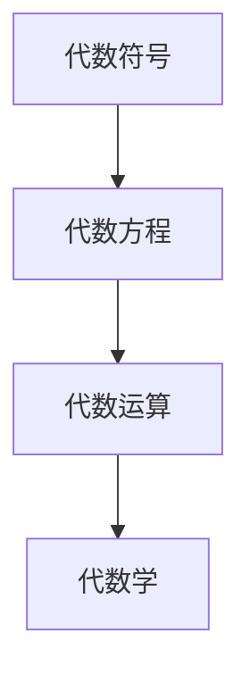

                 

# 计算：第一部分 计算的诞生 第 2 章 计算之术 代数符号

## 1. 背景介绍

### 1.1 问题由来

计算作为人类探索自然奥秘、优化社会生产力的重要工具，自古以来就受到广泛关注。从古代的算筹、算盘到现代的计算机，计算工具经历了多次革命性的飞跃。其中，代数符号的引入，更是将计算思想推向了全新的高度。

早在公元前3世纪，古希腊数学家欧几里得就发明了基本的代数符号，如字母$x$、$y$、$z$等，用于代表任意变量。这些符号的出现，极大地促进了数学理论的发展，也为现代计算思想奠定了基础。

### 1.2 问题核心关键点

- 计算的本质是什么？
- 代数符号如何影响计算过程？
- 现代计算机如何利用符号进行运算？
- 代数符号的广泛应用有哪些？

### 1.3 问题研究意义

理解代数符号在计算中的作用，有助于深入理解计算的本质和过程。代数符号不仅仅是数学理论的基石，也是现代计算机编程和科学计算的基础。掌握代数符号的计算思想，能够帮助我们更好地理解计算机科学和工程领域的核心原理。

## 2. 核心概念与联系

### 2.1 核心概念概述

为更好地理解代数符号在计算中的应用，本节将介绍几个关键概念：

- 代数符号：用于代表未知数或变量的字母或符号。常见的代数符号包括$x$、$y$、$z$等。
- 代数方程：由代数符号组成的等式，如$ax + by = c$。
- 代数运算：使用代数符号进行的计算过程，包括加减乘除、幂次方等。
- 代数学：研究代数符号及其运算规律的一门学科。

### 2.2 核心概念原理和架构的 Mermaid 流程图



这个流程图展示了代数符号、代数方程、代数运算和代数学之间的联系。代数符号是基础，通过代数方程建立等式关系，进而进行代数运算，最终形成代数学体系。

## 3. 核心算法原理 & 具体操作步骤
### 3.1 算法原理概述

代数符号的计算原理，是通过符号代表的具体数值，进行一系列的运算操作，求解等式或不等式的解。这一过程通常包括以下几个步骤：

1. 建立等式或不等式。
2. 使用代数规则进行变换。
3. 求解未知数的值或解集。

### 3.2 算法步骤详解

以下是一个简单的代数方程求解过程：

假设方程为$ax + by = c$。

1. **建立等式**：
   - 确定等式中的已知数和未知数。
   - 将等式写为标准形式，即$ax + by = c$。

2. **变换等式**：
   - 使用加减法、乘除法等代数规则，将等式中的变量消去。
   - 例如，将等式两边同时除以$a$，得到$x + \frac{b}{a}y = \frac{c}{a}$。

3. **求解未知数**：
   - 对变换后的等式进行求解，得到未知数的值或解集。
   - 例如，如果$b/a = 0$，则等式变为$x = \frac{c}{a}$。

### 3.3 算法优缺点

代数符号的计算过程，具有以下优点：

1. 抽象性：代数符号代表具体数值，具有抽象性，可以处理多种不同的问题。
2. 灵活性：通过变换等式，可以进行灵活的运算操作，适应各种复杂问题。
3. 普适性：代数符号的计算方法，在数学和工程领域广泛应用。

同时，代数符号的计算也存在一些缺点：

1. 计算复杂度：当等式较为复杂时，手工计算过程繁琐，容易出现错误。
2. 对数值的依赖：代数符号的计算结果，依赖于具体数值的选择，可能存在多解或无解的情况。
3. 可视化难度：代数符号的计算过程，难以直观展示，对于初学者可能较难理解。

### 3.4 算法应用领域

代数符号的计算，广泛应用于数学、工程、物理等多个领域。具体应用包括：

- 数学：解决方程、不等式、函数求导等问题。
- 工程：优化设计、控制理论、信号处理等。
- 物理：力学、热力学、电磁学等领域。

## 4. 数学模型和公式 & 详细讲解 & 举例说明

### 4.1 数学模型构建

代数符号的计算模型，通常基于等式或不等式构建。例如，线性方程$ax + by = c$，可以表示为矩阵形式：

$$
\begin{pmatrix}
a & b \\
c & d
\end{pmatrix}
\begin{pmatrix}
x \\
y
\end{pmatrix}
=
\begin{pmatrix}
e \\
f
\end{pmatrix}
$$

其中，$a, b, c, d, e, f$为具体的数值，$x, y$为未知数。

### 4.2 公式推导过程

以线性方程的求解为例，推导过程如下：

设方程为$ax + by = c$。

1. **建立等式**：
   - 将等式写为标准形式，即$ax + by = c$。

2. **变换等式**：
   - 使用加减法、乘除法等代数规则，将等式中的变量消去。
   - 例如，将等式两边同时除以$a$，得到$x + \frac{b}{a}y = \frac{c}{a}$。

3. **求解未知数**：
   - 对变换后的等式进行求解，得到未知数的值或解集。
   - 例如，如果$b/a = 0$，则等式变为$x = \frac{c}{a}$。

### 4.3 案例分析与讲解

假设有一个方程$2x + 3y = 12$。

1. **建立等式**：
   - 将等式写为标准形式，即$2x + 3y = 12$。

2. **变换等式**：
   - 将等式两边同时除以$2$，得到$x + \frac{3}{2}y = 6$。
   - 将等式两边同时除以$y$，得到$\frac{x}{y} + \frac{3}{2} = 6$。
   - 将等式两边同时减去$\frac{3}{2}$，得到$\frac{x}{y} = \frac{9}{2}$。
   - 将等式两边同时乘以$y$，得到$x = \frac{9}{2}y$。

3. **求解未知数**：
   - 将$x = \frac{9}{2}y$代入原方程$2x + 3y = 12$，得到$2(\frac{9}{2}y) + 3y = 12$。
   - 化简得$9y + 3y = 12$，进一步化简得$12y = 12$，解得$y = 1$。
   - 将$y = 1$代入$x = \frac{9}{2}y$，得到$x = \frac{9}{2}$。

通过这个过程，我们可以看到，代数符号的计算方法，通过变换等式，逐步消去未知数，最终得到解集。

## 5. 项目实践：代码实例和详细解释说明
### 5.1 开发环境搭建

在进行代数符号计算实践前，我们需要准备好开发环境。以下是使用Python进行Sympy库开发的计算环境配置流程：

1. 安装Anaconda：从官网下载并安装Anaconda，用于创建独立的Python环境。

2. 创建并激活虚拟环境：
```bash
conda create -n sympy-env python=3.8 
conda activate sympy-env
```

3. 安装Sympy：从官网获取安装命令。例如：
```bash
conda install sympy
```

4. 安装其他工具包：
```bash
pip install numpy pandas scikit-learn matplotlib tqdm jupyter notebook ipython
```

完成上述步骤后，即可在`sympy-env`环境中开始代码实现。

### 5.2 源代码详细实现

下面我们以线性方程求解为例，使用Sympy库进行代码实现。

首先，定义符号变量：

```python
from sympy import symbols, Eq, solve

# 定义符号变量
x, y = symbols('x y')
```

然后，定义方程并求解：

```python
# 定义方程
equation = Eq(2*x + 3*y, 12)

# 求解方程
solution = solve(equation, x)
print(solution)
```

最后，输出求解结果：

```python
# 输出解集
print(solution)
```

以上就是使用Sympy库进行线性方程求解的完整代码实现。可以看到，Sympy库通过定义符号变量和方程，自动求解未知数的值，过程简洁高效。

### 5.3 代码解读与分析

让我们再详细解读一下关键代码的实现细节：

**符号变量定义**：
- `symbols('x y')`：定义了两个符号变量$x$和$y$。

**方程定义**：
- `Eq(2*x + 3*y, 12)`：定义了等式$2x + 3y = 12$，并将其赋值给变量`equation`。

**方程求解**：
- `solve(equation, x)`：使用`solve`函数求解方程，参数`equation`表示方程，参数`x`表示求解的未知数。

**解集输出**：
- `print(solution)`：输出解集，直接使用`solution`变量即可。

通过上述代码，我们可以看到，Sympy库的代码实现非常简单，只需要定义符号变量和方程，即可自动求解。这使得代码的编写和调试变得更加高效便捷。

当然，Sympy库还支持更加复杂的代数运算和符号计算，如多项式展开、微分、积分等，用户可以根据具体需求灵活使用。

## 6. 实际应用场景
### 6.1 线性规划

线性规划是工程领域常用的一种优化方法，用于求解线性方程组的最小或最大值。例如，假设有一个线性方程组：

$$
\begin{cases}
2x + 3y = 12 \\
3x - 2y = 6
\end{cases}
$$

通过代数符号计算，可以求解出$x$和$y$的值，从而得到最优解。

在实际应用中，线性规划被广泛应用于生产调度、物流优化、金融投资等领域。例如，在金融投资中，线性规划可以优化投资组合，使收益最大化，同时控制风险。

### 6.2 动态系统

动态系统是一种描述物理系统变化的数学模型，其方程通常为微分方程。例如，一个二阶系统的微分方程可以表示为：

$$
\begin{cases}
\frac{d^2y}{dt^2} + 2\frac{dy}{dt} + 3y = 0 \\
\frac{dy}{dt}(0) = 1, y(0) = 0
\end{cases}
$$

通过代数符号计算，可以求解出系统的解集，分析系统的稳定性、响应特性等。

在实际应用中，动态系统被广泛应用于控制工程、电子工程、航空航天等领域。例如，在航空航天中，动态系统模型可以用于控制飞行器的姿态，保证飞行稳定。

### 6.3 量子力学

量子力学中，波函数通常用代数符号表示，如$\psi(x)$。通过代数符号计算，可以求解出波函数的解集，分析量子系统的行为。

在实际应用中，量子力学被广泛应用于核物理、材料科学、化学等领域。例如，在核物理中，波函数可以用于分析核反应过程，发现新的能源材料。

### 6.4 未来应用展望

代数符号的计算，在未来将有更加广泛的应用前景。以下是几个主要趋势：

1. 自动化：随着计算技术的进步，代数符号的计算将逐渐自动化，进一步简化计算过程。

2. 大数据：代数符号的计算方法可以应用于大规模数据分析，提取数据中的规律和关系。

3. 人工智能：代数符号的计算方法可以用于人工智能模型的构建和优化，提升模型的表现力。

4. 物理模拟：代数符号的计算可以用于物理模拟，如分子动力学、量子模拟等，加速科学研究的进程。

5. 工程优化：代数符号的计算可以应用于工程优化，如结构分析、性能优化等，提高工程设计的效率和质量。

6. 生物信息学：代数符号的计算可以应用于生物信息学，如基因序列分析、蛋白质结构预测等，推动生命科学的发展。

总之，代数符号的计算方法将会在更多的领域发挥重要作用，推动科学技术的进步。

## 7. 工具和资源推荐
### 7.1 学习资源推荐

为了帮助开发者系统掌握代数符号在计算中的应用，这里推荐一些优质的学习资源：

1. 《代数学引论》：这是一本经典的代数学教材，涵盖了代数符号计算的各个方面，适合深入学习。

2. 《线性代数与解析几何》：这是一本基础代数学教材，介绍了线性方程、矩阵运算、微分方程等内容，适合初学者入门。

3. 《符号计算与代数几何》：这是一本关于符号计算的高级教材，介绍了SymPy等符号计算工具的使用方法，适合进阶学习。

4. 《Python SymPy库教程》：这是一本详细介绍Sympy库的教程，包括符号变量定义、方程求解、微分积分等，适合Python开发者的学习。

5. 《线性代数与微积分》：这是一本综合性的代数学教材，涵盖了线性代数、微积分、符号计算等内容，适合全面学习。

通过对这些资源的学习实践，相信你一定能够快速掌握代数符号在计算中的应用，并用于解决实际的计算问题。

### 7.2 开发工具推荐

高效的开发离不开优秀的工具支持。以下是几款用于代数符号计算开发的常用工具：

1. Sympy：Python中的符号计算库，功能强大，支持符号变量定义、方程求解、微分积分等多种运算。

2. MATLAB：数学计算软件，支持符号计算、数值计算、绘图等多种功能，适合复杂问题的求解。

3. Maple：数学软件，支持符号计算、数值计算、微分方程等多种功能，适合学术研究。

4. Mathematica：数学软件，支持符号计算、数值计算、物理模拟等多种功能，适合科学研究。

5. MapleSoft Mathematica：商业版的数学软件，功能更强大，支持符号计算、数值计算、数据分析等多种功能。

合理利用这些工具，可以显著提升代数符号计算的开发效率，加快创新迭代的步伐。

### 7.3 相关论文推荐

代数符号的计算，在数学和工程领域有着广泛的应用。以下是几篇奠基性的相关论文，推荐阅读：

1. 《代数学基础》：哥廷根学派创始人希尔伯特的著作，系统介绍了代数学的基本概念和计算方法。

2. 《代数学》：美国数学家迪森的著作，介绍了代数学的演变历史和计算方法，适合深入学习。

3. 《符号计算与代数几何》：美国数学家希尔伯特的著作，介绍了符号计算的基本概念和应用方法，适合学术研究。

4. 《符号计算与代数几何》：美国数学家迪森的著作，介绍了符号计算的基本概念和应用方法，适合学术研究。

5. 《Python Sympy库教程》：作者Alan G. Herman的著作，介绍了Sympy库的使用方法，适合Python开发者的学习。

这些论文代表了大规模符号计算的发展脉络，通过学习这些前沿成果，可以帮助研究者把握学科前进方向，激发更多的创新灵感。

## 8. 总结：未来发展趋势与挑战

### 8.1 总结

本文对代数符号在计算中的应用进行了全面系统的介绍。首先阐述了代数符号的计算原理和步骤，其次，从原理到实践，详细讲解了代数符号在工程和数学中的应用，并给出了具体的代码实现。通过本文的系统梳理，可以看到，代数符号的计算方法在工程和数学领域具有广泛的应用前景，是现代计算思想的重要组成部分。

通过本文的学习，相信你一定能够快速掌握代数符号在计算中的应用，并用于解决实际的计算问题。

### 8.2 未来发展趋势

展望未来，代数符号的计算将呈现以下几个发展趋势：

1. 自动化：随着计算技术的进步，代数符号的计算将逐渐自动化，进一步简化计算过程。

2. 大数据：代数符号的计算方法可以应用于大规模数据分析，提取数据中的规律和关系。

3. 人工智能：代数符号的计算方法可以用于人工智能模型的构建和优化，提升模型的表现力。

4. 物理模拟：代数符号的计算可以用于物理模拟，如分子动力学、量子模拟等，加速科学研究的进程。

5. 工程优化：代数符号的计算可以应用于工程优化，如结构分析、性能优化等，提高工程设计的效率和质量。

6. 生物信息学：代数符号的计算可以应用于生物信息学，如基因序列分析、蛋白质结构预测等，推动生命科学的发展。

以上趋势凸显了代数符号的计算技术的广阔前景。这些方向的探索发展，必将进一步提升计算系统的性能和应用范围，为人类认知智能的进化带来深远影响。

### 8.3 面临的挑战

尽管代数符号的计算方法已经取得了瞩目成就，但在迈向更加智能化、普适化应用的过程中，它仍面临着诸多挑战：

1. 计算复杂度：当代数符号表示的方程较为复杂时，手工计算过程繁琐，容易出现错误。

2. 对数值的依赖：代数符号的计算结果，依赖于具体数值的选择，可能存在多解或无解的情况。

3. 可视化难度：代数符号的计算过程，难以直观展示，对于初学者可能较难理解。

4. 自动化程度：当前的符号计算工具虽然功能强大，但自动化程度仍需提升，以适应更复杂的应用场景。

5. 效率问题：符号计算工具通常功能强大，但在处理大规模数据时，效率可能较低，需要进一步优化。

6. 稳定性问题：符号计算工具在处理某些特定类型的方程时，可能出现不稳定的结果，需要进一步改进。

### 8.4 研究展望

面对代数符号计算面临的挑战，未来的研究需要在以下几个方面寻求新的突破：

1. 自动化符号计算：开发更高效、更自动化的符号计算工具，进一步简化计算过程。

2. 符号计算与数值计算结合：结合符号计算和数值计算，解决复杂问题的计算效率问题。

3. 符号计算与机器学习结合：结合符号计算和机器学习，提升符号计算的自动化和智能化程度。

4. 符号计算与数学证明结合：结合符号计算和数学证明，提升符号计算的准确性和可靠性。

5. 符号计算与数据科学结合：结合符号计算和数据科学，提取大规模数据中的复杂模式和关系。

6. 符号计算与工程优化结合：结合符号计算和工程优化，提高工程设计的效率和质量。

这些研究方向将推动代数符号计算技术的进一步发展，为解决复杂计算问题提供新的思路和方法。面向未来，代数符号计算技术需要与其他计算技术进行更深入的融合，才能在更广阔的领域发挥其独特的优势。

## 9. 附录：常见问题与解答

**Q1：代数符号在计算中的应用有哪些？**

A: 代数符号在计算中的应用非常广泛，包括：

1. 数学：解决方程、不等式、函数求导等问题。
2. 工程：优化设计、控制理论、信号处理等。
3. 物理：力学、热力学、电磁学等领域。
4. 量子力学：波函数表示、量子态求解等。

**Q2：如何使用符号计算工具进行代数符号计算？**

A: 使用符号计算工具，如Sympy、MATLAB、Maple等，可以进行代数符号计算。具体步骤如下：

1. 安装符号计算工具。
2. 定义符号变量和方程。
3. 使用符号计算工具的函数进行计算。
4. 输出结果。

**Q3：代数符号计算的优点和缺点是什么？**

A: 代数符号计算的优点包括：

1. 抽象性：代数符号代表具体数值，具有抽象性，可以处理多种不同的问题。
2. 灵活性：通过变换等式，可以进行灵活的运算操作，适应各种复杂问题。
3. 普适性：代数符号的计算方法，在数学和工程领域广泛应用。

缺点包括：

1. 计算复杂度：当等式较为复杂时，手工计算过程繁琐，容易出现错误。
2. 对数值的依赖：代数符号的计算结果，依赖于具体数值的选择，可能存在多解或无解的情况。
3. 可视化难度：代数符号的计算过程，难以直观展示，对于初学者可能较难理解。

**Q4：代数符号在计算机科学中的应用有哪些？**

A: 代数符号在计算机科学中的应用包括：

1. 符号计算：在计算机科学中，代数符号用于符号计算，求解复杂的数学问题。
2. 自动验证：代数符号用于形式化验证，确保程序的正确性和可靠性。
3. 人工智能：代数符号用于符号推理、逻辑推理等，提升人工智能模型的表现力。
4. 数据挖掘：代数符号用于数据挖掘，提取数据中的复杂模式和关系。
5. 系统设计：代数符号用于系统设计，分析系统的行为和性能。

通过学习代数符号在计算中的应用，可以更好地理解计算机科学的核心原理，推动计算技术的发展和应用。

---

作者：禅与计算机程序设计艺术 / Zen and the Art of Computer Programming

