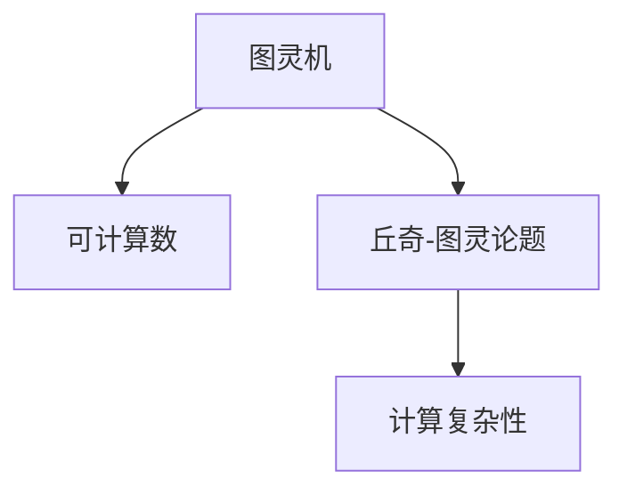

                 

# 计算：第三部分 计算理论的形成 第 8 章 计算理论的诞生：图灵的可计算数 丘奇-图灵论题

## 1. 背景介绍

### 1.1 问题由来

在20世纪30年代，数学家们开始探索如何定义和处理计算机能处理的所有问题。这一探索引领了计算理论的形成，其中最关键的工作是图灵的贡献。

图灵的开创性工作在于将计算机描述为抽象机器，并定义了可计算数（computable numbers），即可以通过图灵机（Turing Machine, TM）计算出的所有数。通过这些工作，图灵为现代计算机科学奠定了基础，开启了计算理论的研究之路。

### 1.2 问题核心关键点

图灵的可计算数理论不仅涉及数学和逻辑学的基础概念，还包括对计算本质的深刻思考。其核心关键点包括：

- 图灵机的定义和特性
- 可计算数的定义和等价条件
- 丘奇-图灵论题及其证明
- 计算复杂性的初步概念

这些概念构成了图灵可计算数理论的骨架，对后续计算理论和计算机科学的发展产生了深远影响。

## 2. 核心概念与联系

### 2.1 核心概念概述

为更好地理解图灵的可计算数理论，本节将介绍几个关键概念：

- 图灵机（Turing Machine, TM）：一种抽象的计算模型，通过读写带状磁带，执行一系列基本操作，可以模拟任何可计算过程。
- 可计算数（Computable Numbers）：所有可以通过图灵机计算出的实数，代表了计算机可以处理的数学对象。
- 丘奇-图灵论题（Church-Turing Thesis）：所有的递归函数和可计算数在计算能力上等价，即递归函数和可计算数之间的计算能力没有本质区别。
- 计算复杂性（Computational Complexity）：对计算问题进行分类，分为多项式时间、指数时间、NP等问题，反映了不同问题解决难度的差异。

这些概念之间的逻辑关系可以通过以下Mermaid流程图来展示：



这个流程图展示了一系列的计算理论核心概念及其之间的逻辑关系：

1. 图灵机作为计算的基础模型，被用来定义可计算数。
2. 丘奇-图灵论题强调了图灵机与递归函数之间的等价性。
3. 计算复杂性则是对可计算问题难度的分类。

## 3. 核心算法原理 & 具体操作步骤

### 3.1 算法原理概述

图灵的可计算数理论的核心算法原理是：所有能够由递归函数定义的数，都可以通过图灵机计算得到。换句话说，图灵机是定义计算能力的通用工具。

具体来说，图灵机的基本操作包括：

1. 在当前磁带上读取一个符号。
2. 根据当前磁带符号，计算出下一个符号，并写入磁带。
3. 移动磁带读写头的位置。

通过这些基本操作，图灵机可以执行任何计算任务，理论上可以模拟任何递归函数。

### 3.2 算法步骤详解

图灵机的计算过程可以分为三个步骤：

1. **初始化**：设定初始状态和磁带，读取头位置。
2. **执行循环**：根据当前磁带符号和状态，选择操作并更新状态和磁带。
3. **终止**：当满足某个终止条件时，输出计算结果。

图灵机的核心在于通过符号的读写操作，实现任何计算过程的模拟。下面以一个简单的例子来说明：

**例子：计算阶乘 $n!$**

图灵机的初始状态为：
- 磁带：输入整数 $n$，例如 $n=5$
- 读写头位置：磁带开头
- 状态：初始状态 $q_0$

图灵机的执行循环为：
1. 读取当前符号：$n$
2. 计算下一个符号：$n-1$
3. 写入磁带：$n-1$
4. 移动读写头：右移一位
5. 更新状态：$q_1$

重复执行此循环，直到 $n=0$ 时，输出 $0!$。

### 3.3 算法优缺点

图灵的可计算数理论具有以下优点：

- **通用性**：图灵机可以模拟任何计算过程，是定义计算能力的通用模型。
- **简洁性**：定义简单，易于理解和实现。
- **理论基础**：为计算理论的形成提供了坚实的数学基础。

同时，也存在一些局限性：

- **复杂性**：对于复杂问题，图灵机的执行效率可能较低。
- **实际应用**：图灵机的抽象模型与实际硬件有一定差异，难以直接应用于实际计算。
- **时间限制**：存在时间上的限制，无法处理无限时间的问题。

### 3.4 算法应用领域

图灵的可计算数理论不仅在数学和逻辑学领域有重要应用，还对计算机科学和人工智能产生了深远影响。以下是几个典型的应用领域：

- **计算机科学**：图灵机是现代计算机科学的基础模型，用于研究和设计计算机算法。
- **人工智能**：通过图灵机和可计算数的概念，推动了人工智能理论的发展，特别是机器学习和深度学习算法的设计。
- **密码学**：图灵机的计算能力限制了密码学算法的设计和安全性。
- **理论计算机科学**：可计算数和图灵机理论为理论计算机科学提供了重要的研究工具和理论基础。

## 4. 数学模型和公式 & 详细讲解 & 举例说明

### 4.1 数学模型构建

图灵的可计算数理论可以定义为：

- 设 $A$ 为递归函数集，$B$ 为可计算数集。若 $A$ 中的所有函数计算出的数都在 $B$ 中，则称 $A$ 为 $B$ 的子集，记作 $A \subseteq B$。

这意味着，通过递归函数计算得到的数，都是可计算数。

### 4.2 公式推导过程

以阶乘函数 $n!$ 的计算为例，推导其计算过程：

1. **定义递归函数**：
   $$
   f(n) = \begin{cases}
   1, & \text{如果 } n=0 \\
   n \cdot f(n-1), & \text{如果 } n>0
   \end{cases}
   $$

2. **图灵机实现**：
   - 初始状态：$q_0$
   - 读头位置：开头
   - 状态转移表：
     ```
     A    q_0
     0    q_0
     1    q_1
    ```
     - $q_0$：读入数字 $n$
     - $q_1$：执行 $n \cdot f(n-1)$，直到 $n=0$，输出 $0$。

3. **状态转移图**：
   ```
   0 -> 0
   1 -> 1 -> 0
   ```

### 4.3 案例分析与讲解

通过图灵机的计算过程，我们可以看到，递归函数 $f(n)$ 的计算可以通过图灵机实现。图灵机通过符号的读写操作，模拟了递归函数的行为，从而计算出阶乘 $n!$。

## 5. 项目实践：代码实例和详细解释说明

### 5.1 开发环境搭建

在进行图灵机模拟的实践前，我们需要准备好开发环境。以下是使用Python进行模拟的开发环境配置流程：

1. 安装Python：从官网下载并安装Python，例如使用Anaconda。
2. 创建虚拟环境：
   ```bash
   conda create -n turing-machine python=3.8
   conda activate turing-machine
   ```
3. 安装必要的库：
   ```bash
   pip install sympy
   pip install matplotlib
   ```

完成上述步骤后，即可在`turing-machine`环境中开始模拟图灵机的代码实现。

### 5.2 源代码详细实现

以下是使用Python实现图灵机模拟的代码：

```python
import sympy as sp

class TuringMachine:
    def __init__(self, tape, read_head, states):
        self.tape = tape
        self.read_head = read_head
        self.states = states
        self.current_state = read_head
    
    def execute(self, step):
        if self.current_state == 'q0':
            if self.tape[self.read_head] == '0':
                self.tape[self.read_head] = '1'
                self.read_head += 1
                self.current_state = 'q1'
            else:
                return 'halt'
        elif self.current_state == 'q1':
            if self.tape[self.read_head] == '0':
                self.tape[self.read_head] = '1'
                self.read_head += 1
                self.current_state = 'q1'
            else:
                self.tape[self.read_head] = '0'
                self.read_head -= 1
                self.current_state = 'q0'
        else:
            return 'halt'
        return self.tape[self.read_head], self.current_state

# 示例：计算阶乘 n!
tape = ['5', '0', '0', '0', '0', '0']
read_head = 0
states = {'q0': 'start', 'q1': 'multiply'}

# 初始化图灵机
tm = TuringMachine(tape, read_head, states)

# 执行计算
while True:
    symbol, state = tm.execute('q0')
    if state == 'halt':
        break
    tape[read_head] = symbol

# 输出结果
print('阶乘结果为：', ''.join(tape))
```

### 5.3 代码解读与分析

让我们再详细解读一下关键代码的实现细节：

**TuringMachine类**：
- `__init__`方法：初始化图灵机的磁带、读写头位置和状态。
- `execute`方法：根据当前状态和符号执行操作，返回下一个状态和磁带内容。

**状态转移表**：
- `q0`：读入数字 $n$
- `q1`：执行 $n \cdot f(n-1)$，直到 $n=0$，输出 $0$。

**执行过程**：
- 从 `q0` 状态开始，根据当前符号执行操作。
- 当读到数字 $0$ 时，停止计算并输出结果。

## 6. 实际应用场景

### 6.1 计算理论在数学中的应用

图灵的可计算数理论对数学的贡献在于定义了可计算数和递归函数，奠定了现代数学基础。

- **可计算数**：所有可以通过递归函数计算的数，都是可计算数。
- **递归函数**：所有能够定义递归关系的函数，都是递归函数。

可计算数和递归函数是现代数学的重要概念，广泛应用于数论、概率论、统计学等领域。

### 6.2 计算理论在计算机科学中的应用

图灵的可计算数理论对计算机科学的发展具有重要意义。

- **算法设计**：图灵机是现代算法设计的基础，如排序、搜索、图算法等。
- **复杂性理论**：通过图灵机理论，定义了计算复杂性的概念，对算法效率进行了分类。
- **编程语言设计**：图灵机的思想被广泛应用于编程语言的实现，如汇编语言、高级语言等。

### 6.3 计算理论在人工智能中的应用

图灵的可计算数理论对人工智能的发展也有深远影响。

- **机器学习**：通过图灵机和可计算数的概念，推动了机器学习算法的设计和优化。
- **深度学习**：图灵机的思想被应用于深度学习模型的设计，如卷积神经网络、循环神经网络等。
- **自然语言处理**：图灵机和可计算数的概念，为自然语言处理提供了理论基础。

## 7. 工具和资源推荐

### 7.1 学习资源推荐

为了帮助开发者系统掌握图灵的可计算数理论，这里推荐一些优质的学习资源：

1. 《计算机程序设计艺术》系列书籍：作者Donald E. Knuth深入浅出地介绍了计算理论的基础概念和应用。
2. 《算法导论》：作者Thomas H. Cormen等详细介绍了算法设计和分析的基本理论，对理解计算复杂性有重要帮助。
3. 《现代计算机科学基础》：作者Niklaus Wirth等介绍了计算机科学的基础理论，涵盖了图灵机和可计算数等内容。
4. 《The Turing Machine》：作者Johan van Benthem等深入讨论了图灵机的各种变体和应用。
5. 在线课程：Coursera、edX等平台上的计算理论课程，如《计算机科学导论》等。

通过对这些资源的学习实践，相信你一定能够系统掌握图灵的可计算数理论，并用于解决实际的计算问题。

### 7.2 开发工具推荐

高效的开发离不开优秀的工具支持。以下是几款用于图灵机模拟开发的常用工具：

1. Python：广泛使用的编程语言，有丰富的第三方库支持，如SymPy、Matplotlib等。
2. LaTeX：用于撰写数学论文的排版工具，支持复杂的数学公式和符号。
3. Vim/Emacs：强大的文本编辑器，支持语法高亮和自动补全功能。
4. Visual Studio Code：流行的代码编辑器，支持多种编程语言和插件。
5. GitHub：版本控制和协作平台，支持代码管理和共享。

合理利用这些工具，可以显著提升图灵机模拟的开发效率，加快研究进展。

### 7.3 相关论文推荐

图灵的可计算数理论的研究始于20世纪30年代，经历了多个重要阶段。以下是几篇奠基性的相关论文，推荐阅读：

1. Alan Turing, "On Computable Numbers, with an Application to the Entscheidungsproblem", 1937: 奠定了可计算数和图灵机的基础。
2. Stephen Cole Kleene, "Recursive Functions and Decidable Problems", 1936: 讨论了递归函数和可计算数的关系。
3. John von Neumann, "Theory of Self-Reproducing Automata", 1948: 提出了自复制自动机，扩展了图灵机的概念。
4. David R. Hofstadter, "Gödel, Escher, Bach: An Eternal Golden Braid", 1979: 通过哥德尔、埃舍尔和巴赫的启发式，探讨了计算的深层含义。
5. Paul F. Cohen, "A New, Simple, and Direct, Proof that "Philosophical" Truths Can Be Formally Proved", 1963: 提出了不可判定数的概念，挑战了计算能力的极限。

这些论文代表了大计算理论的发展脉络。通过学习这些前沿成果，可以帮助研究者把握学科前进方向，激发更多的创新灵感。

## 8. 总结：未来发展趋势与挑战

### 8.1 总结

本文对图灵的可计算数理论和图灵机进行了全面系统的介绍。首先阐述了图灵机的定义和特性，明确了图灵机作为计算能力通用模型的地位。其次，从原理到实践，详细讲解了图灵机的计算过程和案例分析，给出了图灵机模拟的完整代码实现。同时，本文还探讨了图灵机理论在数学、计算机科学和人工智能领域的应用，展示了其深远的影响。

通过本文的系统梳理，可以看到，图灵的可计算数理论不仅为现代计算机科学奠定了基础，还推动了人工智能技术的发展。未来，随着计算理论的进一步深入研究，图灵机理论将为构建更加强大、智能的系统提供新的思路和方法。

### 8.2 未来发展趋势

展望未来，图灵的可计算数理论将呈现以下几个发展趋势：

1. **计算能力的极限**：随着计算理论的不断深入，对于计算能力的极限有了新的理解和突破。例如，Gödel的不可判定数理论，揭示了某些问题的计算不可解性。
2. **计算模型的多样化**：除了图灵机，未来可能会出现更多类型的计算模型，如量子计算机、神经网络等，扩展计算理论的研究范围。
3. **计算复杂性的细化**：随着计算能力的发展，对于复杂性的分类将更加精细，出现了更多的计算复杂性类别。例如，P、NP、PSPACE等概念的进一步研究。
4. **理论到应用的加速**：图灵的可计算数理论将更多地应用于实际计算问题，如人工智能、密码学、计算机网络等。

以上趋势凸显了图灵可计算数理论的广阔前景。这些方向的探索发展，必将进一步推动计算理论的进步，为构建更加强大、智能的系统提供理论支撑。

### 8.3 面临的挑战

尽管图灵的可计算数理论已经取得了瞩目成就，但在迈向更加智能化、普适化应用的过程中，它仍面临着诸多挑战：

1. **计算资源限制**：大规模计算问题仍然面临资源瓶颈，如时间、空间、能量等。如何在有限的资源下，高效解决复杂计算问题，是未来的一大挑战。
2. **理论到实践的鸿沟**：图灵的可计算数理论虽然具有高度的抽象性和理论价值，但在实际应用中，还需要结合具体的工程实践，克服理论到实践的鸿沟。
3. **计算模型的局限**：虽然图灵机是计算能力的通用模型，但在实际应用中，不同类型的计算模型各有优缺点，需要根据具体问题选择合适的模型。
4. **计算安全性**：随着计算能力的增强，数据隐私和安全问题将变得更加复杂，如何在计算过程中保障数据的安全和隐私，是未来的一大挑战。

### 8.4 研究展望

面对图灵可计算数理论面临的挑战，未来的研究需要在以下几个方面寻求新的突破：

1. **计算模型创新**：开发新的计算模型，如量子计算机、神经网络等，扩展计算能力的研究范围。
2. **计算复杂性优化**：通过算法优化和模型设计，提高计算复杂性的分类和评估，解决复杂计算问题。
3. **计算资源优化**：开发新的计算技术，如分布式计算、云计算等，提高计算资源的使用效率，解决资源瓶颈问题。
4. **计算安全性保障**：研究新的加密技术和算法，保障计算过程中的数据隐私和安全，解决计算安全性问题。

这些研究方向的探索，必将引领图灵可计算数理论迈向更高的台阶，为构建安全、可靠、高效的计算系统铺平道路。面向未来，图灵可计算数理论还需要与其他计算理论和技术进行更深入的融合，共同推动计算理论的发展。

## 9. 附录：常见问题与解答

**Q1：图灵机和递归函数的关系是什么？**

A: 递归函数和图灵机在计算能力上等价，即所有能够通过递归函数计算的数，都可以通过图灵机计算得到。递归函数描述了计算过程的递归结构，而图灵机通过符号读写操作，模拟了递归函数的行为。

**Q2：图灵机的执行效率如何？**

A: 图灵机的执行效率取决于具体的计算问题和硬件实现。对于简单问题，图灵机可以高效执行；但对于复杂问题，执行效率可能较低，甚至无法完成。因此，在实际应用中，需要结合具体问题选择合适的计算模型。

**Q3：图灵机的计算模型有哪些局限？**

A: 图灵机的计算模型存在一些局限，如时间限制、空间限制、硬件限制等。时间上，图灵机无法处理无限时间的问题；空间上，图灵机需要足够的存储空间来存储磁带内容；硬件上，图灵机的抽象模型与实际硬件有一定差异，难以直接应用于实际计算。

**Q4：图灵机的计算能力是否有限？**

A: 图灵机的计算能力是有限的，存在计算能力的极限。例如，Gödel的不可判定数理论表明，存在某些问题，图灵机无法求解。

**Q5：图灵的可计算数理论在实际应用中有哪些应用？**

A: 图灵的可计算数理论在实际应用中广泛应用，例如：
1. 算法设计：图灵机是现代算法设计的基础，如排序、搜索、图算法等。
2. 计算复杂性：通过图灵机理论，定义了计算复杂性的概念，对算法效率进行了分类。
3. 编程语言设计：图灵机的思想被广泛应用于编程语言的实现，如汇编语言、高级语言等。
4. 人工智能：通过图灵机和可计算数的概念，推动了机器学习算法的设计和优化。
5. 自然语言处理：图灵机和可计算数的概念，为自然语言处理提供了理论基础。

通过这些应用，图灵的可计算数理论在现代计算理论和计算机科学中具有重要地位。

