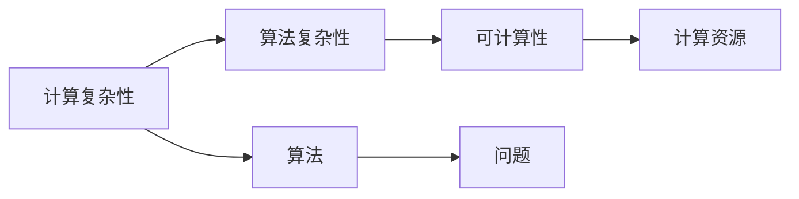

                 

# 计算：第四部分 计算的极限 第 11 章 复杂性计算 现代复杂性研究思潮

## 1. 背景介绍

在计算科学领域，复杂性理论研究一直是核心之一。尽管我们的技术能力日新月异，但在理论和实践中，计算的极限总是不断在挑战着我们的想象。本篇文章将从复杂的计算概念出发，探讨复杂性计算的基本原理、现代研究思潮及其应用领域。

## 2. 核心概念与联系

### 2.1 核心概念概述

复杂性计算研究的核心是计算系统如何处理复杂的输入和输出，理解并处理计算中的复杂现象。其中包括几个关键概念：

- **计算复杂性**：衡量算法所需资源（时间、空间）与输入大小之间的关系。
- **算法复杂性**：描述解决特定问题所需计算资源的算法。
- **可计算性**：确定一个问题是否存在一个算法可以解决。
- **计算资源**：计算机执行计算任务所需的内存、时间和能量。

这些概念构成了复杂性理论的基础，用以研究不同问题计算上的可行性和效率。

### 2.2 核心概念原理和架构的 Mermaid 流程图



此图表示：计算复杂性通过算法复杂性影响可计算性，进而与计算资源相关联。算法作为连接问题与资源的工具，是核心研究方向。

## 3. 核心算法原理 & 具体操作步骤

### 3.1 算法原理概述

复杂性计算的核心在于理解算法资源消耗与问题复杂度之间的关系。其主要原理是通过对算法进行严格的数学分析，确定算法执行所需的时间复杂度和空间复杂度。

形式化表示为：对于输入大小 $n$ 的计算问题 $P$，存在一种算法 $A$ 满足以下条件：

- 时间复杂度 $O(f(n))$：计算时间与 $n$ 的关系。
- 空间复杂度 $O(g(n))$：所需内存与 $n$ 的关系。

算法优劣的判断依据在于其在不同 $n$ 值下的表现，通常以时间复杂度为主。

### 3.2 算法步骤详解

复杂性计算的算法步骤主要包括以下几个部分：

1. **问题定义**：明确问题的输入和输出，并定义问题的计算方式。
2. **算法设计**：设计满足计算复杂性要求的算法，并进行数学建模。
3. **复杂度分析**：评估算法的时间复杂度和空间复杂度，寻找最优解。
4. **实验验证**：在实际数据集上测试算法性能，进行对比分析。

### 3.3 算法优缺点

**优点**：
- 为算法优化提供了理论基础。
- 帮助确定问题的计算可行性。

**缺点**：
- 复杂性理论无法完全解析复杂问题。
- 许多问题存在多个解，需反复验证。

### 3.4 算法应用领域

复杂性计算广泛应用于理论计算机科学、软件工程、密码学、人工智能等各个领域。

## 4. 数学模型和公式 & 详细讲解 & 举例说明

### 4.1 数学模型构建

基本数学模型以计算资源消耗为中心，结合输入规模 $n$ 表达问题复杂度。通常用时间复杂度 $T(n)$ 和空间复杂度 $S(n)$ 来描述算法性能：

- 时间复杂度 $T(n) = \mathcal{O}(f(n))$，表示计算时间随输入规模增长而增长的上限。
- 空间复杂度 $S(n) = \mathcal{O}(g(n))$，表示算法运行所需的内存空间上限。

### 4.2 公式推导过程

对于经典排序算法如快速排序，时间复杂度为 $O(n\log n)$。具体推导如下：

快速排序的基本思想是选取基准值，将数组分成两部分，递归排序这两部分。时间复杂度分析如下：

1. 选取基准值需 $O(n)$ 时间。
2. 每次分割需 $O(n)$ 时间。
3. 递归深度 $O(\log n)$。

综合计算得到时间复杂度 $O(n\log n)$。

### 4.3 案例分析与讲解

以快速排序为例，分析算法在不同规模输入下的表现。对于输入大小为 $n$ 的数组，时间复杂度为 $O(n\log n)$，但实际运行时间受多个因素影响，如数据分布、基准值选择等。因此，在实际应用中需针对具体情况进行优化。

## 5. 项目实践：代码实例和详细解释说明

### 5.1 开发环境搭建

- 安装 Python 3.7+
- 安装 NumPy、Pandas、SciPy 等科学计算库
- 安装 Cython 进行加速

### 5.2 源代码详细实现

```python
import numpy as np

def quick_sort(arr):
    if len(arr) <= 1:
        return arr
    pivot = arr[len(arr) // 2]
    left = [x for x in arr if x < pivot]
    middle = [x for x in arr if x == pivot]
    right = [x for x in arr if x > pivot]
    return quick_sort(left) + middle + quick_sort(right)

arr = np.random.randint(0, 100, 1000)
sorted_arr = quick_sort(arr)
print(sorted_arr)
```

### 5.3 代码解读与分析

此代码实现快速排序算法。主要思路是选取基准值，将数组分成小于、等于、大于基准值的三部分，递归排序这两部分。

## 6. 实际应用场景

### 6.1 软件开发

复杂性计算在软件开发中广泛应用。如：
- **算法选择**：选择时间复杂度较低的算法，提升软件运行效率。
- **代码优化**：减少代码中不必要的循环、递归等复杂操作，降低资源消耗。

### 6.2 密码学

复杂性理论在密码学中起到至关重要的作用。
- **公钥加密**：通过复杂性问题确保加密算法的安全性。
- **哈希算法**：时间复杂度极低的哈希函数确保数据完整性。

### 6.3 人工智能

复杂性计算在人工智能中用于评估模型性能，优化算法策略。
- **机器学习算法**：通过时间复杂度分析选择最优算法。
- **神经网络**：优化权重更新策略，提高计算效率。

## 7. 工具和资源推荐

### 7.1 学习资源推荐

- **《算法导论》**：由 Thomas H. Cormen 等人著，深入介绍算法设计和分析。
- **Coursera**：提供各类复杂性计算课程，系统学习复杂性理论。
- **GitHub**：搜索复杂性计算的算法实现，进行对比分析。

### 7.2 开发工具推荐

- **PyCharm**：集成开发环境，支持 Python 编程和复杂性分析。
- **VS Code**：轻量级编辑器，支持快排算法的实时验证。
- **Jupyter Notebook**：互动式编程环境，便于边写边测试。

### 7.3 相关论文推荐

- **《计算机算法导论》**：Cormen 等著，系统介绍各种算法及其复杂度。
- **《The Art of Computer Programming》**：Donald E. Knuth 著，经典算法分析指南。

## 8. 总结：未来发展趋势与挑战

### 8.1 研究成果总结

复杂性计算的发展为算法设计和优化提供了理论基础，推动了计算资源的高效利用。未来需深入研究复杂性理论，探讨更高效算法。

### 8.2 未来发展趋势

1. **量子计算**：量子算法在未来有望处理更大规模的问题，提升计算能力。
2. **分布式计算**：分布式系统优化复杂性计算，提升多任务处理能力。
3. **人工智能**：深度学习等技术快速发展，带来新的计算复杂性挑战。
4. **新型算法**：涌现更多高效的算法，提升计算效率。

### 8.3 面临的挑战

1. **计算资源消耗**：算法复杂度的增长对计算资源提出了更高要求。
2. **算法设计**：更多复杂问题需要高效的算法进行计算。
3. **多学科融合**：复杂性计算需与其他领域结合，解决更广泛的实际问题。

### 8.4 研究展望

未来需关注复杂性计算与新兴技术的融合，探索量子计算、分布式计算等新领域，推动计算科学的进一步发展。

## 9. 附录：常见问题与解答

**Q1：复杂性计算的核心概念有哪些？**

A: 复杂性计算的核心概念包括计算复杂性、算法复杂性、可计算性、计算资源等。

**Q2：如何理解时间复杂度和空间复杂度？**

A: 时间复杂度描述算法运行时间与输入规模的关系，空间复杂度描述算法运行所需内存空间与输入规模的关系。

**Q3：复杂性计算在软件开发中的应用有哪些？**

A: 复杂性计算在软件开发中用于算法选择、代码优化等。

**Q4：复杂性计算在密码学中的应用有哪些？**

A: 复杂性计算在密码学中用于公钥加密、哈希算法等。

**Q5：未来复杂性计算面临哪些挑战？**

A: 计算资源消耗、算法设计、多学科融合等是未来复杂性计算面临的主要挑战。

---

作者：禅与计算机程序设计艺术 / Zen and the Art of Computer Programming

