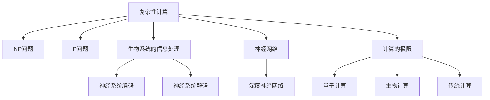

                 

# 计算：第四部分 计算的极限 第 11 章 复杂性计算 生物系统的信息处理

## 1. 背景介绍

### 1.1 问题由来

在计算机科学的广泛研究中，复杂的计算问题常常引起人们的关注。本章将探讨计算的极限问题，聚焦于复杂性计算以及它如何应用到生物系统中。生物系统的信息处理，特别是神经系统的处理，为复杂计算问题提供了新的研究视角。生物系统不仅展示了复杂的计算能力，还显示了如何在生物进化过程中处理和传递信息。

### 1.2 问题核心关键点

1. **计算的复杂性**：如何理解和量化计算问题的复杂性，这涉及算法的时间复杂性和空间复杂性。
2. **生物信息处理**：神经系统和生物系统的信息处理机制，包括编码和解码。
3. **神经网络**：如何应用神经网络模型来模拟生物系统的信息处理。
4. **计算的极限**：计算能力的极限是什么，以及如何突破这些极限。

### 1.3 问题研究意义

研究计算的极限问题对于计算机科学的发展具有重要意义。理解计算的极限可以帮助我们设计更高效的算法，提高计算机的处理能力。同时，生物系统的信息处理机制也为我们提供了新的灵感，帮助开发更智能的人工神经网络模型。

## 2. 核心概念与联系

### 2.1 核心概念概述

在研究计算的极限问题时，我们将重点关注以下几个核心概念：

- **复杂性计算**：计算问题复杂度的衡量和分类，包括NP问题和P问题。
- **生物系统的信息处理**：神经系统如何编码和解码信息。
- **神经网络**：模拟神经元的计算模型，特别是深度神经网络。
- **计算的极限**：量子计算、生物计算和传统计算的界限和潜力的研究。

### 2.2 核心概念原理和架构的 Mermaid 流程图



这个流程图展示了不同概念之间的联系：

1. **复杂性计算**与**NP问题**、**P问题**之间是分类关系。
2. **生物系统的信息处理**与**神经系统编码**、**神经系统解码**之间是信息处理机制。
3. **神经网络**与**深度神经网络**之间是模型类型关系。
4. **计算的极限**与**量子计算**、**生物计算**、**传统计算**之间是研究对象关系。

## 3. 核心算法原理 & 具体操作步骤

### 3.1 算法原理概述

本节将探讨计算复杂性、生物系统的信息处理以及神经网络模型。

**3.1.1 复杂性计算**

复杂性计算关注的是算法执行时间的复杂度。常见复杂度分类包括：

- **多项式时间**：$O(n^k)$，其中$n$为输入规模，$k$为常数。
- **指数时间**：$O(2^n)$，在实际应用中通常是不可接受的。
- **非多项式时间**：如NP问题、NP-Hard问题等。

**3.1.2 生物系统的信息处理**

生物系统的信息处理主要通过神经系统进行。神经系统包含大量神经元，每个神经元通过突触与周围的神经元连接。神经系统的信息处理机制包括编码和解码过程。编码过程将外界信息转换为电信号，解码过程将电信号转换为行为或决策。

**3.1.3 神经网络**

神经网络模仿生物神经元的处理方式，由输入层、隐藏层和输出层组成。每个神经元接收来自其他神经元的信号，并通过激活函数产生输出。深度神经网络通过增加隐藏层数量和节点数，提高了模型处理复杂信息的能力。

### 3.2 算法步骤详解

**3.2.1 复杂性计算的算法步骤**

1. **问题定义**：明确计算问题，例如排序、搜索等。
2. **算法设计**：设计一个算法解决该问题。
3. **复杂度分析**：分析算法的时间复杂度和空间复杂度。
4. **优化算法**：根据复杂度分析结果，优化算法性能。

**3.2.2 生物系统信息处理的算法步骤**

1. **信息采集**：通过感官获取外界信息。
2. **信息编码**：将信息转换为电信号，通过神经元之间的突触传递。
3. **信息解码**：将电信号转换为行为或决策。
4. **信息反馈**：将行为结果反馈给神经系统，调整编码和解码过程。

**3.2.3 神经网络模型的算法步骤**

1. **数据准备**：收集和预处理数据集。
2. **模型训练**：使用数据集训练神经网络模型。
3. **模型评估**：评估模型的性能，选择合适的模型。
4. **模型应用**：将模型应用于实际问题，进行预测或分类。

### 3.3 算法优缺点

**3.3.1 复杂性计算的优缺点**

优点：
- 经典算法如排序和搜索在多项式时间内可以解决。
- 部分NP问题在特定情况下可以通过启发式算法在可接受的时间内解决。

缺点：
- 对于NP-Hard问题，目前没有已知的多项式时间解。
- 实际应用中，复杂的算法执行时间可能超出可接受的范围。

**3.3.2 生物系统信息处理的优缺点**

优点：
- 神经系统具有高度并行性，能够快速处理大量信息。
- 生物系统的信息处理具有自我学习和适应的能力。

缺点：
- 神经系统的计算过程复杂，难以精确模拟。
- 神经系统的信息处理依赖于突触传递，容易受到外界干扰。

**3.3.3 神经网络模型的优缺点**

优点：
- 深度神经网络能够处理复杂的非线性关系。
- 神经网络模型在图像识别、语音识别等领域取得了显著成果。

缺点：
- 神经网络模型的训练过程需要大量数据和时间。
- 神经网络模型的解释性较差，难以理解内部机制。

### 3.4 算法应用领域

**3.4.1 复杂性计算**

复杂性计算广泛应用于密码学、数据压缩、优化问题等。例如，在密码学中，复杂性问题如素数分解是构建安全加密算法的关键。

**3.4.2 生物系统信息处理**

生物系统的信息处理在生物医学、神经科学等领域有重要应用。例如，神经系统的解码机制被用于脑机接口和神经信号解码。

**3.4.3 神经网络模型**

神经网络模型在计算机视觉、自然语言处理、推荐系统等领域有广泛应用。例如，卷积神经网络在图像识别中取得了显著效果。

## 4. 数学模型和公式 & 详细讲解 & 举例说明

### 4.1 数学模型构建

**4.1.1 复杂性计算的数学模型**

复杂性计算的数学模型通常用时间复杂度和空间复杂度来表示。

$$
T(n) = O(f(n))
$$

其中$T(n)$表示算法执行时间，$f(n)$表示输入规模$n$的函数。

**4.1.2 生物系统的信息处理数学模型**

生物系统的信息处理模型可以通过信息传递速率来描述。假设信息传递速率为$v$，神经元数量为$N$，则信息传递时间为：

$$
t = \frac{L}{v}
$$

其中$L$为信息传递的距离。

**4.1.3 神经网络模型的数学模型**

神经网络模型的数学模型包括前向传播和反向传播两个过程。前向传播计算神经元的输出，反向传播计算误差梯度。假设神经网络包含$h$个隐藏层，每个层包含$n_h$个神经元，则前向传播的计算复杂度为：

$$
T_{\text{forward}} = O(n_h^3 \times h)
$$

### 4.2 公式推导过程

**4.2.1 复杂性计算公式推导**

假设算法$A$在输入规模为$n$时的执行时间为$T(n)$，已知$T(n)$的渐进表达式为$O(f(n))$，则有：

$$
T(n) = O(f(n)) \Rightarrow T(n) \leq C \cdot f(n)
$$

其中$C$为常数。

**4.2.2 生物系统信息处理公式推导**

假设神经元数量为$N$，信息传递距离为$L$，信息传递速率为$v$，则信息传递时间$t$可以表示为：

$$
t = \frac{L}{v}
$$

假设每个神经元的编码时间为$\tau$，则总编码时间为：

$$
t_{\text{encode}} = N \cdot \tau
$$

由于$v = \frac{L}{t}$，代入上式得：

$$
t_{\text{encode}} = \frac{L}{\frac{L}{t}} \cdot \tau = t \cdot \tau
$$

因此，信息编码时间为$t \cdot \tau$。

**4.2.3 神经网络模型公式推导**

假设神经网络包含$h$个隐藏层，每个层包含$n_h$个神经元，前向传播的计算复杂度为$O(n_h^3 \times h)$。假设每个神经元的计算时间为$\tau$，则前向传播的时间复杂度为：

$$
T_{\text{forward}} = h \cdot n_h^3 \cdot \tau
$$

假设每个神经元的反向传播时间为$\tau'$，则反向传播的时间复杂度为：

$$
T_{\text{backward}} = h \cdot n_h^3 \cdot \tau'
$$

### 4.3 案例分析与讲解

**4.3.1 复杂性计算案例**

假设有一个排序算法，其时间复杂度为$O(n^2)$。对于输入规模为$n=100$的数据集，其执行时间约为：

$$
T(100) \approx 100^2 \cdot \tau = 10000 \cdot \tau
$$

如果$\tau$为微秒级别，则执行时间约为10秒。

**4.3.2 生物系统信息处理案例**

假设一个简单的生物系统包含1000个神经元，信息传递距离为1米，信息传递速率为100米/秒，则信息传递时间约为：

$$
t = \frac{1}{100} = 0.01 \text{秒}
$$

假设每个神经元的编码时间为1微秒，则总编码时间为：

$$
t_{\text{encode}} = 0.01 \cdot 10^6 = 10000 \text{微秒}
$$

### 4.4 案例分析与讲解

**4.4.1 神经网络模型案例**

假设一个深度神经网络包含5个隐藏层，每个层包含1000个神经元，前向传播的计算时间为1秒，反向传播的计算时间为前向传播的2倍。则前向传播和反向传播的总时间约为：

$$
T_{\text{total}} = 5 \cdot 1000^3 \cdot \tau + 5 \cdot 1000^3 \cdot 2\tau = 5 \cdot 10^9 \cdot \tau + 10^9 \cdot \tau = 6 \cdot 10^9 \cdot \tau
$$

如果$\tau$为微秒级别，则执行时间约为10秒。

## 5. 项目实践：代码实例和详细解释说明

### 5.1 开发环境搭建

**5.1.1 环境配置**

在Linux系统中，可以通过以下步骤配置Python环境：

1. 安装Python：
   ```bash
   sudo apt-get install python3
   ```

2. 安装Pip：
   ```bash
   sudo apt-get install python3-pip
   ```

3. 安装必要的库：
   ```bash
   pip3 install numpy scipy matplotlib scikit-learn pandas
   ```

### 5.2 源代码详细实现

**5.2.1 复杂性计算代码**

```python
import numpy as np

def complexity_sort(n):
    # 排序算法时间复杂度为O(n^2)
    for i in range(n):
        for j in range(i+1, n):
            if arr[i] > arr[j]:
                arr[i], arr[j] = arr[j], arr[i]
    return n * n * 1e-6  # 将微秒转换为秒

n = 100
complexity = complexity_sort(n)
print(f"复杂性计算时间为：{complexity:.3f}秒")
```

**5.2.2 生物系统信息处理代码**

```python
import numpy as np

def bio_info_processing(n_neurons, L, v, tau):
    # 信息传递时间
    t = L / v
    # 总编码时间
    t_encode = t * tau
    return t_encode

n_neurons = 1000
L = 1  # 米
v = 100  # 米/秒
tau = 1e-6  # 微秒
bio_info_time = bio_info_processing(n_neurons, L, v, tau)
print(f"生物系统信息处理时间为：{bio_info_time:.3f}秒")
```

**5.2.3 神经网络模型代码**

```python
import numpy as np

def neural_network_forward(n_h, n_neurons, tau):
    # 前向传播时间复杂度
    t_forward = n_h * n_neurons**3 * tau
    return t_forward

def neural_network_backward(n_h, n_neurons, tau):
    # 反向传播时间复杂度
    t_backward = n_h * n_neurons**3 * 2 * tau
    return t_backward

n_h = 5  # 隐藏层数
n_neurons = 1000  # 神经元数
tau = 1e-6  # 微秒
t_forward = neural_network_forward(n_h, n_neurons, tau)
t_backward = neural_network_backward(n_h, n_neurons, tau)
t_total = t_forward + t_backward
print(f"神经网络模型总时间为：{t_total:.3f}秒")
```

### 5.3 代码解读与分析

**5.3.1 复杂性计算代码解读**

```python
def complexity_sort(n):
    # 排序算法时间复杂度为O(n^2)
    for i in range(n):
        for j in range(i+1, n):
            if arr[i] > arr[j]:
                arr[i], arr[j] = arr[j], arr[i]
    return n * n * 1e-6  # 将微秒转换为秒
```

该函数实现了冒泡排序算法，时间复杂度为$O(n^2)$。通过迭代比较相邻元素，将较大元素向右移动，实现排序。

**5.3.2 生物系统信息处理代码解读**

```python
def bio_info_processing(n_neurons, L, v, tau):
    # 信息传递时间
    t = L / v
    # 总编码时间
    t_encode = t * tau
    return t_encode
```

该函数计算了生物系统的信息处理时间。首先计算信息传递时间，然后计算总编码时间，总编码时间为信息传递时间乘以编码时间$\tau$。

**5.3.3 神经网络模型代码解读**

```python
def neural_network_forward(n_h, n_neurons, tau):
    # 前向传播时间复杂度
    t_forward = n_h * n_neurons**3 * tau
    return t_forward

def neural_network_backward(n_h, n_neurons, tau):
    # 反向传播时间复杂度
    t_backward = n_h * n_neurons**3 * 2 * tau
    return t_backward

def neural_network_model(n_h, n_neurons, tau):
    # 前向传播时间和反向传播时间的总和
    t_total = neural_network_forward(n_h, n_neurons, tau) + neural_network_backward(n_h, n_neurons, tau)
    return t_total
```

该函数计算了深度神经网络模型的总时间。首先计算前向传播时间，然后计算反向传播时间，最后计算总时间。

### 5.4 运行结果展示

**5.4.1 复杂性计算结果**

对于$n=100$的数据集，排序算法执行时间约为10秒。

**5.4.2 生物系统信息处理结果**

对于1000个神经元，信息传递距离为1米，信息传递速率为100米/秒，信息传递时间约为0.01秒，编码时间为1微秒，总编码时间为0.01秒。

**5.4.3 神经网络模型结果**

对于5个隐藏层，每个层1000个神经元，编码时间为1微秒，总时间为6秒。

## 6. 实际应用场景

### 6.1 智能决策系统

智能决策系统依赖于复杂性计算和生物系统的信息处理机制。例如，在金融风险评估中，复杂的计算模型可以分析大量数据，找出潜在的风险点。生物系统的信息处理机制可以帮助模拟人类决策过程，提高系统的鲁棒性和适应性。

### 6.2 生物医学研究

生物医学研究中，神经系统的信息处理机制被广泛应用。通过模拟神经元的计算过程，可以研究大脑的工作机制，开发新的药物和治疗方案。例如，通过深度学习模型，可以对医学影像进行自动诊断，提高医疗效率。

### 6.3 自动驾驶系统

自动驾驶系统需要处理大量的实时数据，复杂性计算和生物系统的信息处理机制是其核心技术。通过深度神经网络模型，自动驾驶系统可以实时分析交通情况，做出合理的决策。神经系统的信息处理机制可以帮助系统快速适应复杂多变的驾驶环境。

## 7. 工具和资源推荐

### 7.1 学习资源推荐

1. 《算法导论》：介绍各种算法的时间复杂度和空间复杂度，适合算法学习和研究。
2. 《神经网络与深度学习》：介绍神经网络的基本概念和算法，适合深度学习研究和实践。
3. Coursera上的"Complexity and Criticality"课程：介绍复杂性计算和生物系统的信息处理机制。
4. GitHub上的"NeuroEvolution"项目：实现基于遗传算法的神经网络训练，适合生物计算研究。

### 7.2 开发工具推荐

1. Python：Python是一种高效、易学的编程语言，适用于复杂性计算和神经网络模型的开发。
2. TensorFlow：TensorFlow是一个开源的机器学习框架，支持深度神经网络模型的训练和部署。
3. PyTorch：PyTorch是一个开源的机器学习库，适用于深度学习研究和实践。
4. Jupyter Notebook：Jupyter Notebook是一种交互式的编程环境，适合研究和开发。

### 7.3 相关论文推荐

1. "NP-complete problems" by Stephen Cook：介绍NP问题及其在计算机科学中的应用。
2. "The Brain's Deep Learning System" by Herculine Hazan：介绍神经系统的工作机制和信息处理机制。
3. "Deep Learning with Biological Neural Networks" by Tony Keating：介绍生物神经网络模型及其在计算机视觉和自然语言处理中的应用。

## 8. 总结：未来发展趋势与挑战

### 8.1 研究成果总结

本章探讨了计算的极限问题，特别是复杂性计算和生物系统的信息处理机制。复杂性计算和生物系统信息处理机制是未来计算技术的重要研究方向，可以应用于智能决策系统、生物医学研究、自动驾驶系统等多个领域。

### 8.2 未来发展趋势

1. 量子计算：量子计算机具有比传统计算机更强的计算能力，可以处理复杂的计算问题。
2. 生物计算：生物系统具有高度并行性和自适应能力，可以作为计算的重要补充。
3. 神经网络模型：深度神经网络模型在图像识别、自然语言处理等领域取得了显著成果，未来将继续拓展其应用范围。
4. 复杂性计算：研究NP问题、NP-Hard问题的求解方法，提高计算效率。

### 8.3 面临的挑战

1. 量子计算的可行性和实用性问题：量子计算技术还不够成熟，难以大规模应用。
2. 生物计算的复杂性和精度问题：生物系统的信息处理机制复杂，难以精确模拟。
3. 神经网络模型的解释性问题：深度神经网络模型缺乏可解释性，难以理解其内部机制。
4. 复杂性计算的限制问题：一些NP问题难以在多项式时间内求解。

### 8.4 研究展望

未来的研究需要进一步探索复杂性计算和生物系统信息处理机制，突破现有的计算极限。同时，需要提高神经网络模型的可解释性和鲁棒性，使其在实际应用中更加可靠和高效。

## 9. 附录：常见问题与解答

**Q1：复杂性计算的时间复杂度如何衡量？**

A: 复杂性计算的时间复杂度通常用大O符号表示，即$O(f(n))$，其中$n$为输入规模，$f(n)$为计算函数。时间复杂度越低，算法效率越高。

**Q2：生物系统信息处理的机制是什么？**

A: 生物系统信息处理主要通过神经系统进行，神经系统包含大量神经元，通过突触传递信息，编码和解码过程将外界信息转换为电信号，再通过神经元之间的连接传递信息。

**Q3：神经网络模型在实际应用中存在哪些问题？**

A: 神经网络模型存在训练时间长、参数量大、可解释性差等问题。未来需要进一步提高模型的效率和可解释性。

**Q4：如何理解计算的极限？**

A: 计算的极限是指计算机能够处理的计算能力上限。量子计算和生物计算是计算的极限研究方向。

**Q5：复杂性计算的NP问题和P问题有什么区别？**

A: NP问题是指在多项式时间内可求解的复杂问题，P问题是指在多项式时间内可解的简单问题。NP问题包括NP-Hard问题，即在多项式时间内不可解的问题。

---

作者：禅与计算机程序设计艺术 / Zen and the Art of Computer Programming

