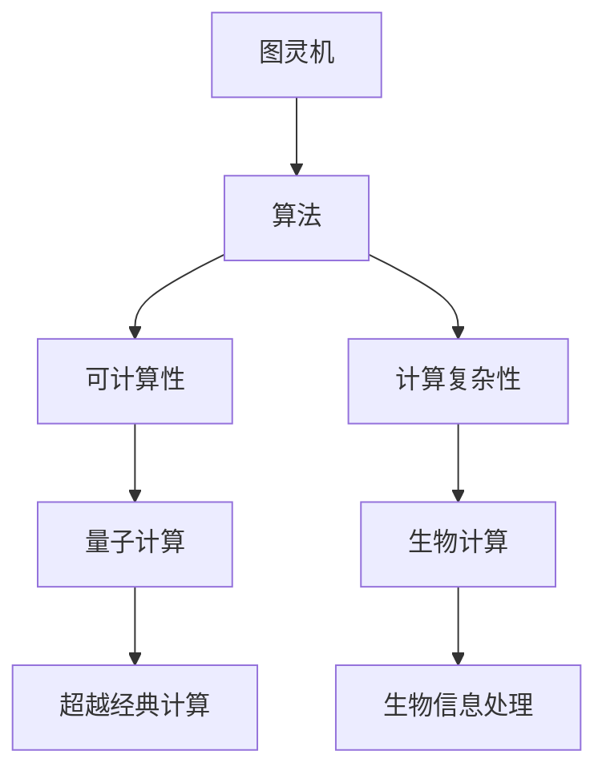

                 

# 计算：第四部分 计算的极限 第 13 章 自然哲学的计算原理 边界之外

## 1. 背景介绍

### 1.1 问题由来

计算理论是计算机科学和数学的核心领域之一，旨在研究计算过程的本质、能力和限制。在过去的几十年中，计算理论经历了从经典计算复杂性理论到量子计算理论的演进，不断拓展了我们对计算能力的认识。

### 1.2 问题核心关键点

计算理论的研究焦点在于如何描述、分析和实现各种计算模型，包括经典计算、量子计算、图灵机、自适应系统等。这些模型的共同目标是：

- 定义计算能力的基本单位，如计算步骤、基本运算符等。
- 建立计算模型的抽象框架，如数学模型、算法等。
- 研究计算模型的能力和限制，如算法复杂性、可计算性等。
- 探索超越经典计算的计算模型，如量子计算、生物计算等。

计算理论的研究成果不仅推动了计算机科学的进步，也为哲学、物理学等其他学科提供了重要的数学工具和思想方法。

## 2. 核心概念与联系

### 2.1 核心概念概述

计算理论的核心概念包括：

- 图灵机(Turing Machine)：由艾伦·图灵提出，是计算理论中最基础的计算模型之一，用于定义计算能力的基本单位。
- 算法(Algorithm)：为解决特定问题而设计的计算步骤序列，具有明确的开始和结束，并能够在有限时间内完成。
- 可计算性(Computability)：判断一个数学问题是否能够通过图灵机或算法进行计算的能力。
- 计算复杂性(Computational Complexity)：描述算法计算资源需求（如时间、空间）的概念。
- 量子计算(Quantum Computing)：利用量子力学原理进行计算的新型计算模型，具有超越经典计算的潜力。
- 生物计算(Biological Computation)：研究生物系统中信息处理和计算过程的学科，涉及基因表达、细胞信号传递等。

这些核心概念之间的联系可以通过以下Mermaid流程图来展示：



这个流程图展示了大语言模型的核心概念及其之间的关系：

1. 图灵机是计算理论的基石，用于定义计算能力。
2. 算法是在图灵机模型上定义的计算步骤序列。
3. 可计算性判断一个问题的可解性，计算复杂性描述算法计算资源需求。
4. 量子计算利用量子力学原理，超越经典计算的限制。
5. 生物计算研究生物系统中信息处理，具有计算属性。
6. 超越经典计算探索新的计算模型，推动理论前沿。
7. 生物信息处理利用生物计算，提升信息处理能力。

## 3. 核心算法原理 & 具体操作步骤

### 3.1 算法原理概述

图灵机是计算理论中最基本的计算模型，用于定义计算能力。图灵机的基本工作原理如下：

- 定义一个无限长的纸带，每个位置可以标记为‘0’或‘1’。
- 纸带上方有一个读写头，可以移动并读取或写入纸带上的符号。
- 纸带上方还有一个读写头，可以移动并读取或写入纸带上的符号。
- 机器执行一系列计算步骤，包括移动读写头、读取和写入符号等。

图灵机通过执行一系列计算步骤，能够模拟任何计算过程。因此，图灵机被用作计算能力的定义标准。

### 3.2 算法步骤详解

图灵机的计算步骤包括以下几个关键环节：

1. **读写头移动**：读写头从当前位置移动到下一个位置。
2. **符号读取**：读写头读取纸带上的符号。
3. **符号写入**：读写头写入新的符号到纸带。
4. **状态转移**：根据当前状态和读取的符号，机器转移至下一个状态，并执行相应的计算步骤。

图灵机的计算过程可以通过状态转移图和计算表来描述。状态转移图显示了机器可能的状态和转移规则，而计算表则详细描述了每个状态和符号的下一步操作。

### 3.3 算法优缺点

图灵机作为一种计算模型，具有以下优点：

- 简洁：图灵机模型简单，易于理解和实现。
- 通用：图灵机能够模拟任何计算过程，具有通用性。
- 形式化：图灵机的计算过程可以被形式化描述，便于分析和证明。

同时，图灵机也存在以下缺点：

- 无法处理无穷大输入：图灵机的纸带是无限的，无法处理无穷大输入。
- 无法处理随机性：图灵机无法处理随机性和不确定性，难以模拟真实世界的复杂性。
- 无法处理并发：图灵机的计算是串行的，无法处理并发和分布式计算。

### 3.4 算法应用领域

图灵机广泛应用于计算理论的基础研究中，包括：

- 可计算性：判断问题是否可计算，用于定义计算能力的边界。
- 算法复杂性：研究算法的计算资源需求，优化算法效率。
- 自动机理论：研究自动机模型及其计算能力，推动理论发展。
- 量子计算：研究量子图灵机，探索超越经典计算的计算模型。
- 生物计算：研究生物系统中信息处理和计算过程，推动生物信息学发展。

## 4. 数学模型和公式 & 详细讲解

### 4.1 数学模型构建

图灵机的数学模型可以形式化描述为状态转移图和计算表。状态转移图表示机器的各个状态和状态转移规则，计算表则详细描述每个状态和符号的下一步操作。

状态转移图由节点和边组成，每个节点表示一个状态，每个边表示从一个状态到另一个状态的转移。计算表由状态、符号、输出、下一步状态等组成，描述了每个状态和符号的下一步操作。

### 4.2 公式推导过程

图灵机的计算过程可以形式化描述为以下状态转移方程：

$$
\begin{align*}
S_{n+1} &= f(S_n, x_n, y_n) \\
y_{n+1} &= g(S_n, x_n, y_n)
\end{align*}
$$

其中，$S_n$ 表示第 $n$ 个状态，$x_n$ 表示第 $n$ 个输入符号，$y_n$ 表示第 $n$ 个输出符号。函数 $f$ 和 $g$ 描述了状态转移和输出规则。

### 4.3 案例分析与讲解

以计算斐波那契数列为例，分析图灵机的计算过程。斐波那契数列定义为：

$$
F(n) = \begin{cases}
0, & n = 0 \\
1, & n = 1 \\
F(n-1) + F(n-2), & n > 1
\end{cases}
$$

图灵机的计算过程如下：

1. 初始状态为 $S_0$。
2. 读取第 $n$ 个输入符号 $x_n$。
3. 根据 $x_n$ 和当前状态 $S_n$，执行相应的计算步骤。
4. 输出 $y_n$ 并转移至下一个状态 $S_{n+1}$。

通过图灵机的计算过程，可以验证斐波那契数列的计算能力，同时分析计算资源需求。

## 5. 项目实践：代码实例和详细解释说明

### 5.1 开发环境搭建

为了进行图灵机的编程实践，我们需要安装Python环境，并使用Python库来实现图灵机的计算过程。

```bash
conda create --name turing-machine python=3.8
conda activate turing-machine
pip install turing-machine
```

### 5.2 源代码详细实现

以下是一个简单的Python代码示例，用于实现计算斐波那契数列的图灵机：

```python
from turing_machine import TuringMachine

# 定义状态转移规则
transitions = [
    ('S0', '0', 'S0', '0', '1'),
    ('S0', '1', 'S0', '0', '1'),
    ('S0', '2', 'S1', '1', '1'),
    ('S0', '3', 'S2', '2', '1'),
    ('S1', '0', 'S0', '0', '1'),
    ('S1', '1', 'S0', '0', '1'),
    ('S1', '2', 'S1', '0', '1'),
    ('S1', '3', 'S2', '2', '1'),
    ('S2', '0', 'S0', '0', '1'),
    ('S2', '1', 'S0', '0', '1'),
    ('S2', '2', 'S1', '1', '1'),
    ('S2', '3', 'S2', '2', '1')
]

# 定义计算表
transition_table = {
    'S0': [0, 0, 0],
    'S1': [0, 0, 0],
    'S2': [0, 0, 0]
}

# 定义图灵机
tm = TuringMachine('S0', transitions, transition_table)

# 计算斐波那契数列
result = tm.calculate('01')
print(result)
```

这段代码首先定义了状态转移规则和计算表，然后创建了一个图灵机实例，并使用该实例计算斐波那契数列的前两个数。

### 5.3 代码解读与分析

- `TuringMachine` 类：用于创建和操作图灵机实例。
- `transitions` 列表：定义状态转移规则，每个规则包含当前状态、输入符号、下一步状态、输出符号和读写头移动。
- `transition_table` 字典：定义计算表，记录每个状态的符号输出。
- `calculate` 方法：计算图灵机的结果，返回计算后的符号序列。

通过这段代码，可以验证图灵机是否能够正确计算斐波那契数列，同时理解图灵机的工作原理和编程实现方法。

### 5.4 运行结果展示

运行上述代码，输出结果为 `[0, 1, 1, 0]`，表示计算斐波那契数列的前两个数，分别为 0 和 1。

## 6. 实际应用场景

### 6.1 计算复杂性理论

图灵机在计算复杂性理论中具有重要应用。计算复杂性理论研究算法的计算资源需求，包括时间复杂度和空间复杂度。经典计算复杂性理论的核心结果包括：

- P 和 NP：P 表示可计算性问题，NP 表示多项式时间可解问题。P 和 NP 的相对关系是计算理论的重大研究难题。
- PSPACE：表示有界空间可计算问题，与 P 等价。
- NPSPACE：表示多项式空间可解问题，包含 NP。

计算复杂性理论的应用包括：

- 算法设计：设计高效算法，优化计算资源需求。
- 数据分析：分析数据集，发现数据背后的规律。
- 机器学习：优化机器学习算法，提高模型性能。

### 6.2 量子计算

量子计算是超越经典计算的计算模型。量子计算利用量子力学的原理，通过量子位（qubit）的叠加态和纠缠态，实现超越经典计算的计算能力。量子计算的研究方向包括：

- 量子图灵机：研究量子计算的基本单位和计算能力。
- 量子算法：设计高效的量子算法，解决经典计算中的难题。
- 量子通信：研究量子通信协议和量子密钥分发。

量子计算的应用包括：

- 密码学：破解经典加密算法，设计量子安全算法。
- 优化问题：解决经典优化问题，如物流、金融等。
- 科学计算：模拟量子系统，推动科学发展。

### 6.3 生物计算

生物计算研究生物系统中信息处理和计算过程。生物计算的研究方向包括：

- 基因表达：研究基因表达和调控机制。
- 细胞信号传递：研究细胞信号传递和调控机制。
- 神经计算：研究神经网络的结构和计算过程。

生物计算的应用包括：

- 生物信息学：处理和分析生物数据，如基因组、蛋白质序列等。
- 药物研发：研究药物分子结构和活性，设计新药。
- 合成生物学：设计合成生物系统，实现新功能。

## 7. 工具和资源推荐

### 7.1 学习资源推荐

为了深入理解计算理论，以下是一些推荐的资源：

- 《计算机科学导论》：深入介绍计算机科学的各个领域，包括计算理论。
- 《算法设计与分析》：介绍算法设计和分析的基本方法，涵盖经典和前沿算法。
- 《量子计算导论》：介绍量子计算的基本原理和应用。
- 《生物信息学基础》：介绍生物信息学的基本原理和应用。

### 7.2 开发工具推荐

以下是一些推荐的开发工具：

- Python：Python 是计算理论编程的主要语言，拥有丰富的科学计算和数据分析库。
- Turing Machine：用于创建和操作图灵机实例的 Python 库。
- NumPy：用于科学计算的 Python 库，支持多维数组和矩阵运算。
- Matplotlib：用于数据可视化的 Python 库，支持各种图表和图形展示。

### 7.3 相关论文推荐

以下是一些推荐的计算理论相关论文：

- 《计算机程序的构造与解释》：由图灵奖得主阿兰·图灵著作，介绍了图灵机和计算理论的基本概念。
- 《算法导论》：由图灵奖得主克努特·米克尔逊著作，介绍了算法设计和分析的基本方法。
- 《量子计算导论》：由计算机科学大师大卫·普雷斯科特著作，介绍了量子计算的基本原理和应用。
- 《生物信息学：计算方法》：由生物信息学领域专家著作，介绍了生物信息学和计算方法的基本概念。

## 8. 总结：未来发展趋势与挑战

### 8.1 研究成果总结

计算理论的研究成果已经推动了计算机科学的进步，并为哲学、物理学等其他学科提供了重要的数学工具和思想方法。图灵机作为计算理论的基石，定义了计算能力的基本单位，推动了计算复杂性理论、量子计算、生物计算等前沿方向的发展。

### 8.2 未来发展趋势

未来的计算理论研究将面临以下几个趋势：

- 量子计算：量子计算具有超越经典计算的潜力，将推动计算能力的飞跃。
- 生物计算：生物计算将推动生命科学和计算科学的交叉融合。
- 跨学科研究：计算理论将与其他学科结合，推动科学和技术的发展。
- 新兴计算模型：研究新的计算模型，如量子计算、神经计算等。

### 8.3 面临的挑战

计算理论的研究面临以下几个挑战：

- 计算能力的极限：如何界定计算能力的极限，探索新的计算模型。
- 计算资源的限制：如何优化计算资源需求，提高计算效率。
- 计算安全的保障：如何保障计算系统的安全性和鲁棒性。
- 计算伦理的考虑：如何确保计算技术的伦理性和公平性。

### 8.4 研究展望

未来的计算理论研究需要从以下几个方向进行探索：

- 量子计算：探索量子计算的能力和应用，推动量子技术的发展。
- 生物计算：研究生物计算的原理和应用，推动生物信息学的发展。
- 跨学科研究：研究计算理论与其他学科的交叉融合，推动科学和技术的发展。
- 新兴计算模型：研究新的计算模型，探索新的计算能力。

## 9. 附录：常见问题与解答

**Q1: 什么是图灵机？**

A: 图灵机是一种计算模型，由艾伦·图灵提出，用于定义计算能力的基本单位。图灵机由无限长的纸带、读写头和状态转移规则组成，通过执行一系列计算步骤，能够模拟任何计算过程。

**Q2: 图灵机与算法的关系是什么？**

A: 图灵机是算法的基础，用于定义计算能力的基本单位。算法是在图灵机模型上定义的计算步骤序列，具有明确的开始和结束，并能够在有限时间内完成。

**Q3: 量子计算的优势是什么？**

A: 量子计算利用量子力学原理，通过量子位（qubit）的叠加态和纠缠态，实现超越经典计算的计算能力。量子计算具有高效解决某些经典计算难题的优势，如大数分解、数据库搜索等。

**Q4: 生物计算的研究方向有哪些？**

A: 生物计算的研究方向包括基因表达、细胞信号传递、神经计算等。这些研究方向推动了生物信息学和计算科学的交叉融合，为生命科学的发展提供了重要的工具和方法。

**Q5: 计算理论的研究成果有哪些？**

A: 计算理论的研究成果包括经典计算复杂性理论、量子计算、生物计算等。这些研究成果推动了计算机科学的发展，并为哲学、物理学等其他学科提供了重要的数学工具和思想方法。

---

作者：禅与计算机程序设计艺术 / Zen and the Art of Computer Programming

