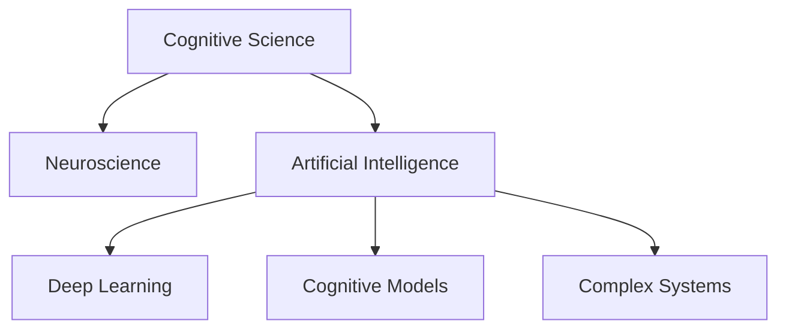

                 

# 认知发展中的浅薄与复杂变化

> 关键词：认知科学,神经科学,人工智能,深度学习,算法优化,模型训练,认知变化,复杂系统

## 1. 背景介绍

### 1.1 问题由来

随着现代科技的迅猛发展，人工智能（AI）和大数据技术已经广泛应用于各个领域。人们对于认知科学的研究，从个体认知，扩展到群体认知，进而深入到复杂系统的认知过程。认知发展理论不仅是科学发展的必然趋势，也催生了许多创新的AI算法和应用。然而，随着认知模型和AI系统的日渐复杂化，其背后蕴含的知识也愈发显得浅薄，这引发了公众的关注和思考。

### 1.2 问题核心关键点

本文聚焦于“认知发展中的浅薄与复杂变化”，通过研究AI算法和模型，探讨其在处理复杂任务时的限制和改进策略。该问题可以从以下几个方面进行详细描述：

- **浅薄认知的起因**：探讨AI算法在处理复杂任务时存在的不足之处。
- **复杂系统的挑战**：分析认知模型和AI系统在面对复杂任务时的困难。
- **算法改进策略**：提出改善AI算法在复杂任务处理中浅薄认知的策略。
- **实际应用场景**：展示AI算法在实际应用中如何应对认知浅薄与复杂变化。

## 2. 核心概念与联系

### 2.1 核心概念概述

为更好地理解认知发展中的浅薄与复杂变化，本节将介绍几个密切相关的核心概念：

- **认知科学**：研究人类认知过程和认知能力的科学领域。
- **神经科学**：研究神经系统和大脑功能的科学。
- **人工智能**：基于算法和计算机程序，让机器模拟人类智能的科学和技术。
- **深度学习**：一种基于神经网络的学习算法，通过多层次的非线性处理，实现复杂的模式识别和决策。
- **认知模型**：用于模拟人类认知过程的计算机模型。
- **复杂系统**：指包含多个相互作用元素的、非线性的、动态变化的系统，如生态系统、金融市场、神经网络等。

这些核心概念之间的逻辑关系可以通过以下Mermaid流程图来展示：



这个流程图展示了几大核心概念之间的联系：

1. 认知科学与神经科学相辅相成，共同构建人类认知模型。
2. 人工智能以深度学习为基础，发展认知模型。
3. 认知模型应用于复杂系统，解决实际问题。

## 3. 核心算法原理 & 具体操作步骤
### 3.1 算法原理概述

认知科学和AI的算法，常常在处理复杂任务时面临浅薄的认知问题。这是因为这些算法基于简化模型，难以捕捉到复杂系统中的非线性特性和动态变化。以深度学习算法为例，其核心思想是通过多层神经网络的非线性变换，抽取输入数据的高级特征，实现复杂的分类和预测。

### 3.2 算法步骤详解

处理复杂任务的深度学习算法步骤主要包括：

1. **数据预处理**：对输入数据进行标准化、归一化等预处理操作。
2. **网络构建**：设计并构建多层神经网络结构，通常包含多个隐藏层和输出层。
3. **参数初始化**：随机初始化网络中的权重和偏置，以便网络能够捕捉到不同的特征。
4. **训练过程**：使用反向传播算法，通过梯度下降优化损失函数，不断调整网络参数，使模型在训练数据上表现更佳。
5. **测试与验证**：在测试集上评估模型性能，通过交叉验证等技术，避免过拟合现象。

### 3.3 算法优缺点

深度学习算法在处理复杂任务时具有以下优点：

- **高精度**：通过多层次的特征提取和变换，能够实现高精度的分类和预测。
- **自动学习**：能够自动地学习输入数据的特征表示，无需手动提取特征。
- **应用广泛**：在图像识别、语音识别、自然语言处理等领域具有广泛的应用前景。

然而，该算法也存在以下缺点：

- **数据依赖**：需要大量标注数据，数据分布的偏差可能导致模型泛化性能不足。
- **计算资源消耗大**：深度学习模型参数量庞大，训练和推理过程需要大量计算资源。
- **模型难以解释**：神经网络的“黑盒”特性，难以理解其内部工作机制。
- **过度拟合**：网络复杂度过高可能导致过拟合，影响模型的泛化能力。

### 3.4 算法应用领域

深度学习算法在许多实际应用领域中已取得显著进展：

- **计算机视觉**：图像识别、目标检测、人脸识别等任务。
- **自然语言处理**：机器翻译、情感分析、文本生成等任务。
- **语音识别**：语音转文本、语音指令识别等任务。
- **游戏与机器人**：自动博弈、机器人导航、智能推荐等任务。
- **生物信息学**：基因序列分析、蛋白质结构预测等任务。

以上应用领域展示了深度学习算法的强大潜力，但在处理复杂任务时，这些算法依然面临浅薄的认知问题。因此，对算法进行改进和优化，提升其在复杂任务中的表现，是一个亟待解决的问题。

## 4. 数学模型和公式 & 详细讲解 & 举例说明

### 4.1 数学模型构建

深度学习算法主要基于神经网络模型，通常包括输入层、隐藏层和输出层。输入层接收原始数据，隐藏层进行特征提取，输出层产生最终结果。以卷积神经网络（CNN）为例，其核心模型结构如图：

```
              Input Layer
                  |
                  v
              Conv Layer
                  |
                  v
              Pooling Layer
                  |
                  v
            Feature Map
                  |
                  v
              Fully Connected Layer
                  |
                  v
              Softmax Layer
                  |
                  v
             Output Layer
```

### 4.2 公式推导过程

假设输入数据为 $\boldsymbol{x}$，输出为 $\boldsymbol{y}$。设神经网络包含 $L$ 层，第 $l$ 层有 $n_l$ 个神经元。第 $l$ 层的激活函数为 $f$，第 $l$ 层的权重矩阵为 $\boldsymbol{W}_l$，偏置向量为 $\boldsymbol{b}_l$，则第 $l$ 层的输出为：

$$
\boldsymbol{z}_l=f(\boldsymbol{W}_l\boldsymbol{a}_{l-1}+\boldsymbol{b}_l)
$$

其中 $\boldsymbol{a}_{l-1}$ 为第 $l-1$ 层的输出。

损失函数通常为交叉熵损失函数，其定义如下：

$$
\mathcal{L}=-\frac{1}{N}\sum_{i=1}^N\sum_{j=1}^C y_{ij}\log\hat{y}_{ij}+(1-y_{ij})\log(1-\hat{y}_{ij})
$$

其中 $y_{ij}$ 为第 $i$ 个样本的第 $j$ 个标签，$\hat{y}_{ij}$ 为模型预测的第 $i$ 个样本的第 $j$ 个类别概率。

### 4.3 案例分析与讲解

以图像分类任务为例，假设输入图片为 $28\times28$ 的灰度图像，输出为10个类别标签。设神经网络包含两个卷积层和两个池化层，最后一层为全连接层。输入图片通过第一层卷积后，得到 $28\times28\times64$ 的特征图。经过第一个池化层后，特征图缩小为 $14\times14\times64$。通过第二个卷积层和池化层后，特征图大小进一步缩小为 $7\times7\times128$。最后通过全连接层，得到10个类别概率的输出。

## 5. 项目实践：代码实例和详细解释说明

### 5.1 开发环境搭建

在进行深度学习项目实践前，我们需要准备好开发环境。以下是使用Python进行TensorFlow开发的环境配置流程：

1. 安装Anaconda：从官网下载并安装Anaconda，用于创建独立的Python环境。

2. 创建并激活虚拟环境：
```bash
conda create -n tensorflow-env python=3.8 
conda activate tensorflow-env
```

3. 安装TensorFlow：根据CUDA版本，从官网获取对应的安装命令。例如：
```bash
conda install tensorflow -c tensorflow -c conda-forge
```

4. 安装各类工具包：
```bash
pip install numpy pandas scikit-learn matplotlib tqdm jupyter notebook ipython
```

完成上述步骤后，即可在`tensorflow-env`环境中开始深度学习项目实践。

### 5.2 源代码详细实现

这里我们以图像分类任务为例，给出使用TensorFlow对CNN模型进行训练的Python代码实现。

首先，定义模型和优化器：

```python
import tensorflow as tf
from tensorflow.keras import datasets, layers, models

# 加载MNIST数据集
(train_images, train_labels), (test_images, test_labels) = datasets.mnist.load_data()

# 对输入数据进行归一化处理
train_images = train_images / 255.0
test_images = test_images / 255.0

# 构建卷积神经网络模型
model = models.Sequential()
model.add(layers.Conv2D(32, (3, 3), activation='relu', input_shape=(28, 28, 1)))
model.add(layers.MaxPooling2D((2, 2)))
model.add(layers.Conv2D(64, (3, 3), activation='relu'))
model.add(layers.MaxPooling2D((2, 2)))
model.add(layers.Conv2D(64, (3, 3), activation='relu'))
model.add(layers.Flatten())
model.add(layers.Dense(64, activation='relu'))
model.add(layers.Dense(10))

# 编译模型，指定优化器和损失函数
model.compile(optimizer='adam',
              loss=tf.keras.losses.SparseCategoricalCrossentropy(from_logits=True),
              metrics=['accuracy'])

# 训练模型
history = model.fit(train_images, train_labels, epochs=10, 
                    validation_data=(test_images, test_labels))
```

### 5.3 代码解读与分析

让我们再详细解读一下关键代码的实现细节：

**CNN模型**：
- 定义模型结构：包含多个卷积层、池化层和全连接层。
- 激活函数：采用ReLU激活函数，以引入非线性变换。
- 优化器：使用Adam优化器，更新模型参数。
- 损失函数：采用交叉熵损失函数，衡量模型预测与真实标签之间的差异。
- 模型编译：指定优化器和损失函数，并在训练过程中监控模型准确率。

**数据预处理**：
- 数据归一化：将像素值缩放到0到1之间，避免梯度爆炸。
- 数据加载：使用TensorFlow内置数据集加载器，简化数据处理过程。

**训练过程**：
- 模型训练：使用训练集数据，指定训练轮数，并设置验证集进行评估。
- 结果输出：记录训练过程中的准确率和损失函数值，以便分析模型性能。

通过以上代码实现，可以看出TensorFlow在构建和训练深度学习模型时的便捷性和灵活性。开发者可以快速搭建模型，完成训练和评估，并利用TensorBoard等工具，可视化模型训练过程。

## 6. 实际应用场景

### 6.1 医疗影像分析

深度学习算法在医疗影像分析中已取得显著进展。以医学影像分类为例，通过构建卷积神经网络模型，可以自动识别肿瘤、疾病等病变区域，帮助医生快速诊断疾病。

在技术实现上，可以收集大量医学影像数据，包括CT、MRI等，对其进行标注和预处理。在此基础上对预训练的CNN模型进行微调，使其能够识别不同的病变特征。微调后的模型应用到新病人的医学影像数据上，能够快速、准确地辅助医生进行诊断。

### 6.2 自动驾驶

自动驾驶系统中的深度学习算法，主要用于图像识别、目标检测、路径规划等任务。通过构建卷积神经网络模型，可以实时分析路面情况，自动识别交通标志、行人等障碍物，提高驾驶安全性和舒适度。

在技术实现上，可以收集大量交通监控视频数据，对其进行标注和预处理。在此基础上对预训练的CNN模型进行微调，使其能够准确识别不同的交通标志和行人。微调后的模型应用到实时视频流中，能够实时监控路面情况，辅助自动驾驶系统进行决策。

### 6.3 金融市场分析

深度学习算法在金融市场分析中也具有广泛应用。通过构建循环神经网络（RNN）模型，可以分析历史交易数据，预测股票、外汇等金融产品的价格波动。

在技术实现上，可以收集大量金融交易数据，包括股票价格、交易量等，对其进行预处理和标注。在此基础上对预训练的RNN模型进行微调，使其能够预测未来的价格走势。微调后的模型应用到实时金融数据中，能够实时预测市场趋势，辅助投资者进行决策。

### 6.4 未来应用展望

随着深度学习算法的不断进步，其在复杂系统中的应用前景更加广阔。未来，深度学习算法将应用于更多领域，如智能交通、智能家居、智慧城市等。通过构建更为复杂的神经网络模型，结合多种数据源和传感器信息，实现对复杂系统的全面理解和智能化管理。

## 7. 工具和资源推荐

### 7.1 学习资源推荐

为了帮助开发者系统掌握深度学习算法和模型，这里推荐一些优质的学习资源：

1. 《深度学习》系列书籍：由Ian Goodfellow等作者编写，全面介绍了深度学习的理论和实践，是深度学习领域的经典教材。
2. CS231n《卷积神经网络》课程：斯坦福大学开设的计算机视觉课程，详细讲解了卷积神经网络的原理和应用。
3. CS224d《自然语言处理与深度学习》课程：斯坦福大学开设的NLP课程，涵盖深度学习在NLP任务中的应用。
4. DeepLearning.AI的深度学习系列课程：由Andrew Ng等专家讲解，系统介绍了深度学习的理论和实践。
5. Kaggle平台：提供了大量数据集和竞赛，帮助开发者实践深度学习算法，提升技能。

通过对这些资源的学习实践，相信你一定能够快速掌握深度学习算法的精髓，并用于解决实际的复杂问题。

### 7.2 开发工具推荐

高效的开发离不开优秀的工具支持。以下是几款用于深度学习项目开发的常用工具：

1. TensorFlow：由Google主导开发的开源深度学习框架，生产部署方便，适合大规模工程应用。
2. PyTorch：基于Python的开源深度学习框架，灵活动态的计算图，适合快速迭代研究。
3. Keras：高层次的神经网络API，简化了深度学习模型的构建和训练过程。
4. Weights & Biases：模型训练的实验跟踪工具，可以记录和可视化模型训练过程中的各项指标，方便对比和调优。
5. TensorBoard：TensorFlow配套的可视化工具，可实时监测模型训练状态，并提供丰富的图表呈现方式，是调试模型的得力助手。

合理利用这些工具，可以显著提升深度学习项目的开发效率，加快创新迭代的步伐。

### 7.3 相关论文推荐

深度学习算法和模型的发展源于学界的持续研究。以下是几篇奠基性的相关论文，推荐阅读：

1. ImageNet Classification with Deep Convolutional Neural Networks：提出卷积神经网络在图像分类任务中的应用，推动了计算机视觉领域的发展。
2. Sequence to Sequence Learning with Neural Networks：提出序列到序列模型，用于机器翻译、对话系统等任务，为NLP领域带来了革命性进展。
3. WaveNet：提出了一种生成模型，用于语音生成和音乐合成，展示了深度学习在生成任务中的潜力。
4. Generative Adversarial Networks：提出生成对抗网络，用于图像生成、风格转换等任务，展示了深度学习在生成任务中的强大能力。
5. Attention is All You Need：提出Transformer模型，实现了高效、并行的自注意力机制，推动了自然语言处理领域的发展。

这些论文代表了大数据算法和模型的发展脉络。通过学习这些前沿成果，可以帮助研究者把握学科前进方向，激发更多的创新灵感。

## 8. 总结：未来发展趋势与挑战

### 8.1 总结

本文对深度学习算法在复杂系统中的应用进行了全面系统的介绍。首先阐述了深度学习算法在处理复杂任务时面临的浅薄认知问题。其次，从原理到实践，详细讲解了深度学习算法在实际应用中的操作步骤。同时，本文还探讨了深度学习算法在实际应用中的优化策略和应用场景，展示了其在多个领域中的强大潜力。

通过本文的系统梳理，可以看到，深度学习算法在处理复杂任务时存在浅薄的认知问题，但其应用前景依然广阔。通过算法改进和优化，深度学习算法有望在未来成为复杂系统智能化管理的重要工具。

### 8.2 未来发展趋势

展望未来，深度学习算法将在以下几个方面不断发展：

1. 模型规模不断增大。随着计算资源的提升，深度学习模型的规模将不断增大，模型参数量将达到数亿甚至数十亿级别，进一步提升模型性能。
2. 算法模型多样化。未来将出现更多类型的深度学习模型，如卷积神经网络、循环神经网络、生成对抗网络等，满足不同应用场景的需求。
3. 跨领域模型融合。深度学习算法将与其他AI技术进行更广泛的融合，如强化学习、知识图谱等，实现跨领域知识整合和协同。
4. 模型解释性增强。未来的深度学习模型将更加注重可解释性，通过引入符号化先验知识和逻辑推理，提高模型决策的透明性和可信度。
5. 高效计算技术。未来将涌现更多高效的计算技术，如模型压缩、混合精度训练、模型并行等，提升深度学习模型的计算效率。

这些趋势将推动深度学习算法不断发展和进步，为复杂系统智能化管理提供更多可能性。

### 8.3 面临的挑战

尽管深度学习算法已经取得了瞩目成就，但在迈向更加智能化、普适化应用的过程中，它仍面临诸多挑战：

1. 数据依赖问题。深度学习算法需要大量标注数据，数据分布的偏差可能导致模型泛化性能不足。如何降低数据标注成本，提高数据质量，是亟待解决的问题。
2. 计算资源消耗大。深度学习模型参数量庞大，训练和推理过程需要大量计算资源。如何在资源有限的情况下，实现高效训练和推理，是未来的研究方向。
3. 模型难以解释。深度学习模型的“黑盒”特性，难以理解其内部工作机制。如何赋予深度学习模型更强的可解释性，将是未来的研究重点。
4. 认知浅薄问题。深度学习算法在处理复杂任务时，容易陷入浅薄的认知状态，无法捕捉到系统中的非线性特性和动态变化。如何提高深度学习算法的认知能力，是未来的研究方向。
5. 知识整合能力不足。深度学习算法通常局限于单一数据源和单一任务，难以灵活吸收和运用更广泛的先验知识。如何加强跨领域知识整合，实现跨领域协同，是未来的研究重点。

这些挑战凸显了深度学习算法在迈向智能化管理中的不足，需要不断探索和优化，才能实现其全面发展。

### 8.4 研究展望

面对深度学习算法面临的挑战，未来的研究需要在以下几个方面寻求新的突破：

1. 无监督和半监督学习。摆脱对大规模标注数据的依赖，利用自监督学习、主动学习等无监督和半监督范式，最大限度利用非结构化数据，实现更加灵活高效的深度学习算法。
2. 参数高效和计算高效算法。开发更加参数高效的深度学习算法，在固定大部分预训练参数的同时，只更新极少量的任务相关参数。同时优化深度学习算法的计算图，减少前向传播和反向传播的资源消耗，实现更加轻量级、实时性的部署。
3. 因果学习与对比学习。通过引入因果推断和对比学习思想，增强深度学习算法建立稳定因果关系的能力，学习更加普适、鲁棒的语言表征，从而提升模型泛化性和抗干扰能力。
4. 知识表示与逻辑推理。将符号化的先验知识，如知识图谱、逻辑规则等，与深度学习算法进行巧妙融合，引导深度学习算法学习更准确、合理的语言模型。同时加强不同模态数据的整合，实现视觉、语音等多模态信息与文本信息的协同建模。
5. 多模态深度学习。结合多种数据源和传感器信息，实现对复杂系统的全面理解和智能化管理。通过多模态深度学习，深度学习算法将能够更好地适应真实世界的复杂性和多样性。

这些研究方向的探索，将推动深度学习算法迈向更高的台阶，为构建安全、可靠、可解释、可控的智能系统铺平道路。面向未来，深度学习算法还需要与其他AI技术进行更深入的融合，如知识表示、因果推理、强化学习等，多路径协同发力，共同推动深度学习算法的发展。

## 9. 附录：常见问题与解答

**Q1：深度学习算法在处理复杂任务时面临浅薄认知问题的根本原因是什么？**

A: 深度学习算法在处理复杂任务时面临浅薄认知问题，主要是由于其简化模型假设和算法局限所致。首先，深度学习算法通常采用神经网络模型，通过多层次的特征提取和变换，抽取输入数据的高级特征。然而，这种简化模型假设忽略了现实世界的复杂性和多样性，导致算法在处理新数据时，容易陷入浅薄的认知状态，无法捕捉到系统中的非线性特性和动态变化。其次，深度学习算法的训练过程依赖于大量标注数据，数据分布的偏差可能导致模型泛化性能不足。如何提高深度学习算法的泛化能力和认知能力，是未来的研究方向。

**Q2：如何缓解深度学习算法在复杂任务处理中的浅薄认知问题？**

A: 缓解深度学习算法在复杂任务处理中的浅薄认知问题，可以从以下几个方面进行改进：

1. 数据增强：通过回译、近义替换等方式扩充训练集，增加数据的多样性和丰富性。
2. 正则化技术：使用L2正则、Dropout、Early Stopping等技术，避免过拟合现象，提高模型泛化能力。
3. 对抗训练：引入对抗样本，提高模型鲁棒性，减少模型对输入数据的依赖。
4. 知识整合：将符号化的先验知识，如知识图谱、逻辑规则等，与深度学习算法进行巧妙融合，引导深度学习算法学习更准确、合理的语言模型。同时加强不同模态数据的整合，实现视觉、语音等多模态信息与文本信息的协同建模。
5. 跨领域模型融合：将不同领域的深度学习模型进行融合，实现跨领域知识整合和协同，提高模型的普适性和泛化能力。

通过以上改进措施，可以有效缓解深度学习算法在复杂任务处理中的浅薄认知问题，提升其认知能力和泛化性能。

**Q3：深度学习算法在实际应用中，如何处理浅薄认知问题？**

A: 深度学习算法在实际应用中处理浅薄认知问题，主要通过以下几个步骤：

1. 数据预处理：对输入数据进行标准化、归一化等预处理操作，避免梯度爆炸。
2. 模型构建：设计并构建多层神经网络结构，引入非线性变换，增加模型复杂度。
3. 正则化技术：使用L2正则、Dropout、Early Stopping等技术，避免过拟合现象，提高模型泛化能力。
4. 数据增强：通过回译、近义替换等方式扩充训练集，增加数据的多样性和丰富性。
5. 对抗训练：引入对抗样本，提高模型鲁棒性，减少模型对输入数据的依赖。
6. 知识整合：将符号化的先验知识，如知识图谱、逻辑规则等，与深度学习算法进行巧妙融合，引导深度学习算法学习更准确、合理的语言模型。

通过以上改进措施，可以有效缓解深度学习算法在实际应用中的浅薄认知问题，提升其认知能力和泛化性能。

---

作者：禅与计算机程序设计艺术 / Zen and the Art of Computer Programming

