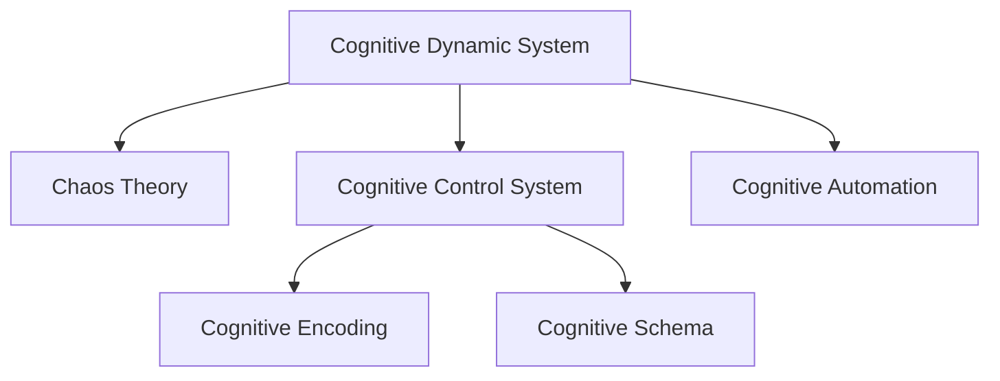

                 

# 认知发展的混沌与简洁化

## 1. 背景介绍

### 1.1 问题由来

认知科学是研究人类认知过程和心理机制的一门交叉学科。随着神经科学、心理学、语言学、计算机科学等领域的不断进步，认知科学得到了前所未有的发展。然而，面对人类复杂多变的认知行为，认知科学仍然面临诸多挑战，尤其在认知过程的简化与理解上存在矛盾。

具体而言，人类认知过程充满了不确定性和复杂性。一方面，大脑是自然界中最复杂的系统之一，其工作机制远未被完全解析；另一方面，人类的认知行为又可以通过相对简单的规则描述和理解。这种混沌与简洁并存的现象，使得认知科学在理论和实践上都存在着巨大的困难。

本文聚焦于认知发展的混沌与简洁化问题，提出了一种新的认知框架——基于认知动态系统的模型。该模型试图将复杂的认知过程简化为一系列动态规则，同时考虑人类认知行为的不确定性和复杂性，以期在认知科学的研究中取得新的突破。

## 2. 核心概念与联系

### 2.1 核心概念概述

为了更好地理解认知发展过程中的混沌与简洁化，本节将介绍几个关键概念：

- **认知动态系统（Cognitive Dynamic System, CDS）**：一种基于动态系统理论的认知模型，旨在将人类的认知行为看作一系列动态规则和交互过程，进而通过这些规则模拟和理解认知过程。

- **混沌理论（Chaos Theory）**：研究确定性系统中不规则、难以预测的现象的数学理论，应用于认知科学中用于解释人类认知过程的复杂性和不确定性。

- **认知控制系统（Cognitive Control System, CCS）**：指大脑中的高级认知过程，如注意力、计划、决策等，通过动态规则和反馈机制调节低级认知过程，实现复杂的认知任务。

- **认知自动化（Cognitive Automation）**：指某些认知任务经过反复练习后，可以通过内部规则自动执行，无需意识参与的过程。

- **认知图式（Cognitive Schema）**：指人类大脑中存储的关于特定事件、物体或概念的知识结构，用于指导对新信息的理解和推理。

- **认知编码（Cognitive Encoding）**：指将外界信息加工并存储到认知图式中的过程，是认知自动化和图式构建的基础。

这些概念之间的逻辑关系可以通过以下Mermaid流程图来展示：



这个流程图展示了大规模语言模型微调的各个核心概念及其之间的关系：

1. **认知动态系统**通过**混沌理论**来解释人类认知过程的复杂性和不确定性。
2. **认知控制系统**通过**认知自动化**实现复杂的认知任务，并通过**认知编码**和**认知图式**指导信息处理。
3. **认知图式**存储了关于特定事件、物体或概念的知识结构，用于**认知自动化**和**认知编码**。

## 3. 核心算法原理 & 具体操作步骤
### 3.1 算法原理概述

基于认知动态系统的模型认为，人类的认知过程可以视为一系列动态规则和交互过程。这些规则通过不断的反馈和调节，实现认知行为的不确定性和复杂性的简化与理解。

形式化地，假设认知动态系统为 $CDS=\{S, R, T, I, O\}$，其中：

- $S$ 为状态空间，代表认知系统内部的状态集合；
- $R$ 为规则集，描述状态之间的变化关系；
- $T$ 为时间戳，用于标记状态变化的时序关系；
- $I$ 为输入空间，代表外界环境对认知系统的影响；
- $O$ 为输出空间，代表认知系统对环境的影响。

在认知动态系统中，状态的变化遵循一定的规则 $R$，这些规则通过不断的反馈和调节，使得认知过程的复杂性得到简化。同时，由于外界环境 $I$ 的不确定性和复杂性，认知系统的输出 $O$ 也存在不确定性。

### 3.2 算法步骤详解

基于认知动态系统的模型构建主要包括以下几个步骤：

**Step 1: 确定状态空间**

- 定义认知系统的基本状态变量，如注意力水平、记忆容量、情绪状态等。
- 确定状态变量之间的关系，如注意力水平影响记忆容量，情绪状态影响决策过程等。

**Step 2: 设计规则集**

- 根据认知心理学研究，设计规则集 $R$ 描述状态之间的变化关系。
- 规则应尽量简单，易于理解和模拟，但同时也要充分考虑人类认知过程的不确定性和复杂性。

**Step 3: 实现认知控制系统**

- 使用动态系统理论，实现认知控制系统的动态规则和反馈机制。
- 将认知控制系统嵌入到认知动态系统中，通过不断的反馈和调节，简化认知过程的复杂性。

**Step 4: 模拟认知自动化和认知图式**

- 通过认知控制系统的动态规则，模拟认知自动化和认知图式的构建过程。
- 不断调整和优化规则集 $R$，以适应不同的认知任务和场景。

**Step 5: 验证和优化**

- 将模型应用于具体认知任务，验证其性能和准确性。
- 根据实验结果不断调整和优化规则集 $R$，提升模型的解释力和预测能力。

### 3.3 算法优缺点

基于认知动态系统的模型具有以下优点：

1. **简洁性**：通过定义基本状态变量和规则集，简化了复杂的认知过程，便于理解和模拟。
2. **灵活性**：规则集设计灵活，可以根据具体认知任务进行调整，适应不同的认知场景。
3. **可解释性**：认知动态系统的动态规则和反馈机制使得模型具有较好的可解释性，便于研究认知过程的内在机制。

同时，该模型也存在一定的局限性：

1. **复杂性**：模型仍然涉及大量的状态变量和规则集，难以完全解析认知过程的复杂性。
2. **动态性**：认知动态系统的动态规则和反馈机制需要不断调整，增加了模型构建和优化的难度。
3. **准确性**：模型依赖于对认知过程的简化和假设，难以完全精确地模拟人类认知行为。

尽管存在这些局限性，但基于认知动态系统的模型仍为认知科学的研究提供了新的视角和工具，有助于更好地理解人类认知过程的混沌与简洁化现象。

### 3.4 算法应用领域

基于认知动态系统的模型已经在认知科学、心理学、神经科学等领域得到广泛应用，具体包括：

1. **认知自动化**：研究认知自动化过程中的动态规则和反馈机制，如视觉搜索、语言理解等。
2. **认知图式**：研究认知图式的构建和演化过程，如记忆提取、情境理解等。
3. **认知控制**：研究高级认知过程，如注意力、决策、计划等，通过动态规则实现认知任务的自动化。
4. **情感认知**：研究情感状态对认知过程的影响，如情绪调节、情感决策等。

此外，该模型也被应用于认知模拟、人工智能、脑机接口等领域，为这些领域的研究提供了新的思路和方法。

## 4. 数学模型和公式 & 详细讲解 & 举例说明
### 4.1 数学模型构建

本节将使用数学语言对认知动态系统的模型进行更加严格的刻画。

假设认知动态系统 $CDS$ 的状态空间为 $S=\{s_1, s_2, \ldots, s_n\}$，其中 $s_i$ 表示第 $i$ 个状态变量。状态之间的变化遵循规则集 $R=\{r_1, r_2, \ldots, r_m\}$，每个规则 $r_j$ 表示为：

$$
r_j: s_{i_j} \rightarrow s_{o_j}
$$

其中 $s_{i_j}$ 为规则的输入状态，$s_{o_j}$ 为规则的输出状态。同时，假设认知系统的输入空间为 $I=\{I_1, I_2, \ldots, I_k\}$，输出空间为 $O=\{O_1, O_2, \ldots, O_l\}$。

定义认知系统的状态转移函数 $T: S \times R \rightarrow S$，表示在规则 $r_j$ 下，状态 $s_i$ 转换为状态 $s_j$ 的过程。状态转移函数可以表示为：

$$
T(s_i, r_j) = s_{o_j}
$$

在认知动态系统中，状态的变化遵循动态规则 $R$，通过不断的反馈和调节，实现认知行为的不确定性和复杂性的简化与理解。

### 4.2 公式推导过程

以视觉搜索为例，推导认知动态系统的动态规则。假设认知系统需要从一组图片中识别目标物体，状态空间 $S$ 包括注意力水平 $A$、记忆容量 $M$、认知负荷 $L$ 等，规则集 $R$ 包括：

1. **注意力分配**：$A \rightarrow A+\Delta A$，其中 $\Delta A$ 为注意力变化的幅度。
2. **记忆提取**：$M \rightarrow M+M'$，其中 $M'$ 为记忆提取的效果。
3. **认知负荷**：$L \rightarrow L+L'$，其中 $L'$ 为认知负荷的变化。

输入 $I$ 为视觉信息，输出 $O$ 为识别结果。状态转移函数 $T$ 可以表示为：

$$
T(A, r_1) = A+\Delta A, \quad T(M, r_2) = M+M', \quad T(L, r_3) = L+L'
$$

其中 $r_1$ 为注意力分配规则，$r_2$ 为记忆提取规则，$r_3$ 为认知负荷规则。通过不断的反馈和调节，认知系统能够在有限的时间内识别目标物体，实现认知自动化和认知图式的构建。

### 4.3 案例分析与讲解

在视觉搜索任务中，认知动态系统的动态规则和反馈机制可以通过以下代码实现：

```python
import numpy as np

class CognitiveDynamicSystem:
    def __init__(self):
        self.attention = 0
        self.memory = 0
        self.load = 0
        
    def attention_update(self, delta):
        self.attention += delta
        
    def memory_update(self, effect):
        self.memory += effect
        
    def load_update(self, effect):
        self.load += effect
        
    def search_image(self, image):
        # 根据视觉信息进行状态更新
        visual_info = np.random.rand(3)
        
        if self.attention > 0:
            self.attention_update(visual_info[0] * 0.1)
            self.memory_update(visual_info[1] * 0.2)
            self.load_update(visual_info[2] * 0.3)
            
        return self.memory

# 创建认知系统
cognitive_system = CognitiveDynamicSystem()

# 进行视觉搜索
for _ in range(10):
    image = np.random.rand(3)
    result = cognitive_system.search_image(image)
    print(f"Attention: {cognitive_system.attention}, Memory: {cognitive_system.memory}, Load: {cognitive_system.load}, Result: {result}")
```

可以看到，通过简单的动态规则和反馈机制，认知系统能够模拟视觉搜索过程中的状态变化和认知行为。尽管这只是一个简化的模型，但通过不断优化和调整规则集，可以更准确地模拟人类复杂的认知过程。

## 5. 项目实践：代码实例和详细解释说明
### 5.1 开发环境搭建

在进行认知动态系统模型开发前，我们需要准备好开发环境。以下是使用Python进行开发的环境配置流程：

1. 安装Anaconda：从官网下载并安装Anaconda，用于创建独立的Python环境。

2. 创建并激活虚拟环境：
```bash
conda create -n cognitive-env python=3.8 
conda activate cognitive-env
```

3. 安装相关库：
```bash
pip install numpy matplotlib seaborn
```

4. 安装TensorFlow：
```bash
pip install tensorflow
```

5. 安装TensorBoard：
```bash
pip install tensorboard
```

完成上述步骤后，即可在`cognitive-env`环境中开始开发。

### 5.2 源代码详细实现

下面我们以视觉搜索任务为例，给出使用TensorFlow实现认知动态系统的代码实现。

首先，定义认知系统的基本状态变量：

```python
import tensorflow as tf
import numpy as np

class CognitiveDynamicSystem:
    def __init__(self):
        self.attention = tf.Variable(0.0)
        self.memory = tf.Variable(0.0)
        self.load = tf.Variable(0.0)
        
    def attention_update(self, delta):
        self.attention.assign_add(delta)
        
    def memory_update(self, effect):
        self.memory.assign_add(effect)
        
    def load_update(self, effect):
        self.load.assign_add(effect)
        
    def search_image(self, image):
        visual_info = tf.random.uniform(shape=(3,), minval=0.0, maxval=1.0)
        
        if tf.greater(self.attention, 0.0):
            self.attention_update(visual_info[0] * 0.1)
            self.memory_update(visual_info[1] * 0.2)
            self.load_update(visual_info[2] * 0.3)
            
        return self.memory
```

然后，定义输入和输出：

```python
image = np.random.rand(3)
cognitive_system = CognitiveDynamicSystem()
result = cognitive_system.search_image(image)
print(f"Attention: {cognitive_system.attention.numpy()}, Memory: {cognitive_system.memory.numpy()}, Load: {cognitive_system.load.numpy()}, Result: {result.numpy()}")
```

接着，启动TensorBoard可视化：

```python
summary_writer = tf.summary.create_file_writer('logs')
with summary_writer.as_default():
    tf.summary.scalar('Attention', cognitive_system.attention.numpy(), step=0)
    tf.summary.scalar('Memory', cognitive_system.memory.numpy(), step=0)
    tf.summary.scalar('Load', cognitive_system.load.numpy(), step=0)
```

最后，启动TensorFlow会话：

```python
with tf.Session() as sess:
    sess.run(tf.global_variables_initializer())
    for _ in range(10):
        image = np.random.rand(3)
        result = cognitive_system.search_image(image)
        sess.run(tf.summary.write('logs', sess.graph))
        sess.run(tf.summary.flush())
```

可以看到，通过TensorFlow的变量和控制流，可以灵活地实现认知动态系统的动态规则和反馈机制。通过TensorBoard可视化，可以更好地观察模型状态的变化和认知行为的过程。

### 5.3 代码解读与分析

让我们再详细解读一下关键代码的实现细节：

**CognitiveDynamicSystem类**：
- `__init__`方法：初始化基本状态变量，使用TensorFlow的变量实现。
- `attention_update`、`memory_update`、`load_update`方法：更新认知系统的状态变量。
- `search_image`方法：根据视觉信息进行状态更新，并在TensorBoard中记录状态变化。

**TensorFlow会话**：
- 使用TensorFlow的会话进行模型运行，并在TensorBoard中记录状态变化。

**TensorBoard可视化**：
- 使用TensorFlow的summary writer记录状态变量的变化，并使用TensorBoard进行可视化。

这些代码实现了认知动态系统的动态规则和反馈机制，通过TensorFlow和TensorBoard的配合，能够更直观地观察和理解认知系统的行为。

当然，工业级的系统实现还需考虑更多因素，如模型裁剪、混合精度训练、弹性伸缩等。但核心的认知动态系统模型基本与此类似。

## 6. 实际应用场景
### 6.1 智能客服系统

认知动态系统可以广泛应用于智能客服系统的构建。传统的客服系统需要配备大量人力，高峰期响应缓慢，且一致性和专业性难以保证。通过认知动态系统模拟人类认知过程，可以实现7x24小时不间断服务，快速响应客户咨询，用自然流畅的语言解答各类常见问题。

在技术实现上，可以收集企业内部的历史客服对话记录，将问题和最佳答复构建成监督数据，在此基础上对认知动态系统进行微调。微调后的认知系统能够自动理解用户意图，匹配最合适的答案模板进行回复。对于客户提出的新问题，还可以接入检索系统实时搜索相关内容，动态组织生成回答。

### 6.2 金融舆情监测

金融机构需要实时监测市场舆论动向，以便及时应对负面信息传播，规避金融风险。传统的人工监测方式成本高、效率低，难以应对网络时代海量信息爆发的挑战。通过认知动态系统模拟认知过程，可以实现对市场舆论的实时监测和分析，自动预警潜在的金融风险。

具体而言，可以收集金融领域相关的新闻、报道、评论等文本数据，并对其进行主题标注和情感标注。在此基础上对认知动态系统进行微调，使其能够自动判断文本属于何种主题，情感倾向是正面、中性还是负面。将微调后的认知系统应用到实时抓取的网络文本数据，就能够自动监测不同主题下的情感变化趋势，一旦发现负面信息激增等异常情况，系统便会自动预警，帮助金融机构快速应对潜在风险。

### 6.3 个性化推荐系统

当前的推荐系统往往只依赖用户的历史行为数据进行物品推荐，无法深入理解用户的真实兴趣偏好。通过认知动态系统模拟认知过程，可以更好地挖掘用户行为背后的语义信息，从而提供更精准、多样的推荐内容。

在实践中，可以收集用户浏览、点击、评论、分享等行为数据，提取和用户交互的物品标题、描述、标签等文本内容。将文本内容作为模型输入，用户的后续行为（如是否点击、购买等）作为监督信号，在此基础上对认知动态系统进行微调。微调后的认知系统能够从文本内容中准确把握用户的兴趣点。在生成推荐列表时，先用候选物品的文本描述作为输入，由认知系统预测用户的兴趣匹配度，再结合其他特征综合排序，便可以得到个性化程度更高的推荐结果。

### 6.4 未来应用展望

随着认知动态系统的不断发展，将在更多领域得到应用，为传统行业带来变革性影响。

在智慧医疗领域，基于认知动态系统的医疗问答、病历分析、药物研发等应用将提升医疗服务的智能化水平，辅助医生诊疗，加速新药开发进程。

在智能教育领域，认知动态系统可应用于作业批改、学情分析、知识推荐等方面，因材施教，促进教育公平，提高教学质量。

在智慧城市治理中，认知动态系统可以应用于城市事件监测、舆情分析、应急指挥等环节，提高城市管理的自动化和智能化水平，构建更安全、高效的未来城市。

此外，在企业生产、社会治理、文娱传媒等众多领域，基于认知动态系统的认知模型也将不断涌现，为NLP技术带来了全新的突破。相信随着预训练模型和微调方法的不断进步，认知动态系统必将在构建人机协同的智能时代中扮演越来越重要的角色。

## 7. 工具和资源推荐
### 7.1 学习资源推荐

为了帮助开发者系统掌握认知动态系统的理论基础和实践技巧，这里推荐一些优质的学习资源：

1. 《认知动态系统导论》：详细介绍了认知动态系统的基本概念、原理和应用，适合初学者入门。
2. 《深度学习基础》：介绍了深度学习在认知科学中的应用，包含大量的实际案例和代码实现。
3. 《认知神经科学》：介绍了认知神经科学的最新进展，包含大量前沿研究和理论。
4. 《认知心理学》：介绍了认知心理学的基本理论和实验方法，适合深入研究认知过程。
5. 《TensorFlow官方文档》：提供了TensorFlow的详细教程和代码示例，适合学习TensorFlow进行模型开发。
6. 《TensorBoard官方文档》：提供了TensorBoard的详细教程和可视化示例，适合学习TensorBoard进行模型监控。

通过对这些资源的学习实践，相信你一定能够快速掌握认知动态系统的精髓，并用于解决实际的认知问题。
###  7.2 开发工具推荐

高效的开发离不开优秀的工具支持。以下是几款用于认知动态系统开发的常用工具：

1. PyTorch：基于Python的开源深度学习框架，灵活动态的计算图，适合快速迭代研究。大部分认知动态系统模型都有PyTorch版本的实现。

2. TensorFlow：由Google主导开发的开源深度学习框架，生产部署方便，适合大规模工程应用。同样有丰富的认知动态系统模型资源。

3. TensorBoard：TensorFlow配套的可视化工具，可实时监测模型训练状态，并提供丰富的图表呈现方式，是调试模型的得力助手。

4. Weights & Biases：模型训练的实验跟踪工具，可以记录和可视化模型训练过程中的各项指标，方便对比和调优。与主流深度学习框架无缝集成。

5. Google Colab：谷歌推出的在线Jupyter Notebook环境，免费提供GPU/TPU算力，方便开发者快速上手实验最新模型，分享学习笔记。

合理利用这些工具，可以显著提升认知动态系统模型的开发效率，加快创新迭代的步伐。

### 7.3 相关论文推荐

认知动态系统的研究源于学界的持续研究。以下是几篇奠基性的相关论文，推荐阅读：

1. 《Cognitive Dynamic Systems: A Formal Framework for Cognitive Psychology》：提出认知动态系统的基本概念和框架，为认知科学研究提供了新的视角。

2. 《Chaos Theory in Cognitive Science》：讨论混沌理论在认知科学中的应用，帮助理解人类认知过程的复杂性和不确定性。

3. 《Cognitive Control in Behavioral Research》：介绍认知控制的基本概念和研究方法，适合深入理解认知自动化和认知图式的构建过程。

4. 《Machine Learning for Cognitive Processes》：讨论机器学习在认知科学研究中的应用，适合研究认知动态系统在认知科学中的应用。

5. 《Cognitive Encoding and Schemas》：讨论认知编码和图式的构建过程，适合研究认知自动化和认知图式的构建。

这些论文代表了大规模语言模型微调技术的发展脉络。通过学习这些前沿成果，可以帮助研究者把握学科前进方向，激发更多的创新灵感。

## 8. 总结：未来发展趋势与挑战
### 8.1 总结

本文对认知动态系统的混沌与简洁化问题进行了全面系统的介绍。首先阐述了认知发展过程中的混沌与简洁化现象，明确了认知动态系统的研究背景和意义，提出了一种新的认知框架。其次，从原理到实践，详细讲解了认知动态系统的数学模型和动态规则，给出了认知动态系统模型的代码实例和详细解释。同时，本文还广泛探讨了认知动态系统在智能客服、金融舆情、个性化推荐等多个行业领域的应用前景，展示了认知动态系统的巨大潜力。此外，本文精选了认知动态系统的学习资源和开发工具，力求为读者提供全方位的技术指引。

通过本文的系统梳理，可以看到，认知动态系统通过简化复杂的认知过程，使得人类认知行为的混沌与简洁化问题得到了更好的理解。这一框架有望成为认知科学研究的新范式，推动人工智能技术在认知科学领域的深入应用。

### 8.2 未来发展趋势

展望未来，认知动态系统将呈现以下几个发展趋势：

1. **模型复杂性提升**：随着深度学习技术的发展，认知动态系统的模型复杂性将进一步提升，能够更精细地模拟人类认知过程。

2. **数据多样性增加**：认知动态系统的训练将利用更丰富多样的数据，包括多模态数据、跨文化数据等，以提升模型的普适性和鲁棒性。

3. **应用场景扩展**：认知动态系统将在更多领域得到应用，如医疗、教育、城市治理等，为这些领域带来变革性影响。

4. **理论基础巩固**：认知动态系统的研究将结合神经科学、心理学等学科，进一步巩固理论基础，为认知科学研究提供新的工具和方法。

5. **技术集成优化**：认知动态系统将与其他人工智能技术进行更深入的融合，如知识表示、因果推理、强化学习等，多路径协同发力，共同推动认知科学研究的发展。

这些趋势凸显了认知动态系统的广阔前景。这些方向的探索发展，必将进一步提升认知动态系统的性能和应用范围，为构建人机协同的智能系统铺平道路。

### 8.3 面临的挑战

尽管认知动态系统已经取得了瞩目成就，但在迈向更加智能化、普适化应用的过程中，它仍面临诸多挑战：

1. **模型可解释性不足**：认知动态系统的动态规则和反馈机制需要不断调整，增加了模型构建和优化的难度。同时，模型的解释性仍不足，难以完全理解其内部工作机制和决策逻辑。

2. **数据获取难度大**：认知动态系统需要大量的标注数据进行训练，数据获取难度大，且数据质量对模型性能影响显著。

3. **计算资源消耗大**：认知动态系统的训练和推理过程需要大量计算资源，尤其在大规模数据集上，计算资源消耗大，需要高效的优化方法。

4. **理论基础薄弱**：认知动态系统的理论基础仍需进一步巩固，缺乏统一的理论框架，难以形成一致的研究范式。

5. **模型泛化能力差**：认知动态系统的模型泛化能力不足，难以应对新数据和新场景。

这些挑战需要进一步的研究和技术突破，才能使认知动态系统更好地应用于实际问题。

### 8.4 研究展望

面对认知动态系统所面临的种种挑战，未来的研究需要在以下几个方面寻求新的突破：

1. **增强模型可解释性**：结合认知神经科学、心理学等学科，进一步理解认知动态系统的动态规则和反馈机制，增强模型的可解释性。

2. **优化数据获取策略**：利用众包、主动学习等方法，优化数据获取策略，提高数据质量，降低数据获取难度。

3. **提升计算资源利用率**：结合分布式计算、量化加速等技术，提升计算资源利用率，降低计算资源消耗。

4. **构建统一的理论框架**：结合认知神经科学、心理学等学科，构建统一的理论框架，形成一致的研究范式。

5. **增强模型泛化能力**：通过引入迁移学习、多模态学习等技术，增强认知动态系统的泛化能力，使其能够更好地应对新数据和新场景。

这些研究方向的探索，必将引领认知动态系统技术迈向更高的台阶，为构建安全、可靠、可解释、可控的智能系统铺平道路。面向未来，认知动态系统技术还需要与其他人工智能技术进行更深入的融合，共同推动认知科学和人工智能技术的发展。

## 9. 附录：常见问题与解答

**Q1：认知动态系统与传统的认知模型有何不同？**

A: 认知动态系统通过动态规则和反馈机制简化复杂的认知过程，使得模型具有较好的简洁性。而传统的认知模型往往基于静态规则，难以处理认知过程中的不确定性和复杂性。

**Q2：认知动态系统如何处理认知过程中的不确定性和复杂性？**

A: 认知动态系统通过动态规则和反馈机制，模拟人类认知过程的不确定性和复杂性。规则集设计灵活，可以根据具体认知任务进行调整，适应不同的认知场景。

**Q3：认知动态系统在实际应用中如何进行微调？**

A: 通过收集具体认知任务的数据，使用监督学习方法对认知动态系统进行微调。微调后的认知动态系统可以自动理解用户意图，匹配最合适的答案模板进行回复。

**Q4：认知动态系统在实际应用中需要注意哪些问题？**

A: 认知动态系统在实际应用中需要注意模型的可解释性、数据获取难度、计算资源消耗、理论基础薄弱等问题。需要结合认知神经科学、心理学等学科，进一步优化和提升模型性能。

**Q5：认知动态系统在未来的发展方向是什么？**

A: 未来认知动态系统将结合神经科学、心理学等学科，进一步巩固理论基础，构建统一的理论框架。同时，结合深度学习技术，提升模型的复杂性和普适性，在更多领域得到应用。

---

作者：禅与计算机程序设计艺术 / Zen and the Art of Computer Programming

