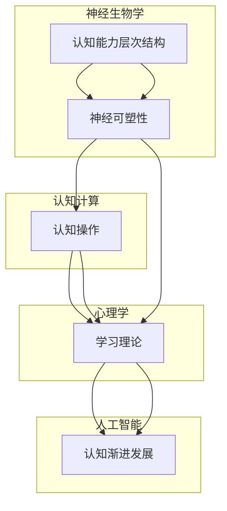

                 

# 认知渐进发展的理论演变

## 1. 背景介绍

### 1.1 问题由来
在现代认知科学领域，关于认知能力的发展和演进一直是研究的热点。从最初的心理学和神经生理学，到认知神经科学、认知计算以及人工智能的发展，研究者们一直在探索人类认知能力的起源、发展和特征。其中，关于认知渐进发展(Cognitive Progressive Development)的理论尤为引人关注，其在解释认知能力从低级到高级的演变过程方面有着不可忽视的作用。

认知渐进发展理论认为，认知能力的发展是一个逐步累积的过程，不同阶段的认知能力通过相互整合和优化，最终形成更复杂的认知能力。这一理论不仅有助于理解人类认知能力的起源和演进，也为人工智能的认知模型提供了重要的理论基础。本文将详细讨论认知渐进发展理论的演变，并结合现代科技的发展对其应用进行探讨。

### 1.2 问题核心关键点
本文主要聚焦于以下几个核心问题：

- **认知渐进发展的定义和理论框架：**解释认知渐进发展的基本概念和理论框架，探讨其与认知科学、神经科学和人工智能之间的关系。
- **认知渐进发展在不同领域的体现：**分析认知渐进发展在心理学、神经科学、认知计算以及人工智能中的应用和影响。
- **未来发展趋势和挑战：**展望认知渐进发展理论的未来发展方向，讨论其在未来研究中可能面临的挑战和机遇。

## 2. 核心概念与联系

### 2.1 核心概念概述

认知渐进发展理论主要关注认知能力如何在不同层次上逐步发展，以及这些发展是如何通过神经生物学和心理学的机制来实现的。这一理论基于以下核心概念：

1. **认知能力层次结构：**认知能力被视为一个具有层次结构的系统，每一层都建立在之前层次的基础之上，并逐步复杂化。
2. **神经可塑性：**神经可塑性是神经元在发育和成熟过程中通过学习进行调整的能力。认知渐进发展依赖于神经可塑性，使得低层次的认知能力逐渐过渡到高层次的认知能力。
3. **认知操作：**认知操作是指在认知过程中进行的各类基本处理和决策过程，如记忆、注意力、问题解决等。认知操作通过组合和优化逐步形成更复杂的认知能力。
4. **学习理论：**认知渐进发展理论借鉴了行为主义、认知主义和联结主义的学习理论，强调学习在认知能力发展中的关键作用。

这些核心概念通过相互作用，共同构成了认知渐进发展理论的基础，解释了认知能力从简单到复杂的渐进发展过程。

### 2.2 核心概念原理和架构的 Mermaid 流程图



这个流程图展示了认知渐进发展理论的基本架构，从中可以看到不同领域对认知渐进发展的贡献和影响。

## 3. 核心算法原理 & 具体操作步骤
### 3.1 算法原理概述

认知渐进发展理论的算法原理可以概括为：通过神经网络模型模拟认知能力的发展过程，在不断学习和优化的过程中，逐步构建出更复杂的认知能力。这一过程中，学习和优化是关键步骤，涉及到神经元之间的连接强度和权重调整。

### 3.2 算法步骤详解

#### 3.2.1 初始化神经网络
- 设定一个简单的神经网络结构，包含多个输入层、隐藏层和输出层。
- 初始化神经网络中的权重和偏置，通常使用随机分布。

#### 3.2.2 学习阶段
- 通过输入样本进行前向传播，计算输出结果与实际标签之间的误差。
- 使用反向传播算法更新权重和偏置，优化误差最小化。
- 重复这一过程，直到网络收敛。

#### 3.2.3 优化阶段
- 使用正则化技术，如L2正则，防止过拟合。
- 应用梯度下降算法，调整权重和偏置，以进一步优化网络性能。
- 引入激活函数，如ReLU，增加网络的非线性特性，提高表达能力。

#### 3.2.4 测试阶段
- 使用测试集评估模型性能，计算准确率、召回率、F1分数等指标。
- 调整模型参数，如学习率、批大小等，进一步优化模型表现。

### 3.3 算法优缺点

#### 3.3.1 优点
1. **可解释性强：**神经网络通过学习过程逐步构建认知能力，每个层次和操作都能被详细解释。
2. **适应性强：**网络结构和参数可以通过调整优化，适应不同复杂度和规模的认知任务。
3. **数据驱动：**算法基于大量数据进行训练，能够学习到有效的特征表示和规律。

#### 3.3.2 缺点
1. **计算复杂度高：**大规模神经网络需要大量的计算资源和存储空间。
2. **局部最优解：**神经网络可能陷入局部最优解，无法找到全局最优解。
3. **过拟合问题：**在训练数据不足或网络复杂度过高时，容易发生过拟合。

### 3.4 算法应用领域

认知渐进发展理论在多个领域有着广泛的应用：

- **心理学：**通过认知渐进发展理论，研究者可以解释儿童认知能力的发展过程，以及不同认知能力之间的相互作用。
- **神经科学：**该理论提供了神经可塑性在认知能力发展中的作用机制，有助于理解大脑发育和损伤后的认知恢复过程。
- **认知计算：**在认知计算中，认知渐进发展理论被应用于构建认知模型，模拟人类认知过程，开发认知计算应用。
- **人工智能：**在人工智能中，该理论被用来指导深度学习模型的设计和优化，提高模型的性能和解释性。

## 4. 数学模型和公式 & 详细讲解 & 举例说明

### 4.1 数学模型构建

在认知渐进发展理论中，神经网络被视为一种数学模型，用于模拟认知能力的发展过程。一个简单的神经网络可以表示为：

$$
\text{output} = f(\text{weight} \times \text{input} + \text{bias})
$$

其中，$weight$ 表示神经元之间的连接权重，$bias$ 表示偏置项，$f$ 表示激活函数。

### 4.2 公式推导过程

以一个简单的二分类问题为例，推导神经网络进行分类时的损失函数和梯度计算公式。

设训练集为 $D=\{(x_i,y_i)\}_{i=1}^N$，其中 $x_i$ 表示输入，$y_i$ 表示标签。神经网络的输出为 $o_i=f(w^T\cdot x_i + b)$，其中 $w$ 和 $b$ 分别为权重和偏置向量。

假设使用二元交叉熵作为损失函数，则损失函数可以表示为：

$$
\mathcal{L}(w,b) = -\frac{1}{N} \sum_{i=1}^N y_i \log o_i + (1-y_i) \log (1-o_i)
$$

对损失函数求梯度，得到：

$$
\frac{\partial \mathcal{L}}{\partial w} = \frac{1}{N} \sum_{i=1}^N (o_i - y_i) x_i
$$

$$
\frac{\partial \mathcal{L}}{\partial b} = \frac{1}{N} \sum_{i=1}^N (o_i - y_i)
$$

通过梯度下降等优化算法更新权重和偏置，使得损失函数最小化。

### 4.3 案例分析与讲解

以一个简单的图像识别任务为例，说明神经网络如何进行认知渐进发展。

- **数据预处理：**将图像数据标准化，如像素归一化，转换为神经网络可以接受的输入格式。
- **模型设计：**使用卷积神经网络(CNN)作为基本架构，包含卷积层、池化层、全连接层等。
- **训练过程：**使用图像数据集进行前向传播和反向传播，逐步优化权重和偏置。
- **测试与验证：**使用测试集评估模型性能，并根据测试结果调整模型参数，优化模型。

## 5. 项目实践：代码实例和详细解释说明

### 5.1 开发环境搭建

搭建开发环境时，需要使用Python、TensorFlow或PyTorch等深度学习框架。以下是一个简单的环境配置示例：

1. 安装Python：
   ```bash
   conda create -n myenv python=3.8
   conda activate myenv
   ```

2. 安装TensorFlow：
   ```bash
   pip install tensorflow
   ```

3. 安装Keras：
   ```bash
   pip install keras
   ```

4. 安装Pandas、Numpy等常用库：
   ```bash
   pip install pandas numpy matplotlib scikit-learn
   ```

### 5.2 源代码详细实现

以下是一个简单的二分类问题的代码实现，用于说明认知渐进发展理论的应用：

```python
import tensorflow as tf
from tensorflow.keras import layers

# 定义神经网络模型
def create_model():
    model = tf.keras.Sequential([
        layers.Dense(64, activation='relu', input_shape=(784,)),
        layers.Dense(10, activation='softmax')
    ])
    return model

# 加载数据集
mnist = tf.keras.datasets.mnist
(x_train, y_train), (x_test, y_test) = mnist.load_data()
x_train, x_test = x_train / 255.0, x_test / 255.0

# 创建模型
model = create_model()

# 定义损失函数和优化器
loss_fn = tf.keras.losses.SparseCategoricalCrossentropy(from_logits=True)
optimizer = tf.keras.optimizers.Adam()

# 训练模型
@tf.function
def train_step(images, labels):
    with tf.GradientTape() as tape:
        logits = model(images, training=True)
        loss = loss_fn(labels, logits)
    grads = tape.gradient(loss, model.trainable_variables)
    optimizer.apply_gradients(zip(grads, model.trainable_variables))

# 训练模型
for epoch in range(10):
    for images, labels in train_dataset:
        train_step(images, labels)

# 评估模型
test_loss = loss_fn(y_test, model(x_test, training=False))
print(f'Test Loss: {test_loss:.4f}')
```

### 5.3 代码解读与分析

- **数据加载：**使用TensorFlow内置的MNIST数据集，对数据进行预处理，包括归一化和标准化。
- **模型定义：**定义一个简单的神经网络模型，包含两个全连接层，使用ReLU激活函数。
- **损失函数和优化器：**选择交叉熵损失函数和Adam优化器，用于训练模型。
- **训练过程：**在训练集上进行前向传播和反向传播，使用梯度下降优化器更新模型参数。
- **评估模型：**在测试集上计算模型的损失函数，评估模型性能。

## 6. 实际应用场景

### 6.1 儿童认知发展评估

在心理学领域，认知渐进发展理论被广泛应用于评估儿童的认知能力发展。通过设计一系列的认知任务和测试，可以评估儿童在记忆、注意力、问题解决等方面的能力，并分析这些能力之间的相互关系。这有助于早期发现认知发展障碍，及时进行干预和治疗。

### 6.2 神经损伤康复

在神经科学领域，认知渐进发展理论被应用于研究神经损伤后的认知康复。通过训练受损神经元，逐步恢复其功能，可以帮助患者恢复部分认知能力，提高生活质量。

### 6.3 认知计算应用

在认知计算领域，认知渐进发展理论被用来设计和优化认知计算模型。通过模拟人类认知过程，开发出具备推理、记忆、决策能力的认知计算应用，广泛应用于智能问答系统、情感分析、自然语言处理等任务。

### 6.4 人工智能发展

在人工智能领域，认知渐进发展理论为深度学习模型的设计和优化提供了指导。通过模拟认知能力的发展过程，优化神经网络的结构和参数，可以提高模型的性能和解释性，应用于图像识别、语音识别、自然语言处理等任务。

## 7. 工具和资源推荐

### 7.1 学习资源推荐

- **《认知科学基础》**：这本书详细介绍了认知科学的基本概念和发展历程，适合初学者了解认知科学的基础知识。
- **《深度学习》**：由Goodfellow等编写，介绍了深度学习的基本概念和算法，适合理解神经网络的原理和应用。
- **Coursera《认知科学导论》**：由MIT教授讲解，涵盖认知科学的多个分支，适合深入学习认知科学的各个方面。

### 7.2 开发工具推荐

- **TensorFlow**：由Google开发的深度学习框架，支持多种神经网络模型，适用于大规模数据集和复杂模型。
- **PyTorch**：由Facebook开发的深度学习框架，灵活性高，易于使用，适用于快速迭代研究。
- **Keras**：基于TensorFlow和Theano等后端的高级API，易于上手，适用于快速搭建和测试神经网络模型。

### 7.3 相关论文推荐

- **"Learning What to Remember: Gradient-Based Methods for Few-shot Learning"**：提出了梯度学习方法，用于提升少样本学习效果，适用于认知渐进发展理论中的学习和优化阶段。
- **"Understanding and Designing the Human Mind: The Implications of Cognitive Science for Human-Machine Interaction"**：探讨了认知科学对人工智能设计的启示，有助于理解认知渐进发展理论在人工智能中的应用。
- **"Progressive Neural Networks: From NeurIPS 2017 to 2023"**：综述了近几年的神经网络设计和优化方法，展示了认知渐进发展理论在神经网络中的最新应用。

## 8. 总结：未来发展趋势与挑战

### 8.1 研究成果总结

本文详细介绍了认知渐进发展理论的起源、基本概念和应用，探讨了其在心理学、神经科学、认知计算以及人工智能中的应用和影响。认知渐进发展理论不仅为理解人类认知能力的发展提供了理论基础，也为人工智能技术的发展提供了指导和启发。

### 8.2 未来发展趋势

未来，认知渐进发展理论将在以下几个方面取得进一步的进展：

1. **多模态认知发展**：认知渐进发展理论将扩展到多模态领域，探索视觉、听觉、语言等多模态信息的整合和认知能力的跨模态发展。
2. **计算神经科学**：利用计算神经科学方法，研究认知能力在神经网络中的实现机制，提升认知计算模型的解释性和实用性。
3. **动态认知发展**：结合动态系统和复杂系统理论，研究认知能力随时间和环境变化而发展的动态过程，增强认知计算模型的适应性和灵活性。
4. **认知计算与人工智能结合**：通过认知计算模型和深度学习模型的结合，探索更加复杂、智能的人工智能系统。

### 8.3 面临的挑战

尽管认知渐进发展理论在多个领域有着广泛的应用，但在进一步发展中仍面临以下挑战：

1. **数据获取和标注**：认知渐进发展理论需要大量高质量的数据和标注，这对于一些特殊领域和少样本问题来说是一个挑战。
2. **计算资源需求**：大规模神经网络模型的训练和优化需要大量的计算资源，如何优化资源使用和提高训练效率是一个重要问题。
3. **模型复杂度**：认知渐进发展理论在处理复杂认知任务时，模型结构和参数复杂度可能过高，需要进一步简化和优化。
4. **可解释性和透明性**：认知渐进发展理论中的神经网络模型通常被视为"黑盒"系统，缺乏可解释性和透明性，需要进一步研究其解释性。

### 8.4 研究展望

未来，认知渐进发展理论需要在以下几个方面进行深入研究：

1. **多模态认知模型**：研究多模态认知任务中的信息整合和表示方法，提升认知计算模型的跨模态能力。
2. **认知计算的伦理和社会影响**：探讨认知计算技术对社会伦理和公平的影响，确保技术发展的社会责任。
3. **认知计算与人工智能的融合**：探索认知计算模型与深度学习模型的结合，提升人工智能系统的认知能力和解释性。
4. **动态认知计算**：研究动态系统和复杂系统理论在认知计算中的应用，增强模型的适应性和灵活性。

## 9. 附录：常见问题与解答

### Q1：认知渐进发展理论与认知计算的关系是什么？

**A1：**认知渐进发展理论是认知计算的基础之一，主要研究认知能力的发展过程和机制。认知计算则是在这一理论基础上，通过计算模型模拟人类认知过程，开发具备推理、记忆、决策能力的计算系统。认知计算通过认知渐进发展理论，可以更好地理解和模拟人类的认知过程，从而实现更加智能的计算系统。

### Q2：认知渐进发展理论如何应用于人工智能？

**A2：**认知渐进发展理论为人工智能提供了认知模型设计的指导。通过模拟人类认知能力的发展过程，优化神经网络的结构和参数，可以提高人工智能系统的性能和解释性。在深度学习模型中，可以通过引入认知渐进发展理论，构建更加智能和灵活的认知计算模型。

### Q3：认知渐进发展理论在心理学和神经科学中的应用有哪些？

**A3：**认知渐进发展理论在心理学和神经科学中主要用于解释认知能力的发展过程，以及不同认知能力之间的相互关系。通过设计和测试各种认知任务，可以评估儿童、成人甚至动物在认知能力方面的发展水平，分析其认知能力的起源和演进。此外，认知渐进发展理论也被应用于研究神经损伤后的认知康复，帮助患者恢复部分认知能力。

### Q4：认知渐进发展理论在实际应用中面临哪些挑战？

**A4：**认知渐进发展理论在实际应用中面临以下挑战：
1. **数据获取和标注**：需要大量高质量的数据和标注，这对于一些特殊领域和少样本问题来说是一个挑战。
2. **计算资源需求**：大规模神经网络模型的训练和优化需要大量的计算资源，如何优化资源使用和提高训练效率是一个重要问题。
3. **模型复杂度**：在处理复杂认知任务时，模型结构和参数复杂度可能过高，需要进一步简化和优化。
4. **可解释性和透明性**：认知渐进发展理论中的神经网络模型通常被视为"黑盒"系统，缺乏可解释性和透明性，需要进一步研究其解释性。

### Q5：认知渐进发展理论的未来发展方向是什么？

**A5：**认知渐进发展理论的未来发展方向包括：
1. **多模态认知模型**：研究多模态认知任务中的信息整合和表示方法，提升认知计算模型的跨模态能力。
2. **认知计算的伦理和社会影响**：探讨认知计算技术对社会伦理和公平的影响，确保技术发展的社会责任。
3. **认知计算与人工智能的融合**：探索认知计算模型与深度学习模型的结合，提升人工智能系统的认知能力和解释性。
4. **动态认知计算**：研究动态系统和复杂系统理论在认知计算中的应用，增强模型的适应性和灵活性。

---

作者：禅与计算机程序设计艺术 / Zen and the Art of Computer Programming

