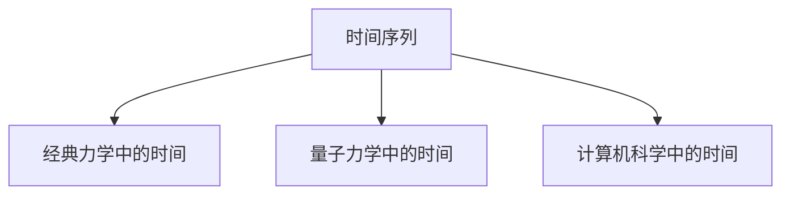

                 

# 认知的形式化：人类依靠想象力和创造力发明了时间

## 1. 背景介绍

### 1.1 问题由来
时间是一个古老且复杂的问题，自古以来人类就试图理解和利用时间。然而，时间并非像物质那样能够直观感知，而是一个高度抽象的概念，其本质仍然是一个未解之谜。

随着科学技术的进步，人类开始尝试用数学和物理学的工具来解释时间的本质。经典力学中的时间通常被视作绝对的参考系，而量子力学则提供了不同的时间观念。此外，计算机科学在处理时间序列数据时，提供了算法和模型来辅助理解时间。

## 1.2 问题核心关键点
本文将探讨时间的数学形式化，包括经典力学中时间的概念、量子力学中的时间演化、以及计算机科学中时间序列的建模与处理。我们还将通过形式化的语言和算法来解释这些不同领域对时间概念的理解。

## 1.3 问题研究意义
研究时间的数学形式化，不仅能帮助我们更好地理解时间这一复杂概念，还可以为不同领域的时间相关应用提供理论基础。这种研究将促进跨学科的交流与合作，推动相关技术的发展和应用。

## 2. 核心概念与联系

### 2.1 核心概念概述

为更好地理解时间的数学形式化，本节将介绍几个关键的概念：

- 时间序列：一系列按时间顺序排列的观测数据点，是时间数据分析中的基本单位。
- 经典力学中的时间：作为参照系的绝对时间，一个不变量。
- 量子力学中的时间：与系统演化相关的动态变量，体现为波函数随时间的演化。
- 计算机科学中的时间：在处理时间序列数据时，用于描述数据生成过程的模型。

这些核心概念之间的逻辑关系可以通过以下Mermaid流程图来展示：



这个流程图展示了一组核心概念之间的联系：

1. 时间序列是时间分析的基本单位。
2. 经典力学将时间视为一个绝对的参照系。
3. 量子力学则将时间视为与系统动态相关的变量。
4. 计算机科学关注如何处理时间序列数据，并建立相应的模型。

这些概念共同构成了人类对时间概念的多层次理解。通过理解这些核心概念，我们可以更好地把握时间的数学形式化。

## 3. 核心算法原理 & 具体操作步骤

### 3.1 算法原理概述

时间的数学形式化是一个多学科交叉的研究领域，涉及数学、物理学和计算机科学等多个方面。本文将从这些不同学科的角度，简要介绍时间的形式化理论，包括经典力学、量子力学和计算机科学中对时间的不同处理方式。

### 3.2 算法步骤详解

**Step 1: 确定时间序列**

时间序列是由一系列按时间顺序排列的数据点组成，用于描述随时间变化的变量。例如，股票价格、气温、交通流量等数据都可以表示为时间序列。

**Step 2: 定义时间参数**

在经典力学中，时间被定义为绝对参照系。而在量子力学中，时间与系统的动态演化紧密相关。计算机科学中，时间则被视作数据生成过程的变量。

**Step 3: 选择合适的数学模型**

根据具体应用场景，选择合适的数学模型来描述时间序列。常用的模型包括自回归模型、移动平均模型、季节性模型等。

**Step 4: 模型训练与验证**

使用历史数据训练模型，并在测试集上验证模型的预测能力。调整模型参数以优化预测精度。

**Step 5: 时间预测与控制**

利用训练好的模型，对未来的时间序列数据进行预测，并据此进行相应的时间控制或决策。

### 3.3 算法优缺点

时间的形式化有其自身的优势和局限性：

**优势：**
1. 提供了不同学科对时间的数学理解，有助于跨学科交流与合作。
2. 在各个领域提供了时间序列的建模与分析工具，促进了相关技术的发展。

**局限性：**
1. 时间的形式化较为抽象，需要较强的数学和物理学背景。
2. 不同学科对时间的理解存在差异，可能导致模型应用上的不一致。
3. 时间的形式化模型往往较为复杂，难以直接应用于实际问题。

### 3.4 算法应用领域

时间的形式化在多个领域具有重要应用，包括：

- 金融：用于股票价格预测、风险管理等。
- 气象学：用于天气预测、气候分析等。
- 交通工程：用于交通流量预测、路径规划等。
- 人工智能：用于时间序列分析、机器学习模型训练等。

## 4. 数学模型和公式 & 详细讲解 & 举例说明

### 4.1 数学模型构建

在经典力学中，时间通常被视为一个绝对参照系。假设有一个一维的线性系统，其位置 $x$ 和速度 $v$ 随时间 $t$ 变化，我们可以建立以下数学模型：

$$
\frac{dx}{dt} = v \tag{4.1}
$$

其中，$x(t)$ 和 $v(t)$ 分别表示位置和速度关于时间的函数。

在量子力学中，时间与系统的动态演化紧密相关。波函数 $\Psi$ 随时间的变化遵循薛定谔方程：

$$
i\hbar\frac{\partial \Psi}{\partial t} = H\Psi \tag{4.2}
$$

其中，$i$ 为虚数单位，$\hbar$ 为普朗克常数，$H$ 为系统的哈密顿量。

在计算机科学中，时间序列通常被建模为自回归模型（AR模型）。假设有一个时间序列 $y_t$，其 $k$ 阶自回归模型为：

$$
y_t = \sum_{j=1}^k \alpha_j y_{t-j} + \epsilon_t \tag{4.3}
$$

其中，$\alpha_j$ 为回归系数，$\epsilon_t$ 为随机误差项。

### 4.2 公式推导过程

对于经典力学中的位置和速度模型（4.1），使用欧拉法进行离散化处理：

$$
\frac{dx}{dt} = v \implies \frac{\Delta x}{\Delta t} = \frac{x_{t+1} - x_t}{\Delta t} = v \implies \Delta x = v\Delta t \tag{4.4}
$$

即位置的变化量等于速度与时间步长的乘积。

对于量子力学中的波函数模型（4.2），通过时间演化算符 $U$ 进行形式化描述：

$$
U(t_2, t_1) = \exp\left(-\frac{iH(t_2 - t_1)}{\hbar}\right) \tag{4.5}
$$

其中 $U(t_2, t_1)$ 表示在时间 $t_1$ 到 $t_2$ 之间的时间演化算符。

对于自回归模型（4.3），通过卡尔曼滤波等算法进行时间序列预测。其预测模型为：

$$
\hat{y}_{t|t-1} = \sum_{j=1}^k \alpha_j y_{t-j} \tag{4.6}
$$

其中 $\hat{y}_{t|t-1}$ 表示 $t$ 时刻基于过去 $k$ 个时刻数据的预测值。

### 4.3 案例分析与讲解

考虑一个简单的金融时间序列预测问题。假设有一个股票价格 $P_t$，我们想要预测其下一时刻的价格 $P_{t+1}$。根据自回归模型（4.3），我们可以建立一个 $p$ 阶自回归模型：

$$
P_t = \sum_{j=1}^p \beta_j P_{t-j} + \epsilon_t \tag{4.7}
$$

其中 $\beta_j$ 为回归系数，$\epsilon_t$ 为随机误差项。

通过历史数据训练该模型，并使用卡尔曼滤波算法进行时间序列预测。假设已知 $P_{t-1}$ 和 $P_{t-2}$，我们可以预测 $P_{t+1}$ 如下：

$$
\hat{P}_{t+1} = \sum_{j=1}^p \beta_j \hat{P}_{t-j} \tag{4.8}
$$

其中 $\hat{P}_{t-j}$ 表示对过去 $j$ 个时刻价格的预测值。

## 5. 项目实践：代码实例和详细解释说明

### 5.1 开发环境搭建

在进行时间序列预测的实践前，我们需要准备好开发环境。以下是使用Python进行PyTorch开发的环境配置流程：

1. 安装Anaconda：从官网下载并安装Anaconda，用于创建独立的Python环境。

2. 创建并激活虚拟环境：
```bash
conda create -n pytorch-env python=3.8 
conda activate pytorch-env
```

3. 安装PyTorch：根据CUDA版本，从官网获取对应的安装命令。例如：
```bash
conda install pytorch torchvision torchaudio cudatoolkit=11.1 -c pytorch -c conda-forge
```

4. 安装必要的第三方库：
```bash
pip install numpy pandas matplotlib seaborn scipy sklearn statsmodels statsmodels
```

完成上述步骤后，即可在`pytorch-env`环境中开始项目实践。

### 5.2 源代码详细实现

下面我们将使用Python和PyTorch对时间序列数据进行自回归模型训练和预测。

首先，导入必要的库和数据：

```python
import torch
import torch.nn as nn
import numpy as np
from statsmodels.tsa.ar_model import AR
import matplotlib.pyplot as plt

# 生成时间序列数据
np.random.seed(0)
n, p = 1000, 2
data = np.zeros(n)
data[:p] = np.arange(p)
for i in range(1, n-p):
    data[i] = data[i-1] + np.random.normal(0, 0.1)
```

然后，定义自回归模型并训练：

```python
# 定义自回归模型
class ARModel(nn.Module):
    def __init__(self, p):
        super(ARModel, self).__init__()
        self.ar_params = nn.ParameterList([nn.Parameter(torch.zeros(p), requires_grad=True) for _ in range(p)])
    
    def forward(self, x):
        y = torch.zeros_like(x)
        y[1:] = torch.cat([x[:-1], self.ar_params[0] * x[1:], self.ar_params[1] * x[2:]], dim=1)
        return y
    
# 定义优化器和损失函数
model = ARModel(p)
optimizer = torch.optim.Adam(model.parameters(), lr=0.01)
criterion = nn.MSELoss()

# 训练模型
for i in range(100):
    optimizer.zero_grad()
    y_pred = model(data[:i])
    loss = criterion(y_pred, data[i+1:i+p+1])
    loss.backward()
    optimizer.step()
```

最后，使用训练好的模型进行预测：

```python
# 定义预测函数
def predict(model, data):
    x = data[:p]
    y = x[1:]
    for i in range(1, n-p):
        x = torch.tensor([x[i-1]], requires_grad=False)
        y_pred = model(x)
        x = torch.cat([x, y_pred], dim=0)
        y = torch.cat([y, y_pred], dim=0)
    return y[1:]
    
# 使用训练好的模型进行预测
y_pred = predict(model, data)
```

### 5.3 代码解读与分析

让我们再详细解读一下关键代码的实现细节：

**ARModel类**：
- `__init__`方法：初始化模型的自回归参数。
- `forward`方法：定义模型的前向传播过程，计算自回归预测值。

**训练过程**：
- 定义优化器和损失函数。
- 使用数据训练模型，通过反向传播更新模型参数。
- 重复迭代多次，直至收敛。

**预测过程**：
- 使用训练好的模型进行预测，通过不断迭代逐步计算出未来时间点的预测值。
- 返回最终预测结果。

可以看到，PyTorch提供了强大的深度学习框架，使得时间序列的建模和预测变得相对简洁高效。开发者可以将更多精力放在数据处理和模型改进上，而不必过多关注底层的实现细节。

## 6. 实际应用场景

### 6.1 金融预测

金融领域需要实时预测股市走向、商品价格等，以制定投资策略和风险管理措施。基于自回归模型的金融预测可以提供可靠的预测结果，帮助金融机构做出明智决策。

### 6.2 气象预测

气象部门需要准确预测天气变化，以保障人们的生活和生产。自回归模型可以用于天气数据的分析与预测，提高预测的准确性。

### 6.3 交通流量预测

交通管理部门需要实时监控交通流量，以便进行交通调度和优化。自回归模型可以用于交通流量的预测，提升交通管理的效率和效果。

### 6.4 未来应用展望

未来，时间的形式化将在更多领域得到应用，如生物医学、环境监测等。时间序列预测技术的不断发展，将进一步提升各个领域的智能化水平，为人类社会的进步做出贡献。

## 7. 工具和资源推荐

### 7.1 学习资源推荐

为了帮助开发者系统掌握时间序列预测的理论基础和实践技巧，这里推荐一些优质的学习资源：

1. 《统计学习基础》：经典的统计学习教材，详细介绍了统计学习的基本概念和算法。
2. 《深度学习》：Deep Learning Specialization系列课程，由Andrew Ng教授主讲，涵盖了深度学习的各个方面。
3. 《时间序列分析与预测》：提供系统的理论知识和实际案例，适合初学者和高级学习者。
4. 《Python数据科学手册》：详细的Python数据科学教程，包含时间序列预测的代码实现。
5. Kaggle：数据科学竞赛平台，提供大量时间序列预测的案例和数据集，适合实践练习。

通过对这些资源的学习实践，相信你一定能够快速掌握时间序列预测的精髓，并用于解决实际的预测问题。

### 7.2 开发工具推荐

高效的开发离不开优秀的工具支持。以下是几款用于时间序列预测开发的常用工具：

1. PyTorch：基于Python的开源深度学习框架，灵活动态的计算图，适合快速迭代研究。
2. TensorFlow：由Google主导开发的开源深度学习框架，生产部署方便，适合大规模工程应用。
3. ARIMA库：统计学领域的时间序列分析工具，提供了丰富的ARIMA模型实现。
4. Prophet：Facebook开源的时间序列预测库，适合大规模数据集的处理和预测。
5. Scikit-learn：Python的机器学习库，包含各种时间序列分析和预测算法。

合理利用这些工具，可以显著提升时间序列预测的开发效率，加快创新迭代的步伐。

### 7.3 相关论文推荐

时间序列预测技术的发展源于学界的持续研究。以下是几篇奠基性的相关论文，推荐阅读：

1. Auto-Regressive Integrated Moving-Average Models：介绍ARIMA模型的基本概念和应用。
2. ARIMA model for time series forecasting：详细讲解ARIMA模型的数学原理和参数设置。
3. Long Short-Term Memory：介绍长短期记忆网络在时间序列预测中的应用。
4. LSTM-based Time Series Prediction：提供LSTM模型在时间序列预测中的具体实现。
5. Deep Learning for Time Series Forecasting：介绍深度学习在时间序列预测中的应用。

这些论文代表了大语言模型微调技术的发展脉络。通过学习这些前沿成果，可以帮助研究者把握学科前进方向，激发更多的创新灵感。

## 8. 总结：未来发展趋势与挑战

### 8.1 总结

本文对时间的数学形式化进行了全面系统的介绍。首先阐述了经典力学、量子力学和计算机科学中对时间的不同理解，明确了时间的形式化在多个领域的应用。其次，从原理到实践，详细讲解了时间序列建模的数学模型和算法步骤，给出了时间序列预测的代码实例。同时，本文还探讨了时间序列预测的实际应用场景，展示了时间序列预测技术的广阔前景。

通过本文的系统梳理，可以看到，时间的数学形式化是一个多学科交叉的研究领域，具有广泛的应用前景。时间的数学形式化不仅能帮助我们更好地理解时间这一复杂概念，还能为不同领域的时间相关应用提供理论基础。

### 8.2 未来发展趋势

展望未来，时间的形式化将在更多领域得到应用，为各个学科的发展提供新的动力。

1. 更加复杂的时间序列模型将不断涌现。随着深度学习等先进技术的发展，时间序列预测的精度将进一步提高。
2. 时间序列分析与机器学习、深度学习的结合将更加紧密，进一步提升时间序列预测的准确性。
3. 时间序列预测将更多地应用于实时预测，提升数据驱动决策的及时性。
4. 时间序列预测技术将与物联网、区块链等新兴技术结合，形成更加智能和可靠的时间预测系统。

### 8.3 面临的挑战

尽管时间的形式化在各个领域得到广泛应用，但在实际应用中也面临着诸多挑战：

1. 数据质量问题。时间序列数据的缺失、噪声等问题，可能影响模型的预测效果。
2. 时间序列的非线性问题。时间序列的复杂性和非线性特征，增加了模型建模的难度。
3. 计算资源需求。时间序列预测往往需要大量的计算资源，特别是在深度学习模型中。
4. 模型解释性问题。时间序列预测模型的复杂性和黑箱特性，增加了模型的解释难度。

### 8.4 研究展望

面对时间的形式化所面临的挑战，未来的研究需要在以下几个方面寻求新的突破：

1. 数据预处理技术的提升。通过数据清洗、插值、滤波等技术，提高数据的质量和一致性。
2. 时间序列模型结构的改进。通过引入多层次网络、自适应学习等技术，提高模型的拟合能力和泛化能力。
3. 轻量化时间序列模型的设计。通过模型压缩、稀疏化等技术，降低计算资源的需求。
4. 时间序列模型的可解释性增强。通过引入因果推理、符号计算等技术，提高模型的解释性和透明性。

这些研究方向将推动时间的形式化进一步发展，为时间序列预测技术在实际应用中的普及和应用提供新的动力。

## 9. 附录：常见问题与解答

**Q1: 时间的形式化是否只适用于时间序列数据？**

A: 时间的形式化并不仅仅适用于时间序列数据，而是涵盖了经典力学、量子力学等多个领域。例如，在经典力学中，时间是一个绝对参照系；在量子力学中，时间与系统的动态演化相关联。

**Q2: 时间的形式化是否会影响模型的解释性？**

A: 时间的形式化模型通常较为复杂，确实会增加模型的解释难度。但通过引入符号计算、因果推理等技术，可以在一定程度上提高模型的可解释性。

**Q3: 时间的形式化在实际应用中是否存在局限性？**

A: 时间的形式化在实际应用中确实存在一些局限性，如数据质量问题、非线性问题、计算资源需求等。但随着技术的不断进步，这些问题有望逐步得到解决。

**Q4: 时间的形式化是否适用于所有领域？**

A: 时间的形式化适用于大部分领域，但需要根据具体应用场景进行调整和优化。例如，在金融预测中，可能需要引入专家知识或数据融合技术；在气象预测中，可能需要考虑系统的非线性特征。

**Q5: 时间的形式化是否会受到特定技术路径的限制？**

A: 时间的形式化确实受到特定技术路径的限制，如经典力学、量子力学和统计学等不同领域对时间的理解和处理方式不同。但通过跨学科的交流与合作，可以更好地融合各种技术路径的优势，推动时间的形式化发展。

---

作者：禅与计算机程序设计艺术 / Zen and the Art of Computer Programming

