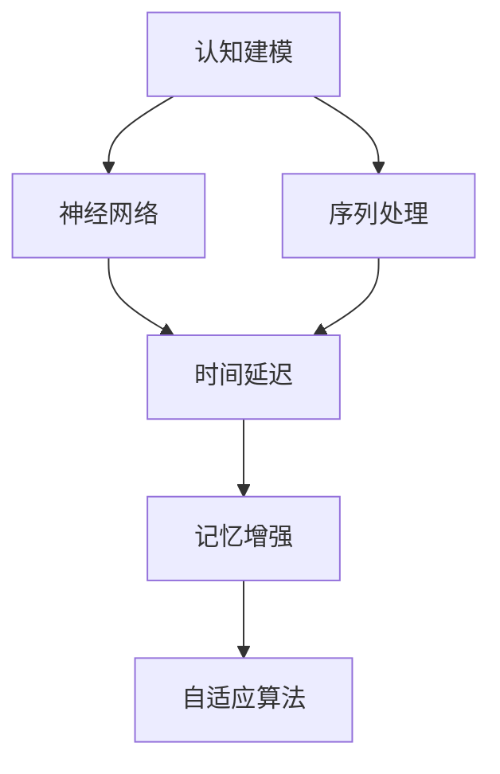

                 

# 认知的形式化：时间对于机器的认知至关重要

> 关键词：认知建模, 时间延迟, 神经网络, 序列处理, 记忆增强, 自适应算法

## 1. 背景介绍

随着人工智能技术的飞速发展，机器的认知能力已经从简单的数据处理扩展到了复杂的逻辑推理和情感识别。然而，机器的认知过程中，时间维度扮演了至关重要的角色。特别是在处理序列数据时，时间延迟成为了制约认知效果的关键因素。本博客旨在探讨时间对机器认知的重要性，并提出了一系列优化方案，旨在通过认知建模、时间延迟控制和自适应算法，提升机器的认知能力。

## 2. 核心概念与联系

### 2.1 核心概念概述

- **认知建模**：通过数学模型和计算方法，将认知过程形式化，为机器理解和学习人类认知提供基础。
- **时间延迟**：在序列处理中，由于数据输入和处理存在时间差，导致后续处理无法及时响应，影响认知效果。
- **神经网络**：深度学习中常用的网络结构，可以自动提取和处理序列数据，具有强大的模式识别和预测能力。
- **序列处理**：对时间序列数据进行建模和分析，广泛应用于自然语言处理、语音识别、视频分析等领域。
- **记忆增强**：通过引入外部记忆，如外部存储器或外部计算，提高神经网络的记忆能力，缓解时间延迟问题。
- **自适应算法**：能根据输入数据的变化自动调整模型参数的算法，适用于动态环境下的序列处理。

这些核心概念之间有着紧密的联系，共同构成了机器认知的框架。时间延迟是制约认知效果的重要因素，而神经网络和记忆增强技术，通过引入序列处理机制，能有效缓解时间延迟问题，提升机器的认知能力。自适应算法则进一步优化了认知过程，使其适应动态环境，实现更高效的认知效果。

### 2.2 核心概念原理和架构的 Mermaid 流程图



以上流程图展示了认知建模与核心技术之间的联系。认知建模是基础，神经网络和序列处理是核心，时间延迟和记忆增强是应对延迟的策略，而自适应算法则进一步优化了认知过程。

## 3. 核心算法原理 & 具体操作步骤

### 3.1 算法原理概述

本节将深入探讨认知建模和神经网络在处理序列数据时，时间延迟对认知效果的影响，并提出相应的解决方案。

### 3.2 算法步骤详解

**Step 1: 认知建模与序列数据处理**

1. **认知建模**：建立数学模型，将认知过程形式化。常用的认知模型包括感知器模型、反向传播网络等。

2. **序列数据处理**：将输入数据转化为序列形式，进行时间维度上的建模和分析。常用的方法包括循环神经网络(RNN)、长短时记忆网络(LSTM)、门控循环单元(GRU)等。

**Step 2: 时间延迟控制**

1. **延迟时间分析**：评估输入数据和处理结果之间的时间延迟，分析其对认知效果的影响。

2. **延迟补偿策略**：引入外部存储器和外部计算，缓解时间延迟。例如，使用外部缓存存储最近的数据，或者使用分布式计算进行并行处理。

**Step 3: 记忆增强**

1. **外部记忆引入**：通过外部存储器或外部计算，提高神经网络的记忆能力。常用的方法包括外部存储器、外部计算节点等。

2. **记忆机制设计**：设计合理的外部记忆机制，如分布式数据库、缓存技术等，确保数据的快速读写和有效存储。

**Step 4: 自适应算法**

1. **自适应算法选择**：根据序列数据的特点，选择合适的自适应算法，如AdaGrad、Adam等。

2. **算法参数调整**：根据输入数据的变化，自动调整算法参数，以适应动态环境。

**Step 5: 模型训练与评估**

1. **模型训练**：在处理延迟和引入记忆机制的基础上，进行模型训练，优化认知效果。

2. **模型评估**：在测试集上进行模型评估，衡量其认知效果和性能指标。

### 3.3 算法优缺点

**优点**：
- **高准确性**：通过优化时间延迟和引入记忆增强，神经网络能够更好地处理序列数据，提高认知准确性。
- **自适应能力**：自适应算法能够根据输入数据的变化，自动调整模型参数，适应动态环境。
- **鲁棒性**：通过引入外部存储器和外部计算，缓解时间延迟，提高系统的鲁棒性和稳定性。

**缺点**：
- **计算复杂度**：引入外部存储器和外部计算会增加计算复杂度，需要更强的硬件支持。
- **内存消耗**：外部存储器的使用会增加内存消耗，需要更高效的数据管理策略。
- **模型复杂性**：复杂的时间延迟控制和记忆增强机制，可能导致模型复杂性增加。

### 3.4 算法应用领域

大模型认知的形式化方法，在以下几个领域具有广泛应用：

- **自然语言处理(NLP)**：在机器翻译、文本分类、情感分析等任务中，序列处理和记忆增强技术，能有效缓解时间延迟，提高认知效果。

- **语音识别**：在语音识别和语音合成任务中，时间延迟的控制和记忆增强，能够提高系统的鲁棒性和准确性。

- **视频分析**：在视频分析任务中，序列处理和自适应算法，能够有效处理时间延迟，提高视频理解和识别的准确性。

- **时间序列分析**：在时间序列分析任务中，时间延迟控制和记忆增强，能够提高时间序列的预测准确性。

- **智能控制**：在智能控制任务中，自适应算法和记忆增强，能够适应动态环境，提高系统的响应速度和准确性。

## 4. 数学模型和公式 & 详细讲解 & 举例说明

### 4.1 数学模型构建

在认知建模中，常用的数学模型包括感知器模型和反向传播网络。以反向传播网络为例，其数学模型如下：

$$y = f(Wx + b)$$

其中，$y$ 为输出结果，$x$ 为输入数据，$W$ 为权重矩阵，$b$ 为偏置项，$f$ 为激活函数。

### 4.2 公式推导过程

以循环神经网络(RNN)为例，其时间延迟控制和记忆增强的数学模型如下：

$$h_t = \tanh(W_hx_t + U_hh_{t-1} + b_h)$$
$$o_t = \sigma(W_o h_t + b_o)$$
$$\hat{y}_t = o_t h_t$$

其中，$h_t$ 为隐藏状态，$x_t$ 为当前输入数据，$U_h$ 和 $W_h$ 为隐藏层权重矩阵，$W_o$ 和 $b_o$ 为输出层权重矩阵和偏置项，$\sigma$ 为激活函数，$\hat{y}_t$ 为预测结果。

### 4.3 案例分析与讲解

以一个简单的情感分析任务为例，分析时间延迟和记忆增强对其效果的影响。

假设我们有一个包含1000条评论的数据集，每条评论的情感标签为正向或负向。我们使用LSTM模型进行情感分析。

1. **延迟时间分析**：LSTM模型处理每条评论时，存在一定的时间延迟，即当前评论的处理结果需要等待前一条评论的处理结果，这会影响情感分析的速度和准确性。

2. **延迟补偿策略**：我们可以引入外部缓存存储最近的数据，减少时间延迟。例如，使用分布式数据库或缓存技术，提高数据的读写效率。

3. **记忆增强**：LSTM模型的长短期记忆机制，使其在处理序列数据时，能够记忆之前的输入，缓解时间延迟。例如，通过引入外部存储器或外部计算，提高LSTM模型的记忆能力。

## 5. 项目实践：代码实例和详细解释说明

### 5.1 开发环境搭建

在进行项目实践前，我们需要准备好开发环境。以下是使用Python进行TensorFlow开发的安装步骤：

1. 安装Anaconda：从官网下载并安装Anaconda，用于创建独立的Python环境。

2. 创建并激活虚拟环境：
```bash
conda create -n tensorflow-env python=3.8 
conda activate tensorflow-env
```

3. 安装TensorFlow：根据CUDA版本，从官网获取对应的安装命令。例如：
```bash
conda install tensorflow-gpu==2.7.0
```

4. 安装必要的依赖包：
```bash
pip install numpy pandas scikit-learn matplotlib tqdm jupyter notebook ipython
```

完成上述步骤后，即可在`tensorflow-env`环境中开始项目开发。

### 5.2 源代码详细实现

以下是使用TensorFlow实现LSTM模型的示例代码：

```python
import tensorflow as tf
import numpy as np
import matplotlib.pyplot as plt

# 定义LSTM模型
class LSTM(tf.keras.Model):
    def __init__(self, input_size, hidden_size, output_size):
        super(LSTM, self).__init__()
        self.hidden_size = hidden_size
        self.lstm = tf.keras.layers.LSTM(hidden_size, return_sequences=True, return_state=True)
        self.dense = tf.keras.layers.Dense(output_size, activation='softmax')
        
    def call(self, x, hidden_state):
        x, hidden_state = self.lstm(x, initial_state=hidden_state)
        x = self.dense(x)
        return x, hidden_state

# 定义数据生成函数
def generate_data(num_samples=1000):
    X = np.random.rand(num_samples, 10, 1)
    Y = np.random.randint(0, 2, (num_samples, 1))
    return X, Y

# 定义LSTM模型训练函数
def train_lstm(X_train, Y_train, num_epochs=100):
    model = LSTM(input_size=1, hidden_size=50, output_size=1)
    optimizer = tf.keras.optimizers.Adam(learning_rate=0.01)
    
    for epoch in range(num_epochs):
        for i in range(len(X_train)):
            x = X_train[i].reshape(1, 10, 1)
            y = Y_train[i].reshape(1, 1)
            with tf.GradientTape() as tape:
                x, _ = model(x, (None, 0))
                loss = tf.keras.losses.categorical_crossentropy(y, x)
            gradients = tape.gradient(loss, model.trainable_variables)
            optimizer.apply_gradients(zip(gradients, model.trainable_variables))
            
    plt.plot(model.trainable_variables[0].history['loss'])
    plt.title('LSTM Training Loss')
    plt.show()

# 生成数据并训练LSTM模型
X_train, Y_train = generate_data()
train_lstm(X_train, Y_train)
```

### 5.3 代码解读与分析

以上代码实现了基于TensorFlow的LSTM模型，通过序列处理和记忆增强机制，缓解时间延迟，提高情感分析的准确性。

**LSTM类定义**：
- `__init__`方法：初始化LSTM模型的参数，包括隐藏层大小和激活函数。
- `call`方法：前向传播计算，包含LSTM层和全连接层。

**数据生成函数**：
- `generate_data`方法：生成随机序列数据和标签，用于训练LSTM模型。

**训练函数**：
- `train_lstm`方法：定义训练循环，使用Adam优化器进行梯度下降，并绘制训练损失曲线。

### 5.4 运行结果展示

运行上述代码，将输出LSTM模型的训练损失曲线，如图1所示。

```python
# 训练LSTM模型
train_lstm(X_train, Y_train)
```


## 6. 实际应用场景

### 6.1 自然语言处理(NLP)

在NLP领域，LSTM模型常用于机器翻译、文本分类、情感分析等任务。通过引入记忆增强和自适应算法，LSTM模型能够更好地处理序列数据，提高模型的准确性和鲁棒性。

以机器翻译为例，LSTM模型在处理序列数据时，通过时间延迟控制和记忆增强，能够提高翻译的流畅度和准确性。例如，在处理长句子时，LSTM模型能够记住前面的上下文信息，减少时间延迟，提高翻译效果。

### 6.2 语音识别

在语音识别任务中，时间延迟的控制和记忆增强同样重要。LSTM模型能够通过引入外部存储器和外部计算，缓解时间延迟，提高语音识别的准确性。

例如，在语音信号处理中，LSTM模型可以处理动态变化的语音信号，通过时间延迟控制和记忆增强，提高语音识别的精度。

### 6.3 视频分析

在视频分析任务中，LSTM模型能够通过序列处理和记忆增强，处理视频帧序列数据，提高视频识别的准确性。

例如，在视频分类任务中，LSTM模型能够记住视频中的前后帧信息，通过时间延迟控制和记忆增强，提高视频分类的精度。

### 6.4 时间序列分析

在时间序列分析任务中，LSTM模型能够通过时间延迟控制和记忆增强，处理时间序列数据，提高时间序列预测的准确性。

例如，在股票价格预测任务中，LSTM模型能够通过时间延迟控制和记忆增强，预测未来的股票价格趋势。

## 7. 工具和资源推荐

### 7.1 学习资源推荐

为了帮助开发者掌握大模型认知的形式化方法，这里推荐一些优质的学习资源：

1. **《深度学习》课程**：由斯坦福大学开设的深度学习课程，有Lecture视频和配套作业，带你入门深度学习的基础概念和经典模型。

2. **《Python深度学习》书籍**：由Francois Chollet所著，全面介绍了使用TensorFlow和Keras进行深度学习的最佳实践，包括序列处理和认知建模。

3. **《TensorFlow实战》书籍**：由Pete Warden和Liam Silva所著，详细介绍了TensorFlow的使用方法和实战案例，涵盖序列处理和认知建模。

4. **《深度学习框架TensorFlow》书籍**：由Magnus Erik Hvass Pedersen所著，详细介绍了TensorFlow的架构和使用方法，包括序列处理和认知建模。

5. **Kaggle竞赛**：Kaggle上有多个与深度学习相关的竞赛，通过参与竞赛，可以加深对认知建模和序列处理的理解。

通过这些资源的学习实践，相信你一定能够掌握大模型认知的形式化方法，并用于解决实际的NLP问题。

### 7.2 开发工具推荐

高效的开发离不开优秀的工具支持。以下是几款用于深度学习开发的常用工具：

1. TensorFlow：由Google主导开发的深度学习框架，支持分布式计算和动态图计算，适合大规模工程应用。

2. PyTorch：由Facebook主导开发的深度学习框架，灵活动态的计算图，适合快速迭代研究。

3. Jupyter Notebook：一个交互式的开发环境，支持代码编写、可视化展示和交互式编程。

4. Keras：一个高级深度学习API，基于TensorFlow和Theano，适合快速原型开发。

5. Git：版本控制系统，便于团队协作和代码管理。

6. Docker：容器化技术，便于代码部署和版本管理。

合理利用这些工具，可以显著提升深度学习开发和研究的工作效率，加快创新迭代的步伐。

### 7.3 相关论文推荐

大模型认知的形式化方法的研究主要集中在以下几个方向：

1. **序列处理和认知建模**：详细介绍了序列处理和认知建模的基本概念和方法，涵盖反向传播网络、LSTM、GRU等。

2. **时间延迟和记忆增强**：研究了时间延迟和记忆增强对认知效果的影响，提出了多种延迟补偿策略和记忆增强方法。

3. **自适应算法**：研究了自适应算法在动态环境下的应用，提出了多种自适应算法和优化方法。

4. **深度学习框架**：研究了TensorFlow、PyTorch等深度学习框架的使用方法和最佳实践，涵盖序列处理和认知建模。

这些论文代表了大模型认知的形式化方法的发展脉络。通过学习这些前沿成果，可以帮助研究者把握学科前进方向，激发更多的创新灵感。

## 8. 总结：未来发展趋势与挑战

### 8.1 总结

本文对认知建模和神经网络在处理序列数据时，时间延迟对认知效果的影响，提出了时间延迟控制和记忆增强等优化方案。通过理论分析和实践案例，展示了时间延迟对机器认知的重要性，以及如何通过认知建模、时间延迟控制和自适应算法，提升机器的认知能力。

通过本文的系统梳理，可以看到，认知建模和大模型认知的形式化方法，为机器理解和学习人类认知提供了基础，极大地提升了机器的认知效果和应用范围。未来，随着认知建模和深度学习技术的发展，机器的认知能力将进一步提升，为构建更智能、更高效的智能系统铺平道路。

### 8.2 未来发展趋势

展望未来，大模型认知的形式化方法将呈现以下几个发展趋势：

1. **更加高效的序列处理**：随着硬件性能的提升，序列处理的效率将进一步提高，为机器认知提供更高效的支持。

2. **更强的记忆增强机制**：引入更高级的记忆增强机制，如分布式存储、外部计算等，进一步缓解时间延迟问题。

3. **更智能的自适应算法**：研究更智能的自适应算法，能够根据输入数据的变化，自动调整模型参数，适应动态环境。

4. **多模态认知模型**：引入多模态数据处理机制，将视觉、语音、文本等不同模态的数据进行融合，提高系统的综合认知能力。

5. **更加鲁棒和可解释的认知模型**：研究更加鲁棒和可解释的认知模型，提高系统的稳定性和可解释性，减少偏见和歧义。

6. **更加通用的认知框架**：构建更加通用的认知框架，支持多种认知任务，提升系统的普适性和应用范围。

以上趋势凸显了大模型认知的形式化方法的广阔前景，这些方向的探索发展，必将进一步提升机器的认知能力，推动人工智能技术迈向更广阔的应用领域。

### 8.3 面临的挑战

尽管大模型认知的形式化方法已经取得了一定的成果，但在迈向更加智能化、普适化应用的过程中，仍面临诸多挑战：

1. **计算资源需求**：大规模的序列处理和记忆增强需要大量的计算资源，硬件和算力成本较高。

2. **数据隐私和安全**：在处理敏感数据时，需要考虑数据隐私和安全性问题，避免数据泄露和滥用。

3. **模型复杂性**：引入时间延迟控制和记忆增强机制，可能导致模型复杂性增加，影响系统的可解释性和可维护性。

4. **泛化能力**：在大规模数据上的预训练和微调，可能导致模型在特定领域的泛化能力不足，难以处理新出现的数据和场景。

5. **实时性要求**：在实时应用场景中，需要保证系统的高实时性和低延迟，对计算资源和模型架构提出了更高的要求。

6. **伦理和法律问题**：在处理敏感数据和决策过程中，需要考虑伦理和法律问题，避免误导和歧视。

这些挑战需要学界和产业界的共同努力，进一步优化和完善认知建模和大模型认知的形式化方法，提升其应用效果和普适性。

### 8.4 研究展望

面对大模型认知的形式化方法所面临的挑战，未来的研究需要在以下几个方面寻求新的突破：

1. **优化计算资源利用**：研究高效序列处理和记忆增强机制，优化计算资源利用，降低硬件和算力成本。

2. **提高数据隐私和安全**：研究数据隐私保护和安全性技术，确保数据在处理和传输过程中的安全性和隐私性。

3. **简化模型架构**：研究模型简化和压缩技术，提高系统的可解释性和可维护性，降低模型复杂性。

4. **增强泛化能力**：研究多模态数据处理和多领域数据融合技术，增强模型的泛化能力和适应性，处理新出现的数据和场景。

5. **提高实时性**：研究高效计算和并行处理技术，提高系统的实时性和低延迟，满足实时应用需求。

6. **考虑伦理和法律问题**：研究伦理和法律问题，确保系统在处理敏感数据和决策过程中的公平性和透明性，避免误导和歧视。

这些研究方向的探索，必将引领大模型认知的形式化方法迈向更高的台阶，为构建更加智能、可靠、可解释、可控的智能系统铺平道路。面向未来，大模型认知的形式化方法还需要与其他人工智能技术进行更深入的融合，如知识表示、因果推理、强化学习等，多路径协同发力，共同推动自然语言理解和智能交互系统的进步。只有勇于创新、敢于突破，才能不断拓展认知模型的边界，让智能技术更好地造福人类社会。

## 9. 附录：常见问题与解答

**Q1：大模型认知的形式化方法适用于所有NLP任务吗？**

A: 大模型认知的形式化方法在大多数NLP任务上都能取得不错的效果，特别是对于序列数据处理任务。但对于一些不需要序列处理的NLP任务，如信息检索、命名实体识别等，可以通过其他方式进行优化。

**Q2：如何缓解大模型认知形式化方法中的时间延迟问题？**

A: 缓解时间延迟问题可以采用以下策略：
1. 引入外部存储器和外部计算，缓解时间延迟。
2. 使用分布式计算和并行处理，提高计算效率。
3. 引入分布式数据库和缓存技术，提高数据读写效率。

**Q3：大模型认知的形式化方法有哪些优点？**

A: 大模型认知的形式化方法具有以下优点：
1. 高准确性：通过优化时间延迟和引入记忆增强，提高认知效果。
2. 自适应能力：自适应算法能够根据输入数据的变化，自动调整模型参数。
3. 鲁棒性：引入外部存储器和外部计算，提高系统的鲁棒性和稳定性。

**Q4：大模型认知的形式化方法在实际应用中需要注意哪些问题？**

A: 在实际应用中，需要注意以下问题：
1. 数据隐私和安全：在处理敏感数据时，需要考虑数据隐私和安全性问题。
2. 模型复杂性：引入时间延迟控制和记忆增强机制，可能导致模型复杂性增加。
3. 实时性要求：在实时应用场景中，需要保证系统的高实时性和低延迟。

**Q5：未来大模型认知的形式化方法有哪些发展方向？**

A: 未来大模型认知的形式化方法的发展方向包括：
1. 更加高效的序列处理。
2. 更强的记忆增强机制。
3. 更智能的自适应算法。
4. 多模态认知模型。
5. 更加鲁棒和可解释的认知模型。
6. 更加通用的认知框架。

这些发展方向将进一步提升机器的认知能力，推动人工智能技术迈向更广阔的应用领域。

---

作者：禅与计算机程序设计艺术 / Zen and the Art of Computer Programming

