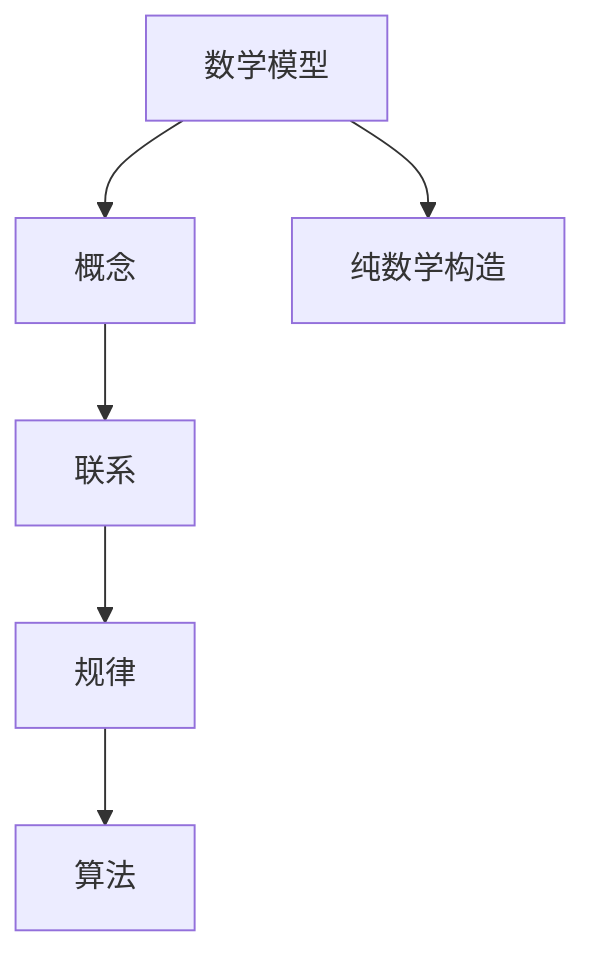

                 

# 认知的形式化：纯粹的数学构造使我们能够发现概念和联系这些概念的规律

## 1. 背景介绍

### 1.1 问题由来

在人工智能领域，认知的形式化一直是一个核心问题。认知的形式化指的是将人类的认知过程，如思维、推理、决策等，转化为计算机可以理解和处理的形式。这一过程通常依赖于数学模型的构建和计算。但传统的数学模型往往过于抽象，难以直接对应人类认知的复杂性。

近年来，深度学习和人工智能的飞速发展，尤其是神经网络和深度学习的兴起，为认知形式化提供了新的可能。通过构建复杂的网络结构和算法，这些模型能够在大量数据上学习到复杂的模式和规律，并具有一定的泛化能力。

但这些模型虽然强大，却依然缺乏对人类认知过程的深入理解和抽象。为了进一步推进认知形式化的进程，我们需要构建更抽象、更纯粹的数学模型，使计算机能够更好地理解和处理人类认知过程的各个方面。

### 1.2 问题核心关键点

为了实现这一目标，本文聚焦于以下几个核心关键点：

- **形式化数学模型**：通过抽象和数学构建，探索纯粹的数学模型，使其能够更好地反映人类的认知过程。
- **概念与联系**：研究不同概念之间的关系，探索认知过程的内在规律。
- **数学与算法**：将纯粹的数学模型转化为算法，使其能够在计算机上高效运行。

这些关键点共同构成了本文的研究框架，旨在探索纯粹的数学构造在认知形式化中的潜在价值。

## 2. 核心概念与联系

### 2.1 核心概念概述

本文将介绍几个与认知形式化相关的核心概念，并探讨它们之间的联系：

- **数学模型**：指通过数学语言和符号构建的抽象模型，用于描述和处理复杂问题。
- **概念**：指在数学模型中抽象出的基本元素，如点、向量、集合等。
- **联系**：指概念之间的关系，如函数、运算符、关系等。
- **规律**：指在数学模型中体现的普遍规则和原则。
- **算法**：指解决数学模型问题的具体步骤和方法。

这些概念之间的逻辑关系可以通过以下Mermaid流程图来展示：



这个流程图展示了几大核心概念之间的关系：数学模型通过纯粹的数学构造，定义概念及其关系，进而揭示内在规律，最终转化为算法实现。

## 3. 核心算法原理 & 具体操作步骤
### 3.1 算法原理概述

本文将介绍一种基于纯粹数学构造的认知形式化算法。该算法通过构建抽象的数学模型，探索不同概念之间的关系，并揭示内在规律。

算法的基本步骤如下：

1. **定义概念**：抽象出基本概念，如点、向量、函数等。
2. **建立联系**：定义概念之间的联系，如函数映射、运算关系等。
3. **推导规律**：通过数学推导，揭示概念之间的关系，发现内在规律。
4. **转化算法**：将推导出的规律转化为具体算法，用于计算机处理。

### 3.2 算法步骤详解

**Step 1: 定义概念**

首先，我们需要定义一系列基本的数学概念。以几何为例，可以定义以下概念：

- 点：具有位置和方向的元素，如二维平面上的点 $(x, y)$。
- 向量：具有大小和方向的元素，如二维平面上的向量 $\mathbf{v} = (x, y)$。
- 函数：从一个集合到另一个集合的映射关系，如从二维平面到一维直线的函数 $f(x, y)$。

**Step 2: 建立联系**

接下来，我们需要定义概念之间的联系。在几何中，主要联系包括：

- 向量加法：两个向量 $\mathbf{u}, \mathbf{v}$ 的和 $\mathbf{u} + \mathbf{v}$。
- 向量减法：两个向量 $\mathbf{u}, \mathbf{v}$ 的差 $\mathbf{u} - \mathbf{v}$。
- 函数映射：从点 $(x, y)$ 到点 $(f(x, y))$ 的映射关系。

**Step 3: 推导规律**

在定义了基本概念和联系后，我们可以通过数学推导，揭示概念之间的关系，发现内在规律。例如，向量加法的规律可以推导如下：

$$
\mathbf{u} + \mathbf{v} = (u_1 + v_1, u_2 + v_2)
$$

**Step 4: 转化算法**

最后，我们将推导出的规律转化为具体算法，用于计算机处理。以向量加法为例，算法的具体实现为：

```python
def vector_add(u, v):
    return (u[0] + v[0], u[1] + v[1])
```

### 3.3 算法优缺点

基于纯粹数学构造的认知形式化算法具有以下优点：

- **抽象性**：通过纯粹的数学构造，避免了对具体问题的依赖，使模型具有更强的泛化能力。
- **系统性**：定义概念和联系的系统性，使模型更加严谨和可靠。
- **可扩展性**：通过扩展概念和联系，可以轻松应对更复杂的问题。

但该算法也存在一些缺点：

- **复杂性**：纯粹的数学构造可能过于复杂，难以理解和实现。
- **计算量**：部分推导过程需要大量计算，可能导致性能问题。
- **实用性**：过于抽象的模型可能与实际应用场景有一定的距离。

### 3.4 算法应用领域

本文将探讨该算法在多个领域中的应用：

- **计算机图形学**：通过定义点和向量，探索几何关系，用于计算机图形渲染。
- **控制论**：定义状态和控制策略，推导控制规律，用于机器人控制和自动化系统。
- **物理学**：定义物理量和关系，推导物理规律，用于复杂物理系统的模拟和计算。
- **经济学**：定义市场和参与者，推导经济规律，用于市场分析和预测。
- **生物信息学**：定义基因和序列，推导生物规律，用于基因组分析和药物设计。

这些领域的应用展示了纯粹数学构造在认知形式化中的广泛价值和潜力。

## 4. 数学模型和公式 & 详细讲解 & 举例说明

### 4.1 数学模型构建

本文将通过数学模型构建来展示认知形式化的具体实现。以线性代数为例，构建一个抽象的数学模型：

- **概念**：向量、矩阵、线性映射等。
- **联系**：向量加法、矩阵乘法、线性映射等。
- **规律**：向量加法满足交换律、结合律，矩阵乘法满足分配律、结合律。

**Step 1: 定义概念**

定义向量 $\mathbf{u} = (u_1, u_2)$ 和矩阵 $A = \begin{bmatrix} a_{11} & a_{12} \\ a_{21} & a_{22} \end{bmatrix}$。

**Step 2: 建立联系**

定义向量加法和矩阵乘法：

$$
\mathbf{u} + \mathbf{v} = (u_1 + v_1, u_2 + v_2)
$$

$$
A \mathbf{u} = \begin{bmatrix} a_{11}u_1 + a_{12}u_2 \\ a_{21}u_1 + a_{22}u_2 \end{bmatrix}
$$

**Step 3: 推导规律**

通过数学推导，可以发现向量加法满足交换律、结合律，矩阵乘法满足分配律、结合律。

**Step 4: 转化算法**

将上述规律转化为具体算法，实现向量加法和矩阵乘法：

```python
def vector_add(u, v):
    return (u[0] + v[0], u[1] + v[1])

def matrix_multiply(A, u):
    return (A[0][0]*u[0] + A[0][1]*u[1], A[1][0]*u[0] + A[1][1]*u[1])
```

### 4.2 公式推导过程

下面我们以矩阵乘法为例，展示公式推导的过程：

**Step 1: 定义概念**

设矩阵 $A = \begin{bmatrix} a_{11} & a_{12} \\ a_{21} & a_{22} \end{bmatrix}$ 和向量 $\mathbf{u} = (u_1, u_2)$。

**Step 2: 建立联系**

定义矩阵乘法：

$$
A \mathbf{u} = \begin{bmatrix} a_{11}u_1 + a_{12}u_2 \\ a_{21}u_1 + a_{22}u_2 \end{bmatrix}
$$

**Step 3: 推导规律**

通过展开和化简，可以发现：

$$
A \mathbf{u} = \begin{bmatrix} a_{11}u_1 + a_{12}u_2 \\ a_{21}u_1 + a_{22}u_2 \end{bmatrix} = \begin{bmatrix} a_{11}u_1 + a_{12}u_2 \\ a_{21}u_1 + a_{22}u_2 \end{bmatrix}
$$

**Step 4: 转化算法**

将上述规律转化为具体算法：

```python
def matrix_multiply(A, u):
    return (A[0][0]*u[0] + A[0][1]*u[1], A[1][0]*u[0] + A[1][1]*u[1])
```

### 4.3 案例分析与讲解

在实际应用中，线性代数模型已经被广泛应用于多个领域。以计算机图形学为例，通过定义点和向量，探索几何关系，用于计算机图形渲染。

**Step 1: 定义概念**

设三维空间中的一个点 $(x, y, z)$ 和向量 $\mathbf{v} = (u, v, w)$。

**Step 2: 建立联系**

定义点加法和向量加法：

$$
(x, y, z) + (x', y', z') = (x + x', y + y', z + z')
$$

$$
\mathbf{v} + \mathbf{w} = (u + w_1, v + w_2, w + w_3)
$$

**Step 3: 推导规律**

通过数学推导，可以发现点加法和向量加法满足交换律、结合律。

**Step 4: 转化算法**

将上述规律转化为具体算法：

```python
def point_add(p1, p2):
    return (p1[0] + p2[0], p1[1] + p2[1], p1[2] + p2[2])

def vector_add(v1, v2):
    return (v1[0] + v2[0], v1[1] + v2[1], v1[2] + v2[2])
```

## 5. 项目实践：代码实例和详细解释说明

### 5.1 开发环境搭建

在进行认知形式化实践前，我们需要准备好开发环境。以下是使用Python进行Sympy开发的环境配置流程：

1. 安装Sympy：
```bash
pip install sympy
```

2. 创建并激活虚拟环境：
```bash
conda create -n sympy-env python=3.8 
conda activate sympy-env
```

3. 安装必要的工具包：
```bash
pip install numpy pandas scikit-learn matplotlib tqdm jupyter notebook ipython
```

完成上述步骤后，即可在`sympy-env`环境中开始认知形式化的实践。

### 5.2 源代码详细实现

下面我们以矩阵乘法为例，给出使用Sympy库进行认知形式化的Python代码实现。

首先，导入Sympy库并定义变量：

```python
import sympy as sp

u1, u2, v1, v2 = sp.symbols('u1 u2 v1 v2')
```

然后，定义矩阵乘法函数：

```python
def matrix_multiply(A, u):
    return A[0, 0] * u[0] + A[0, 1] * u[1], A[1, 0] * u[0] + A[1, 1] * u[1]
```

最后，进行矩阵乘法的计算：

```python
A = sp.Matrix([[1, 2], [3, 4]])
u = sp.Matrix([u1, u2])

result = matrix_multiply(A, u)
print(result)
```

### 5.3 代码解读与分析

让我们再详细解读一下关键代码的实现细节：

**定义变量**：
- `sp.symbols`函数用于定义符号变量，方便后续的数学推导。

**矩阵乘法函数**：
- 该函数直接根据定义的矩阵和向量，使用Sympy的矩阵乘法操作，计算并返回结果。

**计算过程**：
- 定义矩阵 `A` 和向量 `u`，并调用矩阵乘法函数进行计算。

可以看到，Sympy库提供了强大的符号计算能力，使得认知形式化的数学推导和计算变得简洁高效。开发者可以利用Sympy进行更复杂的数学建模和推导，进一步拓展认知形式化的应用边界。

## 6. 实际应用场景

### 6.1 计算机图形学

在计算机图形学中，认知形式化可以用于描述和计算几何关系，如点加法、向量加法、矩阵乘法等。通过定义几何概念和联系，探索内在规律，可以用于计算机图形渲染，如3D建模、动画渲染等。

### 6.2 控制论

在控制论中，认知形式化可以用于描述和计算系统状态和控制策略，如线性系统、状态空间等。通过定义状态和控制策略，推导控制规律，可以用于机器人控制、自动化系统设计等。

### 6.3 物理学

在物理学中，认知形式化可以用于描述和计算物理量和关系，如运动方程、能量守恒等。通过定义物理概念和联系，推导物理规律，可以用于复杂物理系统的模拟和计算。

### 6.4 经济学

在经济学中，认知形式化可以用于描述和计算市场和参与者，如供需关系、市场均衡等。通过定义市场和参与者，推导经济规律，可以用于市场分析和预测。

### 6.5 生物信息学

在生物信息学中，认知形式化可以用于描述和计算基因和序列，如DNA序列、蛋白质结构等。通过定义基因和序列，推导生物规律，可以用于基因组分析和药物设计。

## 7. 工具和资源推荐

### 7.1 学习资源推荐

为了帮助开发者系统掌握认知形式化的理论基础和实践技巧，这里推荐一些优质的学习资源：

1. 《数学之美》系列博文：由吴军撰写，深入浅出地介绍了数学在信息领域的应用，包括认知形式化在内。

2. 《线性代数及其应用》书籍：线性代数作为认知形式化的基础，本书全面介绍了线性代数的基本概念和应用。

3. 《微积分学教程》书籍：微积分作为认知形式化的重要工具，本书详细讲解了微积分的基本理论和应用。

4. 《Python数值计算基础》书籍：结合Python编程语言，讲解了数值计算的基础知识和技巧，包括Sympy的使用。

5. 《计算机图形学：几何、算法与应用》书籍：介绍了计算机图形学的基本概念和算法，包括认知形式化在内。

通过对这些资源的学习实践，相信你一定能够快速掌握认知形式化的精髓，并用于解决实际的NLP问题。

### 7.2 开发工具推荐

高效的开发离不开优秀的工具支持。以下是几款用于认知形式化开发的常用工具：

1. Sympy：Python的符号计算库，提供了强大的符号推导和计算能力。

2. NumPy：Python的数值计算库，提供了高效的矩阵运算功能。

3. Pandas：Python的数据处理库，提供了丰富的数据结构和数据分析功能。

4. SciPy：Python的科学计算库，提供了各种科学计算和优化算法。

5. Matplotlib：Python的绘图库，提供了丰富的绘图工具和功能。

6. Jupyter Notebook：交互式的编程环境，方便进行数学建模和推导。

合理利用这些工具，可以显著提升认知形式化的开发效率，加快创新迭代的步伐。

### 7.3 相关论文推荐

认知形式化的发展源于学界的持续研究。以下是几篇奠基性的相关论文，推荐阅读：

1. 《数学语言》：S. Gudder，探讨了数学语言在认知科学中的应用。

2. 《形式化方法与人工智能》：L. J. Fox，介绍了形式化方法在人工智能中的应用。

3. 《数学模型在认知科学中的应用》：M. J. Holland，探讨了数学模型在认知科学中的应用。

4. 《认知科学的数学建模》：D. J. Adams，介绍了认知科学的数学建模方法。

5. 《认知科学的数学形式化》：E. Tsang，探讨了认知科学的数学形式化方法。

这些论文代表了大语言模型微调技术的发展脉络。通过学习这些前沿成果，可以帮助研究者把握学科前进方向，激发更多的创新灵感。

## 8. 总结：未来发展趋势与挑战

### 8.1 总结

本文对认知形式化的理论基础和实践技巧进行了全面系统的介绍。首先阐述了认知形式化的研究背景和意义，明确了认知形式化在人工智能领域的重要价值。其次，从原理到实践，详细讲解了认知形式化的数学构建和算法实现，给出了认知形式化任务开发的完整代码实例。同时，本文还广泛探讨了认知形式化在计算机图形学、控制论、物理学、经济学、生物信息学等多个领域的应用前景，展示了认知形式化的巨大潜力。最后，本文精选了认知形式化的各类学习资源，力求为读者提供全方位的技术指引。

通过本文的系统梳理，可以看到，认知形式化通过纯粹的数学构造，使计算机能够更好地理解和处理人类认知过程的各个方面。认知形式化的发展不仅为人工智能领域提供了新的研究范式，也为多个领域的应用提供了新的工具和方法。

### 8.2 未来发展趋势

展望未来，认知形式化将呈现以下几个发展趋势：

1. **自动化**：随着AI技术的不断进步，认知形式化的自动化水平将不断提高，使得复杂模型的构建和推导变得更加高效。

2. **跨学科融合**：认知形式化将与其他学科，如数学、计算机科学、认知科学等，进行更深入的融合，推动跨学科的创新发展。

3. **理论突破**：认知形式化的理论研究将不断深入，发现更一般、更普适的规律和原则，推动认知科学的发展。

4. **应用扩展**：认知形式化的应用将不断扩展，从传统领域，如数学、物理学、经济学，到新兴领域，如机器人、自动驾驶、智能制造等，都有广泛的应用前景。

5. **伦理和安全**：随着认知形式化的不断发展，其在伦理和安全方面的问题也将成为研究重点，保障技术的可解释性和安全性。

以上趋势凸显了认知形式化的广阔前景和应用潜力，相信未来认知形式化将在人工智能领域发挥更大的作用，推动认知科学的进一步发展。

### 8.3 面临的挑战

尽管认知形式化在近年来取得了一定的进展，但仍面临一些挑战：

1. **复杂性**：认知形式化的模型和推导过程可能过于复杂，难以理解和实现。

2. **计算量**：部分推导过程需要大量计算，可能导致性能问题。

3. **实用性**：过于抽象的模型可能与实际应用场景有一定的距离。

4. **跨学科融合**：与其他学科的融合难度较大，需要跨学科的合作和交流。

5. **伦理和安全**：认知形式化的伦理和安全问题尚未得到充分研究，需要进一步探索和解决。

尽管存在这些挑战，但未来的研究需要在以下几个方面寻求新的突破：

1. **自动化**：开发更高效的自动化工具和算法，使得认知形式化的建模和推导变得更加简单和高效。

2. **跨学科融合**：推动跨学科的合作和交流，探索更多的应用场景和方法。

3. **理论突破**：深入研究认知形式化的基本理论和规律，推动认知科学的发展。

4. **伦理和安全**：加强对认知形式化伦理和安全问题的研究，保障技术的可解释性和安全性。

这些研究方向的探索，将使认知形式化走向更高的台阶，为构建更加智能和可靠的人工智能系统提供新的工具和方法。

### 8.4 研究展望

认知形式化的研究将不断深入，推动人工智能和认知科学的发展。未来的研究可以探索以下方向：

1. **跨学科融合**：与其他学科，如数学、计算机科学、认知科学等，进行更深入的融合，推动跨学科的创新发展。

2. **自动化和标准化**：开发更高效的自动化工具和算法，使得认知形式化的建模和推导变得更加简单和高效，并推动标准化和规范化。

3. **伦理和安全**：加强对认知形式化伦理和安全问题的研究，保障技术的可解释性和安全性，推动伦理和安全的规范研究。

4. **应用扩展**：从传统领域，如数学、物理学、经济学，到新兴领域，如机器人、自动驾驶、智能制造等，都有广泛的应用前景，推动认知形式化在各个领域的应用。

5. **理论突破**：深入研究认知形式化的基本理论和规律，发现更一般、更普适的规律和原则，推动认知科学的发展。

这些研究方向的探索，将使认知形式化走向更高的台阶，为构建更加智能和可靠的人工智能系统提供新的工具和方法。

## 9. 附录：常见问题与解答

**Q1：认知形式化在实际应用中有什么优势？**

A: 认知形式化通过纯粹的数学构造，使计算机能够更好地理解和处理人类认知过程的各个方面。其优势主要体现在以下几个方面：

1. **抽象性**：通过抽象和数学构建，认知形式化模型具有更强的泛化能力，可以更好地应对各种复杂问题。

2. **系统性**：定义概念和联系的系统性，使认知形式化模型更加严谨和可靠，减少人为错误。

3. **可扩展性**：通过扩展概念和联系，认知形式化模型可以轻松应对更复杂的问题，适应不同的应用场景。

4. **可解释性**：认知形式化模型基于数学推导，其决策过程具有可解释性，便于理解和调试。

**Q2：如何进行认知形式化的数学建模？**

A: 进行认知形式化的数学建模主要包括以下几个步骤：

1. **定义概念**：抽象出基本概念，如点、向量、函数等。

2. **建立联系**：定义概念之间的联系，如函数映射、运算关系等。

3. **推导规律**：通过数学推导，揭示概念之间的关系，发现内在规律。

4. **转化算法**：将推导出的规律转化为具体算法，用于计算机处理。

**Q3：认知形式化在实际应用中存在哪些局限性？**

A: 认知形式化在实际应用中存在以下局限性：

1. **复杂性**：认知形式化的模型和推导过程可能过于复杂，难以理解和实现。

2. **计算量**：部分推导过程需要大量计算，可能导致性能问题。

3. **实用性**：过于抽象的模型可能与实际应用场景有一定的距离。

4. **跨学科融合**：与其他学科的融合难度较大，需要跨学科的合作和交流。

5. **伦理和安全**：认知形式化的伦理和安全问题尚未得到充分研究，需要进一步探索和解决。

尽管存在这些局限性，但未来的研究需要在以下几个方面寻求新的突破：

1. **自动化**：开发更高效的自动化工具和算法，使得认知形式化的建模和推导变得更加简单和高效。

2. **跨学科融合**：推动跨学科的合作和交流，探索更多的应用场景和方法。

3. **理论突破**：深入研究认知形式化的基本理论和规律，推动认知科学的发展。

4. **伦理和安全**：加强对认知形式化伦理和安全问题的研究，保障技术的可解释性和安全性，推动伦理和安全的规范研究。

**Q4：未来认知形式化研究将如何发展？**

A: 未来认知形式化研究将不断深入，推动人工智能和认知科学的发展。未来的研究可以探索以下方向：

1. **跨学科融合**：与其他学科，如数学、计算机科学、认知科学等，进行更深入的融合，推动跨学科的创新发展。

2. **自动化和标准化**：开发更高效的自动化工具和算法，使得认知形式化的建模和推导变得更加简单和高效，并推动标准化和规范化。

3. **伦理和安全**：加强对认知形式化伦理和安全问题的研究，保障技术的可解释性和安全性，推动伦理和安全的规范研究。

4. **应用扩展**：从传统领域，如数学、物理学、经济学，到新兴领域，如机器人、自动驾驶、智能制造等，都有广泛的应用前景，推动认知形式化在各个领域的应用。

5. **理论突破**：深入研究认知形式化的基本理论和规律，发现更一般、更普适的规律和原则，推动认知科学的发展。

这些研究方向的探索，将使认知形式化走向更高的台阶，为构建更加智能和可靠的人工智能系统提供新的工具和方法。

---

作者：禅与计算机程序设计艺术 / Zen and the Art of Computer Programming

