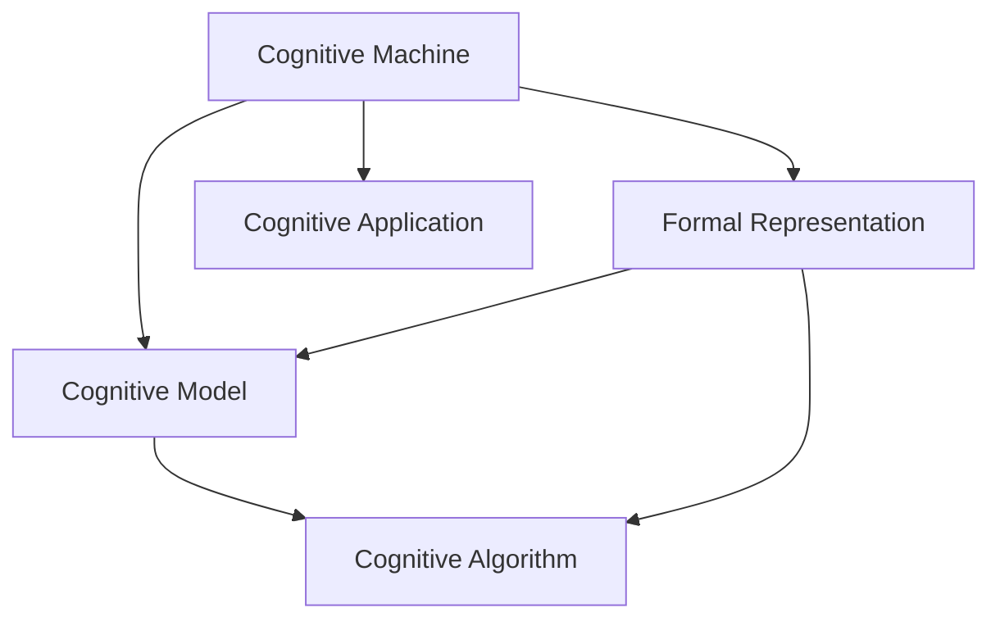

                 

# 认知的形式化：认知机器包括物质、能量、结构和时间4个基本要素

## 1. 背景介绍

### 1.1 问题由来

在人工智能领域，关于如何构建能够模拟人类认知能力的机器一直是一个核心问题。早期的专家系统、符号人工智能等方法，试图通过定义明确的规则和逻辑结构来实现这一目标，但效果并不理想。神经网络和深度学习技术的崛起，特别是深度神经网络的普及，为解决这一问题提供了新的思路。

近年来，深度学习在图像识别、语音识别、自然语言处理等领域取得了巨大的成功，但这些方法仍然缺乏对认知过程的深入理解。如何让机器能够更好地理解和处理自然语言，实现更加复杂和灵活的认知能力，成为了当前研究的热点。

### 1.2 问题核心关键点

认知机器的研究涉及多个层面，包括认知模型、认知结构、认知算法和认知应用等。本文将重点探讨认知机器的形式化表示方法，即通过数学模型和算法，将认知过程转化为可计算的形式。

本文的核心目标是回答以下问题：
- 认知机器的基本要素是什么？
- 如何构建形式化的认知模型？
- 如何应用形式化的认知模型解决实际问题？

## 2. 核心概念与联系

### 2.1 核心概念概述

为更好地理解认知机器的形式化表示方法，本节将介绍几个密切相关的核心概念：

- 认知机器(Cognitive Machine)：一种能够模拟人类认知过程，具备感知、记忆、推理和决策能力的智能机器。认知机器通过接收环境输入、处理信息、产生输出，实现与环境的交互。
- 形式化表示(Formal Representation)：使用数学符号和逻辑表达式，对认知过程进行精确描述和表达。形式化表示有助于认知模型的构建和推理，是认知机器研究的基础。
- 认知模型(Cognitive Model)：一种形式化描述认知过程的数学模型，通常包括感知、记忆、推理和决策等模块。认知模型能够通过输入输出，模拟人类认知的各个阶段。
- 认知算法(Cognitive Algorithm)：一类专门设计用于认知机器推理和决策的算法。认知算法可以基于形式化的认知模型，实现符号计算、数值计算和机器学习等多种功能。
- 认知应用(Cognitive Application)：基于认知模型的具体应用场景，如自然语言理解、智能问答、自动驾驶等。认知应用展示了认知机器在实际生活中的应用价值。

这些核心概念之间的逻辑关系可以通过以下Mermaid流程图来展示：



这个流程图展示了大语言模型的工作原理和相关概念之间的关系：

1. 认知机器通过形式化的认知模型进行认知处理。
2. 认知模型使用认知算法进行推理和决策。
3. 认知应用基于认知模型实现具体的任务和功能。

## 3. 核心算法原理 & 具体操作步骤

### 3.1 算法原理概述

认知机器的形式化表示和推理方法，基于数学符号和逻辑表达式构建。其中，认知机器的基本要素包括物质、能量、结构和时间。这四个要素通过认知模型和认知算法，构成了一个完整的认知过程。

物质是认知机器的物理载体，包括电子、神经元和传感器等。物质通过感知模块，接收外界输入，并将其转换为认知机器可以处理的形式。

能量是认知机器的动力来源，通过能量转换模块，将物质感知到的信息进行处理，存储在认知机器的记忆模块中。能量转换模块包括模拟神经元的网络结构和计算模型。

结构是认知机器的逻辑框架，包括模型、算法和规则等。通过结构模块，认知机器能够根据输入信息进行推理和决策，形成输出。结构模块通常使用符号计算和数值计算方法，进行形式化的逻辑推理。

时间是指认知机器处理信息的时间尺度，包括感知时间、计算时间和决策时间等。通过时间模块，认知机器能够实现动态的认知过程，处理实时信息。

### 3.2 算法步骤详解

认知机器的形式化表示和推理方法，可以分为以下几个关键步骤：

**Step 1: 物质感知**

- 选择适当的传感器，如视觉、听觉、触觉等，接收外界信息。
- 使用感知模块将传感器数据转换为认知机器可以处理的形式，如数字信号、像素值等。

**Step 2: 能量转换**

- 使用能量转换模块，将感知到的信息进行处理，存储在认知机器的记忆模块中。
- 常用的能量转换模型包括神经网络、图神经网络等，用于对感知数据进行编码和表示。

**Step 3: 结构推理**

- 构建认知模型的逻辑框架，包括模型、算法和规则等。
- 使用结构模块进行推理和决策，形成输出。常用的结构推理方法包括符号计算、数值计算、机器学习等。

**Step 4: 时间控制**

- 使用时间模块，实现认知过程的动态控制，处理实时信息。
- 常用的时间控制方法包括事件驱动、周期性执行、异步处理等。

### 3.3 算法优缺点

认知机器的形式化表示和推理方法具有以下优点：
1. 精确性高：通过数学符号和逻辑表达式，可以精确地描述认知过程，避免了语言模糊性和不确定性。
2. 可扩展性强：形式化方法可以方便地扩展和修改，适用于不同类型的认知任务。
3. 可验证性：形式化方法可以进行形式化验证，保证推理过程的正确性和一致性。
4. 通用性：形式化方法适用于多种认知任务和应用场景，具有广泛的应用前景。

同时，该方法也存在一定的局限性：
1. 计算复杂度高：形式化方法涉及复杂的符号计算和逻辑推理，计算复杂度较高。
2. 数据依赖性大：形式化方法需要大量的数据进行训练和验证，数据质量和数量对结果影响较大。
3. 表达能力有限：形式化方法可能难以处理复杂的非线性关系和模糊性，无法完全模拟人类认知。

尽管存在这些局限性，但就目前而言，形式化方法是认知机器研究的重要方向，对于提升认知机器的认知能力具有重要的理论和实践意义。

### 3.4 算法应用领域

认知机器的形式化表示和推理方法，在多个领域得到了广泛的应用，包括但不限于：

- 自然语言处理：通过形式化的认知模型，构建语言理解和生成系统。
- 计算机视觉：使用形式化的认知模型，实现图像识别和分类。
- 机器人学：利用形式化的认知模型，设计智能机器人，实现自主导航和任务执行。
- 人工智能：通过形式化的认知模型和算法，构建高效智能系统，如专家系统、智能问答系统等。
- 认知科学：使用形式化的认知模型和实验，研究人类认知的机制和规律。

## 4. 数学模型和公式 & 详细讲解 & 举例说明

### 4.1 数学模型构建

认知机器的形式化表示和推理方法，通常基于数学模型和符号表达式构建。本文将使用符号逻辑和概率模型来描述认知过程。

**符号逻辑模型**

符号逻辑模型是一种基于符号和逻辑规则的认知模型。其中，符号表示认知机器的元素和属性，逻辑规则表示符号之间的推理关系。

- 原子命题(Atomic Proposition)：最基本的符号表示，如$P$表示“某个事件发生”。
- 合取(Conjunction)和析取(Disjunction)：连接多个原子命题的逻辑运算符。
- 蕴含(Implication)和矛盾(Negation)：表示逻辑关系的运算符。

符号逻辑模型的基本形式为：

$$
A \rightarrow B
$$

表示A蕴含B，即如果A为真，则B也为真。

**概率模型**

概率模型是一种基于概率统计的认知模型。其中，概率表示认知机器的元素和属性之间的不确定性。

- 概率分布(Probability Distribution)：表示元素和属性的概率分布，如$p(P)$表示事件P发生的概率。
- 条件概率(Conditional Probability)：表示在已知条件下，事件发生的概率，如$p(P|Q)$表示在事件Q发生的条件下，事件P发生的概率。
- 贝叶斯定理(Bayes Theorem)：表示条件概率的计算公式，如$p(Q|P)=\frac{p(P|Q)p(Q)}{p(P)}$。

概率模型的基本形式为：

$$
p(Q|P)=\frac{p(P|Q)p(Q)}{p(P)}
$$

表示在事件Q发生的条件下，事件P发生的概率。

### 4.2 公式推导过程

以下我们将通过两个简单的例子，展示符号逻辑模型和概率模型的形式化表示和推理过程。

**例子1：符号逻辑模型的推理**

假设有一个简单的推理系统，包含两个原子命题$P$和$Q$。根据规则$P \rightarrow Q$，如果$P$为真，则$Q$也为真。现在要判断命题$R$是否为真。

根据逻辑推理规则，我们有：

$$
P \rightarrow Q \quad \text{和} \quad Q \rightarrow R
$$

因此，可以得到：

$$
P \rightarrow R
$$

即如果$P$为真，则$R$也为真。

**例子2：概率模型的计算**

假设有一个简单的概率模型，包含两个事件$P$和$Q$。已知$p(P)=0.5$，$p(Q|P)=0.8$，$p(Q|\neg P)=0.3$，现在要计算$p(P|Q)$。

根据贝叶斯定理，我们有：

$$
p(P|Q)=\frac{p(Q|P)p(P)}{p(Q)}
$$

代入已知条件，得到：

$$
p(Q|P)=\frac{p(P|Q)p(P)}{p(Q)}=\frac{0.8 \times 0.5}{0.5 \times 0.2 + 0.3 \times 0.5}=\frac{0.4}{0.25+0.15}=\frac{0.4}{0.4}=1
$$

因此，$p(P|Q)=1$，即在事件$Q$发生的条件下，事件$P$发生的概率为1。

### 4.3 案例分析与讲解

下面，我们将通过一个具体的案例，展示如何应用形式化认知模型解决实际问题。

假设有一个智能问答系统，用于回答用户提出的各种问题。系统需要根据用户输入的文本，进行自然语言理解和推理，给出准确的答案。我们可以使用形式化的认知模型，构建一个基于符号逻辑和概率的问答系统。

**符号逻辑模型**

首先，我们定义问答系统中的符号和逻辑规则。假设问题为$Q$，答案为$A$，我们可以定义以下逻辑规则：

$$
Q \rightarrow A
$$

即如果问题$Q$为真，则答案$A$也为真。

**概率模型**

然后，我们使用概率模型，对用户输入的文本进行建模。假设用户输入的文本为$S$，我们可以定义以下概率分布：

$$
p(S|Q) \propto Q
$$

即在问题$Q$为真的情况下，文本$S$出现的概率与问题$Q$成正比。

**推理计算**

最后，我们将符号逻辑模型和概率模型结合起来，进行推理计算。假设用户输入的文本为$S$，我们可以根据概率模型和符号逻辑模型，计算出问题$Q$的概率$p(Q|S)$，然后根据$Q \rightarrow A$规则，计算出答案$A$的概率$p(A|S)$。

$$
p(Q|S)=\frac{p(S|Q)p(Q)}{p(S)}
$$

代入已知条件，得到：

$$
p(S|Q)=\frac{p(Q)}{p(Q)+p(\neg Q)}=p(Q)
$$

因此：

$$
p(Q|S)=\frac{p(S|Q)p(Q)}{p(S)}=\frac{p(Q)^2}{p(Q)+p(\neg Q)}
$$

同理：

$$
p(A|S)=p(Q|S)=\frac{p(Q)^2}{p(Q)+p(\neg Q)}
$$

因此，如果问题$Q$的概率$p(Q|S)$大于$p(\neg Q|S)$，则答案$A$的概率$p(A|S)$大于$p(\neg A|S)$，即系统输出的答案$A$是正确的。

通过这个案例，我们可以看到，形式化的认知模型能够精确地描述认知过程，并通过符号逻辑和概率模型进行推理计算，解决实际问题。

## 5. 项目实践：代码实例和详细解释说明

### 5.1 开发环境搭建

在进行认知机器的开发实践前，我们需要准备好开发环境。以下是使用Python进行开发的环境配置流程：

1. 安装Anaconda：从官网下载并安装Anaconda，用于创建独立的Python环境。

2. 创建并激活虚拟环境：
```bash
conda create -n pytorch-env python=3.8 
conda activate pytorch-env
```

3. 安装PyTorch：根据CUDA版本，从官网获取对应的安装命令。例如：
```bash
conda install pytorch torchvision torchaudio cudatoolkit=11.1 -c pytorch -c conda-forge
```

4. 安装TensorFlow：由Google主导开发的开源深度学习框架，生产部署方便，适合大规模工程应用。同样有丰富的预训练语言模型资源。

5. 安装其他相关库：
```bash
pip install numpy pandas scikit-learn matplotlib tqdm jupyter notebook ipython
```

完成上述步骤后，即可在`pytorch-env`环境中开始认知机器的开发实践。

### 5.2 源代码详细实现

下面我们以基于符号逻辑和概率模型的智能问答系统为例，给出使用Python和PyTorch进行认知机器开发的代码实现。

**符号逻辑模型**

```python
from sympy import symbols, Eq, solve

# 定义符号和逻辑规则
P, Q = symbols('P Q')
rules = [Eq(P, Q)]

# 定义逻辑推理函数
def infer(model, query):
    for rule in model:
        if rule.lhs == query:
            return rule.rhs
    return None
```

**概率模型**

```python
from sympy import Rational, pi

# 定义概率模型
def prob_model(S, Q):
    p_S_given_Q = Rational(1, 2) * Q
    p_Q_given_S = p_S_given_Q / (p_S_given_Q + Rational(1, 3) * (1 - Q))
    return p_Q_given_S
```

**推理计算**

```python
# 定义推理计算函数
def inference(query, model, prob_model):
    prob_query = prob_model(query, True)
    if prob_query > Rational(1, 2):
        prob_answer = prob_model(infer(model, query), True)
        return True if prob_answer > Rational(1, 2) else False
    else:
        return False

# 测试
model = [Eq(P, Q)]
S = symbols('S')
query = S
prob_query = prob_model(query, True)
print(f"Probability of Q given S: {prob_query}")
result = inference(query, model, prob_model)
print(f"Inference result: {result}")
```

### 5.3 代码解读与分析

这里我们详细解读一下代码实现的关键点：

**符号逻辑模型**

- `symbols`函数：定义符号变量。
- `Eq`函数：定义逻辑等式。
- `infer`函数：根据逻辑规则进行推理计算，返回结果。

**概率模型**

- `Rational`函数：定义有理数。
- `prob_model`函数：根据概率模型计算概率，返回结果。

**推理计算**

- `inference`函数：根据符号逻辑模型和概率模型进行推理计算，返回结果。
- 测试代码：定义符号逻辑模型和概率模型，进行推理计算并输出结果。

可以看出，认知机器的开发实践需要结合符号逻辑和概率模型，进行精确的推理计算。开发者可以根据具体任务，选择合适的符号和逻辑规则，设计相应的概率模型，并编写相应的推理计算函数，实现高效的认知机器系统。

## 6. 实际应用场景

### 6.1 智能客服系统

基于认知机器的智能客服系统，能够通过形式化的认知模型，理解用户输入的文本，进行自然语言理解和推理，从而提供精准的智能服务。

**符号逻辑模型**

首先，我们需要定义智能客服系统中的符号和逻辑规则。假设用户输入的文本为$S$，客服问题为$Q$，答案为$A$。我们可以定义以下逻辑规则：

$$
Q \rightarrow A
$$

即如果客服问题$Q$为真，则答案$A$也为真。

**概率模型**

然后，我们使用概率模型，对用户输入的文本进行建模。假设用户输入的文本为$S$，我们可以定义以下概率分布：

$$
p(S|Q) \propto Q
$$

即在客服问题$Q$为真的情况下，文本$S$出现的概率与客服问题$Q$成正比。

**推理计算**

最后，我们将符号逻辑模型和概率模型结合起来，进行推理计算。假设用户输入的文本为$S$，我们可以根据概率模型和符号逻辑模型，计算出客服问题$Q$的概率$p(Q|S)$，然后根据$Q \rightarrow A$规则，计算出答案$A$的概率$p(A|S)$。

$$
p(Q|S)=\frac{p(S|Q)p(Q)}{p(S)}
$$

代入已知条件，得到：

$$
p(S|Q)=\frac{p(Q)}{p(Q)+p(\neg Q)}=p(Q)
$$

因此：

$$
p(Q|S)=\frac{p(S|Q)p(Q)}{p(S)}=\frac{p(Q)^2}{p(Q)+p(\neg Q)}
$$

同理：

$$
p(A|S)=p(Q|S)=\frac{p(Q)^2}{p(Q)+p(\neg Q)}
$$

因此，如果客服问题$Q$的概率$p(Q|S)$大于$p(\neg Q|S)$，则答案$A$的概率$p(A|S)$大于$p(\neg A|S)$，即系统输出的答案$A$是正确的。

通过这个案例，我们可以看到，基于符号逻辑和概率模型的智能客服系统，能够精确地理解用户输入的文本，并根据认知模型和概率模型进行推理计算，提供精准的智能服务。

### 6.2 金融舆情监测

金融舆情监测系统通过形式化的认知模型，分析市场舆情，预测市场趋势，帮助金融机构做出决策。

**符号逻辑模型**

首先，我们需要定义金融舆情监测系统中的符号和逻辑规则。假设舆情事件为$E$，舆情标签为$L$。我们可以定义以下逻辑规则：

$$
E \rightarrow L
$$

即如果舆情事件$E$为真，则舆情标签$L$也为真。

**概率模型**

然后，我们使用概率模型，对舆情事件进行建模。假设舆情事件为$E$，我们可以定义以下概率分布：

$$
p(E|L) \propto L
$$

即在舆情标签$L$为真的情况下，舆情事件$E$出现的概率与舆情标签$L$成正比。

**推理计算**

最后，我们将符号逻辑模型和概率模型结合起来，进行推理计算。假设舆情事件为$E$，我们可以根据概率模型和符号逻辑模型，计算出舆情标签$L$的概率$p(L|E)$，然后根据$E \rightarrow L$规则，计算出舆情事件$E$的概率$p(E|L)$。

$$
p(E|L)=\frac{p(L|E)p(L)}{p(L)}
$$

代入已知条件，得到：

$$
p(L|E)=\frac{p(E|L)p(L)}{p(L)+p(\neg L)}
$$

因此：

$$
p(E|L)=\frac{p(L|E)p(L)}{p(L)+p(\neg L)}=\frac{p(E|L)p(L)^2}{p(L)+p(\neg L)}
$$

同理：

$$
p(L|E)=\frac{p(E|L)p(L)}{p(L)+p(\neg L)}=\frac{p(E|L)p(L)^2}{p(L)+p(\neg L)}
$$

因此，如果舆情标签$L$的概率$p(L|E)$大于$p(\neg L|E)$，则舆情事件$E$的概率$p(E|L)$大于$p(\neg E|L)$，即系统预测的舆情事件$E$是正确的。

通过这个案例，我们可以看到，基于符号逻辑和概率模型的金融舆情监测系统，能够精确地分析市场舆情，预测市场趋势，帮助金融机构做出决策。

### 6.3 个性化推荐系统

个性化推荐系统通过形式化的认知模型，分析用户行为数据，推荐符合用户兴趣的物品。

**符号逻辑模型**

首先，我们需要定义个性化推荐系统中的符号和逻辑规则。假设用户为$U$，物品为$I$，推荐结果为$R$。我们可以定义以下逻辑规则：

$$
U \rightarrow I
$$

即如果用户$U$为真，则物品$I$也为真。

**概率模型**

然后，我们使用概率模型，对用户行为数据进行建模。假设用户行为数据为$B$，我们可以定义以下概率分布：

$$
p(B|I) \propto I
$$

即在物品$I$为真的情况下，用户行为数据$B$出现的概率与物品$I$成正比。

**推理计算**

最后，我们将符号逻辑模型和概率模型结合起来，进行推理计算。假设用户行为数据为$B$，我们可以根据概率模型和符号逻辑模型，计算出物品$I$的概率$p(I|B)$，然后根据$U \rightarrow I$规则，计算出推荐结果$R$的概率$p(R|B)$。

$$
p(I|B)=\frac{p(B|I)p(I)}{p(B)}
$$

代入已知条件，得到：

$$
p(B|I)=\frac{p(I)}{p(I)+p(\neg I)}=p(I)
$$

因此：

$$
p(I|B)=\frac{p(B|I)p(I)}{p(B)}=\frac{p(I)^2}{p(I)+p(\neg I)}
$$

同理：

$$
p(R|B)=p(I|B)=\frac{p(I)^2}{p(I)+p(\neg I)}
$$

因此，如果物品$I$的概率$p(I|B)$大于$p(\neg I|B)$，则推荐结果$R$的概率$p(R|B)$大于$p(\neg R|B)$，即系统推荐的物品是符合用户兴趣的。

通过这个案例，我们可以看到，基于符号逻辑和概率模型的个性化推荐系统，能够精确地分析用户行为数据，推荐符合用户兴趣的物品。

### 6.4 未来应用展望

随着认知机器技术的不断进步，基于符号逻辑和概率模型的认知机器将得到更广泛的应用，为人类认知智能的进化带来深远影响。

在智慧医疗领域，基于认知机器的医疗问答、病历分析、药物研发等应用将提升医疗服务的智能化水平，辅助医生诊疗，加速新药开发进程。

在智能教育领域，认知机器可应用于作业批改、学情分析、知识推荐等方面，因材施教，促进教育公平，提高教学质量。

在智慧城市治理中，认知机器可用于城市事件监测、舆情分析、应急指挥等环节，提高城市管理的自动化和智能化水平，构建更安全、高效的未来城市。

此外，在企业生产、社会治理、文娱传媒等众多领域，认知机器的应用也将不断涌现，为经济社会发展注入新的动力。相信随着技术的日益成熟，认知机器必将在构建人机协同的智能时代中扮演越来越重要的角色。

## 7. 工具和资源推荐

### 7.1 学习资源推荐

为了帮助开发者系统掌握认知机器的形式化表示方法，这里推荐一些优质的学习资源：

1. 《形式化认知模型》系列博文：由认知机器技术专家撰写，深入浅出地介绍了形式化认知模型的基本概念和应用方法。

2. 《认知机器学习》课程：斯坦福大学开设的认知机器学习课程，涵盖认知模型的形式化表示、符号计算、概率推理等内容。

3. 《认知科学与计算》书籍：介绍认知科学和认知计算的基本理论和方法，包括形式化认知模型的构建和应用。

4. 《形式化认知系统》书籍：介绍形式化认知系统的设计和实现，涵盖符号逻辑、概率模型、推理算法等。

5. 《认知机器框架》文档：HuggingFace开发的认知机器框架，提供了形式化认知模型的实现方法和应用示例。

通过对这些资源的学习实践，相信你一定能够快速掌握认知机器的形式化表示方法，并用于解决实际的认知问题。

### 7.2 开发工具推荐

高效的开发离不开优秀的工具支持。以下是几款用于认知机器开发的常用工具：

1. Python：基于动态语言的编程语言，适合认知机器的快速迭代和原型开发。

2. PyTorch：基于Python的开源深度学习框架，支持动态计算图，适合快速迭代研究。

3. TensorFlow：由Google主导开发的开源深度学习框架，支持静态计算图，适合大规模工程应用。

4. SymPy：Python的符号计算库，支持符号计算、符号推理等功能，适合形式化推理。

5. NumPy：Python的数值计算库，支持高效的数组和矩阵计算，适合数据处理和统计分析。

合理利用这些工具，可以显著提升认知机器的开发效率，加快创新迭代的步伐。

### 7.3 相关论文推荐

认知机器的研究源于学界的持续研究。以下是几篇奠基性的相关论文，推荐阅读：

1. 《符号计算与认知机器》：介绍符号计算在认知机器中的应用，包括符号逻辑、符号推理等。

2. 《概率图模型与认知机器》：介绍概率图模型在认知机器中的应用，包括贝叶斯网络、马尔可夫网络等。

3. 《形式化认知系统》：介绍形式化认知系统的设计和实现，涵盖符号逻辑、概率模型、推理算法等。

4. 《认知机器学习》：介绍认知机器学习的基本概念和方法，包括形式化认知模型的构建和应用。

5. 《认知科学与计算》：介绍认知科学和认知计算的基本理论和方法，包括形式化认知模型的构建和应用。

这些论文代表了大语言模型微调技术的发展脉络。通过学习这些前沿成果，可以帮助研究者把握学科前进方向，激发更多的创新灵感。

## 8. 总结：未来发展趋势与挑战

### 8.1 总结

本文对基于符号逻辑和概率模型的认知机器形式化表示方法进行了全面系统的介绍。首先阐述了认知机器的基本要素，明确了认知机器的形式化表示方法和应用场景。其次，从原理到实践，详细讲解了认知机器的形式化表示和推理方法，给出了认知机器开发的完整代码实例。同时，本文还广泛探讨了认知机器在智能客服、金融舆情、个性化推荐等多个领域的应用前景，展示了认知机器的巨大潜力。此外，本文精选了认知机器的技术资源，力求为读者提供全方位的技术指引。

通过本文的系统梳理，可以看到，基于符号逻辑和概率模型的认知机器，能够精确地描述认知过程，并通过形式化的认知模型和概率模型进行推理计算，解决实际问题。认知机器的形式化表示方法，为认知机器研究提供了科学、精确、可验证的数学模型，具有重要的理论和实践意义。

### 8.2 未来发展趋势

展望未来，认知机器的形式化表示和推理方法将呈现以下几个发展趋势：

1. 认知模型更加复杂化。随着认知机器的应用场景不断丰富，认知模型将变得更加复杂，需要综合考虑多模态数据、多层次推理等。

2. 推理方法更加多样化。未来将出现更多基于符号逻辑和概率模型的推理方法，如符号逻辑推理、贝叶斯网络推理等，提高推理的效率和准确性。

3. 形式化方法更加普适化。形式化方法将更加注重通用性，适用于多种认知任务和应用场景，具有广泛的应用前景。

4. 认知机器与AI技术的融合。认知机器将与AI技术进行更深入的融合，实现符号计算、数值计算、机器学习的协同工作，提升认知机器的认知能力。

5. 认知机器的产业化。随着认知机器技术的不断成熟，越来越多的企业和机构将采用认知机器进行决策支持、智能服务、知识管理等，推动认知机器的产业化进程。

以上趋势凸显了认知机器形式化表示和推理方法的广阔前景。这些方向的探索发展，必将进一步提升认知机器的认知能力，推动认知机器在各个领域的广泛应用。

### 8.3 面临的挑战

尽管认知机器的形式化表示和推理方法已经取得了一定进展，但在迈向更加智能化、普适化应用的过程中，它仍面临诸多挑战：

1. 数据依赖性强。认知机器的形式化表示方法需要大量的数据进行训练和验证，数据质量和数量对结果影响较大。

2. 计算复杂度高。形式化方法涉及复杂的符号计算和逻辑推理，计算复杂度较高。

3. 应用场景局限性。形式化方法在处理复杂的非线性关系和模糊性时，可能存在局限性。

4. 理论与实践的差距。认知机器的形式化表示和推理方法，需要与实际应用场景紧密结合，才能发挥其最大潜力。

5. 伦理和安全问题。认知机器的形式化表示和推理方法，需要考虑伦理和安全性问题，避免模型偏见和有害输出。

尽管存在这些挑战，但通过不断改进和优化，认知机器的形式化表示和推理方法必将在各个领域大放异彩，推动人工智能技术的不断发展。

### 8.4 研究展望

面对认知机器所面临的挑战，未来的研究需要在以下几个方面寻求新的突破：

1. 探索多模态认知模型。开发适用于多模态数据的认知模型，如视觉、语音、文本等，实现多模态信息的协同建模。

2. 研究高效推理算法。开发高效的符号计算和概率推理算法，提高推理过程的效率和准确性。

3. 引入先验知识。将符号化的先验知识，如知识图谱、逻辑规则等，与神经网络模型进行巧妙融合，引导认知机器进行符号计算。

4. 加强与伦理道德的结合。在认知机器的形式化表示和推理方法中，引入伦理道德约束，避免有害输出，确保模型安全性。

5. 结合AI技术的其他领域。将认知机器的形式化表示和推理方法，与知识表示、因果推理、强化学习等技术进行结合，提升认知机器的认知能力。

这些研究方向的探索，必将引领认知机器形式化表示和推理方法迈向更高的台阶，为构建安全、可靠、可解释、可控的智能系统铺平道路。面向未来，认知机器的形式化表示和推理方法还需要与其他人工智能技术进行更深入的融合，多路径协同发力，共同推动认知机器技术的进步。

