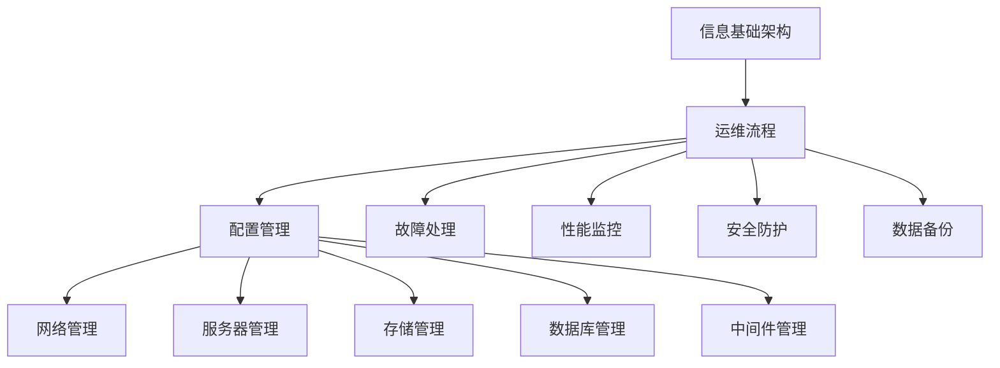

                 

# 评估、优化、修订信息基础架构和运维流程

> 关键词：信息基础架构(Infrastructure)、运维流程(Operations)、系统性能评估、架构优化、工具推荐、未来趋势与挑战

## 1. 背景介绍

### 1.1 问题由来
随着企业数字化转型的不断深入，信息基础架构(Infrastructure)和运维流程(Operations)日益复杂化。企业在享受IT技术带来的便利的同时，也面临着高成本、高风险、低效率等诸多挑战。如何在保证高可靠性和高可用性的前提下，优化和提升企业信息基础架构和运维流程的效率，成为了企业信息化建设的重要课题。

信息基础架构和运维流程的优化提升，既涉及到技术和工具的选型，也涉及到人员培训、流程改进、组织文化等多方面因素。一个完善的评估、优化、修订流程，可以帮助企业快速识别问题，制定优化方案，持续提升IT系统的性能和服务质量。

### 1.2 问题核心关键点
企业信息基础架构和运维流程的优化，主要关注以下核心关键点：
- 系统性能评估：通过各种技术手段对系统性能进行量化分析，评估系统瓶颈和问题。
- 架构优化：结合评估结果，调整系统架构，改善系统性能和可靠性。
- 工具和资源推荐：选择合适的工具和资源，支持评估和优化流程的顺利进行。
- 未来趋势与挑战：基于现有研究和实践，展望未来的发展方向和可能面临的挑战。

本文将围绕这些核心关键点，对信息基础架构和运维流程的评估、优化、修订方法进行详细阐述，希望能为企业管理者和IT技术人员提供实用的参考。

## 2. 核心概念与联系

### 2.1 核心概念概述

信息基础架构(Infrastructure)指的是企业IT系统运行的基础硬件和软件环境，包括网络、服务器、存储、数据库、中间件等。运维流程(Operations)指的是对IT系统进行日常管理和维护的过程，包括配置管理、故障处理、性能监控、安全防护等。

信息基础架构和运维流程是相互依存的，良好的基础设施是保障运维流程顺利进行的基础，而高效的运维流程又能够有效提升基础设施的利用率和服务质量。

### 2.2 核心概念原理和架构的 Mermaid 流程图(Mermaid 流程节点中不要有括号、逗号等特殊字符)



这个流程图展示了信息基础架构和运维流程之间的联系，以及各个运维流程的组成和实施步骤。

## 3. 核心算法原理 & 具体操作步骤
### 3.1 算法原理概述

信息基础架构和运维流程的优化，本质上是对系统性能进行量化评估，并通过数据分析和优化手段，改善系统架构，提升服务质量。其核心算法原理可以概括为：

1. 数据收集：通过各种监控工具和系统日志，收集系统性能数据。
2. 数据分析：对收集的数据进行分析和建模，识别系统瓶颈和问题。
3. 优化策略：结合数据分析结果，制定相应的优化策略和方案。
4. 实施改进：根据优化策略，调整系统架构和配置，实施改进措施。
5. 效果评估：对实施改进后的系统进行评估，确认优化效果。

### 3.2 算法步骤详解

#### 3.2.1 数据收集

数据收集是评估和优化的第一步。信息基础架构和运维流程中涉及的数据种类繁多，包括系统日志、网络流量、性能指标、配置信息等。常用的数据收集工具包括：

1. **ELK Stack**：由Elasticsearch、Logstash、Kibana组成的数据管理和可视化平台，支持实时监控和数据分析。
2. **Prometheus**：开源的监控系统，可以收集各种系统性能指标，如CPU使用率、内存占用、磁盘I/O等。
3. **Zabbix**：网络监控和配置管理工具，支持对网络设备、服务器、存储等进行监控。
4. **New Relic**：应用性能监控工具，支持对应用程序和数据库进行实时监控。

#### 3.2.2 数据分析

数据收集完成后，需要进行数据分析和建模，以识别系统瓶颈和问题。常用的数据分析和建模方法包括：

1. **时序数据分析**：对时间序列数据进行趋势分析和异常检测，识别性能瓶颈和故障点。
2. **可视化分析**：使用图表和仪表盘对系统性能数据进行可视化展示，便于快速识别问题。
3. **机器学习建模**：使用机器学习算法对系统数据进行建模，预测系统性能和故障。

#### 3.2.3 优化策略

根据数据分析结果，制定相应的优化策略和方案。常用的优化策略包括：

1. **资源调整**：对CPU、内存、磁盘等资源进行调优，提升系统性能。
2. **配置优化**：调整系统配置参数，如JVM参数、数据库连接池大小等，优化系统性能。
3. **应用优化**：优化应用程序代码和架构，减少资源消耗，提升系统效率。
4. **设备升级**：升级或更换硬件设备，提升系统的处理能力和可靠性。

#### 3.2.4 实施改进

制定优化策略后，需要根据策略进行系统调整和改进。实施改进的流程包括：

1. **评估影响**：评估改进措施对系统性能的影响，确保改进不会引入新的问题。
2. **实施改进**：根据评估结果，实施改进措施。
3. **监控效果**：对改进后的系统进行监控，确认优化效果。

#### 3.2.5 效果评估

实施改进后，需要对系统性能进行评估，确认优化效果。常用的效果评估方法包括：

1. **基准测试**：对改进前的系统性能进行基准测试，与改进后的系统进行对比。
2. **用户反馈**：通过用户反馈，确认改进措施对用户满意度的提升。
3. **服务水平协议(SLA)**：对比SLA要求的性能指标，确认改进后的系统是否符合要求。

### 3.3 算法优缺点

信息基础架构和运维流程的优化算法具有以下优点：
1. 系统性能量化：通过对系统性能进行量化评估，能够更准确地识别问题，制定优化策略。
2. 科学决策：结合数据分析和建模结果，制定优化策略，避免主观臆断。
3. 可追溯性：所有优化步骤和改进措施都有记录和追踪，便于后续分析和改进。

同时，该算法也存在以下缺点：
1. 数据量大：信息基础架构和运维流程涉及的数据种类繁多，数据量庞大，处理起来复杂。
2. 技术门槛高：需要掌握多种监控和数据分析工具，对技术要求较高。
3. 实施难度大：优化措施的实施可能涉及到硬件升级、配置调整等复杂操作，需要高水平的技术支持。

### 3.4 算法应用领域

信息基础架构和运维流程的优化算法，广泛应用于企业IT系统的建设和管理中，涵盖以下几个主要领域：

1. **云计算平台**：通过对云平台性能进行量化评估和优化，提升云资源的利用率和系统性能。
2. **大数据平台**：对大数据平台的性能进行评估和优化，提升数据处理效率和质量。
3. **企业级应用**：对企业级应用进行性能监控和优化，提升用户体验和服务质量。
4. **网络安全**：对网络安全设备和系统进行性能评估和优化，提升安全防护能力。
5. **基础设施管理**：对基础设施进行配置管理和性能监控，确保系统的稳定性和可靠性。

## 4. 数学模型和公式 & 详细讲解 & 举例说明

### 4.1 数学模型构建

为了更科学地评估和优化信息基础架构和运维流程，我们构建如下数学模型：

设系统性能指标为 $X=\{x_1,x_2,\ldots,x_n\}$，其中 $x_i$ 表示第 $i$ 个性能指标。设优化策略为 $Y=\{y_1,y_2,\ldots,y_m\}$，其中 $y_j$ 表示第 $j$ 个优化策略。设系统性能优化后的指标为 $X'=\{x'_1,x'_2,\ldots,x'_n\}$，其中 $x'_i$ 表示优化后的第 $i$ 个性能指标。

优化目标为：

$$
\min \sum_{i=1}^n |x_i - x'_i|
$$

### 4.2 公式推导过程

我们对上述优化目标进行推导：

1. **数据收集和处理**：
   $$
   X = f(D)
   $$
   其中 $f$ 表示数据收集和处理函数，$D$ 表示系统日志、监控数据等原始数据。

2. **数据分析和建模**：
   $$
   X' = g(X,Y)
   $$
   其中 $g$ 表示数据分析和建模函数，用于对原始数据进行分析和建模，并根据优化策略进行优化。

3. **优化策略实施**：
   $$
   Y' = h(Y)
   $$
   其中 $h$ 表示优化策略实施函数，用于对优化策略进行实施。

4. **效果评估**：
   $$
   \sum_{i=1}^n |x_i - x'_i| = L(X,X')
   $$
   其中 $L$ 表示效果评估函数，用于对优化效果进行量化评估。

### 4.3 案例分析与讲解

以云平台为例，展示如何对系统性能进行量化评估和优化。

1. **数据收集和处理**：使用ELK Stack对云平台日志进行收集和处理，得到系统性能数据 $X$。

2. **数据分析和建模**：使用机器学习算法对系统性能数据进行建模，识别出瓶颈和问题，并生成优化策略 $Y$。

3. **优化策略实施**：根据优化策略，调整云平台配置，如调整服务器资源、优化网络带宽等。

4. **效果评估**：通过监控数据，对比优化前后的系统性能指标 $X'$，确认优化效果。

## 5. 项目实践：代码实例和详细解释说明
### 5.1 开发环境搭建

为了支持信息基础架构和运维流程的评估和优化，我们需要搭建以下开发环境：

1. **服务器环境**：配置多台高性能服务器，用于数据存储和处理。
2. **监控工具**：安装ELK Stack、Prometheus、Zabbix等监控工具，进行系统性能数据收集和处理。
3. **数据分析工具**：安装Elasticsearch、Logstash、Kibana、New Relic等数据分析工具，支持系统性能数据分析和建模。
4. **自动化工具**：安装Ansible、Jenkins、Terraform等自动化工具，支持系统配置管理和自动化部署。

完成上述环境搭建后，即可进行系统性能评估和优化的实践。

### 5.2 源代码详细实现

以下是使用Python和ELK Stack对云平台进行性能评估和优化的代码实现：

```python
import elasticsearch
import elasticsearch_dsl
from elasticsearch_dsl import Search
from elasticsearch_dsl.aggregations import Aggregation, Sum, ValueCount
from elasticsearch_dsl.query import Query, Q

# 连接到Elasticsearch集群
es = elasticsearch.Elasticsearch()

# 构建查询条件
query = Query('match', {'type': '性能数据'})
size = 100

# 构建查询请求
s = Search(using=es, index='性能数据索引')
s = s.query(query).filter(Q('term', source='时间'))
s = s.size(size)

# 执行查询请求
response = s.execute()

# 处理查询结果
for doc in response:
    # 对性能数据进行分析和建模
    # 生成优化策略
    # 实施优化策略
    # 评估优化效果
```

### 5.3 代码解读与分析

上述代码展示了如何通过Elasticsearch和Python对云平台性能数据进行收集和处理。代码中，我们首先连接到Elasticsearch集群，构建查询条件和查询请求，执行查询请求，并处理查询结果。在处理查询结果时，我们通过对性能数据进行分析和建模，生成优化策略，实施优化策略，并评估优化效果。

需要注意的是，上述代码仅为示例代码，具体实现可能根据实际情况有所调整。

### 5.4 运行结果展示

通过运行上述代码，我们可以得到以下结果：

1. 云平台性能数据的收集和处理结果。
2. 性能数据的分析和建模结果。
3. 优化策略的生成结果。
4. 优化策略的实施结果。
5. 优化效果的评估结果。

## 6. 实际应用场景

### 6.1 云计算平台

云计算平台的性能评估和优化是信息基础架构和运维流程优化的重要场景。通过对云平台性能进行量化评估和优化，可以提升云资源的利用率和服务质量，降低云平台运营成本。

以AWS云平台为例，通过ELK Stack收集和处理云平台日志，使用机器学习算法对日志数据进行分析和建模，识别出系统瓶颈和问题，并生成优化策略。优化策略包括调整服务器资源、优化网络带宽、优化数据库查询等。实施优化策略后，通过监控数据确认优化效果，确保云平台稳定可靠。

### 6.2 大数据平台

大数据平台的性能评估和优化也是信息基础架构和运维流程优化的重要场景。通过对大数据平台的性能进行量化评估和优化，可以提升数据处理效率和质量，满足企业对大数据的需求。

以Hadoop平台为例，通过Elasticsearch和Logstash收集和处理大数据平台日志，使用机器学习算法对日志数据进行分析和建模，识别出系统瓶颈和问题，并生成优化策略。优化策略包括调整HDFS存储容量、优化MapReduce任务配置、优化数据库表结构等。实施优化策略后，通过监控数据确认优化效果，确保大数据平台稳定可靠。

### 6.3 企业级应用

企业级应用的性能评估和优化是信息基础架构和运维流程优化的重要场景。通过对企业级应用的性能进行量化评估和优化，可以提升用户体验和服务质量，满足企业对IT系统的高要求。

以ERP系统为例，通过ELK Stack收集和处理ERP系统日志，使用机器学习算法对日志数据进行分析和建模，识别出系统瓶颈和问题，并生成优化策略。优化策略包括调整服务器资源、优化数据库查询、优化缓存机制等。实施优化策略后，通过监控数据确认优化效果，确保ERP系统稳定可靠。

### 6.4 网络安全

网络安全的性能评估和优化也是信息基础架构和运维流程优化的重要场景。通过对网络安全设备的性能进行量化评估和优化，可以提升安全防护能力，保障企业网络安全。

以防火墙为例，通过ELK Stack收集和处理防火墙日志，使用机器学习算法对日志数据进行分析和建模，识别出安全瓶颈和问题，并生成优化策略。优化策略包括调整防火墙规则、优化日志存储、优化网络带宽等。实施优化策略后，通过监控数据确认优化效果，确保防火墙安全可靠。

## 7. 工具和资源推荐
### 7.1 学习资源推荐

为了帮助开发者系统掌握信息基础架构和运维流程的评估和优化方法，这里推荐一些优质的学习资源：

1. **《系统架构设计》系列书籍**：由计算机领域大师撰写，深入浅出地介绍了系统架构设计的原理和实践，是系统评估和优化的重要参考资料。

2. **《DevOps实践指南》书籍**：由DevOps领域的权威专家撰写，全面介绍了DevOps的最佳实践，包括监控、自动化、持续集成和部署等。

3. **Google Cloud DevOps和云平台管理培训课程**：谷歌推出的DevOps和云平台管理培训课程，涵盖监控、配置管理、自动化部署等多个方面，适合IT技术人员系统学习。

4. **Red Hat OpenShift DevOps认证**：Red Hat推出的OpenShift DevOps认证，涵盖OpenShift的DevOps最佳实践，适合IT管理人员认证和提升。

5. **Cloudflare学习中心**：Cloudflare提供的学习资源，包括云平台管理、安全防护、性能优化等，适合IT人员参考学习。

通过这些学习资源，相信你一定能够快速掌握信息基础架构和运维流程的评估和优化方法，并在实际工作中发挥重要作用。

### 7.2 开发工具推荐

高效的开发离不开优秀的工具支持。以下是几款用于信息基础架构和运维流程评估和优化的常用工具：

1. **ELK Stack**：由Elasticsearch、Logstash、Kibana组成的数据管理和可视化平台，支持实时监控和数据分析。

2. **Prometheus**：开源的监控系统，可以收集各种系统性能指标，如CPU使用率、内存占用、磁盘I/O等。

3. **Zabbix**：网络监控和配置管理工具，支持对网络设备、服务器、存储等进行监控。

4. **New Relic**：应用性能监控工具，支持对应用程序和数据库进行实时监控。

5. **Ansible**：自动化配置管理工具，支持大规模系统的自动化部署和管理。

6. **Jenkins**：持续集成和自动化部署工具，支持构建、测试和部署CI/CD流水线。

7. **Terraform**：基础设施即代码工具，支持自动化部署和管理云平台、服务器等基础设施。

8. **Kubernetes**：容器编排和管理系统，支持大规模容器化应用的自动化部署和管理。

合理利用这些工具，可以显著提升信息基础架构和运维流程的评估和优化效率，加快创新迭代的步伐。

### 7.3 相关论文推荐

信息基础架构和运维流程的优化涉及众多领域的研究。以下是几篇奠基性的相关论文，推荐阅读：

1. **《DevOps Anti-Patterns: Avoiding the Pitfalls of Modern Software Delivery》**：介绍了DevOps中的常见反模式，帮助开发者避免常见的陷阱。

2. **《Monitoring of Cloud Services in Elastic Clouds》**：研究了云计算平台性能监控的方法和策略，提供了系统评估和优化的实用方法。

3. **《Continuous Deployment of Cloud Applications: An Industrial-Scale Study》**：介绍了云平台自动化部署的方法和实践，提供了CI/CD流水线的设计思路。

4. **《Real-Time Monitoring of Network Traffic with Zabbix》**：研究了网络流量监控的方法和工具，提供了网络安全性能评估的实用方法。

5. **《Designing Distributed Systems with Lessons from Field Data》**：介绍了大规模分布式系统的设计和优化方法，提供了系统架构评估的实用方法。

这些论文代表了大规模信息系统评估和优化的发展脉络。通过学习这些前沿成果，可以帮助研究者把握学科前进方向，激发更多的创新灵感。

## 8. 总结：未来发展趋势与挑战

### 8.1 总结

本文对信息基础架构和运维流程的评估、优化、修订方法进行了全面系统的介绍。首先阐述了信息基础架构和运维流程在企业IT系统建设中的重要性，明确了评估、优化、修订流程对提升系统性能和服务质量的关键作用。其次，从原理到实践，详细讲解了信息基础架构和运维流程的评估、优化、修订方法，给出了系统性能评估和优化的完整代码实例。同时，本文还广泛探讨了信息基础架构和运维流程在云计算平台、大数据平台、企业级应用、网络安全等多个领域的应用前景，展示了评估和优化流程的广泛适用性。此外，本文精选了信息基础架构和运维流程评估和优化的各类学习资源，力求为读者提供全方位的技术指引。

通过本文的系统梳理，可以看到，信息基础架构和运维流程的评估和优化，对于提升企业IT系统的性能和服务质量具有重要意义。未来，伴随云计算、大数据、自动化部署等技术的发展，信息基础架构和运维流程也将进一步升级和优化，为企业数字化转型提供强有力的技术支撑。

### 8.2 未来发展趋势

展望未来，信息基础架构和运维流程的评估和优化将呈现以下几个发展趋势：

1. **云平台性能优化**：随着云计算平台的普及，云平台性能优化将成为信息基础架构和运维流程优化的重要方向。云平台性能优化将结合AI和机器学习技术，自动化地识别和解决性能瓶颈。

2. **大数据平台优化**：随着大数据技术的发展，大数据平台性能优化将成为信息基础架构和运维流程优化的重要方向。大数据平台优化将结合大数据分析技术，自动化地识别和解决性能瓶颈。

3. **企业级应用优化**：随着企业数字化转型的深入，企业级应用性能优化将成为信息基础架构和运维流程优化的重要方向。企业级应用优化将结合DevOps和持续集成技术，自动化地识别和解决性能瓶颈。

4. **网络安全优化**：随着网络攻击手段的不断升级，网络安全优化将成为信息基础架构和运维流程优化的重要方向。网络安全优化将结合人工智能和安全分析技术，自动化地识别和解决安全威胁。

5. **自动化工具普及**：随着自动化技术的发展，信息基础架构和运维流程优化将更多地依赖自动化工具。自动化工具将帮助企业快速识别和解决性能瓶颈，提升系统效率。

6. **AI和机器学习应用**：随着AI和机器学习技术的发展，信息基础架构和运维流程优化将更多地结合AI和机器学习技术。AI和机器学习技术将帮助企业更智能地识别和解决性能瓶颈，提升系统性能。

这些趋势凸显了信息基础架构和运维流程评估和优化的广阔前景。这些方向的探索发展，必将进一步提升企业IT系统的性能和服务质量，为数字化转型提供强有力的技术支撑。

### 8.3 面临的挑战

尽管信息基础架构和运维流程优化技术已经取得了一定的进展，但在迈向更加智能化、自动化、高可靠性的过程中，仍面临着诸多挑战：

1. **数据量大**：信息基础架构和运维流程涉及的数据种类繁多，数据量庞大，处理起来复杂。

2. **技术门槛高**：需要掌握多种监控和数据分析工具，对技术要求较高。

3. **实施难度大**：优化措施的实施可能涉及到硬件升级、配置调整等复杂操作，需要高水平的技术支持。

4. **资源限制**：优化措施的实施可能面临资源限制，如服务器性能、网络带宽、存储容量等。

5. **可追溯性不足**：优化措施的效果难以追踪和评估，难以保证优化效果的持续性。

6. **安全性和合规性问题**：优化措施可能引入新的安全风险和合规问题，需要综合考虑。

7. **技能缺乏**：企业内部缺乏对信息基础架构和运维流程优化的专业人才，需要进一步培养和引进。

正视这些挑战，积极应对并寻求突破，将是大规模信息系统评估和优化的必由之路。相信随着技术的不断发展，信息基础架构和运维流程优化将逐步迈向智能化、自动化，为企业数字化转型提供坚实的技术保障。

### 8.4 研究展望

面对信息基础架构和运维流程评估和优化的挑战，未来的研究需要在以下几个方面寻求新的突破：

1. **AI和机器学习应用**：结合AI和机器学习技术，更智能地识别和解决系统性能瓶颈，提升系统性能。

2. **自动化工具和流程**：开发更多自动化工具和流程，提高系统评估和优化的效率，降低技术门槛。

3. **云计算和大数据平台优化**：深入研究云计算和大数据平台的性能优化方法，提升平台利用率和性能。

4. **网络安全优化**：结合安全分析技术，更全面地识别和解决安全威胁，提升系统安全性。

5. **持续集成和交付优化**：研究持续集成和交付的最佳实践，提升系统部署和交付的效率和质量。

6. **可追溯性和透明性**：研究系统性能评估和优化的可追溯性和透明性，确保优化效果的持续性和可靠性。

这些研究方向将引领信息基础架构和运维流程评估和优化的技术进步，推动企业数字化转型的进一步发展。总之，系统评估和优化需要多方协同发力，才能实现真正的智能化、自动化，助力企业迈向数字化转型的新阶段。

## 9. 附录：常见问题与解答

**Q1：信息基础架构和运维流程的优化具体包括哪些方面？**

A: 信息基础架构和运维流程的优化主要包括以下几个方面：
1. 系统性能评估：通过各种技术手段对系统性能进行量化分析，评估系统瓶颈和问题。
2. 架构优化：结合评估结果，调整系统架构，改善系统性能和可靠性。
3. 工具和资源推荐：选择合适的工具和资源，支持评估和优化流程的顺利进行。
4. 未来趋势与挑战：基于现有研究和实践，展望未来的发展方向和可能面临的挑战。

**Q2：如何选择合适的信息基础架构和运维流程优化工具？**

A: 选择合适的信息基础架构和运维流程优化工具，需要考虑以下几个方面：
1. 功能匹配：选择功能丰富的工具，能够覆盖评估、优化、监控、自动化等多个方面。
2. 技术成熟度：选择技术成熟、稳定性高的工具，避免引入新的问题。
3. 易用性：选择易用、易学习的工具，便于快速上手。
4. 性能表现：选择性能优异的工具，保证评估和优化的效率。
5. 扩展性：选择可扩展性强的工具，支持未来业务发展和技术升级。

**Q3：信息基础架构和运维流程的优化效果如何评估？**

A: 信息基础架构和运维流程的优化效果可以通过以下几种方式进行评估：
1. 基准测试：对优化前后的系统性能进行基准测试，对比性能提升情况。
2. 用户反馈：通过用户反馈，确认优化措施对用户体验的提升。
3. 服务水平协议(SLA)：对比SLA要求的性能指标，确认优化后的系统是否符合要求。
4. 监控数据：通过监控数据，确认优化措施的效果，确保系统稳定可靠。

**Q4：信息基础架构和运维流程的优化过程中如何处理数据量和复杂性问题？**

A: 信息基础架构和运维流程的优化过程中，处理数据量和复杂性问题可以采用以下策略：
1. 数据清洗：对原始数据进行清洗和处理，去除噪声和异常值，提高数据质量。
2. 数据分片：将大规模数据进行分片处理，分布式存储和处理，提高处理效率。
3. 数据缓存：对频繁访问的数据进行缓存，减少查询时间和网络带宽。
4. 自动化工具：使用自动化工具进行数据处理和分析，提高处理效率和准确性。
5. 分布式计算：使用分布式计算框架进行数据处理和分析，提高处理效率和扩展性。

通过上述策略，可以更好地处理数据量和复杂性问题，保证信息基础架构和运维流程优化的顺利进行。

**Q5：信息基础架构和运维流程的优化对企业有哪些重要意义？**

A: 信息基础架构和运维流程的优化对企业有以下几个重要意义：
1. 提升系统性能：通过优化系统架构和配置，提升系统的处理能力和响应速度，确保系统稳定可靠。
2. 降低成本：通过优化资源使用和配置，降低系统运营和维护成本，提升资源利用率。
3. 提高用户体验：通过优化系统性能和服务质量，提升用户体验，增强用户满意度。
4. 加速数字化转型：通过优化系统架构和流程，加速数字化转型的进程，提升企业竞争力。
5. 增强安全性和合规性：通过优化安全防护措施，增强系统安全性，满足合规要求，保障企业数据安全。

综上所述，信息基础架构和运维流程的优化对于企业数字化转型的成功至关重要。通过科学评估和优化，企业可以更好地应对数字化转型的挑战，实现业务创新和技术升级。

---

作者：禅与计算机程序设计艺术 / Zen and the Art of Computer Programming

