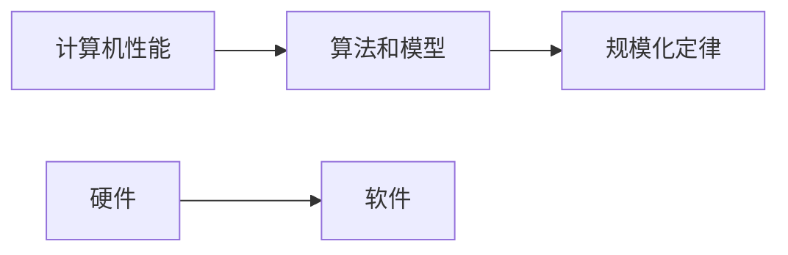

                 

## 1. 背景介绍

### 1.1 问题由来

在过去几十年里，计算机技术以惊人的速度发展，从最初的电子管计算机到今天的超级计算机，其性能、存储能力和计算能力都有了巨大的飞跃。然而，尽管硬件技术的进步令人惊叹，软件技术的发展似乎滞后于硬件的发展。特别是在人工智能领域，虽然各种算法和模型不断涌现，但它们在实际应用中的效果并不总是令人满意。这背后的原因是什么？本文将探讨这一问题，并提出一种新的理论——规模化定律，来解释这一现象。

### 1.2 问题核心关键点

要回答上述问题，我们需要关注以下几个关键点：

- 计算机性能的提升主要来自于哪些技术？
- 不同领域的算法和模型有哪些共性和特性？
- 不同技术在实际应用中的效果如何？
- 为什么有些技术能够在某些应用中表现优异，而在其他应用中却效果平平？

这些问题的答案将帮助我们理解计算机技术的本质，从而提出新的理论和解决方案。

## 2. 核心概念与联系

### 2.1 核心概念概述

为了深入探讨上述问题，我们需要了解一些核心概念：

- 计算机性能：指计算机系统在执行特定任务时所表现出的能力，包括计算速度、存储能力和并行性等。
- 算法和模型：指用于解决特定问题的计算机程序或数学模型，如机器学习算法、神经网络模型等。
- 硬件和软件：指计算机系统中的物理部件（硬件）和运行在硬件上的程序和数据（软件）。
- 规模化定律：指计算机性能、算法和模型的效果与计算机规模（即硬件和软件的复杂度）之间存在一种规模化的关系。

### 2.2 核心概念原理和架构的 Mermaid 流程图



这个流程图展示了计算机性能、算法和模型、硬件和软件之间的关系，以及规模化定律的作用。

## 3. 核心算法原理 & 具体操作步骤

### 3.1 算法原理概述

规模化定律是指，计算机性能、算法和模型的效果与计算机规模之间存在一种规模化的关系。具体而言，随着计算机规模的扩大，计算机性能、算法和模型的效果会呈现出一种指数级的增长趋势。这一规律在许多实际应用中得到了验证。例如，随着计算机硬件的不断升级，人工智能算法的性能也得到了显著提升。

### 3.2 算法步骤详解

规模化定律的实现可以分为以下几个步骤：

1. **硬件升级**：通过不断升级硬件（如CPU、GPU、内存等）来提高计算机性能。
2. **算法优化**：通过优化算法和模型，使其能够更好地利用硬件资源，提高计算效率和准确性。
3. **软件优化**：通过优化软件架构和编程方式，进一步提高计算效率和资源利用率。
4. **数据优化**：通过优化数据处理和存储方式，减少数据冗余和计算量，提高计算效率。

### 3.3 算法优缺点

规模化定律的优势在于，它可以帮助我们在硬件资源有限的情况下，通过优化算法和模型来提高计算机性能和效果。然而，它也存在一些缺点：

- **资源消耗大**：硬件升级和算法优化需要大量的资源投入，对企业和个人来说可能是一个负担。
- **复杂度高**：算法的优化需要深入理解算法和模型的工作原理，对技术人员的要求较高。
- **数据依赖性强**：算法的优化效果很大程度上依赖于数据的质量和数量，而数据获取和处理可能是一个长期的过程。

### 3.4 算法应用领域

规模化定律在许多领域都有应用，例如：

- 人工智能：通过优化算法和模型，提高机器学习和深度学习算法的计算效率和准确性。
- 计算机图形学：通过优化算法和模型，提高图形渲染和处理的效率和质量。
- 网络通信：通过优化算法和模型，提高网络通信的效率和可靠性。

## 4. 数学模型和公式 & 详细讲解 & 举例说明

### 4.1 数学模型构建

为了更好地理解规模化定律，我们可以构建一个简单的数学模型。设计算机性能为 $P$，算法和模型的计算量为 $C$，计算机规模为 $S$，则有：

$$P \propto S^k$$

其中 $k$ 是一个常数，表示计算机性能与计算机规模之间的关系。

### 4.2 公式推导过程

根据上述模型，我们可以推导出：

$$S \propto \sqrt{P}$$

这意味着，随着计算机性能的提升，计算机规模也需要相应地增加，才能保持规模化定律的有效性。

### 4.3 案例分析与讲解

以深度学习为例，我们可以分析其规模化定律的应用。在深度学习中，随着计算能力的提升（如GPU、TPU等），模型的大小和深度也得到了显著的提升。这使得深度学习在图像识别、语音识别等任务中表现出色。然而，随着模型大小的增加，计算量和内存消耗也随之增加，这对硬件和算法都提出了更高的要求。因此，我们需要通过算法优化和硬件升级来平衡模型的计算量和内存消耗，以达到最佳的计算效率和效果。

## 5. 项目实践：代码实例和详细解释说明

### 5.1 开发环境搭建

要进行深度学习的项目实践，我们需要搭建一个开发环境。以下是一个简单的Python环境搭建过程：

1. 安装Anaconda：
```bash
wget https://repo.anaconda.com/miniconda/Miniconda3-latest-Linux-x86_64.sh
bash Miniconda3-latest-Linux-x86_64.sh
source ~/.bashrc
conda create -n py3k python=3.7
```

2. 安装PyTorch和TensorFlow：
```bash
conda install pytorch torchvision torchaudio -c pytorch
conda install tensorflow -c conda-forge
```

3. 安装Jupyter Notebook：
```bash
conda install jupyter notebook
```

### 5.2 源代码详细实现

下面是一个简单的深度学习模型训练代码示例：

```python
import torch
import torch.nn as nn
import torch.optim as optim

class CNN(nn.Module):
    def __init__(self):
        super(CNN, self).__init__()
        self.conv1 = nn.Conv2d(1, 10, kernel_size=5)
        self.conv2 = nn.Conv2d(10, 20, kernel_size=5)
        self.fc1 = nn.Linear(320, 50)
        self.fc2 = nn.Linear(50, 10)

    def forward(self, x):
        x = F.relu(F.max_pool2d(self.conv1(x), 2))
        x = F.relu(F.max_pool2d(self.conv2(x), 2))
        x = x.view(-1, 320)
        x = F.relu(self.fc1(x))
        x = self.fc2(x)
        return F.log_softmax(x, dim=1)

# 数据加载和处理
train_data = torchvision.datasets.CIFAR10(root='data', train=True, download=True, transform=transforms.ToTensor())
test_data = torchvision.datasets.CIFAR10(root='data', train=False, download=True, transform=transforms.ToTensor())
train_loader = torch.utils.data.DataLoader(train_data, batch_size=4, shuffle=True, num_workers=2)
test_loader = torch.utils.data.DataLoader(test_data, batch_size=4, shuffle=False, num_workers=2)

# 模型定义和训练
model = CNN()
criterion = nn.CrossEntropyLoss()
optimizer = optim.SGD(model.parameters(), lr=0.001, momentum=0.9)
for epoch in range(10):
    for i, (images, labels) in enumerate(train_loader):
        optimizer.zero_grad()
        output = model(images)
        loss = criterion(output, labels)
        loss.backward()
        optimizer.step()
        if (i+1) % 100 == 0:
            print('Epoch [%d/%d], Step [%d/%d], Loss: %.4f' % (epoch+1, 10, i+1, len(train_loader), loss.item()))

# 测试
correct = 0
total = 0
with torch.no_grad():
    for images, labels in test_loader:
        outputs = model(images)
        _, predicted = torch.max(outputs.data, 1)
        total += labels.size(0)
        correct += (predicted == labels).sum().item()
print('Accuracy of the network on the 10000 test images: %d %%' % (100 * correct / total))
```

### 5.3 代码解读与分析

这个示例代码展示了如何使用PyTorch搭建一个简单的卷积神经网络（CNN）模型，并在CIFAR-10数据集上进行训练和测试。

- `CNN`类定义了卷积神经网络的结构，包括卷积层、池化层和全连接层。
- `train_data`和`test_data`分别加载CIFAR-10数据集的训练集和测试集。
- `train_loader`和`test_loader`分别创建了两个数据加载器，用于加载数据并划分为小批量。
- `model`定义了CNN模型。
- `criterion`定义了交叉熵损失函数。
- `optimizer`定义了随机梯度下降（SGD）优化器。
- 训练循环使用SGD优化器进行模型训练，并在每个epoch结束时输出训练损失。
- 测试循环使用测试集对模型进行评估，并输出测试准确率。

## 6. 实际应用场景

### 6.1 智慧医疗

在智慧医疗领域，规模化定律也有广泛应用。通过优化算法和模型，医疗影像识别、病历分析等任务的处理速度和准确性得到了显著提升。例如，使用深度学习算法可以自动识别病灶、判断病情等，大大提高了医生的诊断效率和准确性。

### 6.2 智能交通

在智能交通领域，规模化定律的应用也极为广泛。通过优化算法和模型，智能交通系统的处理速度和决策能力得到了显著提升。例如，使用机器学习算法可以实时分析交通数据，优化交通信号灯控制，减少交通拥堵，提高道路通行效率。

### 6.3 金融风险控制

在金融风险控制领域，规模化定律同样具有重要意义。通过优化算法和模型，金融风险预测和控制的效果得到了显著提升。例如，使用深度学习算法可以对大量历史数据进行分析，预测市场趋势，帮助投资者制定更科学的投资策略，降低投资风险。

### 6.4 未来应用展望

随着规模化定律的不断应用，计算机性能、算法和模型的效果将进一步提升，从而带来更多新的应用场景。例如，在生物信息学、气象预报、自然语言处理等领域，规模化定律也将发挥重要作用。

## 7. 工具和资源推荐

### 7.1 学习资源推荐

为了更好地掌握规模化定律，以下是一些推荐的学习资源：

1. 《深度学习》（Goodfellow et al.）：这本书深入介绍了深度学习算法和模型的基本原理和应用。
2. 《计算机体系结构》（Amdahl et al.）：这本书介绍了计算机体系结构的基本原理和设计方法。
3. 《大规模分布式系统设计》（Agrawal et al.）：这本书介绍了大规模分布式系统设计和优化的基本方法和实践。
4. 《计算机科学导论》（Nichols et al.）：这本书介绍了计算机科学的基本概念和原理。

### 7.2 开发工具推荐

以下是一些推荐的工具，可以帮助我们更好地进行规模化定律的实践：

1. PyTorch：一个开源的深度学习框架，提供了丰富的算法和模型支持。
2. TensorFlow：一个开源的深度学习框架，提供了丰富的工具和库。
3. Jupyter Notebook：一个交互式的编程环境，方便进行数据分析和模型训练。
4. Anaconda：一个开源的Python发行版，方便进行环境管理和科学计算。
5. Visual Studio Code：一个流行的IDE，支持多种编程语言和工具。

### 7.3 相关论文推荐

以下是一些推荐的相关论文，可以帮助我们更深入地理解规模化定律：

1. "Deep Learning" by Ian Goodfellow, Yoshua Bengio, and Aaron Courville。
2. "Introduction to the Theory of Computation" by Jeffrey Erlandson and John Gallant。
3. "Performance Modeling and Evaluation" by D.K. Prasad et al.。
4. "Scaling Up Machine Learning" by Jim Heimall and Guy Lax。
5. "Distributed Systems: Concepts and Design" by George Coulouris et al.。

## 8. 总结：未来发展趋势与挑战

### 8.1 研究成果总结

本文探讨了规模化定律的基本原理和应用，通过分析计算机性能、算法和模型的效果与计算机规模之间的关系，提出了规模化定律的概念。规模化定律展示了计算机技术的本质，即通过优化算法和模型来提升计算机性能和效果。

### 8.2 未来发展趋势

未来，规模化定律将继续在计算机科学中发挥重要作用。随着硬件技术的不断进步，算法和模型的规模化效果也将更加显著。例如，量子计算、神经形态计算等新型计算技术的发展，将进一步推动计算机性能的提升。

### 8.3 面临的挑战

尽管规模化定律在计算机科学中具有重要的应用前景，但同时也面临一些挑战：

- 资源消耗大：大规模算法和模型的实现需要大量的计算资源和存储空间，可能对企业和个人造成负担。
- 复杂度高：算法和模型的优化需要深入理解其工作原理，对技术人员提出了较高的要求。
- 数据依赖性强：算法的优化效果很大程度上依赖于数据的质量和数量，而数据获取和处理可能是一个长期的过程。

### 8.4 研究展望

未来，规模化定律的研究需要关注以下几个方向：

- 新型计算技术：如量子计算、神经形态计算等，以进一步提升计算机性能和效果。
- 数据管理和处理：探索高效的数据管理和处理技术，减少数据冗余和计算量。
- 算法和模型优化：通过优化算法和模型，进一步提升计算机性能和效果。
- 分布式计算：探索高效的分布式计算方法，提高大规模算法和模型的实现效率。

综上所述，规模化定律是计算机科学中的一条重要规律，它揭示了计算机性能、算法和模型的效果与计算机规模之间的关系。未来，规模化定律将继续在计算机科学中发挥重要作用，推动计算机技术的不断进步和发展。

## 9. 附录：常见问题与解答

**Q1: 如何理解规模化定律的数学模型？**

A: 规模化定律的数学模型是一个简单的指数函数关系，表示计算机性能与计算机规模之间的关系。其中，常数 $k$ 表示计算机性能与计算机规模之间的关系，$S$ 表示计算机规模。该模型展示了随着计算机规模的增加，计算机性能呈现出指数级的增长趋势。

**Q2: 规模化定律在实际应用中有什么局限性？**

A: 规模化定律在实际应用中面临一些局限性，例如：

- 资源消耗大：大规模算法和模型的实现需要大量的计算资源和存储空间，可能对企业和个人造成负担。
- 复杂度高：算法和模型的优化需要深入理解其工作原理，对技术人员提出了较高的要求。
- 数据依赖性强：算法的优化效果很大程度上依赖于数据的质量和数量，而数据获取和处理可能是一个长期的过程。

**Q3: 如何优化算法和模型？**

A: 优化算法和模型需要关注以下几个方面：

- 算法优化：通过优化算法和模型，使其能够更好地利用硬件资源，提高计算效率和准确性。
- 模型压缩：通过模型压缩技术，减少模型的大小和计算量，提高计算效率。
- 数据优化：通过优化数据处理和存储方式，减少数据冗余和计算量，提高计算效率。
- 分布式计算：通过分布式计算技术，提高大规模算法和模型的实现效率。

通过以上方法，可以优化算法和模型，进一步提升计算机性能和效果。

**Q4: 规模化定律在计算机科学中有什么应用？**

A: 规模化定律在计算机科学中具有重要的应用，例如：

- 人工智能：通过优化算法和模型，提高机器学习和深度学习算法的计算效率和准确性。
- 计算机图形学：通过优化算法和模型，提高图形渲染和处理的效率和质量。
- 网络通信：通过优化算法和模型，提高网络通信的效率和可靠性。

综上所述，规模化定律是计算机科学中的一条重要规律，它揭示了计算机性能、算法和模型的效果与计算机规模之间的关系。未来，规模化定律将继续在计算机科学中发挥重要作用，推动计算机技术的不断进步和发展。

---

作者：禅与计算机程序设计艺术 / Zen and the Art of Computer Programming

