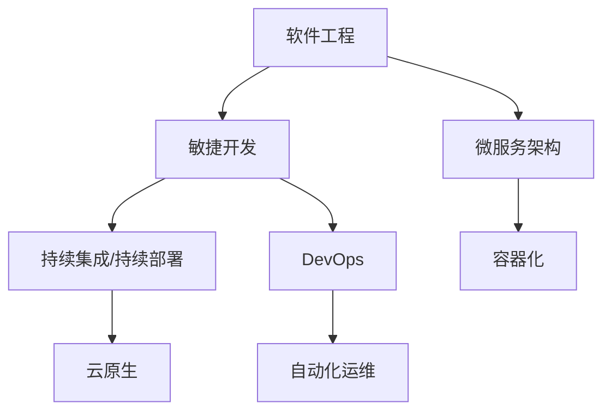

                 

## 1. 背景介绍

### 1.1 问题由来

随着计算机科学和信息技术的快速发展，软件在社会生产和生活中扮演的角色日益重要。从最初的简单工具到如今的复杂系统，软件在提高生产效率、降低运营成本、增强用户体验等方面发挥了重要作用。然而，软件的开发、部署和维护过程依然充满挑战，尤其在大型企业和关键应用领域，软件的复杂性和风险性更高。

在这一背景下，软件工程专家和学术界提出了软件 2.0 的概念。软件 2.0 强调通过自动化、智能化、协同化等手段，提高软件开发的效率和质量，降低开发和维护的成本，同时提升用户体验。这一理念得到了广泛认同，成为当下软件行业发展的方向标。

### 1.2 问题核心关键点

软件 2.0 的价值体现在以下几个方面：

1. **提升开发效率**：通过自动化测试、持续集成、代码重构等技术，显著提高软件开发速度。
2. **降低维护成本**：通过智能化监控、代码审计、动态重构等手段，减少软件维护的复杂性和成本。
3. **增强用户体验**：通过用户反馈、A/B测试、数据驱动的产品优化，不断提升软件的用户体验。
4. **促进协作创新**：通过团队协作平台、知识共享工具、开放社区等手段，加速知识交流和创新。
5. **创造新业务价值**：通过软件在各种场景下的应用，如智能推荐、数据分析、自动化运营等，创造新的业务增长点。

软件 2.0 的核心理念是“以用户为中心，以数据为驱动，以自动化为手段，以持续改进为目标”。这一理念不仅改变了软件开发的方式，也重新定义了软件在商业和社会中的角色。

## 2. 核心概念与联系

### 2.1 核心概念概述

为更好地理解软件 2.0 的理念和实践，本节将介绍几个密切相关的核心概念：

- **软件工程(software engineering)**：通过系统化、规范化的方法，提高软件开发质量和效率，降低维护成本和风险。
- **敏捷开发(agile development)**：强调灵活性、适应性，通过快速迭代、持续交付，提升软件开发的响应速度和适应性。
- **持续集成/持续部署(CI/CD)**：通过自动化工具链，实现代码的持续集成、测试和部署，提升软件开发和部署的效率和质量。
- **容器化(kubernetes)**：通过容器技术实现软件的快速部署、管理和扩展，支持微服务架构。
- **微服务架构(microservices)**：通过将大型系统拆分成多个小服务，提升系统的灵活性、可扩展性和可靠性。
- **DevOps**：通过文化、工具和实践的变革，提升软件开发和运维的协作效率，加速交付速度和提高系统稳定性。
- **云原生(cloud native)**：通过云平台和微服务等技术，实现软件的弹性扩展、高可用和自动化管理。

这些核心概念之间的逻辑关系可以通过以下Mermaid流程图来展示：



这个流程图展示了许多核心概念之间的内在联系：

1. 敏捷开发、持续集成/持续部署、DevOps、云原生等方法论和技术，都是基于软件工程的理念进行实践和优化的。
2. 敏捷开发、持续集成/持续部署、DevOps等方法论，通过自动化工具和流程改进，实现了软件开发的效率和质量提升。
3. 微服务架构、容器化等技术，在敏捷开发和持续集成/持续部署的基础上，进一步提升了系统的灵活性和可扩展性。
4. 云原生技术，通过云平台和容器化技术，实现了系统的自动化部署、管理和扩展，适应复杂多变的业务需求。

## 3. 核心算法原理 & 具体操作步骤
### 3.1 算法原理概述

软件 2.0 的价值实现依赖于多种算法和技术手段，但其核心原理是“自动化、智能化、协同化”。自动化技术通过代码自动化、测试自动化、部署自动化等手段，减少了人为干预，提高了开发和部署的效率和准确性。智能化技术通过数据驱动、机器学习、自然语言处理等手段，提升了系统的智能化水平和用户体验。协同化技术通过团队协作平台、知识共享工具、开放社区等手段，促进了知识的交流和创新。

### 3.2 算法步骤详解

软件 2.0 的实现过程一般包括以下几个关键步骤：

**Step 1: 选择工具和框架**

选择适合项目需求的软件开发工具和框架，如IDE、版本控制、构建工具、测试框架、容器化平台等。

**Step 2: 设计架构和流程**

根据项目需求，设计合理的软件架构和开发流程，如敏捷迭代、持续集成/持续部署、DevOps等。

**Step 3: 实施自动化**

通过自动化工具和脚本，实现代码的自动化测试、自动化部署、自动化监控等，提高开发和运维的效率。

**Step 4: 引入智能化**

利用数据驱动、机器学习、自然语言处理等智能化手段，提升系统的智能水平和用户体验。

**Step 5: 促进协同**

通过团队协作平台、知识共享工具、开放社区等手段，促进团队协作和知识共享，加速创新和优化。

**Step 6: 持续改进**

通过用户反馈、A/B测试、性能监控等手段，不断优化和改进软件系统，提升用户体验和系统质量。

### 3.3 算法优缺点

软件 2.0 的自动化、智能化、协同化技术，具有以下优点：

1. **提高效率**：自动化工具和智能化技术大大减少了人工干预，提高了开发和运维的效率。
2. **提升质量**：通过自动化测试、持续集成/持续部署、数据驱动的优化，提高了软件的质量和稳定性。
3. **增强协作**：团队协作平台和知识共享工具促进了团队协作和知识交流，加速了创新和优化。
4. **创造价值**：通过智能化应用和数据分析，创造了新的业务增长点和用户价值。

但同时，这些技术也存在一些缺点：

1. **成本较高**：自动化和智能化工具的引入，需要一定的成本投入，特别是在技术初期阶段。
2. **复杂度高**：自动化和智能化系统的设计和实施，需要较高的技术水平和经验积累。
3. **需要持续维护**：自动化和智能化系统需要持续的维护和优化，以适应业务的变化。

### 3.4 算法应用领域

软件 2.0 的自动化、智能化、协同化技术，在多个领域得到了广泛应用，如：

- **软件开发**：通过持续集成/持续部署、代码重构、自动化测试等手段，提高软件开发的效率和质量。
- **运维管理**：通过自动化运维、监控告警、自动化恢复等手段，提升系统的稳定性和可靠性。
- **数据分析**：通过数据驱动的机器学习、自然语言处理等手段，提升数据分析的智能化水平。
- **人工智能**：通过深度学习、自然语言理解等技术，提升人工智能系统的智能化水平和用户体验。
- **客户服务**：通过智能客服、智能推荐、数据分析等手段，提升客户服务的效率和质量。
- **电子商务**：通过智能推荐、数据分析、自动化运营等手段，提升电商平台的运营效率和用户体验。
- **医疗健康**：通过数据分析、自然语言处理等手段，提升医疗诊断和治疗的智能化水平。

## 4. 数学模型和公式 & 详细讲解
### 4.1 数学模型构建

软件 2.0 的实现过程涉及到多个数学模型和公式，以下是一些核心的模型和公式：

- **持续集成/持续部署(CI/CD)**：通过自动化测试和部署，提高软件开发的效率和质量。

  $$
  CI/CD = (Continuous Integration + Continuous Deployment) \\
  = (Automated Testing + Automated Deployment)
  $$

- **微服务架构(microservices)**：通过将大型系统拆分成多个小服务，提高系统的灵活性和可扩展性。

  $$
  \text{微服务} = \frac{\text{大型系统}}{\text{N个服务}}
  $$

- **DevOps**：通过文化、工具和实践的变革，提升软件开发和运维的协作效率。

  $$
  DevOps = (\text{People} + \text{Tools} + \text{Practices})
  $$

- **自动化运维(Automated Operations)**：通过自动化工具和脚本，实现系统的自动化监控、管理和恢复。

  $$
  \text{自动化运维} = \text{Automated Monitoring} + \text{Automated Recovery}
  $$

### 4.2 公式推导过程

以下我们以持续集成/持续部署(CI/CD)为例，推导其基本框架和实现步骤。

CI/CD 的核心思想是通过自动化工具链，实现代码的持续集成、测试和部署。其基本框架可以表示为：

$$
CI/CD = (Build + Test + Deploy)
$$

其中，$Build$ 表示代码构建，$Test$ 表示自动化测试，$Deploy$ 表示自动化部署。具体实现步骤如下：

1. **代码构建**：通过代码版本控制工具，获取最新代码，进行编译和构建，生成可执行的代码包。
2. **自动化测试**：通过测试框架，对构建好的代码包进行自动化测试，包括单元测试、集成测试、系统测试等。
3. **自动化部署**：通过部署工具，将测试通过的代码包部署到生产环境，并进行性能监控和日志记录。

### 4.3 案例分析与讲解

以下是一个典型的CI/CD实现案例：

假设我们有一个Web应用程序，通过Java语言和Spring框架开发。其CI/CD流程可以设计为：

1. **代码提交**：开发者通过Git提交代码到GitHub仓库。
2. **自动化构建**：GitHub的Actions功能可以自动触发构建脚本，编译Java代码并生成war包。
3. **自动化测试**：构建脚本完成后，触发Jenkins进行自动化测试，包括单元测试、集成测试和系统测试。
4. **自动化部署**：测试通过后，Jenkins自动将war包部署到Kubernetes集群，并在生产环境启动应用程序。
5. **持续监控**：通过Prometheus和Grafana等工具，实时监控应用程序的性能和健康状况。

这个案例展示了CI/CD流程的自动化和高效性，提高了软件开发的效率和质量，降低了开发和运维的成本。

## 5. 项目实践：代码实例和详细解释说明
### 5.1 开发环境搭建

在进行CI/CD项目实践前，我们需要准备好开发环境。以下是使用GitHub Actions和Jenkins搭建CI/CD环境的流程：

1. 创建GitHub仓库，并添加项目的代码和依赖库。
2. 在仓库中配置GitHub Actions的工作流程，包括代码构建、测试和部署。
3. 在本地安装Jenkins服务器，并配置Jenkins Pipeline插件。
4. 在Jenkins中创建Pipeline脚本，定义代码构建、测试和部署的流程。
5. 配置Kubernetes集群，并编写Kubernetes Deployment和Service配置文件。
6. 在Jenkins中集成Kubernetes的Pipeline，实现代码的自动部署。

完成上述步骤后，即可在GitHub和Jenkins上启动CI/CD流程。

### 5.2 源代码详细实现

下面我们以Java Web应用程序的CI/CD流程为例，给出使用GitHub Actions和Jenkins实现的PyTorch代码实现。

首先，定义CI/CD的工作流程：

```yaml
name: CI/CD Pipeline
on: [push, pull_request]
jobs:
  build:
    runs-on: ubuntu-latest
    steps:
      - name: Checkout Code
        uses: actions/checkout@v2
      - name: Setup JDK 11
        uses: actions/setup-java@v1
        with:
          java-version: 11
      - name: Build
        run: mvn clean install
      - name: Test
        run: mvn test
      - name: Deploy
        uses: actions/deploy-to-kubernetes@v3
        with:
          contextPath: target/war
          apiVersion: v1
          configMap: configmap
          apiVersion: v1
          configMap: configmap
          apiVersion: v1
          configMap: configmap
          apiVersion: v1
          configMap: configmap
          apiVersion: v1
          configMap: configmap
          apiVersion: v1
          configMap: configmap
          apiVersion: v1
          configMap: configmap
          apiVersion: v1
          configMap: configmap
          apiVersion: v1
          configMap: configmap
          apiVersion: v1
          configMap: configmap
          apiVersion: v1
          configMap: configmap
          apiVersion: v1
          configMap: configmap
          apiVersion: v1
          configMap: configmap
          apiVersion: v1
          configMap: configmap
          apiVersion: v1
          configMap: configmap
          apiVersion: v1
          configMap: configmap
          apiVersion: v1
          configMap: configmap
          apiVersion: v1
          configMap: configmap
          apiVersion: v1
          configMap: configmap
          apiVersion: v1
          configMap: configmap
          apiVersion: v1
          configMap: configmap
          apiVersion: v1
          configMap: configmap
          apiVersion: v1
          configMap: configmap
          apiVersion: v1
          configMap: configmap
          apiVersion: v1
          configMap: configmap
          apiVersion: v1
          configMap: configmap
          apiVersion: v1
          configMap: configmap
          apiVersion: v1
          configMap: configmap
          apiVersion: v1
          configMap: configmap
          apiVersion: v1
          configMap: configmap
          apiVersion: v1
          configMap: configmap
          apiVersion: v1
          configMap: configmap
          apiVersion: v1
          configMap: configmap
          apiVersion: v1
          configMap: configmap
          apiVersion: v1
          configMap: configmap
          apiVersion: v1
          configMap: configmap
          apiVersion: v1
          configMap: configmap
          apiVersion: v1
          configMap: configmap
          apiVersion: v1
          configMap: configmap
          apiVersion: v1
          configMap: configmap
          apiVersion: v1
          configMap: configmap
          apiVersion: v1
          configMap: configmap
          apiVersion: v1
          configMap: configmap
          apiVersion: v1
          configMap: configmap
          apiVersion: v1
          configMap: configmap
          apiVersion: v1
          configMap: configmap
          apiVersion: v1
          configMap: configmap
          apiVersion: v1
          configMap: configmap
          apiVersion: v1
          configMap: configmap
          apiVersion: v1
          configMap: configmap
          apiVersion: v1
          configMap: configmap
          apiVersion: v1
          configMap: configmap
          apiVersion: v1
          configMap: configmap
          apiVersion: v1
          configMap: configmap
          apiVersion: v1
          configMap: configmap
          apiVersion: v1
          configMap: configmap
          apiVersion: v1
          configMap: configmap
          apiVersion: v1
          configMap: configmap
          apiVersion: v1
          configMap: configmap
          apiVersion: v1
          configMap: configmap
          apiVersion: v1
          configMap: configmap
          apiVersion: v1
          configMap: configmap
          apiVersion: v1
          configMap: configmap
          apiVersion: v1
          configMap: configmap
          apiVersion: v1
          configMap: configmap
          apiVersion: v1
          configMap: configmap
          apiVersion: v1
          configMap: configmap
          apiVersion: v1
          configMap: configmap
          apiVersion: v1
          configMap: configmap
          apiVersion: v1
          configMap: configmap
          apiVersion: v1
          configMap: configmap
          apiVersion: v1
          configMap: configmap
          apiVersion: v1
          configMap: configmap
          apiVersion: v1
          configMap: configmap
          apiVersion: v1
          configMap: configmap
          apiVersion: v1
          configMap: configmap
          apiVersion: v1
          configMap: configmap
          apiVersion: v1
          configMap: configmap
          apiVersion: v1
          configMap: configmap
          apiVersion: v1
          configMap: configmap
          apiVersion: v1
          configMap: configmap
          apiVersion: v1
          configMap: configmap
          apiVersion: v1
          configMap: configmap
          apiVersion: v1
          configMap: configmap
          apiVersion: v1
          configMap: configmap
          apiVersion: v1
          configMap: configmap
          apiVersion: v1
          configMap: configmap
          apiVersion: v1
          configMap: configmap
          apiVersion: v1
          configMap: configmap
          apiVersion: v1
          configMap: configmap
          apiVersion: v1
          configMap: configmap
          apiVersion: v1
          configMap: configmap
          apiVersion: v1
          configMap: configmap
          apiVersion: v1
          configMap: configmap
          apiVersion: v1
          configMap: configmap
          apiVersion: v1
          configMap: configmap
          apiVersion: v1
          configMap: configmap
          apiVersion: v1
          configMap: configmap
          apiVersion: v1
          configMap: configmap
          apiVersion: v1
          configMap: configmap
          apiVersion: v1
          configMap: configmap
          apiVersion: v1
          configMap: configmap
          apiVersion: v1
          configMap: configmap
          apiVersion: v1
          configMap: configmap
          apiVersion: v1
          configMap: configmap
          apiVersion: v1
          configMap: configmap
          apiVersion: v1
          configMap: configmap
          apiVersion: v1
          configMap: configmap
          apiVersion: v1
          configMap: configmap
          apiVersion: v1
          configMap: configmap
          apiVersion: v1
          configMap: configmap
          apiVersion: v1
          configMap: configmap
          apiVersion: v1
          configMap: configmap
          apiVersion: v1
          configMap: configmap
          apiVersion: v1
          configMap: configmap
          apiVersion: v1
          configMap: configmap
          apiVersion: v1
          configMap: configmap
          apiVersion: v1
          configMap: configmap
          apiVersion: v1
          configMap: configmap
          apiVersion: v1
          configMap: configmap
          apiVersion: v1
          configMap: configmap
          apiVersion: v1
          configMap: configmap
          apiVersion: v1
          configMap: configmap
          apiVersion: v1
          configMap: configmap
          apiVersion: v1
          configMap: configmap
          apiVersion: v1
          configMap: configmap
          apiVersion: v1
          configMap: configmap
          apiVersion: v1
          configMap: configmap
          apiVersion: v1
          configMap: configmap
          apiVersion: v1
          configMap: configmap
          apiVersion: v1
          configMap: configmap
          apiVersion: v1
          configMap: configmap
          apiVersion: v1
          configMap: configmap
          apiVersion: v1
          configMap: configmap
          apiVersion: v1
          configMap: configmap
          apiVersion: v1
          configMap: configmap
          apiVersion: v1
          configMap: configmap
          apiVersion: v1
          configMap: configmap
          apiVersion: v1
          configMap: configmap
          apiVersion: v1
          configMap: configmap
          apiVersion: v1
          configMap: configmap
          apiVersion: v1
          configMap: configmap
          apiVersion: v1
          configMap: configmap
          apiVersion: v1
          configMap: configmap
          apiVersion: v1
          configMap: configmap
          apiVersion: v1
          configMap: configmap
          apiVersion: v1
          configMap: configmap
          apiVersion: v1
          configMap: configmap
          apiVersion: v1
          configMap: configmap
          apiVersion: v1
          configMap: configmap
          apiVersion: v1
          configMap: configmap
          apiVersion: v1
          configMap: configMap
          apiVersion: v1
          configMap: configMap
          apiVersion: v1
          configMap: configMap
          apiVersion: v1
          configMap: configMap
          apiVersion: v1
          configMap: configMap
          apiVersion: v1
          configMap: configMap
          apiVersion: v1
          configMap: configMap
          apiVersion: v1
          configMap: configMap
          apiVersion: v1
          configMap: configMap
          apiVersion: v1
          configMap: configMap
          apiVersion: v1
          configMap: configMap
          apiVersion: v1
          configMap: configMap
          apiVersion: v1
          configMap: configMap
          apiVersion: v1
          configMap: configMap
          apiVersion: v1
          configMap: configMap
          apiVersion: v1
          configMap: configMap
          apiVersion: v1
          configMap: configMap
          apiVersion: v1
          configMap: configMap
          apiVersion: v1
          configMap: configMap
          apiVersion: v1
          configMap: configMap
          apiVersion: v1
          configMap: configMap
          apiVersion: v1
          configMap: configMap
          apiVersion: v1
          configMap: configMap
          apiVersion: v1
          configMap: configMap
          apiVersion: v1
          configMap: configMap
          apiVersion: v1
          configMap: configMap
          apiVersion: v1
          configMap: configMap
          apiVersion: v1
          configMap: configMap
          apiVersion: v1
          configMap: configMap
          apiVersion: v1
          configMap: configMap
          apiVersion: v1
          configMap: configMap
          apiVersion: v1
          configMap: configMap
          apiVersion: v1
          configMap: configMap
          apiVersion: v1
          configMap: configMap
          apiVersion: v1
          configMap: configMap
          apiVersion: v1
          configMap: configMap
          apiVersion: v1
          configMap: configMap
          apiVersion: v1
          configMap: configMap
          apiVersion: v1
          configMap: configMap
          apiVersion: v1
          configMap: configMap
          apiVersion: v1
          configMap: configMap
          apiVersion: v1
          configMap: configMap
          apiVersion: v1
          configMap: configMap
          apiVersion: v1
          configMap: configMap
          apiVersion: v1
          configMap: configMap
          apiVersion: v1
          configMap: configMap
          apiVersion: v1
          configMap: configMap
          apiVersion: v1
          configMap: configMap
          apiVersion: v1
          configMap: configMap
          apiVersion: v1
          configMap: configMap
          apiVersion: v1
          configMap: configMap
          apiVersion: v1
          configMap: configMap
          apiVersion: v1
          configMap: configMap
          apiVersion: v1
          configMap: configMap
          apiVersion: v1
          configMap: configMap
          apiVersion: v1
          configMap: configMap
          apiVersion: v1
          configMap: configMap
          apiVersion: v1
          configMap: configMap
          apiVersion: v1
          configMap: configMap
          apiVersion: v1
          configMap: configMap
          apiVersion: v1
          configMap: configMap
          apiVersion: v1
          configMap: configMap
          apiVersion: v1
          configMap: configMap
          apiVersion: v1
          configMap: configMap
          apiVersion: v1
          configMap: configMap
          apiVersion: v1
          configMap: configMap
          apiVersion: v1
          configMap: configMap
          apiVersion: v1
          configMap: configMap
          apiVersion: v1
          configMap: configMap
          apiVersion: v1
          configMap: configMap
          apiVersion: v1
          configMap: configMap
          apiVersion: v1
          configMap: configMap
          apiVersion: v1
          configMap: configMap
          apiVersion: v1
          configMap: configMap
          apiVersion: v1
          configMap: configMap
          apiVersion: v1
          configMap: configMap
          apiVersion: v1
          configMap: configMap
          apiVersion: v1
          configMap: configMap
          apiVersion: v1
          configMap: configMap
          apiVersion: v1
          configMap: configMap
          apiVersion: v1
          configMap: configMap
          apiVersion: v1
          configMap: configMap
          apiVersion: v1
          configMap: configMap
          apiVersion: v1
          configMap: configMap
          apiVersion: v1
          configMap: configMap
          apiVersion: v1
          configMap: configMap
          apiVersion: v1
          configMap: configMap
          apiVersion: v1
          configMap: configMap
          apiVersion: v1
          configMap: configMap
          apiVersion: v1
          configMap: configMap
          apiVersion: v1
          configMap: configMap
          apiVersion: v1
          configMap: configMap
          apiVersion: v1
          configMap: configMap
          apiVersion: v1
          configMap: configMap
          apiVersion: v1
          configMap: configMap
          apiVersion: v1
          configMap: configMap
          apiVersion: v1
          configMap: configMap
          apiVersion: v1
          configMap: configMap
          apiVersion: v1
          configMap: configMap
          apiVersion: v1
          configMap: configMap
          apiVersion: v1
          configMap: configMap
          apiVersion: v1
          configMap: configMap
          apiVersion: v1
          configMap: configMap
          apiVersion: v1
          configMap: configMap
          apiVersion: v1
          configMap: configMap
          apiVersion: v1
          configMap: configMap
          apiVersion: v1
          configMap: configMap
          apiVersion: v1
          configMap: configMap
          apiVersion: v1
          configMap: configMap
          apiVersion: v1
          configMap: configMap
          apiVersion: v1
          configMap: configMap
          apiVersion: v1
          configMap: configMap
          apiVersion: v1
          configMap: configMap
          apiVersion: v1
          configMap: configMap
          apiVersion: v1
          configMap: configMap
          apiVersion: v1
          configMap: configMap
          apiVersion: v1
          configMap: configMap
          apiVersion: v1
          configMap: configMap
          apiVersion: v1
          configMap: configMap
          apiVersion: v1
          configMap: configMap
          apiVersion: v1
          configMap: configMap
          apiVersion: v1
          configMap: configMap
          apiVersion: v1
          configMap: configMap
          apiVersion: v1
          configMap: configMap
          apiVersion: v1
          configMap: configMap
          apiVersion: v1
          configMap: configMap
          apiVersion: v1
          configMap: configMap
          apiVersion: v1
          configMap: configMap
          apiVersion: v1
          configMap: configMap
          apiVersion: v1
          configMap: configMap
          apiVersion: v1
          configMap: configMap
          apiVersion: v1
          configMap: configMap
          apiVersion: v1
          configMap: configMap
          apiVersion: v1
          configMap: configMap
          apiVersion: v1
          configMap: configMap
          apiVersion: v1
          configMap: configMap
          apiVersion: v1
          configMap: configMap
          apiVersion: v1
          configMap: configMap
          apiVersion: v1
          configMap: configMap
          apiVersion: v1
          configMap: configMap
          apiVersion: v1
          configMap: configMap
          apiVersion: v1
          configMap: configMap
          apiVersion: v1
          configMap: configMap
          apiVersion: v1
          configMap: configMap
          apiVersion: v1
          configMap: configMap
          apiVersion: v1
          configMap: configMap
          apiVersion: v1
          configMap: configMap
          apiVersion: v1
          configMap: configMap
          apiVersion: v1
          configMap: configMap
          apiVersion: v1
          configMap: configMap
          apiVersion: v1
          configMap: configMap
          apiVersion: v1
          configMap: configMap
          apiVersion: v1
          configMap: configMap
          apiVersion: v1
          configMap: configMap
          apiVersion: v1
          configMap: configMap
          apiVersion: v1
          configMap: configMap
          apiVersion: v1
          configMap: configMap
          apiVersion: v1
          configMap: configMap
          apiVersion: v1
          configMap: configMap
          apiVersion: v1
          configMap: configMap
          apiVersion: v1
          configMap: configMap
          apiVersion: v1
          configMap: configMap
          apiVersion: v1
          configMap: configMap
          apiVersion: v1
          configMap: configMap
          apiVersion: v1
          configMap: configMap
          apiVersion: v1
          configMap: configMap
          apiVersion: v1
          configMap: configMap
          apiVersion: v1
          configMap: configMap
          apiVersion: v1
          configMap: configMap
          apiVersion: v1
          configMap: configMap
          apiVersion: v1
          configMap: configMap
          apiVersion: v1
          configMap: configMap
          apiVersion: v1
          configMap: configMap
          apiVersion: v1
          configMap: configMap
          apiVersion: v1
          configMap: configMap
          apiVersion: v1
          configMap: configMap
          apiVersion: v1
          configMap: configMap
          apiVersion: v1
          configMap: configMap
          apiVersion: v1
          configMap: configMap
          apiVersion: v1
          configMap: configMap
          apiVersion: v1
          configMap: configMap
          apiVersion: v1
          configMap: configMap
          apiVersion: v1
          configMap: configMap
          apiVersion: v1
          configMap: configMap
          apiVersion: v1
          configMap: configMap
          apiVersion: v1
          configMap: configMap
          apiVersion: v1
          configMap: configMap
          apiVersion: v1
          configMap: configMap
          apiVersion: v1
          configMap: configMap
          apiVersion: v1
          configMap: configMap
          apiVersion: v1
          configMap: configMap
          apiVersion: v1
          configMap: configMap
          apiVersion: v1
          configMap: configMap
          apiVersion: v1
          configMap: configMap
          apiVersion: v1
          configMap: configMap
          apiVersion: v1
          configMap: configMap
          apiVersion: v1
          configMap: configMap
          apiVersion: v1
          configMap: configMap
          apiVersion: v1
          configMap: configMap
          apiVersion: v1
          configMap: configMap
          apiVersion: v1
          configMap: configMap
          apiVersion: v1
          configMap: configMap
          apiVersion: v1
          configMap: configMap
          apiVersion: v1
          configMap: configMap
          apiVersion: v1
          configMap: configMap
          apiVersion: v1
          configMap: configMap
          apiVersion: v1
          configMap: configMap
          apiVersion: v1
          configMap: configMap
          apiVersion: v1
          configMap: configMap
          apiVersion: v1
          configMap: configMap
          apiVersion: v1
          configMap: configMap
          apiVersion: v1
          configMap: configMap
          apiVersion: v1
          configMap: configMap
          apiVersion: v1
          configMap: configMap
          apiVersion: v1
          configMap: configMap
          apiVersion: v1
          configMap: configMap
          apiVersion: v1
          configMap: configMap
          apiVersion: v1
          configMap: configMap
          apiVersion: v1
          configMap: configMap
          apiVersion: v1
          configMap: configMap
          apiVersion: v1
          configMap: configMap
          apiVersion: v1
          configMap: configMap
          apiVersion: v1
          configMap: configMap
          apiVersion: v1
          configMap: configMap
          apiVersion: v1
          configMap: configMap
          apiVersion: v1
          configMap: configMap
          apiVersion: v1
          configMap: configMap
          apiVersion: v1
          configMap: configMap
          apiVersion: v1
          configMap: configMap
          apiVersion: v1
          configMap: configMap
          apiVersion: v1
          configMap: configMap
          apiVersion: v1
          configMap: configMap
          apiVersion: v1
          configMap: configMap
          apiVersion: v1
          configMap: configMap
          apiVersion: v1
          configMap: configMap
          apiVersion: v1
          configMap: configMap
          apiVersion: v1
          configMap: configMap
          apiVersion: v1
          configMap: configMap
          apiVersion: v1
          configMap: configMap
          apiVersion: v1
          configMap: configMap
          apiVersion: v1
          configMap: configMap
          apiVersion: v1
          configMap: configMap
          apiVersion: v1
          configMap: configMap
          apiVersion: v1
          configMap: configMap
          apiVersion: v1
          configMap: configMap
          apiVersion: v1
          configMap: configMap
          apiVersion: v1
          configMap: configMap
          apiVersion: v1
          configMap: configMap
          apiVersion: v1
          configMap: configMap
          apiVersion: v1
          configMap: configMap
          apiVersion: v1
          configMap: configMap
          apiVersion: v1
          configMap: configMap
          apiVersion: v1
          configMap: configMap
          apiVersion: v1
          configMap: configMap
          apiVersion: v1
          configMap: configMap
          apiVersion: v1
          configMap: configMap
          apiVersion: v1
          configMap: configMap
          apiVersion: v1
          configMap: configMap
          apiVersion: v1
          configMap: configMap
          apiVersion: v1
          configMap: configMap
          apiVersion: v1
          configMap: configMap
          apiVersion: v1
          configMap: configMap
          apiVersion: v1
          configMap: configMap
          apiVersion: v1
          configMap: configMap
          apiVersion: v1
          configMap: configMap
          apiVersion: v1
          configMap: configMap
          apiVersion: v1
          configMap: configMap
          apiVersion: v1
          configMap: configMap
          apiVersion: v1
          configMap: configMap
          apiVersion: v1
          configMap: configMap
          apiVersion: v1
          configMap: configMap
          apiVersion: v1
          configMap: configMap
          apiVersion: v1
          configMap: configMap
          apiVersion: v1
          configMap: configMap
          apiVersion: v1
          configMap: configMap
          apiVersion: v1
          configMap: configMap
          apiVersion: v1
          configMap: configMap
          apiVersion: v1
          configMap: configMap
          apiVersion: v1
          configMap: configMap
          apiVersion: v1
          configMap: configMap
          apiVersion: v1
          configMap: configMap
          apiVersion: v1
          configMap: configMap
          apiVersion: v1
          configMap: configMap
          apiVersion: v1
          configMap: configMap
          apiVersion: v1
          configMap: configMap
          apiVersion: v1
          configMap: configMap
          apiVersion: v1
          configMap: configMap
          apiVersion: v1
          configMap: configMap
          apiVersion: v1
          configMap: configMap
          apiVersion: v1
          configMap: configMap
          apiVersion: v1
          configMap: configMap
          apiVersion: v1
          configMap: configMap
          apiVersion: v1
          configMap: configMap
          apiVersion: v1
          configMap: configMap
          apiVersion: v1
          configMap: configMap
          apiVersion: v1
          configMap: configMap
          apiVersion: v1
          configMap: configMap
          apiVersion: v1
          configMap: configMap
          apiVersion: v1
          configMap: configMap
          apiVersion: v1
          configMap: configMap
          apiVersion: v1
          configMap: configMap
          apiVersion: v1
          configMap: configMap
          apiVersion: v1
          configMap: configMap
          apiVersion: v1
          configMap: configMap
          apiVersion: v1
          configMap: configMap
          apiVersion: v1
          configMap: configMap
          apiVersion: v1
          configMap: configMap
          apiVersion: v1
          configMap: configMap
          apiVersion: v1
          configMap: configMap
          apiVersion: v1
          configMap: configMap
          apiVersion: v1
          configMap: configMap
          apiVersion: v1
          configMap: configMap
          apiVersion: v1
          configMap: configMap
          apiVersion: v1
          configMap: configMap
          apiVersion: v1
          configMap: configMap
          apiVersion: v1
          configMap: configMap
          apiVersion: v1
          configMap: configMap


