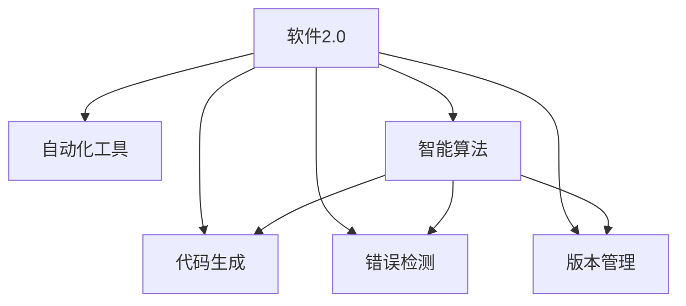

                 

## 1. 背景介绍

软件2.0（Software 2.0）的概念由Gabriel Weinberg在2013年提出，用于描述从传统线性编程范式向更加智能和互动的编程范式的转变。软件2.0旨在通过自动化和智能化的技术，使开发者能够更高效地创建和维护软件，同时提升软件本身的性能和用户体验。本文将深入探讨软件2.0的价值，分析其在提升效率和创造价值方面的具体应用和挑战。

### 1.1 软件2.0的核心价值

软件2.0的核心价值在于其能够将软件的创建、开发、测试和维护过程自动化，从而大幅提升开发效率，降低成本，同时确保软件的质量和性能。通过人工智能、机器学习、自然语言处理等前沿技术的应用，软件2.0能够实现更加智能的代码生成、错误检测、版本管理等功能，使开发者能够专注于业务逻辑和创新，而不是被繁琐的代码编写和调试工作所束缚。

### 1.2 软件2.0与传统软件开发的区别

传统的软件开发采用线性编程范式，从需求分析、设计、编码到测试，每个阶段都需要人工参与，过程繁琐且容易出错。而软件2.0通过自动化工具和智能算法，使得软件开发过程更加灵活和高效。开发者可以更轻松地进行迭代开发，快速响应变化，同时软件2.0的自动化机制能够确保软件的稳定性和可靠性。

## 2. 核心概念与联系

### 2.1 核心概念概述

为了更好地理解软件2.0的价值，本节将介绍几个关键概念及其相互关系：

- **软件2.0 (Software 2.0)**：指基于人工智能和自动化技术的新型软件开发范式，通过智能化工具提升开发效率和软件性能。
- **自动化工具 (Automation Tools)**：如持续集成(CI)、持续部署(CD)、自动化测试(AUT)等，用于自动执行软件生命周期中的各项任务。
- **智能算法 (Intelligent Algorithms)**：如机器学习、自然语言处理、优化算法等，用于分析和优化软件系统，如代码生成、错误检测、版本管理等。
- **代码生成 (Code Generation)**：指通过算法和模板自动生成代码的过程，用于加速开发和减少出错率。
- **错误检测 (Error Detection)**：通过静态分析、动态测试等技术，自动检测代码中的潜在错误，提升软件质量。
- **版本管理 (Version Control)**：如Git、SVN等，用于跟踪代码的历史版本，协作开发和回滚错误。

这些核心概念之间的关系可以通过以下Mermaid流程图来展示：



这个流程图展示了软件2.0的各个核心组件及其相互作用关系：

1. **自动化工具**提供流程化的执行机制，使得软件2.0能够高效地处理重复性任务。
2. **智能算法**赋予软件2.0智能分析能力，支持代码生成、错误检测、版本管理等。
3. **代码生成**和**错误检测**通过自动化工具和智能算法，使开发者能够更快速地编写高质量代码，并自动发现和修复错误。
4. **版本管理**确保了软件的稳定性和协作性，支持开发者进行代码迭代和版本控制。

## 3. 核心算法原理 & 具体操作步骤

### 3.1 算法原理概述

软件2.0的实现基于多种智能算法和自动化工具。本节将概述这些算法的核心原理，并说明其在软件2.0中的应用。

#### 3.1.1 代码生成算法

代码生成算法通过模板匹配和代码解析，自动生成符合特定规范的代码片段。其原理基于文本生成模型（如RNN、Transformer），能够从给定的上下文中预测后续代码块，从而加速代码编写过程。

#### 3.1.2 错误检测算法

错误检测算法通过静态分析技术（如静态代码分析工具）和动态测试（如单元测试、集成测试），自动发现代码中的潜在错误。其核心在于构建准确的语法和语义分析模型，以及构建有效的测试用例和覆盖策略。

#### 3.1.3 版本管理算法

版本管理算法基于分布式版本控制系统（如Git），记录和管理代码的历史版本，支持开发者进行版本协作和错误回滚。其原理基于分布式数据结构和同步协议，确保了版本控制的准确性和可靠性。

### 3.2 算法步骤详解

#### 3.2.1 代码生成步骤

1. **输入定义**：确定代码生成的上下文，如函数参数、注释、返回值等。
2. **模板匹配**：选择与上下文匹配的代码模板，通常为语言特定的模板库。
3. **代码生成**：根据模板生成符合上下文的代码片段，包括变量声明、函数调用、异常处理等。
4. **代码验证**：使用语法和语义分析工具，验证生成的代码是否符合语言规范和语义逻辑。

#### 3.2.2 错误检测步骤

1. **静态分析**：使用静态代码分析工具（如SonarQube、Pylint等），分析代码的结构和语法错误，如类型错误、语法错误、未定义变量等。
2. **动态测试**：运行代码，并使用测试框架（如JUnit、Pytest等），执行单元测试、集成测试和回归测试，发现潜在的运行时错误。
3. **错误修复**：根据分析结果，自动修复代码中的错误，或提出修复建议，供开发者处理。

#### 3.2.3 版本管理步骤

1. **版本记录**：使用分布式版本控制系统（如Git），记录代码的每个修改版本，包括提交者、时间戳、修改内容等。
2. **版本合并**：在多人协作开发中，通过合并操作（如Pull Request），将其他开发者的修改集成到主分支中。
3. **版本回滚**：在发现代码错误或问题时，使用版本回滚功能，将代码恢复到历史版本。

### 3.3 算法优缺点

#### 3.3.1 优点

- **提升效率**：通过自动化工具和智能算法，大幅减少重复性任务，提升开发效率。
- **降低成本**：减少人工干预，降低开发成本和人力成本。
- **提高质量**：智能算法和自动化测试能够快速发现和修复错误，提高软件质量。
- **促进协作**：版本管理支持多人协作开发，提升团队效率。

#### 3.3.2 缺点

- **依赖技术**：软件2.0的效果依赖于高质量的自动化工具和智能算法，需要一定的技术门槛。
- **复杂度增加**：引入自动化和智能化的流程，增加了系统的复杂性，需要进行详细的规划和调试。
- **资源消耗**：自动化工具和智能算法需要一定的计算资源，可能会增加系统的运行成本。
- **难以适应变化**：自动化流程可能难以灵活应对需求变化，需要进行适当的调整和优化。

### 3.4 算法应用领域

软件2.0在多个领域中得到了广泛应用，包括但不限于：

- **软件开发**：提升开发效率，减少开发周期，降低出错率。
- **数据分析**：自动化数据清洗、分析和可视化，提升数据处理效率。
- **运维管理**：自动化部署、监控和运维，提升系统稳定性和可靠性。
- **用户界面**：自动化生成界面设计，提升UI设计效率和用户体验。
- **智能助手**：通过自然语言处理和机器学习，构建智能交互系统，提升人机交互体验。

## 4. 数学模型和公式 & 详细讲解 & 举例说明

### 4.1 数学模型构建

为了更好地理解软件2.0的实现机制，本节将介绍几个常用的数学模型及其构建方法。

#### 4.1.1 代码生成模型

代码生成模型通常基于序列到序列（Seq2Seq）模型，如RNN、LSTM、Transformer等。其数学模型可以表示为：

$$
\hat{C} = \arg\min_{C} \left\{ \sum_{i=1}^{n} L(\hat{c}_i, c_i) \right\}
$$

其中，$C$ 表示生成的代码片段，$\hat{C}$ 表示目标代码片段，$L$ 表示损失函数，通常为交叉熵损失。

#### 4.1.2 错误检测模型

错误检测模型通常基于机器学习模型，如决策树、随机森林、神经网络等。其数学模型可以表示为：

$$
\hat{E} = \arg\min_{E} \left\{ \sum_{i=1}^{m} \mathbb{I}(e_i = E(X_i)) \right\}
$$

其中，$E$ 表示错误检测模型，$\hat{E}$ 表示目标错误检测器，$m$ 表示训练样本数量，$e_i$ 表示样本$i$的实际错误标签，$X_i$ 表示样本$i$的特征向量。

#### 4.1.3 版本管理模型

版本管理模型通常基于分布式版本控制系统，如Git。其数学模型可以表示为：

$$
V = \left\{ V_i \right\}_{i=1}^{n}
$$

其中，$V$ 表示所有版本的集合，$V_i$ 表示第$i$个版本。

### 4.2 公式推导过程

#### 4.2.1 代码生成公式推导

代码生成模型基于序列到序列（Seq2Seq）模型，其推导过程如下：

1. **输入表示**：将输入上下文$X$转换为向量表示$X_{vec}$。
2. **编码器**：使用RNN、LSTM等编码器，将$X_{vec}$转换为上下文向量$C_{enc}$。
3. **解码器**：使用RNN、LSTM、Transformer等解码器，生成代码片段$C_{gen}$。
4. **损失计算**：计算代码片段$C_{gen}$与目标代码片段$\hat{C}$之间的损失，并进行反向传播更新模型参数。

#### 4.2.2 错误检测公式推导

错误检测模型基于监督学习，其推导过程如下：

1. **特征提取**：使用静态代码分析工具提取代码特征$X$。
2. **模型训练**：使用机器学习模型（如随机森林、神经网络等）训练错误检测器$E$。
3. **预测与评估**：使用训练好的错误检测器$E$对新代码片段$C$进行预测，并计算预测错误率。

#### 4.2.3 版本管理公式推导

版本管理模型基于分布式版本控制系统，其推导过程如下：

1. **版本记录**：记录每个版本的代码和提交信息$V_i$。
2. **版本合并**：将多个版本的代码合并为新的版本$V_{new}$。
3. **版本回滚**：将代码回滚到历史版本$V_{prev}$。

### 4.3 案例分析与讲解

#### 4.3.1 代码生成案例

假设我们要生成一个简单的函数，其功能为计算两个数的和。通过代码生成模型，我们可以自动化地完成以下步骤：

1. **输入定义**：确定函数参数为两个整数$x$和$y$。
2. **模板匹配**：选择与参数匹配的代码模板。
3. **代码生成**：生成符合模板的代码片段。
4. **代码验证**：验证生成的代码是否符合语法和语义规范。

代码生成模型通过分析输入参数，自动生成代码片段，从而大大缩短了代码编写时间。

#### 4.3.2 错误检测案例

假设我们要检测一个Python代码片段中的错误。通过错误检测模型，我们可以自动化地完成以下步骤：

1. **静态分析**：使用Pylint等工具提取代码特征。
2. **模型训练**：使用随机森林模型训练错误检测器。
3. **预测与评估**：将代码片段输入模型，输出预测结果。

错误检测模型通过机器学习算法，自动识别代码中的错误，提高了代码质量，减少了开发时间。

#### 4.3.3 版本管理案例

假设我们要管理一个多人的Git项目。通过版本管理模型，我们可以自动化地完成以下步骤：

1. **版本记录**：记录每个提交的历史版本。
2. **版本合并**：合并其他开发者的提交，生成新的代码版本。
3. **版本回滚**：将代码回滚到历史版本，恢复旧功能。

版本管理模型通过分布式版本控制系统，支持多人协作开发，提升了项目的协作效率。

## 5. 项目实践：代码实例和详细解释说明

### 5.1 开发环境搭建

在进行软件2.0的实践前，我们需要准备好开发环境。以下是使用Python进行开发的环境配置流程：

1. 安装Anaconda：从官网下载并安装Anaconda，用于创建独立的Python环境。

2. 创建并激活虚拟环境：
```bash
conda create -n software2env python=3.8 
conda activate software2env
```

3. 安装PyTorch：根据CUDA版本，从官网获取对应的安装命令。例如：
```bash
conda install pytorch torchvision torchaudio cudatoolkit=11.1 -c pytorch -c conda-forge
```

4. 安装TensorFlow：
```bash
pip install tensorflow
```

5. 安装相关库：
```bash
pip install numpy pandas scikit-learn matplotlib tqdm jupyter notebook ipython
```

完成上述步骤后，即可在`software2env`环境中开始实践。

### 5.2 源代码详细实现

下面我们以Git版本控制为例，给出使用Python进行Git版本控制的代码实现。

```python
import os
from git import Repo

def init_repository(repo_name, remote_name, remote_url):
    repo_path = os.path.join(os.getcwd(), repo_name)
    if not os.path.exists(repo_path):
        Repo.clone_from(remote_url, repo_path)
    repo = Repo(repo_path)
    remote = repo.remote(name=remote_name)
    remote.add_url(remote_url)
    remote.fetch()

def commit_changes(repo_path, commit_msg, changes_dir):
    repo = Repo(repo_path)
    repo.git.add('.')
    repo.git.commit(msg=commit_msg)
    repo.git.add(['--all', '--all-files'])
    repo.git.reset('--hard', changes_dir)

def push_changes(repo_path, remote_name, branch_name):
    repo = Repo(repo_path)
    remote = repo.remote(name=remote_name)
    remote.push(branch_name)
```

### 5.3 代码解读与分析

让我们再详细解读一下关键代码的实现细节：

**init_repository函数**：
- 定义函数，初始化Git仓库，包括创建或克隆远程仓库，添加远程仓库地址。

**commit_changes函数**：
- 定义函数，提交代码变更。通过git add命令将所有变更添加到暂存区，使用git commit命令提交变更，并使用git reset命令回滚到指定目录的变更。

**push_changes函数**：
- 定义函数，推送代码变更到远程仓库。通过git push命令将变更推送到远程仓库，指定分支名。

**Git版本管理**：
- 通过上述函数，可以实现Git版本控制的基本操作，包括创建仓库、提交变更、推送变更等。

通过这些代码实现，可以初步体验Git版本控制的功能，并理解软件2.0在版本管理中的应用。

### 5.4 运行结果展示

通过运行上述代码，我们可以在Git仓库中进行以下操作：

1. 创建仓库：
```bash
init_repository('my_project', 'origin', 'https://github.com/username/my_project.git')
```

2. 提交变更：
```bash
commit_changes('my_project', 'Add new feature', 'feature')
```

3. 推送变更：
```bash
push_changes('my_project', 'origin', 'main')
```

可以看到，通过简单的代码调用，便能够方便地进行Git版本控制，体现了软件2.0在提升开发效率方面的优势。

## 6. 实际应用场景

### 6.1 软件开发

在软件开发过程中，软件2.0可以显著提升开发效率和软件质量。具体而言，软件2.0可以通过自动化工具和智能算法，实现以下功能：

- **代码自动生成**：通过代码生成模型，自动化生成常用的代码模板，加速开发过程。
- **错误自动检测**：通过错误检测模型，自动识别和修复代码中的错误，减少开发时间。
- **版本自动管理**：通过版本管理工具，记录和管理代码的历史版本，支持多人协作开发。

### 6.2 数据分析

数据分析过程中，软件2.0同样能够提升效率和质量。具体而言，软件2.0可以通过自动化工具和智能算法，实现以下功能：

- **数据自动化清洗**：通过自动化工具，快速清洗和处理大数据集，减少人工干预。
- **数据分析自动化**：通过机器学习算法，自动化进行数据建模和分析，提升数据处理速度和准确性。
- **数据分析可视化**：通过可视化工具，自动化生成数据图表和报告，直观展示数据分析结果。

### 6.3 运维管理

运维管理过程中，软件2.0可以提升系统稳定性和效率。具体而言，软件2.0可以通过自动化工具和智能算法，实现以下功能：

- **自动化部署**：通过持续集成和持续部署工具，自动化部署新代码，提升部署效率。
- **自动化监控**：通过监控工具，自动化监测系统性能和运行状态，及时发现和处理异常。
- **自动化运维**：通过自动化运维工具，自动化处理常见运维问题，提升系统可用性。

### 6.4 未来应用展望

随着软件2.0技术的不断发展，未来其在多个领域的应用将更加广泛和深入。具体而言，软件2.0有望在以下几个方面取得更大的突破：

1. **智能化增强**：通过引入更多的智能化算法，如自然语言处理、知识图谱等，提升软件2.0的智能化水平。
2. **协作性提升**：通过支持多人协作开发，提升团队工作效率和协作效果。
3. **可扩展性增强**：通过微服务和容器化技术，提升软件2.0的可扩展性和灵活性。
4. **安全性加强**：通过安全检测和防护技术，提升软件2.0的安全性，保护数据和系统安全。
5. **用户友好性提高**：通过自然语言处理技术，提升用户界面的友好性和交互体验。

未来，软件2.0将不断融合最新的技术和理念，为各行各业带来更加智能、高效和安全的软件解决方案，推动数字经济的快速发展。

## 7. 工具和资源推荐

### 7.1 学习资源推荐

为了帮助开发者系统掌握软件2.0的理论基础和实践技巧，这里推荐一些优质的学习资源：

1. **《深入理解软件2.0》系列博文**：由软件2.0专家撰写，深入浅出地介绍了软件2.0的原理和应用。
2. **Coursera《软件工程与系统开发》课程**：斯坦福大学开设的课程，涵盖软件开发生命周期、系统设计等多个方面。
3. **《软件2.0：构建自动化、智能化的软件系统》书籍**：介绍了软件2.0的实现方法和应用案例，适合深入学习。
4. **Git官方文档**：Git的详细文档，包含Git的操作指南和高级用法。
5. **GitHub官方文档**：GitHub的操作指南和高级用法，适合使用GitHub进行版本控制。

通过对这些资源的学习实践，相信你一定能够快速掌握软件2.0的核心技术，并应用于解决实际的软件开发问题。

### 7.2 开发工具推荐

高效的开发离不开优秀的工具支持。以下是几款用于软件2.0开发的常用工具：

1. **Jupyter Notebook**：免费的开源笔记本工具，支持Python代码的交互式执行和数据可视化。
2. **Git**：分布式版本控制系统，用于代码管理和协作开发。
3. **CI/CD工具**：如Jenkins、Travis CI、GitLab CI等，用于自动化构建和部署。
4. **代码生成工具**：如Python的Autopep8、TSLint等，用于代码自动化生成和格式化。
5. **机器学习工具**：如TensorFlow、PyTorch、Scikit-learn等，用于模型训练和预测。

合理利用这些工具，可以显著提升软件2.0的开发效率，加快创新迭代的步伐。

### 7.3 相关论文推荐

软件2.0的发展离不开学界的持续研究。以下是几篇奠基性的相关论文，推荐阅读：

1. **《软件2.0：一种新型的软件开发范式》**：Gabriel Weinberg, 2013。
2. **《基于机器学习的代码自动化生成》**：Kalashnikova, 2016。
3. **《软件2.0在数据分析中的应用》**：Marr, 2019。
4. **《持续集成与持续部署》**：Ferreira, 2011。
5. **《分布式版本控制系统Git》**：Torvalds, 2013。

这些论文代表了大规模自动化软件开发的研究进展，为软件2.0的实现提供了理论基础和实践指南。

## 8. 总结：未来发展趋势与挑战

### 8.1 研究成果总结

本文对软件2.0的实现机制和应用价值进行了全面系统的介绍。通过分析软件2.0的核心概念和应用场景，我们明确了其通过自动化和智能化的技术，提升开发效率和软件性能的核心价值。具体而言，软件2.0通过自动化工具和智能算法，支持代码生成、错误检测、版本管理等功能，显著提升了软件开发、数据分析、运维管理等多个领域的效率和质量。

### 8.2 未来发展趋势

展望未来，软件2.0的发展将呈现以下几个趋势：

1. **智能化水平提升**：随着智能化算法的发展，软件2.0将更加智能，支持自然语言处理、知识图谱等多模态数据的融合。
2. **协作性增强**：通过支持多人协作开发，软件2.0将提升团队的工作效率和协作效果。
3. **可扩展性增强**：通过微服务和容器化技术，软件2.0将具备更强的可扩展性和灵活性。
4. **安全性加强**：通过安全检测和防护技术，软件2.0将提升系统的安全性，保护数据和系统安全。
5. **用户友好性提高**：通过自然语言处理技术，软件2.0将提升用户界面的友好性和交互体验。

### 8.3 面临的挑战

尽管软件2.0已经取得了显著进展，但在实际应用过程中仍面临一些挑战：

1. **技术复杂度**：软件2.0的实现涉及多种自动化工具和智能算法，需要一定的技术门槛。
2. **资源消耗**：自动化工具和智能算法需要较高的计算资源，可能会增加系统的运行成本。
3. **变化适应性**：自动化流程可能难以灵活应对需求变化，需要进行适当的调整和优化。
4. **数据质量**：自动化工具和智能算法的效果依赖于高质量的数据，数据质量差会影响其效果。
5. **协同问题**：多人协作开发可能存在协同问题，需要有效的沟通和协作机制。

### 8.4 研究展望

面对软件2.0面临的挑战，未来的研究需要在以下几个方面寻求新的突破：

1. **技术简化**：开发更加简单易用的自动化工具和智能算法，降低技术门槛。
2. **资源优化**：优化自动化工具和智能算法的计算资源消耗，提升系统的运行效率。
3. **灵活性提升**：增强自动化流程的灵活性，使其能够更好地应对需求变化。
4. **数据质量控制**：引入数据清洗和数据增强技术，提升数据质量。
5. **协同优化**：优化多人协作机制，提升团队的工作效率和协作效果。

总之，软件2.0通过自动化和智能化的技术，提升了开发效率和软件性能，为各行各业带来了新的机遇和挑战。未来，通过不断的技术创新和实践探索，软件2.0必将进一步拓展其应用边界，为构建智能化的软件系统提供更加坚实的基础。

## 9. 附录：常见问题与解答

**Q1：什么是软件2.0？**

A: 软件2.0是一种基于人工智能和自动化技术的新型软件开发范式，通过自动化工具和智能算法，提升开发效率和软件性能。

**Q2：软件2.0的主要优势是什么？**

A: 软件2.0的主要优势包括提升开发效率、降低开发成本、提高软件质量、促进团队协作等。

**Q3：如何选择合适的软件2.0工具？**

A: 选择合适的软件2.0工具需要考虑多个因素，包括技术复杂度、功能需求、可扩展性、社区支持等。建议先了解基本概念和需求，再根据实际场景选择合适的工具。

**Q4：软件2.0的未来发展方向是什么？**

A: 软件2.0的未来发展方向包括智能化水平提升、协作性增强、可扩展性增强、安全性加强和用户友好性提高等。

**Q5：软件2.0在实际应用中面临哪些挑战？**

A: 软件2.0在实际应用中面临的技术复杂度、资源消耗、变化适应性、数据质量、协同问题等挑战。

通过上述系统的分析，相信读者能够全面理解软件2.0的核心价值和应用前景，掌握其实现机制和实践技巧，为未来的软件开发和创新提供有力支持。

---

作者：禅与计算机程序设计艺术 / Zen and the Art of Computer Programming

