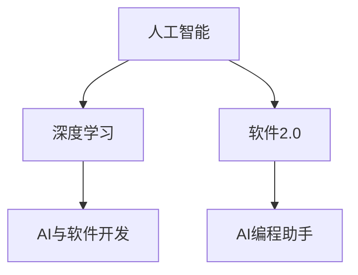

                 

# 软件 2.0 的哲学思考：人工智能的本质

> 关键词：人工智能，软件2.0，深度学习，计算机程序设计，算法优化，未来趋势

## 1. 背景介绍

### 1.1 问题由来

人工智能(AI)作为现代科技的重要前沿，近年来在理论和应用上都取得了长足的进展。从最初的符号推理和专家系统，到机器学习、深度学习、强化学习等新范式，AI不断拓展其能力边界，向着更智能、更通用化的方向发展。

软件2.0（Software 2.0）的概念由John Gara首次提出，强调软件在进化和自适应方面的能力。软件2.0超越了传统软件开发的范式，通过自动化、智能化等手段，显著提高了软件开发的效率和质量。AI技术在软件开发中的应用，如代码自动生成、需求分析、测试优化等，是软件2.0的重要实践方向。

在AI和软件2.0的交融中，我们需要深入思考AI的本质，以及它如何促进软件发展。本文将从哲学角度出发，探讨AI的核心特征，分析其在软件2.0中的作用，并展望未来AI和软件开发的发展趋势。

### 1.2 问题核心关键点

- **人工智能的本质**：探讨AI背后的数学基础、计算模型、推理机制等。
- **软件2.0与AI**：分析AI技术如何在软件开发中发挥作用，提升软件系统的智能化、自动化水平。
- **AI的应用场景**：具体应用案例，如自动代码生成、需求推理、优化测试等。
- **未来趋势**：AI在软件开发中的未来发展方向，如AI辅助设计、智能编程助手等。

## 2. 核心概念与联系

### 2.1 核心概念概述

为了更好地理解AI和软件2.0的联系，本文将介绍几个关键概念：

- **人工智能**：以数据驱动、模型驱动的方法，实现机器的智能推理和决策。
- **深度学习**：通过多层神经网络结构，学习数据的抽象表征，实现复杂的模式识别和预测。
- **软件2.0**：强调软件的自适应和进化能力，通过AI技术实现自动化、智能化开发。
- **AI与软件开发**：将AI技术应用于软件开发过程，提升效率和质量。
- **AI编程助手**：智能化的编程工具，辅助开发人员实现代码自动生成、错误检测、代码优化等。

这些概念之间的逻辑关系可以通过以下Mermaid流程图来展示：



这个流程图展示了我AI、深度学习、软件2.0以及AI在软件开发中的应用之间的联系。

## 3. 核心算法原理 & 具体操作步骤
### 3.1 算法原理概述

AI的核心算法原理主要包括：

- **神经网络**：通过多层神经元的组合，实现数据的非线性映射和复杂模式的学习。
- **深度学习**：多层神经网络的堆叠，可以学习更加抽象和复杂的特征表示。
- **强化学习**：通过试错反馈，优化模型的决策策略。

软件2.0中，AI的应用主要体现在自动化和智能化方面。具体而言：

- **自动化测试**：通过AI生成测试用例、执行测试、评估测试结果等，提升测试效率和质量。
- **需求分析**：通过自然语言处理(NLP)技术，自动理解用户需求，生成技术需求文档。
- **代码自动生成**：利用AI生成代码片段，辅助开发人员编写代码。
- **智能编程助手**：提供代码补全、错误检测、优化建议等功能，提升开发效率。

### 3.2 算法步骤详解

AI在软件2.0中的应用，通常包括以下几个关键步骤：

**Step 1: 数据准备**

- 收集并标注相关数据，作为训练AI模型的基础。
- 数据标注要求准确、完备，以便训练出高质量的模型。

**Step 2: 模型选择与训练**

- 根据具体需求选择合适的AI模型。如深度神经网络、卷积神经网络、循环神经网络等。
- 对模型进行训练，使用标注数据优化模型参数。
- 在验证集上评估模型性能，调整超参数，避免过拟合。

**Step 3: 模型集成与应用**

- 将训练好的模型集成到软件开发环境中，如IDE、版本控制系统等。
- 提供API接口，让其他系统可以方便地调用AI模型。
- 持续监控模型性能，根据应用反馈进行优化。

**Step 4: 持续优化与维护**

- 定期更新模型，适应新数据和新需求。
- 监控模型性能，及时发现并修复问题。
- 维护模型库，确保模型的高质量与可用性。

### 3.3 算法优缺点

AI在软件2.0中的应用，具有以下优点：

- **效率提升**：自动化测试、代码生成、需求分析等，大幅提升软件开发效率。
- **质量保障**：通过AI辅助决策，减少人为错误，提升软件质量。
- **创新驱动**：AI可以发现新的模式和规律，驱动软件开发创新。

同时，AI的应用也存在以下缺点：

- **数据依赖**：AI模型性能依赖于高质量的数据，数据标注成本高。
- **可解释性不足**：AI模型通常视为"黑盒"，难以解释其决策过程。
- **资源消耗**：AI模型训练和推理消耗大量计算资源，成本较高。

### 3.4 算法应用领域

AI在软件2.0中的应用，已经渗透到软件开发的各个环节。具体应用领域包括：

- **自动化测试**：如基于模型的测试生成、基于数据的测试生成、自动化测试执行和结果分析等。
- **需求分析**：如自然语言处理技术，自动分析用户需求，生成技术需求文档。
- **代码自动生成**：如基于语义分析的代码自动生成、基于模板的代码自动生成等。
- **智能编程助手**：如代码补全、错误检测、代码优化建议等。
- **优化资源配置**：如通过AI分析代码依赖关系，优化资源配置和部署。

这些应用领域的探索，为软件2.0的实现提供了新的思路和方法。未来，随着AI技术的不断进步，AI在软件开发中的应用将更加广泛和深入。

## 4. 数学模型和公式 & 详细讲解 & 举例说明

### 4.1 数学模型构建

在AI和软件2.0中，常用的数学模型包括神经网络、卷积神经网络、循环神经网络等。以卷积神经网络为例，其基本结构如下图所示：

```
     Input Layer
      |
      V
     Convolution Layer
      |
      V
     Activation Layer
      |
      V
     Pooling Layer
      |
      V
     Dropout Layer
      |
      V
     Fully Connected Layer
      |
      V
     Output Layer
```

其中，Convolution Layer和Fully Connected Layer是核心层，分别用于特征提取和分类。

### 4.2 公式推导过程

以卷积神经网络的反向传播算法为例，其核心公式为：

$$
\frac{\partial \mathcal{L}}{\partial w} = \frac{\partial \mathcal{L}}{\partial z} \frac{\partial z}{\partial w}
$$

其中，$\mathcal{L}$为损失函数，$w$为网络权重，$z$为中间层的输出。具体推导过程如下：

1. 通过链式法则，将损失函数$\mathcal{L}$对权重$w$的梯度分解为：

$$
\frac{\partial \mathcal{L}}{\partial w} = \frac{\partial \mathcal{L}}{\partial z_2} \frac{\partial z_2}{\partial z_1} \frac{\partial z_1}{\partial w}
$$

2. 其中，$\frac{\partial \mathcal{L}}{\partial z_2}$为输出层的梯度，$\frac{\partial z_2}{\partial z_1}$为中间层的梯度，$\frac{\partial z_1}{\partial w}$为权重梯度。

3. 在卷积层中，$\frac{\partial z_2}{\partial z_1}$可以表示为：

$$
\frac{\partial z_2}{\partial z_1} = \frac{\partial \sigma(\mathcal{W} \cdot z_1 + b)}{\partial z_1}
$$

其中，$\mathcal{W}$为卷积核权重，$b$为偏置项，$\sigma$为激活函数。

4. 通过链式法则和激活函数的导数，可以得到：

$$
\frac{\partial \mathcal{L}}{\partial w} = \frac{\partial \mathcal{L}}{\partial z_2} \frac{\partial \sigma(\mathcal{W} \cdot z_1 + b)}{\partial z_1} \frac{\partial \mathcal{W} \cdot z_1 + b}{\partial w}
$$

5. 将上式进一步展开，得到最终的权重梯度公式。

### 4.3 案例分析与讲解

以代码自动生成为例，AI可以通过自然语言处理技术，将用户需求转换为代码片段，辅助开发人员编写代码。具体实现步骤如下：

1. **需求分析**：使用NLP技术，对用户需求进行语义分析，提取关键信息。
2. **生成代码片段**：根据提取的信息，自动生成代码片段，如函数定义、参数、返回值等。
3. **代码优化**：通过AI分析代码依赖关系，自动进行代码优化，如变量重命名、函数提取等。
4. **代码测试**：对生成的代码进行自动测试，确保代码的正确性和完备性。

这个过程中，自然语言处理技术是关键。AI可以通过语义分析、语法分析等技术，将自然语言转换为代码结构。代码生成的过程，可以看作是一个优化过程，AI通过分析代码依赖关系，自动进行代码优化，提高代码质量。

## 5. 项目实践：代码实例和详细解释说明

### 5.1 开发环境搭建

要实现AI在软件2.0中的应用，首先需要搭建好开发环境。以下是Python环境搭建的步骤：

1. 安装Python：从官网下载并安装Python，建议选择最新版本。
2. 安装依赖库：安装常用的Python库，如NumPy、Pandas、Scikit-learn、TensorFlow等。
3. 配置IDE：选择适合自己的IDE，如PyCharm、Jupyter Notebook等，配置好开发环境。

### 5.2 源代码详细实现

以下是一个基于TensorFlow实现卷积神经网络的示例代码：

```python
import tensorflow as tf

# 定义卷积神经网络模型
def conv_net(input_data, labels, num_classes):
    # 输入层
    input_layer = tf.placeholder(tf.float32, [None, input_size], name='input')
    labels = tf.placeholder(tf.float32, [None, num_classes], name='labels')
    
    # 第一层卷积层
    conv1 = tf.layers.conv2d(input_layer, 32, (3, 3), activation=tf.nn.relu)
    pool1 = tf.layers.max_pooling2d(conv1, (2, 2), (2, 2))
    
    # 第二层卷积层
    conv2 = tf.layers.conv2d(pool1, 64, (3, 3), activation=tf.nn.relu)
    pool2 = tf.layers.max_pooling2d(conv2, (2, 2), (2, 2))
    
    # 全连接层
    pool2_flat = tf.reshape(pool2, [-1, 7 * 7 * 64])
    fc1 = tf.layers.dense(pool2_flat, 1024, activation=tf.nn.relu)
    
    # 输出层
    logits = tf.layers.dense(fc1, num_classes)
    prediction = tf.nn.softmax(logits)
    
    # 定义损失函数和优化器
    cross_entropy = tf.reduce_mean(tf.nn.softmax_cross_entropy_with_logits(logits=logits, labels=labels))
    optimizer = tf.train.AdamOptimizer(learning_rate=0.001).minimize(cross_entropy)
    
    return input_layer, labels, logits, prediction, optimizer

# 训练模型
input_size = 28
num_classes = 10
epochs = 10

with tf.Session() as sess:
    input_data, labels, logits, prediction, optimizer = conv_net(input_data, labels, num_classes)
    
    # 初始化变量
    sess.run(tf.global_variables_initializer())
    
    # 训练模型
    for epoch in range(epochs):
        for i in range(train_size):
            sess.run(optimizer, feed_dict={input_data: train_images, labels: train_labels})
        # 评估模型
        acc = sess.run(prediction, feed_dict={input_data: test_images, labels: test_labels})
        print(f'Epoch {epoch+1}, Accuracy: {acc:.2f}')
```

这个代码实现了一个简单的卷积神经网络模型，用于手写数字识别。输入数据为28*28像素的灰度图像，标签为0-9的数字。通过反向传播算法，模型可以不断优化，提高识别准确率。

### 5.3 代码解读与分析

在这个代码中，我们首先定义了卷积神经网络的结构，包括输入层、卷积层、池化层、全连接层和输出层。然后，使用TensorFlow的API实现模型的前向传播和反向传播。在训练过程中，使用交叉熵损失函数和Adam优化器进行模型优化。

卷积层和全连接层是卷积神经网络的核心层，分别用于特征提取和分类。在代码中，我们使用`tf.layers.conv2d`和`tf.layers.dense`函数定义卷积层和全连接层。其中，`tf.nn.relu`函数用于激活函数。

最后，通过`tf.Session`和`sess.run`方法，启动模型训练和评估。在训练过程中，我们不断优化模型参数，直到达到预设的迭代次数。

## 6. 实际应用场景

### 6.1 自动化测试

在软件2.0中，自动化测试是AI应用的重要方向之一。通过AI生成测试用例、执行测试、评估测试结果等，可以大幅提升测试效率和质量。

**案例**：Google的Aim：使用AI生成测试用例，提高代码覆盖率和测试效率。Aim通过分析代码依赖关系，自动生成测试用例，覆盖代码中的关键路径和模块。测试用例生成后，自动执行并评估测试结果，确保代码的正确性。

### 6.2 需求分析

需求分析是软件开发中的重要环节，AI可以通过自然语言处理技术，自动理解用户需求，生成技术需求文档。

**案例**：GitHub的需求提取器：使用NLP技术，自动分析GitHub Issue中的用户需求，生成技术需求文档。需求提取器通过语义分析和实体识别，自动提取需求的关键信息和实体，生成清晰的技术需求文档，方便开发人员理解需求并开发实现。

### 6.3 代码自动生成

代码自动生成是AI在软件开发中广泛应用的技术，通过AI生成代码片段，可以辅助开发人员编写代码。

**案例**：DeepCode：使用AI生成代码片段，辅助开发人员编写代码。DeepCode通过分析代码上下文和结构，自动生成代码片段，如函数定义、参数、返回值等。生成的代码片段可以进行自动补全，提高开发效率。

### 6.4 智能编程助手

智能编程助手是AI在软件开发中的另一个重要应用。通过AI提供代码补全、错误检测、代码优化建议等功能，可以提升开发效率和代码质量。

**案例**：GitHub的Github Copilot：使用AI提供代码补全、错误检测、代码优化建议等功能，提升开发效率。Github Copilot通过分析代码上下文和结构，自动生成代码片段，提供补全建议和优化建议，帮助开发人员编写高质量代码。

### 6.5 未来应用展望

AI在软件2.0中的应用，未来将更加广泛和深入。以下是一些未来应用展望：

1. **AI辅助设计**：使用AI进行代码优化、重构、设计模式推荐等，提升软件设计质量。
2. **智能编程助手**：提供更全面的代码补全、错误检测、代码优化建议等功能，提升开发效率。
3. **需求驱动开发**：使用AI自动分析用户需求，生成技术需求文档，驱动软件开发过程。
4. **自适应测试**：使用AI自动生成测试用例、执行测试、评估测试结果，提升测试效率和质量。

未来，随着AI技术的不断进步，AI在软件开发中的应用将更加广泛和深入。

## 7. 工具和资源推荐

### 7.1 学习资源推荐

为了帮助开发者系统掌握AI和软件2.0的理论基础和实践技巧，这里推荐一些优质的学习资源：

1. **Deep Learning Specialization by Andrew Ng**：斯坦福大学开设的深度学习课程，系统讲解深度学习理论、算法和应用。
2. **CS224n by Stanford University**：自然语言处理课程，涵盖NLP的各个方面，从基础到前沿技术。
3. **TensorFlow官方文档**：TensorFlow的官方文档，提供全面详细的教程和样例代码。
4. **PyTorch官方文档**：PyTorch的官方文档，提供详细的教程和样例代码。
5. **Google Colab**：谷歌提供的在线Jupyter Notebook环境，免费提供GPU/TPU算力，方便开发者快速上手实验。

### 7.2 开发工具推荐

高效的开发离不开优秀的工具支持。以下是几款用于AI和软件2.0开发的常用工具：

1. **TensorFlow**：由Google主导开发的深度学习框架，功能强大，支持GPU/TPU加速。
2. **PyTorch**：由Facebook主导开发的深度学习框架，灵活高效，支持动态图和静态图。
3. **Jupyter Notebook**：强大的笔记本开发环境，支持代码、文档和数据的结合。
4. **GitHub**：代码托管平台，提供版本控制、协作开发、问题跟踪等功能。
5. **Scikit-learn**：常用的机器学习库，提供丰富的机器学习算法和工具。

### 7.3 相关论文推荐

AI和软件2.0的发展源于学界的持续研究。以下是几篇奠基性的相关论文，推荐阅读：

1. **Deep Learning** by Ian Goodfellow, Yoshua Bengio, Aaron Courville：深度学习领域的经典教材，全面讲解深度学习理论和算法。
2. **TensorFlow: A System for Large-Scale Machine Learning** by M. Abadi et al.：介绍TensorFlow框架的设计和实现。
3. **Neural Architecture Search with Reinforcement Learning** by J. Cui et al.：介绍基于强化学习的神经网络架构搜索方法。
4. **Large-Scale Deep Learning for Self-Driving Cars** by A. Ng et al.：介绍大规模深度学习在自动驾驶中的应用。
5. **AutoML: Methods, Systems, Challenges** by Z. Bai et al.：介绍自动机器学习的方法和挑战，推动机器学习自动化发展。

## 8. 总结：未来发展趋势与挑战

### 8.1 研究成果总结

AI和软件2.0的发展带来了软件开发的革命性变革，推动了软件产业的进步。AI在自动化测试、需求分析、代码生成、智能编程助手等领域的应用，提升了软件开发效率和质量。未来，随着AI技术的不断进步，AI在软件开发中的应用将更加广泛和深入。

### 8.2 未来发展趋势

未来，AI和软件2.0的发展将呈现以下几个趋势：

1. **自动化和智能化**：通过AI技术，自动化和智能化将成为软件开发的重要方向。自动化测试、需求分析、代码生成、智能编程助手等技术将进一步完善。
2. **自适应和进化**：通过AI技术，软件系统将具备自适应和进化的能力，根据用户反馈和数据变化，不断优化和改进。
3. **多模态融合**：将文本、语音、图像等多模态信息进行融合，提升系统的智能化水平。
4. **联邦学习和边缘计算**：通过联邦学习和边缘计算技术，提升模型的安全性和隐私性，优化计算效率。
5. **可解释性和透明性**：通过可解释性和透明性技术，提升AI模型的可解释性和可信性，增强用户信任。

### 8.3 面临的挑战

AI和软件2.0的发展仍然面临诸多挑战：

1. **数据质量与标注成本**：高质量的数据和标注是AI技术的基础，但获取高质量数据和标注的成本高，限制了AI技术的应用。
2. **模型复杂性与可解释性**：AI模型往往复杂，难以解释其决策过程，影响其可信性和可靠性。
3. **资源消耗与效率**：AI模型训练和推理消耗大量计算资源，影响其高效性和可扩展性。
4. **隐私与安全**：AI模型的应用可能涉及敏感数据，需要确保数据隐私和安全。
5. **标准化与互操作性**：AI技术的标准化和互操作性问题，需要解决模型、数据、接口等方面的兼容性问题。

### 8.4 研究展望

未来，AI和软件2.0的发展需要在以下几个方面进行深入研究：

1. **自动化机器学习**：通过自动化机器学习技术，降低数据标注和模型训练的成本，提高模型的可解释性和可信性。
2. **多模态融合**：将文本、语音、图像等多模态信息进行融合，提升系统的智能化水平。
3. **联邦学习和边缘计算**：通过联邦学习和边缘计算技术，提升模型的安全性和隐私性，优化计算效率。
4. **可解释性和透明性**：通过可解释性和透明性技术，提升AI模型的可解释性和可信性，增强用户信任。
5. **标准化与互操作性**：制定AI技术的标准化和互操作性规范，解决模型、数据、接口等方面的兼容性问题。

未来，随着AI技术的不断进步，AI和软件2.0将深度融合，共同推动软件产业的创新发展。相信在学界和产业界的共同努力下，AI和软件2.0将引领软件开发进入新的时代。

