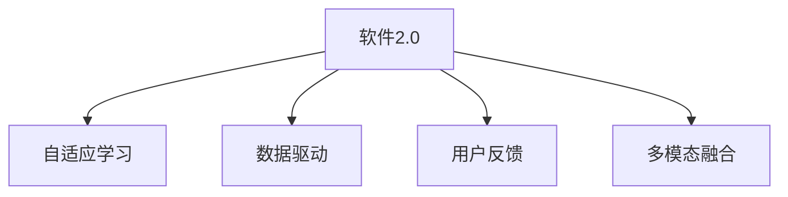

                 

# 软件 2.0 的哲学思考：人工智能的本质

## 1. 背景介绍

在软件发展的历史长河中，经历了从传统软件开发（1.0时代）到开源软件（2.0时代）再到人工智能驱动的智能软件（2.0时代）的演进。当前，软件2.0正处于蓬勃发展之中，其核心特征是通过人工智能技术，使软件具备自学习、自适应的能力，能够基于数据和用户反馈持续优化，从而实现从规则驱动到数据驱动的根本转变。

### 1.1 问题由来

现代软件开发范式主要基于需求分析、系统设计和代码实现的瀑布式流程，依赖人工编码和手动调试。这种范式存在以下局限性：
- 规则驱动：软件依赖于硬编码的逻辑规则，难以应对复杂的现实问题。
- 数据孤立：数据与模型、应用分割开来，难以实现端到端的优化。
- 缺乏智能：软件无法自我学习和适应，难以应对快速变化的环境。

软件2.0的出现，打破了这些局限性，通过人工智能技术，使软件具备了自学习、自适应的智能能力，能够基于数据和用户反馈持续优化，从而实现从规则驱动到数据驱动的根本转变。

### 1.2 问题核心关键点

软件2.0的核心在于其背后的哲学思考和核心算法。其核心关键点包括：
- 数据驱动：软件从规则驱动转变为数据驱动，基于数据而非规则进行决策和优化。
- 自适应学习：软件能够通过自适应学习机制，从经验中不断积累知识，提升性能。
- 用户反馈：用户反馈是软件优化的重要信号，软件能够基于用户反馈进行优化和改进。
- 跨领域融合：软件能够跨越不同领域，实现多模态信息的融合和协同优化。

这些核心关键点构成了软件2.0的本质特征，使其能够适应复杂多变的现实环境，实现从简单到复杂的跨越。

## 2. 核心概念与联系

### 2.1 核心概念概述

为更好地理解软件2.0的本质，本节将介绍几个密切相关的核心概念：

- 软件2.0：基于人工智能技术的智能软件，具备自学习、自适应和用户反馈的能力，能够持续优化。
- 自适应学习：软件能够基于数据和经验，进行自适应学习，提升性能。
- 数据驱动：软件从规则驱动转变为数据驱动，基于数据进行决策和优化。
- 用户反馈：用户反馈是软件优化的重要信号，软件能够基于反馈进行改进。
- 多模态融合：软件能够跨越不同领域，实现多模态信息的融合和协同优化。

这些核心概念之间的逻辑关系可以通过以下Mermaid流程图来展示：



这个流程图展示了自己适应学习的软件2.0的核心概念及其之间的关系：

1. 软件2.0通过自适应学习获得基础能力。
2. 数据驱动是其核心设计原则，软件从规则驱动转变为数据驱动。
3. 用户反馈是软件优化的重要信号。
4. 多模态融合是其重要的应用特性。

## 3. 核心算法原理 & 具体操作步骤
### 3.1 算法原理概述

软件2.0的核心算法原理主要基于机器学习和深度学习技术，使软件能够基于数据进行自学习、自适应和持续优化。其核心思想是：

1. **数据驱动**：软件从规则驱动转变为数据驱动，基于数据而非规则进行决策和优化。
2. **自适应学习**：软件能够基于数据和经验，进行自适应学习，提升性能。
3. **用户反馈**：用户反馈是软件优化的重要信号，软件能够基于反馈进行改进。
4. **多模态融合**：软件能够跨越不同领域，实现多模态信息的融合和协同优化。

### 3.2 算法步骤详解

软件2.0的算法步骤主要包括：

1. **数据准备**：收集和整理数据，包括训练集、验证集和测试集。
2. **模型训练**：基于收集到的数据，训练深度学习模型，使其能够自适应学习。
3. **模型验证**：在验证集上评估模型性能，根据性能指标决定是否进行微调。
4. **模型部署**：将训练好的模型部署到实际应用环境中，持续优化。
5. **用户反馈**：收集用户反馈，基于反馈进行模型优化。

### 3.3 算法优缺点

软件2.0具有以下优点：

1. **高效适应**：能够基于数据和经验进行自适应学习，快速适应复杂多变的环境。
2. **持续优化**：能够持续优化，从经验中不断积累知识，提升性能。
3. **用户友好**：基于用户反馈进行优化，能够更好地满足用户需求。
4. **跨领域融合**：能够实现多模态信息的融合和协同优化，提升系统性能。

同时，该软件2.0也存在一定的局限性：

1. **数据依赖**：高度依赖数据质量，数据偏差可能导致模型性能下降。
2. **计算资源**：需要大量的计算资源进行模型训练和优化，部署成本较高。
3. **模型可解释性**：深度学习模型通常缺乏可解释性，难以理解和调试。
4. **安全风险**：高度依赖数据和模型，可能存在数据泄露和模型攻击的风险。

尽管存在这些局限性，但软件2.0在处理复杂多变的环境、提升系统性能方面具有显著优势，其应用前景广阔。

### 3.4 算法应用领域

软件2.0在多个领域得到了广泛应用，例如：

- **智能推荐系统**：基于用户行为数据和物品特征，推荐系统能够实现自适应学习，为用户推荐更加个性化的内容。
- **智能客服系统**：通过自适应学习机制，智能客服系统能够快速适应用户意图和对话内容，提供更加智能的服务。
- **医疗诊断系统**：基于患者历史数据和症状，诊断系统能够实现自适应学习，提供更加精准的诊断建议。
- **金融风险管理**：通过多模态数据的融合，金融风险管理系统能够实现跨领域优化，提升风险管理能力。
- **智能交通系统**：通过智能分析和预测，交通系统能够实现自适应学习，优化交通流量和运行效率。

## 4. 数学模型和公式 & 详细讲解 & 举例说明

### 4.1 数学模型构建

软件2.0的数学模型主要基于深度学习和机器学习技术，其核心模型为神经网络。神经网络由多层神经元组成，通过反向传播算法进行训练，能够实现数据的自适应学习和优化。

假设输入数据为 $x \in \mathbb{R}^n$，输出为 $y \in \mathbb{R}^m$，模型参数为 $\theta$，则神经网络的输出可以表示为：

$$
y = f_{\theta}(x)
$$

其中，$f_{\theta}(x)$ 表示神经网络的前向传播过程，$\theta$ 表示模型参数。神经网络的损失函数为：

$$
\mathcal{L}(\theta) = \frac{1}{N} \sum_{i=1}^N \ell(y_i, f_{\theta}(x_i))
$$

其中，$\ell$ 表示损失函数，$\ell(y_i, f_{\theta}(x_i))$ 表示每个样本的损失。常见的损失函数包括交叉熵损失、均方误差损失等。

### 4.2 公式推导过程

以交叉熵损失函数为例，其推导过程如下：

假设二分类问题中，模型输出的概率分布为 $p(y=1|x) \in [0,1]$，真实标签为 $y \in \{0,1\}$，则交叉熵损失函数定义为：

$$
\ell(p(y=1|x), y) = -y \log p(y=1|x) - (1-y) \log (1-p(y=1|x))
$$

将其代入经验风险公式，得：

$$
\mathcal{L}(\theta) = -\frac{1}{N} \sum_{i=1}^N [y_i \log p(y=1|x_i) + (1-y_i) \log (1-p(y=1|x_i))]
$$

### 4.3 案例分析与讲解

以智能推荐系统为例，其数学模型构建和公式推导如下：

假设用户行为数据为 $x_i \in \mathbb{R}^n$，物品特征为 $f_i \in \mathbb{R}^m$，用户行为与物品特征的关联关系为 $p(x_i|f_i)$，推荐系统需要最大化用户点击率：

$$
\max_{p} \frac{1}{N} \sum_{i=1}^N p(x_i|f_i)
$$

通过神经网络模型进行训练，得到最优的概率分布 $p(x_i|f_i)$，即可实现自适应学习。

## 5. 项目实践：代码实例和详细解释说明

### 5.1 开发环境搭建

在进行软件2.0项目实践前，我们需要准备好开发环境。以下是使用Python进行PyTorch开发的环境配置流程：

1. 安装Anaconda：从官网下载并安装Anaconda，用于创建独立的Python环境。

2. 创建并激活虚拟环境：
```bash
conda create -n pytorch-env python=3.8 
conda activate pytorch-env
```

3. 安装PyTorch：根据CUDA版本，从官网获取对应的安装命令。例如：
```bash
conda install pytorch torchvision torchaudio cudatoolkit=11.1 -c pytorch -c conda-forge
```

4. 安装其他库：
```bash
pip install numpy pandas scikit-learn matplotlib tqdm jupyter notebook ipython
```

完成上述步骤后，即可在`pytorch-env`环境中开始软件2.0项目实践。

### 5.2 源代码详细实现

以下是一个基于神经网络的智能推荐系统代码实现示例：

```python
import torch
import torch.nn as nn
import torch.optim as optim

# 定义神经网络模型
class Recommender(nn.Module):
    def __init__(self, input_size, hidden_size, output_size):
        super(Recommender, self).__init__()
        self.hidden = nn.Linear(input_size, hidden_size)
        self.out = nn.Linear(hidden_size, output_size)
        
    def forward(self, x):
        x = self.hidden(x)
        x = torch.sigmoid(self.out(x))
        return x
    
# 准备数据
x_train = # 用户行为数据
x_test = # 测试数据
y_train = # 物品标签数据
y_test = # 测试标签数据
    
# 模型训练
model = Recommender(input_size, hidden_size, output_size)
optimizer = optim.SGD(model.parameters(), lr=0.01)
loss_fn = nn.BCELoss()

for epoch in range(100):
    optimizer.zero_grad()
    output = model(x_train)
    loss = loss_fn(output, y_train)
    loss.backward()
    optimizer.step()
    print(f"Epoch {epoch+1}, loss: {loss.item()}")
    
# 模型评估
model.eval()
with torch.no_grad():
    output = model(x_test)
    loss = loss_fn(output, y_test)
    print(f"Test loss: {loss.item()}")
```

### 5.3 代码解读与分析

让我们再详细解读一下关键代码的实现细节：

**定义神经网络模型**：
- `Recommender`类：定义了一个简单的前馈神经网络，包含一个输入层、一个隐藏层和一个输出层。
- `forward`方法：前向传播计算，将输入数据 $x$ 通过隐藏层和输出层，得到预测结果 $y$。

**准备数据**：
- `x_train` 和 `x_test`：用户行为数据和测试数据。
- `y_train` 和 `y_test`：物品标签数据和测试标签数据。

**模型训练**：
- `model`：定义神经网络模型。
- `optimizer`：定义优化器，使用随机梯度下降（SGD）算法。
- `loss_fn`：定义损失函数，使用二元交叉熵（BCE）损失函数。
- `for`循环：对数据集进行多轮训练，每次更新模型参数。

**模型评估**：
- `model.eval()`：将模型设置为评估模式，不进行反向传播。
- `with torch.no_grad()`：在评估过程中不计算梯度。
- `output = model(x_test)`：对测试数据进行前向传播，得到预测结果。
- `loss = loss_fn(output, y_test)`：计算测试数据上的损失。

## 6. 实际应用场景

### 6.1 智能推荐系统

基于深度学习的智能推荐系统已经在电商、视频、音乐等多个领域得到了广泛应用。智能推荐系统能够根据用户行为数据和物品特征，自适应学习，推荐更加个性化的内容，提升用户体验和转化率。

在技术实现上，可以收集用户历史行为数据和物品特征，构建用户-物品关联矩阵。使用神经网络模型对矩阵进行训练，得到最优的推荐模型。微调模型参数，提高推荐精度和速度。

### 6.2 智能客服系统

智能客服系统能够基于用户输入的自然语言，进行意图识别和对话生成，提供智能化的客服服务。智能客服系统通常采用基于深度学习的对话生成模型，通过自适应学习机制，提升对话生成质量。

在技术实现上，可以收集历史客服对话数据，将其标注为意图和回答，构建对话数据集。使用神经网络模型对对话数据集进行训练，得到对话生成模型。微调模型参数，提高对话生成质量和效率。

### 6.3 医疗诊断系统

医疗诊断系统能够基于患者的症状和历史数据，进行自适应学习，提供精准的诊断建议。医疗诊断系统通常采用基于深度学习的分类模型，通过自适应学习机制，提升诊断精度和效率。

在技术实现上，可以收集患者的症状和历史数据，将其标注为疾病类型，构建医疗数据集。使用神经网络模型对医疗数据集进行训练，得到分类模型。微调模型参数，提高诊断精度和效率。

### 6.4 未来应用展望

随着深度学习和神经网络技术的不断进步，基于软件2.0的智能系统将在更多领域得到应用，为各行各业带来变革性影响。

在智慧医疗领域，基于深度学习的智能诊断系统将提升医疗服务的智能化水平，辅助医生诊疗，加速新药开发进程。

在智能教育领域，基于深度学习的智能推荐系统将推荐个性化的学习资源，因材施教，促进教育公平，提高教学质量。

在智慧城市治理中，基于深度学习的智能分析系统将实现城市事件监测、舆情分析、应急指挥等环节，提高城市管理的自动化和智能化水平，构建更安全、高效的未来城市。

## 7. 工具和资源推荐

### 7.1 学习资源推荐

为了帮助开发者系统掌握深度学习、神经网络和软件2.0的理论基础和实践技巧，这里推荐一些优质的学习资源：

1. 《深度学习》（Ian Goodfellow 著）：系统讲解深度学习的基本原理和算法，涵盖自适应学习、数据驱动等核心概念。
2. 《TensorFlow实战深度学习》（张秀礼 著）：基于TensorFlow框架，详细讲解深度学习模型的实现和优化。
3. 《TensorFlow 2.0实战》（孙丽杰 著）：基于TensorFlow 2.0，详细介绍深度学习模型的构建和优化。
4. 《深度学习入门》（斋藤康毅 著）：通过具体案例，深入浅出地讲解深度学习模型的构建和优化。
5. 《深度学习：理论与实践》（Lingpeng Kong 著）：系统讲解深度学习的基本原理和算法，涵盖自适应学习、数据驱动等核心概念。

通过这些资源的学习实践，相信你一定能够快速掌握深度学习、神经网络和软件2.0的精髓，并用于解决实际的NLP问题。

### 7.2 开发工具推荐

高效的开发离不开优秀的工具支持。以下是几款用于深度学习开发和软件2.0实现的常用工具：

1. TensorFlow：由Google主导开发的开源深度学习框架，生产部署方便，适合大规模工程应用。
2. PyTorch：基于Python的开源深度学习框架，灵活动态的计算图，适合快速迭代研究。
3. Weights & Biases：模型训练的实验跟踪工具，可以记录和可视化模型训练过程中的各项指标，方便对比和调优。
4. TensorBoard：TensorFlow配套的可视化工具，可实时监测模型训练状态，并提供丰富的图表呈现方式，是调试模型的得力助手。
5. Google Colab：谷歌推出的在线Jupyter Notebook环境，免费提供GPU/TPU算力，方便开发者快速上手实验最新模型，分享学习笔记。

合理利用这些工具，可以显著提升深度学习模型的开发效率，加快创新迭代的步伐。

### 7.3 相关论文推荐

深度学习和神经网络的发展源于学界的持续研究。以下是几篇奠基性的相关论文，推荐阅读：

1. Deep Neural Networks for Natural Language Processing（Rush et al. 2015）：提出基于神经网络的文本分类和序列标注模型，刷新了多项NLP任务SOTA。
2. Attention is All You Need（Vaswani et al. 2017）：提出了Transformer结构，开启了NLP领域的预训练大模型时代。
3. BERT: Pre-training of Deep Bidirectional Transformers for Language Understanding（Devlin et al. 2018）：提出BERT模型，引入基于掩码的自监督预训练任务，刷新了多项NLP任务SOTA。
4. Language Models are Unsupervised Multitask Learners（Radford et al. 2018）：展示了大规模语言模型的强大zero-shot学习能力，引发了对于通用人工智能的新一轮思考。
5. Parameter-Efficient Transfer Learning for NLP（Howard et al. 2018）：提出Adapter等参数高效微调方法，在不增加模型参数量的情况下，也能取得不错的微调效果。

这些论文代表了大语言模型微调技术的发展脉络。通过学习这些前沿成果，可以帮助研究者把握学科前进方向，激发更多的创新灵感。

## 8. 总结：未来发展趋势与挑战

### 8.1 总结

本文对基于深度学习的智能系统进行了全面系统的介绍。首先阐述了深度学习、神经网络和软件2.0的研究背景和意义，明确了软件2.0在自适应学习、数据驱动等方面的核心思想。其次，从原理到实践，详细讲解了深度学习模型的数学原理和关键步骤，给出了深度学习模型的代码实例。同时，本文还广泛探讨了深度学习模型在智能推荐、智能客服、医疗诊断等多个行业领域的应用前景，展示了深度学习模型的巨大潜力。此外，本文精选了深度学习模型的各类学习资源，力求为读者提供全方位的技术指引。

通过本文的系统梳理，可以看到，基于深度学习的智能系统正在成为各行各业的重要工具，极大地提升了各领域的效率和性能。未来，伴随深度学习技术的不断进步，基于软件2.0的智能系统必将带来更多创新和突破，推动各行业的智能化进程。

### 8.2 未来发展趋势

展望未来，深度学习和神经网络技术将呈现以下几个发展趋势：

1. 模型规模持续增大。随着算力成本的下降和数据规模的扩张，深度学习模型的参数量还将持续增长。超大规模深度学习模型蕴含的丰富知识，有望支撑更加复杂多变的应用场景。
2. 自适应学习更加普及。更多的应用场景将采用基于深度学习的自适应学习机制，实现数据驱动的智能优化。
3. 多模态融合成为常态。深度学习系统将实现跨领域、跨模态的融合，提升系统的性能和适应能力。
4. 模型可解释性增强。更多的深度学习模型将具备可解释性，能够通过因果分析和博弈论工具，提高系统的透明性和可控性。
5. 伦理与安全成为重要课题。深度学习模型的应用将更多地关注伦理和安全问题，避免模型偏见和有害输出。
6. 跨领域应用拓展。深度学习系统将更多地应用于医疗、金融、交通等领域，提升各领域的智能化水平。

以上趋势凸显了深度学习和神经网络技术的广阔前景。这些方向的探索发展，必将进一步提升深度学习系统的性能和应用范围，为各行各业带来更多的创新和突破。

### 8.3 面临的挑战

尽管深度学习和神经网络技术已经取得了瞩目成就，但在迈向更加智能化、普适化应用的过程中，其仍面临着诸多挑战：

1. 数据依赖性。深度学习模型高度依赖数据，数据偏差可能导致模型性能下降。
2. 计算资源需求高。深度学习模型的训练和优化需要大量的计算资源，部署成本较高。
3. 模型可解释性不足。深度学习模型通常缺乏可解释性，难以理解和调试。
4. 安全风险。深度学习模型的应用将更多地关注伦理和安全问题，避免模型偏见和有害输出。
5. 跨领域应用难度大。深度学习系统应用于不同领域时，可能需要重新训练和优化。

尽管存在这些挑战，但深度学习和神经网络技术在处理复杂多变的环境、提升系统性能方面具有显著优势，其应用前景广阔。未来，需要更多地关注模型的可解释性、安全性和跨领域应用的问题，以推动深度学习技术的全面发展和应用。

### 8.4 研究展望

未来，深度学习和神经网络技术需要在以下几个方面寻求新的突破：

1. 探索无监督和半监督学习。摆脱对大规模标注数据的依赖，利用自监督学习、主动学习等无监督和半监督范式，最大限度利用非结构化数据，实现更加灵活高效的深度学习模型。
2. 研究参数高效和计算高效的深度学习模型。开发更加参数高效和计算高效的深度学习模型，在保证性能的同时，减少资源消耗。
3. 引入更多先验知识。将符号化的先验知识，如知识图谱、逻辑规则等，与深度学习模型进行巧妙融合，引导深度学习模型学习更准确、合理的知识表示。
4. 结合因果分析和博弈论工具。将因果分析方法引入深度学习模型，识别出模型决策的关键特征，增强输出解释的因果性和逻辑性。
5. 纳入伦理道德约束。在深度学习模型的训练目标中引入伦理导向的评估指标，过滤和惩罚有偏见、有害的输出倾向。
6. 提升跨领域应用能力。开发更加通用的深度学习模型，能够跨越不同领域，实现多模态信息的融合和协同优化。

这些研究方向将推动深度学习技术的全面发展，使其在各领域中得到更广泛的应用，为社会和经济发展注入新的动力。总之，深度学习技术需要不断地进行技术创新和优化，才能真正实现其在各领域的全面落地和应用。

